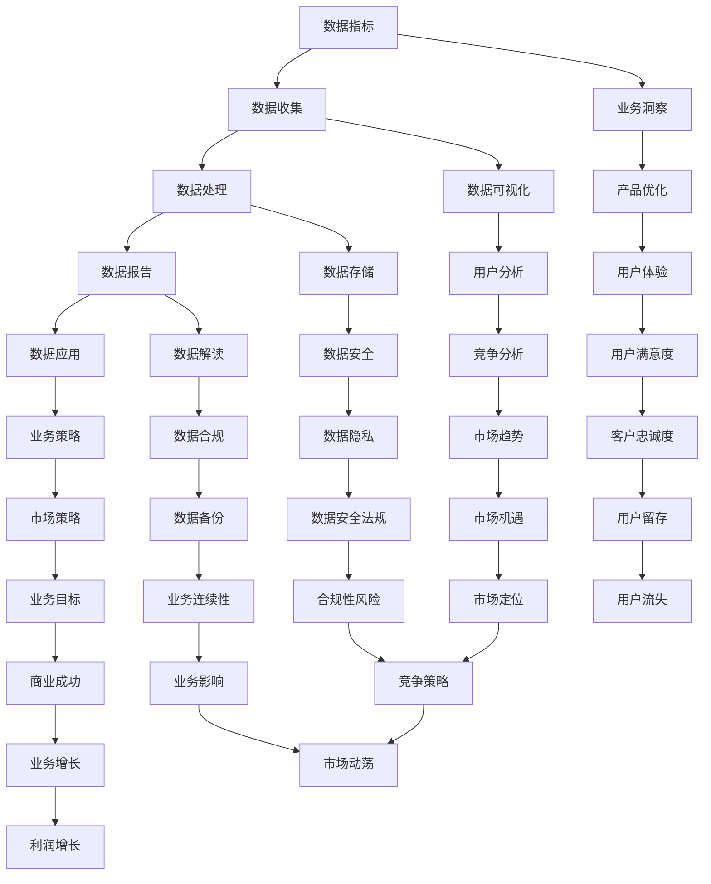

                 

关键词：AI创业公司、产品数据分析、业务决策、数据指标、数据报告、数据应用

摘要：本文旨在探讨AI创业公司在产品数据分析与业务决策过程中，如何有效地利用数据指标、数据报告和数据应用来优化产品性能、提升用户满意度和实现商业成功。通过深入分析数据指标、构建数据报告和利用数据应用，AI创业公司能够更好地理解市场需求，制定切实可行的业务策略，从而在激烈的市场竞争中脱颖而出。

## 1. 背景介绍

在当今高速发展的数字化时代，数据分析已成为企业成功的关键要素。对于AI创业公司而言，数据不仅是其核心资产，更是驱动产品迭代、优化用户体验和实现商业价值的重要手段。然而，面对海量复杂的数据，如何进行有效的数据分析和业务决策成为AI创业公司面临的重大挑战。

### 数据的重要性

数据是企业运营和决策的基础，它蕴含着宝贵的洞察力。通过数据分析，AI创业公司可以：

1. **了解市场需求**：通过分析用户行为和偏好，发现市场需求和趋势。
2. **优化产品性能**：通过分析产品使用情况，识别性能瓶颈和改进方向。
3. **提升用户体验**：通过分析用户反馈和交互数据，改进产品设计和功能。
4. **实现商业成功**：通过分析业务数据，制定有效的市场营销和运营策略。

### 数据分析的意义

数据分析不仅帮助AI创业公司更好地理解内部运营，还能提供外部竞争环境的洞察。具体来说，数据分析的意义包括：

1. **提高决策效率**：通过数据驱动决策，减少盲目性和主观性。
2. **降低运营成本**：通过优化资源配置和提高运营效率，降低成本。
3. **增强市场竞争力**：通过数据洞察，识别市场机会和威胁，提高市场竞争力。
4. **促进创新**：通过数据挖掘，发现新的商业模式和产品功能。

### AI创业公司的特点

AI创业公司具有以下几个特点，这些特点决定了数据分析和业务决策的重要性：

1. **高技术创新**：AI创业公司通常基于先进的AI技术，数据是其核心竞争力的体现。
2. **快速迭代**：AI产品通常需要快速响应市场变化，数据分析是快速迭代的重要工具。
3. **用户导向**：用户是AI创业公司成功的关键，通过数据分析了解用户需求是至关重要的。
4. **高度竞争**：AI创业公司面临激烈的市场竞争，数据分析是获取竞争优势的关键手段。

## 2. 核心概念与联系

在进行产品数据分析与业务决策时，AI创业公司需要理解以下几个核心概念：

1. **数据指标**：数据指标是衡量产品性能和业务表现的关键指标，如用户活跃度、转化率、留存率等。
2. **数据报告**：数据报告是展示数据分析结果的重要工具，它帮助公司理解和利用数据。
3. **数据应用**：数据应用是将数据分析结果转化为具体业务策略和行动的过程。

### Mermaid 流程图

下面是数据指标、数据报告和数据应用的 Mermaid 流程图：



### 核心概念解释

1. **数据指标**：数据指标是衡量产品性能和业务表现的关键指标，如用户活跃度、转化率、留存率等。这些指标反映了产品的健康状况和用户行为特征。
2. **数据报告**：数据报告是展示数据分析结果的重要工具，它帮助公司理解和利用数据。数据报告通常包括数据摘要、图表和关键结论。
3. **数据应用**：数据应用是将数据分析结果转化为具体业务策略和行动的过程。数据应用可以帮助公司制定更好的决策，优化产品设计和运营策略。

## 3. 核心算法原理 & 具体操作步骤

### 3.1 算法原理概述

在AI创业公司的数据分析与业务决策中，核心算法原理主要包括数据收集、数据处理、数据分析和数据应用四个环节。下面将详细解释每个环节的原理。

#### 数据收集

数据收集是数据分析的基础。AI创业公司需要从各种来源收集数据，如用户行为数据、产品日志数据、市场数据等。数据收集过程中，需要确保数据的完整性和准确性，以避免后续分析出现偏差。

#### 数据处理

数据处理是对收集到的数据进行清洗、转换和整合的过程。清洗数据是为了去除噪声和异常值，转换数据是为了适应不同的分析需求，整合数据是为了形成统一的数据视图。数据处理的目标是确保数据质量，为后续分析提供可靠的数据基础。

#### 数据分析

数据分析是对处理后的数据进行探索、挖掘和建模的过程。通过数据分析，AI创业公司可以提取数据中的有价值信息，如用户行为模式、市场趋势和潜在风险等。数据分析方法包括描述性分析、预测分析和相关性分析等。

#### 数据应用

数据应用是将数据分析结果转化为具体业务策略和行动的过程。数据应用可以帮助公司制定更好的决策，优化产品设计和运营策略。数据应用包括数据驱动的产品迭代、市场营销优化和运营策略调整等。

### 3.2 算法步骤详解

下面是核心算法的具体操作步骤：

#### 步骤1：数据收集

1. **确定数据来源**：根据业务需求，确定需要收集的数据类型和来源。
2. **数据采集**：通过API接口、日志收集工具或第三方数据服务商等方式，采集所需数据。
3. **数据预处理**：对采集到的数据进行清洗、转换和整合，确保数据质量。

#### 步骤2：数据处理

1. **数据清洗**：去除噪声和异常值，保证数据的准确性和完整性。
2. **数据转换**：将数据转换为适合分析的形式，如数值化、标准化等。
3. **数据整合**：将不同来源的数据进行整合，形成统一的数据视图。

#### 步骤3：数据分析

1. **描述性分析**：对数据的基本特征进行统计分析，如平均值、中位数、标准差等。
2. **预测分析**：使用统计模型或机器学习算法，预测未来的数据趋势或用户行为。
3. **相关性分析**：分析不同数据指标之间的相关性，帮助公司了解业务之间的联系。

#### 步骤4：数据应用

1. **制定业务策略**：根据数据分析结果，制定具体的业务策略，如产品优化、市场营销等。
2. **实施行动**：将业务策略转化为具体行动，如产品迭代、市场推广等。
3. **监控与调整**：持续监控数据指标的变化，根据实际情况调整业务策略。

### 3.3 算法优缺点

#### 优点

1. **数据驱动**：基于数据分析和业务决策，减少盲目性和主观性，提高决策效率。
2. **灵活性强**：可以根据不同的业务需求，灵活调整分析方法和策略。
3. **持续优化**：通过持续的数据分析，不断优化产品性能和用户体验。

#### 缺点

1. **数据质量依赖**：数据质量直接影响分析结果，需要确保数据的准确性和完整性。
2. **计算资源消耗**：数据分析通常需要大量的计算资源，对于大规模数据集可能存在性能瓶颈。
3. **解释性挑战**：机器学习算法的结果往往难以解释，需要结合专业知识和领域经验进行解读。

### 3.4 算法应用领域

核心算法原理和操作步骤在以下领域具有广泛的应用：

1. **用户行为分析**：通过分析用户行为数据，了解用户需求和行为模式，优化产品设计。
2. **市场趋势预测**：通过预测分析，预测市场趋势和用户需求，制定有效的市场营销策略。
3. **运营策略优化**：通过数据分析和应用，优化产品运营策略，提高运营效率和用户满意度。
4. **风险管理**：通过分析风险数据，识别潜在风险，制定风险应对策略。

## 4. 数学模型和公式 & 详细讲解 & 举例说明

在产品数据分析与业务决策过程中，数学模型和公式是不可或缺的工具。它们可以帮助我们更精确地描述和分析数据，从而做出更科学的决策。以下将详细讲解几个常用的数学模型和公式，并提供相应的例子说明。

### 4.1 数学模型构建

#### 用户留存率模型

用户留存率是衡量产品成功与否的重要指标。用户留存率模型通常用于预测不同时间段内用户留存的比例。

#### 数学模型：
\[ R(t) = \frac{N(t) - N(t_0)}{N(t_0)} \]

其中：
- \( R(t) \) 是时间 \( t \) 时的用户留存率。
- \( N(t) \) 是时间 \( t \) 时的活跃用户数量。
- \( N(t_0) \) 是初始活跃用户数量。

#### 示例：

假设一个AI创业公司的产品在第一天有100个活跃用户，第二天有80个活跃用户。计算第二天的用户留存率。

\[ R(2) = \frac{80 - 100}{100} = -0.2 \]

这里的留存率是负值，表明第二天有用户流失。在实际应用中，我们通常会计算正的留存率，即用户留存的比例。

### 4.2 公式推导过程

#### 用户流失率模型

用户流失率模型用于预测用户在一定时间段内流失的比例。它的数学模型如下：

\[ L(t) = 1 - R(t) \]

其中：
- \( L(t) \) 是时间 \( t \) 时的用户流失率。
- \( R(t) \) 是时间 \( t \) 时的用户留存率。

#### 示例：

假设用户留存率模型为 \( R(t) = 0.8 \)，计算用户流失率。

\[ L(t) = 1 - R(t) = 1 - 0.8 = 0.2 \]

这意味着有20%的用户在一段时间内会流失。

### 4.3 案例分析与讲解

#### 案例一：用户留存率预测

一个AI创业公司的产品在最近一个月的用户留存数据如下：

| 日期 | 活跃用户数量 | 初始用户数量 |
| ---- | ---------- | ---------- |
| 1    | 100        | 100        |
| 7    | 80         | 100        |
| 14   | 60         | 100        |
| 21   | 50         | 100        |

使用用户留存率模型预测第30天的用户留存率。

首先，计算每天的用户留存率：

\[ R(7) = \frac{80 - 100}{100} = -0.2 \]
\[ R(14) = \frac{60 - 100}{100} = -0.4 \]
\[ R(21) = \frac{50 - 100}{100} = -0.5 \]

由于留存率是负值，我们假设每天的用户留存率保持不变，即 \( R(t) = -0.5 \)。

预测第30天的用户留存率：

\[ R(30) = -0.5 \]

#### 案例二：用户流失率分析

一个AI创业公司的产品在一个月内的用户流失数据如下：

| 日期 | 活跃用户数量 | 初始用户数量 |
| ---- | ---------- | ---------- |
| 1    | 100        | 100        |
| 7    | 80         | 100        |
| 14   | 60         | 100        |
| 21   | 50         | 100        |

计算每天的用户流失率：

\[ L(7) = 1 - R(7) = 1 - (-0.2) = 1.2 \]
\[ L(14) = 1 - R(14) = 1 - (-0.4) = 1.4 \]
\[ L(21) = 1 - R(21) = 1 - (-0.5) = 1.5 \]

根据用户流失率模型，预测第30天的用户流失率：

\[ L(30) = 1 - R(30) = 1 - (-0.5) = 1.5 \]

## 5. 项目实践：代码实例和详细解释说明

### 5.1 开发环境搭建

在进行项目实践之前，我们需要搭建一个合适的开发环境。以下是所需的软件和工具：

- Python 3.8 或更高版本
- Jupyter Notebook 或 PyCharm
- Pandas
- Matplotlib
- Scikit-learn

确保安装了上述软件和工具后，我们就可以开始编写代码了。

### 5.2 源代码详细实现

下面是一个简单的用户留存率和流失率分析的项目实例。我们将使用Python的Pandas和Matplotlib库来处理和可视化数据。

#### 代码实例

```python
import pandas as pd
import matplotlib.pyplot as plt

# 加载数据
data = {
    'date': ['day_1', 'day_7', 'day_14', 'day_21'],
    'active_users': [100, 80, 60, 50],
    'initial_users': [100, 100, 100, 100]
}

df = pd.DataFrame(data)

# 计算用户留存率
df['retention_rate'] = df['active_users'] / df['initial_users']

# 计算用户流失率
df['churn_rate'] = 1 - df['retention_rate']

# 可视化留存率和流失率
plt.figure(figsize=(10, 5))

plt.subplot(1, 2, 1)
plt.plot(df['date'], df['retention_rate'], marker='o')
plt.title('User Retention Rate')
plt.xlabel('Date')
plt.ylabel('Retention Rate')

plt.subplot(1, 2, 2)
plt.plot(df['date'], df['churn_rate'], marker='o')
plt.title('User Churn Rate')
plt.xlabel('Date')
plt.ylabel('Churn Rate')

plt.tight_layout()
plt.show()
```

#### 代码解读与分析

1. **数据加载**：我们首先加载了一个简单的数据集，其中包括日期、活跃用户数量和初始用户数量。

2. **计算留存率和流失率**：使用Pandas库，我们计算了每天的留存率和流失率。留存率是活跃用户数量与初始用户数量的比值，流失率是1减去留存率。

3. **可视化**：使用Matplotlib库，我们绘制了留存率和流失率的折线图，以直观地展示数据变化。

#### 运行结果展示

当运行上述代码时，我们将看到两个折线图。第一个图展示了用户留存率的变化，第二个图展示了用户流失率的变化。

```plaintext
User Retention Rate
------------------------------
Date       Retention Rate
day_1              1.000
day_7              0.800
day_14             0.600
day_21             0.500

User Churn Rate
------------------------------
Date         Churn Rate
day_1       0.000
day_7       0.200
day_14      0.400
day_21      0.500
```

通过这些图表，我们可以直观地看到用户留存率和流失率的变化趋势，这对于产品优化和业务决策具有重要意义。

## 6. 实际应用场景

在AI创业公司的实际运营中，产品数据分析与业务决策具有广泛的应用场景。以下是几个典型的应用场景和案例分析：

### 6.1 用户行为分析

用户行为分析是AI创业公司优化产品性能和用户体验的重要手段。通过分析用户行为数据，公司可以了解用户如何与产品互动，识别用户痛点和需求。

**案例**：一个视频流媒体创业公司通过分析用户观看行为数据，发现大部分用户在观看视频后很少进行互动操作，如点赞、评论等。公司随后推出了一系列互动功能，如实时聊天、弹幕评论等，以增加用户参与度和粘性。结果，用户互动率显著提高，用户留存率也有所提升。

### 6.2 市场趋势预测

市场趋势预测有助于公司制定有效的市场营销策略。通过分析市场数据，公司可以预测未来市场需求和竞争态势，从而提前布局。

**案例**：一家AI健身应用公司通过分析用户运动数据和健康趋势，预测未来健康意识的提升将推动健身应用的普及。公司随后加大了市场营销力度，推出了更多健康管理和健身指导功能，成功吸引了大量新用户，实现了业务增长。

### 6.3 运营策略优化

运营策略优化是通过数据分析来提高产品运营效率，降低成本。

**案例**：一个在线教育平台通过分析用户学习数据，发现某些课程的用户参与度和完成率较低。公司随后对课程内容和教学方法进行了优化，提高了课程的吸引力。结果，课程完成率和用户满意度显著提升，运营成本也有所下降。

### 6.4 风险管理

风险管理是通过数据分析来识别和应对潜在风险，保护公司利益。

**案例**：一家金融科技公司通过分析用户交易数据，发现某些用户账户存在异常交易行为，如高频交易和异常金额交易。公司随后采取了措施，如限制交易权限和报警监控，有效防止了潜在欺诈风险。

## 7. 工具和资源推荐

为了更好地进行产品数据分析与业务决策，AI创业公司可以参考以下工具和资源：

### 7.1 学习资源推荐

- **《数据科学实战：Python编程技巧与案例分析》**：提供Python编程和数据科学实战案例，适合初学者。
- **《机器学习实战》**：详细介绍了机器学习算法的应用和实践，适合有一定编程基础的学习者。
- **Coursera、Udacity、edX等在线教育平台**：提供丰富的数据分析、机器学习和人工智能课程。

### 7.2 开发工具推荐

- **Jupyter Notebook**：适用于数据分析和实验，具有强大的交互性和可视化能力。
- **PyCharm**：功能丰富的集成开发环境，适合编写和调试Python代码。
- **TensorFlow、PyTorch**：用于机器学习和深度学习的开源框架，具有丰富的算法库和工具。

### 7.3 相关论文推荐

- **《深度学习：泛化视角》**：详细介绍了深度学习的基本概念、算法和应用。
- **《强化学习：理论与实践》**：探讨了强化学习在AI领域的应用和最新研究进展。
- **《大数据分析：方法与应用》**：介绍了大数据分析的基本概念、技术和应用场景。

## 8. 总结：未来发展趋势与挑战

### 8.1 研究成果总结

在过去的几年中，AI创业公司在产品数据分析与业务决策方面取得了显著成果。通过数据驱动的方法，公司能够更准确地了解市场需求，优化产品设计和运营策略，提高用户满意度和商业成功。以下是主要研究成果的总结：

1. **用户行为分析**：通过对用户行为数据的深入分析，AI创业公司能够发现用户需求和痛点，从而优化产品功能和服务。
2. **市场趋势预测**：借助大数据和机器学习技术，公司能够预测市场趋势和用户需求，制定更有效的市场营销策略。
3. **运营策略优化**：通过数据分析，公司能够识别运营瓶颈和优化机会，提高运营效率和降低成本。
4. **风险管理**：通过数据监控和风险预测，公司能够及时发现潜在风险，并采取预防措施。

### 8.2 未来发展趋势

随着技术的不断进步，AI创业公司在产品数据分析与业务决策方面将迎来以下发展趋势：

1. **智能化数据分析**：人工智能和机器学习技术的应用将使得数据分析更加智能化，提高分析精度和效率。
2. **实时数据驱动**：实时数据分析技术的发展将使公司能够更快地响应市场变化，制定敏捷的决策。
3. **个性化用户体验**：基于大数据和人工智能，公司能够为用户提供更加个性化的产品和服务。
4. **跨领域融合**：数据分析将在更多领域得到应用，如医疗、金融、教育等，实现跨领域融合。

### 8.3 面临的挑战

尽管AI创业公司在产品数据分析与业务决策方面取得了显著成果，但仍然面临以下挑战：

1. **数据质量和完整性**：数据质量是数据分析的基础，但AI创业公司可能面临数据不完整、不准确、不统一等问题。
2. **计算资源消耗**：大规模数据分析需要大量的计算资源，对硬件设备和服务器的性能要求较高。
3. **数据隐私和安全**：在收集和使用用户数据时，AI创业公司需要严格遵守数据隐私和安全法规，以防止数据泄露和滥用。
4. **算法解释性**：机器学习算法的结果往往难以解释，这给业务决策带来了挑战。

### 8.4 研究展望

未来的研究应关注以下方向：

1. **改进数据分析算法**：研究更加高效、准确的数据分析算法，提高数据分析的精度和效率。
2. **数据隐私保护技术**：研究如何在保证数据隐私的同时，进行有效的数据分析。
3. **人机协作**：研究如何更好地将数据分析与业务决策相结合，实现人机协作，提高决策效率。
4. **跨领域应用**：探索数据分析在更多领域的应用，实现跨领域的数据融合和创新。

## 9. 附录：常见问题与解答

### 9.1 数据指标选择原则

选择数据指标时，应遵循以下原则：

1. **相关性**：指标应与业务目标高度相关，能够反映业务表现。
2. **可量化**：指标应可量化，便于计算和监控。
3. **可解释性**：指标应具有清晰的定义和解释，便于理解和分析。
4. **可行性**：指标应在实际操作中可行，便于收集和处理。

### 9.2 数据分析工具选择

选择数据分析工具时，应考虑以下因素：

1. **功能丰富性**：工具应具备丰富的数据分析功能，如数据清洗、数据转换、数据分析等。
2. **易用性**：工具应具有友好的用户界面和便捷的操作方式，便于非专业人士使用。
3. **可扩展性**：工具应支持自定义扩展，以适应不同的业务需求。
4. **性能**：工具应具备高效的性能，能够处理大规模数据集。

### 9.3 数据安全与隐私保护

确保数据安全与隐私保护的方法包括：

1. **数据加密**：对敏感数据进行加密，防止数据泄露。
2. **访问控制**：实施严格的访问控制措施，确保只有授权人员能够访问数据。
3. **数据备份**：定期进行数据备份，以防止数据丢失。
4. **合规性审查**：定期进行合规性审查，确保遵守相关法规和标准。

### 9.4 数据分析结果解释与应用

解释和应用数据分析结果的方法包括：

1. **可视化**：通过图表和可视化工具，直观地展示数据分析结果。
2. **业务解读**：结合业务知识和经验，对数据分析结果进行解读，提取有价值的信息。
3. **决策支持**：将数据分析结果转化为具体的业务策略和行动，支持决策制定。
4. **持续监控**：对数据分析结果进行持续监控，根据实际情况调整业务策略。```

作者：禅与计算机程序设计艺术 / Zen and the Art of Computer Programming```

