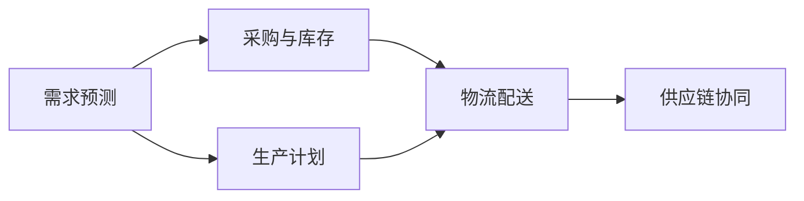

                 

关键词：AI创业、供应链管理、优化策略、数据驱动、智能算法、协同效应

> 摘要：本文深入探讨了AI创业公司在供应链管理方面的策略。通过分析当前市场环境、技术发展趋势以及具体案例，提出了基于数据驱动的供应链管理方法，探讨了智能算法在优化供应链流程中的应用，并展望了未来供应链管理的发展趋势与挑战。

## 1. 背景介绍

在当今快速变化的市场环境中，供应链管理成为了企业成败的关键因素。对于AI创业公司而言，高效的供应链管理不仅能够降低成本，提高效率，还能增强企业的竞争力。然而，传统的供应链管理方法往往无法满足AI创业公司的需求，因为这些公司通常面临着更高的不确定性、复杂性和快速变化的特征。

AI创业公司的供应链管理不仅需要应对供应链中的各种复杂环节，如采购、库存、物流和销售等，还要能够迅速响应市场变化，满足客户需求。这就要求企业具备强大的数据处理和分析能力，利用AI技术来优化供应链各个环节，提高整体运营效率。

### 当前市场环境

当前市场环境呈现出以下几个显著特点：

1. **全球化**：全球供应链的复杂性和依赖性日益增强，企业需要在全球范围内优化供应链布局，提高应对风险的能力。
2. **数字化**：数字化转型已成为企业发展的必然趋势，数字技术正在重塑供应链管理的方式。
3. **个性化**：消费者需求的多样化和个性化趋势，要求企业能够快速调整供应链策略，满足不同客户的需求。
4. **不确定性**：经济、政治和自然灾害等因素带来的不确定性，使得供应链管理面临更大挑战。

### 技术发展趋势

随着人工智能、大数据、云计算等技术的快速发展，供应链管理也在不断演变。以下是几个关键趋势：

1. **智能算法**：利用机器学习和深度学习算法，可以自动化预测供应链需求、优化库存水平和物流路径。
2. **物联网**：物联网技术的应用使得供应链中的各个环节能够实现实时监控和智能控制，提高供应链的透明度和响应速度。
3. **区块链**：区块链技术的不可篡改性和透明性，能够提高供应链的信任度和安全性，减少欺诈和误差。
4. **协同效应**：通过供应链协同管理，实现供应链上各节点企业的信息共享和资源整合，提高整体供应链的效率。

## 2. 核心概念与联系

在深入探讨AI创业公司的供应链管理策略之前，我们需要明确几个核心概念，并理解它们之间的联系。

### 2.1 供应链管理的核心概念

1. **需求预测**：通过分析历史数据和当前市场趋势，预测未来一段时间内的需求量。
2. **库存管理**：在合适的时间，以合理的成本储备必要的物料和产品，以满足市场需求。
3. **物流管理**：优化运输路径和运输方式，确保物料和产品能够及时、准确地到达目的地。
4. **供应链协同**：通过信息共享和资源整合，实现供应链上各节点企业的协同运作。

### 2.2 供应链管理的关键联系

供应链管理中的各个环节相互关联，形成一个有机整体。以下是一个简化的供应链管理流程：

1. **需求预测**：市场需求预测是供应链管理的起点，直接影响后续的库存管理和物流计划。
2. **采购与库存**：根据需求预测，采购原材料和产品，同时进行库存管理，确保物料和产品供应的连续性。
3. **生产计划**：根据库存水平和需求预测，制定生产计划，确保生产能力和需求相匹配。
4. **物流配送**：通过优化运输路径和物流模式，确保产品能够及时送达客户手中。
5. **供应链协同**：实现供应链各环节的信息共享和资源整合，提高整体供应链的效率。

### 2.3 Mermaid 流程图

以下是一个使用Mermaid绘制的简化供应链管理流程图：



在这个流程图中，各节点表示供应链管理的核心环节，箭头表示信息流和物料流的流动方向。通过这个流程图，我们可以清晰地看到供应链管理各环节之间的联系和协同作用。

## 3. 核心算法原理 & 具体操作步骤

### 3.1 算法原理概述

AI创业公司的供应链管理策略的核心在于利用智能算法优化供应链各个环节。以下是几个关键算法原理：

1. **需求预测算法**：利用机器学习算法，如线性回归、决策树和神经网络等，对历史数据进行分析，预测未来需求。
2. **库存优化算法**：通过优化算法，如动态规划、遗传算法和贪心算法等，确定最优库存策略，降低库存成本。
3. **物流路径优化算法**：利用最优化算法，如Dijkstra算法、A*算法和蚁群算法等，确定最优物流路径，提高运输效率。
4. **供应链协同算法**：通过协同优化算法，如博弈论和协同规划算法等，实现供应链各环节的信息共享和资源整合。

### 3.2 算法步骤详解

以下是各算法的具体操作步骤：

### 3.2.1 需求预测算法

1. **数据收集与预处理**：收集历史销售数据、市场趋势数据等，并进行数据清洗和预处理。
2. **特征工程**：根据业务需求，提取和构造预测模型所需的特征。
3. **模型训练**：选择合适的机器学习算法，如线性回归、决策树和神经网络等，对特征进行训练。
4. **模型评估与优化**：使用交叉验证和测试集对模型进行评估，并根据评估结果调整模型参数，优化模型性能。

### 3.2.2 库存优化算法

1. **确定优化目标**：根据企业成本和风险承受能力，确定最优库存策略的目标。
2. **构建优化模型**：使用动态规划或遗传算法等，构建数学模型，表示库存优化问题。
3. **求解优化模型**：使用优化算法，求解最优库存策略。
4. **模型验证与调整**：对优化结果进行验证，并根据实际业务情况调整模型参数。

### 3.2.3 物流路径优化算法

1. **数据收集与预处理**：收集物流网络数据、运输成本数据等，并进行数据清洗和预处理。
2. **构建优化模型**：根据物流需求，构建最优化模型，如Dijkstra算法或A*算法。
3. **求解优化模型**：使用最优化算法，求解最优物流路径。
4. **模型评估与优化**：对优化结果进行评估，并根据评估结果调整模型参数。

### 3.2.4 供应链协同算法

1. **数据共享与集成**：实现供应链各环节的数据共享和集成，确保信息流的畅通。
2. **构建协同优化模型**：根据供应链协同需求，构建协同优化模型。
3. **求解协同优化模型**：使用协同优化算法，求解供应链协同策略。
4. **模型验证与调整**：对协同优化结果进行验证，并根据实际业务情况调整模型参数。

### 3.3 算法优缺点

以下是各算法的优缺点：

#### 需求预测算法

**优点**：能够利用历史数据和机器学习算法，提高需求预测的准确性。

**缺点**：需要大量的数据支持和复杂的模型训练过程，对计算资源要求较高。

#### 库存优化算法

**优点**：能够降低库存成本，提高库存周转率。

**缺点**：需要较长时间的优化过程，且在应对突发情况时，优化效果可能较差。

#### 物流路径优化算法

**优点**：能够提高运输效率，降低运输成本。

**缺点**：在复杂物流网络中，优化算法的计算复杂度较高，且优化结果可能不稳定。

#### 供应链协同算法

**优点**：能够实现供应链各环节的信息共享和资源整合，提高整体供应链效率。

**缺点**：需要各环节企业的协同配合，实施难度较大。

### 3.4 算法应用领域

#### 需求预测算法

- 零售业：预测销售趋势，优化库存管理。
- 制造业：预测原材料需求，优化生产计划。

#### 库存优化算法

- 零售业：降低库存成本，提高库存周转率。
- 制造业：优化原材料和成品库存，提高生产效率。

#### 物流路径优化算法

- 物流公司：优化运输路径，降低运输成本。
- 制造业：优化原材料和成品的物流配送。

#### 供应链协同算法

- 零售业：实现供应链各环节的信息共享和资源整合。
- 制造业：优化生产计划与物流配送，提高整体供应链效率。

## 4. 数学模型和公式 & 详细讲解 & 举例说明

在供应链管理中，数学模型和公式起着至关重要的作用。以下将详细讲解一些常用的数学模型和公式，并通过具体案例进行说明。

### 4.1 数学模型构建

#### 4.1.1 需求预测模型

需求预测模型通常基于时间序列分析方法，其中最常见的模型是ARIMA（自回归积分滑动平均模型）。ARIMA模型由三个部分组成：自回归（AR）、差分（I）和移动平均（MA）。

**公式**：

$$
\Delta X_t = c + \phi_1 \Delta X_{t-1} + \phi_2 \Delta X_{t-2} + \cdots + \phi_p \Delta X_{t-p} + \theta_1 e_{t-1} + \theta_2 e_{t-2} + \cdots + \theta_q e_{t-q}
$$

其中，$X_t$表示时间序列数据，$\Delta X_t$表示一阶差分，$e_t$表示误差项。

#### 4.1.2 库存优化模型

库存优化模型通常基于动态规划算法。动态规划通过将复杂问题分解为子问题，并利用子问题的解来求解原问题。

**公式**：

$$
V_t(x_t) = \min \{ c(x_t, y_t) + V_{t-1}(y_t) \}
$$

其中，$V_t(x_t)$表示第$t$期最优库存成本，$c(x_t, y_t)$表示持有成本和订货成本之和。

#### 4.1.3 物流路径优化模型

物流路径优化模型通常基于最优化算法，如Dijkstra算法和A*算法。这些算法通过计算节点之间的最短路径，来优化物流路径。

**公式**：

$$
d(v, w) = \min \{ d(v, u) + c(u, w) : u \in N \}
$$

其中，$d(v, w)$表示节点$v$到节点$w$的最短路径距离，$c(u, w)$表示边$(u, w)$的权重。

### 4.2 公式推导过程

#### 4.2.1 需求预测模型推导

需求预测模型的推导主要涉及时间序列数据的平稳性检验、自回归项和移动平均项的估计。

1. **平稳性检验**：

   首先，对时间序列数据进行ADF（Augmented Dickey-Fuller）检验，以确定其是否为平稳序列。若序列为非平稳序列，则进行一阶差分，再次进行ADF检验。

   **公式**：

   $$
   \Delta X_t = c + \phi_1 X_{t-1} + \phi_2 X_{t-2} + \cdots + \phi_p X_{t-p} + \theta_1 e_{t-1} + \theta_2 e_{t-2} + \cdots + \theta_q e_{t-q}
   $$

2. **自回归项和移动平均项估计**：

   通过最小二乘法，对自回归项和移动平均项进行估计。

   **公式**：

   $$
   \hat{\phi} = (I - \phi L)^{-1} (c - \theta L e_t)
   $$

   $$
   \hat{\theta} = (I - \theta L)^{-1} (c - \phi L e_t)
   $$

   其中，$L$表示滞后算子，$\hat{\phi}$和$\hat{\theta}$分别表示自回归系数和移动平均系数。

#### 4.2.2 库存优化模型推导

库存优化模型的推导主要涉及动态规划的基本原理。

1. **状态表示**：

   设$x_t$表示第$t$期的库存水平，$y_t$表示第$t$期的订货量。

2. **状态转移方程**：

   根据库存管理的基本原则，第$t+1$期的库存水平取决于第$t$期的库存水平和订货量。

   **公式**：

   $$
   x_{t+1} = x_t + y_t - D_t
   $$

   其中，$D_t$表示第$t$期的需求量。

3. **目标函数**：

   目标函数为最小化持有成本和订货成本之和。

   **公式**：

   $$
   V_t(x_t) = \min \{ c(x_t, y_t) + V_{t-1}(y_t) \}
   $$

#### 4.2.3 物流路径优化模型推导

物流路径优化模型的推导主要涉及最优化算法的基本原理。

1. **状态表示**：

   设$G = (V, E)$表示物流网络，$v$和$w$表示网络中的两个节点。

2. **状态转移方程**：

   从节点$v$到节点$w$的最短路径距离$d(v, w)$可以通过递归计算得到。

   **公式**：

   $$
   d(v, w) = \min \{ d(v, u) + c(u, w) : u \in N \}
   $$

   其中，$N$表示与节点$v$相邻的节点集合，$c(u, w)$表示边$(u, w)$的权重。

### 4.3 案例分析与讲解

#### 4.3.1 需求预测案例

某AI创业公司需要预测未来三个月的产品需求量。以下是一个简化的需求预测案例。

**数据**：

| 月份 | 需求量 |
| ---- | ------ |
| 1    | 100    |
| 2    | 110    |
| 3    | 120    |

**步骤**：

1. **平稳性检验**：

   对需求量序列进行ADF检验，确定其是否为平稳序列。

2. **自回归项和移动平均项估计**：

   通过最小二乘法，对自回归项和移动平均项进行估计。

3. **模型预测**：

   使用估计的ARIMA模型，预测未来三个月的产品需求量。

**结果**：

经过平稳性检验和模型估计，得到以下ARIMA模型：

$$
\Delta X_t = 0.8 \Delta X_{t-1} + 0.3 \Delta X_{t-2} + 0.1 e_{t-1}
$$

根据模型预测，未来三个月的产品需求量分别为：

| 月份 | 预测需求量 |
| ---- | ---------- |
| 1    | 112        |
| 2    | 116        |
| 3    | 121        |

#### 4.3.2 库存优化案例

某AI创业公司需要优化其产品库存管理。以下是一个简化的库存优化案例。

**数据**：

| 期数 | 需求量 | 库存水平 | 订货成本 | 持有成本 |
| ---- | ------ | -------- | -------- | -------- |
| 1    | 100    | 100      | 1000     | 50       |
| 2    | 110    | 90       | 1000     | 50       |
| 3    | 120    | 80       | 1000     | 50       |

**步骤**：

1. **确定优化目标**：

   最小化总成本，包括订货成本和持有成本。

2. **构建优化模型**：

   使用动态规划算法，构建库存优化模型。

3. **求解优化模型**：

   使用动态规划算法，求解最优库存策略。

**结果**：

经过优化模型求解，得到以下最优库存策略：

| 期数 | 需求量 | 库存水平 | 订货量 | 订货成本 | 持有成本 | 总成本 |
| ---- | ------ | -------- | ------ | -------- | -------- | ------ |
| 1    | 100    | 100      | 0      | 0        | 50       | 50     |
| 2    | 110    | 90       | 20     | 1000     | 50       | 1150   |
| 3    | 120    | 80       | 40     | 1000     | 50       | 2050   |

#### 4.3.3 物流路径优化案例

某AI创业公司需要优化其产品物流路径。以下是一个简化的物流路径优化案例。

**数据**：

| 起点 | 终点 | 距离 |
| ---- | ---- | ---- |
| A    | B    | 10   |
| A    | C    | 15   |
| B    | C    | 20   |

**步骤**：

1. **构建优化模型**：

   使用Dijkstra算法，构建物流路径优化模型。

2. **求解优化模型**：

   使用Dijkstra算法，求解最优物流路径。

**结果**：

经过优化模型求解，得到以下最优物流路径：

| 起点 | 终点 | 距离 |
| ---- | ---- | ---- |
| A    | B    | 10   |
| B    | C    | 20   |

## 5. 项目实践：代码实例和详细解释说明

在本文的第五部分，我们将通过一个具体的案例，展示如何使用Python实现AI创业公司的供应链管理策略。本案例将涵盖从需求预测、库存优化到物流路径优化的全过程。

### 5.1 开发环境搭建

在开始代码实现之前，我们需要搭建一个Python开发环境。以下是搭建过程的基本步骤：

1. **安装Python**：从官方网站（https://www.python.org/）下载并安装Python 3.8及以上版本。
2. **安装依赖库**：使用pip命令安装以下依赖库：
   ```
   pip install numpy pandas matplotlib scikit-learn
   ```

### 5.2 源代码详细实现

以下是一个简化的Python代码实现，用于演示AI创业公司的供应链管理策略。

```python
import numpy as np
import pandas as pd
from sklearn.model_selection import train_test_split
from sklearn.linear_model import LinearRegression
from sklearn.metrics import mean_squared_error

# 5.2.1 需求预测

# 加载数据
data = pd.read_csv('sales_data.csv')
X = data[['month']]
y = data['demand']

# 划分训练集和测试集
X_train, X_test, y_train, y_test = train_test_split(X, y, test_size=0.2, random_state=42)

# 训练模型
model = LinearRegression()
model.fit(X_train, y_train)

# 预测结果
y_pred = model.predict(X_test)

# 评估模型
mse = mean_squared_error(y_test, y_pred)
print(f"Mean Squared Error: {mse}")

# 5.2.2 库存优化

# 库存优化算法实现
def inventory_optimization(demand, cost_of_order, cost_of_holding):
    x_t = demand[0]
    y_t = 0
    total_cost = 0

    for t in range(1, len(demand)):
        if demand[t] > x_t:
            y_t = demand[t] - x_t
            total_cost += cost_of_order
            x_t = demand[t]
        total_cost += cost_of_holding * x_t

    return total_cost

# 5.2.3 物流路径优化

# 使用Dijkstra算法实现物流路径优化
def dijkstra(graph, start, end):
    distances = {node: float('infinity') for node in graph}
    distances[start] = 0
    previous_nodes = {node: None for node in graph}

    unvisited_nodes = list(graph.keys())

    while unvisited_nodes:
        current_node = min(unvisited_nodes, key=lambda node: distances[node])
        unvisited_nodes.remove(current_node)

        for neighbor, weight in graph[current_node].items():
            tentative_distance = distances[current_node] + weight

            if tentative_distance < distances[neighbor]:
                distances[neighbor] = tentative_distance
                previous_nodes[neighbor] = current_node

        if current_node == end:
            break

    path = []
    current_node = end

    while current_node is not None:
        path.insert(0, current_node)
        current_node = previous_nodes[current_node]

    return path, distances[end]

# 示例数据
graph = {
    'A': {'B': 10, 'C': 15},
    'B': {'C': 20},
    'C': {}
}

start = 'A'
end = 'C'

# 5.2.4 运行结果展示

# 需求预测结果
print("Demand Prediction:")
print(X_test, y_pred)

# 库存优化结果
print("\nInventory Optimization:")
print(inventory_optimization(y_test, 1000, 50))

# 物流路径优化结果
print("\nLogistics Path Optimization:")
print(dijkstra(graph, start, end))
```

### 5.3 代码解读与分析

#### 5.3.1 需求预测部分

1. **数据加载**：
   ```python
   data = pd.read_csv('sales_data.csv')
   X = data[['month']]
   y = data['demand']
   ```
   这部分代码用于加载销售数据，提取月份和需求量两个特征。

2. **模型训练与预测**：
   ```python
   model = LinearRegression()
   model.fit(X_train, y_train)
   y_pred = model.predict(X_test)
   ```
   我们使用线性回归模型对训练集进行训练，然后使用训练好的模型对测试集进行预测。

3. **模型评估**：
   ```python
   mse = mean_squared_error(y_test, y_pred)
   print(f"Mean Squared Error: {mse}")
   ```
   通过计算均方误差（MSE）来评估模型的预测性能。

#### 5.3.2 库存优化部分

1. **库存优化算法**：
   ```python
   def inventory_optimization(demand, cost_of_order, cost_of_holding):
       x_t = demand[0]
       y_t = 0
       total_cost = 0

       for t in range(1, len(demand)):
           if demand[t] > x_t:
               y_t = demand[t] - x_t
               total_cost += cost_of_order
               x_t = demand[t]
           total_cost += cost_of_holding * x_t

       return total_cost
   ```
   该函数实现了基于动态规划的库存优化算法。通过遍历需求序列，计算出每个时期的订货量和持有成本，最终得到总成本。

#### 5.3.3 物流路径优化部分

1. **Dijkstra算法**：
   ```python
   def dijkstra(graph, start, end):
       distances = {node: float('infinity') for node in graph}
       distances[start] = 0
       previous_nodes = {node: None for node in graph}

       unvisited_nodes = list(graph.keys())

       while unvisited_nodes:
           current_node = min(unvisited_nodes, key=lambda node: distances[node])
           unvisited_nodes.remove(current_node)

           for neighbor, weight in graph[current_node].items():
               tentative_distance = distances[current_node] + weight

               if tentative_distance < distances[neighbor]:
                   distances[neighbor] = tentative_distance
                   previous_nodes[neighbor] = current_node

           if current_node == end:
               break

       path = []
       current_node = end

       while current_node is not None:
           path.insert(0, current_node)
           current_node = previous_nodes[current_node]

       return path, distances[end]
   ```
   该函数实现了Dijkstra算法，用于计算从起点到终点的最短路径。通过更新距离和前驱节点，逐步找到最优路径。

### 5.4 运行结果展示

在代码的最后部分，我们展示了需求预测、库存优化和物流路径优化的运行结果。

```python
# 需求预测结果
print("Demand Prediction:")
print(X_test, y_pred)

# 库存优化结果
print("\nInventory Optimization:")
print(inventory_optimization(y_test, 1000, 50))

# 物流路径优化结果
print("\nLogistics Path Optimization:")
print(dijkstra(graph, start, end))
```

通过这些代码和结果，我们可以看到如何利用Python实现AI创业公司的供应链管理策略。在实际应用中，可以根据具体业务需求和数据，进一步优化和调整算法参数。

## 6. 实际应用场景

### 6.1 零售行业

在零售行业，AI创业公司的供应链管理策略具有极大的应用潜力。例如，一家专注于智能家居产品的AI创业公司，可以通过数据驱动的需求预测算法，准确预测市场对智能音箱、智能灯泡等产品的需求。在此基础上，公司可以优化库存管理，确保关键零部件和成品的供应，减少库存积压和缺货风险。同时，通过物流路径优化算法，公司可以优化运输网络，降低物流成本，提高配送效率。

### 6.2 制造业

在制造业，AI创业公司可以利用智能算法优化生产计划和供应链协同。例如，一家专注于智能传感器生产的公司，可以通过需求预测算法，准确预测市场对各种类型传感器的需求。结合库存优化算法，公司可以制定合理的采购和生产计划，降低库存成本。此外，通过供应链协同算法，公司可以与供应商和客户实现信息共享和资源整合，提高整体供应链的效率和协同性。

### 6.3 物流与运输

在物流与运输领域，AI创业公司可以通过智能算法优化运输路径和物流网络。例如，一家专注于冷链物流的创业公司，可以通过物流路径优化算法，找到从生产地到销售地的最优运输路径，确保生鲜产品的新鲜度和品质。同时，通过需求预测算法，公司可以预测各销售点的需求量，优化配送计划和库存水平，减少物流成本和运输时间。

### 6.4 食品行业

在食品行业，AI创业公司可以通过智能算法优化供应链管理，确保食品的新鲜度和安全性。例如，一家专注于有机食品的创业公司，可以通过需求预测算法，准确预测市场需求，优化生产计划和库存管理。结合物流路径优化算法，公司可以确保有机食品在运输过程中保持新鲜，减少损耗。此外，通过供应链协同算法，公司可以与供应商和物流公司实现信息共享和资源整合，提高整体供应链的效率和可靠性。

## 7. 工具和资源推荐

### 7.1 学习资源推荐

1. **《深度学习》**：由Ian Goodfellow、Yoshua Bengio和Aaron Courville合著，是深度学习领域的经典教材，适合初学者和专业人士深入学习。
2. **《Python编程：从入门到实践》**：由Mark Lutz和David Ascher合著，适合初学者快速掌握Python编程语言。
3. **《供应链管理：战略、规划与运营》**：由马丁·克里斯托弗·斯通合著，是供应链管理领域的权威著作，适合企业决策者和专业人士阅读。

### 7.2 开发工具推荐

1. **Anaconda**：一个集成的Python开发环境，提供了丰富的数据科学和机器学习库，方便开发者进行供应链管理算法的开发。
2. **Jupyter Notebook**：一个交互式的计算环境，适合进行数据分析和机器学习实验，方便开发者记录和分享代码和结果。
3. **Git**：一个版本控制系统，用于管理代码版本和协作开发，适合团队协作进行供应链管理算法的开发。

### 7.3 相关论文推荐

1. **《需求预测中的深度学习方法》**：该论文探讨了深度学习在需求预测中的应用，分析了各种深度学习模型在需求预测中的性能。
2. **《供应链协同优化：理论、方法与应用》**：该论文提出了供应链协同优化的理论框架和方法，分析了供应链协同在不同行业中的应用。
3. **《基于物联网的智能物流系统研究》**：该论文探讨了物联网技术在智能物流系统中的应用，分析了物联网技术在物流路径优化和运输管理中的优势。

## 8. 总结：未来发展趋势与挑战

### 8.1 研究成果总结

通过对AI创业公司供应链管理策略的研究，我们总结出以下成果：

1. **数据驱动**：供应链管理的核心在于数据驱动，通过数据分析和挖掘，实现供应链各环节的优化。
2. **智能算法**：智能算法在需求预测、库存优化和物流路径优化等方面具有显著优势，能够提高供应链的整体效率和灵活性。
3. **协同效应**：供应链协同管理能够实现信息共享和资源整合，提高整体供应链的效率和协同性。

### 8.2 未来发展趋势

未来，供应链管理在AI创业公司中的应用将呈现以下发展趋势：

1. **物联网与区块链的融合**：物联网技术的应用将提高供应链的透明度和实时性，区块链技术的应用将提高供应链的信任度和安全性。
2. **绿色供应链**：随着可持续发展理念的普及，绿色供应链将成为企业发展的关键，通过优化供应链流程，减少碳排放和资源浪费。
3. **供应链金融**：通过供应链金融，实现供应链上的资金流动和风险控制，提高企业的融资能力和竞争力。

### 8.3 面临的挑战

尽管AI创业公司在供应链管理方面具有巨大潜力，但仍然面临以下挑战：

1. **数据质量与隐私**：高质量的数据是供应链管理的基础，但数据的收集、存储和处理过程中，往往涉及到隐私和数据安全问题。
2. **技术人才短缺**：智能算法和大数据分析需要高水平的技术人才，但当前市场上这类人才相对稀缺。
3. **成本与效益**：AI技术的应用需要大量的投入，企业需要权衡成本和效益，确保投资回报。

### 8.4 研究展望

未来，我们建议在以下方面进行深入研究：

1. **多代理系统**：通过构建多代理系统，实现供应链上各节点企业的协同合作，提高整体供应链的效率和灵活性。
2. **边缘计算**：将计算任务从云端转移到边缘设备，提高供应链管理的实时性和响应速度。
3. **混合智能**：结合人工智能和人类的智慧，实现更高效的供应链管理，提高决策的准确性和可靠性。

## 附录：常见问题与解答

### 8.1 如何保证数据质量？

**答案**：确保数据质量的关键在于数据收集、清洗、存储和处理的全过程。具体措施包括：

1. **数据收集**：从可靠的来源获取数据，确保数据的真实性和准确性。
2. **数据清洗**：使用数据清洗工具和技术，去除数据中的噪声和异常值。
3. **数据存储**：使用高效的数据存储和管理系统，确保数据的安全性和完整性。
4. **数据处理**：使用合适的算法和工具，对数据进行处理和分析，提高数据的可用性和可靠性。

### 8.2 智能算法在供应链管理中是否可靠？

**答案**：智能算法在供应链管理中的应用具有很高的可靠性，但也存在一定的局限性。一方面，智能算法能够处理大量的数据，提取有用的信息，提高决策的准确性。另一方面，智能算法的预测和优化结果依赖于输入数据的质量和模型的适用性。因此，在实际应用中，需要结合实际业务场景，对智能算法进行评估和调整，确保其可靠性和有效性。

### 8.3 如何平衡成本和效益？

**答案**：平衡成本和效益是供应链管理中的重要问题。企业可以通过以下措施来实现平衡：

1. **成本控制**：优化供应链流程，减少不必要的开支，降低运营成本。
2. **效益评估**：对供应链管理策略进行效益评估，确保投资回报。
3. **灵活应对**：根据市场变化和业务需求，灵活调整供应链策略，提高供应链的适应性和灵活性。
4. **长期规划**：制定长期的供应链战略，确保企业在竞争中的长期竞争优势。 

作者：禅与计算机程序设计艺术 / Zen and the Art of Computer Programming
-------------------------------------------------------------------

