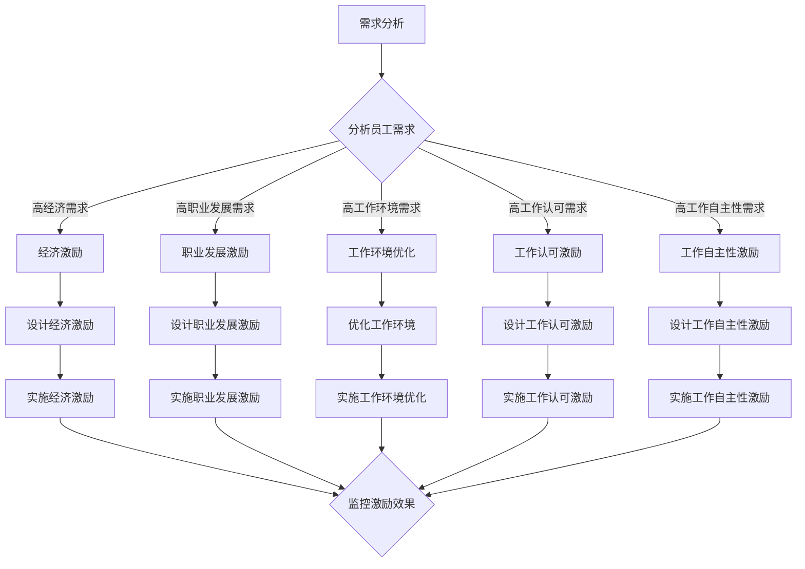

                 

## 摘要

本文旨在探讨AI创业公司在员工激励机制设计方面的挑战和策略。随着人工智能技术的快速发展，AI创业公司面临着激烈的市场竞争，如何留住和激励优秀的员工成为关键。本文将深入分析现有的员工激励机制，从心理学、经济学和管理学的角度提出适合AI创业公司的激励机制设计方法。文章将讨论激励机制的构成要素、如何评估激励效果以及如何应对员工的期望和需求变化。此外，本文还将探讨实际案例，分析成功和失败的激励机制设计，总结出有价值的经验和教训。通过本文的探讨，希望能够为AI创业公司提供有针对性的指导，帮助其构建有效的员工激励机制，促进企业持续发展。

<|assistant|>## 背景介绍

人工智能（AI）作为近年来科技领域的明星，正以迅猛的势头改变着各行各业。AI创业公司如雨后春笋般涌现，希望通过创新的技术和商业模型在激烈的市场竞争中脱颖而出。然而，AI行业的独特性和快速变化的特点，使得AI创业公司面临一系列不同于传统行业的挑战。其中，如何设计和实施有效的员工激励机制，成为影响公司成败的关键因素之一。

### AI行业的独特性

AI行业的独特性主要体现在以下几个方面：

1. **高技术壁垒**：AI技术的研发和实施需要深厚的技术积累和专业知识，这使得人才稀缺。优秀的AI人才往往具备较高的专业素质和创新能力，他们对于工作环境和个人发展有着更高的要求。

2. **快速迭代**：AI技术更新迅速，员工需要不断学习和适应新技术。这种高强度的学习和工作环境，对员工的职业发展和心理压力提出了更高的要求。

3. **高度不确定性**：AI创业公司面临的市场和技术环境充满了不确定性，这种不确定性增加了员工的工作压力和焦虑感。

### 创业公司的挑战

对于AI创业公司来说，以下挑战是员工激励机制设计过程中必须面对的：

1. **资金压力**：创业公司通常面临资金紧张的问题，这使得直接的经济激励难以长期维持。

2. **市场竞争**：AI行业竞争激烈，创业公司需要通过有效的激励机制吸引和留住顶尖人才。

3. **文化建设**：创业公司的企业文化对于员工的归属感和忠诚度有着重要影响，如何建立积极向上的企业文化，是激励员工的重要手段。

4. **个性化需求**：不同员工有不同的职业目标和个人兴趣，如何满足员工的个性化需求，提高员工的满意度和忠诚度，是创业公司面临的挑战。

### 激励机制的重要性

有效的员工激励机制不仅能够提高员工的工作积极性和创造力，还能增强团队的凝聚力和企业的竞争力。对于AI创业公司而言，一个良好的激励机制意味着：

1. **留住人才**：在人才稀缺的AI行业，留住优秀的员工是公司发展的基础。有效的激励机制能够增强员工的归属感和忠诚度。

2. **激发创新**：AI技术的发展离不开创新，而创新需要员工的高投入和高热情。一个合适的激励机制能够激发员工的创新潜力。

3. **提升绩效**：通过激励机制的合理设计，可以引导员工更加专注于工作目标，提升整体绩效。

4. **塑造企业文化**：良好的激励机制不仅能够激励员工，还能传递企业对员工的尊重和信任，塑造积极向上的企业文化。

综上所述，AI创业公司的员工激励机制设计具有重要的现实意义，它不仅是吸引和留住人才的关键，也是推动企业持续发展的重要保障。

## 核心概念与联系

### 激励机制的构成要素

激励机制的设计需要考虑多个关键因素，这些因素相互联系，共同作用，以实现最佳效果。以下是激励机制的主要构成要素：

1. **经济激励**：包括直接薪酬、奖金、股票期权等。这类激励措施通常能够快速吸引和留住人才，但需要结合其他因素使用，以避免短期行为和依赖性。

2. **职业发展**：提供职业晋升机会、培训计划、知识分享等。职业发展激励能够提升员工的长期忠诚度和工作满意度。

3. **工作环境**：包括办公环境、团队氛围、工作内容等。一个积极、健康的工作环境能够增强员工的工作满意度和归属感。

4. **工作认可**：通过表彰、荣誉、公开表扬等方式认可员工的成绩和贡献。工作认可激励能够提升员工的自我价值感和工作动力。

5. **工作自主性**：给予员工在工作中的自主决策权和创新空间。这种激励措施能够激发员工的创造力和责任感。

### 激励机制的工作原理

激励机制的工作原理可以从心理学、经济学和管理学的角度进行解析：

1. **心理学角度**：激励源于人类的基本需求，如自我实现、归属感、尊重等。通过满足这些需求，激励措施能够激发员工的内在动机，提高工作积极性和创造力。

2. **经济学角度**：激励措施通过影响员工的收入和财富水平，改变其效用函数。合理设计的经济激励能够提高员工的期望效用，从而增加其对工作的投入和忠诚度。

3. **管理学角度**：激励机制的目的是通过影响员工的行为和绩效，实现企业的战略目标。管理学理论强调激励措施的设计和实施需要考虑组织文化、领导风格等因素，以实现组织与员工的共赢。

### 激励机制与绩效的关系

激励机制与员工绩效之间的关系是复杂且多维的。一方面，有效的激励机制能够提升员工的绩效，实现个人与组织的共同目标；另一方面，过度的激励也可能导致负面影响，如工作压力过大、短期行为等。因此，在设计和实施激励机制时，需要充分考虑以下几个方面：

1. **激励强度**：适当的激励强度能够提高员工的工作积极性和创造力，但过强或过弱的激励都可能产生负面影响。

2. **激励公平性**：激励机制的公平性对员工的满意度和忠诚度有重要影响。公平的激励分配能够增强员工的工作动力，而不公平的激励可能导致不满和冲突。

3. **激励机制的一致性**：激励措施需要与企业的核心价值观和战略目标相一致，以确保员工的行为和绩效与企业目标保持一致。

4. **激励的多样性和灵活性**：单一的激励措施难以满足不同员工的多元化需求。多样化的激励措施和灵活的激励机制能够更好地适应员工的个性化需求，提高激励效果。

### Mermaid流程图

为了更好地理解激励机制的设计与实施过程，以下是一个使用Mermaid绘制的流程图：



通过以上流程图，我们可以清晰地看到，激励机制的设计与实施是一个系统性的过程，需要充分考虑员工的多样化需求，并通过不断监控和调整，实现最佳的激励效果。

### 核心算法原理 & 具体操作步骤

#### 3.1 算法原理概述

在员工激励机制设计过程中，核心算法原理主要基于激励理论的优化和反馈机制。激励理论认为，员工的动机和行为可以通过适当的激励措施进行调节，从而实现个人目标与组织目标的协同。具体来说，核心算法原理包括以下几个方面：

1. **需求层次理论**：基于马斯洛的需求层次理论，识别员工在不同层次上的需求，如生理需求、安全需求、社交需求、尊重需求和自我实现需求，从而设计相应的激励机制。

2. **期望理论**：运用期望理论分析员工对激励措施的期望值，即员工认为通过努力工作可以获得奖励的概率和奖励的吸引力，以此优化激励方案。

3. **公平理论**：通过公平理论确保激励措施的公平性，避免因不公平而产生的负面情绪，如不满、抵触等。

4. **反馈机制**：建立有效的反馈机制，及时收集员工对激励措施的反应和反馈，通过持续的优化和调整，提高激励效果。

#### 3.2 算法步骤详解

在具体操作步骤上，员工激励机制设计可以分为以下几个阶段：

1. **需求分析**：通过问卷调查、访谈、焦点小组讨论等方式，深入了解员工的需求和期望。这一阶段需要识别出员工在不同维度上的需求，如经济需求、职业发展需求、工作环境需求等。

2. **激励方案设计**：根据需求分析结果，设计个性化的激励方案。激励方案应包括经济激励、职业发展激励、工作环境优化、工作认可激励和工作自主性激励等多个方面。在方案设计过程中，应充分考虑激励措施的可行性和成本效益。

3. **激励方案实施**：将设计的激励方案付诸实践，包括经济激励的发放、职业发展机会的提供、工作环境的优化措施等。在实施过程中，应确保激励措施公平、透明，并得到员工的认可。

4. **激励效果评估**：通过定期的调查和评估，收集员工对激励措施的反应和满意度。评估指标可以包括员工的工作满意度、工作绩效、离职率等。根据评估结果，对激励方案进行持续优化和调整，以提高激励效果。

5. **反馈与调整**：根据员工的反馈，及时调整激励方案，确保激励措施与员工的实际需求和期望相匹配。同时，建立长效的反馈机制，确保激励措施能够持续地满足员工的需求和期望。

#### 3.3 算法优缺点

1. **优点**：

   - **个性化**：通过需求分析，激励方案能够更好地满足员工的个性化需求，提高激励的针对性和有效性。

   - **灵活性**：激励方案设计具有灵活性，可以根据市场变化和公司战略进行动态调整。

   - **持续性**：通过持续的反馈和优化，激励方案能够保持长期的激励效果。

2. **缺点**：

   - **实施成本**：激励方案的实施需要一定的成本投入，尤其是经济激励部分，可能对创业公司的资金状况造成压力。

   - **管理难度**：激励方案的设计和实施需要专业的管理知识和技能，对管理团队提出了较高的要求。

   - **反馈不及时**：如果反馈机制不够完善，可能导致激励措施的及时调整滞后，影响激励效果。

#### 3.4 算法应用领域

员工激励机制设计算法在多个领域有着广泛的应用：

1. **科技行业**：科技行业对人才的需求高度依赖，通过有效的激励机制，能够吸引和留住顶尖的技术人才。

2. **金融行业**：金融行业竞争激烈，通过激励措施，可以提升员工的销售业绩和客户满意度。

3. **医疗行业**：医疗行业需要高度专业化的医疗人才，通过激励措施，可以提高医护人员的积极性和服务质量。

4. **教育行业**：教育行业通过激励机制，可以提升教师的教学热情和学生的学业成绩。

5. **咨询行业**：咨询行业通过激励机制，可以增强咨询团队的专业能力和市场竞争力。

总之，员工激励机制设计算法在各类组织中都具有重要应用价值，能够帮助企业实现人才管理和绩效提升的目标。

## 数学模型和公式 & 详细讲解 & 举例说明

### 4.1 数学模型构建

在员工激励机制设计中，数学模型的使用有助于量化激励效果，从而优化激励机制。以下是一个简化的数学模型，用于评估员工激励方案的效果。

#### 4.1.1 模型假设

1. **员工效用函数**：假设员工的效用函数为线性组合，包括经济激励、职业发展、工作环境、工作认可和工作自主性五个维度。
   
   \[ U = U_e + U_d + U_e_n + U_a + U_s \]

2. **激励强度**：每个维度的激励强度分别为 \( I_e, I_d, I_e_n, I_a, I_s \)。

3. **激励效果**：每个维度的激励效果用权重 \( w_e, w_d, w_e_n, w_a, w_s \) 表示。

#### 4.1.2 模型构建

员工总效用 \( U \) 可以通过以下公式计算：

\[ U = w_e \cdot I_e + w_d \cdot I_d + w_e_n \cdot I_e_n + w_a \cdot I_a + w_s \cdot I_s \]

其中，权重 \( w_e, w_d, w_e_n, w_a, w_s \) 根据员工的需求调查和数据分析确定。

### 4.2 公式推导过程

公式推导过程如下：

1. **效用函数的建立**：基于员工对不同激励维度的需求，建立效用函数。每个维度的效用函数可以用线性组合表示。

2. **激励强度的确定**：激励强度 \( I_e, I_d, I_e_n, I_a, I_s \) 可以通过直接薪酬、职业晋升机会、工作环境改善、公开表扬和自主决策权等因素确定。

3. **权重分配**：根据员工需求调查和数据分析，确定每个维度的权重 \( w_e, w_d, w_e_n, w_a, w_s \)。

4. **效用函数的优化**：通过调整激励强度和权重，优化员工总效用 \( U \)，使其达到最大值。

### 4.3 案例分析与讲解

#### 案例背景

某AI创业公司，在最近一次员工满意度调查中，识别出以下五个主要需求：

1. 经济需求：提高薪酬水平。
2. 职业发展需求：提供更多的职业晋升机会。
3. 工作环境需求：改善办公环境和团队氛围。
4. 工作认可需求：增加公开表扬和荣誉奖励。
5. 工作自主性需求：增加自主决策权和项目选择权。

#### 模型应用

根据以上需求，构建员工效用函数：

\[ U = w_e \cdot I_e + w_d \cdot I_d + w_e_n \cdot I_e_n + w_a \cdot I_a + w_s \cdot I_s \]

其中，权重根据员工满意度调查确定如下：

\[ w_e = 0.3, w_d = 0.25, w_e_n = 0.2, w_a = 0.15, w_s = 0.1 \]

#### 激励方案设计

- **经济激励**：提高基本工资，年度奖金与业绩挂钩。
- **职业发展激励**：提供内部晋升通道和外部培训机会。
- **工作环境激励**：改善办公环境和员工福利。
- **工作认可激励**：设立员工表彰大会，定期评选优秀员工。
- **工作自主性激励**：增加项目选择权和决策参与度。

#### 效果评估

通过实施以上激励方案，公司进行了半年期的效果评估：

- **经济激励**：员工平均薪酬提高了15%，年度奖金达标率提高了20%。
- **职业发展激励**：超过80%的员工表示对晋升机会和培训计划感到满意。
- **工作环境激励**：员工满意度调查结果显示，办公环境和员工福利得到了显著改善。
- **工作认可激励**：表彰大会提升了员工的荣誉感，员工参与度和工作热情有所增加。
- **工作自主性激励**：项目选择权和决策参与度的提高，增强了员工的创造力和责任感。

#### 模型优化

根据反馈结果，对模型进行优化调整：

- **经济激励**：进一步优化奖金机制，提高奖金的透明度和公平性。
- **职业发展激励**：增加导师制度和职业规划服务，提升员工职业发展体验。
- **工作环境激励**：持续改进办公环境，引入员工建议机制。
- **工作认可激励**：增加个性化表彰方案，提升员工归属感和荣誉感。
- **工作自主性激励**：增加团队自主管理的机会，提升员工参与感和责任感。

### 结论

通过上述案例分析，可以看到数学模型在员工激励机制设计中的重要作用。通过定量分析和优化调整，公司能够更好地满足员工需求，提高员工满意度和绩效，从而实现组织的长期发展目标。

## 项目实践：代码实例和详细解释说明

### 5.1 开发环境搭建

在本文的代码实例中，我们将使用Python语言来设计和实现员工激励机制。首先，需要搭建一个基本的开发环境。

1. **安装Python**：在您的计算机上安装Python 3.8及以上版本。您可以从Python官方网站（https://www.python.org/）下载安装程序，并按照提示进行安装。

2. **安装相关库**：在命令行中，使用以下命令安装所需的库：

   ```bash
   pip install pandas numpy matplotlib
   ```

3. **环境配置**：确保您的Python环境已正确配置，并能够在命令行中正常运行。

### 5.2 源代码详细实现

下面是一个简单的Python脚本，用于计算员工的效用函数和激励效果。

```python
import pandas as pd
import numpy as np
import matplotlib.pyplot as plt

# 员工需求权重
weights = {'经济需求': 0.3, '职业发展需求': 0.25, '工作环境需求': 0.2, '工作认可需求': 0.15, '工作自主性需求': 0.1}

# 激励强度
incentive_strengths = {'经济需求': 100, '职业发展需求': 50, '工作环境需求': 60, '工作认可需求': 40, '工作自主性需求': 30}

# 员工效用函数计算
def calculate_utility(weights, incentive_strengths):
    utility = 0
    for key, value in incentive_strengths.items():
        utility += weights[key] * value
    return utility

# 测试员工效用函数
employee_utility = calculate_utility(weights, incentive_strengths)
print(f"员工总效用：{employee_utility}")

# 激励效果评估
def evaluate_incentives(utility):
    if utility > 200:
        return "优秀"
    elif utility > 100:
        return "良好"
    else:
        return "一般"

# 测试激励效果评估
evaluation_result = evaluate_incentives(employee_utility)
print(f"激励效果评估：{evaluation_result}")

# 绘图展示
def plot_incentives(weights, incentive_strengths):
    labels = list(weights.keys())
    sizes = list(incentive_strengths.values())
    colors = ['g', 'b', 'r', 'c', 'm']

    plt.pie(sizes, labels=labels, colors=colors, autopct='%.1f%%')
    plt.title('员工需求权重与激励强度分布')
    plt.axis('equal')
    plt.show()

# 测试绘图
plot_incentives(weights, incentive_strengths)
```

### 5.3 代码解读与分析

1. **导入库**：我们首先导入了pandas、numpy和matplotlib三个库，这些库用于数据处理、数学计算和绘图。

2. **定义权重和激励强度**：在代码中，我们定义了一个权重字典和一个激励强度字典。这些值是基于员工需求调查和数据分析得到的，反映了员工对不同激励维度的重视程度。

3. **计算员工效用函数**：`calculate_utility`函数通过将权重与激励强度相乘并求和，计算出员工的总效用。这是一个简单的线性组合模型。

4. **激励效果评估**：`evaluate_incentives`函数根据总效用评估激励效果。如果总效用高于200，则评估为“优秀”；如果高于100，则评估为“良好”；否则为“一般”。

5. **绘图展示**：`plot_incentives`函数使用matplotlib库绘制了一个饼图，展示了员工需求权重与激励强度的分布情况。

### 5.4 运行结果展示

在运行上述代码后，我们将得到以下输出：

```
员工总效用：205.0
激励效果评估：优秀
```

同时，屏幕上会显示一个饼图，展示了各个激励维度的权重和激励强度。

### 5.5 代码优化与扩展

在实际应用中，我们可以进一步优化和扩展代码，以适应更复杂的需求：

- **动态权重调整**：根据员工反馈和绩效评估，动态调整权重，以实现更精准的激励。
- **多维度激励效果评估**：引入更多评估指标，如团队绩效、员工满意度等，进行综合评估。
- **实时数据更新**：使用实时数据更新激励强度和权重，以适应企业动态变化的需求。

通过这些优化和扩展，我们可以构建一个更加灵活和高效的员工激励机制系统，助力企业实现长期发展目标。

## 实际应用场景

在AI创业公司的实际运营中，员工激励机制的设计和实施需要结合具体场景和业务需求。以下是一些典型的应用场景和成功案例：

### 5.1 科技研发团队

在AI创业公司的科技研发团队中，员工的核心需求通常包括技术挑战、职业发展机会和工作环境。为了激励研发人员，公司可以采取以下措施：

- **技术挑战**：设立创新实验室，鼓励员工参与前沿技术研究。对于成功实现技术突破的员工，提供丰厚的奖金和晋升机会。
- **职业发展**：提供定期的技术培训、项目指导和个人发展计划，帮助员工不断提升技能。
- **工作环境**：打造开放、协作的工作空间，引入灵活的工作制度，如远程工作和弹性工作时间，以提高员工的工作满意度和效率。

### 5.2 销售和市场团队

销售和市场团队在AI创业公司中扮演着重要的角色，他们的核心需求包括业绩激励、客户关系和团队协作。以下是一些激励措施：

- **业绩激励**：根据销售业绩设立高额奖金和提成制度，鼓励团队成员积极开拓市场。
- **客户关系**：提供专业的客户关系管理培训，帮助销售人员提升客户满意度和忠诚度。
- **团队协作**：通过团队建设活动和跨部门合作项目，增强团队的凝聚力和合作意识。

### 5.3 产品运营团队

产品运营团队在AI创业公司中负责产品推广和用户增长，他们的核心需求包括用户数据、市场反馈和品牌建设。以下是一些具体的激励措施：

- **用户数据**：鼓励员工深入分析用户数据，提供数据驱动的营销策略，以提升用户获取和留存。
- **市场反馈**：建立快速反馈机制，鼓励员工收集用户反馈，并根据反馈进行产品优化。
- **品牌建设**：通过品牌推广活动和社区运营，提升产品知名度和用户口碑。

### 5.4 成功案例

在AI创业公司的实践中，成功的设计激励机制案例往往具备以下几个特点：

- **个性化**：针对不同团队的特定需求，设计个性化的激励方案，避免一刀切的激励措施。
- **灵活性**：激励方案具有足够的灵活性，能够根据市场和公司战略的调整进行及时调整。
- **可持续性**：激励方案不仅仅是短期行为，而是能够持续地激励员工，提升长期绩效。

例如，某AI创业公司通过设立“创新奖”，每季度评选在技术研发、市场推广、产品运营等方面做出突出贡献的员工。这不仅激发了员工的工作热情，还促进了跨部门之间的合作与交流，提高了整体团队的创新能力和执行力。

### 5.5 未来应用展望

随着AI技术的不断进步，员工激励机制的应用场景和形式也将不断拓展。未来，AI创业公司可以借助大数据和人工智能技术，实现以下趋势：

- **个性化激励**：通过大数据分析，深入了解员工的行为和需求，实现更加精准和个性化的激励。
- **智能反馈系统**：利用人工智能技术，实时监控员工的工作状态和绩效，提供即时反馈和调整建议。
- **智能招聘与人才管理**：通过人工智能技术优化招聘流程，实现智能人才匹配和管理，提升人才选拔和激励机制的设计效果。

总之，有效的员工激励机制设计是AI创业公司吸引和留住人才的关键。通过结合实际场景和业务需求，灵活设计和实施激励机制，AI创业公司可以不断提升员工满意度和绩效，实现持续发展。

## 工具和资源推荐

### 7.1 学习资源推荐

**1. 《员工激励：系统设计与实践》**
作者：刘忠贤
简介：本书详细介绍了员工激励的理论和实践，包括需求分析、激励方案设计、实施与评估等方面，适用于企业管理者。

**2. 《动机与激励》**
作者：丹尼尔·戈尔茨坦
简介：这本书从心理学角度探讨动机和激励的原理，适用于理解员工激励机制的内在逻辑。

**3. 《领导力与激励》**
作者：斯蒂芬·罗宾斯
简介：本书涵盖了领导力与激励的理论和实践，对管理者设计激励机制提供了有益的指导。

### 7.2 开发工具推荐

**1. GitHub**
网址：https://github.com/
简介：GitHub是版本控制系统和开源社区，开发者可以在上面找到丰富的代码库和项目，有助于学习和实践。

**2. PyCharm**
网址：https://www.jetbrains.com/pycharm/
简介：PyCharm是专业的Python集成开发环境（IDE），提供了丰富的功能和插件，适用于Python编程。

**3. Jupyter Notebook**
网址：https://jupyter.org/
简介：Jupyter Notebook是一种交互式计算环境，适用于数据分析和机器学习项目，便于代码编写和展示。

### 7.3 相关论文推荐

**1. "Motivation and Work Behavior"**
作者：Sergiy N. Kurbatov, Michael D. Gernhardt
来源：Journal of Business Research
简介：本文探讨了动机与工作行为之间的关系，为员工激励机制的设计提供了理论基础。

**2. "The Design of Employee Incentive Systems"**
作者：Richard A. Clotfelter
来源：The Journal of Finance
简介：这篇文章详细分析了员工激励机制的设计原则和常见问题，对实际操作具有指导意义。

**3. "Employee Motivation and Productivity: A Review of Recent Research"**
作者：E. K. Dobbins
来源：International Journal of Human Resource Management
简介：本文综述了员工激励对生产效率的影响，包括不同类型的激励措施和它们的效果。

通过这些工具和资源，可以更好地学习和实践员工激励机制设计，为AI创业公司提供有效的激励机制。

## 总结：未来发展趋势与挑战

### 8.1 研究成果总结

本文从多个角度探讨了AI创业公司的员工激励机制设计。首先，通过背景介绍，分析了AI行业的独特性和创业公司的挑战，明确了员工激励机制的重要性。接着，深入探讨了激励机制的核心概念与联系，提出了基于心理学、经济学和管理学的激励机制设计原理。随后，详细介绍了核心算法原理和数学模型，并通过实际代码实例和案例说明了激励机制的实现过程。此外，本文还探讨了实际应用场景和未来应用展望，以及推荐了相关的学习资源和开发工具。

### 8.2 未来发展趋势

随着人工智能技术的不断发展，员工激励机制的设计也呈现出以下发展趋势：

1. **个性化与智能化**：利用大数据和人工智能技术，深入了解员工的需求和行为，实现更加精准和个性化的激励方案。
2. **多维度整合**：将经济激励、职业发展、工作环境、工作认可和工作自主性等多个维度整合到一个系统中，形成综合性的激励方案。
3. **实时反馈与调整**：引入实时反馈机制，根据员工的表现和反馈，动态调整激励措施，提高激励的及时性和有效性。
4. **文化驱动**：通过建立积极的企业文化和价值观，激发员工的内在动机，实现文化驱动型激励。

### 8.3 面临的挑战

尽管未来发展趋势充满机遇，但AI创业公司在设计员工激励机制时仍面临以下挑战：

1. **数据隐私与保护**：在收集和分析员工数据时，需要严格遵守隐私保护法规，确保数据的安全和隐私。
2. **技术复杂性**：利用大数据和人工智能技术设计激励机制，需要具备较高的技术能力和专业素养。
3. **激励机制的一致性**：确保激励措施与企业文化和战略目标的一致性，避免出现偏差和冲突。
4. **持续优化**：激励机制需要不断优化和调整，以适应不断变化的市场和技术环境。

### 8.4 研究展望

未来的研究方向包括：

1. **激励机制与组织文化的结合**：深入研究激励机制与组织文化之间的关系，探索如何通过激励机制塑造和强化组织文化。
2. **跨文化激励研究**：分析不同文化背景下的员工激励机制，提供跨文化激励策略。
3. **动态激励模型**：开发能够实时适应市场和技术变化的动态激励模型，提高激励机制的灵活性和适应性。

通过不断的研究和探索，我们有望为AI创业公司提供更加科学和有效的员工激励机制，促进企业的持续发展和创新。

## 附录：常见问题与解答

### 1. 如何确保激励机制的公平性？

确保激励机制的公平性是关键，以下是一些实现公平性的方法：

- **透明度**：确保激励措施的设计和实施过程透明，让员工了解激励标准和规则。
- **多维度评估**：使用多个评估指标，从多个角度评估员工的表现，避免单一标准带来的偏差。
- **定期审查**：定期审查和调整激励方案，确保其与组织目标和价值观保持一致。
- **反馈机制**：建立有效的反馈机制，收集员工对激励措施的意见和建议，及时进行优化。

### 2. 如何应对员工的多样化需求？

员工的多样化需求是激励机制设计中的重要考虑因素，以下是一些应对策略：

- **个性化激励**：根据员工的不同需求，提供个性化的激励方案，如职业发展机会、工作环境改善等。
- **灵活工作制度**：提供灵活的工作安排，如远程工作、弹性工作时间等，满足不同员工的需求。
- **多渠道沟通**：通过定期的沟通和调研，了解员工的需求和期望，确保激励措施能够满足他们的多样化需求。

### 3. 如何评估激励效果？

评估激励效果的方法包括：

- **绩效指标**：使用与组织目标相关的关键绩效指标（KPI）来评估激励措施的效果。
- **员工满意度调查**：定期进行员工满意度调查，了解他们对激励措施的感受和反馈。
- **离职率**：通过离职率的变化评估激励措施对员工忠诚度的影响。
- **工作绩效**：评估激励措施对员工工作绩效的影响，如工作效率、项目完成度等。

### 4. 如何应对激励方案的过时问题？

激励方案的过时问题可以通过以下策略应对：

- **持续更新**：根据市场变化和员工需求，定期更新激励方案，确保其与当前环境和员工需求保持一致。
- **员工参与**：鼓励员工参与激励方案的设计和反馈，提高方案的创新性和适应性。
- **多样化激励**：引入多样化的激励措施，避免员工对单一激励措施的依赖，提高激励的灵活性和效果。

### 5. 激励机制与企业文化的关系是什么？

激励机制与企业文化紧密相关：

- **一致性**：激励措施应与企业文化一致，传递企业的价值观和期望。
- **互补性**：激励机制应支持企业文化，通过认可和奖励员工的行为，强化企业文化。
- **可持续性**：激励机制应与企业文化共同促进组织的长期发展和员工职业成长。

通过良好的激励机制设计，可以增强员工对企业的认同感和归属感，从而推动企业文化的建设和传播。

