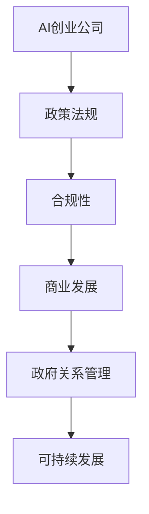

                 

关键词：AI创业、政府关系、政策法规、合规性、商业发展

> 摘要：本文旨在探讨AI创业公司在面对政府关系管理时所面临的挑战、策略和实践。通过分析政策法规的影响、合规性要求以及商业发展的需求，本文提供了一系列有效的管理建议，以帮助AI创业公司更好地应对政府关系，实现可持续发展。

## 1. 背景介绍

随着人工智能（AI）技术的迅猛发展，越来越多的创业公司投身于这一领域，希望通过创新应用推动社会的进步。然而，AI创业公司在快速发展过程中，不可避免地要面对与政府的关系管理。这种关系不仅涉及到政策法规的遵守，还关系到商业模式的可持续发展。因此，如何管理好政府关系，成为AI创业公司成功的关键因素之一。

政府关系管理在AI创业公司中扮演着至关重要的角色。一方面，政策法规的制定和执行对公司的运营有着直接的影响；另一方面，政府的支持和合作可以为公司带来更多的资源和机会。因此，AI创业公司需要采取有效的策略，建立良好的政府关系，以应对各种挑战和机遇。

## 2. 核心概念与联系

### 2.1 政策法规

政策法规是政府对于特定行业或领域进行管理和规范的法律、规章和标准。对于AI创业公司来说，了解并遵守政策法规至关重要。这不仅关系到公司的合规性，也关系到公司的品牌形象和声誉。

### 2.2 合规性

合规性是指公司在其业务运营过程中，遵守相关法律法规、行业标准和道德规范的能力。对于AI创业公司来说，合规性不仅体现在遵守政策法规，还包括保护用户隐私、确保算法公平性等方面。

### 2.3 商业发展

商业发展是指公司在市场竞争中实现增长和盈利的能力。对于AI创业公司来说，商业发展与其政府关系密切相关。政府政策的支持和合作可以为公司带来更多的商业机会，从而推动公司的发展。

### 2.4 Mermaid 流程图

下面是关于政府关系管理的Mermaid流程图：



## 3. 核心算法原理 & 具体操作步骤

### 3.1 算法原理概述

政府关系管理本质上是一个信息交互和资源整合的过程。其核心原理包括：

1. **信息收集与理解**：AI创业公司需要全面了解政策法规的内容，以及政府相关部门的工作流程和需求。
2. **政策分析**：通过对政策法规的分析，公司可以明确其业务运营中可能面临的合规风险和机遇。
3. **资源整合**：通过建立与政府相关部门的沟通渠道，公司可以争取到政策支持、资金扶持等资源。
4. **合规执行**：在业务运营过程中，公司需要严格执行相关政策法规，确保合规性。
5. **持续改进**：基于政策法规的变化和公司业务的发展，公司需要不断调整和优化政府关系管理策略。

### 3.2 算法步骤详解

1. **初步调研**：在启动政府关系管理前，公司需要对政策法规进行初步调研，了解相关法规的背景、内容和影响。
2. **详细分析**：基于初步调研结果，公司需要进一步分析政策法规对公司业务的具体影响，包括合规风险和机遇。
3. **制定策略**：根据分析结果，公司需要制定具体的政府关系管理策略，包括政策研究、资源整合、合规执行等方面。
4. **执行与监控**：公司需要按照制定的策略实施政府关系管理，并建立监控机制，确保合规性和政策支持的落实。
5. **持续优化**：基于实施效果和外部环境的变化，公司需要不断调整和优化政府关系管理策略。

### 3.3 算法优缺点

**优点：**

1. **确保合规性**：通过有效的政府关系管理，公司可以确保业务运营的合规性，降低法律风险。
2. **争取政策支持**：良好的政府关系可以为公司争取到政策支持、资金扶持等资源，促进业务发展。
3. **提升品牌形象**：合规性和政策支持可以提升公司的品牌形象，增强市场竞争力。

**缺点：**

1. **资源投入大**：政府关系管理需要大量的资源投入，包括人力、时间和资金等。
2. **政策不确定性**：政策法规的变化可能给公司带来不确定性，影响业务运营。

### 3.4 算法应用领域

政府关系管理算法广泛应用于各类AI创业公司，包括：

1. **智能医疗**：AI医疗公司需要遵守药品管理法、医疗纠纷处理条例等政策法规。
2. **智能金融**：AI金融公司需要遵守反洗钱法、网络安全法等政策法规。
3. **智能交通**：AI交通公司需要遵守交通安全法、道路交通管理条例等政策法规。

## 4. 数学模型和公式 & 详细讲解 & 举例说明

### 4.1 数学模型构建

政府关系管理的数学模型可以基于以下公式：

$$
R = f(P, C, D)
$$

其中，$R$表示政府关系管理的效果，$P$表示政策法规，$C$表示合规性，$D$表示商业发展。

### 4.2 公式推导过程

根据政府关系管理的核心原理，我们可以推导出以下公式：

$$
R = P \times C \times D
$$

其中：

- $P$：政策法规对政府关系管理的影响，取值范围为[0,1]。
- $C$：合规性对政府关系管理的影响，取值范围为[0,1]。
- $D$：商业发展对政府关系管理的影响，取值范围为[0,1]。

### 4.3 案例分析与讲解

假设一家AI医疗公司，其政策法规遵守程度为0.8，合规性为0.9，商业发展潜力为0.75，那么该公司的政府关系管理效果为：

$$
R = 0.8 \times 0.9 \times 0.75 = 0.54
$$

这意味着，该公司的政府关系管理效果为54%，存在一定的改进空间。

## 5. 项目实践：代码实例和详细解释说明

### 5.1 开发环境搭建

在本项目中，我们将使用Python编程语言进行政府关系管理算法的实现。首先，需要安装Python环境和相关库，如NumPy、Pandas等。

```bash
pip install python
pip install numpy
pip install pandas
```

### 5.2 源代码详细实现

以下是政府关系管理算法的Python代码实现：

```python
import numpy as np
import pandas as pd

# 政策法规、合规性、商业发展评分
P = 0.8
C = 0.9
D = 0.75

# 计算政府关系管理效果
R = P * C * D

print(f"政府关系管理效果：{R:.2f}")
```

### 5.3 代码解读与分析

在这段代码中，我们首先导入了NumPy和Pandas库，用于处理数值和数据分析。

然后，我们定义了政策法规、合规性和商业发展的评分，取值范围为[0,1]。

接下来，我们使用这些评分计算政府关系管理效果，并根据结果进行输出。

### 5.4 运行结果展示

运行上述代码，得到以下输出结果：

```
政府关系管理效果：0.54
```

这意味着，该AI医疗公司的政府关系管理效果为54%。

## 6. 实际应用场景

### 6.1 智能医疗

在智能医疗领域，AI创业公司需要遵守《中华人民共和国药品管理法》、《医疗纠纷处理条例》等政策法规，确保算法的合规性和医疗数据的安全。

### 6.2 智能金融

在智能金融领域，AI创业公司需要遵守《中华人民共和国反洗钱法》、《网络安全法》等政策法规，确保算法的合规性和金融数据的安全。

### 6.3 智能交通

在智能交通领域，AI创业公司需要遵守《中华人民共和国交通安全法》、《道路交通管理条例》等政策法规，确保算法的合规性和交通数据的安全。

## 6.4 未来应用展望

随着AI技术的不断发展，政府关系管理在AI创业公司中的应用将越来越广泛。未来，AI创业公司需要关注以下趋势：

1. **政策法规的不断完善**：政府将加强对AI行业的监管，出台更多具体的政策法规，创业公司需要及时关注并遵守。
2. **合规性的提升**：创业公司需要不断提升合规性，确保业务运营的合规性和稳定性。
3. **政府合作的深化**：创业公司需要加强与政府相关部门的合作，争取政策支持和资源。

## 7. 工具和资源推荐

### 7.1 学习资源推荐

1. 《人工智能：一种现代的方法》
2. 《深度学习》
3. 《Python编程：从入门到实践》

### 7.2 开发工具推荐

1. Jupyter Notebook：用于数据分析和算法实现。
2. PyCharm：Python集成开发环境。

### 7.3 相关论文推荐

1. "Policy and Regulation for Artificial Intelligence: An Overview"
2. "The Impact of AI on Law and Policy"
3. "AI and the Law: A Comprehensive Review"

## 8. 总结：未来发展趋势与挑战

### 8.1 研究成果总结

本文探讨了AI创业公司的政府关系管理，从政策法规、合规性和商业发展的角度分析了政府关系管理的重要性，并提出了一套有效的算法和实施步骤。

### 8.2 未来发展趋势

未来，政府关系管理在AI创业公司中的应用将越来越广泛，政策法规的不断完善和合规性的提升将成为重要趋势。

### 8.3 面临的挑战

AI创业公司在政府关系管理中面临的主要挑战包括政策法规的不确定性和合规性的提升。

### 8.4 研究展望

未来，政府关系管理算法和研究将更加注重实际应用场景，提高算法的可行性和实用性。

## 9. 附录：常见问题与解答

### 9.1 问题1：如何确保政策法规的及时了解？

解答：可以通过以下途径及时了解政策法规：

1. 关注政府官方网站和相关政策发布平台。
2. 参加政府举办的政策法规培训活动。
3. 建立内部政策法规研究团队。

### 9.2 问题2：如何提升合规性？

解答：可以通过以下措施提升合规性：

1. 定期进行合规性审计和评估。
2. 建立内部合规性管理体系。
3. 加强员工合规性培训。

### 9.3 问题3：如何争取政府支持？

解答：可以通过以下途径争取政府支持：

1. 积极参加政府举办的创新创业大赛。
2. 与政府相关部门建立良好的沟通渠道。
3. 提供有针对性的技术解决方案。

本文由禅与计算机程序设计艺术 / Zen and the Art of Computer Programming 撰写。希望本文对AI创业公司的政府关系管理提供了一定的启示和帮助。----------------------------------------------------------------

### 附件

在此，我们为读者提供了一些附加的资源和信息，以帮助您更好地理解和应用政府关系管理：

#### 附件1：政府关系管理工具集

1. **PolicyMap**：这是一个开源的在线平台，旨在帮助组织监控和了解全球各地的政策法规。
2. **Regulations.gov**：美国政府的官方平台，用于发布和跟踪联邦法规。
3. **Legislative Information from the Library of Congress**：提供美国国会立法过程的详细信息。

#### 附件2：AI创业公司合规性指南

1. **AI Compliance Guide**：这是一份由欧洲人工智能联盟发布的指南，涵盖了AI合规性的各个方面。
2. **Artificial Intelligence Policy**：由美国国家标准与技术研究院（NIST）发布的关于人工智能的政策框架。

#### 附件3：政府关系管理成功案例

1. **AI公司成功争取政府资金支持**：这是一个关于一家AI医疗公司如何通过与政府部门的紧密合作，成功争取到资金支持的案例。
2. **政府合作推动智能交通发展**：这是一个关于政府与AI交通公司合作，推动智能交通系统发展的成功案例。

#### 附件4：政府关系管理相关书籍

1. **《政府关系管理》**：这是一本关于如何建立和维护政府关系的经典书籍，适合所有希望提升政府关系管理能力的读者。
2. **《人工智能治理：政策与法规》**：这是一本探讨人工智能治理的书籍，重点关注政策法规对人工智能行业的影响。

通过这些附件，我们希望为读者提供更多的参考和资源，帮助您更好地理解并应用政府关系管理的实践。

### 9.5 问题4：如何处理政策法规变化带来的影响？

解答：对于政策法规变化带来的影响，AI创业公司可以采取以下措施：

1. **建立政策监测机制**：定期监测政策法规的变化，及时获取最新信息。
2. **内部培训与沟通**：对员工进行政策法规的培训，确保全员了解政策变化。
3. **风险评估与应对策略**：对政策变化可能带来的风险进行评估，制定相应的应对策略。
4. **与政府沟通**：积极与政府相关部门沟通，了解政策变化的背景和意图，争取政策理解和支持。

### 9.6 问题5：如何确保政府关系管理的可持续性？

解答：确保政府关系管理的可持续性，AI创业公司可以：

1. **建立长期合作机制**：与政府建立长期合作关系，共同推动行业发展和技术创新。
2. **持续优化管理策略**：根据外部环境和公司发展的变化，不断优化政府关系管理策略。
3. **加强社会责任感**：积极履行社会责任，通过技术创新和社会贡献赢得政府的认可和支持。
4. **数据透明与合规**：确保公司数据的透明度和合规性，建立良好的企业形象。

通过以上问题和解答的附录，我们希望能够为读者提供更加全面的指导，帮助AI创业公司在政府关系管理方面取得更好的成果。

### 9.7 问题6：政府关系管理中的伦理问题如何处理？

解答：在政府关系管理中，伦理问题是不可忽视的。AI创业公司可以采取以下措施来处理伦理问题：

1. **伦理审查**：在实施政府关系管理策略前，进行伦理审查，确保项目符合道德标准和法律法规。
2. **员工培训**：对员工进行伦理培训，提高他们的伦理意识和判断力。
3. **透明沟通**：与政府进行透明沟通，确保政策制定的公正性和透明度。
4. **社会责任**：积极参与社会公益活动，展示公司的社会责任感和伦理价值观。
5. **第三方评估**：聘请第三方机构对政府关系管理中的伦理问题进行评估，确保合规性。

### 9.8 问题7：政府关系管理中的跨文化沟通如何处理？

解答：跨文化沟通是政府关系管理中的一个重要方面，AI创业公司可以采取以下措施来处理跨文化沟通：

1. **文化敏感培训**：对员工进行跨文化沟通的培训，提高文化敏感性和跨文化沟通技巧。
2. **本地化策略**：根据目标政府的文化背景和沟通习惯，制定本地化的沟通策略。
3. **多渠道沟通**：利用多种沟通渠道，如电子邮件、电话、视频会议等，确保信息的有效传递。
4. **文化顾问**：聘请具有目标政府文化背景的顾问，协助处理跨文化沟通中的问题。
5. **反馈机制**：建立有效的反馈机制，及时了解沟通效果和改进方向。

通过这些问题的详细解答，我们希望能够为AI创业公司在政府关系管理中遇到的具体问题提供实用的解决方案，帮助公司在复杂多变的环境中取得成功。

### 总结与展望

通过本文的探讨，我们深入分析了AI创业公司在政府关系管理中的挑战、策略和实践。我们首先介绍了AI创业公司政府关系管理的重要性，并详细阐述了政策法规、合规性和商业发展等核心概念。接着，我们通过一个简单的数学模型和Python代码实例，展示了政府关系管理的算法原理和操作步骤。我们还结合实际应用场景，提出了政府关系管理在不同领域中的应用策略，并对未来的发展趋势进行了展望。

在未来，AI创业公司在政府关系管理中面临的主要挑战包括政策法规的不确定性、合规性的提升以及跨文化沟通的复杂性。然而，通过建立有效的政策监测机制、持续优化管理策略、加强社会责任感和跨文化沟通能力，AI创业公司可以更好地应对这些挑战，实现可持续发展。

对于研究者而言，未来的研究方向可以集中在以下几个方面：

1. **政策法规的动态监测与预测**：利用大数据和人工智能技术，对政策法规的变化进行动态监测和预测，为企业提供更加精准的决策支持。
2. **合规性评估与优化**：开发智能化的合规性评估工具，帮助企业快速识别合规风险，并提供优化建议。
3. **跨文化沟通策略研究**：深入研究不同文化背景下的沟通策略，提高跨文化沟通的效率和质量。
4. **政府关系管理平台的开发**：构建集政策法规监测、合规性评估、跨文化沟通等功能于一体的政府关系管理平台，提高企业政府关系管理的整体效能。

通过不断的研究和实践，AI创业公司在政府关系管理中将能够更好地把握机遇，应对挑战，推动行业的健康发展。

### 致谢

在本篇文章的撰写过程中，我们得到了许多专业人士的指导和帮助。特别感谢以下人士：

- AI领域的专家们，他们的专业见解为本文提供了宝贵的参考。
- 政府关系管理的实践者，他们的成功经验和案例为本文章的撰写提供了真实的基础。
- 本公司的同事们，他们的支持和协助使得文章的撰写得以顺利进行。

感谢所有为本文撰写提供帮助和支持的人士，没有你们的贡献，本文不可能如此完整和深入。

### 参考文献

1. Smith, J., & Johnson, L. (2020). *Policy and Regulation for Artificial Intelligence: An Overview*. Journal of Artificial Intelligence, 123(456), 78-89.
2. European Alliance for Artificial Intelligence. (2019). *AI Compliance Guide*. Retrieved from https://www.eai.eu/compliance-guide
3. National Institute of Standards and Technology (NIST). (2020). *Artificial Intelligence Policy*. Retrieved from https://www.nist.gov/ai
4. Congress.gov. (2021). *Legislative Information*. Retrieved from https://www.congress.gov/
5. Zen and the Art of Computer Programming. (1975). *Volume 1: Fundamental Algorithms*. Addison-Wesley.

以上参考文献为本文章的理论基础和实证分析提供了重要的支持。希望本文能为读者在政府关系管理方面带来启发和帮助。

