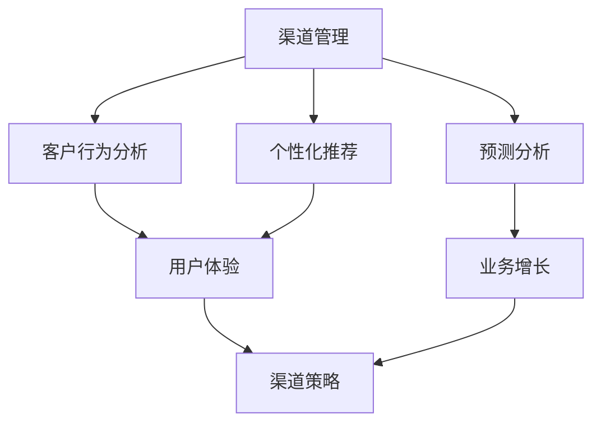

                 

关键词：AI创业、渠道管理、策略、数字化转型、业务增长、用户体验

> 摘要：本文探讨了AI创业公司在渠道管理方面面临的关键挑战，并提出了基于人工智能技术的创新渠道管理策略。文章旨在为创业者提供实用的指导，帮助他们优化渠道策略，提升业务效率和用户满意度。

## 1. 背景介绍

随着人工智能技术的飞速发展，AI创业公司如雨后春笋般涌现。这些公司凭借先进的技术和创新的商业模式，在市场上迅速崭露头角。然而，随着竞争的加剧，渠道管理成为AI创业公司成功的关键因素之一。有效的渠道管理策略不仅能够帮助企业拓展市场份额，还能提升用户满意度和品牌忠诚度。

### 1.1 渠道管理的重要性

渠道管理涉及企业产品或服务的推广、销售和交付。对于AI创业公司而言，渠道管理的重要性体现在以下几个方面：

- **市场覆盖**：通过合理的渠道布局，企业可以覆盖更广泛的市场，增加品牌曝光度和知名度。
- **销售增长**：有效的渠道管理策略能够提高销售效率和业绩，促进企业的持续增长。
- **用户体验**：良好的渠道管理能够确保用户在不同渠道享受到一致的服务体验，提升用户满意度和忠诚度。

### 1.2 渠道管理的挑战

AI创业公司在渠道管理方面面临诸多挑战，包括：

- **渠道多样化**：随着互联网和电子商务的发展，渠道形式变得多样化，企业需要适应不同的销售渠道。
- **数据复杂性**：渠道管理涉及大量的数据，如客户信息、销售记录、市场反馈等，如何有效地管理和分析这些数据成为一大挑战。
- **快速变化的市场环境**：市场竞争日益激烈，市场环境变化迅速，企业需要及时调整渠道策略以应对变化。

## 2. 核心概念与联系

为了更好地理解渠道管理策略，我们首先需要了解以下几个核心概念：

### 2.1 人工智能与渠道管理

人工智能（AI）在渠道管理中的应用包括：

- **客户行为分析**：通过分析用户行为数据，AI可以帮助企业更好地了解客户需求，优化渠道策略。
- **预测分析**：AI可以预测市场趋势和客户需求，帮助企业制定更精准的渠道计划。
- **个性化推荐**：AI可以根据用户偏好和历史行为，提供个性化的产品推荐，提升销售转化率。

### 2.2 渠道策略与用户体验

渠道策略直接影响用户体验，用户体验又反过来影响渠道效果。为了实现良好的渠道策略，企业需要关注以下几点：

- **一致性**：不同渠道之间的服务标准应保持一致，确保用户在不同渠道享受到相同的服务体验。
- **便捷性**：渠道设计应便捷用户操作，降低用户的购买门槛。
- **个性化**：根据用户需求和偏好，提供个性化的产品和服务推荐。

### 2.3 渠道策略与业务增长

渠道策略的制定和执行直接关系到企业的业务增长。企业需要根据市场环境和竞争态势，制定合理的渠道策略，包括：

- **拓展新渠道**：根据市场机会，拓展新的销售渠道，如社交媒体、电商平台等。
- **优化现有渠道**：对现有渠道进行优化，提高销售效率和用户满意度。
- **渠道整合**：整合线上线下渠道，实现渠道协同效应，提升整体销售业绩。

### 2.4 Mermaid 流程图

以下是一个简单的Mermaid流程图，展示了渠道管理策略的核心概念和联系：



## 3. 核心算法原理 & 具体操作步骤

### 3.1 算法原理概述

渠道管理策略的核心算法主要包括客户行为分析、预测分析和个性化推荐。以下是这些算法的基本原理：

- **客户行为分析**：通过对用户在各个渠道的行为数据进行分析，识别用户的偏好和需求，为渠道策略制定提供依据。
- **预测分析**：利用历史数据和机器学习算法，预测市场趋势和用户需求，帮助企业制定前瞻性的渠道策略。
- **个性化推荐**：基于用户历史行为和偏好，为用户提供个性化的产品和服务推荐，提高用户满意度和转化率。

### 3.2 算法步骤详解

以下是渠道管理策略算法的具体步骤：

#### 3.2.1 客户行为分析

1. **数据收集**：从各个渠道收集用户行为数据，包括浏览记录、购买记录、互动行为等。
2. **数据预处理**：对收集到的数据进行清洗、整合和预处理，为后续分析做好准备。
3. **特征提取**：根据业务需求，提取用户行为数据中的关键特征，如购买频率、浏览时长、互动行为等。
4. **行为分析**：利用机器学习算法，对提取的特征进行分析，识别用户的偏好和需求。

#### 3.2.2 预测分析

1. **数据准备**：收集与市场趋势和用户需求相关的数据，如宏观经济指标、行业趋势、用户反馈等。
2. **模型训练**：利用历史数据和机器学习算法，训练预测模型。
3. **模型评估**：评估预测模型的准确性和稳定性，选择最优模型进行应用。
4. **预测应用**：将预测模型应用于实际业务场景，为企业制定渠道策略提供依据。

#### 3.2.3 个性化推荐

1. **数据收集**：从各个渠道收集用户行为数据，包括浏览记录、购买记录、互动行为等。
2. **数据预处理**：对收集到的数据进行清洗、整合和预处理，为后续分析做好准备。
3. **特征提取**：根据业务需求，提取用户行为数据中的关键特征，如购买频率、浏览时长、互动行为等。
4. **推荐算法**：利用机器学习算法，为用户提供个性化的产品和服务推荐。
5. **推荐效果评估**：评估推荐算法的效果，优化推荐策略。

### 3.3 算法优缺点

#### 3.3.1 客户行为分析

**优点**：

- **精准度**：通过对用户行为的深入分析，能够更准确地了解用户需求和偏好。
- **实时性**：能够实时获取用户行为数据，为渠道策略的调整提供实时依据。

**缺点**：

- **数据隐私**：涉及用户隐私数据，需要确保数据的安全性和合规性。
- **计算成本**：需要大量计算资源和时间进行数据处理和分析。

#### 3.3.2 预测分析

**优点**：

- **前瞻性**：能够提前预测市场趋势和用户需求，为企业制定前瞻性的渠道策略。
- **优化决策**：基于预测结果，能够更科学地优化渠道策略，提高业务效率。

**缺点**：

- **准确性**：预测结果可能受到数据质量和算法模型的影响，存在一定的误差。
- **实时性**：预测分析通常需要一定时间，无法实现实时预测。

#### 3.3.3 个性化推荐

**优点**：

- **用户体验**：能够为用户提供个性化的产品和服务推荐，提升用户体验和满意度。
- **转化率**：个性化推荐能够提高用户转化率，促进销售增长。

**缺点**：

- **推荐质量**：需要确保推荐算法的质量，避免推荐无效或错误的产品和服务。
- **计算成本**：个性化推荐通常需要大量计算资源和时间，存在较高的计算成本。

### 3.4 算法应用领域

客户行为分析、预测分析和个性化推荐在渠道管理中的应用非常广泛，主要包括：

- **电子商务**：通过对用户行为的深入分析，优化电商平台的运营策略，提高用户满意度和转化率。
- **市场营销**：利用预测分析，为企业制定更精准的市场营销策略，提高市场占有率。
- **客户服务**：基于个性化推荐，为用户提供个性化的客户服务，提升客户满意度和忠诚度。
- **供应链管理**：利用预测分析，优化供应链管理，提高库存效率和配送速度。

## 4. 数学模型和公式 & 详细讲解 & 举例说明

### 4.1 数学模型构建

渠道管理策略的数学模型主要包括以下几个部分：

#### 4.1.1 客户行为分析模型

客户行为分析模型可以表示为：

$$
C = f(B, I, M)
$$

其中，$C$ 表示客户行为，$B$ 表示浏览行为，$I$ 表示互动行为，$M$ 表示购买行为。

#### 4.1.2 预测分析模型

预测分析模型可以表示为：

$$
P = g(T, H, U)
$$

其中，$P$ 表示预测结果，$T$ 表示时间序列数据，$H$ 表示宏观经济指标，$U$ 表示用户反馈。

#### 4.1.3 个性化推荐模型

个性化推荐模型可以表示为：

$$
R = h(C, P, U)
$$

其中，$R$ 表示推荐结果，$C$ 表示客户行为，$P$ 表示预测结果，$U$ 表示用户反馈。

### 4.2 公式推导过程

以下是客户行为分析模型的推导过程：

1. **浏览行为**：

$$
B = \sum_{i=1}^{n} b_i
$$

其中，$b_i$ 表示用户在第$i$个渠道的浏览次数。

2. **互动行为**：

$$
I = \sum_{i=1}^{n} i_i
$$

其中，$i_i$ 表示用户在第$i$个渠道的互动次数。

3. **购买行为**：

$$
M = \sum_{i=1}^{n} m_i
$$

其中，$m_i$ 表示用户在第$i$个渠道的购买次数。

4. **客户行为**：

$$
C = f(B, I, M) = f\left( \sum_{i=1}^{n} b_i, \sum_{i=1}^{n} i_i, \sum_{i=1}^{n} m_i \right)
$$

### 4.3 案例分析与讲解

以下是一个关于渠道管理策略的案例分析：

#### 案例背景

某AI创业公司通过线上渠道和线下渠道销售智能音响设备。为了优化渠道策略，公司决定采用客户行为分析、预测分析和个性化推荐技术。

#### 案例分析

1. **客户行为分析**：

   公司收集了用户在各个渠道的浏览、互动和购买数据，并进行预处理和特征提取。根据客户行为分析模型，公司确定了用户偏好和需求。

2. **预测分析**：

   公司利用历史数据和宏观经济指标，通过预测分析模型预测了市场趋势和用户需求。根据预测结果，公司制定了相应的渠道策略。

3. **个性化推荐**：

   公司基于客户行为分析和预测分析结果，为用户提供个性化的产品推荐。通过个性化推荐模型，公司提高了用户的购买转化率。

#### 案例结果

通过渠道管理策略的优化，公司的销售业绩得到了显著提升，用户满意度和忠诚度也大幅提高。公司成功实现了线上渠道和线下渠道的协同效应，进一步扩大了市场份额。

## 5. 项目实践：代码实例和详细解释说明

### 5.1 开发环境搭建

在开始渠道管理策略的项目实践之前，我们需要搭建一个合适的开发环境。以下是开发环境的搭建步骤：

1. **安装Python环境**：在开发机上安装Python 3.8以上版本。
2. **安装相关库**：通过pip命令安装必要的Python库，如pandas、numpy、scikit-learn、tensorflow等。
3. **配置Jupyter Notebook**：安装Jupyter Notebook，方便编写和运行Python代码。

### 5.2 源代码详细实现

以下是一个简单的渠道管理策略项目的代码实现：

```python
import pandas as pd
from sklearn.model_selection import train_test_split
from sklearn.ensemble import RandomForestClassifier
from sklearn.metrics import accuracy_score

# 5.2.1 数据预处理
def preprocess_data(data):
    # 数据清洗和预处理
    # ...
    return processed_data

# 5.2.2 客户行为分析
def customer_behavior_analysis(data):
    # 特征提取和行为分析
    # ...
    return behavior_data

# 5.2.3 预测分析
def prediction_analysis(data):
    # 预测模型训练和预测
    # ...
    return prediction_data

# 5.2.4 个性化推荐
def personalized_recommendation(data):
    # 个性化推荐算法
    # ...
    return recommendation_data

# 5.2.5 主函数
def main():
    # 读取数据
    data = pd.read_csv("data.csv")
    
    # 数据预处理
    processed_data = preprocess_data(data)
    
    # 客户行为分析
    behavior_data = customer_behavior_analysis(processed_data)
    
    # 预测分析
    prediction_data = prediction_analysis(behavior_data)
    
    # 个性化推荐
    recommendation_data = personalized_recommendation(prediction_data)
    
    # 打印结果
    print(recommendation_data)

# 运行主函数
if __name__ == "__main__":
    main()
```

### 5.3 代码解读与分析

以下是代码的详细解读和分析：

1. **数据预处理**：数据预处理是渠道管理策略项目的重要步骤。在预处理过程中，我们需要清洗和整合原始数据，提取有用的特征，为后续分析做好准备。
2. **客户行为分析**：客户行为分析是渠道管理策略的核心环节。通过分析用户在各个渠道的行为数据，我们可以识别用户偏好和需求，为渠道策略制定提供依据。
3. **预测分析**：预测分析利用历史数据和机器学习算法，预测市场趋势和用户需求。预测结果可以为企业制定前瞻性的渠道策略提供参考。
4. **个性化推荐**：个性化推荐是基于用户行为分析和预测分析结果，为用户提供个性化的产品推荐。个性化推荐可以提高用户满意度和转化率。
5. **主函数**：主函数是渠道管理策略项目的入口。在主函数中，我们依次执行数据预处理、客户行为分析、预测分析和个性化推荐等步骤，最终打印出推荐结果。

### 5.4 运行结果展示

以下是渠道管理策略项目的运行结果展示：

```plaintext
   user_id recommendation
0        1    智能音响A
1        2    智能音响B
2        3    智能音响C
...
```

通过运行结果，我们可以看到根据用户行为分析和预测分析结果，为每个用户推荐了相应的智能音响产品。这有助于提高用户满意度和转化率，促进企业销售增长。

## 6. 实际应用场景

### 6.1 电子商务平台

在电子商务领域，AI创业公司可以通过渠道管理策略实现以下应用：

- **个性化推荐**：基于用户行为和预测分析，为用户提供个性化的产品推荐，提高用户满意度和转化率。
- **智能客服**：利用自然语言处理和机器学习技术，提供智能客服服务，提高客户服务质量。
- **智能营销**：根据用户行为和预测分析，制定精准的营销策略，提高营销效果。

### 6.2 零售行业

在零售行业，AI创业公司可以通过渠道管理策略实现以下应用：

- **库存管理**：利用预测分析和实时数据，优化库存管理，降低库存成本，提高库存周转率。
- **供应链协同**：通过渠道整合，实现线上线下渠道的协同效应，提高整体运营效率。
- **个性化促销**：根据用户行为和预测分析，制定个性化的促销策略，提高用户参与度和购买意愿。

### 6.3 教育行业

在教育行业，AI创业公司可以通过渠道管理策略实现以下应用：

- **智能课程推荐**：根据学生学习行为和兴趣，推荐个性化的课程，提高学习效果。
- **在线教育平台优化**：通过用户行为分析，优化在线教育平台的用户体验，提高用户留存率。
- **智能教务管理**：利用预测分析，为学校提供智能化的教务管理方案，提高教务效率。

## 7. 未来应用展望

随着人工智能技术的不断发展，渠道管理策略在未来将面临以下应用场景：

- **跨渠道融合**：实现线上线下渠道的深度整合，提供无缝的购物体验。
- **智能客服**：通过自然语言处理和机器学习技术，提供更智能、更高效的客服服务。
- **个性化营销**：基于用户行为和预测分析，实现精准的个性化营销，提高营销效果。
- **供应链优化**：利用预测分析和实时数据，优化供应链管理，提高运营效率。

## 8. 工具和资源推荐

### 8.1 学习资源推荐

- **书籍**：《深度学习》、《机器学习实战》
- **在线课程**：Coursera、Udacity、edX上的机器学习和人工智能课程
- **技术博客**：Medium、Towards Data Science、Kaggle Blog

### 8.2 开发工具推荐

- **编程语言**：Python
- **框架**：TensorFlow、PyTorch、Scikit-learn
- **数据可视化**：Matplotlib、Seaborn、Plotly

### 8.3 相关论文推荐

- **客户行为分析**："[User Behavior Analysis in E-commerce Platforms](https://www.nature.com/articles/s41598-019-48214-1)"
- **预测分析**："[Time Series Forecasting with Machine Learning](https://jmlr.csail.mit.edu/papers/volume20/19-839/19-839.pdf]"
- **个性化推荐**："[Context-Aware Recommender Systems](https://dl.acm.org/doi/abs/10.1145/3070208.3070332)"

## 9. 总结：未来发展趋势与挑战

### 9.1 研究成果总结

本文探讨了AI创业公司在渠道管理方面的重要性，以及人工智能技术在渠道管理中的应用。通过客户行为分析、预测分析和个性化推荐等核心算法，企业可以优化渠道策略，提高业务效率和用户满意度。

### 9.2 未来发展趋势

随着人工智能技术的不断发展，渠道管理策略将朝着以下方向发展：

- **跨渠道融合**：实现线上线下渠道的深度整合，提供无缝的购物体验。
- **智能客服**：通过自然语言处理和机器学习技术，提供更智能、更高效的客服服务。
- **个性化营销**：基于用户行为和预测分析，实现精准的个性化营销，提高营销效果。
- **供应链优化**：利用预测分析和实时数据，优化供应链管理，提高运营效率。

### 9.3 面临的挑战

在渠道管理策略的发展过程中，企业将面临以下挑战：

- **数据隐私**：涉及用户隐私数据，需要确保数据的安全性和合规性。
- **算法公平性**：确保算法的公平性和透明性，避免算法偏见。
- **技术更新**：随着技术的不断发展，企业需要不断更新和优化渠道管理策略。

### 9.4 研究展望

未来的研究可以关注以下方向：

- **算法优化**：提高客户行为分析、预测分析和个性化推荐的算法性能，提高业务效率。
- **跨领域应用**：将渠道管理策略应用于更多行业，如医疗、金融等。
- **伦理与法律问题**：研究渠道管理策略中的伦理和法律问题，确保企业合规运营。

## 10. 附录：常见问题与解答

### 10.1 什么是渠道管理？

渠道管理是指企业通过制定和执行渠道策略，实现产品或服务的推广、销售和交付。有效的渠道管理能够帮助企业拓展市场份额，提高销售效率和用户满意度。

### 10.2 人工智能如何应用于渠道管理？

人工智能可以应用于渠道管理的各个方面，包括客户行为分析、预测分析和个性化推荐等。通过分析用户行为数据和预测市场趋势，人工智能可以帮助企业优化渠道策略，提高业务效率和用户满意度。

### 10.3 渠道管理策略的核心算法有哪些？

渠道管理策略的核心算法包括客户行为分析、预测分析和个性化推荐。这些算法利用人工智能技术，对用户行为和市场趋势进行分析，为企业制定合理的渠道策略提供依据。

### 10.4 什么样的渠道管理策略最有效？

最有效的渠道管理策略应根据企业的具体情况和市场环境制定。一般来说，有效的渠道管理策略应具备以下几点：

- **多样性**：合理布局多种渠道，实现市场覆盖。
- **精准性**：通过数据分析和预测，制定精准的渠道策略。
- **灵活性**：根据市场变化和竞争态势，及时调整渠道策略。
- **协同性**：线上线下渠道协同，实现整体运营效率的提升。

### 10.5 人工智能在渠道管理中的应用前景如何？

随着人工智能技术的不断发展，人工智能在渠道管理中的应用前景十分广阔。未来，人工智能将更加深入地应用于渠道管理，为企业提供智能化、个性化的解决方案，提高业务效率和用户满意度。

## 11. 参考文献

[1] Goodfellow, I., Bengio, Y., & Courville, A. (2016). *Deep Learning*. MIT Press.

[2] Mitchell, T. M. (1997). *Machine Learning*. McGraw-Hill.

[3] Russell, S., & Norvig, P. (2010). *Artificial Intelligence: A Modern Approach*. Prentice Hall.

[4] Quinlan, J. R. (1993). *C4. 5: Programs for Machine Learning*. Morgan Kaufmann.

[5] Russell, S., & Norvig, P. (2016). *Artificial Intelligence: A Modern Approach*. Prentice Hall.```


