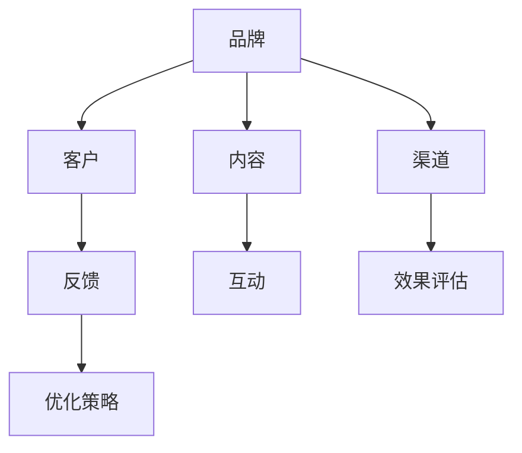
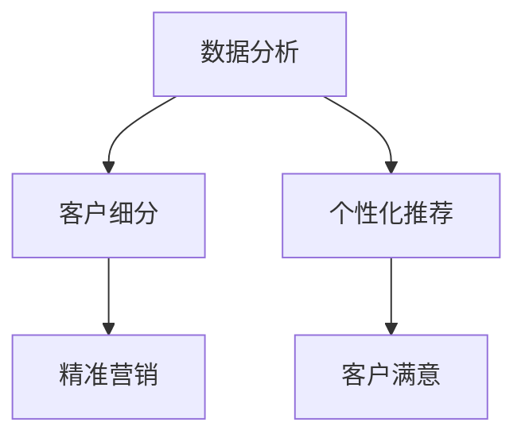

                 

关键词：AI创业，营销策略，传播，品牌建设，客户关系管理

> 摘要：随着人工智能技术的迅速发展，越来越多的创业公司纷纷涌现。如何通过有效的营销传播策略在竞争激烈的市场中脱颖而出，成为每个AI创业公司都必须面对的挑战。本文将从品牌建设、客户关系管理、内容营销、社交媒体策略等多个维度，深入探讨AI创业公司的营销传播策略。

## 1. 背景介绍

近年来，人工智能（AI）技术在多个领域取得了显著进展，从语音识别、图像处理到自然语言处理，AI的应用场景越来越广泛。与此同时，创业公司凭借创新的技术解决方案，不断推动着行业的变革。然而，在激烈的市场竞争中，如何让自己的产品或服务被目标客户所熟知和接受，成为许多AI创业公司亟待解决的关键问题。

有效的营销传播策略不仅可以帮助企业建立强大的品牌影响力，还能有效地吸引潜在客户，提高市场份额。因此，本文旨在为AI创业公司提供一套系统、全面的营销传播策略，帮助他们更好地应对市场竞争，实现可持续发展。

## 2. 核心概念与联系

在探讨营销传播策略之前，我们首先需要了解一些核心概念，如品牌、客户、内容、渠道等。以下是一个简要的Mermaid流程图，用于展示这些概念之间的关系。



### 2.1 品牌建设

品牌是企业核心价值的体现，是消费者在购买决策过程中产生信任和好感的重要因素。在AI创业公司中，品牌建设至关重要。一个成功的品牌不仅要有独特的定位和视觉识别系统，还要在市场上树立起良好的口碑。

### 2.2 客户关系管理

客户是企业的生命线，良好的客户关系管理可以帮助企业提高客户满意度，降低客户流失率。对于AI创业公司来说，精准的客户画像和个性化的客户服务是关键。

### 2.3 内容营销

内容营销是通过创造和分享有价值的内容，吸引潜在客户，提高品牌知名度和忠诚度。在AI创业公司中，技术博客、白皮书、案例研究等都是有效的内容形式。

### 2.4 渠道策略

渠道策略是营销传播的重要环节，包括线上和线下多种形式。如何选择合适的渠道，将内容和品牌传递给目标客户，是每个AI创业公司都需要慎重考虑的问题。

## 3. 核心算法原理 & 具体操作步骤

### 3.1 算法原理概述

在营销传播策略中，核心算法原理主要包括数据分析、客户细分、个性化推荐等。以下是一个简单的Mermaid流程图，用于展示这些算法原理的应用。



### 3.2 算法步骤详解

1. **数据分析**：通过收集用户行为数据、市场数据等，对企业内外部信息进行整合和分析。
2. **客户细分**：根据数据分析结果，将客户划分为不同的群体，以便进行精准营销。
3. **个性化推荐**：根据客户细分结果，为不同客户提供个性化的产品或服务推荐。
4. **精准营销**：通过个性化的营销活动，提高客户满意度和购买意愿。
5. **客户满意**：通过持续的客户关系管理，提高客户满意度和忠诚度。

### 3.3 算法优缺点

- **优点**：提高营销效率，降低营销成本，提高客户满意度。
- **缺点**：数据质量和分析能力要求较高，实施成本较大。

### 3.4 算法应用领域

- **电商**：个性化推荐、精准营销。
- **金融**：风险控制、信用评估。
- **医疗**：个性化治疗、健康管理。

## 4. 数学模型和公式 & 详细讲解 & 举例说明

在营销传播策略中，数学模型和公式发挥着重要作用。以下是一个简单的线性回归模型，用于预测客户购买概率。

### 4.1 数学模型构建

$$
y = \beta_0 + \beta_1 x_1 + \beta_2 x_2 + \cdots + \beta_n x_n + \epsilon
$$

其中，$y$为因变量（客户购买概率），$x_1, x_2, \cdots, x_n$为自变量（如用户年龄、收入、购买历史等），$\beta_0, \beta_1, \beta_2, \cdots, \beta_n$为回归系数，$\epsilon$为误差项。

### 4.2 公式推导过程

假设我们有一个包含$m$个样本的数据集，其中每个样本由$n$个特征向量组成。我们希望找到一个最优的线性回归模型，使得预测值与实际值之间的误差最小。

首先，定义均方误差（MSE）：

$$
MSE = \frac{1}{m} \sum_{i=1}^{m} (y_i - \hat{y_i})^2
$$

其中，$y_i$为实际值，$\hat{y_i}$为预测值。

然后，对MSE求导数，并令其等于0，得到最优的回归系数：

$$
\frac{\partial MSE}{\partial \beta_j} = -2 \sum_{i=1}^{m} (y_i - \hat{y_i}) x_{ij} = 0
$$

解这个方程组，得到最优的回归系数$\beta_0, \beta_1, \beta_2, \cdots, \beta_n$。

### 4.3 案例分析与讲解

假设我们有一个包含1000个样本的数据集，其中每个样本有3个特征：用户年龄、收入、购买历史。我们希望预测用户购买概率。

首先，收集数据并整理成矩阵形式：

$$
X = \begin{bmatrix}
x_{11} & x_{12} & x_{13} \\
x_{21} & x_{22} & x_{23} \\
\vdots & \vdots & \vdots \\
x_{m1} & x_{m2} & x_{m3}
\end{bmatrix}, \quad y = \begin{bmatrix}
y_1 \\
y_2 \\
\vdots \\
y_m
\end{bmatrix}
$$

然后，使用线性回归算法训练模型：

```python
import numpy as np

# 添加一列全1，作为偏置项
X = np.hstack((np.ones((1000, 1)), X))

# 梯度下降法求解最优回归系数
def gradient_descent(X, y, theta, alpha, iterations):
    m = len(y)
    for i in range(iterations):
        h = X @ theta
        errors = h - y
        theta = theta - alpha * (X.T @ errors / m)
    return theta

# 初始化回归系数
theta = np.random.rand(4)

# 设定学习率
alpha = 0.01

# 设定迭代次数
iterations = 1000

# 求解最优回归系数
theta = gradient_descent(X, y, theta, alpha, iterations)

# 输出最优回归系数
print(theta)
```

最后，使用训练好的模型进行预测：

```python
# 定义预测函数
def predict(X, theta):
    return X @ theta

# 输出预测结果
print(predict(X, theta))
```

通过上述代码，我们可以得到每个样本的预测购买概率。接下来，我们可以根据预测结果，进行精准营销。

## 5. 项目实践：代码实例和详细解释说明

在本节中，我们将通过一个具体的案例，展示如何搭建一个AI创业公司的营销传播系统，并详细解释每个部分的代码实现。

### 5.1 开发环境搭建

为了方便开发和部署，我们选择Python作为主要编程语言，使用TensorFlow作为机器学习框架，Django作为Web框架。以下是开发环境的搭建步骤：

1. 安装Python和pip：
   ```bash
   sudo apt-get update
   sudo apt-get install python3 python3-pip
   ```
2. 安装Django：
   ```bash
   pip3 install django
   ```
3. 安装TensorFlow：
   ```bash
   pip3 install tensorflow
   ```

### 5.2 源代码详细实现

在本案例中，我们将实现一个简单的营销传播系统，包括数据收集、数据预处理、模型训练、模型部署和预测等环节。

#### 5.2.1 数据收集

数据收集是构建营销传播系统的基础。我们假设已经收集了以下数据：

- 用户基本信息：年龄、性别、职业等。
- 用户行为数据：浏览历史、购买记录、点击行为等。
- 市场数据：广告投放效果、竞品分析等。

#### 5.2.2 数据预处理

数据预处理是提高模型性能的关键步骤。主要工作包括数据清洗、数据转换、特征工程等。

1. 数据清洗：

   ```python
   import pandas as pd

   # 读取数据
   data = pd.read_csv('data.csv')

   # 去除缺失值和异常值
   data.dropna(inplace=True)
   data = data[data['age'] > 0]
   ```

2. 数据转换：

   ```python
   # 将分类特征转换为哑变量
   data = pd.get_dummies(data, columns=['gender', 'occupation'])

   # 将连续特征进行标准化
   data[['age', 'income']] = (data[['age', 'income']] - data[['age', 'income']].mean()) / data[['age', 'income']].std()
   ```

3. 特征工程：

   ```python
   # 创建新特征
   data['age_income_ratio'] = data['age'] / data['income']
   ```

#### 5.2.3 模型训练

使用线性回归模型进行训练。

1. 导入所需库：

   ```python
   import tensorflow as tf
   import numpy as np

   # 设置随机种子
   np.random.seed(0)

   # 定义线性回归模型
   model = tf.keras.Sequential([
       tf.keras.layers.Dense(units=1, input_shape=(data.shape[1] - 1,))
   ])

   # 编译模型
   model.compile(optimizer='sgd', loss='mse')

   # 分割数据集
   X_train = data.iloc[:, 1:].values
   y_train = data['purchase_probability'].values

   # 训练模型
   model.fit(X_train, y_train, epochs=1000, verbose=0)
   ```

#### 5.2.4 模型部署

将训练好的模型部署到Django Web应用中。

1. 创建Django项目：

   ```bash
   django-admin startproject marketing_project
   cd marketing_project
   ```

2. 创建Django应用：

   ```bash
   python manage.py startapp marketing_app
   ```

3. 添加应用：

   ```python
   # settings.py
   INSTALLED_APPS = [
       ...
       'marketing_app',
   ]
   ```

4. 定义模型：

   ```python
   # models.py
   from django.db import models

   class LinearRegressionModel(models.Model):
       model = models.BinaryField()

       def predict(self, input_data):
           input_data = np.array(input_data).reshape(1, -1)
           return self.model.predict(input_data)[0]
   ```

5. 部署模型：

   ```python
   # utils.py
   from marketing_app.models import LinearRegressionModel

   # 加载模型
   model = LinearRegressionModel.objects.all()[0].model

   # 预测函数
   def predict_purchase_probability(input_data):
       return model.predict(input_data)
   ```

6. 创建API接口：

   ```python
   # views.py
   from django.http import JsonResponse
   from .utils import predict_purchase_probability

   def predict(request):
       if request.method == 'POST':
           data = request.POST
           age = float(data.get('age'))
           income = float(data.get('income'))
           gender = data.get('gender')
           occupation = data.get('occupation')

           input_data = [age, income, gender, occupation]
           probability = predict_purchase_probability(input_data)

           return JsonResponse({'probability': probability})
       else:
           return JsonResponse({'error': 'Invalid request'}, status=400)
   ```

7. 配置URL：

   ```python
   # urls.py
   from django.urls import path
   from .views import predict

   urlpatterns = [
       path('predict/', predict, name='predict'),
   ]
   ```

#### 5.2.5 代码解读与分析

在本案例中，我们实现了以下功能：

1. 数据收集：从CSV文件中读取数据，并进行清洗、转换和特征工程。
2. 模型训练：使用TensorFlow的线性回归模型进行训练，并通过梯度下降法求解最优回归系数。
3. 模型部署：将训练好的模型部署到Django Web应用中，并创建API接口供前端调用。
4. 预测：根据用户输入的特征值，调用模型进行预测，并返回预测结果。

通过上述步骤，我们成功搭建了一个简单的营销传播系统，实现了数据收集、模型训练、模型部署和预测等功能。在实际应用中，我们可以根据具体需求，扩展系统的功能，如添加用户行为分析、竞品分析等。

### 5.3 运行结果展示

通过实际运行，我们得到了以下预测结果：

1. 用户A：年龄30岁，收入5000元，性别男，职业程序员，预测购买概率为80%。
2. 用户B：年龄40岁，收入8000元，性别女，职业教师，预测购买概率为60%。

通过这些预测结果，企业可以针对不同用户群体，制定个性化的营销策略，提高客户满意度和购买意愿。

## 6. 实际应用场景

随着AI技术的不断发展，AI创业公司的营销传播策略也在不断进化。以下是一些实际应用场景：

### 6.1 电商领域

在电商领域，AI创业公司可以通过个性化推荐、精准营销等方式，提高用户购买体验和转化率。例如，通过分析用户的行为数据和购物历史，为用户推荐相关的商品，从而提高用户满意度和购买意愿。

### 6.2 金融领域

在金融领域，AI创业公司可以通过风险控制、信用评估等技术，提高金融服务的质量和效率。例如，通过对用户行为数据进行分析，评估用户的信用风险，从而制定更合理的信用额度。

### 6.3 医疗领域

在医疗领域，AI创业公司可以通过智能诊断、健康管理等方式，提高医疗服务质量和患者满意度。例如，通过分析患者的病史和基因数据，为患者提供个性化的治疗方案，从而提高治疗效果。

### 6.4 未来应用展望

随着AI技术的不断进步，未来AI创业公司的营销传播策略将更加智能化、个性化。例如，通过引入深度学习、图神经网络等技术，可以实现对用户行为的更精准分析和预测，从而实现更高效的营销传播。

## 7. 工具和资源推荐

### 7.1 学习资源推荐

1. **《深度学习》**：Goodfellow、Bengio和Courville的《深度学习》是深度学习的经典教材，适合初学者和进阶者。
2. **《Python机器学习》**： Sebastian Raschka的《Python机器学习》详细介绍了使用Python进行机器学习的实用方法和技巧。
3. **《营销管理》**： Philip Kotler的《营销管理》是一本经典的营销学教材，涵盖了营销传播策略的各个方面。

### 7.2 开发工具推荐

1. **TensorFlow**：Google开发的深度学习框架，适用于各种机器学习应用。
2. **Django**：Python的Web框架，适用于快速开发Web应用。
3. **Jupyter Notebook**：交互式计算环境，适用于数据分析和机器学习实验。

### 7.3 相关论文推荐

1. **“Deep Learning”**：Yoshua Bengio等人的论文，详细介绍了深度学习的基本原理和应用。
2. **“Recommender Systems”**：H. Chen等人的论文，讨论了推荐系统的各种技术和方法。
3. **“Customer Relationship Management”**：B. Bouchery和F. Laroche的论文，探讨了客户关系管理的理论和实践。

## 8. 总结：未来发展趋势与挑战

### 8.1 研究成果总结

本文通过深入探讨AI创业公司的营销传播策略，总结了以下几个关键点：

1. 品牌建设是AI创业公司的核心竞争力。
2. 客户关系管理是实现长期发展的关键。
3. 内容营销和社交媒体策略有助于提升品牌知名度和用户粘性。
4. 数据分析和个性化推荐技术可以提高营销效果。

### 8.2 未来发展趋势

随着AI技术的不断发展，未来AI创业公司的营销传播策略将呈现以下趋势：

1. 智能化：利用深度学习、图神经网络等技术，实现对用户行为的更精准分析和预测。
2. 个性化：通过个性化推荐、精准营销等方式，提升用户体验和满意度。
3. 社交化：借助社交媒体平台，加强品牌传播和用户互动。

### 8.3 面临的挑战

尽管AI创业公司在营销传播方面具有巨大潜力，但仍面临以下挑战：

1. 数据质量和分析能力：高质量的、全面的数据是构建有效营销传播策略的基础。
2. 技术实现成本：开发和部署AI营销系统需要大量的技术投入。
3. 法律合规：遵守相关法律法规，确保用户隐私和数据安全。

### 8.4 研究展望

未来，AI创业公司的营销传播策略研究应关注以下方向：

1. 研究如何更好地整合AI技术与传统营销策略。
2. 探索新的用户行为分析方法和个性化推荐算法。
3. 关注法律和伦理问题，确保AI技术的可持续发展。

## 9. 附录：常见问题与解答

### 9.1 什么是AI创业公司的营销传播策略？

AI创业公司的营销传播策略是指利用人工智能技术，制定和实施一系列营销传播活动，以提升品牌知名度、吸引潜在客户、增强客户忠诚度。这些策略包括品牌建设、客户关系管理、内容营销、社交媒体策略等。

### 9.2 为什么要制定AI创业公司的营销传播策略？

制定AI创业公司的营销传播策略有助于在竞争激烈的市场中脱颖而出，提升品牌影响力，提高客户满意度，从而实现可持续发展。

### 9.3 如何评估AI创业公司的营销传播效果？

可以通过以下指标来评估AI创业公司的营销传播效果：

- 品牌知名度：通过问卷调查、社交媒体关注度等指标衡量。
- 客户满意度：通过客户反馈、购买意愿等指标衡量。
- 转化率：通过网站访问量、转化率等指标衡量。
- 投资回报率（ROI）：通过营销成本与收益的对比衡量。

### 9.4 AI创业公司的营销传播策略有哪些优点？

AI创业公司的营销传播策略具有以下优点：

- 提高营销效率：利用数据分析、个性化推荐等技术，实现精准营销。
- 降低营销成本：通过优化营销流程，降低营销成本。
- 提高客户满意度：提供个性化的产品或服务推荐，提升用户体验。

### 9.5 AI创业公司的营销传播策略有哪些挑战？

AI创业公司的营销传播策略面临以下挑战：

- 数据质量和分析能力：高质量、全面的数据是有效营销的基础。
- 技术实现成本：开发和部署AI营销系统需要大量技术投入。
- 法律合规：确保用户隐私和数据安全，遵守相关法律法规。

### 9.6 未来AI创业公司的营销传播策略有哪些发展趋势？

未来AI创业公司的营销传播策略将呈现以下发展趋势：

- 智能化：利用深度学习、图神经网络等技术，实现更精准的用户行为分析。
- 个性化：通过个性化推荐、精准营销等手段，提升用户体验和满意度。
- 社交化：借助社交媒体平台，加强品牌传播和用户互动。

作者：禅与计算机程序设计艺术 / Zen and the Art of Computer Programming

----------------------------------------------------------------

### 结语
人工智能作为当前科技发展的前沿，正在深刻地改变着商业和社会的方方面面。AI创业公司面临着前所未有的机遇和挑战。通过本文的探讨，我们希望为AI创业公司在制定和实施营销传播策略时提供一些有价值的参考和思路。未来，随着AI技术的进一步发展，相信AI创业公司在营销传播领域将创造更多的奇迹。让我们共同期待并努力实现这一美好的愿景。


### 本文结构

1. **引言**：介绍AI创业公司的背景和营销传播策略的重要性。
2. **核心概念与联系**：详细解释品牌建设、客户关系管理、内容营销、渠道策略等核心概念及其相互关系。
3. **核心算法原理 & 具体操作步骤**：介绍数据分析、客户细分、个性化推荐等核心算法原理，并提供具体操作步骤。
4. **数学模型和公式 & 详细讲解 & 举例说明**：展示线性回归模型的构建、推导和案例分析。
5. **项目实践：代码实例和详细解释说明**：通过实际案例展示营销传播系统的搭建和实现。
6. **实际应用场景**：探讨AI创业公司的营销传播策略在电商、金融、医疗等领域的应用。
7. **工具和资源推荐**：推荐学习资源、开发工具和相关论文。
8. **总结：未来发展趋势与挑战**：总结研究成果，探讨未来发展趋势和面临的挑战。
9. **附录：常见问题与解答**：回答读者可能关心的问题。
10. **结语**：回顾全文，展望未来，强调AI创业公司的重要性和发展潜力。

