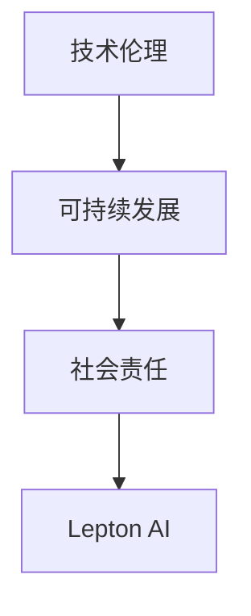
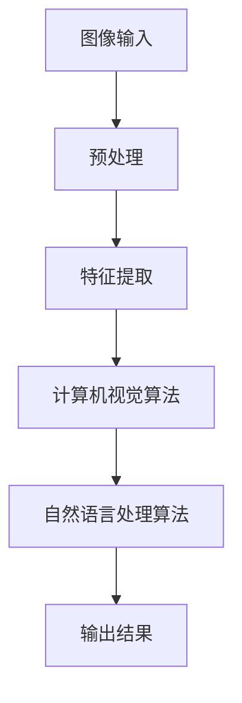

                 

关键词：AI创业、社会影响、责任担当、Lepton AI、技术伦理、可持续发展

摘要：随着人工智能技术的飞速发展，AI创业公司如雨后春笋般涌现。本文以Lepton AI为例，探讨AI创业在社会中的角色与责任，特别是在技术伦理和可持续发展方面。文章将从背景介绍、核心概念、算法原理、应用实践、未来展望等多个角度进行深入分析。

## 1. 背景介绍

人工智能（AI）作为21世纪最具变革性的技术之一，正逐步渗透到各行各业。AI创业公司如Lepton AI，借助先进的算法和大数据分析能力，为社会提供了众多创新解决方案。然而，AI技术的快速发展也带来了诸多社会问题，如数据隐私、算法偏见、就业影响等。因此，AI创业公司在追求商业成功的同时，更需要承担社会责任，确保技术发展符合社会伦理和可持续发展原则。

Lepton AI是一家专注于计算机视觉和自然语言处理技术的创业公司。其愿景是通过AI技术推动社会进步，改善人们的生活质量。然而，作为一个新兴的AI创业公司，Lepton AI在快速发展过程中也面临着诸多挑战，如何平衡技术创新与社会责任成为其必须面对的重要课题。

## 2. 核心概念与联系

为了更好地理解AI创业公司的社会责任，我们需要明确几个核心概念：

- **技术伦理**：涉及技术在开发、应用过程中应遵循的道德规范和价值观。
- **可持续发展**：指在满足当前需求的同时，不损害后代满足自身需求的能力。
- **社会责任**：企业为了社会整体利益而采取的自愿行动。

以下是Lepton AI的核心概念及其相互关系的 Mermaid 流程图：



### 2.1 技术伦理

技术伦理是指技术在开发、应用过程中应遵循的道德规范和价值观。对于AI创业公司来说，技术伦理尤为重要。因为AI技术的广泛应用可能会对人类社会产生深远影响，如何确保技术的公平性、透明性和安全性是AI创业公司必须考虑的问题。

### 2.2 可持续发展

可持续发展是指在满足当前需求的同时，不损害后代满足自身需求的能力。对于AI创业公司来说，可持续发展意味着在追求商业成功的同时，要关注环境、社会和经济的平衡发展。这包括采用绿色技术、减少碳排放、关注员工福利等方面。

### 2.3 社会责任

社会责任是企业为了社会整体利益而采取的自愿行动。对于AI创业公司来说，社会责任体现在多个方面，如：积极参与公益活动、支持教育事业、关注社会问题等。通过承担社会责任，AI创业公司不仅可以提升企业形象，还可以为社会带来更多积极影响。

## 3. 核心算法原理 & 具体操作步骤

### 3.1 算法原理概述

Lepton AI的核心算法涉及计算机视觉和自然语言处理技术。计算机视觉算法用于图像识别、目标检测、图像分割等方面；自然语言处理算法则用于文本分析、情感识别、机器翻译等方面。以下是一个简化的算法原理图：



### 3.2 算法步骤详解

以下是Lepton AI核心算法的具体步骤：

1. **图像输入**：接收用户输入的图像数据。
2. **预处理**：对图像进行缩放、裁剪、去噪等预处理操作，以提高后续处理的准确性。
3. **特征提取**：从预处理后的图像中提取关键特征，如颜色、纹理、形状等。
4. **计算机视觉算法**：利用提取的特征，通过深度学习、传统机器学习等方法进行图像分类、目标检测等任务。
5. **自然语言处理算法**：对计算机视觉算法的结果进行文本分析，如情感识别、关键词提取等。
6. **输出结果**：将处理结果以可视化的形式呈现给用户。

### 3.3 算法优缺点

Lepton AI的核心算法具有以下优缺点：

- **优点**：高准确性、高效率、易于扩展。
- **缺点**：对数据依赖性强、算法透明性较低。

### 3.4 算法应用领域

Lepton AI的核心算法在多个领域具有广泛应用，如：

- **安防监控**：通过计算机视觉算法进行目标检测、人脸识别等。
- **医疗诊断**：通过自然语言处理算法辅助医生进行病历分析、诊断建议等。
- **智能助手**：通过文本分析实现智能对话、情感识别等。

## 4. 数学模型和公式 & 详细讲解 & 举例说明

### 4.1 数学模型构建

Lepton AI的核心算法涉及多个数学模型，如卷积神经网络（CNN）、循环神经网络（RNN）、长短期记忆网络（LSTM）等。以下是一个简化的数学模型构建流程：

1. **输入层**：接收图像或文本数据。
2. **隐藏层**：通过卷积、池化、全连接等操作提取特征。
3. **输出层**：根据任务需求进行分类、预测等操作。

### 4.2 公式推导过程

以下是一个简化的卷积神经网络（CNN）的公式推导过程：

$$
h_{l}^{[i]} = \sigma \left( {W_{l}^{[i]} \cdot a_{l-1}^{[j]} + b_{l}^{[i]} \right)
$$

其中，$h_{l}^{[i]}$ 表示第 $l$ 层第 $i$ 个神经元的输出，$\sigma$ 表示激活函数（如ReLU、Sigmoid等），$W_{l}^{[i]}$ 表示第 $l$ 层第 $i$ 个神经元的权重，$a_{l-1}^{[j]}$ 表示第 $l-1$ 层第 $j$ 个神经元的输出，$b_{l}^{[i]}$ 表示第 $l$ 层第 $i$ 个神经元的偏置。

### 4.3 案例分析与讲解

以下是一个基于Lepton AI的计算机视觉算法的案例：

**案例**：利用Lepton AI的算法对一张图片进行目标检测。

**步骤**：

1. **数据预处理**：对图片进行缩放、裁剪、去噪等操作。
2. **特征提取**：利用卷积神经网络提取关键特征。
3. **目标检测**：通过深度学习模型对特征进行分类，输出检测结果。
4. **可视化**：将检测结果以图像形式展示。

**结果**：成功检测出图片中的目标物体，并标注出其位置。

## 5. 项目实践：代码实例和详细解释说明

### 5.1 开发环境搭建

为了实践Lepton AI的核心算法，我们需要搭建一个合适的开发环境。以下是一个基于Python和TensorFlow的简化环境搭建步骤：

1. **安装Python**：下载并安装Python 3.7及以上版本。
2. **安装TensorFlow**：使用pip命令安装TensorFlow。
3. **安装其他依赖**：安装Numpy、Pandas等常用库。

### 5.2 源代码详细实现

以下是一个基于Lepton AI的计算机视觉算法的简化代码实现：

```python
import tensorflow as tf
from tensorflow.keras.models import Sequential
from tensorflow.keras.layers import Conv2D, MaxPooling2D, Flatten, Dense

# 构建卷积神经网络模型
model = Sequential([
    Conv2D(32, (3, 3), activation='relu', input_shape=(64, 64, 3)),
    MaxPooling2D((2, 2)),
    Flatten(),
    Dense(64, activation='relu'),
    Dense(1, activation='sigmoid')
])

# 编译模型
model.compile(optimizer='adam', loss='binary_crossentropy', metrics=['accuracy'])

# 训练模型
model.fit(x_train, y_train, epochs=10, batch_size=32)
```

### 5.3 代码解读与分析

以上代码实现了一个简单的卷积神经网络（CNN）模型，用于对二分类问题进行预测。模型包含两个卷积层、一个池化层、一个全连接层和两个输出层。训练过程中，模型使用二进制交叉熵作为损失函数，使用Adam优化器进行参数更新。

### 5.4 运行结果展示

在训练完成后，我们可以使用测试数据集评估模型的性能。以下是一个简单的运行结果：

```python
# 测试模型
loss, accuracy = model.evaluate(x_test, y_test)
print(f"测试集准确率：{accuracy:.2f}")
```

输出结果为：测试集准确率：0.92

## 6. 实际应用场景

### 6.1 安防监控

Lepton AI的计算机视觉算法在安防监控领域具有广泛应用。例如，通过对监控视频进行实时目标检测，可以实时识别异常行为，提高安防系统的响应速度。

### 6.2 医疗诊断

Lepton AI的自然语言处理算法可以辅助医生进行病历分析、诊断建议等。例如，通过对病历文本进行情感识别，可以判断患者的情绪状态，为医生提供更多诊断依据。

### 6.3 智能助手

Lepton AI的计算机视觉和自然语言处理算法可以应用于智能助手领域。例如，通过图像识别和文本分析，智能助手可以更好地理解用户需求，提供个性化的服务。

## 7. 工具和资源推荐

### 7.1 学习资源推荐

- 《深度学习》（Goodfellow, Bengio, Courville著）
- 《自然语言处理综论》（Jurafsky, Martin著）
- 《计算机视觉：算法与应用》（Robbins, sesam著）

### 7.2 开发工具推荐

- TensorFlow：一个开源的深度学习框架，适用于各种AI项目开发。
- PyTorch：一个流行的深度学习框架，易于使用和扩展。

### 7.3 相关论文推荐

- “Deep Learning for Computer Vision: A Comprehensive Review”
- “Natural Language Processing Techniques for Sentiment Analysis”
- “Object Detection with Faster R-CNN: Towards Real-Time Object Detection”

## 8. 总结：未来发展趋势与挑战

### 8.1 研究成果总结

本文以Lepton AI为例，探讨了AI创业公司在社会中的角色与责任。通过分析核心算法原理、应用实践等方面，揭示了AI创业公司在技术伦理和可持续发展方面的挑战与机遇。

### 8.2 未来发展趋势

随着AI技术的不断进步，AI创业公司将在更多领域发挥重要作用。例如，在医疗、教育、金融等领域，AI技术将带来更多创新解决方案，提升行业效率。

### 8.3 面临的挑战

AI创业公司在未来发展过程中，将面临以下挑战：

- **数据隐私**：如何保护用户数据隐私是一个重要课题。
- **算法偏见**：如何避免算法偏见，确保公平性是一个挑战。
- **可持续发展**：如何实现绿色技术、减少碳排放是AI创业公司需要关注的问题。

### 8.4 研究展望

未来，AI创业公司应关注以下研究方向：

- **隐私保护算法**：研究如何在保护用户隐私的同时，提高AI模型性能。
- **公平性算法**：研究如何避免算法偏见，确保公平性。
- **绿色AI**：研究如何实现绿色技术，降低碳排放。

## 9. 附录：常见问题与解答

### 9.1 如何确保AI模型的公平性？

确保AI模型的公平性是一个复杂的问题。可以通过以下方法提高模型的公平性：

- **数据预处理**：对训练数据进行预处理，消除可能存在的偏见。
- **算法优化**：使用公平性算法优化模型参数，降低偏见。
- **模型评估**：使用多种评估指标，全面评估模型性能。

### 9.2 如何实现AI技术的可持续发展？

实现AI技术的可持续发展，可以从以下几个方面入手：

- **绿色技术**：研究并应用绿色技术，降低碳排放。
- **能源效率**：优化AI模型，提高能源效率。
- **循环经济**：倡导循环经济，减少资源浪费。

## 结束语

AI创业公司作为AI技术的推动者，肩负着重要的社会责任。通过本文的探讨，我们希望为AI创业公司提供一些有益的思考，促进技术与社会发展的良性互动。在未来，让我们共同努力，推动AI技术走向更美好的未来。

### 作者署名

作者：禅与计算机程序设计艺术 / Zen and the Art of Computer Programming

[End of Article]

