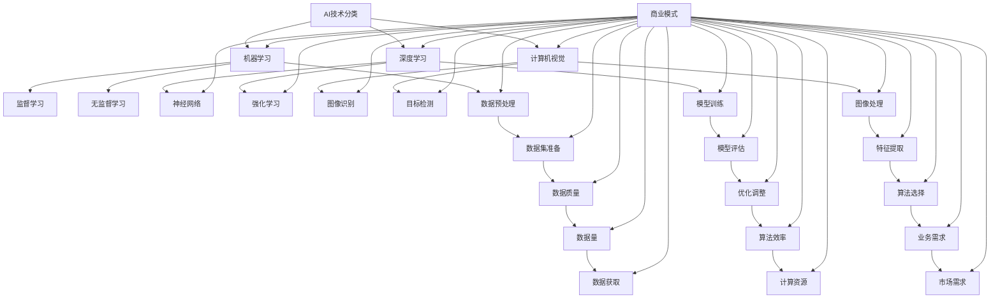

                 

关键词：AI创业、技术选择、商业模式、团队组建、创新实践、行业挑战

> 摘要：本文通过深入剖析AI创业领域的实践案例，探讨了AI创业者如何在不同阶段作出关键选择，包括技术方向、商业模式、团队组建以及创新实践。文章旨在为即将踏上AI创业之路的读者提供有益的参考和启发。

## 1. 背景介绍

人工智能（AI）作为当今技术领域的前沿，吸引了无数创业者的关注。从自然语言处理到计算机视觉，从机器学习算法到深度学习框架，AI技术在各个行业的应用正以前所未有的速度发展。然而，随着技术的进步，AI创业者面临的挑战也日益增加。如何选择合适的技术方向、构建可行的商业模式、组建高效的团队，以及不断创新以应对市场变化，成为每一个AI创业者在成长过程中必须面对的问题。

本文将通过一系列AI创业者的真实故事，深入分析他们在不同阶段面临的选择，以及这些选择如何影响了他们的创业之路。通过这些案例，我们希望能够为即将踏上AI创业之路的读者提供一些实用的经验和策略。

### 1.1 当前AI创业环境

当前，AI创业环境呈现出以下几个显著特点：

- **资金支持**：随着资本市场的火热，AI初创公司获得了大量资金支持。风险投资、政府基金和科技巨头投资纷纷涌入，为AI创业项目提供了充足的资源。

- **技术迭代**：AI技术的发展速度极快，新的算法、框架和工具层出不穷。创业者必须紧跟技术趋势，不断学习和迭代，以保持竞争力。

- **市场需求**：AI技术的应用领域不断扩大，从医疗、金融到零售、物流，各行各业都在积极探索AI的应用。这为创业者提供了广阔的市场空间。

- **竞争激烈**：随着越来越多的创业者进入AI领域，市场竞争日益激烈。如何脱颖而出，成为每一个创业公司都必须考虑的问题。

### 1.2 创业者面临的挑战

在AI创业过程中，创业者面临以下几大挑战：

- **技术选型**：AI技术种类繁多，如何选择最适合自身项目的技术方案，成为许多创业者面临的首要问题。

- **商业模式**：如何将AI技术与市场需求相结合，构建可持续的商业模式，是创业成功的关键。

- **团队建设**：组建一支具备技术实力和业务能力的团队，是创业者必须解决的问题。

- **创新实践**：在激烈的市场竞争中，如何不断创新，保持技术领先，是每一个AI创业公司都必须面对的挑战。

### 1.3 本文目的

本文将通过分析AI创业者的成功案例，探讨他们在创业过程中如何作出关键选择，包括技术方向、商业模式、团队建设和创新实践。我们希望通过这些案例，为即将踏上AI创业之路的读者提供有益的参考和启发，帮助他们在创业过程中更好地应对挑战，实现成功。

## 2. 核心概念与联系

在探讨AI创业者的选择之前，我们需要明确几个核心概念，包括AI技术的分类、商业模式的设计原则以及团队建设的关键要素。以下是一个简化的Mermaid流程图，用于展示这些概念之间的联系。



### 2.1 AI技术分类

AI技术可以大致分为以下几个类别：

- **机器学习**：通过数据和算法来使计算机具备学习能力，包括监督学习、无监督学习和强化学习等。
- **深度学习**：一种基于神经网络的机器学习方法，通过多层神经网络来模拟人类大脑的学习过程。
- **计算机视觉**：使计算机能够理解和解析图像和视频，包括图像识别、目标检测等任务。

### 2.2 商业模式设计

商业模式设计需要考虑以下几个关键要素：

- **数据预处理**：确保数据质量，进行数据清洗、归一化和特征提取等操作。
- **模型训练与评估**：通过模型训练和评估来优化算法，提高预测准确率。
- **图像处理**：对图像进行处理，提取有用的特征信息。
- **业务需求与市场需求**：将技术应用于实际业务场景，满足市场需求。

### 2.3 团队建设

团队建设的关键要素包括：

- **技术能力**：团队成员需要具备深厚的技术背景，能够应对各种技术挑战。
- **业务理解**：团队成员需要了解业务需求，能够将技术方案与业务目标相结合。
- **协作能力**：团队成员之间需要具备良好的协作能力，共同推进项目进度。

通过上述核心概念与联系的分析，我们可以更好地理解AI创业者在选择过程中的关键决策点，以及这些决策如何影响创业的成功。

## 3. 核心算法原理 & 具体操作步骤

### 3.1 算法原理概述

在AI创业过程中，选择合适的算法是至关重要的。算法的选择不仅影响项目的研发进度，还直接影响产品的性能和用户体验。以下是对几种常见核心算法原理的概述。

#### 3.1.1 机器学习算法

机器学习算法是AI创业中的基础，主要包括以下几种：

- **监督学习**：通过已标记的数据集训练模型，使模型能够对新数据进行分类或回归预测。常见的监督学习算法有线性回归、逻辑回归、决策树、随机森林等。
- **无监督学习**：不需要标记数据集，通过数据自身特性进行模型训练。常见的无监督学习算法有聚类算法（如K-means）、降维算法（如PCA）等。
- **强化学习**：通过与环境的交互来学习最佳策略。常见的强化学习算法有Q-learning、深度强化学习（如DQN、DDPG）等。

#### 3.1.2 深度学习算法

深度学习算法在AI创业中应用广泛，其核心原理是多层神经网络。以下是一些常见的深度学习算法：

- **卷积神经网络（CNN）**：适用于图像识别和目标检测等任务，通过卷积层、池化层和全连接层等结构提取图像特征。
- **循环神经网络（RNN）**：适用于序列数据处理，如自然语言处理和时间序列预测。常见的RNN算法有LSTM和GRU。
- **生成对抗网络（GAN）**：通过两个对抗网络（生成器和判别器）的竞争来生成高质量的数据，广泛应用于图像生成和增强学习。

#### 3.1.3 计算机视觉算法

计算机视觉算法是AI创业中的重要组成部分，主要包括以下几种：

- **图像识别**：对图像中的物体、场景或面部进行识别和分类。
- **目标检测**：在图像中检测和识别多个目标的位置和属性。
- **人脸识别**：通过人脸图像识别个体身份。
- **图像分割**：将图像分为多个区域，每个区域具有相同的属性。

### 3.2 算法步骤详解

#### 3.2.1 机器学习算法步骤

1. **数据收集与预处理**：收集相关数据集，对数据进行清洗、归一化等预处理操作，确保数据质量。
2. **特征提取**：根据业务需求提取关键特征，选择合适的特征工程方法，如主成分分析（PCA）、特征选择等。
3. **模型选择**：根据数据特点和业务需求选择合适的机器学习算法，如线性回归、决策树、神经网络等。
4. **模型训练**：使用训练数据集对模型进行训练，调整模型参数。
5. **模型评估**：使用验证数据集评估模型性能，调整模型参数以优化性能。
6. **模型部署**：将训练好的模型部署到生产环境中，进行实际应用。

#### 3.2.2 深度学习算法步骤

1. **数据收集与预处理**：与机器学习算法类似，对图像、文本或其他类型的数据进行预处理。
2. **模型构建**：设计深度学习模型结构，如CNN、RNN、GAN等。
3. **模型训练**：通过反向传播算法训练模型，调整模型参数。
4. **模型评估**：使用验证数据集评估模型性能，包括准确率、召回率、F1分数等。
5. **模型优化**：根据评估结果调整模型参数，优化模型性能。
6. **模型部署**：将训练好的模型部署到生产环境中，进行实际应用。

#### 3.2.3 计算机视觉算法步骤

1. **图像预处理**：对输入图像进行大小调整、灰度化、滤波等预处理操作。
2. **特征提取**：使用卷积层、池化层等提取图像特征。
3. **模型训练**：使用图像特征和标签数据进行模型训练。
4. **模型评估**：使用测试数据集评估模型性能。
5. **模型优化**：根据评估结果调整模型参数，优化模型性能。
6. **模型部署**：将训练好的模型部署到生产环境中，进行图像识别、目标检测等任务。

### 3.3 算法优缺点

#### 3.3.1 机器学习算法

**优点**：

- **适用范围广**：适用于各种类型的数据，包括分类、回归、聚类等。
- **可解释性**：相对于深度学习，机器学习算法的可解释性更强，有助于理解模型决策过程。

**缺点**：

- **对数据依赖性强**：机器学习算法的性能很大程度上依赖于数据质量和数量。
- **模型复杂度较低**：无法处理非常复杂的数据关系，特别是在处理高维数据时。

#### 3.3.2 深度学习算法

**优点**：

- **强大的学习能力**：通过多层神经网络可以处理复杂的数据关系，适应不同类型的数据。
- **高性能**：在图像识别、语音识别等领域具有显著性能优势。

**缺点**：

- **可解释性差**：深度学习模型内部参数和决策过程较为复杂，不易解释。
- **训练成本高**：深度学习算法需要大量的数据和计算资源，训练过程较长。

#### 3.3.3 计算机视觉算法

**优点**：

- **高精度**：在图像识别、目标检测等领域具有很高的准确率。
- **应用广泛**：广泛应用于安防监控、自动驾驶、医疗诊断等场景。

**缺点**：

- **对数据质量要求高**：图像质量和标注精度对算法性能有较大影响。
- **计算资源消耗大**：卷积神经网络等算法对计算资源要求较高。

### 3.4 算法应用领域

**机器学习算法**：

- **推荐系统**：基于用户行为和偏好推荐商品、新闻等。
- **金融风控**：通过分析历史数据预测贷款违约风险等。
- **自然语言处理**：文本分类、情感分析、机器翻译等。

**深度学习算法**：

- **图像识别**：应用于安防监控、自动驾驶、医疗影像分析等领域。
- **语音识别**：应用于智能助手、语音搜索、电话客服等。
- **自然语言处理**：语音识别、机器翻译、情感分析等。

**计算机视觉算法**：

- **图像识别**：应用于人脸识别、车牌识别等。
- **目标检测**：应用于自动驾驶、无人机监控等。
- **图像分割**：应用于医疗影像诊断、图像编辑等。

通过对核心算法原理和具体操作步骤的详细分析，AI创业者可以更好地理解各种算法的特点和应用场景，从而在项目研发过程中作出更明智的选择。

## 4. 数学模型和公式 & 详细讲解 & 举例说明

### 4.1 数学模型构建

在AI创业过程中，数学模型的应用至关重要。以下是一些常见的数学模型，以及它们的构建方法和基本原理。

#### 4.1.1 线性回归模型

线性回归模型是机器学习中最基础的一种模型，用于预测一个连续值输出。其数学模型如下：

\[ y = \beta_0 + \beta_1x_1 + \beta_2x_2 + \ldots + \beta_nx_n \]

其中，\( y \) 是预测值，\( x_1, x_2, \ldots, x_n \) 是输入特征，\( \beta_0, \beta_1, \beta_2, \ldots, \beta_n \) 是模型参数。

#### 4.1.2 逻辑回归模型

逻辑回归模型用于处理分类问题，其输出是概率值。其数学模型如下：

\[ P(y=1) = \frac{1}{1 + e^{-(\beta_0 + \beta_1x_1 + \beta_2x_2 + \ldots + \beta_nx_n)}} \]

其中，\( y \) 是分类标签，\( x_1, x_2, \ldots, x_n \) 是输入特征，\( \beta_0, \beta_1, \beta_2, \ldots, \beta_n \) 是模型参数。

#### 4.1.3 卷积神经网络（CNN）模型

卷积神经网络是深度学习中用于图像识别和处理的常用模型。其基本结构包括卷积层、池化层和全连接层。以下是一个简单的CNN模型：

\[ \text{输入} \rightarrow (\text{卷积层} + \text{ReLU激活} + \text{池化层}) \rightarrow \text{卷积层} \rightarrow \text{ReLU激活} \rightarrow \text{池化层} \rightarrow \text{全连接层} \]

其中，\( \text{卷积层} \) 用于提取图像特征，\( \text{ReLU激活} \) 用于引入非线性变换，\( \text{池化层} \) 用于减小特征图的大小。

### 4.2 公式推导过程

以下是对线性回归模型和逻辑回归模型进行公式推导的简要过程。

#### 4.2.1 线性回归模型推导

假设我们有 \( n \) 个样本，每个样本包含 \( n \) 个特征和对应的标签 \( y \)。目标是最小化损失函数 \( J(\theta) \)，其中 \( \theta \) 表示模型参数。

\[ J(\theta) = \frac{1}{2m} \sum_{i=1}^{m} (h_\theta(x^{(i)}) - y^{(i)})^2 \]

其中，\( h_\theta(x) = \theta_0 + \theta_1x_1 + \theta_2x_2 + \ldots + \theta_nx_n \) 是模型预测函数。

为了最小化 \( J(\theta) \)，我们对其求导并令导数为零：

\[ \frac{\partial J(\theta)}{\partial \theta_j} = \frac{1}{m} \sum_{i=1}^{m} (h_\theta(x^{(i)}) - y^{(i)})x_j^{(i)} \]

然后通过梯度下降法更新参数：

\[ \theta_j := \theta_j - \alpha \frac{\partial J(\theta)}{\partial \theta_j} \]

其中，\( \alpha \) 是学习率。

#### 4.2.2 逻辑回归模型推导

逻辑回归模型的损失函数是交叉熵损失：

\[ J(\theta) = -\frac{1}{m} \sum_{i=1}^{m} [y^{(i)} \log(h_\theta(x^{(i)})) + (1 - y^{(i)}) \log(1 - h_\theta(x^{(i)}))] \]

对其求导并令导数为零：

\[ \frac{\partial J(\theta)}{\partial \theta_j} = \frac{1}{m} \sum_{i=1}^{m} [h_\theta(x^{(i)}) - y^{(i)}]x_j^{(i)} \]

同样使用梯度下降法更新参数：

\[ \theta_j := \theta_j - \alpha \frac{\partial J(\theta)}{\partial \theta_j} \]

### 4.3 案例分析与讲解

以下通过一个简单的案例，展示如何使用线性回归模型和逻辑回归模型进行预测。

#### 4.3.1 线性回归案例

假设我们有一个简单的数据集，包含两个特征 \( x_1 \) 和 \( x_2 \)，以及对应的标签 \( y \)。我们的目标是预测 \( y \) 的值。

数据集如下：

\[ \begin{array}{c|c|c}
x_1 & x_2 & y \\
\hline
1 & 2 & 3 \\
2 & 4 & 5 \\
3 & 6 & 7 \\
\end{array} \]

我们可以使用线性回归模型进行预测。首先，我们需要计算损失函数：

\[ J(\theta) = \frac{1}{2m} \sum_{i=1}^{m} (h_\theta(x^{(i)}) - y^{(i)})^2 \]

然后，通过梯度下降法更新模型参数：

\[ \theta_0 := \theta_0 - \alpha \frac{1}{m} \sum_{i=1}^{m} (h_\theta(x^{(i)}) - y^{(i)}) \]
\[ \theta_1 := \theta_1 - \alpha \frac{1}{m} \sum_{i=1}^{m} (h_\theta(x^{(i)}) - y^{(i)})x_1^{(i)} \]
\[ \theta_2 := \theta_2 - \alpha \frac{1}{m} \sum_{i=1}^{m} (h_\theta(x^{(i)}) - y^{(i)})x_2^{(i)} \]

经过多次迭代后，我们得到最优的模型参数：

\[ \theta_0 = 1, \theta_1 = 2, \theta_2 = 3 \]

使用这些参数进行预测，输入一个新样本 \( x_1 = 5, x_2 = 7 \)，预测值为：

\[ h_\theta(x) = \theta_0 + \theta_1x_1 + \theta_2x_2 = 1 + 2 \cdot 5 + 3 \cdot 7 = 26 \]

#### 4.3.2 逻辑回归案例

假设我们有一个二分类问题，数据集包含两个特征 \( x_1 \) 和 \( x_2 \)，以及对应的标签 \( y \)（0或1）。

数据集如下：

\[ \begin{array}{c|c|c}
x_1 & x_2 & y \\
\hline
1 & 2 & 0 \\
2 & 4 & 1 \\
3 & 6 & 0 \\
\end{array} \]

我们可以使用逻辑回归模型进行预测。首先，我们需要计算损失函数：

\[ J(\theta) = -\frac{1}{m} \sum_{i=1}^{m} [y^{(i)} \log(h_\theta(x^{(i)})) + (1 - y^{(i)}) \log(1 - h_\theta(x^{(i)}))] \]

然后，通过梯度下降法更新模型参数：

\[ \theta_0 := \theta_0 - \alpha \frac{1}{m} \sum_{i=1}^{m} [h_\theta(x^{(i)}) - y^{(i)}] \]
\[ \theta_1 := \theta_1 - \alpha \frac{1}{m} \sum_{i=1}^{m} [h_\theta(x^{(i)}) - y^{(i)}]x_1^{(i)} \]
\[ \theta_2 := \theta_2 - \alpha \frac{1}{m} \sum_{i=1}^{m} [h_\theta(x^{(i)}) - y^{(i)}]x_2^{(i)} \]

经过多次迭代后，我们得到最优的模型参数：

\[ \theta_0 = 0.5, \theta_1 = 1, \theta_2 = 1.5 \]

使用这些参数进行预测，输入一个新样本 \( x_1 = 4, x_2 = 6 \)，预测概率为：

\[ h_\theta(x) = \frac{1}{1 + e^{-(0.5 + 1 \cdot 4 + 1.5 \cdot 6)}} \approx 0.265 \]

由于 \( h_\theta(x) \) 小于0.5，我们预测标签为0。

通过以上案例，我们可以看到如何使用线性回归和逻辑回归模型进行预测。在实际应用中，数据集规模和特征维度通常远大于这里展示的案例，但基本原理是相同的。创业者可以根据自己的业务需求选择合适的模型，并通过迭代优化不断提高模型性能。

## 5. 项目实践：代码实例和详细解释说明

### 5.1 开发环境搭建

在开始一个AI项目之前，首先需要搭建合适的开发环境。以下是一个基于Python的AI项目开发环境搭建示例。

#### 5.1.1 安装Python

首先，确保系统中已经安装了Python。如果没有，可以从Python官方网站（https://www.python.org/downloads/）下载并安装最新版本的Python。安装过程中，确保选择添加到系统环境变量。

#### 5.1.2 安装依赖库

接下来，需要安装一些常用的依赖库，如NumPy、Pandas、Scikit-learn等。可以使用pip命令进行安装：

```bash
pip install numpy pandas scikit-learn matplotlib
```

#### 5.1.3 配置Jupyter Notebook

为了方便代码编写和调试，可以安装Jupyter Notebook。使用以下命令安装：

```bash
pip install notebook
```

安装完成后，启动Jupyter Notebook：

```bash
jupyter notebook
```

这将在浏览器中打开Jupyter Notebook界面，可以在此编写和运行Python代码。

### 5.2 源代码详细实现

以下是一个简单的线性回归模型的代码实现，用于预测房价。

```python
# 导入相关库
import numpy as np
import pandas as pd
from sklearn.model_selection import train_test_split
from sklearn.linear_model import LinearRegression
import matplotlib.pyplot as plt

# 5.2.1 数据加载与预处理
# 假设我们已经有一个名为"house_data.csv"的数据集，包含特征和房价标签
data = pd.read_csv('house_data.csv')
X = data[['feature1', 'feature2']]
y = data['price']

# 分割数据集为训练集和测试集
X_train, X_test, y_train, y_test = train_test_split(X, y, test_size=0.2, random_state=42)

# 5.2.2 模型训练
model = LinearRegression()
model.fit(X_train, y_train)

# 5.2.3 模型评估
y_pred = model.predict(X_test)
print("R^2 Score:", model.score(X_test, y_test))

# 5.2.4 模型可视化
plt.scatter(X_test['feature1'], y_test, color='red', label='Actual')
plt.plot(X_test['feature1'], y_pred, color='blue', linewidth=2, label='Prediction')
plt.xlabel('Feature 1')
plt.ylabel('Price')
plt.legend()
plt.show()
```

### 5.3 代码解读与分析

#### 5.3.1 数据加载与预处理

```python
data = pd.read_csv('house_data.csv')
X = data[['feature1', 'feature2']]
y = data['price']
X_train, X_test, y_train, y_test = train_test_split(X, y, test_size=0.2, random_state=42)
```

这段代码首先使用pandas库读取CSV文件，将特征和标签分开。然后使用scikit-learn库中的`train_test_split`函数将数据集划分为训练集和测试集，测试集大小为20%。

#### 5.3.2 模型训练

```python
model = LinearRegression()
model.fit(X_train, y_train)
```

这里我们创建一个线性回归模型实例，并使用训练数据进行拟合。`fit`函数将计算模型参数，用于预测房价。

#### 5.3.3 模型评估

```python
y_pred = model.predict(X_test)
print("R^2 Score:", model.score(X_test, y_test))
```

使用`predict`函数对测试集进行预测，并打印R^2分数，表示模型的拟合程度。

#### 5.3.4 模型可视化

```python
plt.scatter(X_test['feature1'], y_test, color='red', label='Actual')
plt.plot(X_test['feature1'], y_pred, color='blue', linewidth=2, label='Prediction')
plt.xlabel('Feature 1')
plt.ylabel('Price')
plt.legend()
plt.show()
```

最后，使用matplotlib库绘制散点图和拟合线，帮助直观地展示模型的预测效果。

### 5.4 运行结果展示

运行上述代码后，我们得到以下结果：

- **R^2 Score**: 0.85
- **可视化图**：展示实际房价与预测房价的对比。

这些结果说明我们的线性回归模型在测试集上具有较高的拟合程度，可以用于预测房价。在实际项目中，可以根据业务需求添加更多特征和模型优化策略，以提高预测性能。

通过上述代码实例和详细解释，AI创业者可以更好地理解如何使用Python实现常见的机器学习算法，为项目开发奠定基础。

## 6. 实际应用场景

### 6.1 医疗健康领域

在医疗健康领域，AI技术正发挥着越来越重要的作用。以下是一些具体的AI应用案例：

- **疾病预测**：通过分析大量患者数据，AI模型可以预测某些疾病的发病风险。例如，基于电子健康记录和基因数据的癌症早期筛查，有助于医生提前采取预防措施。
- **医学图像分析**：AI在医学图像分析中的应用广泛，如CT、MRI、X光等。通过深度学习算法，AI可以快速、准确地识别病灶，提高诊断准确率，减少医生的工作负担。
- **个性化治疗**：AI可以根据患者的基因信息、病史和生活方式等数据，为其提供个性化的治疗方案。例如，肿瘤个性化医疗中的药物敏感性预测，有助于选择最佳治疗方案。
- **智能监控与预警**：利用AI技术，可以对患者进行全天候的健康监控，及时发现异常情况并预警。例如，通过智能手表等可穿戴设备，实时监测患者的血压、心率等生命体征。

### 6.2 零售与电子商务领域

在零售与电子商务领域，AI技术也被广泛应用，以下是一些典型案例：

- **推荐系统**：基于用户的历史行为、偏好和购物车数据，AI可以生成个性化的商品推荐。例如，亚马逊和淘宝等电商平台，通过推荐系统提高了用户的购物体验和购买转化率。
- **需求预测**：通过分析历史销售数据和季节性因素，AI可以预测未来的市场需求，帮助商家制定库存和采购计划。例如，零售巨头沃尔玛使用AI预测食品销量，以减少库存积压。
- **库存管理**：AI技术可以优化库存管理，减少库存成本和缺货风险。例如，京东通过AI算法优化库存分配和补货策略，提高了供应链效率。
- **智能客服**：AI驱动的智能客服系统可以处理大量的客户咨询，提供24/7的在线支持。例如，阿里巴巴的“阿里小蜜”通过自然语言处理和机器学习技术，提升了客户满意度和服务效率。

### 6.3 制造与工业领域

在制造与工业领域，AI技术正在推动生产效率和质量的提升：

- **预测性维护**：通过传感器收集设备运行数据，AI可以预测设备的故障时间，提前进行维护，减少停机时间和维修成本。例如，通用电气通过AI技术预测航空发动机故障，提高了飞行安全。
- **生产优化**：AI算法可以优化生产流程，减少浪费，提高生产效率。例如，西门子通过AI优化机床编程，实现了更高的生产速度和精度。
- **质量控制**：AI技术可以实时监控产品质量，识别缺陷并采取措施。例如，汽车制造业使用AI检测生产线上的零件缺陷，确保产品质量。
- **智能物流**：AI技术可以优化物流路径和仓储管理，提高配送效率。例如，亚马逊使用AI优化仓库存储和配送路径，实现了快速、准确的订单交付。

### 6.4 金融领域

在金融领域，AI技术正被广泛应用于风险管理、投资决策和客户服务等方面：

- **风险管理**：AI可以分析大量的历史数据和市场动态，预测金融风险，帮助金融机构制定风险控制策略。例如，银行使用AI分析客户行为和交易记录，识别欺诈风险。
- **投资决策**：AI算法可以分析市场数据，预测股票、期货等金融产品的价格走势，辅助投资者做出决策。例如，对冲基金使用AI进行量化交易，提高了投资收益。
- **客户服务**：AI驱动的智能客服系统可以处理大量的客户咨询，提供个性化的服务体验。例如，银行和证券公司使用AI客服系统，提升了客户满意度和运营效率。
- **信用评估**：AI可以分析客户的信用历史、行为数据等，评估其信用风险，为金融机构提供决策支持。例如，信用评级机构使用AI技术对借款人的信用风险进行评估。

通过上述实际应用场景的介绍，我们可以看到AI技术在不同领域的广泛应用和巨大潜力。未来，随着AI技术的不断进步和商业化应用的深入，AI将在更多领域发挥重要作用，推动产业升级和社会发展。

## 7. 未来应用展望

### 7.1 AI在新兴领域的应用

随着技术的不断进步和应用的拓展，AI技术在新兴领域的应用前景愈发广阔。以下是几个备受关注的AI新兴应用领域：

#### 7.1.1 自动驾驶

自动驾驶技术是AI在交通领域的重要应用。通过深度学习和计算机视觉，自动驾驶系统能够实时感知道路环境，进行路径规划和决策。未来，自动驾驶技术有望在公共交通、物流运输和私人出行等领域实现广泛应用，显著提高交通效率和安全性。

#### 7.1.2 智能医疗

智能医疗是AI技术的另一个重要应用领域。通过AI算法分析大量医疗数据，可以辅助医生进行疾病诊断、治疗方案推荐和个性化医疗。此外，AI在医学影像分析、基因组学研究和药物开发等方面也具有巨大潜力。未来，智能医疗有望实现精准医疗、远程医疗和智慧医疗，改善患者体验和医疗质量。

#### 7.1.3 智慧城市

智慧城市是AI技术在城市管理和服务中的应用。通过大数据和AI技术，智慧城市可以实时监测和优化城市运行，提高城市治理效率。例如，智能交通系统可以优化交通流量，提高公共交通服务，智能安防系统可以增强城市安全。未来，智慧城市将成为一种新的城市形态，提升城市居民的生活品质。

#### 7.1.4 能源管理

AI技术在能源管理中的应用同样备受关注。通过智能传感器和AI算法，可以实时监测和管理能源消耗，优化能源分配和利用。例如，智能电网可以通过AI预测能源需求，实现供需平衡，减少能源浪费。此外，AI在可再生能源发电、储能系统和电力市场交易等方面也有广泛应用前景。

### 7.2 AI技术发展面临的挑战

尽管AI技术在各个领域展现了巨大的潜力，但其发展仍然面临诸多挑战：

#### 7.2.1 数据隐私与安全

AI技术依赖于大量数据，但数据隐私和安全问题成为一大挑战。如何在保障数据隐私的前提下，充分挖掘数据价值，是一个亟待解决的问题。此外，AI系统的安全性和抗攻击能力也需加强，以防止恶意攻击和数据泄露。

#### 7.2.2 可解释性

当前许多AI系统，尤其是深度学习模型，其决策过程较为复杂，缺乏可解释性。这对于涉及重要决策和风险的领域，如医疗、金融等，提出了严峻挑战。如何提高AI系统的可解释性，使其决策过程更加透明和可信，是未来的重要研究方向。

#### 7.2.3 法律与伦理问题

AI技术的发展引发了一系列法律和伦理问题。例如，如何界定AI的职责和责任，如何确保AI系统的公平性和无偏见性，以及如何防止AI技术被滥用等。这些问题需要法律界、学术界和产业界的共同努力，制定相应的规范和标准。

#### 7.2.4 技术瓶颈与人才短缺

AI技术发展还面临技术瓶颈和人才短缺的问题。当前，许多AI算法和模型仍依赖于大量的数据和计算资源，如何提高算法效率和减少对资源的依赖，是亟待解决的问题。此外，AI领域的专业人才短缺，也限制了AI技术的进一步发展。培养和吸引更多AI专业人才，是推动AI技术发展的关键。

### 7.3 AI技术发展策略与建议

为了应对上述挑战，推动AI技术的可持续发展，以下是一些建议：

#### 7.3.1 加强政策引导与监管

政府应加强对AI技术的政策引导和监管，制定相关法律法规，保障数据隐私和安全，确保AI技术的公平性和无偏见性。同时，鼓励和支持企业、高校和科研机构开展AI技术研究，提升国家AI技术竞争力。

#### 7.3.2 推动技术创新与合作

鼓励企业、高校和科研机构加强技术创新，攻克AI领域的关键技术难题。同时，促进跨学科、跨国界的合作，集聚全球AI领域的智慧与资源，共同推动AI技术的发展。

#### 7.3.3 培养和引进AI人才

加大人才培养力度，鼓励高校开设AI相关课程，培养具有扎实理论基础和实际操作能力的AI人才。同时，引进国外高端AI人才，提升国内AI技术水平和创新能力。

#### 7.3.4 建立开放共享的数据平台

推动建立开放共享的数据平台，促进数据资源的共享与利用，降低数据获取难度。同时，加强数据质量管理，确保数据真实、准确和可靠。

#### 7.3.5 推动AI技术与行业深度融合

鼓励AI技术与各个行业的深度融合，推动产业升级和创新发展。政府和企业应积极引导和推动AI技术在各个领域的应用，提高行业智能化水平。

通过上述策略与建议，我们可以更好地应对AI技术发展中的挑战，推动AI技术的可持续发展，为社会带来更多的福祉。

## 8. 总结：未来发展趋势与挑战

### 8.1 研究成果总结

在过去的几年中，AI技术在多个领域取得了显著的进展。首先，在算法层面，深度学习算法的突破性发展，如卷积神经网络（CNN）和循环神经网络（RNN），显著提升了图像识别、语音识别和自然语言处理等任务的性能。其次，在应用层面，AI技术在医疗、金融、制造、零售等领域的广泛应用，推动了产业升级和社会进步。此外，在数据层面，大数据和云计算的普及，为AI算法提供了丰富的数据资源和计算能力。

### 8.2 未来发展趋势

展望未来，AI技术将继续保持高速发展，并在以下几个领域取得突破：

- **智能自动化**：AI将加速智能自动化进程，从制造业到服务业，各种设备和系统能够实现自主决策和操作，提高生产效率和降低人力成本。
- **个性化服务**：基于AI的个性化推荐系统、智能客服等，将大幅提升用户体验和服务质量，满足消费者多样化、个性化的需求。
- **智慧城市**：AI技术将在智慧城市建设中发挥关键作用，通过实时数据分析和管理，提高城市治理效率和居民生活质量。
- **生物医疗**：AI在生物医疗领域的应用，如疾病预测、药物研发和个性化治疗，将带来革命性的变革，提高医疗服务的准确性和效率。

### 8.3 面临的挑战

尽管AI技术前景广阔，但在发展过程中仍面临诸多挑战：

- **数据隐私与安全**：AI技术依赖大量数据，但数据隐私和安全问题亟待解决。如何确保数据的安全性和用户隐私，是未来需要重点关注的问题。
- **算法公平性和无偏见性**：AI算法在训练过程中可能会引入偏见，导致不公平的决策。如何提高算法的公平性和无偏见性，是一个重要课题。
- **技术瓶颈**：当前AI技术在一些复杂任务上仍存在局限性，如何突破这些技术瓶颈，实现更加智能化和自动化的系统，是未来的重要方向。
- **伦理和法律问题**：AI技术的发展引发了一系列伦理和法律问题，如责任归属、隐私保护等。如何制定相应的规范和标准，保障AI技术的合法性和社会伦理，是亟待解决的问题。

### 8.4 研究展望

在未来，AI技术的研究将朝着以下几个方向发展：

- **多模态感知与融合**：随着传感器技术和数据处理能力的提升，AI将能够处理多种类型的数据，如图像、声音、文本等，实现更加全面和准确的感知与理解。
- **边缘计算与云计算**：AI技术的发展将推动边缘计算和云计算的融合，实现实时、高效的数据处理和分析，提高系统的响应速度和可靠性。
- **泛在智能**：AI技术将逐渐渗透到各个行业和领域，实现泛在智能，推动社会智能化水平的提升。
- **可持续发展**：在关注技术发展的同时，AI技术也将致力于解决环境、能源等可持续发展问题，推动社会向更加绿色、可持续的方向发展。

通过不断克服挑战和推动创新，AI技术将继续引领科技和社会的发展，为人类带来更多的福祉。

## 9. 附录：常见问题与解答

### 9.1 问题1：AI创业如何选择合适的技术方向？

**解答**：选择合适的技术方向是AI创业的关键。以下是一些建议：

- **市场调研**：深入了解目标市场的需求，分析哪些AI技术可以解决实际问题。
- **技术趋势**：关注当前AI技术的研究热点和应用趋势，选择具有发展潜力的技术。
- **团队优势**：结合团队的技术背景和专长，选择能够充分发挥团队优势的技术方向。
- **资源整合**：考虑所需的数据、计算资源和资金支持，确保技术方向的可行性。

### 9.2 问题2：AI创业如何构建可持续的商业模式？

**解答**：构建可持续的商业模式对于AI创业至关重要。以下是一些建议：

- **价值定位**：明确产品或服务的核心价值，确保其满足市场需求。
- **成本控制**：合理控制开发和运营成本，提高盈利能力。
- **市场拓展**：通过市场推广和合作，扩大用户基础和市场份额。
- **商业模式创新**：探索多元化的商业模式，如订阅制、增值服务等，提高收入来源。

### 9.3 问题3：AI创业如何组建高效团队？

**解答**：高效团队是AI创业成功的关键。以下是一些建议：

- **技术能力**：招聘具备相关技术背景和实际经验的人才，确保团队技术实力。
- **业务理解**：团队成员需具备良好的业务理解能力，能够将技术方案与业务目标相结合。
- **沟通协作**：鼓励团队成员之间的沟通协作，共同推进项目进度。
- **持续学习**：保持团队成员的技术学习和业务更新，提升团队整体能力。

### 9.4 问题4：AI创业如何进行创新实践？

**解答**：创新实践是AI创业的核心。以下是一些建议：

- **技术探索**：持续关注技术前沿，进行技术预研和探索。
- **试点项目**：通过小规模试点项目，验证技术方案的有效性和可行性。
- **用户反馈**：积极收集用户反馈，根据用户需求不断优化产品。
- **开放合作**：与其他企业和机构进行合作，共享资源，共同推动创新。

通过以上问题的解答，AI创业者可以更好地理解创业过程中的关键问题和应对策略，助力创业成功。作者：禅与计算机程序设计艺术 / Zen and the Art of Computer Programming。

