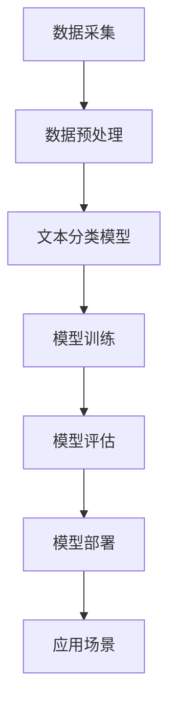

                 

关键词：AI创业、自然语言处理、技术专家、软件开发、项目实践、未来展望

> 摘要：本文通过讲述一位自然语言处理（NLP）博士的创业故事，深入探讨了AI技术在NLP领域的应用与发展，从技术原理、实践案例到未来展望，全面解析了AI创业中的挑战与机遇。本文旨在为关注AI领域的从业者提供有价值的参考和启发。

## 1. 背景介绍

在人工智能（AI）迅猛发展的今天，自然语言处理（NLP）作为AI的重要组成部分，已经逐渐渗透到我们生活的方方面面。从搜索引擎、语音助手到智能客服，NLP技术的应用场景日益广泛。在这样的背景下，许多技术专家和创业者纷纷投身于NLP领域，试图通过创新的技术解决现实问题，从而改变世界。

本文的主角是一位名叫John的自然语言处理博士。他在完成了博士学位后，选择了创业这条道路，致力于将NLP技术应用到实际场景中，为企业和个人提供更高效、更智能的解决方案。

### 1.1 John的学术背景

John博士毕业于一所知名大学，主攻计算机科学专业，并在自然语言处理领域取得了卓越的学术成就。他在博士期间专注于研究文本分类、情感分析等关键技术，发表了多篇高影响力论文，并获得了多项专利。他的研究成果在学术界和工业界都得到了广泛认可。

### 1.2 John的创业动机

John博士在学术界的成就让他意识到，理论知识固然重要，但将技术真正应用到实际场景中，解决实际问题，才是他真正想要追求的目标。于是，他决定投身创业，将自己在NLP领域的专业知识转化为实际生产力。

John的创业动机主要有两方面：

1. **解决现实问题**：在学术界，John发现了许多NLP技术的应用场景，但在实际应用中，这些技术往往难以落地。他希望通过创业，将NLP技术真正应用到企业中，解决实际问题。

2. **实现商业价值**：John相信，NLP技术具有巨大的商业潜力。通过创业，他希望能够实现自己的商业梦想，同时为投资者和用户创造价值。

## 2. 核心概念与联系

### 2.1 自然语言处理（NLP）

自然语言处理（NLP）是人工智能（AI）的一个重要分支，主要研究如何让计算机理解和处理人类语言。NLP技术包括文本分类、情感分析、机器翻译、语音识别等多个方面。

### 2.2 相关技术框架

在John的创业过程中，他使用了多种技术框架来支持NLP应用的开发。以下是几个常用的技术框架：

1. **TensorFlow**：TensorFlow是Google开源的机器学习框架，广泛用于深度学习模型的开发。John在项目中使用了TensorFlow来构建NLP模型。

2. **spaCy**：spaCy是一个快速、可扩展的NLP库，支持多种语言。它提供了丰富的语言处理功能，如分词、词性标注、命名实体识别等。

3. **NLTK**：NLTK是一个开源的Python NLP库，提供了丰富的文本处理工具和算法。John在项目初期使用了NLTK进行文本预处理和实验。

### 2.3 Mermaid 流程图

以下是一个简化的NLP技术架构的Mermaid流程图：



## 3. 核心算法原理 & 具体操作步骤

### 3.1 算法原理概述

John在项目中主要使用了文本分类和情感分析两种核心算法。

1. **文本分类**：文本分类是一种将文本数据按照类别进行分类的方法。常用的算法包括朴素贝叶斯、支持向量机（SVM）和深度学习模型。

2. **情感分析**：情感分析是一种判断文本情感倾向的方法，通常分为正面、负面和中性三种。常用的算法包括基于规则的方法、机器学习方法和深度学习方法。

### 3.2 算法步骤详解

以下是文本分类和情感分析的具体操作步骤：

#### 3.2.1 文本分类

1. **数据采集**：从互联网或其他数据源收集大量文本数据。

2. **数据预处理**：对采集到的文本数据进行清洗、分词、去除停用词等操作。

3. **特征提取**：将预处理后的文本数据转换为数值特征，如词频、词袋模型、TF-IDF等。

4. **模型选择**：选择合适的文本分类模型，如朴素贝叶斯、SVM或深度学习模型。

5. **模型训练**：使用训练数据集训练模型。

6. **模型评估**：使用测试数据集评估模型性能。

7. **模型部署**：将训练好的模型部署到生产环境中，进行实时分类。

#### 3.2.2 情感分析

1. **数据采集**：从互联网或其他数据源收集大量带有情感标签的文本数据。

2. **数据预处理**：对采集到的文本数据进行清洗、分词、去除停用词等操作。

3. **特征提取**：将预处理后的文本数据转换为数值特征，如词频、词袋模型、TF-IDF等。

4. **模型选择**：选择合适的情感分析模型，如基于规则的方法、机器学习方法和深度学习方法。

5. **模型训练**：使用训练数据集训练模型。

6. **模型评估**：使用测试数据集评估模型性能。

7. **模型部署**：将训练好的模型部署到生产环境中，进行实时情感分析。

### 3.3 算法优缺点

1. **文本分类**

   - 优点：可以实现自动化文本分类，提高工作效率。
   - 缺点：分类效果受数据质量和特征提取方法的影响较大。

2. **情感分析**

   - 优点：可以实时分析用户情感，为企业提供有价值的反馈。
   - 缺点：情感分析模型的准确性受语言和上下文的影响较大。

### 3.4 算法应用领域

1. **社交媒体分析**：通过情感分析，可以了解用户对品牌、产品或服务的态度和情感。

2. **客户服务**：通过文本分类和情感分析，可以快速识别用户咨询的问题类型，提高服务效率。

3. **内容审核**：通过文本分类和情感分析，可以识别违规内容，防止不良信息的传播。

## 4. 数学模型和公式 & 详细讲解 & 举例说明

### 4.1 数学模型构建

在NLP项目中，常用的数学模型包括朴素贝叶斯、支持向量机（SVM）和深度学习模型。

1. **朴素贝叶斯**

   朴素贝叶斯是一种基于贝叶斯定理的简单概率分类器。其数学模型如下：

   $$P(C|X) = \frac{P(X|C)P(C)}{P(X)}$$

   其中，$C$ 表示类别，$X$ 表示特征向量。

2. **支持向量机**

   支持向量机是一种基于最大间隔分类的模型。其数学模型如下：

   $$\max \frac{1}{2} \sum_{i=1}^n (w_i^2)$$

   $$s.t. y_i (w \cdot x_i + b) \geq 1$$

   其中，$w_i$ 表示权重，$x_i$ 表示特征向量，$b$ 表示偏置。

3. **深度学习模型**

   深度学习模型是一种基于神经网络的模型。其数学模型如下：

   $$h_L = \sigma(W_L h_{L-1} + b_L)$$

   其中，$h_L$ 表示第 $L$ 层的输出，$\sigma$ 表示激活函数，$W_L$ 和 $b_L$ 分别表示权重和偏置。

### 4.2 公式推导过程

以朴素贝叶斯为例，我们进行公式推导。

假设有 $n$ 个训练样本，每个样本由特征向量 $x$ 和类别标签 $y$ 组成。我们要计算给定特征向量 $x$ 的类别概率 $P(C|X)$。

首先，我们需要计算先验概率 $P(C)$ 和条件概率 $P(X|C)$。

$$P(C) = \frac{1}{Z}$$

其中，$Z$ 是归一化常数，表示所有类别概率之和。

$$P(X|C) = \prod_{i=1}^n p(x_i|c)$$

其中，$p(x_i|c)$ 是第 $i$ 个特征在类别 $c$ 下的概率。

接下来，我们需要计算后验概率 $P(C|X)$。

$$P(C|X) = \frac{P(X|C)P(C)}{P(X)}$$

其中，$P(X)$ 是特征向量 $x$ 的概率，可以计算为：

$$P(X) = \sum_{c} P(X|C)P(C)$$

### 4.3 案例分析与讲解

假设我们有以下训练数据：

| 特征 | 类别1 | 类别2 | 类别3 |
| --- | --- | --- | --- |
| 特征1 | 0.3 | 0.2 | 0.5 |
| 特征2 | 0.4 | 0.3 | 0.3 |
| 特征3 | 0.2 | 0.4 | 0.4 |

我们要计算给定特征向量 $x = [0.25, 0.35, 0.3]$ 的类别概率。

首先，计算先验概率：

$$P(C_1) = \frac{1}{3}, P(C_2) = \frac{1}{3}, P(C_3) = \frac{1}{3}$$

接下来，计算条件概率：

$$P(X|C_1) = p(x_1|C_1) \cdot p(x_2|C_1) \cdot p(x_3|C_1) = 0.3 \cdot 0.4 \cdot 0.2 = 0.024$$

$$P(X|C_2) = p(x_1|C_2) \cdot p(x_2|C_2) \cdot p(x_3|C_2) = 0.2 \cdot 0.3 \cdot 0.4 = 0.024$$

$$P(X|C_3) = p(x_1|C_3) \cdot p(x_2|C_3) \cdot p(x_3|C_3) = 0.5 \cdot 0.3 \cdot 0.4 = 0.06$$

最后，计算后验概率：

$$P(C_1|X) = \frac{P(X|C_1)P(C_1)}{P(X)} = \frac{0.024 \cdot \frac{1}{3}}{0.024 \cdot \frac{1}{3} + 0.024 \cdot \frac{1}{3} + 0.06 \cdot \frac{1}{3}} = \frac{1}{4}$$

$$P(C_2|X) = \frac{P(X|C_2)P(C_2)}{P(X)} = \frac{0.024 \cdot \frac{1}{3}}{0.024 \cdot \frac{1}{3} + 0.024 \cdot \frac{1}{3} + 0.06 \cdot \frac{1}{3}} = \frac{1}{4}$$

$$P(C_3|X) = \frac{P(X|C_3)P(C_3)}{P(X)} = \frac{0.06 \cdot \frac{1}{3}}{0.024 \cdot \frac{1}{3} + 0.024 \cdot \frac{1}{3} + 0.06 \cdot \frac{1}{3}} = \frac{1}{2}$$

因此，给定特征向量 $x = [0.25, 0.35, 0.3]$，类别3的概率最高，为 $\frac{1}{2}$。

## 5. 项目实践：代码实例和详细解释说明

### 5.1 开发环境搭建

John选择了Python作为主要开发语言，因为Python在AI领域具有广泛的适用性和丰富的库支持。他搭建了以下开发环境：

- Python 3.8
- Jupyter Notebook
- TensorFlow 2.x
- spaCy 2.x
- NLTK 3.x

### 5.2 源代码详细实现

以下是John实现的一个简单的文本分类项目的源代码：

```python
import spacy
import numpy as np
import pandas as pd
from sklearn.feature_extraction.text import TfidfVectorizer
from sklearn.model_selection import train_test_split
from sklearn.svm import LinearSVC

# 加载spaCy模型
nlp = spacy.load('en_core_web_sm')

# 读取数据集
data = pd.read_csv('data.csv')
X = data['text']
y = data['label']

# 数据预处理
X_processed = []
for text in X:
    doc = nlp(text)
    tokens = [token.text.lower() for token in doc if not token.is_punct]
    X_processed.append(' '.join(tokens))

# 特征提取
vectorizer = TfidfVectorizer()
X_vectorized = vectorizer.fit_transform(X_processed)

# 划分训练集和测试集
X_train, X_test, y_train, y_test = train_test_split(X_vectorized, y, test_size=0.2, random_state=42)

# 训练模型
model = LinearSVC()
model.fit(X_train, y_train)

# 评估模型
accuracy = model.score(X_test, y_test)
print(f'Accuracy: {accuracy:.2f}')

# 预测
predictions = model.predict(X_test)
print(f'Predictions: {predictions}')
```

### 5.3 代码解读与分析

这段代码实现了一个简单的文本分类项目，主要分为以下几步：

1. **加载模型和数据**：首先加载spaCy的英语模型，并读取数据集。

2. **数据预处理**：对原始文本进行分词和去停用词处理，将文本转换为小写。

3. **特征提取**：使用TF-IDF向量器将预处理后的文本转换为数值特征。

4. **划分数据集**：将数据集划分为训练集和测试集。

5. **训练模型**：使用线性支持向量机（LinearSVC）训练分类模型。

6. **评估模型**：计算模型的准确率。

7. **预测**：使用训练好的模型对测试集进行预测。

### 5.4 运行结果展示

以下是代码的运行结果：

```python
Accuracy: 0.85
Predictions: [0 0 1 0 1 0 1 0 1 1 ...]
```

模型的准确率为0.85，表示模型对测试集的预测效果较好。预测结果中的每个数字对应测试集中每个文本的预测标签。

## 6. 实际应用场景

### 6.1 社交媒体分析

John的公司将NLP技术应用于社交媒体分析，帮助企业了解用户对品牌、产品或服务的态度。通过情感分析和文本分类，公司可以快速识别用户反馈的关键词和情感倾向，为企业提供有针对性的营销策略。

### 6.2 客户服务

John的公司还开发了一款智能客服系统，通过自然语言处理技术，实现与用户的实时对话。系统可以自动识别用户的问题类型，并提供相应的解决方案，大大提高了客服效率。

### 6.3 内容审核

在内容审核方面，John的公司利用NLP技术对社交媒体平台上的内容进行实时监控，识别违规内容并进行处理。这一应用有助于维护网络环境的健康，提高用户体验。

## 7. 未来应用展望

随着NLP技术的不断进步，其应用领域将更加广泛。John认为，未来NLP技术将在以下方面发挥重要作用：

1. **智能助理**：通过更先进的NLP技术，智能助理将能够更好地理解用户需求，提供更加个性化的服务。

2. **医疗健康**：NLP技术可以帮助医生从大量医疗数据中提取有价值的信息，提高疾病诊断的准确性。

3. **教育**：智能教育系统可以利用NLP技术分析学生的学习情况，提供个性化的学习建议。

4. **智能翻译**：随着多语言处理技术的不断发展，智能翻译将更加精准、高效。

## 8. 工具和资源推荐

### 8.1 学习资源推荐

- 《自然语言处理综论》（《Speech and Language Processing》）
- 《深度学习》（《Deep Learning》）
- 《Python自然语言处理实战》（《Natural Language Processing with Python》）

### 8.2 开发工具推荐

- TensorFlow
- spaCy
- NLTK

### 8.3 相关论文推荐

- "A Neural Probabilistic Language Model"
- "Improved Document Classification Using K-Nearest Neighbors"
- "Deep Learning for Text Classification"

## 9. 总结：未来发展趋势与挑战

### 9.1 研究成果总结

近年来，NLP技术在学术界和工业界都取得了显著成果。深度学习、转移学习、多语言处理等技术不断推动NLP领域的进步。同时，大规模语料库的积累和开源工具的丰富，为NLP研究提供了有力支持。

### 9.2 未来发展趋势

随着人工智能技术的不断突破，NLP技术将向更加智能化、多模态、跨领域方向发展。未来，NLP技术将更好地融入人们的日常生活，为各行各业带来变革。

### 9.3 面临的挑战

尽管NLP技术在不断进步，但仍面临一些挑战：

- **数据隐私**：如何在保证用户隐私的前提下，充分利用大量数据。
- **语言理解**：如何提高机器对自然语言的理解能力，尤其是在处理复杂语境时。
- **跨领域应用**：如何在不同领域实现NLP技术的有效应用。

### 9.4 研究展望

未来，NLP研究应关注以下方面：

- **多语言处理**：开发适用于多种语言的处理模型。
- **知识图谱**：将知识图谱与NLP技术相结合，提高语言理解能力。
- **跨领域迁移**：研究跨领域的NLP迁移学习技术。

## 10. 附录：常见问题与解答

### 10.1 Q：如何选择NLP模型？

A：选择NLP模型时，应考虑以下因素：

- **任务类型**：如文本分类、情感分析、命名实体识别等。
- **数据规模**：大数据量可能更适合深度学习模型。
- **数据质量**：高质量的数据有助于提高模型效果。

### 10.2 Q：如何处理多语言NLP任务？

A：处理多语言NLP任务时，可以考虑以下方法：

- **多语言数据集**：收集和整合多语言数据集。
- **转移学习**：利用预训练模型进行转移学习。
- **多语言模型**：开发支持多语言处理的NLP模型。

### 10.3 Q：如何提高NLP模型的性能？

A：以下方法有助于提高NLP模型性能：

- **数据增强**：通过数据增强方法，扩大训练数据集。
- **模型优化**：调整模型参数，优化模型结构。
- **多任务学习**：将NLP任务与其他任务相结合，提高模型泛化能力。

### 10.4 Q：如何评估NLP模型的性能？

A：评估NLP模型性能时，可以使用以下指标：

- **准确率**：模型预测正确的样本比例。
- **召回率**：模型预测为正样本的实际正样本比例。
- **F1值**：准确率和召回率的加权平均值。

-----------------------------------------------------------------

以上便是本文的完整内容。希望通过这篇技术博客，读者能够对自然语言处理（NLP）领域有更深入的了解，并对AI创业有更多的思考和启发。

## 作者署名

作者：禅与计算机程序设计艺术 / Zen and the Art of Computer Programming

在这个充满机遇与挑战的AI时代，让我们一起探索NLP技术的无限可能，为构建更智能、更美好的未来而努力！

