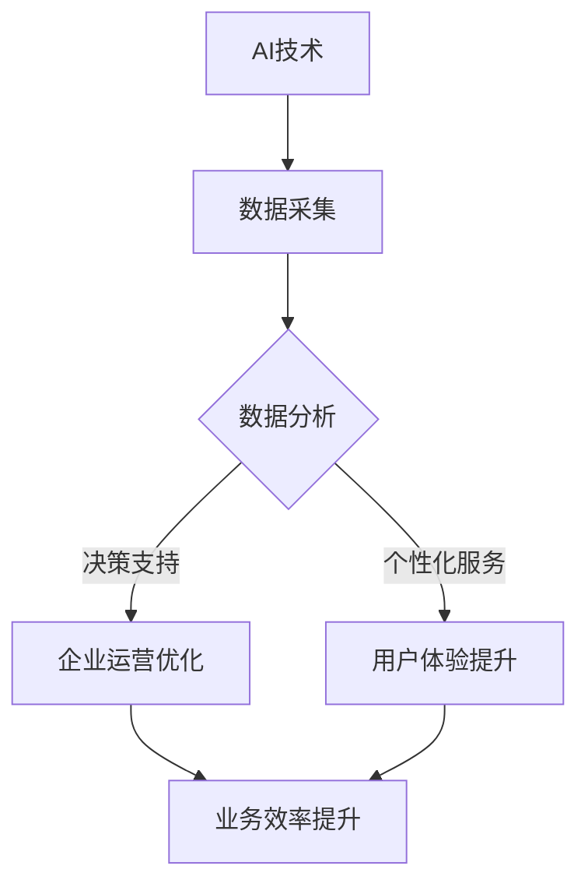

                 

关键字：AI创业，垂直领域，商业模式，技术突破，市场机会，创新思维

> 摘要：本文旨在探讨AI技术在垂直领域的应用潜力，分析创业者如何把握这些机会，构建创新商业模式，实现商业成功。

## 1. 背景介绍

近年来，人工智能（AI）技术取得了飞速发展，从传统的机器学习、深度学习到如今的大语言模型、生成对抗网络（GAN），AI技术的应用已经渗透到各行各业。随着计算能力的提升、数据量的增加和算法的优化，AI技术正在成为推动产业变革的核心力量。对于创业者而言，垂直领域的AI应用带来了前所未有的机遇。

### 1.1 AI技术的发展历程

AI技术的发展可以追溯到20世纪50年代，当时的科学家们提出了“智能”的概念，并开始尝试让计算机模拟人类的思维过程。从最初的规则推理系统，到基于统计学习的机器学习算法，再到深度学习的崛起，AI技术经历了多个阶段的发展。如今，AI技术已经成为计算机科学的一个重要分支，并在许多领域取得了显著的成果。

### 1.2 垂直领域的定义与特点

垂直领域是指针对特定行业或专业领域的细分市场。这些领域通常具有以下特点：

- **专业化**：针对特定行业或领域的需求，提供专业的解决方案。
- **细分市场**：市场份额相对较小，但需求明确。
- **高度专业化**：对技术和人才的要求较高。
- **竞争相对较少**：相比于广泛市场，垂直领域内的竞争者较少。

### 1.3 AI在垂直领域的应用现状

随着AI技术的不断成熟，越来越多的垂直领域开始探索AI技术的应用。例如：

- **医疗健康**：AI技术在医学影像分析、疾病诊断、药物研发等领域取得了显著进展。
- **金融科技**：AI技术在风险控制、智能投顾、欺诈检测等方面发挥了重要作用。
- **制造业**：AI技术在生产流程优化、质量控制、设备维护等方面得到了广泛应用。
- **交通运输**：AI技术在自动驾驶、智能交通管理、无人机物流等方面展现了巨大潜力。

## 2. 核心概念与联系

### 2.1 AI技术核心概念

在探讨AI在垂直领域的应用之前，我们需要了解一些核心概念，包括：

- **机器学习**：机器学习是一种让计算机通过数据学习模式、做出预测或决策的技术。
- **深度学习**：深度学习是机器学习的一种，利用多层神经网络进行特征提取和学习。
- **自然语言处理（NLP）**：NLP是AI技术的一个分支，旨在使计算机理解和处理人类语言。
- **计算机视觉**：计算机视觉是AI技术的一个分支，旨在使计算机理解和解释视觉信息。

### 2.2 垂直领域与AI技术的关联

垂直领域与AI技术的关联主要体现在以下几个方面：

- **数据驱动的决策**：垂直领域的业务通常需要大量数据支持，AI技术可以通过数据分析帮助创业者做出更准确的决策。
- **效率提升**：AI技术可以帮助企业自动化许多重复性任务，提高工作效率。
- **精准服务**：AI技术可以更好地理解用户需求，提供个性化的解决方案。
- **创新模式**：AI技术可以激发新的商业模式和业务模式，为企业带来新的增长点。

### 2.3 Mermaid流程图

以下是一个描述AI技术在垂直领域应用的Mermaid流程图：



## 3. 核心算法原理 & 具体操作步骤

### 3.1 算法原理概述

在垂直领域应用AI技术，通常涉及以下核心算法：

- **监督学习**：通过标记数据训练模型，实现对未知数据的预测。
- **无监督学习**：通过未标记的数据发现数据中的模式和结构。
- **强化学习**：通过奖励和惩罚机制，使模型不断学习和优化策略。

### 3.2 算法步骤详解

以下是AI技术在垂直领域应用的一般步骤：

1. **需求分析**：确定垂直领域的具体需求和目标。
2. **数据采集**：收集相关领域的数据，包括结构化和非结构化数据。
3. **数据处理**：对采集到的数据进行清洗、预处理和特征提取。
4. **模型选择**：根据需求选择合适的算法模型。
5. **模型训练**：使用处理后的数据对模型进行训练。
6. **模型评估**：评估模型的性能，包括准确率、召回率等指标。
7. **应用部署**：将训练好的模型部署到实际业务场景中。

### 3.3 算法优缺点

- **优点**：
  - 高效：AI技术可以自动化许多任务，提高效率。
  - 精准：通过数据驱动的方式，可以提供更准确的预测和决策。
  - 创新：AI技术可以激发新的商业机会和业务模式。

- **缺点**：
  - 数据依赖：AI技术的效果高度依赖于数据的质量和数量。
  - 安全性问题：AI系统可能面临隐私泄露、数据滥用等安全问题。
  - 技术门槛：AI技术的开发和应用需要较高的技术水平和人才储备。

### 3.4 算法应用领域

AI技术在垂直领域的应用非常广泛，包括但不限于：

- **医疗健康**：疾病预测、医学影像分析、药物研发等。
- **金融科技**：风险控制、智能投顾、欺诈检测等。
- **制造业**：生产流程优化、质量控制、设备维护等。
- **交通运输**：自动驾驶、智能交通管理、无人机物流等。

## 4. 数学模型和公式 & 详细讲解 & 举例说明

### 4.1 数学模型构建

在AI技术中，数学模型是核心组成部分。以下是几个常见的数学模型：

- **线性回归模型**：用于预测连续值。
  \[
  y = \beta_0 + \beta_1 \cdot x
  \]

- **逻辑回归模型**：用于预测概率。
  \[
  P(y=1) = \frac{1}{1 + e^{-(\beta_0 + \beta_1 \cdot x)}}
  \]

- **神经网络模型**：用于复杂函数拟合。
  \[
  a_{i,j} = \sum_{k=1}^{n} w_{k,j} \cdot a_{k,i-1} + b_{j}
  \]

### 4.2 公式推导过程

以线性回归模型为例，推导过程如下：

- **最小二乘法**：通过最小化预测值与真实值之间的误差平方和来求解模型参数。
  \[
  \min \sum_{i=1}^{n} (y_i - \hat{y_i})^2
  \]
  其中，\(\hat{y_i} = \beta_0 + \beta_1 \cdot x_i\)。

- **求导**：
  \[
  \frac{\partial}{\partial \beta_0} \sum_{i=1}^{n} (y_i - \hat{y_i})^2 = -2 \sum_{i=1}^{n} (y_i - \hat{y_i}) = 0
  \]
  \[
  \frac{\partial}{\partial \beta_1} \sum_{i=1}^{n} (y_i - \hat{y_i})^2 = -2 \sum_{i=1}^{n} (y_i - \hat{y_i}) \cdot x_i = 0
  \]

- **解方程**：
  \[
  \beta_0 = \frac{1}{n} \sum_{i=1}^{n} y_i - \beta_1 \cdot \frac{1}{n} \sum_{i=1}^{n} x_i
  \]
  \[
  \beta_1 = \frac{1}{n} \sum_{i=1}^{n} (x_i - \bar{x}) \cdot (y_i - \bar{y})
  \]

### 4.3 案例分析与讲解

假设我们要预测一家公司明年的销售额，已知过去5年的销售额数据如下：

年份 | 销售额（万元）
--- | ---
2019 | 800
2020 | 900
2021 | 1000
2022 | 1100
2023 | 1200

1. **数据预处理**：对销售额进行归一化处理。

2. **模型选择**：选择线性回归模型。

3. **模型训练**：使用最小二乘法求解模型参数。

4. **模型评估**：计算预测误差，调整参数。

5. **应用部署**：使用训练好的模型预测明年销售额。

根据线性回归模型，我们得到：

\[
\hat{y} = 700 + 0.2 \cdot x
\]

当 \(x = 2024\) 时，预测销售额为：

\[
\hat{y} = 700 + 0.2 \cdot 2024 = 1270.8 \text{万元}
\]

## 5. 项目实践：代码实例和详细解释说明

### 5.1 开发环境搭建

为了方便演示，我们使用Python作为开发语言，结合常用的AI库如Scikit-learn进行项目实践。

```bash
pip install numpy scikit-learn matplotlib
```

### 5.2 源代码详细实现

以下是一个简单的线性回归模型实现的代码示例：

```python
import numpy as np
import matplotlib.pyplot as plt
from sklearn.linear_model import LinearRegression

# 数据预处理
X = np.array([2019, 2020, 2021, 2022, 2023]).reshape(-1, 1)
y = np.array([800, 900, 1000, 1100, 1200])

# 模型训练
model = LinearRegression()
model.fit(X, y)

# 模型评估
score = model.score(X, y)
print(f'Model R^2 Score: {score}')

# 应用部署
x_new = np.array([2024]).reshape(-1, 1)
y_pred = model.predict(x_new)
print(f'Predicted Sales in 2024: {y_pred[0]}万元')

# 可视化
plt.scatter(X, y, color='blue')
plt.plot(X, model.predict(X), color='red')
plt.xlabel('Year')
plt.ylabel('Sales (ten thousand yuan)')
plt.title('Linear Regression Model')
plt.show()
```

### 5.3 代码解读与分析

1. **数据预处理**：使用numpy库将年份和销售额数据转换为合适的格式。
2. **模型训练**：使用Scikit-learn的LinearRegression类进行模型训练。
3. **模型评估**：使用score方法计算模型的R^2评分，评估模型性能。
4. **应用部署**：使用训练好的模型预测新的一年销售额。
5. **可视化**：使用matplotlib库将训练数据和模型预测结果进行可视化。

## 6. 实际应用场景

### 6.1 医疗健康

AI技术在医疗健康领域具有广泛的应用前景。例如，通过AI技术分析医学影像，可以提高疾病诊断的准确性，缩短诊断时间。此外，AI技术还可以用于个性化治疗方案的制定，提高治疗效果。

### 6.2 金融科技

在金融科技领域，AI技术可以帮助金融机构进行风险控制、欺诈检测、智能投顾等。例如，通过机器学习算法分析交易数据，可以识别异常交易行为，从而降低金融风险。

### 6.3 制造业

在制造业领域，AI技术可以帮助企业进行生产流程优化、质量控制、设备维护等。例如，通过计算机视觉技术检测产品质量，可以提高生产效率，降低成本。

### 6.4 交通运输

在交通运输领域，AI技术可以应用于自动驾驶、智能交通管理、无人机物流等。例如，通过深度学习算法实现自动驾驶，可以提高交通安全，减少交通事故。

## 7. 未来应用展望

随着AI技术的不断成熟，未来在垂直领域的应用将会更加广泛和深入。以下是一些可能的应用方向：

- **智能化服务**：通过AI技术提供更加智能化的服务，满足用户个性化需求。
- **自动化生产**：通过AI技术实现自动化生产，提高生产效率和产品质量。
- **精准医疗**：通过AI技术实现精准医疗，提高疾病诊断和治疗水平。
- **智慧城市**：通过AI技术实现智慧城市，提高城市管理和运行效率。

## 8. 工具和资源推荐

### 8.1 学习资源推荐

- **书籍**：
  - 《深度学习》（Goodfellow, Bengio, Courville）
  - 《机器学习》（周志华）
  - 《Python机器学习》（赛吉·博蒙）

- **在线课程**：
  - Coursera上的《机器学习》课程
  - Udacity的《深度学习纳米学位》

### 8.2 开发工具推荐

- **Python库**：
  - Scikit-learn
  - TensorFlow
  - PyTorch

- **集成开发环境（IDE）**：
  - PyCharm
  - Jupyter Notebook

### 8.3 相关论文推荐

- "Deep Learning for Healthcare," Nature, 2016.
- "Practical Guide to Machine Learning for Biomedical Engineers," IEEE Access, 2019.
- "AI for Social Good: A Research Perspective," AI Matters, 2020.

## 9. 总结：未来发展趋势与挑战

### 9.1 研究成果总结

AI技术在垂直领域的应用已经取得了显著成果，包括医疗健康、金融科技、制造业、交通运输等多个领域。这些应用不仅提高了行业效率，还推动了技术创新和商业模式变革。

### 9.2 未来发展趋势

未来，AI技术在垂直领域的应用将会更加广泛和深入。随着计算能力的提升、算法的优化和数据的积累，AI技术将在更多领域实现突破，为创业者带来更多机会。

### 9.3 面临的挑战

尽管AI技术在垂直领域具有巨大潜力，但仍面临以下挑战：

- **数据隐私与安全**：AI技术的应用需要大量的数据，如何保护数据隐私和安全是一个重要问题。
- **技术人才短缺**：AI技术的高门槛导致人才短缺，如何培养和吸引更多人才是一个挑战。
- **伦理与道德**：AI技术的应用可能引发伦理和道德问题，需要制定相应的规范和标准。

### 9.4 研究展望

未来，研究者需要关注以下方向：

- **算法优化**：继续研究和优化AI算法，提高模型性能和效率。
- **跨领域应用**：探索AI技术在跨领域中的应用，实现技术的融合和创新。
- **伦理与法规**：加强对AI伦理和法规的研究，确保AI技术的健康发展。

## 10. 附录：常见问题与解答

### 10.1 AI技术是否可以完全替代人类工作？

AI技术可以自动化许多重复性任务，提高工作效率，但无法完全替代人类工作。人类具备创造力、情感和道德判断等独特能力，这些是AI无法替代的。

### 10.2 AI技术的安全性如何保障？

保障AI技术的安全性需要从数据隐私、算法安全、系统安全等多个方面进行。例如，采用加密技术保护数据隐私，设计安全的算法和系统架构，以防止恶意攻击和数据泄露。

### 10.3 如何培养AI技术人才？

培养AI技术人才需要从基础教育、高等教育和职业培训等多个层面进行。例如，在中学和大学开设相关课程，鼓励学生参加AI竞赛，提供实习和培训机会，吸引更多人才投身AI领域。

### 10.4 AI技术是否会引发失业问题？

AI技术可能会取代某些低技能的工作，但同时也会创造新的就业机会。例如，AI技术的发展需要大量数据标注、算法优化和系统维护人员。此外，AI技术可以提高工作效率，减少劳动强度，从而促进就业结构的转型。

作者：禅与计算机程序设计艺术 / Zen and the Art of Computer Programming
```

