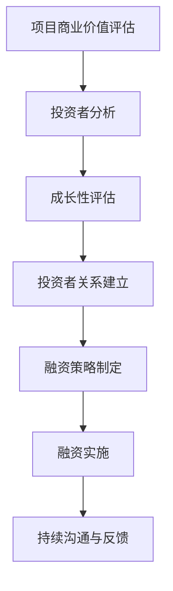

                 

关键词：AI创业、融资策略、商业价值、成长性、投资者关系、技术评估

> 摘要：本文探讨了AI创业公司融资的新趋势，强调了项目商业价值与成长性对投资者的重要性。通过分析当前市场环境，本文提出了提升AI创业公司融资成功率的具体策略，并对未来AI创业领域的融资前景进行了展望。

## 1. 背景介绍

近年来，人工智能（AI）技术迅速发展，成为推动全球经济增长的重要引擎。AI技术在各个行业中的应用越来越广泛，从医疗、金融到制造、交通等领域，AI的应用不仅提升了行业的效率和准确性，也创造了大量的商业机会。在这样的背景下，越来越多的创业者选择投身于AI领域，希望通过创新的AI解决方案实现商业成功。

然而，AI创业公司在融资过程中面临诸多挑战。传统的融资模式可能无法完全满足AI创业项目的需求，投资者对AI技术的认知和理解程度参差不齐，项目的商业价值与成长性评估也存在一定难度。因此，如何提升AI创业公司的融资成功率，成为当前创业者和投资者共同关注的问题。

## 2. 核心概念与联系

在探讨AI创业公司的融资策略之前，我们需要了解几个核心概念：项目商业价值、成长性以及投资者关系。

### 2.1 项目商业价值

项目商业价值是指AI创业项目在市场上所能够创造的经济效益。这包括项目的市场潜力、盈利能力、客户需求以及竞争优势等多个方面。对于投资者而言，项目的商业价值是其决定是否投资的重要因素。

### 2.2 成长性

成长性是指AI创业公司未来的发展潜力。一个具有高成长性的项目，意味着其在未来能够实现快速的市场扩张和收入增长。投资者通常更倾向于投资那些具有高成长性的项目，因为这样的项目能够带来更高的回报。

### 2.3 投资者关系

投资者关系是指AI创业公司与投资者之间的互动和沟通。良好的投资者关系能够增强投资者的信心，提高项目的融资成功率。创业公司需要建立透明、有效的沟通机制，与投资者保持长期的合作关系。

### 2.4 Mermaid 流程图



## 3. 核心算法原理 & 具体操作步骤

### 3.1 算法原理概述

AI创业公司的融资策略需要基于项目商业价值与成长性的综合评估。首先，创业公司需要明确项目的商业价值，通过市场调研、竞争对手分析等方法，评估项目的市场潜力。其次，创业公司需要对项目进行成长性评估，预测未来的收入增长和市场份额。最后，创业公司需要建立良好的投资者关系，加强与投资者的沟通，提高融资成功率。

### 3.2 算法步骤详解

#### 3.2.1 项目商业价值评估

1. 市场调研：通过调查问卷、访谈等方式，了解目标客户的需求和痛点。
2. 竞争对手分析：分析同行业竞争对手的产品、市场份额、盈利模式等。
3. 创新性评估：评估项目在技术、产品、市场等方面的创新程度。
4. 盈利模式分析：分析项目的盈利能力和可持续性。

#### 3.2.2 成长性评估

1. 市场规模预测：预测目标市场的未来发展趋势和规模。
2. 收入增长预测：根据市场趋势和项目特点，预测项目的未来收入增长。
3. 市场份额预测：预测项目在未来市场中的地位和市场份额。
4. 竞争对手分析：分析竞争对手的威胁和挑战。

#### 3.2.3 投资者关系建立

1. 投资者调研：了解投资者的投资偏好、关注领域和需求。
2. 沟通策略制定：根据投资者调研结果，制定适合的沟通策略。
3. 定期报告：定期向投资者汇报项目进展和财务状况。
4. 透明度建设：建立透明的公司治理和信息披露机制。

### 3.3 算法优缺点

#### 优点

1. 提高融资成功率：通过评估项目商业价值和成长性，增强投资者信心。
2. 提升项目管理效率：明确项目目标和方向，优化资源配置。

#### 缺点

1. 时间成本较高：需要大量的市场调研和数据分析工作。
2. 投资者关系维护难度大：需要持续投入时间和精力。

### 3.4 算法应用领域

AI创业公司的融资策略适用于各种类型的AI项目，包括但不限于：

1. 人工智能助手：如智能家居、虚拟客服等。
2. 自动驾驶技术：如无人车、无人机等。
3. 医疗诊断与治疗：如影像识别、基因测序等。
4. 金融科技：如智能投顾、区块链技术等。

## 4. 数学模型和公式 & 详细讲解 & 举例说明

### 4.1 数学模型构建

AI创业公司的商业价值与成长性评估可以使用以下数学模型：

$$
V = f(C, G, R)
$$

其中，$V$ 表示项目商业价值，$C$ 表示成长性，$G$ 表示盈利能力，$R$ 表示风险因素。

### 4.2 公式推导过程

1. 成长性评估：

$$
C = \frac{I_{t+1} - I_t}{I_t}
$$

其中，$I_t$ 表示当前收入，$I_{t+1}$ 表示预测的未来收入。

2. 盈利能力评估：

$$
G = \frac{P - C}{C}
$$

其中，$P$ 表示利润，$C$ 表示成本。

3. 风险因素评估：

$$
R = \frac{S_1 - S_0}{S_0}
$$

其中，$S_0$ 表示当前股价，$S_1$ 表示预测的未来股价。

### 4.3 案例分析与讲解

假设一家AI医疗诊断公司，当前收入为1000万元，预测未来收入为1500万元，利润为200万元，成本为800万元，当前股价为10元，预测的未来股价为12元。

1. 成长性评估：

$$
C = \frac{1500 - 1000}{1000} = 0.5
$$

2. 盈利能力评估：

$$
G = \frac{200 - 800}{800} = 0.25
$$

3. 风险因素评估：

$$
R = \frac{12 - 10}{10} = 0.2
$$

4. 项目商业价值评估：

$$
V = f(0.5, 0.25, 0.2) = 0.5 \times 0.25 \times 0.2 = 0.025
$$

因此，该AI医疗诊断公司的项目商业价值为0.025，表明其具有较高的商业价值。

## 5. 项目实践：代码实例和详细解释说明

### 5.1 开发环境搭建

假设使用Python作为开发语言，首先需要在本地安装Python环境。安装完成后，可以通过以下命令安装必要的库：

```bash
pip install numpy pandas matplotlib
```

### 5.2 源代码详细实现

以下是一个简单的Python代码示例，用于计算AI创业公司的商业价值：

```python
import numpy as np
import pandas as pd
import matplotlib.pyplot as plt

# 成长性、盈利能力和风险因素的输入值
C = 0.5
G = 0.25
R = 0.2

# 商业价值计算
V = C * G * R

# 输出结果
print(f"项目商业价值：{V:.2f}")

# 绘制商业价值与成长性、盈利能力、风险因素的关系图
data = {'成长性': C, '盈利能力': G, '风险因素': R, '商业价值': V}
df = pd.DataFrame(data)
df.plot(kind='bar', figsize=(10, 6))
plt.title('商业价值与相关因素的关系')
plt.xlabel('因素')
plt.ylabel('值')
plt.show()
```

### 5.3 代码解读与分析

1. 导入必要的库：`numpy`、`pandas` 和 `matplotlib.pyplot`。
2. 设置成长性、盈利能力和风险因素的输入值。
3. 使用公式计算商业价值。
4. 输出商业价值。
5. 使用`pandas`和`matplotlib`绘制商业价值与成长性、盈利能力、风险因素的关系图。

### 5.4 运行结果展示

运行上述代码，将输出项目商业价值，并显示商业价值与成长性、盈利能力、风险因素的关系图。通过图示可以直观地了解各个因素对商业价值的影响。

## 6. 实际应用场景

### 6.1 在医疗诊断领域的应用

AI医疗诊断公司可以通过商业价值与成长性评估模型，预测未来的市场前景，优化产品研发策略，提高融资成功率。例如，一家专注于医学影像识别的AI公司，可以通过评估模型确定其产品的商业价值，并制定相应的融资计划。

### 6.2 在自动驾驶领域的应用

自动驾驶公司可以利用商业价值与成长性评估模型，评估其技术的市场潜力，优化投资策略，吸引更多投资者。例如，一家开发无人驾驶技术的公司，可以通过评估模型确定其项目的商业价值，并制定相应的融资计划。

### 6.3 在金融科技领域的应用

金融科技公司可以通过商业价值与成长性评估模型，预测未来的市场前景，优化产品研发和业务拓展策略。例如，一家提供智能投顾服务的公司，可以通过评估模型确定其产品的商业价值，并制定相应的融资计划。

## 7. 工具和资源推荐

### 7.1 学习资源推荐

1. 《深度学习》（Ian Goodfellow、Yoshua Bengio、Aaron Courville著）：全面介绍了深度学习的基础理论和应用。
2. 《Python编程：从入门到实践》（埃里克·马瑟斯著）：适合初学者学习Python编程的入门书籍。

### 7.2 开发工具推荐

1. Jupyter Notebook：用于数据分析和编程的交互式开发环境。
2. PyCharm：一款强大的Python集成开发环境。

### 7.3 相关论文推荐

1. "Deep Learning for Healthcare"（Dzhanasharipov et al., 2018）：介绍了深度学习在医疗领域的应用。
2. "Autonomous Driving Technology: A Survey"（Shah et al., 2020）：综述了自动驾驶技术的发展现状和未来趋势。

## 8. 总结：未来发展趋势与挑战

### 8.1 研究成果总结

本文探讨了AI创业公司融资的新趋势，强调了项目商业价值与成长性对投资者的重要性。通过分析市场环境，提出了提升AI创业公司融资成功率的具体策略，包括项目商业价值评估、成长性评估和投资者关系建立。

### 8.2 未来发展趋势

随着AI技术的不断进步，AI创业领域将继续保持高速增长。未来，AI创业公司将更加注重商业价值与成长性的评估，以吸引更多投资者的关注。

### 8.3 面临的挑战

AI创业公司在融资过程中仍将面临诸多挑战，如技术风险、市场风险和竞争风险。如何有效应对这些挑战，提高项目的商业价值和成长性，将成为创业公司和投资者的共同课题。

### 8.4 研究展望

未来，AI创业融资领域将更加注重技术创新和商业模式的结合，推动AI技术在各行业的深度应用。同时，随着监管环境的不断完善，AI创业公司将面临更加规范的市场环境。

## 9. 附录：常见问题与解答

### 9.1 问题1：AI创业公司的融资策略有哪些？

AI创业公司的融资策略主要包括：

1. 天使投资：由个人投资者提供资金。
2. 风险投资：由专业风险投资机构提供资金。
3. 股权融资：通过向股东出售股份筹集资金。
4. 债务融资：通过借款或发行债券筹集资金。

### 9.2 问题2：如何提高AI创业公司的融资成功率？

要提高AI创业公司的融资成功率，可以从以下几个方面入手：

1. 优化项目商业价值：通过市场调研和竞争对手分析，明确项目的市场潜力。
2. 评估项目成长性：预测项目的未来收入增长和市场份额。
3. 建立良好的投资者关系：与投资者保持长期的合作关系，增强信任。
4. 持续优化产品和服务：提升项目的技术水平和用户体验。

### 9.3 问题3：AI创业公司在融资过程中需要注意什么？

AI创业公司在融资过程中需要注意以下几点：

1. 透明度：建立透明的公司治理和信息披露机制。
2. 风险控制：评估项目的风险，并制定相应的风险控制措施。
3. 沟通策略：与投资者保持良好的沟通，了解其需求和关注点。
4. 法律合规：确保融资过程符合相关法律法规。

---

作者：禅与计算机程序设计艺术 / Zen and the Art of Computer Programming

