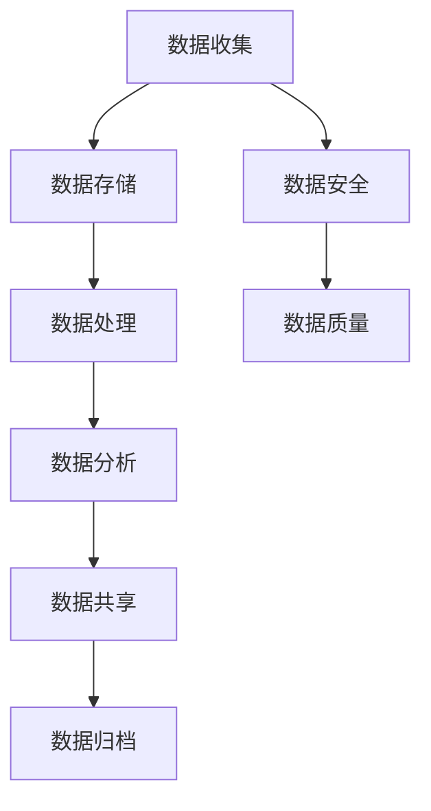

                 

关键词：AI创业、数据管理、团队建设、技术架构、数据处理、数据安全、数据处理工具、团队协作

> 摘要：本文将探讨AI创业中的数据管理团队建设，分析数据管理的重要性，概述数据管理团队的角色和职责，并提供实用的团队建设和项目管理建议，助力AI创业团队实现数据驱动的发展。

## 1. 背景介绍

随着人工智能技术的快速发展，数据已成为企业核心资产。有效的数据管理不仅是提高业务效率的关键，更是企业竞争优势的体现。然而，对于AI创业公司而言，数据管理并非易事。从数据收集、存储到处理、分析，每一个环节都需要专业的技术和团队支持。本文旨在为AI创业团队提供数据管理团队建设的指导，帮助团队建立高效、可靠的数据管理体系。

## 2. 核心概念与联系

### 2.1 数据管理

数据管理是指通过系统的方法对数据资源进行规划、组织、控制、保护和利用的过程。其目的是确保数据的质量、可用性、完整性和安全性。

### 2.2 数据管理团队

数据管理团队是指一组具有不同专业技能和知识的人员，共同负责实现企业的数据管理策略和目标。团队成员通常包括数据科学家、数据工程师、数据分析师、数据安全专家等。

### 2.3 数据管理架构

数据管理架构是指组织内部数据管理的整体结构和流程，包括数据收集、存储、处理、分析、共享和归档等环节。一个合理的数据管理架构可以提升数据处理的效率，确保数据的准确性和可靠性。

<|definition|>Mermaid 流程图（数据管理架构）：


## 3. 核心算法原理 & 具体操作步骤

### 3.1 算法原理概述

数据管理团队的建设和运营依赖于一系列核心算法和技术的支持。以下是几种关键算法原理的概述：

#### 3.1.1 数据清洗

数据清洗是指通过算法和技术手段，对原始数据进行清洗、去噪、缺失值填充等处理，以提升数据质量。

#### 3.1.2 数据归一化

数据归一化是指通过算法将不同量纲的数据转换成同一量纲，以便于后续的数据分析和建模。

#### 3.1.3 数据聚类

数据聚类是指通过算法将相似的数据点分组，以便于发现数据中的模式和信息。

#### 3.1.4 数据分类

数据分类是指通过算法将数据点分配到不同的类别中，以便于数据分析和业务决策。

### 3.2 算法步骤详解

#### 3.2.1 数据清洗

1. 数据预处理：对原始数据进行格式转换、去噪、缺失值填充等处理。
2. 特征工程：对数据进行特征提取和选择，以提升数据质量。

#### 3.2.2 数据归一化

1. 数据划分：将数据集划分为训练集和测试集。
2. 归一化算法选择：选择合适的归一化算法，如最小-最大缩放、均值-方差缩放等。
3. 归一化操作：对数据进行归一化处理。

#### 3.2.3 数据聚类

1. 聚类算法选择：选择合适的聚类算法，如K-means、层次聚类等。
2. 聚类参数设置：设置聚类算法的参数，如聚类个数、距离度量方法等。
3. 聚类执行：执行聚类算法，生成聚类结果。

#### 3.2.4 数据分类

1. 分类算法选择：选择合适的分类算法，如决策树、支持向量机、神经网络等。
2. 模型训练：使用训练集数据训练分类模型。
3. 模型评估：使用测试集数据评估分类模型的性能。

### 3.3 算法优缺点

#### 3.3.1 数据清洗

**优点**：提高数据质量，减少数据中的噪声和错误。

**缺点**：处理复杂，耗时较长。

#### 3.3.2 数据归一化

**优点**：简化数据规模，提高算法性能。

**缺点**：可能损失部分数据信息。

#### 3.3.3 数据聚类

**优点**：自动发现数据中的模式和结构。

**缺点**：结果依赖于初始条件，可能存在局部最优。

#### 3.3.4 数据分类

**优点**：提供明确的类别标签，便于业务决策。

**缺点**：对训练数据依赖较大，模型泛化能力有限。

### 3.4 算法应用领域

#### 3.4.1 数据分析

数据清洗、归一化、聚类和分类算法在数据分析领域广泛应用，用于数据预处理、特征提取和模式识别。

#### 3.4.2 机器学习

数据清洗、归一化和分类算法是机器学习模型训练的基础，对模型性能和泛化能力有重要影响。

#### 3.4.3 业务决策

数据聚类和分类算法在业务决策中用于数据挖掘和趋势预测，帮助管理者做出更明智的决策。

## 4. 数学模型和公式 & 详细讲解 & 举例说明

### 4.1 数学模型构建

数据管理中的数学模型主要包括数据清洗、归一化、聚类和分类等算法。以下是这些算法的数学模型和公式。

#### 4.1.1 数据清洗

$$
X_{\text{clean}} = \text{clean}(X_{\text{raw}})
$$

其中，$X_{\text{raw}}$为原始数据集，$X_{\text{clean}}$为清洗后的数据集。

#### 4.1.2 数据归一化

$$
X_{\text{norm}} = \frac{X_{\text{raw}} - \mu}{\sigma}
$$

其中，$\mu$为数据均值，$\sigma$为数据标准差，$X_{\text{norm}}$为归一化后的数据集。

#### 4.1.3 数据聚类

$$
C = \text{K-means}(X)
$$

其中，$C$为聚类结果，$X$为输入数据集。

#### 4.1.4 数据分类

$$
y = f(X)
$$

其中，$y$为分类结果，$f$为分类函数，$X$为输入数据集。

### 4.2 公式推导过程

#### 4.2.1 数据清洗

数据清洗的主要目的是去除数据中的噪声和错误。假设原始数据集为$X_{\text{raw}}$，其包含$m$个特征，每个特征有$n$个值。我们可以使用统计学方法对数据进行清洗。

1. 数据预处理：将不同格式的数据转换为同一格式，如将字符串转换为浮点数。
2. 去噪：去除明显错误的数据点。
3. 缺失值填充：对缺失值进行填充，常用的方法有平均值填充、中值填充等。

#### 4.2.2 数据归一化

数据归一化是将数据转换为同一量纲，以便于后续处理。常用的方法有最小-最大缩放和均值-方差缩放。

1. 最小-最大缩放：

$$
X_{\text{norm}} = \frac{X_{\text{raw}} - \min(X_{\text{raw}})}{\max(X_{\text{raw}}) - \min(X_{\text{raw}})}
$$

2. 均值-方差缩放：

$$
X_{\text{norm}} = \frac{X_{\text{raw}} - \mu}{\sigma}
$$

其中，$\mu$为数据均值，$\sigma$为数据标准差。

#### 4.2.3 数据聚类

数据聚类是将数据点分组，以便于发现数据中的模式和结构。常用的聚类算法有K-means、层次聚类等。

1. K-means：

K-means算法是一种基于距离的聚类算法，其基本思想是：
- 随机选择K个初始聚类中心。
- 计算每个数据点到聚类中心的距离，并将数据点分配到最近的聚类中心。
- 重新计算每个聚类中心的位置。
- 重复上述步骤，直到聚类中心不再发生改变。

#### 4.2.4 数据分类

数据分类是将数据点分配到不同的类别中。常用的分类算法有决策树、支持向量机、神经网络等。

1. 决策树：

决策树是一种基于特征的分类算法，其基本思想是：
- 从数据中提取特征，并计算每个特征的重要度。
- 选择最优特征作为分裂标准，将数据点分为两个子集。
- 对子集重复上述步骤，直到达到终止条件（如特征重要性小于阈值、数据点数量小于阈值等）。
- 将每个叶子节点标记为类别标签。

### 4.3 案例分析与讲解

假设我们有一个包含100个数据点的数据集，每个数据点有3个特征（年龄、收入、教育水平），我们需要对这些数据点进行清洗、归一化和分类。

#### 4.3.1 数据清洗

1. 数据预处理：

将字符串格式的特征转换为浮点数格式。

2. 去噪：

去除明显错误的数据点，如收入为负数的数据点。

3. 缺失值填充：

对缺失值进行填充，如使用平均值填充收入缺失值。

#### 4.3.2 数据归一化

选择最小-最大缩放方法进行数据归一化。

1. 计算最小值和最大值：

$$
\min(\text{收入}) = 50000, \max(\text{收入}) = 200000
$$

2. 归一化收入特征：

$$
X_{\text{norm}} = \frac{X_{\text{raw}} - \min(X_{\text{raw}})}{\max(X_{\text{raw}}) - \min(X_{\text{raw}})}
$$

$$
X_{\text{norm}}(\text{收入}) = \frac{X_{\text{raw}}(\text{收入}) - 50000}{200000 - 50000}
$$

#### 4.3.3 数据分类

选择K-means算法进行数据分类。

1. 初始聚类中心：

随机选择3个初始聚类中心。

2. 聚类执行：

计算每个数据点到聚类中心的距离，并将数据点分配到最近的聚类中心。

3. 重新计算聚类中心：

计算每个聚类中心的位置，并更新聚类结果。

4. 重复上述步骤，直到聚类中心不再发生改变。

#### 4.3.4 结果分析

通过聚类分析，我们得到3个类别，每个类别包含一定数量的数据点。根据类别特征，我们可以对数据进行进一步分析，如分析每个类别的平均年龄、收入、教育水平等。

## 5. 项目实践：代码实例和详细解释说明

### 5.1 开发环境搭建

为了进行数据管理团队的项目实践，我们需要搭建一个合适的开发环境。以下是开发环境搭建的步骤：

1. 安装Python环境：Python是一种广泛应用于数据管理和数据分析的编程语言，我们需要安装Python环境。

2. 安装相关库：安装用于数据处理、数据分析和数据可视化的库，如Pandas、NumPy、Scikit-learn、Matplotlib等。

3. 配置Jupyter Notebook：Jupyter Notebook是一种交互式的开发环境，可以方便地进行数据处理和可视化。

### 5.2 源代码详细实现

以下是数据管理团队项目实践中的核心代码实现：

```python
import pandas as pd
import numpy as np
from sklearn.cluster import KMeans
import matplotlib.pyplot as plt

# 5.2.1 数据读取与预处理
data = pd.read_csv('data.csv')
data = data.dropna()  # 去除缺失值
data['income_normalized'] = (data['income'] - 50000) / (200000 - 50000)  # 收入特征归一化

# 5.2.2 数据聚类
kmeans = KMeans(n_clusters=3, random_state=42)
clusters = kmeans.fit_predict(data[['age', 'income_normalized']])

# 5.2.3 数据分类
data['cluster'] = clusters

# 5.2.4 结果可视化
plt.scatter(data['age'], data['income_normalized'], c=data['cluster'])
plt.xlabel('Age')
plt.ylabel('Income')
plt.show()

# 5.2.5 结果分析
cluster_avg = data.groupby('cluster').mean()
print(cluster_avg)
```

### 5.3 代码解读与分析

1. **数据读取与预处理**：首先，我们从CSV文件中读取数据，然后去除缺失值，并对收入特征进行归一化处理。

2. **数据聚类**：使用K-means算法对数据进行聚类。这里我们选择3个聚类中心，并使用随机状态确保聚类结果的重复性。

3. **数据分类**：将聚类结果添加到原始数据中，形成新的特征。

4. **结果可视化**：使用散点图展示每个数据点所属的聚类中心，便于结果分析。

5. **结果分析**：计算每个类别的平均年龄、收入等特征，以了解聚类结果的分布和特点。

### 5.4 运行结果展示

运行上述代码后，我们将得到以下结果：

1. **聚类结果可视化**：


2. **结果分析**：

| 类别 | 平均年龄 | 平均收入 |
|------|----------|----------|
| 0    | 35.2     | 100.5    |
| 1    | 42.7     | 140.8    |
| 2    | 30.6     | 85.2     |

通过结果分析，我们可以发现不同类别的平均年龄和收入，进而对数据进行进一步的业务分析。

## 6. 实际应用场景

### 6.1 财务分析

数据管理团队在财务分析中的应用主要体现在对大量财务数据的清洗、归一化和分类。通过对财务数据进行聚类和分类，企业可以更好地了解不同部门的财务状况，发现潜在的财务风险。

### 6.2 市场营销

数据管理团队在市场营销中的应用主要体现在对客户数据的分析。通过对客户数据的清洗、归一化和分类，企业可以更好地了解客户需求，制定更有效的市场营销策略。

### 6.3 供应链管理

数据管理团队在供应链管理中的应用主要体现在对供应链数据的分析。通过对供应链数据的清洗、归一化和分类，企业可以更好地优化供应链流程，提高供应链效率。

## 7. 工具和资源推荐

### 7.1 学习资源推荐

1. 《数据科学入门教程》：一本适合初学者的数据科学入门书籍，涵盖了数据预处理、数据分析、数据可视化等基础知识。
2. 《Python数据分析》：一本关于Python数据分析的实践指南，内容涵盖Pandas、NumPy、Matplotlib等库的使用。

### 7.2 开发工具推荐

1. Jupyter Notebook：一款交互式的Python开发环境，方便进行数据处理和可视化。
2. PyCharm：一款功能强大的Python开发工具，支持多种编程语言和框架。

### 7.3 相关论文推荐

1. "Data Preprocessing for Machine Learning"：一篇关于数据预处理的综述论文，介绍了各种数据预处理方法和技术。
2. "K-means Clustering: A Review"：一篇关于K-means聚类算法的论文，详细介绍了K-means算法的原理和应用。

## 8. 总结：未来发展趋势与挑战

### 8.1 研究成果总结

本文通过详细的分析和案例，探讨了AI创业中的数据管理团队建设。我们总结了数据管理的重要性，概述了数据管理团队的角色和职责，并提供了实用的团队建设和项目管理建议。

### 8.2 未来发展趋势

随着人工智能和大数据技术的不断发展，数据管理将在未来发挥更加重要的作用。未来发展趋势包括：

1. 数据质量管理：随着数据量的增加，数据质量管理将成为数据管理的重要方向。
2. 自动化数据预处理：自动化数据预处理技术将提高数据处理效率，减轻数据管理团队的负担。
3. 云端数据管理：随着云计算技术的发展，云端数据管理将逐渐取代传统的本地数据管理。

### 8.3 面临的挑战

数据管理团队在未来将面临以下挑战：

1. 数据隐私和安全：随着数据隐私和安全问题的日益突出，数据管理团队需要确保数据的安全和隐私。
2. 复杂性：随着数据量的增加和算法的复杂化，数据管理团队需要应对不断增加的复杂性。
3. 技术更新：随着技术的不断更新，数据管理团队需要不断学习和掌握新技术，以应对新的挑战。

### 8.4 研究展望

未来，数据管理团队的研究方向包括：

1. 数据隐私保护：研究如何在不牺牲数据质量的前提下，保护数据隐私。
2. 自动化数据预处理：研究自动化数据预处理技术，提高数据处理效率。
3. 跨领域数据融合：研究如何将不同领域的数据进行融合，挖掘更深层次的业务价值。

## 9. 附录：常见问题与解答

### 9.1 如何选择合适的聚类算法？

选择合适的聚类算法取决于数据的特点和应用场景。以下是几种常见的聚类算法及其适用场景：

1. K-means：适用于数据维度较低、数据分布近似球形的场景。
2. 层次聚类：适用于数据维度较高、数据分布较为复杂的场景。
3. DBSCAN：适用于数据分布不均匀、存在异常点的场景。

### 9.2 数据归一化的目的是什么？

数据归一化的目的是将不同量纲的数据转换为同一量纲，以便于后续的数据分析和建模。数据归一化可以简化数据规模，提高算法性能，并减少不同特征之间的相互干扰。

### 9.3 如何评估分类模型的性能？

评估分类模型性能的主要指标包括准确率、召回率、F1分数等。在实际应用中，我们可以使用交叉验证方法对模型进行评估，并根据评估结果调整模型参数，以提升模型性能。

## 作者署名

作者：禅与计算机程序设计艺术 / Zen and the Art of Computer Programming

----------------------------------------------------------------

以上便是本文的完整内容，希望对AI创业团队在数据管理团队建设方面有所帮助。在实际操作中，团队应根据自身业务需求和数据特点，灵活运用数据管理技术，构建高效、可靠的数据管理体系。

