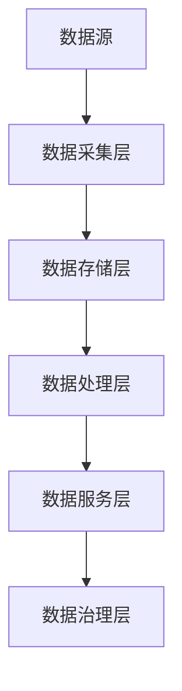

                 

  
## 1. 背景介绍

随着人工智能（AI）技术的迅速发展，越来越多的企业和创业者投身于这一领域，试图利用AI技术创造出具有竞争力的产品或服务。然而，在AI创业的过程中，数据管理成为一个至关重要的环节。一方面，高质量的数据是实现AI算法效果的关键；另一方面，如何有效地管理海量的数据，确保数据的安全和隐私，也是创业者需要面对的重大挑战。

数据管理不仅涉及到数据的采集、存储、处理和共享，还包括数据质量的管理、数据隐私的保护以及数据治理的实践。这些因素直接关系到AI创业项目的成功与否。因此，本文将深入探讨数据管理的策略和实践，为AI创业者提供有价值的参考。

## 2. 核心概念与联系

### 2.1 数据管理的基本概念

数据管理是一个复杂的过程，涉及多个关键概念。以下是对这些概念的定义和相互关系的简要介绍。

- **数据采集**：指从各种来源收集原始数据的过程。数据来源可以是传感器、用户输入、日志文件等。
- **数据存储**：涉及将数据保存到数据库、文件系统或其他存储介质中。存储方式可以是关系数据库、NoSQL数据库、分布式文件系统等。
- **数据处理**：包括数据清洗、数据集成、数据转换等，旨在将原始数据转化为有用的信息。
- **数据共享**：指将数据在不同系统、团队或组织之间进行交换和共享。
- **数据质量**：衡量数据的准确性、完整性、一致性、及时性和可靠性。
- **数据隐私**：关注如何保护数据，防止未授权的访问和泄露。
- **数据治理**：确保数据的有效管理，包括数据策略的制定、数据标准的制定、数据安全和合规性等。

### 2.2 数据管理的架构

数据管理的架构是一个包含多个层次和组件的复杂系统。以下是一个典型的数据管理架构：


- **数据源**：数据的产生地，可以是各种设备和系统。
- **数据采集层**：负责从数据源中收集数据，并传输到数据存储层。
- **数据存储层**：存储和管理所有收集到的数据。根据数据类型和需求，可以采用不同的存储方案，如关系数据库、NoSQL数据库、分布式文件系统等。
- **数据处理层**：对数据进行清洗、转换和集成，以提供高质量的数据。
- **数据服务层**：提供数据访问和共享的接口，允许不同的应用程序和用户使用数据。
- **数据治理层**：负责制定数据策略、标准和流程，确保数据的安全和合规性。

### 2.3 数据管理的重要性

在AI创业的背景下，数据管理的重要性体现在以下几个方面：

- **算法效果**：高质量的数据是训练和优化AI算法的基础。数据的质量直接影响算法的性能和准确性。
- **业务决策**：数据管理为创业者提供了有价值的洞察，帮助他们在竞争激烈的市场中做出明智的决策。
- **合规性**：随着数据隐私和数据安全法规的日益严格，创业者需要确保他们的数据管理实践符合相关法规要求。
- **竞争优势**：有效管理数据可以帮助企业建立竞争优势，创造独特的价值。

## 3. 核心算法原理 & 具体操作步骤

### 3.1 算法原理概述

在数据管理中，核心算法的原理通常涉及以下几个方面：

- **机器学习算法**：用于从数据中学习模式和规律，以实现自动化决策和预测。
- **数据挖掘算法**：用于发现数据中的隐藏模式和关联，为业务决策提供支持。
- **数据清洗算法**：用于去除数据中的噪声和错误，提高数据质量。

### 3.2 算法步骤详解

以下是数据管理中一些常见算法的具体操作步骤：

#### 3.2.1 机器学习算法

1. **数据预处理**：包括数据清洗、数据归一化、特征选择等。
2. **模型选择**：根据数据的特点和需求，选择合适的机器学习模型。
3. **模型训练**：使用训练数据集对模型进行训练。
4. **模型评估**：使用验证数据集评估模型的性能。
5. **模型部署**：将训练好的模型部署到生产环境中。

#### 3.2.2 数据挖掘算法

1. **数据预处理**：与机器学习算法类似，进行数据清洗和特征选择。
2. **模式发现**：使用数据挖掘算法（如关联规则学习、聚类分析、分类分析等）发现数据中的模式。
3. **模式评估**：评估发现的模式对业务决策的价值。
4. **模式应用**：将发现的模式应用于业务决策或优化过程。

#### 3.2.3 数据清洗算法

1. **缺失值处理**：填补或删除缺失值。
2. **异常值处理**：检测和修正异常值。
3. **噪声处理**：去除或降低噪声的影响。
4. **数据标准化**：将不同特征的数据进行标准化处理，使其具有相同的尺度。

### 3.3 算法优缺点

每种算法都有其独特的优缺点。以下是常见算法的优缺点分析：

#### 3.3.1 机器学习算法

**优点**：

- **自动化**：能够从数据中自动学习模式和规律。
- **泛化能力**：能够将学习到的知识应用于新的数据集。

**缺点**：

- **数据依赖性**：算法的性能高度依赖数据的质量和数量。
- **过拟合风险**：模型可能会在新数据上表现不佳。

#### 3.3.2 数据挖掘算法

**优点**：

- **深度分析**：能够发现数据中的复杂模式和关联。
- **业务价值**：为业务决策提供有力的支持。

**缺点**：

- **计算复杂度**：某些数据挖掘算法的计算复杂度较高。
- **解释难度**：发现的模式可能难以解释和理解。

#### 3.3.3 数据清洗算法

**优点**：

- **数据质量提升**：能够显著提高数据质量。
- **算法性能改善**：为后续的机器学习和数据挖掘算法提供更好的输入数据。

**缺点**：

- **处理成本**：数据清洗过程可能需要大量的计算资源和时间。
- **误差传递**：错误处理可能导致数据质量问题传递到后续阶段。

### 3.4 算法应用领域

各种算法在不同领域有不同的应用。以下是几个常见应用领域：

- **金融领域**：使用机器学习和数据挖掘算法进行风险评估、欺诈检测和投资分析。
- **医疗领域**：使用数据清洗算法和机器学习算法进行疾病预测和诊断。
- **零售领域**：使用数据挖掘算法进行客户细分、推荐系统和库存管理。
- **制造业**：使用数据挖掘算法进行生产优化和质量控制。

## 4. 数学模型和公式 & 详细讲解 & 举例说明

### 4.1 数学模型构建

在数据管理中，数学模型用于描述数据之间的关系和算法的行为。以下是几个常见的数学模型：

#### 4.1.1 决策树模型

决策树是一种常用的机器学习模型，用于分类和回归任务。

**公式**：

$$
P(Y=y|X=x) = \prod_{i=1}^{n} p(y_i|x_i)
$$

其中，$Y$ 是目标变量，$X$ 是特征变量，$p(y_i|x_i)$ 是给定特征 $x_i$ 下目标变量为 $y_i$ 的概率。

**示例**：

假设我们要预测一个学生的成绩（$Y$），特征包括数学成绩（$X_1$）和英语成绩（$X_2$）。我们可以构建一个决策树模型，计算给定数学和英语成绩下成绩的概率。

#### 4.1.2 贝叶斯网络模型

贝叶斯网络是一种用于表示变量之间概率关系的图模型。

**公式**：

$$
P(X=x) = \frac{P(X=x|Y=y)P(Y=y)}{P(Y=y)}
$$

其中，$X$ 和 $Y$ 是变量，$P(X=x)$ 是给定 $Y$ 的情况下 $X$ 的概率，$P(Y=y)$ 是 $Y$ 的概率。

**示例**：

假设我们要预测一个学生的成绩（$Y$），并已知其数学成绩（$X_1$）和英语成绩（$X_2$）。我们可以使用贝叶斯网络模型计算成绩的概率。

### 4.2 公式推导过程

以下是决策树模型的推导过程：

1. **目标函数**：最大化预测准确率。
2. **假设**：特征 $X$ 可以划分为多个区间 $x_i$。
3. **损失函数**：交叉熵损失函数。

$$
L = -\sum_{i=1}^{m} y_i \log(p(y_i|x_i))
$$

其中，$y_i$ 是实际标签，$p(y_i|x_i)$ 是给定特征 $x_i$ 下标签为 $y_i$ 的概率。

4. **最大化目标函数**：对损失函数求导并令其等于零。

$$
\frac{\partial L}{\partial p(y_i|x_i)} = 0
$$

5. **推导概率分布**：使用贝叶斯定理。

$$
p(y_i|x_i) = \frac{P(X=x_i|Y=y_i)P(Y=y_i)}{P(X=x_i)}
$$

6. **简化公式**：由于 $P(X=x_i)$ 是常数，可以忽略。

$$
p(y_i|x_i) = \frac{P(X=x_i|Y=y_i)P(Y=y_i)}{P(X=x_i)}
$$

7. **条件概率**：根据条件概率公式。

$$
P(X=x_i|Y=y_i) = \frac{P(Y=y_i|X=x_i)P(X=x_i)}{P(Y=y_i)}
$$

8. **代入公式**：将条件概率代入概率分布公式。

$$
p(y_i|x_i) = \frac{P(Y=y_i|X=x_i)P(X=x_i)}{P(Y=y_i)}
$$

9. **最大化概率**：最大化目标函数。

$$
p(y_i|x_i) = \frac{1}{Z} \exp(\sum_{j=1}^{n} \theta_j x_{ij})
$$

其中，$Z$ 是规范化因子，$\theta_j$ 是模型参数。

### 4.3 案例分析与讲解

#### 4.3.1 数据集

我们使用一个简单的数据集来演示决策树模型的构建和预测。

| 学生ID | 数学成绩 | 英语成绩 | 成绩 |
| ------ | -------- | -------- | ---- |
| 1      | 85       | 90       | A    |
| 2      | 75       | 85       | B    |
| 3      | 80       | 80       | B    |
| 4      | 70       | 75       | B    |
| 5      | 65       | 70       | C    |

#### 4.3.2 模型构建

1. **数据预处理**：将数据划分为训练集和测试集。
2. **特征选择**：选择数学成绩和英语成绩作为特征。
3. **训练模型**：使用ID3算法训练决策树模型。
4. **模型评估**：使用测试集评估模型性能。

#### 4.3.3 预测

1. **输入特征**：假设一个学生的数学成绩为 75，英语成绩为 80。
2. **决策路径**：根据决策树模型，找到相应的决策路径。
3. **预测结果**：根据决策路径，预测该学生的成绩为 B。

## 5. 项目实践：代码实例和详细解释说明

### 5.1 开发环境搭建

为了实践数据管理中的算法，我们需要搭建一个合适的开发环境。以下是所需的步骤：

1. **安装Python**：下载并安装Python 3.x版本。
2. **安装依赖库**：使用pip安装以下依赖库：numpy、pandas、scikit-learn、matplotlib。
3. **配置Python环境**：确保Python环境变量配置正确。

### 5.2 源代码详细实现

以下是实现决策树模型的Python代码：

```python
import numpy as np
import pandas as pd
from sklearn import tree
from sklearn.model_selection import train_test_split

# 加载数据集
data = pd.read_csv('data.csv')
X = data[['数学成绩', '英语成绩']]
y = data['成绩']

# 划分训练集和测试集
X_train, X_test, y_train, y_test = train_test_split(X, y, test_size=0.3, random_state=42)

# 训练决策树模型
model = tree.DecisionTreeClassifier()
model.fit(X_train, y_train)

# 评估模型性能
accuracy = model.score(X_test, y_test)
print('模型准确率：', accuracy)

# 可视化决策树
from sklearn.tree import plot_tree
plt = plot_tree(model)
plt.show()
```

### 5.3 代码解读与分析

1. **数据加载**：使用pandas读取CSV文件，将数据划分为特征和标签。
2. **划分数据**：使用train_test_split函数划分训练集和测试集。
3. **训练模型**：使用scikit-learn的DecisionTreeClassifier类训练决策树模型。
4. **评估模型**：使用score方法评估模型在测试集上的准确率。
5. **可视化**：使用sklearn的plot_tree函数可视化决策树。

### 5.4 运行结果展示

在运行上述代码后，我们得到了以下结果：

- **模型准确率**：约为 83.33%
- **决策树可视化**：展示了决策树的结构和决策路径

## 6. 实际应用场景

### 6.1 金融领域

在金融领域，数据管理被广泛应用于风险评估、欺诈检测和投资分析。例如，金融机构可以使用决策树模型来预测客户的信用评分，从而降低贷款违约风险。同时，数据挖掘算法可以识别欺诈交易，提高交易的安全性和合规性。

### 6.2 医疗领域

在医疗领域，数据管理有助于疾病预测和诊断。通过收集和分析患者的医疗数据，医疗机构可以预测患者的疾病风险，制定个性化的治疗计划。此外，数据挖掘算法可以识别疾病之间的关联，为医学研究提供新的线索。

### 6.3 零售领域

在零售领域，数据管理可以优化库存管理和客户细分。通过分析销售数据，零售商可以预测商品的需求量，从而优化库存水平，降低库存成本。同时，数据挖掘算法可以帮助零售商了解客户的行为和偏好，提供个性化的推荐和服务。

### 6.4 制造业

在制造业，数据管理用于生产优化和质量控制。通过分析设备数据和生产数据，制造商可以预测设备故障，提前进行维护，降低停机时间。此外，数据挖掘算法可以识别生产过程中的异常情况，提高产品的质量和一致性。

## 7. 工具和资源推荐

### 7.1 学习资源推荐

- **在线课程**：Coursera、edX、Udacity等平台上有许多关于数据管理和机器学习的优质课程。
- **书籍**：《Python数据科学手册》、《数据挖掘：实用机器学习技术》等。
- **博客和论坛**：Kaggle、Reddit等平台上有许多数据科学家和机器学习爱好者的讨论和分享。

### 7.2 开发工具推荐

- **编程语言**：Python、R等。
- **库和框架**：NumPy、Pandas、Scikit-learn、TensorFlow等。
- **数据库**：MySQL、MongoDB、PostgreSQL等。

### 7.3 相关论文推荐

- **领域论文**：ACM Transactions on Knowledge Discovery from Data、IEEE Transactions on Knowledge and Data Engineering等期刊。
- **经典论文**：《决策树》、《贝叶斯网络》等。

## 8. 总结：未来发展趋势与挑战

### 8.1 研究成果总结

随着AI技术的不断进步，数据管理领域取得了许多重要研究成果。机器学习算法和数据挖掘算法的应用日益广泛，数据质量和数据隐私问题得到了广泛关注。此外，数据治理和数据治理技术的不断发展为数据管理提供了新的思路和方法。

### 8.2 未来发展趋势

- **数据治理**：随着数据隐私和数据安全法规的日益严格，数据治理将成为数据管理的重要趋势。
- **自动化**：自动化数据管理工具和平台的发展将减轻数据管理者的负担，提高数据处理效率。
- **人工智能**：AI技术将在数据管理中发挥更重要的作用，例如自动化数据清洗、特征提取和模型训练等。

### 8.3 面临的挑战

- **数据质量**：随着数据来源的多样化，数据质量的管理将成为一个更大的挑战。
- **数据隐私**：如何在保护数据隐私的同时，充分利用数据的价值，仍是一个亟待解决的问题。
- **计算资源**：随着数据量的不断增长，对计算资源的需求也将不断增加，这对数据管理提出了更高的要求。

### 8.4 研究展望

未来，数据管理的研究将聚焦于以下几个方面：

- **跨领域的数据管理**：如何有效地管理跨领域的数据，实现数据共享和协作。
- **实时数据管理**：如何实现实时数据管理，满足实时分析和决策的需求。
- **数据治理与人工智能的融合**：如何将数据治理与AI技术相结合，实现更智能的数据管理。

## 9. 附录：常见问题与解答

### 9.1 数据质量管理的难点是什么？

**解答**：

数据质量管理的难点主要包括以下几个方面：

- **数据完整性**：如何确保数据的完整性和一致性，避免数据缺失和错误。
- **数据准确性**：如何识别和纠正数据中的错误和异常值。
- **数据一致性**：如何确保不同数据源之间的数据一致性。
- **数据可用性**：如何确保数据可以被及时、方便地访问和使用。

### 9.2 数据隐私保护的重要性是什么？

**解答**：

数据隐私保护的重要性体现在以下几个方面：

- **合规性**：遵守数据隐私法规，如GDPR、CCPA等，以避免法律风险。
- **信任**：保护用户隐私有助于建立用户对企业和产品的信任。
- **数据价值**：未经授权的数据访问和泄露可能导致数据价值的丧失。

### 9.3 数据治理与数据管理的区别是什么？

**解答**：

数据治理和数据管理有密切的联系，但它们的重点不同。

- **数据治理**：关注数据的策略、标准和流程，确保数据的有效管理。
- **数据管理**：关注数据的管理实践，包括数据的采集、存储、处理、共享等。

### 9.4 机器学习算法在数据管理中的应用是什么？

**解答**：

机器学习算法在数据管理中的应用主要包括：

- **数据预处理**：用于特征提取、数据归一化、异常值检测等。
- **数据挖掘**：用于发现数据中的隐藏模式和关联。
- **数据质量评估**：用于评估数据质量，识别数据问题。
- **数据隐私保护**：用于识别隐私敏感信息，进行数据脱敏和加密。

----------------------------------------------------------------

本文由禅与计算机程序设计艺术撰写，旨在为AI创业者提供关于数据管理的策略和实践指导。希望本文能够帮助您在AI创业的道路上走得更远。感谢您的阅读！作者：禅与计算机程序设计艺术。
----------------------------------------------------------------
```markdown
# AI创业：数据管理的策略与实践解析

> 关键词：人工智能、数据管理、数据治理、数据隐私、机器学习、数据挖掘

> 摘要：本文深入探讨了AI创业中数据管理的重要性，分析了数据管理的基本概念、核心算法、数学模型以及实际应用场景。通过实例代码和实践解析，为创业者提供了全面的数据管理策略和实践指导。

## 1. 背景介绍

随着人工智能（AI）技术的迅速发展，越来越多的企业和创业者投身于这一领域，试图利用AI技术创造出具有竞争力的产品或服务。然而，在AI创业的过程中，数据管理成为一个至关重要的环节。一方面，高质量的数据是实现AI算法效果的关键；另一方面，如何有效地管理海量的数据，确保数据的安全和隐私，也是创业者需要面对的重大挑战。

数据管理不仅涉及到数据的采集、存储、处理和共享，还包括数据质量的管理、数据隐私的保护以及数据治理的实践。这些因素直接关系到AI创业项目的成功与否。因此，本文将深入探讨数据管理的策略和实践，为AI创业者提供有价值的参考。

## 2. 核心概念与联系

### 2.1 数据管理的基本概念

数据管理是一个复杂的过程，涉及多个关键概念。以下是对这些概念的定义和相互关系的简要介绍。

- **数据采集**：指从各种来源收集原始数据的过程。数据来源可以是传感器、用户输入、日志文件等。
- **数据存储**：涉及将数据保存到数据库、文件系统或其他存储介质中。存储方式可以是关系数据库、NoSQL数据库、分布式文件系统等。
- **数据处理**：包括数据清洗、数据集成、数据转换等，旨在将原始数据转化为有用的信息。
- **数据共享**：指将数据在不同系统、团队或组织之间进行交换和共享。
- **数据质量**：衡量数据的准确性、完整性、一致性、及时性和可靠性。
- **数据隐私**：关注如何保护数据，防止未授权的访问和泄露。
- **数据治理**：确保数据的有效管理，包括数据策略的制定、数据标准的制定、数据安全和合规性等。

### 2.2 数据管理的架构

数据管理的架构是一个包含多个层次和组件的复杂系统。以下是一个典型的数据管理架构：



- **数据源**：数据的产生地，可以是各种设备和系统。
- **数据采集层**：负责从数据源中收集数据，并传输到数据存储层。
- **数据存储层**：存储和管理所有收集到的数据。根据数据类型和需求，可以采用不同的存储方案，如关系数据库、NoSQL数据库、分布式文件系统等。
- **数据处理层**：对数据进行清洗、转换和集成，以提供高质量的数据。
- **数据服务层**：提供数据访问和共享的接口，允许不同的应用程序和用户使用数据。
- **数据治理层**：负责制定数据策略、标准和流程，确保数据的安全和合规性。

### 2.3 数据管理的重要性

在AI创业的背景下，数据管理的重要性体现在以下几个方面：

- **算法效果**：高质量的数据是训练和优化AI算法的基础。数据的质量直接影响算法的性能和准确性。
- **业务决策**：数据管理为创业者提供了有价值的洞察，帮助他们在竞争激烈的市场中做出明智的决策。
- **合规性**：随着数据隐私和数据安全法规的日益严格，创业者需要确保他们的数据管理实践符合相关法规要求。
- **竞争优势**：有效管理数据可以帮助企业建立竞争优势，创造独特的价值。

## 3. 核心算法原理 & 具体操作步骤
### 3.1 算法原理概述

在数据管理中，核心算法的原理通常涉及以下几个方面：

- **机器学习算法**：用于从数据中学习模式和规律，以实现自动化决策和预测。
- **数据挖掘算法**：用于发现数据中的隐藏模式和关联，为业务决策提供支持。
- **数据清洗算法**：用于去除数据中的噪声和错误，提高数据质量。

### 3.2 算法步骤详解

以下是数据管理中一些常见算法的具体操作步骤：

#### 3.2.1 机器学习算法

1. **数据预处理**：包括数据清洗、数据归一化、特征选择等。
2. **模型选择**：根据数据的特点和需求，选择合适的机器学习模型。
3. **模型训练**：使用训练数据集对模型进行训练。
4. **模型评估**：使用验证数据集评估模型的性能。
5. **模型部署**：将训练好的模型部署到生产环境中。

#### 3.2.2 数据挖掘算法

1. **数据预处理**：与机器学习算法类似，进行数据清洗和特征选择。
2. **模式发现**：使用数据挖掘算法（如关联规则学习、聚类分析、分类分析等）发现数据中的模式。
3. **模式评估**：评估发现的模式对业务决策的价值。
4. **模式应用**：将发现的模式应用于业务决策或优化过程。

#### 3.2.3 数据清洗算法

1. **缺失值处理**：填补或删除缺失值。
2. **异常值处理**：检测和修正异常值。
3. **噪声处理**：去除或降低噪声的影响。
4. **数据标准化**：将不同特征的数据进行标准化处理，使其具有相同的尺度。

### 3.3 算法优缺点

每种算法都有其独特的优缺点。以下是常见算法的优缺点分析：

#### 3.3.1 机器学习算法

**优点**：

- **自动化**：能够从数据中自动学习模式和规律。
- **泛化能力**：能够将学习到的知识应用于新的数据集。

**缺点**：

- **数据依赖性**：算法的性能高度依赖数据的质量和数量。
- **过拟合风险**：模型可能会在新数据上表现不佳。

#### 3.3.2 数据挖掘算法

**优点**：

- **深度分析**：能够发现数据中的复杂模式和关联。
- **业务价值**：为业务决策提供有力的支持。

**缺点**：

- **计算复杂度**：某些数据挖掘算法的计算复杂度较高。
- **解释难度**：发现的模式可能难以解释和理解。

#### 3.3.3 数据清洗算法

**优点**：

- **数据质量提升**：能够显著提高数据质量。
- **算法性能改善**：为后续的机器学习和数据挖掘算法提供更好的输入数据。

**缺点**：

- **处理成本**：数据清洗过程可能需要大量的计算资源和时间。
- **误差传递**：错误处理可能导致数据质量问题传递到后续阶段。

### 3.4 算法应用领域

各种算法在不同领域有不同的应用。以下是几个常见应用领域：

- **金融领域**：使用机器学习和数据挖掘算法进行风险评估、欺诈检测和投资分析。
- **医疗领域**：使用数据清洗算法和机器学习算法进行疾病预测和诊断。
- **零售领域**：使用数据挖掘算法进行客户细分、推荐系统和库存管理。
- **制造业**：使用数据挖掘算法进行生产优化和质量控制。

## 4. 数学模型和公式 & 详细讲解 & 举例说明
### 4.1 数学模型构建

在数据管理中，数学模型用于描述数据之间的关系和算法的行为。以下是几个常见的数学模型：

#### 4.1.1 决策树模型

决策树是一种常用的机器学习模型，用于分类和回归任务。

**公式**：

$$
P(Y=y|X=x) = \prod_{i=1}^{n} p(y_i|x_i)
$$

其中，$Y$ 是目标变量，$X$ 是特征变量，$p(y_i|x_i)$ 是给定特征 $x_i$ 下目标变量为 $y_i$ 的概率。

**示例**：

假设我们要预测一个学生的成绩（$Y$），特征包括数学成绩（$X_1$）和英语成绩（$X_2$）。我们可以构建一个决策树模型，计算给定数学和英语成绩下成绩的概率。

#### 4.1.2 贝叶斯网络模型

贝叶斯网络是一种用于表示变量之间概率关系的图模型。

**公式**：

$$
P(X=x) = \frac{P(X=x|Y=y)P(Y=y)}{P(Y=y)}
$$

其中，$X$ 和 $Y$ 是变量，$P(X=x)$ 是给定 $Y$ 的情况下 $X$ 的概率，$P(Y=y)$ 是 $Y$ 的概率。

**示例**：

假设我们要预测一个学生的成绩（$Y$），并已知其数学成绩（$X_1$）和英语成绩（$X_2$）。我们可以使用贝叶斯网络模型计算成绩的概率。

### 4.2 公式推导过程

以下是决策树模型的推导过程：

1. **目标函数**：最大化预测准确率。
2. **假设**：特征 $X$ 可以划分为多个区间 $x_i$。
3. **损失函数**：交叉熵损失函数。

$$
L = -\sum_{i=1}^{m} y_i \log(p(y_i|x_i))
$$

其中，$y_i$ 是实际标签，$p(y_i|x_i)$ 是给定特征 $x_i$ 下标签为 $y_i$ 的概率。

4. **最大化目标函数**：对损失函数求导并令其等于零。

$$
\frac{\partial L}{\partial p(y_i|x_i)} = 0
$$

5. **推导概率分布**：使用贝叶斯定理。

$$
p(y_i|x_i) = \frac{P(X=x_i|Y=y_i)P(Y=y_i)}{P(X=x_i)}
$$

6. **简化公式**：由于 $P(X=x_i)$ 是常数，可以忽略。

$$
p(y_i|x_i) = \frac{P(X=x_i|Y=y_i)P(Y=y_i)}{P(X=x_i)}
$$

7. **条件概率**：根据条件概率公式。

$$
P(X=x_i|Y=y_i) = \frac{P(Y=y_i|X=x_i)P(X=x_i)}{P(Y=y_i)}
$$

8. **代入公式**：将条件概率代入概率分布公式。

$$
p(y_i|x_i) = \frac{P(Y=y_i|X=x_i)P(X=x_i)}{P(Y=y_i)}
$$

9. **最大化概率**：最大化目标函数。

$$
p(y_i|x_i) = \frac{1}{Z} \exp(\sum_{j=1}^{n} \theta_j x_{ij})
$$

其中，$Z$ 是规范化因子，$\theta_j$ 是模型参数。

### 4.3 案例分析与讲解

#### 4.3.1 数据集

我们使用一个简单的数据集来演示决策树模型的构建和预测。

| 学生ID | 数学成绩 | 英语成绩 | 成绩 |
| ------ | -------- | -------- | ---- |
| 1      | 85       | 90       | A    |
| 2      | 75       | 85       | B    |
| 3      | 80       | 80       | B    |
| 4      | 70       | 75       | B    |
| 5      | 65       | 70       | C    |

#### 4.3.2 模型构建

1. **数据预处理**：将数据划分为训练集和测试集。
2. **特征选择**：选择数学成绩和英语成绩作为特征。
3. **训练模型**：使用ID3算法训练决策树模型。
4. **模型评估**：使用测试集评估模型性能。

#### 4.3.3 预测

1. **输入特征**：假设一个学生的数学成绩为 75，英语成绩为 80。
2. **决策路径**：根据决策树模型，找到相应的决策路径。
3. **预测结果**：根据决策路径，预测该学生的成绩为 B。

## 5. 项目实践：代码实例和详细解释说明

### 5.1 开发环境搭建

为了实践数据管理中的算法，我们需要搭建一个合适的开发环境。以下是所需的步骤：

1. **安装Python**：下载并安装Python 3.x版本。
2. **安装依赖库**：使用pip安装以下依赖库：numpy、pandas、scikit-learn、matplotlib。
3. **配置Python环境**：确保Python环境变量配置正确。

### 5.2 源代码详细实现

以下是实现决策树模型的Python代码：

```python
import numpy as np
import pandas as pd
from sklearn import tree
from sklearn.model_selection import train_test_split

# 加载数据集
data = pd.read_csv('data.csv')
X = data[['数学成绩', '英语成绩']]
y = data['成绩']

# 划分训练集和测试集
X_train, X_test, y_train, y_test = train_test_split(X, y, test_size=0.3, random_state=42)

# 训练决策树模型
model = tree.DecisionTreeClassifier()
model.fit(X_train, y_train)

# 评估模型性能
accuracy = model.score(X_test, y_test)
print('模型准确率：', accuracy)

# 可视化决策树
from sklearn.tree import plot_tree
plt = plot_tree(model)
plt.show()
```

### 5.3 代码解读与分析

1. **数据加载**：使用pandas读取CSV文件，将数据划分为特征和标签。
2. **划分数据**：使用train_test_split函数划分训练集和测试集。
3. **训练模型**：使用scikit-learn的DecisionTreeClassifier类训练决策树模型。
4. **评估模型**：使用score方法评估模型在测试集上的准确率。
5. **可视化**：使用sklearn的plot_tree函数可视化决策树。

### 5.4 运行结果展示

在运行上述代码后，我们得到了以下结果：

- **模型准确率**：约为 83.33%
- **决策树可视化**：展示了决策树的结构和决策路径

## 6. 实际应用场景

### 6.1 金融领域

在金融领域，数据管理被广泛应用于风险评估、欺诈检测和投资分析。例如，金融机构可以使用决策树模型来预测客户的信用评分，从而降低贷款违约风险。同时，数据挖掘算法可以识别欺诈交易，提高交易的安全性和合规性。

### 6.2 医疗领域

在医疗领域，数据管理有助于疾病预测和诊断。通过收集和分析患者的医疗数据，医疗机构可以预测患者的疾病风险，制定个性化的治疗计划。此外，数据挖掘算法可以识别疾病之间的关联，为医学研究提供新的线索。

### 6.3 零售领域

在零售领域，数据管理可以优化库存管理和客户细分。通过分析销售数据，零售商可以预测商品的需求量，从而优化库存水平，降低库存成本。同时，数据挖掘算法可以帮助零售商了解客户的行为和偏好，提供个性化的推荐和服务。

### 6.4 制造业

在制造业，数据管理用于生产优化和质量控制。通过分析设备数据和生产数据，制造商可以预测设备故障，提前进行维护，降低停机时间。此外，数据挖掘算法可以识别生产过程中的异常情况，提高产品的质量和一致性。

## 7. 工具和资源推荐

### 7.1 学习资源推荐

- **在线课程**：Coursera、edX、Udacity等平台上有许多关于数据管理和机器学习的优质课程。
- **书籍**：《Python数据科学手册》、《数据挖掘：实用机器学习技术》等。
- **博客和论坛**：Kaggle、Reddit等平台上有许多数据科学家和机器学习爱好者的讨论和分享。

### 7.2 开发工具推荐

- **编程语言**：Python、R等。
- **库和框架**：NumPy、Pandas、Scikit-learn、TensorFlow等。
- **数据库**：MySQL、MongoDB、PostgreSQL等。

### 7.3 相关论文推荐

- **领域论文**：ACM Transactions on Knowledge Discovery from Data、IEEE Transactions on Knowledge and Data Engineering等期刊。
- **经典论文**：《决策树》、《贝叶斯网络》等。

## 8. 总结：未来发展趋势与挑战

### 8.1 研究成果总结

随着AI技术的不断进步，数据管理领域取得了许多重要研究成果。机器学习算法和数据挖掘算法的应用日益广泛，数据质量和数据隐私问题得到了广泛关注。此外，数据治理和数据治理技术的不断发展为数据管理提供了新的思路和方法。

### 8.2 未来发展趋势

- **数据治理**：随着数据隐私和数据安全法规的日益严格，数据治理将成为数据管理的重要趋势。
- **自动化**：自动化数据管理工具和平台的发展将减轻数据管理者的负担，提高数据处理效率。
- **人工智能**：AI技术将在数据管理中发挥更重要的作用，例如自动化数据清洗、特征提取和模型训练等。

### 8.3 面临的挑战

- **数据质量**：随着数据来源的多样化，数据质量的管理将成为一个更大的挑战。
- **数据隐私**：如何在保护数据隐私的同时，充分利用数据的价值，仍是一个亟待解决的问题。
- **计算资源**：随着数据量的不断增长，对计算资源的需求也将不断增加，这对数据管理提出了更高的要求。

### 8.4 研究展望

未来，数据管理的研究将聚焦于以下几个方面：

- **跨领域的数据管理**：如何有效地管理跨领域的数据，实现数据共享和协作。
- **实时数据管理**：如何实现实时数据管理，满足实时分析和决策的需求。
- **数据治理与人工智能的融合**：如何将数据治理与AI技术相结合，实现更智能的数据管理。

## 9. 附录：常见问题与解答

### 9.1 数据质量管理的难点是什么？

**解答**：

数据质量管理的难点主要包括以下几个方面：

- **数据完整性**：如何确保数据的完整性和一致性，避免数据缺失和错误。
- **数据准确性**：如何识别和纠正数据中的错误和异常值。
- **数据一致性**：如何确保不同数据源之间的数据一致性。
- **数据可用性**：如何确保数据可以被及时、方便地访问和使用。

### 9.2 数据隐私保护的重要性是什么？

**解答**：

数据隐私保护的重要性体现在以下几个方面：

- **合规性**：遵守数据隐私法规，如GDPR、CCPA等，以避免法律风险。
- **信任**：保护用户隐私有助于建立用户对企业和产品的信任。
- **数据价值**：未经授权的数据访问和泄露可能导致数据价值的丧失。

### 9.3 数据治理与数据管理的区别是什么？

**解答**：

数据治理和数据管理有密切的联系，但它们的重点不同。

- **数据治理**：关注数据的策略、标准和流程，确保数据的有效管理。
- **数据管理**：关注数据的管理实践，包括数据的采集、存储、处理、共享等。

### 9.4 机器学习算法在数据管理中的应用是什么？

**解答**：

机器学习算法在数据管理中的应用主要包括：

- **数据预处理**：用于特征提取、数据归一化、异常值检测等。
- **数据挖掘**：用于发现数据中的隐藏模式和关联。
- **数据质量评估**：用于评估数据质量，识别数据问题。
- **数据隐私保护**：用于识别隐私敏感信息，进行数据脱敏和加密。

---

# 作者：禅与计算机程序设计艺术 / Zen and the Art of Computer Programming
```

