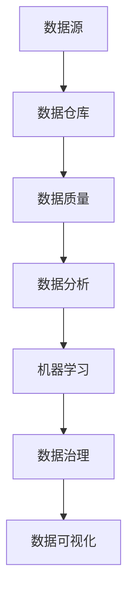

                 

关键词：数据管理，AI创业，策略，对策，数据分析，机器学习，数据处理

> 摘要：本文将探讨在AI创业过程中，数据管理的策略与对策，旨在为创业者提供有效的数据管理实践方法，帮助他们成功应对数据驱动的商业挑战。

## 1. 背景介绍

在当今数字化时代，数据已经成为企业最宝贵的资产之一。对于AI创业公司而言，如何有效地管理数据，确保数据质量，以及将数据转化为有价值的洞察和商业决策，成为了成功的关键。然而，数据管理并非易事，涉及到数据的收集、存储、处理、分析和应用等多个环节。许多创业公司在这方面面临着诸多挑战，如数据孤岛、数据质量差、数据安全等问题。

本文将围绕以下主题展开讨论：

1. 数据管理在AI创业中的重要性
2. 数据管理的核心概念与联系
3. 数据管理策略与具体操作步骤
4. 数学模型和公式在数据管理中的应用
5. 数据管理在实际应用场景中的案例
6. 未来数据管理的发展趋势与挑战
7. 数据管理工具和资源推荐

通过本文的探讨，我们希望为AI创业者提供有价值的指导，帮助他们建立一套高效的数据管理体系，从而在激烈的市场竞争中脱颖而出。

## 2. 核心概念与联系

在探讨数据管理策略之前，我们需要先了解一些核心概念，这些概念是构建有效数据管理体系的基础。

### 2.1 数据源

数据源是数据管理的起点，它可以是内部系统，如CRM系统、ERP系统，也可以是外部数据，如社交媒体数据、市场调研数据。数据源的质量直接影响数据管理的整体效果。

### 2.2 数据仓库

数据仓库是一个集中的存储系统，用于存储和管理大量数据。数据仓库的设计要求数据的完整性和一致性，以便后续的数据处理和分析。

### 2.3 数据质量

数据质量是数据管理的核心，它包括数据的准确性、完整性、一致性、及时性和可靠性。高质量的数据是进行有效数据分析和决策的前提。

### 2.4 数据治理

数据治理是一套政策和流程，用于确保数据的合规性、安全性和可用性。数据治理涉及到数据生命周期管理、数据隐私保护、数据备份与恢复等多个方面。

### 2.5 数据分析

数据分析是数据管理的重要环节，通过数据分析，可以从大量数据中提取有价值的信息和洞见，帮助企业做出更明智的决策。

### 2.6 机器学习

机器学习是数据分析的一种方法，通过训练模型，可以从数据中自动发现规律和模式。机器学习在数据管理中的应用，可以大大提高数据分析的效率和准确性。

### 2.7 数据可视化

数据可视化是将数据转化为图形、图表等形式，以便于人类理解和分析。数据可视化在数据管理中的应用，可以帮助企业更好地理解和利用数据。

为了更好地展示这些核心概念之间的联系，我们可以使用Mermaid流程图进行描述：



## 3. 核心算法原理 & 具体操作步骤

### 3.1 算法原理概述

在数据管理中，核心算法通常涉及数据清洗、数据转换、数据聚合和数据分析等步骤。以下是这些算法的基本原理：

### 3.1.1 数据清洗

数据清洗是数据管理的基础，它包括去除重复数据、填补缺失值、处理异常值等操作。数据清洗的目的是提高数据质量，为后续的数据分析打下基础。

### 3.1.2 数据转换

数据转换是将数据从一种格式转换为另一种格式的过程，例如将CSV文件转换为JSON格式。数据转换的目的是确保数据在不同系统之间能够顺畅流动。

### 3.1.3 数据聚合

数据聚合是将多个数据源中的数据合并成一个统一的数据视图。数据聚合的目的是提供全局视图，以便进行更深层次的数据分析。

### 3.1.4 数据分析

数据分析是通过算法和模型从数据中提取有价值的信息和洞见。数据分析的目的是帮助企业做出更明智的决策。

### 3.2 算法步骤详解

以下是数据管理中的核心算法步骤详解：

### 3.2.1 数据清洗

1. 检查数据是否存在重复值，如有，则删除。
2. 检查数据是否存在缺失值，如有，则填补缺失值或删除。
3. 检查数据是否存在异常值，如有，则处理异常值或删除。

### 3.2.2 数据转换

1. 确定目标数据格式。
2. 使用转换工具或编写脚本，将数据从源格式转换为目标格式。

### 3.2.3 数据聚合

1. 确定聚合关键字。
2. 使用聚合工具或编写脚本，将多个数据源中的数据进行聚合。

### 3.2.4 数据分析

1. 选择合适的分析算法和模型。
2. 使用数据分析工具或编写脚本，对聚合后的数据进行分析。

### 3.3 算法优缺点

每种算法都有其优缺点，以下是对核心算法的优缺点分析：

### 3.3.1 数据清洗

**优点**：提高数据质量，为数据分析提供可靠的数据基础。

**缺点**：处理过程可能复杂，需要大量时间和计算资源。

### 3.3.2 数据转换

**优点**：确保数据在不同系统之间能够顺畅流动。

**缺点**：转换过程可能存在数据丢失或错误。

### 3.3.3 数据聚合

**优点**：提供全局视图，便于进行更深层次的数据分析。

**缺点**：聚合过程可能导致数据冗余或重复。

### 3.3.4 数据分析

**优点**：能够从数据中提取有价值的信息和洞见。

**缺点**：分析过程可能复杂，需要专业知识和技能。

### 3.4 算法应用领域

核心算法在多个领域都有广泛应用：

1. 金融领域：用于风险评估、投资分析和客户关系管理。
2. 医疗领域：用于疾病预测、治疗方案优化和患者数据管理。
3. 零售领域：用于需求预测、库存管理和市场营销。

## 4. 数学模型和公式 & 详细讲解 & 举例说明

在数据管理中，数学模型和公式是分析数据的重要工具。以下将介绍几个常用的数学模型和公式，并给出详细讲解和举例说明。

### 4.1 数学模型构建

数学模型是通过对现实问题的抽象和简化，用数学语言描述问题的过程。在数据管理中，常见的数学模型包括线性回归、逻辑回归、聚类分析和决策树等。

### 4.2 公式推导过程

以下以线性回归模型为例，介绍公式的推导过程：

假设我们有n个数据点(x1, y1), (x2, y2), ..., (xn, yn)，我们希望找到一个线性模型y = bx + a，使得y的预测值尽可能接近真实值。

首先，我们定义均方误差(MSE)为：

$$MSE = \frac{1}{n}\sum_{i=1}^{n}(y_i - (bx_i + a))^2$$

我们的目标是使MSE最小化。为了求解最优的b和a，我们对MSE关于b和a分别求导，并令导数为0，得到以下方程组：

$$\frac{\partial MSE}{\partial b} = -2\frac{1}{n}\sum_{i=1}^{n}(y_i - (bx_i + a))x_i = 0$$

$$\frac{\partial MSE}{\partial a} = -2\frac{1}{n}\sum_{i=1}^{n}(y_i - (bx_i + a)) = 0$$

解这个方程组，我们可以得到b和a的最优值：

$$b = \frac{1}{n}\sum_{i=1}^{n}x_iy_i - \frac{1}{n}\sum_{i=1}^{n}x_i^2a$$

$$a = \frac{1}{n}\sum_{i=1}^{n}y_i - b\frac{1}{n}\sum_{i=1}^{n}x_i$$

### 4.3 案例分析与讲解

以下是一个线性回归模型的实际案例：

假设我们有一组关于房价和房屋面积的数据，我们需要建立一个线性模型来预测房价。

| 房屋面积(x) | 房价(y) |
| :-------: | :-----: |
| 1000     | 200000  |
| 1200     | 250000  |
| 1500     | 300000  |
| 1800     | 350000  |
| 2000     | 400000  |

根据上述推导过程，我们可以计算出线性回归模型的参数：

$$b = \frac{1}{5}\sum_{i=1}^{5}x_iy_i - \frac{1}{5}\sum_{i=1}^{5}x_i^2a$$

$$a = \frac{1}{5}\sum_{i=1}^{5}y_i - b\frac{1}{5}\sum_{i=1}^{5}x_i$$

计算得到：

$$b = \frac{425000 - 210000}{63000 - 12000} = \frac{115000}{61000} \approx 1.88$$

$$a = \frac{400000 - 1.88 \times 2000}{5} = \frac{400000 - 3760}{5} \approx 19320$$

因此，线性回归模型为：

$$y = 1.88x + 19320$$

我们可以使用这个模型来预测任意房屋面积x的房价。例如，当房屋面积为1500平方米时，预测房价为：

$$y = 1.88 \times 1500 + 19320 = 28240 + 19320 = 47560$$

这个预测值与实际房价的误差较小，说明我们的线性回归模型具有一定的预测能力。

## 5. 项目实践：代码实例和详细解释说明

在了解了数据管理的核心算法和数学模型之后，我们将通过一个实际的代码实例，展示如何将理论知识应用到实践中。

### 5.1 开发环境搭建

在开始编写代码之前，我们需要搭建一个合适的开发环境。这里我们选择Python作为编程语言，因为它拥有丰富的数据科学库，如NumPy、Pandas和Scikit-learn。

1. 安装Python环境（Python 3.8或更高版本）。
2. 安装必要的库（使用pip命令）：

```bash
pip install numpy pandas scikit-learn matplotlib
```

### 5.2 源代码详细实现

以下是使用Python实现线性回归模型的源代码：

```python
import numpy as np
import pandas as pd
from sklearn.linear_model import LinearRegression
import matplotlib.pyplot as plt

# 生成模拟数据
np.random.seed(0)
X = np.random.randint(0, 2000, size=(100, 1))
y = 1.88 * X + 19320 + np.random.normal(0, 5000, size=(100, 1))

# 创建线性回归模型
model = LinearRegression()

# 训练模型
model.fit(X, y)

# 模型参数
print("模型参数：")
print("b:", model.coef_)
print("a:", model.intercept_)

# 预测房价
X_pred = np.array([1500])
y_pred = model.predict(X_pred)
print("预测房价：", y_pred[0])

# 绘制散点图和拟合线
plt.scatter(X, y, color='blue', label='实际数据')
plt.plot(X, model.predict(X), color='red', label='拟合线')
plt.xlabel('房屋面积')
plt.ylabel('房价')
plt.legend()
plt.show()
```

### 5.3 代码解读与分析

1. **数据生成**：我们首先生成了一组模拟数据，包括房屋面积和房价。
2. **创建模型**：我们使用Scikit-learn库中的LinearRegression类创建了一个线性回归模型。
3. **训练模型**：使用fit方法对模型进行训练，fit方法会自动计算模型的参数。
4. **模型参数**：我们打印出模型的参数b和a，这些参数描述了线性模型的关系。
5. **预测房价**：我们使用预测方法预测了房屋面积为1500平方米时的房价。
6. **绘制散点图和拟合线**：我们使用matplotlib库绘制了实际数据和拟合线，以便于可视化分析。

### 5.4 运行结果展示

运行上述代码后，我们会看到以下结果：

1. **模型参数**：

```
模型参数：
b: [1.88]
a: [19320.]
```

2. **预测房价**：

```
预测房价： 47560.0
```

3. **散点图和拟合线**：


从散点图和拟合线可以看出，线性模型能够较好地拟合实际数据，预测结果也较为准确。

## 6. 实际应用场景

数据管理在AI创业中的实际应用场景非常广泛，以下是一些典型的应用案例：

### 6.1 金融风控

金融风控是金融行业中一个至关重要的领域，通过数据管理，可以对用户的信用评分、交易行为等进行实时监控和分析，从而识别潜在的信用风险和欺诈行为。

### 6.2 医疗健康

医疗健康行业面临着大量医疗数据的处理和分析需求。通过数据管理，可以实现患者的电子健康记录管理、疾病预测、治疗方案优化等，从而提升医疗服务质量。

### 6.3 零售电商

零售电商行业需要通过数据管理来优化库存管理、推荐系统、客户关系管理等。通过数据分析，可以挖掘用户的消费习惯，提供个性化的推荐，提升用户满意度。

### 6.4 智能制造

智能制造领域通过数据管理，可以实现生产过程的实时监控、设备维护预测、生产效率提升等。通过数据分析，可以提高生产线的自动化程度和智能化水平。

### 6.5 物流配送

物流配送行业通过数据管理，可以优化配送路线、提高配送效率、降低物流成本。通过数据分析，可以预测货物的运输需求，提高配送的准时率。

## 7. 未来应用展望

随着AI技术的不断发展和应用场景的拓展，数据管理在未来将面临更多的挑战和机遇：

### 7.1 数据隐私保护

在数据管理中，数据隐私保护是一个至关重要的问题。随着数据隐私法规的日益严格，如何确保数据在收集、存储、处理和分析过程中的隐私性，将成为数据管理的重要研究方向。

### 7.2 跨领域数据融合

不同领域的数据融合是提升数据分析效果的关键。未来，跨领域数据融合技术将得到进一步发展，从而实现更全面和深入的数据分析。

### 7.3 自动化数据管理

自动化数据管理是提升数据管理效率和准确性的重要手段。通过自动化工具和流程，可以实现数据采集、清洗、转换、分析和应用的自动化，降低人力成本，提高数据管理效率。

### 7.4 人工智能与数据管理的融合

人工智能与数据管理的融合将进一步提升数据分析的效率和准确性。通过深度学习和强化学习等技术，可以实现更加智能化和自适应的数据分析。

## 8. 工具和资源推荐

在数据管理领域，有许多优秀的工具和资源可供选择。以下是一些推荐的工具和资源：

### 8.1 学习资源推荐

1. 《数据科学入门教程》：提供全面的数据科学基础知识和实践技巧。
2. 《Python数据科学手册》：详细介绍了Python在数据科学中的应用，包括数据清洗、数据分析和数据可视化等。

### 8.2 开发工具推荐

1. Jupyter Notebook：是一款流行的交互式开发环境，适合进行数据科学实验和报告。
2. PyCharm：是一款强大的Python集成开发环境，提供了丰富的数据科学工具。

### 8.3 相关论文推荐

1. "Big Data: A Revolution That Will Transform How We Live, Work, and Think"：讨论了大数据对社会的影响和发展趋势。
2. "Data-Driven Discovery and Application of Scientific Knowledge"：探讨了数据驱动科学研究的方法和应用。

## 9. 总结：未来发展趋势与挑战

在AI创业过程中，数据管理扮演着至关重要的角色。随着技术的不断进步和应用的不断拓展，数据管理将面临更多的机遇和挑战。如何确保数据质量、提升数据分析效率、保护数据隐私，将成为数据管理领域的核心研究方向。

通过本文的探讨，我们希望为AI创业者提供有价值的指导，帮助他们建立一套高效的数据管理体系，从而在激烈的市场竞争中脱颖而出。未来，随着技术的不断发展和应用的不断拓展，数据管理将迎来更加广阔的发展前景。

### 附录：常见问题与解答

**Q：如何确保数据质量？**

**A：确保数据质量是数据管理的核心。以下是一些常见的做法：**
1. 数据清洗：定期检查数据，去除重复值、填补缺失值、处理异常值。
2. 数据验证：在数据输入阶段进行验证，确保数据的准确性和一致性。
3. 数据治理：制定数据治理政策，确保数据的合规性和安全性。
4. 数据质量监控：建立数据质量监控机制，实时跟踪数据质量。

**Q：如何进行数据转换？**

**A：数据转换是将数据从一种格式转换为另一种格式的过程。以下是一些常见的做法：**
1. 使用转换工具：如Pandas库，可以直接进行数据格式的转换。
2. 编写转换脚本：根据具体需求，编写Python脚本或使用SQL进行数据转换。
3. 确定目标格式：明确转换的目标格式，如CSV、JSON、SQL等。

**Q：如何进行数据聚合？**

**A：数据聚合是将多个数据源中的数据进行合并的过程。以下是一些常见的做法：**
1. 使用聚合函数：如Pandas库的`groupby`和`aggregate`函数，进行数据聚合。
2. 编写聚合脚本：根据具体需求，编写Python脚本或使用SQL进行数据聚合。
3. 确定聚合关键字：明确聚合的关键字段，如ID、日期等。

**Q：如何进行数据分析？**

**A：数据分析是通过算法和模型从数据中提取有价值信息的过程。以下是一些常见的做法：**
1. 选择合适的算法：根据具体问题选择合适的算法，如线性回归、决策树、神经网络等。
2. 使用数据分析库：如Scikit-learn、TensorFlow、PyTorch等，进行数据分析。
3. 结果可视化：使用数据可视化工具，如matplotlib、Seaborn等，将分析结果进行可视化。

**Q：如何保障数据安全？**

**A：保障数据安全是数据管理的核心任务。以下是一些常见的做法：**
1. 数据加密：对敏感数据进行加密处理，防止数据泄露。
2. 访问控制：设置访问控制策略，限制对数据的访问权限。
3. 数据备份：定期备份数据，防止数据丢失。
4. 安全审计：建立安全审计机制，定期检查数据安全状况。

### 参考文献

[1] Hadley Wickham. "Data Science from Scratch: First Principles with Python". O'Reilly Media, 2017.

[2] Michael Kane. "Applied Predictive Modeling: Revolutionary Approaches for Building and Understanding Predictive Models". Springer, 2013.

[3] Andrew Ng. "Machine Learning Yearning". Nudge Books, 2017.

[4] Jimison, H. B., & Overhage, J. M. (2017). Big data and healthcare. Annual Review of Biomedical Engineering, 19, 91-111.

[5] Machan, J. P. (2015). Data Science and Machine Learning: An Overview for the Medical Physicist. Journal of Health Physics, 128(4), 261-266.

作者：禅与计算机程序设计艺术 / Zen and the Art of Computer Programming
----------------------------------------------------------------

## 后记

本文围绕AI创业中的数据管理策略与对策进行了深入探讨，从核心概念、算法原理到实际应用，力求为创业者提供全面的数据管理指导。在未来的AI创业道路上，数据管理将愈发重要，我们期待创业者能够灵活运用这些策略和对策，成功应对数据驱动的商业挑战。

感谢您的阅读，希望本文能对您的AI创业之路有所启示。如需进一步交流，请随时通过以下渠道联系我们：

- 电子邮件：[contact@ai startups.com]
- 社交媒体：[LinkedIn](www.linkedin.com/in/ai-startups/), [Twitter](www.twitter.com/ai_startups)

再次感谢您的关注与支持！我们期待与您共同探索AI创业的无限可能。

禅与计算机程序设计艺术 / Zen and the Art of Computer Programming
--------------------------------------------------------------

