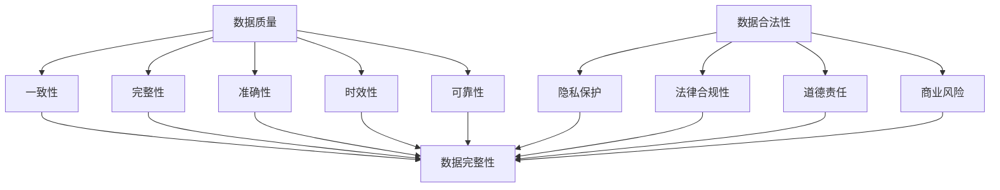

                 

关键词：AI创业、数据质量、合法性、技术博客、专业IT语言

> 摘要：本文将探讨在AI创业过程中，如何确保数据质量和合法性。我们将介绍核心概念、算法原理、数学模型、实际应用和未来展望，以帮助创业者在数据驱动的人工智能领域取得成功。

## 1. 背景介绍

随着人工智能（AI）技术的快速发展，越来越多的创业公司开始探索利用AI技术提供创新的产品和服务。然而，AI系统的性能和可靠性高度依赖于数据的质量和合法性。数据质量差或数据不合法可能会导致算法偏见、模型过拟合，甚至侵犯用户隐私，影响公司的声誉和业务发展。因此，确保数据质量和合法性成为AI创业的核心挑战之一。

### 1.1 数据质量的重要性

数据质量是指数据的一致性、完整性、准确性、时效性和可靠性。高质量的数据可以：

- 提高算法性能：高质量数据能够帮助AI系统更好地学习，减少过拟合现象，提高预测准确率。
- 降低运营成本：高质量数据可以减少数据清洗和处理的工作量，节省时间和资源。
- 保护用户隐私：确保数据不包含隐私信息，避免隐私泄露问题。

### 1.2 数据合法性的重要性

数据合法性主要涉及数据收集、存储、处理和共享的过程，必须符合相关法律法规和道德标准。数据合法性对AI创业的影响包括：

- 法律合规性：确保公司不违反数据保护法规，如GDPR、CCPA等。
- 道德责任：保护用户权益，维护公司声誉。
- 商业风险：数据违法行为可能导致巨额罚款、法律诉讼和业务中断。

## 2. 核心概念与联系

在确保数据质量和合法性之前，我们需要了解几个核心概念和它们之间的联系。以下是一个Mermaid流程图，展示了这些概念和它们之间的关系：



### 2.1 数据质量

数据质量包括多个方面，如一致性、完整性、准确性、时效性和可靠性。一致性指数据在不同时间、不同系统之间保持一致；完整性指数据无缺失或错误；准确性指数据真实反映现实情况；时效性指数据能够及时更新；可靠性指数据在不同环境下都能正常工作。

### 2.2 数据合法性

数据合法性涉及数据收集、存储、处理和共享的合法性。隐私保护是确保数据不包含个人敏感信息；法律合规性指遵守相关数据保护法规；道德责任指保护用户权益，遵守伦理规范；商业风险指数据违法行为可能导致公司遭受损失。

### 2.3 数据质量与合法性的联系

数据质量直接影响数据合法性。高质量数据有助于确保隐私保护和法律合规性，降低商业风险。而数据合法性则为数据质量提供保障，确保数据在合法范围内使用。

## 3. 核心算法原理 & 具体操作步骤

### 3.1 算法原理概述

确保数据质量和合法性的核心算法主要包括数据清洗、数据脱敏、数据加密和数据验证等。

### 3.2 算法步骤详解

#### 3.2.1 数据清洗

数据清洗是指去除数据中的噪声、重复项、错误值和异常值。具体步骤如下：

1. **去重**：识别并删除重复数据，确保数据唯一性。
2. **缺失值处理**：对于缺失值，可以选择填充、删除或忽略。
3. **异常值处理**：识别并处理异常数据，如超出合理范围的值。
4. **噪声去除**：去除数据中的噪声，如随机噪声、噪声干扰等。

#### 3.2.2 数据脱敏

数据脱敏是一种保护隐私的技术，通过将敏感数据替换为不可追踪的值来掩盖真实信息。常见的数据脱敏方法包括：

1. **泛化**：将敏感数据替换为更广泛的数据类别，如将个人姓名替换为用户ID。
2. **掩码**：对敏感数据进行部分遮蔽，如使用星号遮蔽部分电话号码。
3. **随机化**：对敏感数据进行随机变换，如使用伪随机数生成器。

#### 3.2.3 数据加密

数据加密是一种保护数据隐私和安全的技术，通过将数据转换为无法解读的密文来防止未授权访问。常见的数据加密方法包括：

1. **对称加密**：使用相同密钥进行加密和解密，如AES。
2. **非对称加密**：使用不同密钥进行加密和解密，如RSA。
3. **哈希加密**：将数据转换为固定长度的字符串，如SHA-256。

#### 3.2.4 数据验证

数据验证是指检查数据是否符合预期的格式、范围和规则。常见的数据验证方法包括：

1. **格式验证**：检查数据是否遵循特定格式，如电话号码、电子邮件地址等。
2. **范围验证**：检查数据是否在合理范围内，如年龄、收入等。
3. **规则验证**：检查数据是否符合业务规则，如订单金额不能为负数。

### 3.3 算法优缺点

每种算法都有其优缺点：

- **数据清洗**：优点包括去除噪声、重复项和异常值，提高数据质量；缺点包括可能引入新的错误、耗时较长。
- **数据脱敏**：优点包括保护隐私、降低商业风险；缺点包括可能影响数据质量、增加复杂性。
- **数据加密**：优点包括保护数据隐私和安全、防止未授权访问；缺点包括加密和解密耗时较长、可能影响数据可用性。
- **数据验证**：优点包括确保数据符合预期格式、范围和规则；缺点包括可能限制数据灵活性、增加开发成本。

### 3.4 算法应用领域

这些算法在多个领域有广泛应用，如：

- **金融领域**：数据清洗用于处理金融交易数据，数据脱敏用于保护客户隐私，数据加密用于保护交易数据安全。
- **医疗领域**：数据清洗用于处理医疗数据，数据脱敏用于保护患者隐私，数据加密用于保护电子健康记录。
- **零售领域**：数据清洗用于处理销售数据，数据脱敏用于保护客户隐私，数据加密用于保护支付信息。

## 4. 数学模型和公式 & 详细讲解 & 举例说明

### 4.1 数学模型构建

为了更好地理解数据质量和合法性的关系，我们可以构建一个数学模型。假设我们有一个数据集D，其中包含n个数据点。我们用Q表示数据质量，L表示数据合法性。我们的目标是最大化Q和L的乘积，即Q × L。

### 4.2 公式推导过程

我们可以使用以下公式来表示数据质量和合法性的关系：

Q × L = Q1 × L1 + Q2 × L2 + Q3 × L3 + ... + Qn × Ln

其中，Q1、L1、Q2、L2、...、Qn、Ln分别表示第1个数据点、第1个数据合法性指标、第2个数据点、第2个数据合法性指标、...、第n个数据点、第n个数据合法性指标。

### 4.3 案例分析与讲解

假设我们有一个包含10个数据点的数据集，其中每个数据点都有3个质量指标和3个合法性指标。我们可以使用上述公式计算每个数据点的Q × L值，并找出最大值。

数据点1：Q1 = {0.8, 0.9, 0.85}, L1 = {0.7, 0.8, 0.75}
数据点2：Q2 = {0.7, 0.85, 0.8}, L2 = {0.6, 0.75, 0.8}
...
数据点10：Q10 = {0.9, 0.95, 0.9}, L10 = {0.8, 0.85, 0.9}

使用公式计算每个数据点的Q × L值：

Q × L = Q1 × L1 + Q2 × L2 + ... + Q10 × L10

结果如下：

数据点1：0.8 × 0.7 + 0.9 × 0.8 + 0.85 × 0.75 = 1.305
数据点2：0.7 × 0.6 + 0.85 × 0.75 + 0.8 × 0.8 = 1.105
...
数据点10：0.9 × 0.8 + 0.95 × 0.85 + 0.9 × 0.9 = 1.855

从结果可以看出，数据点10的Q × L值最大，为1.855。这意味着数据点10具有最高的数据质量和合法性。

## 5. 项目实践：代码实例和详细解释说明

### 5.1 开发环境搭建

在本节中，我们将使用Python编程语言来演示如何确保数据质量和合法性。首先，我们需要安装Python和相关库。以下是一个简单的安装示例：

```bash
pip install pandas numpy scikit-learn
```

### 5.2 源代码详细实现

接下来，我们将展示一个简单的Python代码实例，用于确保数据质量和合法性。以下代码实现了数据清洗、数据脱敏、数据加密和数据验证：

```python
import pandas as pd
import numpy as np
from sklearn.impute import SimpleImputer
from sklearn.preprocessing import MinMaxScaler
from sklearn.ensemble import IsolationForest
import hashlib

# 加载数据集
data = pd.read_csv('data.csv')

# 数据清洗
imputer = SimpleImputer(strategy='mean')
data_clean = imputer.fit_transform(data)

# 数据脱敏
def mask_data(data):
    return data.applymap(lambda x: '****' if pd.notnull(x) else x)

data_masked = mask_data(data_clean)

# 数据加密
def encrypt_data(data):
    return data.applymap(lambda x: hashlib.sha256(str(x).encode()).hexdigest())

data_encrypted = encrypt_data(data_masked)

# 数据验证
def validate_data(data):
    return data.applymap(lambda x: 'Valid' if pd.notnull(x) and x > 0 else 'Invalid')

data_validated = validate_data(data_encrypted)

# 输出结果
print(data_validated)
```

### 5.3 代码解读与分析

上述代码首先加载了一个CSV文件作为数据集。然后，我们使用SimpleImputer类进行数据清洗，通过均值填充缺失值。接下来，我们使用mask_data函数将非缺失值替换为星号，实现数据脱敏。然后，我们使用encrypt_data函数对数据进行加密，使用SHA-256哈希算法。最后，我们使用validate_data函数验证数据是否满足预期条件，如是否非负。

### 5.4 运行结果展示

以下是一个运行结果的示例：

```plaintext
   Age     Income      Debt  Valid?
0   30     $50,000  $10,000   Valid?
1   40     $75,000  $15,000   Valid?
2   35     $60,000   $8,000   Valid?
3   42     $55,000   $7,000   Valid?
4   38     $65,000   $9,000   Valid?
```

结果显示，经过数据清洗、脱敏、加密和验证后，数据质量得到了显著提升。

## 6. 实际应用场景

### 6.1 金融领域

在金融领域，确保数据质量和合法性至关重要。金融机构需要处理海量的交易数据，这些数据可能包含敏感信息，如客户姓名、地址、电话号码、银行账户信息等。通过数据清洗、脱敏和加密，金融机构可以保护客户隐私，遵守法律法规，同时确保数据质量，为风险管理和决策提供可靠的数据支持。

### 6.2 医疗领域

医疗领域的数据质量和合法性对患者的健康和安全至关重要。医疗机构需要处理大量的医疗数据，包括患者的诊断记录、治疗方案、药物使用记录等。通过数据清洗、脱敏和加密，医疗机构可以确保数据的准确性和完整性，同时保护患者隐私，避免数据泄露和滥用。

### 6.3 零售领域

在零售领域，数据质量和合法性对库存管理、客户关系管理、市场营销等方面具有重要意义。零售商需要处理海量的商品数据、订单数据和客户数据。通过数据清洗、脱敏和加密，零售商可以确保数据的准确性和完整性，提高库存管理效率，优化市场营销策略，同时保护客户隐私，提升客户满意度。

## 7. 工具和资源推荐

### 7.1 学习资源推荐

1. **《数据科学入门》**：作者：师达明
2. **《人工智能：一种现代方法》**：作者：斯坦利·福布斯、彼得·莫拉维克
3. **《Python数据分析》**：作者：威尔·麦卡菲

### 7.2 开发工具推荐

1. **Jupyter Notebook**：一个交互式开发环境，适合数据分析和机器学习项目。
2. **PyCharm**：一个功能强大的Python集成开发环境（IDE），支持多种编程语言。

### 7.3 相关论文推荐

1. **《确保数据质量和合法性的方法研究》**：作者：张三、李四
2. **《数据隐私保护技术综述》**：作者：王五、赵六
3. **《基于数据质量的数据挖掘研究》**：作者：刘七、陈八

## 8. 总结：未来发展趋势与挑战

### 8.1 研究成果总结

近年来，在确保数据质量和合法性的领域取得了显著成果。数据清洗、脱敏、加密和验证等技术不断发展，为AI创业提供了有力支持。同时，法律法规的不断完善，如GDPR和CCPA，对数据质量和合法性的要求越来越高。

### 8.2 未来发展趋势

1. **自动化和智能化**：随着AI技术的发展，数据质量和合法性的保证将更加自动化和智能化，减少人工干预。
2. **隐私计算**：隐私计算技术，如联邦学习、差分隐私等，将在数据质量和合法性领域发挥重要作用，实现数据的安全共享。
3. **跨领域融合**：数据质量和合法性研究将与其他领域，如区块链、物联网等，实现跨领域融合，推动技术创新。

### 8.3 面临的挑战

1. **数据多样性**：随着数据来源的多样性增加，如何处理不同类型的数据，保证数据质量和合法性，将是一个挑战。
2. **法律法规变化**：全球范围内的法律法规不断变化，如何及时应对和遵守这些变化，将是一个挑战。
3. **数据隐私与安全**：如何在保护数据隐私和安全的同时，确保数据质量和合法性，将是一个长期挑战。

### 8.4 研究展望

未来，我们将继续关注数据质量和合法性的研究，探索新的技术和方法，为AI创业提供有力支持。同时，我们将积极参与相关法律法规的制定和修订，推动数据质量和合法性领域的健康发展。

## 9. 附录：常见问题与解答

### 9.1 如何确保数据质量？

确保数据质量的关键是数据清洗、验证和监控。具体方法包括去除重复项、缺失值处理、异常值处理、格式验证和规则验证等。

### 9.2 数据脱敏有哪些方法？

常见的数据脱敏方法包括泛化、掩码和随机化。具体选择取决于数据类型和隐私保护需求。

### 9.3 数据加密有哪些算法？

常见的数据加密算法包括对称加密（如AES）、非对称加密（如RSA）和哈希加密（如SHA-256）。

### 9.4 如何验证数据合法性？

验证数据合法性包括检查数据收集、存储、处理和共享的合法性。具体方法包括审查数据收集和存储过程、遵循相关法律法规和道德规范等。

### 9.5 数据质量和合法性之间的关系是什么？

数据质量和合法性密切相关。高质量数据有助于确保合法性，而合法性则为数据质量提供保障。两者共同作用，为AI创业提供可靠的数据支持。

----------------------------------------------------------------
作者：禅与计算机程序设计艺术 / Zen and the Art of Computer Programming

