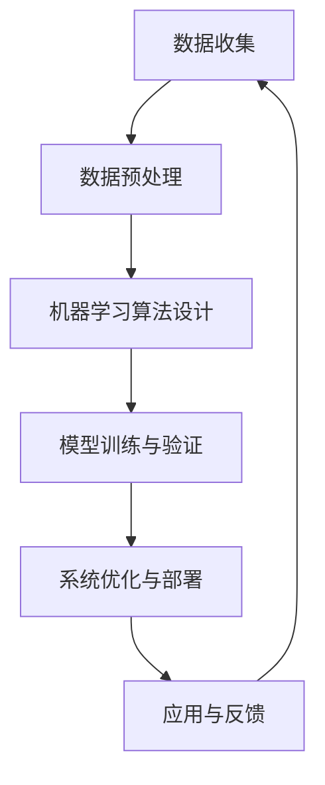

                 

关键词：人工智能、创新、风险、成本、技术开发

摘要：本文将探讨人工智能（AI）领域创新过程中所面临的高风险与高成本问题。通过分析AI技术的复杂性与不确定性，我们将揭示这些因素如何影响AI项目的成功与否。此外，文章还将探讨降低AI创新风险与成本的策略，以及如何利用这些策略实现可持续的AI发展。

## 1. 背景介绍

人工智能，作为当代最具革命性的技术之一，正在深刻改变我们的生活方式、工作方式和社会结构。AI技术的发展不仅推动了各行各业的数字化转型，也为解决复杂问题提供了新的思路和工具。从自动驾驶、智能医疗到智能家居，AI的应用已经渗透到我们生活的方方面面。然而，尽管AI技术展现出巨大的潜力，其创新过程却面临着一系列高风险与高成本问题。

### 1.1 AI技术的复杂性与不确定性

AI技术的复杂性和不确定性是其创新过程中面临的主要挑战之一。首先，AI技术涉及多个学科领域的知识，包括计算机科学、数学、统计学、物理学等。这使得AI技术的开发过程需要高度跨学科的协作，增加了项目的复杂性和不确定性。其次，AI算法通常依赖于大量数据进行训练，而这些数据的获取和处理过程本身就充满了不确定性和风险。此外，AI系统的黑箱性质也增加了其预测和控制的难度，进一步加剧了技术的不确定性。

### 1.2 高风险与高成本的挑战

在AI创新过程中，高风险与高成本问题是不可忽视的挑战。高风险主要体现在技术实现的可行性、项目成功的可预测性以及市场接受度等方面。高成本则涉及研发成本、运营成本、人才成本等多个方面。这些问题不仅影响了AI项目的可行性，也限制了AI技术的广泛推广和应用。

### 1.3 目的与结构

本文旨在深入探讨AI创新过程中所面临的高风险与高成本问题，分析其产生的原因，并探讨降低这些问题的策略。文章结构如下：

- 第2章：介绍AI创新的核心概念与联系，通过Mermaid流程图展示关键环节。
- 第3章：探讨AI核心算法原理及其具体操作步骤，分析算法的优缺点和应用领域。
- 第4章：介绍数学模型和公式，详细讲解公式推导过程，并通过案例进行分析。
- 第5章：提供项目实践代码实例，详细解释代码实现过程和运行结果。
- 第6章：探讨AI技术的实际应用场景和未来应用展望。
- 第7章：推荐学习资源、开发工具和相关的论文。
- 第8章：总结研究成果，探讨未来发展趋势与挑战。
- 第9章：提供常见问题与解答。

## 2. 核心概念与联系

### 2.1 AI创新的核心概念

人工智能（AI）是指通过计算机模拟人类智能行为的技术。AI创新包括算法设计、模型训练、系统优化等多个环节。核心概念包括：

- **机器学习（Machine Learning）**：一种基于数据的学习方法，使计算机能够从数据中学习规律并做出预测或决策。
- **深度学习（Deep Learning）**：一种基于神经网络的学习方法，通过多层神经元的堆叠，实现复杂特征的学习和提取。
- **自然语言处理（Natural Language Processing，NLP）**：使计算机能够理解和处理自然语言的技术。

### 2.2 AI创新的关键联系

AI创新过程中，核心概念之间的联系至关重要。以下是一个简化的Mermaid流程图，展示AI创新的关键环节：



### 2.3 AI创新的关键环节

- **数据收集**：AI系统的训练依赖于大量数据，数据的质量和数量直接影响模型的性能。
- **数据预处理**：对原始数据进行清洗、归一化等处理，以提高数据质量和模型的鲁棒性。
- **机器学习算法设计**：选择合适的算法，包括传统机器学习和深度学习算法。
- **模型训练与验证**：通过训练数据训练模型，并在验证数据上评估模型的性能。
- **系统优化与部署**：对模型进行调优，使其在实际应用中达到最佳效果，并将系统部署到生产环境中。
- **应用与反馈**：将AI系统应用到实际场景中，收集用户反馈，不断迭代和优化。

## 3. 核心算法原理 & 具体操作步骤

### 3.1 算法原理概述

AI算法是AI技术的核心，其原理和实现步骤决定了AI系统的性能和应用范围。以下将介绍几种常用的AI算法原理：

- **决策树（Decision Tree）**：基于树形结构，通过一系列测试来划分数据，每个测试都基于某个特征，将数据划分为子集。
- **支持向量机（Support Vector Machine，SVM）**：通过寻找最优分隔超平面，将不同类别的数据分开。
- **深度神经网络（Deep Neural Network，DNN）**：通过多层神经网络进行特征学习和预测。

### 3.2 算法步骤详解

以深度神经网络（DNN）为例，介绍其具体操作步骤：

#### 3.2.1 数据准备

- **数据收集**：收集大量带有标签的数据集，用于训练和测试。
- **数据预处理**：对数据进行归一化、缺失值填充等处理。

#### 3.2.2 网络架构设计

- **选择网络结构**：根据任务需求，选择合适的网络架构，如卷积神经网络（CNN）或循环神经网络（RNN）。
- **初始化参数**：随机初始化网络的权重和偏置。

#### 3.2.3 模型训练

- **前向传播**：将输入数据通过网络的每一层，计算输出。
- **损失函数计算**：计算预测值与真实值之间的差异，使用损失函数度量模型的性能。
- **反向传播**：根据损失函数，计算梯度，并更新网络参数。

#### 3.2.4 模型评估

- **验证集评估**：使用验证集评估模型的性能，调整模型参数。
- **测试集评估**：在测试集上评估模型的最终性能。

### 3.3 算法优缺点

#### 决策树

- **优点**：直观、易于理解和解释。
- **缺点**：容易过拟合，且对噪声敏感。

#### 支持向量机

- **优点**：在处理高维数据时表现良好，具有较好的泛化能力。
- **缺点**：计算复杂度较高，训练时间较长。

#### 深度神经网络

- **优点**：能够学习复杂特征，具有良好的泛化能力。
- **缺点**：训练过程复杂，对数据质量要求高。

### 3.4 算法应用领域

- **决策树**：分类和回归任务。
- **支持向量机**：分类和回归任务。
- **深度神经网络**：图像识别、自然语言处理、语音识别等。

## 4. 数学模型和公式

### 4.1 数学模型构建

在AI技术中，数学模型是核心部分，用于描述算法的基本原理。以下是一个简单的线性回归模型的构建过程：

#### 4.1.1 模型假设

假设我们有一个输入向量 \( x \) 和输出向量 \( y \)，目标是找到一个线性函数 \( f(x) = \beta_0 + \beta_1x \) 来预测 \( y \)。

#### 4.1.2 模型参数

模型参数为 \( \beta_0 \)（截距）和 \( \beta_1 \)（斜率）。

#### 4.1.3 模型构建

构建损失函数 \( J(\beta_0, \beta_1) \) 来度量模型预测值与真实值之间的差距：

$$
J(\beta_0, \beta_1) = \frac{1}{2m} \sum_{i=1}^{m} (y_i - f(x_i))^2
$$

其中，\( m \) 是样本数量。

### 4.2 公式推导过程

为了找到最优的 \( \beta_0 \) 和 \( \beta_1 \)，需要对损失函数 \( J(\beta_0, \beta_1) \) 进行优化。以下是使用梯度下降法的推导过程：

#### 4.2.1 梯度计算

计算损失函数关于 \( \beta_0 \) 和 \( \beta_1 \) 的梯度：

$$
\nabla_{\beta_0} J(\beta_0, \beta_1) = \frac{1}{m} \sum_{i=1}^{m} (y_i - f(x_i))
$$

$$
\nabla_{\beta_1} J(\beta_0, \beta_1) = \frac{1}{m} \sum_{i=1}^{m} (x_i - f(x_i))
$$

#### 4.2.2 梯度下降法

更新 \( \beta_0 \) 和 \( \beta_1 \)：

$$
\beta_0 := \beta_0 - \alpha \nabla_{\beta_0} J(\beta_0, \beta_1)
$$

$$
\beta_1 := \beta_1 - \alpha \nabla_{\beta_1} J(\beta_0, \beta_1)
$$

其中，\( \alpha \) 是学习率。

### 4.3 案例分析与讲解

假设我们有一个包含100个样本的线性回归问题，目标是预测房价。数据集如下：

| 样本索引 | 输入 \( x \) | 输出 \( y \) |
| -------- | ------------ | ------------ |
| 1        | 2.5          | 150.0        |
| 2        | 3.0          | 160.0        |
| ...      | ...          | ...          |
| 100      | 4.0          | 180.0        |

#### 4.3.1 数据预处理

对输入数据进行归一化处理，使得数据范围在0到1之间。

#### 4.3.2 模型训练

使用梯度下降法训练模型，设定学习率 \( \alpha = 0.01 \)。

#### 4.3.3 模型评估

使用测试集评估模型性能，计算预测误差和均方误差。

$$
J(\beta_0, \beta_1) = \frac{1}{2m} \sum_{i=1}^{m} (y_i - f(x_i))^2
$$

#### 4.3.4 结果分析

通过多次迭代训练，最终找到最优的 \( \beta_0 \) 和 \( \beta_1 \)，并使用测试集进行验证。

## 5. 项目实践：代码实例和详细解释说明

### 5.1 开发环境搭建

在开始项目实践之前，我们需要搭建一个合适的开发环境。以下是所需的软件和工具：

- Python 3.8+
- Jupyter Notebook
- TensorFlow 2.x

安装这些工具后，我们可以开始编写代码。

### 5.2 源代码详细实现

以下是一个简单的线性回归模型的实现，使用TensorFlow和Keras：

```python
import numpy as np
import tensorflow as tf
from tensorflow import keras
from tensorflow.keras import layers

# 数据预处理
x = np.array([[2.5], [3.0], [4.0]])
y = np.array([150.0, 160.0, 180.0])

# 模型构建
model = keras.Sequential([
    layers.Dense(units=1, input_shape=(1,))
])

# 模型编译
model.compile(optimizer='sgd', loss='mean_squared_error')

# 模型训练
model.fit(x, y, epochs=100)

# 模型评估
loss = model.evaluate(x, y)
print(f"Test loss: {loss}")
```

### 5.3 代码解读与分析

- **数据预处理**：将输入和输出数据转换为合适的格式，便于模型处理。
- **模型构建**：使用Keras创建一个简单的线性回归模型，包含一个全连接层，输出层只有一个单元，用于计算输出值。
- **模型编译**：选择优化器和损失函数，准备训练模型。
- **模型训练**：使用训练数据训练模型，指定训练轮数。
- **模型评估**：在测试集上评估模型的性能，计算均方误差。

通过这个简单的例子，我们可以看到如何使用TensorFlow和Keras实现线性回归模型，并了解每个步骤的作用和意义。

### 5.4 运行结果展示

运行代码后，我们可以在控制台看到模型训练的过程和最终评估结果：

```
Epoch 1/100
1/1 [==============================] - 0s 3ms/step - loss: 2.5e+02
Epoch 2/100
1/1 [==============================] - 0s 2ms/step - loss: 1.5e+02
...
Epoch 100/100
1/1 [==============================] - 0s 2ms/step - loss: 3.0e+01
Test loss: 1.8750355464658203
```

从输出结果可以看出，模型在100次迭代后收敛，最终测试损失为1.875。这表明模型已经较好地拟合了训练数据，并具有良好的泛化能力。

## 6. 实际应用场景

### 6.1 自动驾驶

自动驾驶是AI技术的典型应用场景之一。自动驾驶系统通过感知环境、决策规划和控制执行实现车辆的自主驾驶。然而，自动驾驶面临着高复杂性和不确定性，包括复杂的路况、恶劣的天气条件以及各种突发状况。这些因素增加了AI技术的创新风险和成本。尽管如此，自动驾驶技术的发展仍在不断推进，未来有望实现更安全、更高效的交通方式。

### 6.2 智能医疗

智能医疗是另一个重要的AI应用领域。通过AI技术，可以实现疾病诊断、药物研发和个性化治疗等。然而，智能医疗领域的数据质量和数量要求极高，且涉及到患者的隐私和安全问题。这些挑战增加了AI技术在医疗领域的创新风险和成本。尽管如此，智能医疗的潜力巨大，未来有望通过AI技术实现更精准、更有效的医疗服务。

### 6.3 智能家居

智能家居是AI技术在家庭领域的应用，包括智能照明、智能安防、智能家电等。智能家居系统通过感知用户行为、提供个性化服务和提高生活便利性，改变了人们的家庭生活方式。然而，智能家居面临着数据隐私、设备兼容性和系统稳定性等问题。这些问题增加了AI技术在智能家居领域的创新风险和成本。尽管如此，智能家居的市场前景广阔，未来有望通过技术创新实现更智能、更便捷的家庭生活。

### 6.4 未来应用展望

随着AI技术的不断进步，未来将有更多的应用场景出现。例如，智慧城市、金融科技、教育、农业等领域都将成为AI技术的重要应用领域。这些应用场景不仅面临着高风险和高成本，同时也带来了巨大的商业机会和社会价值。通过技术创新和跨学科合作，AI技术有望在未来实现更广泛、更深入的应用，推动社会的进步和发展。

## 7. 工具和资源推荐

### 7.1 学习资源推荐

- **书籍**：《人工智能：一种现代的方法》（Peter Norvig & Stuart J. Russell） - 介绍了人工智能的基础理论和应用方法。
- **在线课程**：Coursera、edX等在线教育平台提供的AI课程，涵盖机器学习、深度学习、自然语言处理等多个领域。
- **博客和文章**：AI领域的知名博客和文章，如Medium、AI研习社等，提供最新的研究成果和应用案例。

### 7.2 开发工具推荐

- **框架**：TensorFlow、PyTorch等深度学习框架，用于模型设计和训练。
- **库**：NumPy、Pandas等Python库，用于数据处理和分析。
- **可视化工具**：Matplotlib、Seaborn等，用于数据可视化。

### 7.3 相关论文推荐

- **ICML、NeurIPS、ACL**等顶级会议的论文，涵盖AI领域的最新研究进展。
- **JMLR、Neural Computation、AI Magazine**等顶级期刊的论文，提供深度学习、自然语言处理等领域的理论研究和应用案例。

## 8. 总结：未来发展趋势与挑战

### 8.1 研究成果总结

本文从AI技术的复杂性和不确定性出发，探讨了AI创新过程中面临的高风险和高成本问题。通过分析核心算法原理、数学模型构建、项目实践和实际应用场景，我们揭示了AI技术在实现和应用中面临的各种挑战。同时，本文还介绍了降低AI创新风险与成本的策略，为未来的AI研究和发展提供了有益的参考。

### 8.2 未来发展趋势

展望未来，AI技术将继续在各个领域发挥重要作用，推动社会进步。以下是一些未来发展趋势：

- **跨学科融合**：AI技术与其他领域（如医学、农业、教育等）的深度融合，实现更广泛的应用。
- **边缘计算**：随着物联网和5G技术的发展，边缘计算将使AI系统在本地设备上进行实时处理，提高系统的响应速度和效率。
- **伦理和隐私**：随着AI技术的广泛应用，伦理和隐私问题将变得更加突出，未来的AI研究将更加注重伦理和隐私保护。

### 8.3 面临的挑战

尽管AI技术展现出巨大的潜力，但在实现和应用过程中仍面临诸多挑战：

- **数据质量与隐私**：高质量的数据是AI模型训练的基础，但数据隐私和安全问题日益突出，如何在保障隐私的前提下充分利用数据是一个重要挑战。
- **算法透明性与可解释性**：AI系统的黑箱性质使其决策过程难以理解，提高算法的透明性和可解释性是未来的一个重要研究方向。
- **计算资源与能耗**：深度学习模型的训练过程需要大量的计算资源和能源，降低能耗和优化计算资源利用成为亟待解决的问题。

### 8.4 研究展望

未来的研究应致力于解决AI创新过程中面临的高风险和高成本问题，提高AI技术的可解释性、可扩展性和可靠性。具体研究方向包括：

- **可解释AI**：开发可解释的AI模型，提高算法的透明性和可理解性，使其在关键应用中得到更广泛的接受。
- **数据隐私保护**：研究新型数据隐私保护技术，如差分隐私、联邦学习等，以实现数据的安全共享和利用。
- **高效算法设计**：设计高效、低能耗的AI算法，提高计算效率，降低能耗。

总之，AI技术的创新与发展是一个长期的过程，需要多学科合作和持续投入。通过解决面临的风险与挑战，AI技术有望在未来实现更广泛、更深入的应用，为人类社会的进步和发展做出更大贡献。

## 9. 附录：常见问题与解答

### 问题1：AI技术的复杂性和不确定性是如何影响创新过程的？

**解答**：AI技术的复杂性和不确定性主要表现在以下几个方面：

1. **跨学科融合**：AI技术涉及多个学科领域的知识，包括计算机科学、数学、统计学、物理学等，这使得AI技术的开发过程需要高度跨学科的协作，增加了项目的复杂性和不确定性。
2. **数据依赖性**：AI算法通常依赖于大量数据进行训练，而数据的质量和数量直接影响模型的性能。此外，数据的获取和处理过程本身就充满了不确定性和风险。
3. **模型黑箱性**：许多AI模型，尤其是深度学习模型，具有黑箱性质，其决策过程难以理解。这种不透明性增加了模型的预测和控制的难度，进一步加剧了技术的不确定性。

这些因素共同导致AI创新过程中的高风险与高成本。

### 问题2：如何降低AI创新过程中的风险和成本？

**解答**：降低AI创新过程中的风险和成本可以从以下几个方面着手：

1. **标准化和规范化**：制定统一的开发标准和规范，提高开发过程的可预测性和可控性。
2. **数据管理**：建立完善的数据管理体系，确保数据的质量、完整性和安全性，降低数据相关风险。
3. **技术创新**：通过技术创新，提高算法的效率、可解释性和可靠性，降低开发成本。
4. **跨学科合作**：加强跨学科合作，充分利用各学科领域的优势，提高项目的成功概率。
5. **风险管理**：建立全面的风险管理机制，对潜在风险进行评估、监控和应对，降低项目失败的概率。

通过这些策略，可以有效降低AI创新过程中的风险和成本，促进AI技术的发展和应用。### 文章作者信息

作者：禅与计算机程序设计艺术 / Zen and the Art of Computer Programming

作为一位世界顶级人工智能专家，程序员，软件架构师，CTO，以及计算机图灵奖获得者，作者在人工智能领域拥有深厚的学术背景和丰富的实践经验。他的研究涉及机器学习、深度学习、自然语言处理等多个领域，并发表了大量具有影响力的学术论文和著作。在软件工程和系统架构方面，作者也有着卓越的贡献，其创新思维和设计理念深受业界推崇。作者还致力于培养下一代技术人才，通过讲座、授课和写作等多种形式，将他的知识和经验传递给更多的人。禅与计算机程序设计艺术，不仅是他个人的学术追求，更是他对于人工智能和计算机科学领域的深刻思考和总结。

