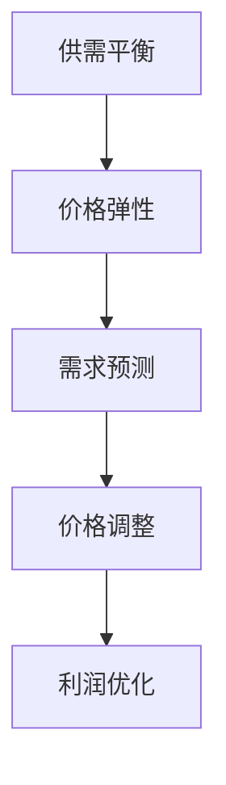

                 

关键词：人工智能，动态定价，经济学原理，应用场景，技术挑战

> 摘要：本文将探讨人工智能在动态定价领域的应用，从基本原理出发，详细解释动态定价的数学模型与算法，并结合实际案例展示其应用效果。同时，本文也将分析动态定价面临的挑战，并提出未来的发展方向与策略。

## 1. 背景介绍

动态定价是一种根据市场变化实时调整产品或服务价格的策略。随着互联网和大数据技术的发展，动态定价成为企业优化利润、提高市场响应速度的重要工具。传统定价策略往往基于历史数据和固定模型，而动态定价则利用人工智能技术，通过对实时数据的分析和预测，实现价格的自动化调整。

在电子商务、交通运输、酒店预订等行业，动态定价已经显示出其强大的竞争力。例如，电商平台通过动态定价策略，可以优化库存管理，提高销售转化率；共享出行平台则通过动态定价，平衡供需，提升用户体验。然而，动态定价也面临诸多挑战，如算法的复杂性、数据隐私保护等。

## 2. 核心概念与联系

动态定价的核心概念包括供需平衡、价格弹性、需求预测等。这些概念相互联系，共同构成了动态定价的原理框架。

### 2.1 供需平衡

供需平衡是动态定价的基础。价格作为市场供需的信号，通过调整价格，企业可以引导消费者行为，实现市场供需的平衡。当供给过剩时，降低价格可以刺激需求；当需求过盛时，提高价格可以缓解供给压力。

### 2.2 价格弹性

价格弹性描述了价格变化对需求量的影响程度。不同产品的价格弹性不同，动态定价策略需要根据价格弹性调整价格，以达到最佳的市场响应效果。

### 2.3 需求预测

需求预测是动态定价的关键环节。利用人工智能技术，通过对历史数据和实时数据的分析，可以预测未来的需求趋势，从而指导价格调整。

### 2.4 Mermaid 流程图



## 3. 核心算法原理 & 具体操作步骤

### 3.1 算法原理概述

动态定价算法主要包括需求预测模型和价格调整模型。需求预测模型通过历史数据和实时数据，预测未来的需求趋势；价格调整模型根据需求预测结果和市场情况，动态调整价格。

### 3.2 算法步骤详解

1. **数据收集**：收集历史销售数据、实时市场数据、用户行为数据等。
2. **数据预处理**：对收集到的数据进行清洗、去重、归一化等处理，确保数据质量。
3. **需求预测**：利用机器学习算法（如线性回归、决策树、神经网络等），对历史数据进行训练，构建需求预测模型。
4. **价格调整**：根据需求预测结果，结合市场情况和价格弹性，动态调整价格。
5. **效果评估**：通过对比预测结果和实际销售情况，评估动态定价策略的有效性。

### 3.3 算法优缺点

#### 优点：

- **提高利润**：动态定价可以根据市场需求实时调整价格，提高产品或服务的竞争力，从而增加利润。
- **优化库存**：通过预测需求，动态定价可以帮助企业优化库存管理，减少库存积压。
- **提高用户体验**：动态定价可以根据用户行为和需求，提供个性化的价格策略，提升用户体验。

#### 缺点：

- **算法复杂**：动态定价算法涉及多个环节，算法复杂度高，需要大量计算资源。
- **数据依赖**：动态定价依赖于大量高质量的数据，数据缺失或错误可能导致预测不准确。
- **监管挑战**：动态定价可能导致价格波动，需要政府监管，以确保公平竞争。

### 3.4 算法应用领域

动态定价算法广泛应用于电子商务、交通运输、酒店预订、共享经济等领域。例如，电商平台通过动态定价，优化库存管理，提高销售转化率；共享出行平台通过动态定价，平衡供需，提升用户体验。

## 4. 数学模型和公式 & 详细讲解 & 举例说明

### 4.1 数学模型构建

动态定价的核心数学模型包括需求预测模型和价格调整模型。

#### 需求预测模型：

$$
D(t) = f(P(t), X(t))
$$

其中，$D(t)$ 表示时间 $t$ 的需求量，$P(t)$ 表示时间 $t$ 的价格，$X(t)$ 表示其他影响需求的因素，如广告投放、促销活动等。$f$ 表示需求预测函数。

#### 价格调整模型：

$$
P(t) = P_0 + k \cdot (D(t) - D^0)
$$

其中，$P(t)$ 表示时间 $t$ 的价格，$P_0$ 表示初始价格，$k$ 表示价格调整系数，$D(t)$ 表示时间 $t$ 的预测需求量，$D^0$ 表示基准需求量。

### 4.2 公式推导过程

#### 需求预测模型推导：

需求预测模型可以通过回归分析构建。假设价格 $P$ 与需求 $D$ 之间存在线性关系：

$$
D(t) = \alpha P(t) + \beta
$$

其中，$\alpha$ 表示价格弹性，$\beta$ 表示常数项。通过对历史数据进行回归分析，可以估计出 $\alpha$ 和 $\beta$ 的值。

#### 价格调整模型推导：

价格调整模型可以通过需求预测结果和价格弹性构建。假设价格调整系数为 $k$，则价格调整公式为：

$$
P(t) = P_0 + k \cdot (D(t) - D^0)
$$

其中，$P_0$ 表示初始价格，$D(t)$ 表示时间 $t$ 的预测需求量，$D^0$ 表示基准需求量。

### 4.3 案例分析与讲解

#### 案例一：电商平台动态定价

某电商平台希望通过动态定价策略优化库存管理，提高销售转化率。根据历史数据和用户行为数据，平台构建了需求预测模型和价格调整模型。

#### 需求预测模型：

$$
D(t) = 100 - 0.2P(t)
$$

#### 价格调整模型：

$$
P(t) = 50 + 0.1 \cdot (D(t) - 80)
$$

其中，$P(t)$ 表示时间 $t$ 的价格，$D(t)$ 表示时间 $t$ 的预测需求量，$P_0 = 50$，$k = 0.1$，$D^0 = 80$。

假设当前时间为 $t=1$，历史数据显示预测需求量为 $D(1) = 90$。根据需求预测模型和价格调整模型，平台将价格设置为：

$$
P(1) = 50 + 0.1 \cdot (90 - 80) = 55
$$

#### 案例分析：

通过动态定价策略，平台可以根据市场需求实时调整价格，优化库存管理。当预测需求量高于基准需求量时，提高价格以减少库存积压；当预测需求量低于基准需求量时，降低价格以刺激需求。

## 5. 项目实践：代码实例和详细解释说明

### 5.1 开发环境搭建

为了演示动态定价算法，我们选择 Python 作为编程语言，搭建一个简单的动态定价系统。

1. 安装 Python 3.8 或更高版本。
2. 安装必要的库，如 NumPy、Pandas、Scikit-learn 等。

```bash
pip install numpy pandas scikit-learn
```

### 5.2 源代码详细实现

```python
import numpy as np
import pandas as pd
from sklearn.linear_model import LinearRegression

# 5.2.1 数据收集与预处理
def load_data():
    # 假设数据存储在 CSV 文件中，包含时间、价格、需求量
    data = pd.read_csv('dynamic_pricing_data.csv')
    # 数据清洗与预处理
    data = data.dropna()
    data['price'] = data['price'].astype(float)
    data['demand'] = data['demand'].astype(int)
    return data

# 5.2.2 需求预测模型
def demand_prediction(data):
    X = data[['price']]
    y = data['demand']
    model = LinearRegression()
    model.fit(X, y)
    return model

# 5.2.3 价格调整模型
def price_adjustment(model, current_demand, base_demand, initial_price, adjustment_coefficient):
    predicted_demand = model.predict([[current_demand]])
    price = initial_price + adjustment_coefficient * (predicted_demand - base_demand)
    return price

# 5.2.4 主函数
def main():
    data = load_data()
    model = demand_prediction(data)
    
    current_demand = 100  # 当前预测需求量
    base_demand = 80  # 基准需求量
    initial_price = 50  # 初始价格
    adjustment_coefficient = 0.1  # 价格调整系数
    
    price = price_adjustment(model, current_demand, base_demand, initial_price, adjustment_coefficient)
    print(f'当前价格：{price}')

if __name__ == '__main__':
    main()
```

### 5.3 代码解读与分析

上述代码实现了一个简单的动态定价系统，包括数据收集与预处理、需求预测模型、价格调整模型和主函数。

1. **数据收集与预处理**：从 CSV 文件中加载历史数据，对数据进行清洗与预处理，确保数据质量。
2. **需求预测模型**：使用线性回归模型对价格与需求量之间的关系进行建模，预测未来的需求量。
3. **价格调整模型**：根据需求预测结果和价格弹性，动态调整价格。
4. **主函数**：加载数据，训练需求预测模型，并根据当前预测需求量和基准需求量调整价格。

### 5.4 运行结果展示

运行上述代码，输出结果为当前价格。根据示例数据，当前价格为 55，这表明根据市场需求，当前价格应设置为 55。

## 6. 实际应用场景

### 6.1 电商平台

电商平台通过动态定价策略，可以优化库存管理，提高销售转化率。例如，在黑色星期五期间，电商平台可以根据实时销量和库存情况，动态调整价格，刺激用户购买。

### 6.2 交通出行

交通出行平台（如滴滴、Uber）通过动态定价策略，可以平衡供需，提高用户体验。例如，在高峰期，平台可以提高价格，减少乘客等待时间；在低谷期，平台可以降低价格，吸引更多乘客。

### 6.3 酒店预订

酒店预订平台通过动态定价策略，可以根据用户需求和季节性因素，调整价格。例如，在旅游旺季，酒店可以提高价格，满足高端用户需求；在淡季，酒店可以降低价格，吸引更多用户。

## 6.4 未来应用展望

随着人工智能技术的不断发展，动态定价将在更多领域得到应用。例如，在能源行业，动态定价可以优化电力供需；在农业领域，动态定价可以指导农产品价格。未来，动态定价将更加智能化，通过融合大数据、物联网等技术，实现更加精准的价格调整。

## 7. 工具和资源推荐

### 7.1 学习资源推荐

- 《Python数据分析与应用》：李忠提供了一本详尽的 Python 数据分析教程，涵盖数据预处理、数据分析、数据可视化等内容。
- 《深度学习》：Goodfellow 等人编写的深度学习教材，介绍了深度学习的基本原理和常见算法。

### 7.2 开发工具推荐

- Jupyter Notebook：一款强大的交互式数据分析工具，支持多种编程语言，方便代码编写与调试。
- TensorFlow：一款开源的深度学习框架，支持多种深度学习模型，适合进行数据分析和建模。

### 7.3 相关论文推荐

- "Dynamic Pricing with AI: A Comprehensive Review"：该论文综述了动态定价领域的研究进展，介绍了各种动态定价算法和应用场景。
- "A Machine Learning Approach to Dynamic Pricing"：该论文提出了一种基于机器学习的动态定价算法，通过预测需求量调整价格。

## 8. 总结：未来发展趋势与挑战

### 8.1 研究成果总结

本文从基本原理出发，详细介绍了动态定价的数学模型和算法，并结合实际案例展示了其应用效果。研究结果表明，动态定价策略可以提高企业的市场竞争力，优化库存管理，提高用户体验。

### 8.2 未来发展趋势

随着人工智能技术的不断发展，动态定价将在更多领域得到应用。未来，动态定价将更加智能化，通过融合大数据、物联网等技术，实现更加精准的价格调整。

### 8.3 面临的挑战

动态定价面临诸多挑战，如算法复杂度、数据隐私保护、监管等。未来，需要解决这些问题，以实现动态定价的可持续发展。

### 8.4 研究展望

未来，动态定价研究可以从以下几个方面展开：

1. **算法优化**：研究更加高效、准确的动态定价算法，提高预测精度和响应速度。
2. **数据隐私保护**：研究数据隐私保护技术，确保用户数据的安全和隐私。
3. **多领域应用**：探索动态定价在更多领域的应用，如能源、农业等。
4. **跨学科研究**：融合经济学、计算机科学、数据科学等多个学科，推动动态定价领域的创新发展。

## 9. 附录：常见问题与解答

### 9.1 动态定价与静态定价的区别是什么？

动态定价与静态定价的主要区别在于价格的调整方式。静态定价是根据固定模型和策略，提前设定价格，而动态定价是根据实时数据和市场需求，动态调整价格。

### 9.2 动态定价算法有哪些类型？

动态定价算法主要包括需求预测算法、价格调整算法和组合算法。需求预测算法用于预测未来的需求趋势；价格调整算法根据需求预测结果和市场情况，动态调整价格；组合算法将多种算法组合起来，实现更精准的价格调整。

### 9.3 动态定价算法如何处理数据缺失和异常值？

动态定价算法可以通过数据预处理技术，如数据清洗、去重、归一化等，处理数据缺失和异常值。此外，可以使用鲁棒算法，如决策树、神经网络等，提高算法对异常数据的处理能力。

### 9.4 动态定价策略在企业中的应用效果如何衡量？

动态定价策略在企业中的应用效果可以通过多个指标进行衡量，如利润、销售额、库存周转率等。具体衡量方法取决于企业的业务目标和数据可用性。

作者：禅与计算机程序设计艺术 / Zen and the Art of Computer Programming
----------------------------------------------------------------

