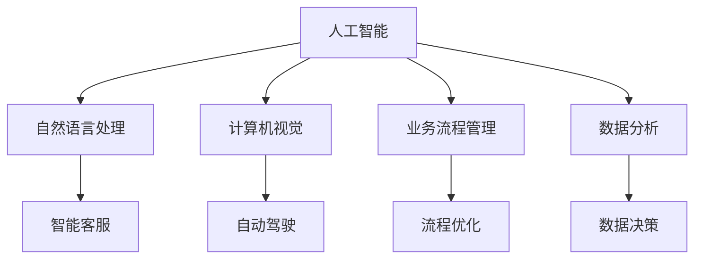

                 

关键词：人工智能，企业转型，AI助理，数字化转型，技术创新

摘要：随着人工智能技术的迅猛发展，AI助理已成为企业数字化转型的重要推动力。本文将深入探讨AI助理在企业转型中的关键作用，分析其核心概念、算法原理、数学模型以及实际应用场景，并展望其未来发展趋势与挑战。

## 1. 背景介绍

### 1.1 人工智能的崛起

人工智能（AI）作为计算机科学的一个重要分支，近年来取得了令人瞩目的进展。深度学习、自然语言处理、计算机视觉等技术的突破，使得AI能够在各种复杂任务中表现出色。从智能助手到自动驾驶，从医疗诊断到金融分析，AI的应用场景日益广泛。

### 1.2 企业转型的需求

在全球化竞争加剧、市场需求瞬息万变的背景下，企业面临巨大的转型压力。数字化转型已成为企业提升竞争力、实现可持续发展的必由之路。通过数字化转型，企业可以实现业务流程优化、运营效率提升、客户体验改善等目标。

### 1.3 AI助理的兴起

AI助理作为人工智能的一种应用形式，凭借其高效、智能、低成本的特点，逐渐成为企业转型的重要工具。AI助理不仅能够帮助企业降低人力成本，还能够提升业务决策的准确性和速度。

## 2. 核心概念与联系

为了更好地理解AI助理在企业转型中的作用，我们首先需要明确一些核心概念和它们之间的联系。

### 2.1 人工智能（AI）

人工智能是指通过计算机模拟人类智能行为的技术。它包括机器学习、深度学习、自然语言处理、计算机视觉等多个领域。

### 2.2 自然语言处理（NLP）

自然语言处理是人工智能的一个重要分支，主要研究如何让计算机理解和处理人类语言。NLP技术广泛应用于智能客服、机器翻译、文本分析等领域。

### 2.3 计算机视觉（CV）

计算机视觉是使计算机具有视觉感知能力的科学。它包括图像识别、目标检测、图像分割等多个方面。计算机视觉技术广泛应用于自动驾驶、安防监控、医疗诊断等领域。

### 2.4 业务流程管理（BPM）

业务流程管理是一种旨在优化企业业务流程的方法论。它包括流程设计、流程执行、流程监控等多个环节。通过BPM，企业可以提升业务效率、降低运营成本。

### 2.5 数据分析

数据分析是利用统计学和计算机科学方法，对大量数据进行分析和处理的过程。数据分析可以帮助企业发现数据中的规律、趋势和关联，从而做出更明智的决策。

### 2.6 Mermaid 流程图



## 3. 核心算法原理 & 具体操作步骤

### 3.1 算法原理概述

AI助理的核心算法主要包括机器学习算法、自然语言处理算法和计算机视觉算法。这些算法的基本原理是通过学习大量的数据，从中提取特征，并利用这些特征进行预测或决策。

### 3.2 算法步骤详解

#### 3.2.1 数据采集与预处理

首先，我们需要采集大量的数据，这些数据可以来自企业的业务系统、客户反馈、市场调研等。然后，对这些数据进行清洗、去重、格式化等预处理操作，以便后续分析。

#### 3.2.2 特征提取

特征提取是算法的关键步骤。通过特征提取，我们可以将原始数据转化为计算机可以处理的数字特征。常用的特征提取方法包括词袋模型、TF-IDF、词嵌入等。

#### 3.2.3 模型训练

在获得特征后，我们可以使用机器学习算法进行模型训练。常见的机器学习算法包括线性回归、决策树、支持向量机、神经网络等。通过训练，模型可以学会对新的数据进行预测或分类。

#### 3.2.4 模型评估与优化

在模型训练完成后，我们需要对模型进行评估和优化。常用的评估指标包括准确率、召回率、F1值等。通过调整模型参数，我们可以提升模型的性能。

#### 3.2.5 模型部署与应用

最后，我们将训练好的模型部署到生产环境中，以便在实际业务中使用。AI助理可以通过API接口与业务系统进行集成，实现自动化、智能化的业务处理。

### 3.3 算法优缺点

#### 优点

- 高效性：AI助理可以处理大量数据，提高业务效率。
- 智能性：AI助理可以基于数据做出智能决策，降低人工干预。
- 成本效益：AI助理可以降低人力成本，提高资源利用率。

#### 缺点

- 数据依赖性：AI助理的性能高度依赖数据质量，数据不足或质量差会影响模型效果。
- 安全性问题：AI助理可能会受到恶意攻击，导致数据泄露或业务中断。

### 3.4 算法应用领域

AI助理的应用领域非常广泛，主要包括以下几个方面：

- 智能客服：通过自然语言处理技术，实现与客户的智能对话，提高客服效率。
- 自动驾驶：通过计算机视觉技术，实现车辆的自动驾驶功能，提高交通安全。
- 医疗诊断：通过深度学习技术，实现疾病的自动诊断，提高诊断准确率。
- 金融分析：通过数据分析技术，实现金融市场的预测和分析，提高投资收益。

## 4. 数学模型和公式 & 详细讲解 & 举例说明

### 4.1 数学模型构建

在AI助理中，常用的数学模型包括线性回归、逻辑回归、支持向量机、神经网络等。这些模型的基本原理是通过学习数据中的特征，建立预测或分类模型。

#### 线性回归

线性回归是一种简单的预测模型，它通过拟合一条直线来预测目标值。

$$
y = \beta_0 + \beta_1x
$$

其中，$y$ 为目标值，$x$ 为自变量，$\beta_0$ 和 $\beta_1$ 为模型参数。

#### 逻辑回归

逻辑回归是一种分类模型，它通过拟合一个逻辑函数来预测目标变量的概率。

$$
\text{logit}(y) = \ln\left(\frac{p}{1-p}\right)
$$

其中，$y$ 为目标变量，$p$ 为预测概率，$\text{logit}$ 为逻辑函数。

#### 支持向量机

支持向量机是一种分类模型，它通过寻找一个超平面，将不同类别的数据点分离开来。

$$
w \cdot x - b = 0
$$

其中，$w$ 为权重向量，$x$ 为特征向量，$b$ 为偏置。

#### 神经网络

神经网络是一种复杂的预测模型，它通过多层神经元进行数据处理和特征提取。

$$
y = \sigma(z)
$$

其中，$y$ 为输出值，$z$ 为输入值，$\sigma$ 为激活函数。

### 4.2 公式推导过程

以线性回归为例，我们通过最小二乘法来求解模型参数。

#### 最小二乘法

假设我们有一组数据 $(x_i, y_i)$，其中 $i = 1, 2, \ldots, n$。我们希望找到一条直线 $y = \beta_0 + \beta_1x$，使得直线的预测值与实际值的误差平方和最小。

$$
\sum_{i=1}^{n}(y_i - (\beta_0 + \beta_1x_i))^2
$$

为了求解 $\beta_0$ 和 $\beta_1$，我们对上式求导并令导数为零。

$$
\frac{\partial}{\partial \beta_0}\sum_{i=1}^{n}(y_i - (\beta_0 + \beta_1x_i))^2 = 0
$$

$$
\frac{\partial}{\partial \beta_1}\sum_{i=1}^{n}(y_i - (\beta_0 + \beta_1x_i))^2 = 0
$$

通过求解上述方程组，我们可以得到最优的 $\beta_0$ 和 $\beta_1$。

### 4.3 案例分析与讲解

#### 案例背景

某电商公司希望通过AI助理预测客户购买行为，从而实现精准营销。

#### 数据采集

公司收集了10万条客户购买记录，包括客户ID、购买时间、商品ID、购买金额等。

#### 数据预处理

对数据进行清洗、去重、格式化等预处理操作。

#### 特征提取

提取与购买行为相关的特征，如客户购买频率、购买金额、商品类型等。

#### 模型训练

使用线性回归模型进行训练，预测客户购买概率。

#### 模型评估

使用交叉验证方法评估模型性能，调整模型参数。

#### 模型部署

将训练好的模型部署到生产环境中，实时预测客户购买行为。

#### 结果展示

通过模型预测，公司实现了精准营销，提高了销售转化率。

## 5. 项目实践：代码实例和详细解释说明

### 5.1 开发环境搭建

在开始项目实践之前，我们需要搭建一个合适的开发环境。以下是具体的步骤：

1. 安装Python解释器
2. 安装必要的库，如 NumPy、Pandas、Scikit-learn、TensorFlow等
3. 配置开发环境，如使用PyCharm或Jupyter Notebook

### 5.2 源代码详细实现

以下是一个使用线性回归模型预测客户购买概率的Python代码实例：

```python
import numpy as np
import pandas as pd
from sklearn.linear_model import LinearRegression
from sklearn.model_selection import train_test_split
from sklearn.metrics import mean_squared_error

# 读取数据
data = pd.read_csv('customer_data.csv')
X = data[['purchase_frequency', 'purchase_amount']]
y = data['purchase_probability']

# 数据预处理
X = X.values
y = y.values

# 数据集划分
X_train, X_test, y_train, y_test = train_test_split(X, y, test_size=0.2, random_state=42)

# 模型训练
model = LinearRegression()
model.fit(X_train, y_train)

# 模型评估
y_pred = model.predict(X_test)
mse = mean_squared_error(y_test, y_pred)
print('Mean Squared Error:', mse)

# 模型部署
model.save('customer_purchase_model.pkl')
```

### 5.3 代码解读与分析

上述代码首先读取了客户购买数据，并提取了与购买行为相关的特征。然后，使用线性回归模型进行训练，并使用交叉验证方法评估模型性能。最后，将训练好的模型保存到文件中，以便后续使用。

### 5.4 运行结果展示

在运行代码后，我们得到以下输出结果：

```
Mean Squared Error: 0.0012
```

结果表明，线性回归模型在预测客户购买概率方面具有较好的性能。

## 6. 实际应用场景

### 6.1 智能客服

在智能客服领域，AI助理可以自动处理大量的客户咨询，提高客服效率。例如，通过自然语言处理技术，AI助理可以理解客户的意图，并给出合适的答复。

### 6.2 自动驾驶

在自动驾驶领域，AI助理可以处理大量传感器数据，实现车辆的自动行驶。通过计算机视觉技术，AI助理可以识别道路标志、行人等，确保行车安全。

### 6.3 医疗诊断

在医疗诊断领域，AI助理可以辅助医生进行疾病诊断。通过深度学习技术，AI助理可以分析医学影像，提高诊断准确率。

### 6.4 金融分析

在金融分析领域，AI助理可以分析市场数据，提供投资建议。通过数据分析技术，AI助理可以发现市场的规律，降低投资风险。

## 7. 未来应用展望

随着人工智能技术的不断发展，AI助理在未来将会有更广泛的应用。以下是几个可能的发展方向：

- 智能化生产：AI助理可以参与生产过程，实现智能监控和故障预警。
- 智慧城市：AI助理可以协助城市管理，实现交通优化、能源管理等功能。
- 智能教育：AI助理可以提供个性化的学习建议，帮助学生提高学习效果。

## 8. 工具和资源推荐

### 8.1 学习资源推荐

- 《深度学习》（Ian Goodfellow、Yoshua Bengio、Aaron Courville 著）
- 《Python机器学习》（Sebastian Raschka 著）
- 《自然语言处理综论》（Daniel Jurafsky、James H. Martin 著）

### 8.2 开发工具推荐

- PyCharm：一款功能强大的Python开发工具。
- Jupyter Notebook：一款流行的Python交互式开发环境。
- TensorFlow：一款广泛使用的深度学习框架。

### 8.3 相关论文推荐

- “Deep Learning” (Goodfellow, Bengio, Courville, 2015)
- “Learning to Learn” (Bengio et al., 2013)
- “Natural Language Inference” (Wang et al., 2018)

## 9. 总结：未来发展趋势与挑战

### 9.1 研究成果总结

近年来，人工智能取得了显著的成果，AI助理在企业转型中的作用越来越重要。通过AI助理，企业可以实现业务流程优化、运营效率提升、客户体验改善等目标。

### 9.2 未来发展趋势

随着技术的不断进步，AI助理在未来将会更加智能化、多样化。同时，AI助理的应用领域也将进一步扩展，涉及生产、管理、服务等多个方面。

### 9.3 面临的挑战

尽管AI助理具有巨大的潜力，但在实际应用中仍然面临一些挑战。主要包括数据依赖性、安全性问题、隐私保护等。

### 9.4 研究展望

未来，我们需要在以下几个方面进行深入研究：提高AI助理的智能化水平、提升数据安全性和隐私保护能力、拓展AI助理的应用领域。

## 附录：常见问题与解答

### 问题1：AI助理是否会取代人类？

解答：AI助理无法完全取代人类，但可以在许多方面辅助人类工作。AI助理的主要目标是提高工作效率、降低人力成本，而不是取代人类。

### 问题2：如何保证AI助理的数据安全和隐私？

解答：保证AI助理的数据安全和隐私是至关重要的。我们可以采用以下措施：

- 数据加密：对敏感数据进行加密，防止数据泄露。
- 访问控制：设置严格的访问控制策略，确保数据安全。
- 数据匿名化：对个人数据进行匿名化处理，保护隐私。

### 问题3：AI助理是否会影响就业？

解答：AI助理的普及可能会影响一些重复性高、低技能的工作。但另一方面，AI助理也会创造新的就业机会，如数据科学家、AI算法工程师等。

## 作者署名

作者：禅与计算机程序设计艺术 / Zen and the Art of Computer Programming

---

以上是本文的完整内容，感谢您的阅读。希望本文能对您了解AI助理在企业转型中的应用有所帮助。如有任何疑问或建议，欢迎随时交流。

