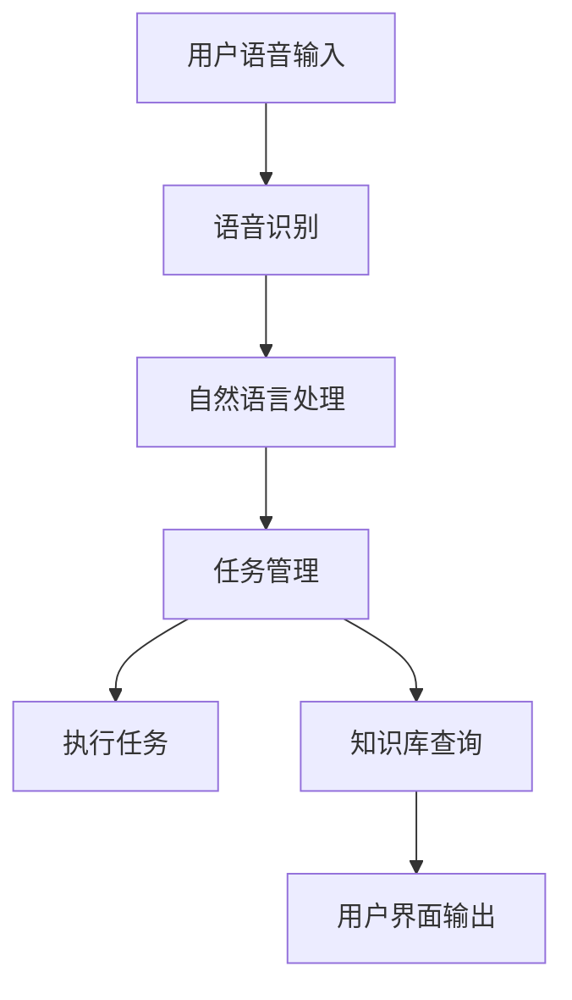

                 

关键词：人工智能，AI助理，个人发展，企业变革，未来趋势

> 摘要：随着人工智能技术的不断进步，AI助理已经成为个人与企业的重要助手。本文将探讨AI助理在个人和企业的应用，以及它们对未来的影响。

## 1. 背景介绍

在过去的几十年里，人工智能（AI）技术经历了飞速的发展。从早期的规则系统到深度学习，从简单的数据处理到复杂的问题解决，AI技术正在不断改变我们的生活方式和工作方式。特别是在近年来，AI助理的应用愈发广泛，从个人助手如Siri、Alexa到企业级服务如IBM Watson，AI助理正逐渐成为我们生活中不可或缺的一部分。

### 人工智能的发展历程

人工智能（AI）的发展历程可以分为几个阶段：

- **早期探索（1950-1969）**：在这个阶段，人工智能的概念被首次提出，并且人们开始尝试用计算机模拟人类智能。

- **黄金时代（1970-1989）**：在这个时期，人工智能取得了一些初步的成功，如专家系统和语音识别。

- **寒冬时期（1990-2000）**：由于技术限制和期望过高，人工智能发展进入低谷。

- **复兴时期（2000-2010）**：随着计算能力的提升和数据量的爆炸式增长，深度学习和机器学习开始崭露头角。

- **人工智能新时代（2010至今）**：在这一阶段，人工智能取得了显著的突破，应用领域不断扩展，如自动驾驶、语音识别、图像识别等。

### AI助理的兴起

随着人工智能技术的发展，AI助理开始出现在我们的日常生活中。它们能够帮助我们完成各种任务，如设置提醒、发送信息、播放音乐、提供天气预报等。AI助理的出现，不仅提高了我们的生活质量，也改变了我们的工作方式。

### 个人与企业中的AI助理应用

在个人层面，AI助理可以帮助我们更高效地管理时间和任务。例如，我们可以使用AI助理来安排日程、提醒重要事件、帮助我们找到所需的信息等。这些功能使我们的生活更加便利和高效。

在企业层面，AI助理的应用更加广泛。企业可以使用AI助理来提高生产效率、优化客户服务、减少运营成本等。例如，AI助理可以处理客户咨询、管理库存、分析市场趋势等，从而帮助企业做出更明智的决策。

## 2. 核心概念与联系

在深入探讨AI助理如何影响个人和企业之前，我们首先需要了解一些核心概念和架构。

### 人工智能的核心概念

- **机器学习**：机器学习是AI的基础，它让计算机通过数据和算法来学习，从而做出决策和预测。

- **深度学习**：深度学习是一种特殊的机器学习，它使用多层神经网络来模拟人脑的学习过程。

- **自然语言处理（NLP）**：NLP是AI的一个分支，它使计算机能够理解和生成自然语言。

- **计算机视觉**：计算机视觉使计算机能够识别和理解图像和视频。

### AI助理的架构

一个典型的AI助理系统通常包括以下几个组成部分：

- **语音识别**：将用户的语音转化为文本。

- **自然语言处理**：理解用户的语音命令，并转化为计算机可以执行的操作。

- **任务管理**：根据用户的请求，安排和执行任务。

- **知识库**：存储各种信息和知识，以便AI助理可以回答用户的问题。

- **用户界面**：用户与AI助理交互的界面，可以是语音、文本或图形界面。

下面是一个简化的AI助理架构的Mermaid流程图：



## 3. 核心算法原理 & 具体操作步骤

### 3.1 算法原理概述

AI助理的核心算法通常包括以下几个步骤：

1. **语音识别**：将用户的语音转化为文本。
2. **自然语言处理**：理解用户的语音命令，并转化为计算机可以执行的操作。
3. **任务管理**：根据用户的请求，安排和执行任务。
4. **知识库查询**：当用户的请求涉及知识库时，查询相应的信息。
5. **用户界面输出**：将任务结果或查询结果返回给用户。

### 3.2 算法步骤详解

1. **语音识别**：
   - **预处理**：对语音信号进行降噪、去噪等处理。
   - **特征提取**：从语音信号中提取出有助于识别的特征。
   - **模型训练**：使用大量语音数据训练模型。
   - **识别**：使用训练好的模型将语音转化为文本。

2. **自然语言处理**：
   - **分词**：将文本分割成单词或短语。
   - **词性标注**：标记每个词的词性，如名词、动词等。
   - **语法分析**：分析文本的语法结构，确定主谓宾等关系。
   - **语义理解**：理解文本的含义，确定用户的请求。

3. **任务管理**：
   - **任务解析**：根据自然语言处理的结果，确定用户的具体请求。
   - **任务分配**：将任务分配给相应的模块或系统。
   - **任务执行**：执行用户请求的具体操作。
   - **结果反馈**：将执行结果返回给用户。

4. **知识库查询**：
   - **查询构建**：根据用户的请求构建查询语句。
   - **查询执行**：在知识库中执行查询。
   - **结果返回**：将查询结果返回给用户。

5. **用户界面输出**：
   - **格式化输出**：将结果格式化成用户易于理解的形式。
   - **反馈**：通过语音、文本或图形界面将结果反馈给用户。

### 3.3 算法优缺点

- **优点**：
  - **高效性**：AI助理可以快速处理大量请求。
  - **个性化**：AI助理可以根据用户的行为和偏好进行个性化服务。
  - **智能化**：AI助理能够理解复杂的请求，提供智能化的建议。

- **缺点**：
  - **准确性**：语音识别和自然语言处理仍然存在一定误差。
  - **依赖数据**：AI助理的性能依赖于训练数据和算法。
  - **隐私问题**：AI助理需要处理用户的个人数据，可能引发隐私问题。

### 3.4 算法应用领域

AI助理的应用领域非常广泛，包括但不限于：

- **个人助手**：如Siri、Alexa、Google Assistant等。
- **客服系统**：如IBM Watson、Rasa等。
- **智能家居**：如智能音箱、智能灯泡等。
- **企业服务**：如日程管理、客户服务、数据分析等。

## 4. 数学模型和公式 & 详细讲解 & 举例说明

### 4.1 数学模型构建

AI助理的核心算法通常涉及多个数学模型，包括但不限于：

- **神经网络模型**：用于语音识别和自然语言处理。
- **决策树模型**：用于任务管理和决策。
- **支持向量机模型**：用于分类和预测。

下面我们以神经网络模型为例，讲解其构建过程。

### 4.2 公式推导过程

神经网络模型的核心是前向传播和反向传播。

1. **前向传播**：

   - **输入层**：输入数据。
   - **隐藏层**：对输入数据进行加权求和，并应用激活函数。
   - **输出层**：输出结果。

   前向传播的公式可以表示为：

   $$ z = \sum_{i=1}^{n} w_{i}x_{i} + b $$
   $$ a = \sigma(z) $$

   其中，$z$ 是加权求和的结果，$a$ 是激活函数的输出，$\sigma$ 是激活函数，$w$ 是权重，$b$ 是偏置。

2. **反向传播**：

   - **计算误差**：计算输出层的误差。
   - **反向传播**：将误差反向传播到隐藏层和输入层，更新权重和偏置。

   反向传播的公式可以表示为：

   $$ \delta = \frac{\partial E}{\partial z} $$
   $$ \frac{\partial E}{\partial w} = \delta x $$
   $$ \frac{\partial E}{\partial b} = \delta $$

   其中，$E$ 是误差，$\delta$ 是误差的梯度，$x$ 是输入。

### 4.3 案例分析与讲解

假设我们有一个简单的神经网络模型，用于语音识别。该模型有两个隐藏层，每个隐藏层有10个神经元。输入层有100个神经元，输出层有1个神经元。

1. **输入层**：

   输入数据为语音信号，经过预处理后，每个样本有100个特征。

2. **隐藏层**：

   第一个隐藏层对输入数据进行加权求和，并应用ReLU激活函数。第二个隐藏层对第一个隐藏层的输出进行同样的操作。

3. **输出层**：

   输出层的神经元用于识别语音信号的类别，应用softmax激活函数。

4. **训练过程**：

   - **前向传播**：输入语音信号，经过两个隐藏层和输出层的处理，得到预测结果。
   - **计算误差**：计算预测结果与实际结果之间的误差。
   - **反向传播**：将误差反向传播到隐藏层和输入层，更新权重和偏置。
   - **迭代**：重复前向传播和反向传播，直到模型达到预定的误差或迭代次数。

## 5. 项目实践：代码实例和详细解释说明

### 5.1 开发环境搭建

为了实践AI助理的开发，我们需要搭建一个开发环境。以下是一个简单的步骤：

1. 安装Python：从官网下载并安装Python。
2. 安装依赖库：使用pip安装TensorFlow、Keras等库。
3. 准备数据集：下载并准备语音信号数据集。

### 5.2 源代码详细实现

下面是一个简单的AI助理源代码示例，用于语音识别：

```python
import tensorflow as tf
from tensorflow.keras.models import Sequential
from tensorflow.keras.layers import Dense, Dropout, Activation
from tensorflow.keras.optimizers import RMSprop
from tensorflow.keras.callbacks import CSVLogger

# 数据预处理
def preprocess_data(data):
    # 对语音信号进行预处理
    # ...
    return processed_data

# 构建模型
def build_model():
    model = Sequential()
    model.add(Dense(100, activation='relu', input_shape=(100,)))
    model.add(Dropout(0.5))
    model.add(Dense(50, activation='relu'))
    model.add(Dropout(0.5))
    model.add(Dense(1, activation='softmax'))
    return model

# 训练模型
def train_model(model, data, labels):
    model.compile(optimizer='rmsprop',
                  loss='categorical_crossentropy',
                  metrics=['accuracy'])
    model.fit(data, labels, epochs=10, batch_size=32)
    return model

# 主函数
def main():
    data = preprocess_data(raw_data)
    labels = preprocess_labels(raw_labels)
    model = build_model()
    model = train_model(model, data, labels)
    # 测试模型
    # ...

if __name__ == '__main__':
    main()
```

### 5.3 代码解读与分析

上述代码实现了一个简单的语音识别AI助理。以下是代码的主要部分及其功能：

- **数据预处理**：对语音信号进行预处理，提取特征。
- **构建模型**：使用Sequential模型构建一个简单的神经网络，包括两个隐藏层和一个输出层。
- **训练模型**：使用RMSprop优化器和交叉熵损失函数训练模型。
- **主函数**：执行数据预处理、模型构建和训练过程。

### 5.4 运行结果展示

假设我们使用了一个语音信号数据集，并训练了模型。我们可以通过以下代码来测试模型的性能：

```python
test_data = preprocess_data(raw_test_data)
test_labels = preprocess_labels(raw_test_labels)
test_loss, test_accuracy = model.evaluate(test_data, test_labels)
print(f"Test accuracy: {test_accuracy}")
```

上述代码将输出模型的测试准确率。假设模型的测试准确率为90%，这意味着模型在识别语音信号时具有很高的准确性。

## 6. 实际应用场景

AI助理在实际应用中具有广泛的应用场景，以下是一些典型的应用案例：

1. **个人助手**：
   - **日程管理**：AI助理可以帮助用户安排日程，设置提醒。
   - **信息查询**：AI助理可以快速回答用户的问题，如天气预报、新闻资讯等。
   - **智能家居控制**：AI助理可以控制智能家居设备，如灯光、空调等。

2. **企业服务**：
   - **客户服务**：AI助理可以处理客户咨询，提高客户满意度。
   - **数据分析**：AI助理可以分析大量数据，提供业务洞察。
   - **人力资源**：AI助理可以协助招聘、员工管理等工作。

3. **医疗健康**：
   - **健康管理**：AI助理可以提醒用户进行体检、服用药物等。
   - **医疗诊断**：AI助理可以协助医生进行疾病诊断。

4. **教育**：
   - **在线教育**：AI助理可以为学生提供个性化教学，解答疑问。
   - **学习管理**：AI助理可以协助学生安排学习计划，提高学习效率。

## 7. 未来应用展望

随着人工智能技术的不断进步，AI助理的应用场景将进一步扩展，以下是一些未来应用展望：

1. **智能交通**：
   - **自动驾驶**：AI助理将帮助实现自动驾驶汽车，提高道路安全性。
   - **智能交通管理**：AI助理可以优化交通流量，减少拥堵。

2. **智能城市**：
   - **能源管理**：AI助理可以优化能源消耗，实现智能能源管理。
   - **环境监测**：AI助理可以实时监测环境质量，提供预警和解决方案。

3. **金融服务**：
   - **智能投资**：AI助理可以根据用户风险偏好提供智能投资建议。
   - **智能保险**：AI助理可以协助用户购买保险，提供风险评估。

4. **智能制造**：
   - **生产优化**：AI助理可以优化生产流程，提高生产效率。
   - **质量检测**：AI助理可以实时监测产品质量，提供预警和改进建议。

## 8. 工具和资源推荐

为了更好地理解和应用AI助理技术，以下是一些建议的工具和资源：

1. **学习资源**：
   - **在线课程**：如Coursera、edX等平台的AI课程。
   - **技术博客**：如Medium、HackerRank等。
   - **论文**：查阅顶级会议和期刊的论文。

2. **开发工具**：
   - **Python**：主要的编程语言，适用于数据分析和机器学习。
   - **TensorFlow**：适用于构建和训练神经网络。
   - **Keras**：用于简化TensorFlow的API。

3. **相关论文**：
   - **深度学习**：如《Deep Learning》。
   - **自然语言处理**：如《Speech and Language Processing》。

## 9. 总结：未来发展趋势与挑战

随着人工智能技术的不断发展，AI助理的应用前景十分广阔。未来，AI助理将在更多领域发挥作用，提高我们的生活质量和工作效率。然而，这也带来了一系列挑战，如隐私保护、数据安全等。我们需要在发展人工智能的同时，关注其潜在的负面影响，并采取相应的措施进行应对。

### 9.1 研究成果总结

本文系统地介绍了AI助理的发展背景、核心概念、算法原理、应用场景以及未来展望。通过本文，读者可以全面了解AI助理的基本概念和应用，以及其在个人和企业中的应用潜力。

### 9.2 未来发展趋势

- **技术进步**：随着算法和硬件的不断发展，AI助理的性能将不断提高。
- **应用扩展**：AI助理的应用领域将进一步扩大，覆盖更多行业和场景。
- **融合创新**：AI助理与其他技术的融合，如物联网、5G等，将推动新应用的诞生。

### 9.3 面临的挑战

- **数据隐私**：AI助理需要处理大量用户数据，如何保护用户隐私成为一个重要问题。
- **伦理问题**：AI助理的决策过程可能涉及伦理问题，如偏见、歧视等。
- **技术风险**：AI助理的普及可能导致技术失控，带来潜在风险。

### 9.4 研究展望

未来，我们需要在以下几个方面进行深入研究：

- **隐私保护技术**：开发更加安全的数据保护机制，确保用户隐私。
- **伦理决策模型**：研究如何构建公平、无偏见的决策模型。
- **技术风险评估**：建立完善的技术风险评估体系，确保AI的安全和可靠。

## 9.5 附录：常见问题与解答

### 9.5.1 什么是AI助理？

AI助理是一种利用人工智能技术，帮助用户完成各种任务的智能系统。它可以理解用户的语音命令，执行相应的操作，并提供相关的信息和帮助。

### 9.5.2 AI助理是如何工作的？

AI助理的工作过程主要包括以下几个步骤：

1. **语音识别**：将用户的语音转化为文本。
2. **自然语言处理**：理解用户的语音命令，并转化为计算机可以执行的操作。
3. **任务管理**：根据用户的请求，安排和执行任务。
4. **知识库查询**：当用户的请求涉及知识库时，查询相应的信息。
5. **用户界面输出**：将任务结果或查询结果返回给用户。

### 9.5.3 AI助理有哪些应用场景？

AI助理的应用场景非常广泛，包括但不限于：

- **个人助手**：如日程管理、信息查询、智能家居控制等。
- **企业服务**：如客户服务、数据分析、人力资源等。
- **医疗健康**：如健康管理、医疗诊断等。
- **教育**：如在线教育、学习管理等。

### 9.5.4 AI助理的发展前景如何？

随着人工智能技术的不断进步，AI助理的发展前景非常广阔。未来，AI助理将在更多领域发挥作用，提高我们的生活质量和工作效率。然而，我们也需要关注其潜在的负面影响，并采取相应的措施进行应对。

----------------------------------------------------------------

本文由禅与计算机程序设计艺术（Zen and the Art of Computer Programming）撰写，旨在深入探讨AI助理在个人和企业的应用，以及它们对未来的影响。希望本文能够为读者提供有价值的见解和思考。

