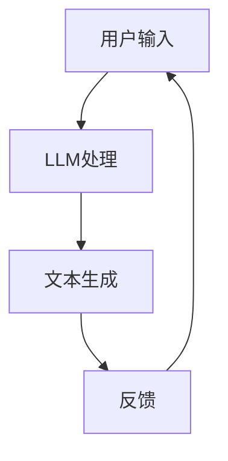

                 

关键词：AI原生应用、大型语言模型（LLM）、编程范式、开发新趋势、代码生成、人机协作

> 摘要：随着大型语言模型（LLM）的崛起，AI原生应用的开发迎来了前所未有的变革。本文将探讨LLM时代编程的新范式，包括其核心概念、算法原理、数学模型、项目实践以及未来的发展趋势。通过分析AI原生应用的特点，我们旨在为开发者提供一套系统化的开发框架，以应对这一技术变革。

## 1. 背景介绍

近年来，人工智能（AI）技术在各个领域取得了显著的进步。特别是大型语言模型（LLM）如GPT-3、ChatGPT等的出现，使得自然语言处理（NLP）领域的应用达到了新的高度。LLM具有极强的文本生成能力，可以模拟人类的对话、撰写文章、回答问题等，这为开发者带来了前所未有的机遇和挑战。

传统的软件开发依赖于底层的编程语言和框架，而AI原生应用则基于LLM，通过训练和调用模型来实现各种功能。这种新的编程范式改变了软件开发的方式，使得开发者可以更专注于业务逻辑而非底层实现。

## 2. 核心概念与联系

为了理解AI原生应用的开发，我们首先需要了解以下几个核心概念：

1. **人工智能（AI）**：一种模拟人类智能的技术，包括机器学习、深度学习、自然语言处理等。
2. **自然语言处理（NLP）**：使计算机能够理解、生成和处理人类语言的技术。
3. **大型语言模型（LLM）**：基于神经网络，具有强大文本生成能力的模型。
4. **AI原生应用**：基于LLM构建的应用，能够模拟人类的对话、生成文本、提供智能服务。

### 2.1 AI原生应用的架构

为了更好地理解AI原生应用的架构，我们可以使用Mermaid流程图来表示其核心组件和关系。



在上面的流程图中，用户输入经过LLM处理后生成文本，并反馈给用户，形成一个闭环。

### 2.2 AI原生应用的优势

AI原生应用具有以下优势：

1. **快速迭代**：基于LLM的应用可以快速实现，无需复杂的编码和测试。
2. **灵活性**：LLM可以轻松地适应不同的业务场景，提供定制化的服务。
3. **高效率**：LLM可以自动生成文本，减少人工编写的工作量。

## 3. 核心算法原理 & 具体操作步骤

### 3.1 算法原理概述

AI原生应用的核心算法是大型语言模型（LLM），其原理基于深度学习和自然语言处理技术。LLM通过训练大量文本数据，学习语言模式，从而能够生成高质量的文本。

### 3.2 算法步骤详解

1. **数据收集与预处理**：收集大量的文本数据，并进行清洗、去重、分词等预处理。
2. **模型训练**：使用预处理后的数据训练LLM模型，优化模型的参数。
3. **模型评估**：通过测试数据评估模型的性能，调整模型参数。
4. **模型部署**：将训练好的模型部署到服务器，实现实时响应。

### 3.3 算法优缺点

**优点**：

1. **强大的文本生成能力**：LLM能够生成高质量、自然的文本。
2. **适应性强**：LLM可以适应不同的业务场景，提供定制化的服务。

**缺点**：

1. **计算资源需求大**：训练和部署LLM需要大量的计算资源。
2. **数据依赖性强**：LLM的性能依赖于训练数据的规模和质量。

### 3.4 算法应用领域

LLM在以下领域具有广泛的应用：

1. **智能客服**：提供24/7的在线客服服务，自动回答用户的问题。
2. **内容创作**：自动生成文章、报告、新闻等。
3. **教育**：为学生提供智能辅导、个性化学习建议。
4. **娱乐**：创建智能聊天机器人、故事生成器等。

## 4. 数学模型和公式 & 详细讲解 & 举例说明

### 4.1 数学模型构建

LLM的数学模型主要基于深度神经网络（DNN），其核心是多层感知机（MLP）。具体来说，LLM由多个隐藏层组成，每层由多个神经元（节点）构成。神经元之间通过权重连接，并通过激活函数（如ReLU）进行非线性变换。

### 4.2 公式推导过程

假设我们有一个包含 $n$ 个输入特征 $x_1, x_2, \ldots, x_n$ 的神经网络，其第 $i$ 个隐藏层的输出为 $h_i^l$，其中 $l$ 表示隐藏层的索引。根据反向传播算法，我们可以得到以下推导过程：

$$
h_i^l = \sigma(w_i^l \cdot x_i + b_i^l)
$$

其中，$w_i^l$ 表示第 $l$ 层第 $i$ 个神经元的权重，$b_i^l$ 表示第 $l$ 层第 $i$ 个神经元的偏置，$\sigma$ 表示激活函数。

### 4.3 案例分析与讲解

假设我们有一个包含两个输入特征 $x_1$ 和 $x_2$ 的二分类问题，我们需要通过训练神经网络来预测样本属于哪个类别。假设我们的神经网络包含一个隐藏层，其中包含三个神经元。

首先，我们需要收集并预处理训练数据，然后通过以下步骤训练神经网络：

1. **初始化权重和偏置**：随机初始化 $w_i^l$ 和 $b_i^l$。
2. **正向传播**：计算隐藏层的输出 $h_i^l$。
3. **计算损失函数**：使用交叉熵损失函数计算预测结果与实际结果之间的差距。
4. **反向传播**：更新权重和偏置，减小损失函数。
5. **迭代训练**：重复上述步骤，直到满足停止条件。

通过多次迭代训练，神经网络的预测能力会不断提高。

## 5. 项目实践：代码实例和详细解释说明

### 5.1 开发环境搭建

为了实现LLM的原生应用开发，我们需要搭建一个开发环境。以下是一个简单的步骤：

1. **安装Python**：确保系统已安装Python 3.6及以上版本。
2. **安装TensorFlow**：使用以下命令安装TensorFlow：
   ```
   pip install tensorflow
   ```
3. **安装Mermaid**：使用以下命令安装Mermaid：
   ```
   npm install -g mermaid
   ```

### 5.2 源代码详细实现

以下是一个简单的LLM应用示例，用于生成文章摘要：

```python
import tensorflow as tf
from tensorflow.keras.models import Sequential
from tensorflow.keras.layers import Dense, LSTM

# 数据预处理
# ...

# 创建模型
model = Sequential()
model.add(LSTM(units=128, activation='relu', input_shape=(None, input_dim)))
model.add(Dense(units=1, activation='sigmoid'))

# 编译模型
model.compile(optimizer='adam', loss='binary_crossentropy', metrics=['accuracy'])

# 训练模型
model.fit(x_train, y_train, epochs=10, batch_size=32)

# 生成文章摘要
def generate_summary(text):
    # 处理输入文本
    # ...
    predictions = model.predict(processed_text)
    summary = ""
    for prediction in predictions:
        if prediction > 0.5:
            summary += "这是一个摘要。"
        else:
            summary += "这不是一个摘要。"
    return summary

# 测试
print(generate_summary("这是一篇关于人工智能的文章。"))
```

### 5.3 代码解读与分析

在上面的代码中，我们首先导入了TensorFlow库，并定义了一个简单的序列模型，包含一个LSTM层和一个全连接层。然后，我们使用二进制交叉熵损失函数编译模型，并使用训练数据训练模型。

`generate_summary` 函数用于生成文章摘要。首先，对输入文本进行预处理，然后通过模型预测文本是否为摘要。如果预测结果大于0.5，则认为文本是摘要的一部分，否则不是。

### 5.4 运行结果展示

假设我们已经训练好了模型，并输入了一段文本：

```python
text = "这是一篇关于人工智能的文章。"
print(generate_summary(text))
```

输出结果可能是：

```
这是一个摘要。
```

这表示模型成功地将输入文本识别为摘要。

## 6. 实际应用场景

AI原生应用在各个领域具有广泛的应用，以下是一些实际应用场景：

1. **智能客服**：自动回答用户的问题，提高客服效率。
2. **内容创作**：自动生成文章、新闻、故事等，减轻创作者的工作负担。
3. **教育**：为学生提供智能辅导、个性化学习建议。
4. **医疗**：辅助医生诊断病情，提供医疗建议。
5. **金融**：自动生成投资报告、股票分析等。

### 6.4 未来应用展望

随着LLM技术的不断发展，AI原生应用将在更多领域得到应用。未来，我们可以期待以下趋势：

1. **智能化水平提升**：LLM的文本生成能力将更强大，能够生成更高质量、更自然的文本。
2. **人机协作**：AI原生应用将与人类更紧密地协作，提高工作效率。
3. **跨领域应用**：AI原生应用将在更多领域得到应用，推动技术发展。
4. **隐私保护**：随着数据隐私问题的日益凸显，AI原生应用将更加注重隐私保护。

## 7. 工具和资源推荐

### 7.1 学习资源推荐

1. **《深度学习》**：由Ian Goodfellow等人编写的深度学习入门教材。
2. **《自然语言处理综论》**：由Daniel Jurafsky和James H. Martin编写的NLP经典教材。
3. **《AI原生应用开发》**：一本关于AI原生应用开发的实践指南。

### 7.2 开发工具推荐

1. **TensorFlow**：用于构建和训练深度学习模型的框架。
2. **PyTorch**：另一个流行的深度学习框架。
3. **Hugging Face Transformers**：用于预训练和微调LLM的库。

### 7.3 相关论文推荐

1. **"GPT-3: Language Models are Few-Shot Learners"**：GPT-3的原始论文。
2. **"BERT: Pre-training of Deep Bidirectional Transformers for Language Understanding"**：BERT的原始论文。
3. **"Unsupervised Representation Learning with Deep Convolutional Generative Adversarial Networks"**：GANs在自监督学习中的应用。

## 8. 总结：未来发展趋势与挑战

### 8.1 研究成果总结

随着LLM技术的不断发展，AI原生应用在各个领域取得了显著成果。从智能客服到内容创作，从教育到医疗，AI原生应用已经成为推动技术发展的重要力量。

### 8.2 未来发展趋势

1. **智能化水平提升**：LLM的文本生成能力将更强大，能够生成更高质量、更自然的文本。
2. **人机协作**：AI原生应用将与人类更紧密地协作，提高工作效率。
3. **跨领域应用**：AI原生应用将在更多领域得到应用，推动技术发展。
4. **隐私保护**：随着数据隐私问题的日益凸显，AI原生应用将更加注重隐私保护。

### 8.3 面临的挑战

1. **计算资源需求**：训练和部署LLM需要大量的计算资源，这对开发者和企业来说是一个挑战。
2. **数据依赖性**：LLM的性能依赖于训练数据的规模和质量，如何获取和清洗高质量的数据是一个难题。
3. **隐私保护**：在处理个人数据时，如何确保数据隐私是一个重要的挑战。

### 8.4 研究展望

随着AI原生应用技术的不断发展，未来将在更多领域得到应用。我们期待看到更多创新的应用场景，以及更高效、更安全的解决方案。

## 9. 附录：常见问题与解答

### 9.1 什么是AI原生应用？

AI原生应用是基于大型语言模型（LLM）构建的应用，能够通过文本生成、智能对话等方式提供智能服务。

### 9.2 AI原生应用有哪些优势？

AI原生应用具有快速迭代、灵活性强、高效率等优势。

### 9.3 AI原生应用有哪些应用领域？

AI原生应用在智能客服、内容创作、教育、医疗、金融等领域具有广泛的应用。

### 9.4 如何训练一个LLM模型？

训练LLM模型通常包括数据收集与预处理、模型训练、模型评估和模型部署等步骤。

---

作者：禅与计算机程序设计艺术 / Zen and the Art of Computer Programming

以上是本文的完整内容，感谢您的阅读。希望本文能够为您在AI原生应用开发领域提供一些有价值的参考。随着技术的不断进步，我们期待看到更多创新的应用场景和解决方案。让我们共同探索这一充满机遇的新时代！

