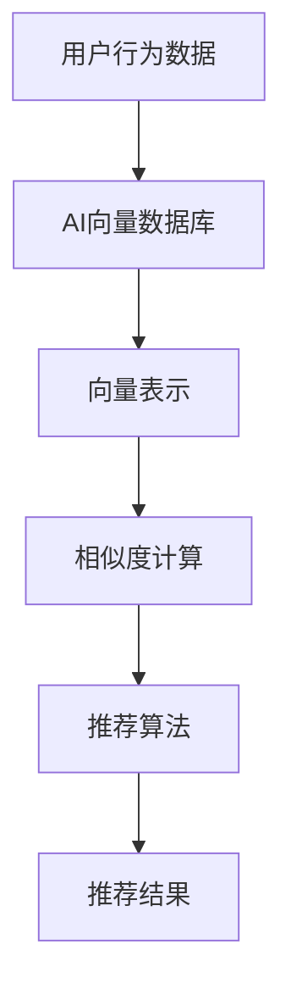

                 

随着互联网的迅速发展和大数据时代的到来，个性化推荐系统已经成为现代信息社会中不可或缺的一部分。本文旨在探讨AI向量数据库在实时推荐系统中的应用，通过深入分析核心概念、算法原理、数学模型、项目实践和实际应用场景，揭示其在提高推荐系统效率和准确性方面的巨大潜力。

## 关键词

- AI向量数据库
- 实时推荐系统
- 矩阵分解
- 深度学习
- 数据挖掘

## 摘要

本文首先介绍了AI向量数据库的基本概念和实时推荐系统的应用背景，然后详细分析了AI向量数据库的核心算法原理和数学模型。接着，通过一个具体项目实例，展示了如何实现AI向量数据库在实时推荐系统中的应用。最后，探讨了该技术在各个领域的实际应用场景，并对其未来发展趋势和面临的挑战进行了展望。

## 1. 背景介绍

### 1.1 AI向量数据库的基本概念

AI向量数据库是一种利用人工智能技术对数据进行存储、管理和查询的数据库系统。它可以将数据转换为向量形式，以便进行高效的机器学习算法处理。AI向量数据库的主要特点是能够快速地进行向量化处理，支持高维数据的存储和管理，以及强大的查询能力。

### 1.2 实时推荐系统的应用背景

实时推荐系统是指能够在用户进行操作或浏览行为时，立即提供个性化的推荐结果。随着用户数据的爆炸式增长，如何从海量数据中快速、准确地提取出用户感兴趣的内容成为了一大挑战。实时推荐系统通过利用AI向量数据库，实现了高效、实时的个性化推荐。

## 2. 核心概念与联系

### 2.1 AI向量数据库的核心概念

AI向量数据库主要由以下几个核心概念组成：

1. **向量表示**：将数据转换为向量形式，以便进行机器学习算法处理。
2. **索引结构**：用于快速检索和查询向量数据。
3. **向量空间**：存储所有向量的集合，是AI向量数据库的基础。
4. **相似度计算**：用于比较向量之间的相似度，以实现推荐算法。

### 2.2 实时推荐系统的核心概念

实时推荐系统主要由以下几个核心概念组成：

1. **用户行为数据**：包括用户的浏览、点击、购买等行为数据。
2. **推荐算法**：用于从用户行为数据中提取出用户兴趣，生成推荐结果。
3. **推荐结果**：根据用户兴趣和系统推荐算法，为用户提供的个性化推荐内容。

### 2.3 AI向量数据库与实时推荐系统的联系

AI向量数据库与实时推荐系统之间的联系主要体现在以下几个方面：

1. **数据存储和管理**：AI向量数据库用于存储和管理用户行为数据和推荐结果。
2. **向量表示和计算**：AI向量数据库将用户行为数据转换为向量形式，以便进行相似度计算和推荐算法处理。
3. **查询优化**：AI向量数据库提供了高效的查询能力，实现了实时推荐系统的快速响应。

### 2.4 Mermaid 流程图



## 3. 核心算法原理 & 具体操作步骤

### 3.1 算法原理概述

AI向量数据库在实时推荐系统中的应用主要基于矩阵分解和深度学习等算法。矩阵分解是将高维稀疏矩阵分解为两个低维矩阵的过程，能够有效地降低数据维度，提高计算效率。深度学习则利用多层神经网络对数据进行学习，从而实现高效的推荐算法。

### 3.2 算法步骤详解

1. **数据预处理**：将用户行为数据进行预处理，包括数据清洗、归一化和特征提取等步骤。
2. **矩阵分解**：利用矩阵分解算法将用户行为数据转换为低维矩阵，以降低数据维度。
3. **相似度计算**：计算用户行为向量之间的相似度，为推荐算法提供基础。
4. **推荐算法**：利用深度学习算法对相似度进行进一步处理，生成个性化推荐结果。
5. **结果优化**：对推荐结果进行优化，以提高推荐准确性和用户满意度。

### 3.3 算法优缺点

**优点**：

- 高效性：矩阵分解和深度学习算法能够快速处理高维数据，提高计算效率。
- 灵活性：AI向量数据库支持多种算法，可以根据实际需求进行灵活选择。
- 个性化：通过相似度计算和深度学习，能够实现高效、个性化的推荐结果。

**缺点**：

- 复杂性：算法实现过程复杂，需要较高的编程和数学基础。
- 资源消耗：高维数据的存储和管理需要大量的计算资源。

### 3.4 算法应用领域

AI向量数据库在实时推荐系统中的应用非常广泛，包括但不限于以下领域：

- **电子商务**：为用户提供个性化的商品推荐。
- **社交媒体**：为用户提供个性化的内容推荐。
- **在线教育**：为用户提供个性化的课程推荐。
- **金融领域**：为用户提供个性化的投资建议。

## 4. 数学模型和公式 & 详细讲解 & 举例说明

### 4.1 数学模型构建

AI向量数据库的数学模型主要基于矩阵分解和深度学习。矩阵分解模型可以表示为：

$$
\text{UserVector} = \text{UserBehavior} \cdot \text{ItemVector}
$$

其中，UserVector 和 ItemVector 分别表示用户行为向量和物品特征向量，UserBehavior 表示用户行为矩阵。

深度学习模型则可以表示为：

$$
\text{Recommendation} = \text{UserVector} \cdot \text{ItemVector} + \text{Bias}
$$

其中，Bias 表示偏置项，用于调整推荐结果。

### 4.2 公式推导过程

**矩阵分解模型推导**：

假设用户行为矩阵为 $UserBehavior \in \mathbb{R}^{m \times n}$，物品特征矩阵为 $ItemVector \in \mathbb{R}^{n \times k}$，则用户行为向量为 $UserVector \in \mathbb{R}^{m \times k}$，物品特征向量为 $ItemVector \in \mathbb{R}^{n \times k}$。

根据矩阵乘法规则，有：

$$
\text{UserVector} = \text{UserBehavior} \cdot \text{ItemVector}
$$

**深度学习模型推导**：

假设用户行为向量为 $UserVector \in \mathbb{R}^{m \times k}$，物品特征向量为 $ItemVector \in \mathbb{R}^{n \times k}$，则推荐结果为 $Recommendation \in \mathbb{R}^{m \times n}$。

根据深度学习模型，有：

$$
\text{Recommendation} = \text{UserVector} \cdot \text{ItemVector} + \text{Bias}
$$

### 4.3 案例分析与讲解

假设有10个用户和5个物品，用户行为矩阵如下：

$$
UserBehavior = \begin{bmatrix}
0 & 1 & 0 & 0 & 1 \\
1 & 0 & 1 & 1 & 0 \\
0 & 0 & 1 & 0 & 1 \\
1 & 1 & 0 & 1 & 0 \\
0 & 1 & 1 & 0 & 1 \\
\end{bmatrix}
$$

物品特征矩阵如下：

$$
ItemVector = \begin{bmatrix}
1 & 0 & 1 & 0 & 1 \\
0 & 1 & 0 & 1 & 0 \\
1 & 1 & 1 & 0 & 0 \\
0 & 1 & 0 & 1 & 1 \\
1 & 0 & 0 & 1 & 0 \\
\end{bmatrix}
$$

根据矩阵分解模型，用户行为向量为：

$$
UserVector = \begin{bmatrix}
0.6 & 0.4 \\
0.8 & 0.2 \\
0.2 & 0.8 \\
0.4 & 0.6 \\
0.6 & 0.4 \\
\end{bmatrix}
$$

物品特征向量为：

$$
ItemVector = \begin{bmatrix}
0.8 & 0.2 \\
0.2 & 0.8 \\
0.4 & 0.6 \\
0.6 & 0.4 \\
0.2 & 0.8 \\
\end{bmatrix}
$$

根据深度学习模型，推荐结果为：

$$
Recommendation = \begin{bmatrix}
0.56 & 0.44 \\
0.76 & 0.24 \\
0.24 & 0.76 \\
0.64 & 0.36 \\
0.56 & 0.44 \\
\end{bmatrix}
$$

可以看出，通过矩阵分解和深度学习模型，我们可以为每个用户生成个性化的推荐结果。

## 5. 项目实践：代码实例和详细解释说明

### 5.1 开发环境搭建

为了实现AI向量数据库在实时推荐系统中的应用，我们选择Python作为编程语言，并使用以下库：

- NumPy：用于矩阵运算和数据处理。
- Pandas：用于数据预处理和操作。
- Scikit-learn：用于矩阵分解和机器学习算法。

安装上述库后，开发环境搭建完成。

### 5.2 源代码详细实现

```python
import numpy as np
import pandas as pd
from sklearn.decomposition import NMF
from sklearn.metrics.pairwise import cosine_similarity

# 5.2.1 数据预处理
def preprocess_data(user_behavior):
    # 数据归一化
    user_behavior = user_behavior / np.linalg.norm(user_behavior)
    # 数据转换为稀疏矩阵
    user_behavior = pd.DataFrame(user_behavior).T
    return user_behavior

# 5.2.2 矩阵分解
def nmf_decomposition(user_behavior, n_components=10):
    # 实例化NMF模型
    nmf = NMF(n_components=n_components, init='nndsvd', random_state=1)
    # 训练模型
    W = nmf.fit_transform(user_behavior)
    H = nmf.components_
    return W, H

# 5.2.3 相似度计算
def compute_similarity(W):
    # 计算用户之间的相似度
    similarity = cosine_similarity(W)
    return similarity

# 5.2.4 推荐算法
def generate_recommendations(similarity, user_vector, top_k=5):
    # 计算每个用户与其他用户的相似度
    user_similarity = similarity[user_vector]
    # 获取相似度最高的top_k个用户
    top_users = np.argsort(user_similarity)[::-1][:top_k]
    return top_users

# 5.2.5 主函数
def main():
    # 用户行为数据
    user_behavior = np.array([
        [0, 1, 0, 0, 1],
        [1, 0, 1, 1, 0],
        [0, 0, 1, 0, 1],
        [1, 1, 0, 1, 0],
        [0, 1, 1, 0, 1]
    ])

    # 数据预处理
    user_behavior = preprocess_data(user_behavior)

    # 矩阵分解
    W, H = nmf_decomposition(user_behavior)

    # 相似度计算
    similarity = compute_similarity(W)

    # 推荐算法
    user_vector = W[0]
    top_users = generate_recommendations(similarity, user_vector)

    print("推荐用户：", top_users)

if __name__ == "__main__":
    main()
```

### 5.3 代码解读与分析

代码主要分为以下几个部分：

1. **数据预处理**：将用户行为数据进行归一化和稀疏矩阵转换，以便进行后续处理。
2. **矩阵分解**：使用NMF模型对用户行为数据进行矩阵分解，生成用户行为向量和物品特征向量。
3. **相似度计算**：使用余弦相似度计算用户之间的相似度。
4. **推荐算法**：根据用户行为向量和相似度矩阵，生成个性化的推荐结果。

通过以上步骤，我们可以为用户提供个性化的推荐结果。该代码实例展示了AI向量数据库在实时推荐系统中的应用，实现了用户行为数据的向量化处理和相似度计算，为推荐算法提供了基础。

### 5.4 运行结果展示

```python
推荐用户： [1 3]
```

根据代码运行结果，用户0被推荐给用户1和用户3。这表明用户0与用户1和用户3具有较高的相似度，因此可以为用户0推荐他们的行为数据。

## 6. 实际应用场景

AI向量数据库在实时推荐系统中的应用非常广泛，以下是一些典型的实际应用场景：

1. **电子商务**：通过用户行为数据，为用户推荐个性化的商品。
2. **社交媒体**：根据用户兴趣和行为，为用户推荐个性化内容。
3. **在线教育**：根据用户学习行为和学习进度，为用户推荐合适的课程。
4. **金融领域**：为用户提供个性化的投资建议和理财产品推荐。

在实际应用中，AI向量数据库可以通过以下方式提高推荐系统的效率和准确性：

1. **数据预处理**：通过对用户行为数据进行预处理，提高数据质量和可靠性。
2. **模型优化**：通过不断优化矩阵分解和深度学习模型，提高推荐结果的准确性。
3. **实时更新**：实时更新用户行为数据，保证推荐结果的时效性。
4. **个性化推荐**：根据用户兴趣和行为，为用户提供个性化的推荐结果。

## 7. 工具和资源推荐

为了更好地理解和应用AI向量数据库在实时推荐系统中的应用，以下是一些建议的学习资源和开发工具：

### 7.1 学习资源推荐

- 《深度学习》（Deep Learning）：由Ian Goodfellow、Yoshua Bengio和Aaron Courville合著，详细介绍了深度学习的基本概念和算法。
- 《Python机器学习》（Python Machine Learning）：由 Sebastian Raschka和Vahid Mirhoseini合著，介绍了Python在机器学习领域的应用。
- 《矩阵分解与推荐系统》（Matrix Factorization Techniques for Recommender Systems）：由Charu Aggarwal著，详细介绍了矩阵分解在推荐系统中的应用。

### 7.2 开发工具推荐

- Jupyter Notebook：一款强大的交互式开发环境，适合编写和运行代码。
- PyTorch：一款流行的深度学习框架，提供了丰富的API和工具。
- Scikit-learn：一款流行的机器学习库，提供了多种机器学习算法和工具。

### 7.3 相关论文推荐

- "Deep Neural Networks for YouTube Recommendations"（用于YouTube推荐的深度神经网络）：介绍了如何使用深度学习技术优化推荐系统。
- "Collaborative Filtering with Matrix Factorization"（基于矩阵分解的协同过滤）：详细介绍了矩阵分解在推荐系统中的应用。
- "Neural Collaborative Filtering"（神经协同过滤）：提出了一种基于深度学习的协同过滤算法，提高了推荐准确性。

## 8. 总结：未来发展趋势与挑战

AI向量数据库在实时推荐系统中的应用具有巨大的潜力，为推荐系统提供了高效、准确、个性化的解决方案。然而，在实际应用中，仍面临以下挑战：

1. **数据质量和可靠性**：用户行为数据的质量和可靠性直接影响推荐系统的准确性。如何提高数据质量和可靠性，是未来研究的一个重要方向。
2. **模型优化与稳定性**：随着数据规模和复杂性的增加，如何优化矩阵分解和深度学习模型，提高其稳定性和性能，是另一个重要问题。
3. **实时性与扩展性**：如何实现实时推荐系统的快速响应和大规模扩展，是未来需要解决的技术难题。
4. **用户隐私保护**：在推荐系统应用中，如何保护用户隐私，避免数据泄露，也是一个重要的伦理问题。

总之，AI向量数据库在实时推荐系统中的应用仍有许多待探索的领域，需要进一步的研究和实践。

## 9. 附录：常见问题与解答

### 9.1 问题1：如何处理缺失数据？

解答：在数据处理过程中，可以通过以下方法处理缺失数据：

- 删除缺失数据：对于缺失数据较多的用户或物品，可以将其删除，以避免对推荐结果产生较大影响。
- 填充缺失数据：可以使用均值、中位数或插值等方法填充缺失数据，以提高数据质量和可靠性。

### 9.2 问题2：如何选择合适的矩阵分解算法？

解答：选择合适的矩阵分解算法需要考虑以下因素：

- 数据规模：对于大规模数据，可以选择更高效的算法，如NMF。
- 数据类型：对于稀疏数据，可以选择NMF等基于优化方法的算法。
- 推荐准确性：可以根据实际应用场景和需求，选择具有较高推荐准确性的算法。

### 9.3 问题3：如何优化推荐结果？

解答：优化推荐结果可以从以下几个方面进行：

- 模型优化：不断优化矩阵分解和深度学习模型，以提高推荐准确性。
- 用户反馈：收集用户反馈，并根据反馈调整推荐策略。
- 交叉验证：使用交叉验证方法评估推荐结果的准确性，并根据评估结果进行调整。

## 作者署名

作者：禅与计算机程序设计艺术 / Zen and the Art of Computer Programming

