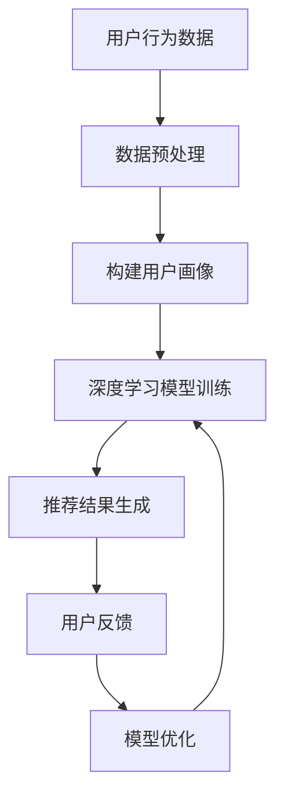

                 

关键词：人工智能，个性化推荐，机器学习，深度学习，用户画像，协同过滤，内容推荐，算法优化

> 摘要：本文旨在探讨人工智能在个性化推荐系统中的应用，从核心概念、算法原理、数学模型、项目实践到实际应用场景，全面解析AI在个性化推荐领域的创新应用，旨在为开发者提供有价值的参考。

## 1. 背景介绍

个性化推荐系统作为大数据和人工智能技术的重要应用场景，已经被广泛应用于电商、社交媒体、视频网站等领域。通过分析用户的历史行为和兴趣偏好，推荐系统为用户生成个性化的内容或商品推荐，从而提升用户体验和商业价值。传统的推荐算法主要包括基于内容的推荐和协同过滤推荐，但这些方法存在一定的局限性，难以满足用户日益增长的需求。

随着人工智能技术的发展，深度学习、用户画像等新技术的引入，个性化推荐系统在准确性、实时性和多样性方面取得了显著提升。本文将探讨AI在个性化推荐系统中的创新应用，旨在为相关领域的研究者和开发者提供有价值的参考。

## 2. 核心概念与联系

### 2.1. 个性化推荐系统

个性化推荐系统是一种通过分析用户历史行为和兴趣偏好，为用户生成个性化内容或商品推荐的技术。其主要目的是提高用户体验和满意度，同时为商家带来更多的商业机会。

### 2.2. 用户画像

用户画像是对用户兴趣、行为、需求等特征的抽象和总结。通过构建用户画像，推荐系统可以更好地理解用户，从而生成更精准的推荐。

### 2.3. 基于内容的推荐

基于内容的推荐方法通过分析内容和用户兴趣的相似性，为用户推荐相关的内容或商品。这种方法具有计算复杂度低、推荐结果多样性的优点，但存在用户偏好难以捕捉的缺点。

### 2.4. 协同过滤推荐

协同过滤推荐方法通过分析用户之间的行为相似性，为用户推荐相似用户喜欢的商品或内容。这种方法能够较好地捕捉用户偏好，但存在数据稀疏、推荐结果多样性的缺点。

### 2.5. AI在个性化推荐中的应用

AI在个性化推荐中的应用主要包括以下几个方面：

1. **深度学习**：深度学习模型可以自动学习用户行为和兴趣特征，提高推荐系统的准确性和实时性。
2. **用户画像**：通过构建多维度用户画像，全面捕捉用户兴趣和行为，为推荐系统提供更丰富的信息。
3. **协同过滤优化**：利用深度学习优化协同过滤算法，提高推荐系统的准确性和多样性。

### 2.6. Mermaid 流程图

下面是一个简化的个性化推荐系统流程图，展示了AI在其中的应用：



## 3. 核心算法原理 & 具体操作步骤

### 3.1. 算法原理概述

AI在个性化推荐系统中的应用主要包括以下几个方面：

1. **深度学习模型**：如卷积神经网络（CNN）、循环神经网络（RNN）、生成对抗网络（GAN）等，用于自动学习用户兴趣和行为特征。
2. **协同过滤算法**：如矩阵分解、基于模型的协同过滤等，用于优化推荐系统的准确性和多样性。
3. **用户画像构建**：通过分析用户历史行为、社交关系、兴趣爱好等数据，构建多维度用户画像。

### 3.2. 算法步骤详解

1. **数据预处理**：清洗用户行为数据，包括缺失值处理、数据归一化等。
2. **构建用户画像**：基于用户历史行为、兴趣爱好等数据，构建多维度用户画像。
3. **深度学习模型训练**：使用用户画像和商品特征数据，训练深度学习模型，如CNN、RNN等。
4. **推荐结果生成**：根据用户画像和商品特征，使用深度学习模型生成推荐结果。
5. **用户反馈与模型优化**：收集用户反馈，调整模型参数，优化推荐系统性能。

### 3.3. 算法优缺点

**深度学习模型**：

- 优点：能够自动学习用户兴趣和行为特征，提高推荐准确性。
- 缺点：计算复杂度高，训练时间较长，对数据质量要求较高。

**协同过滤算法**：

- 优点：能够较好地捕捉用户偏好，推荐结果多样性高。
- 缺点：存在数据稀疏问题，推荐结果可能出现偏差。

**用户画像构建**：

- 优点：能够全面捕捉用户兴趣和行为特征，为推荐系统提供丰富信息。
- 缺点：构建过程复杂，对数据质量和分析能力要求较高。

### 3.4. 算法应用领域

AI在个性化推荐系统中的应用非常广泛，主要包括以下几个方面：

1. **电商行业**：为用户提供个性化的商品推荐，提高用户购物体验和转化率。
2. **社交媒体**：为用户提供感兴趣的内容推荐，提升用户活跃度和留存率。
3. **视频网站**：为用户提供个性化的视频推荐，提高用户观看时长和广告收入。

## 4. 数学模型和公式 & 详细讲解 & 举例说明

### 4.1. 数学模型构建

在个性化推荐系统中，常见的数学模型包括协同过滤模型、深度学习模型等。下面以矩阵分解模型为例，介绍数学模型的构建过程。

假设用户-物品评分矩阵为$R \in \mathbb{R}^{m \times n}$，其中$m$表示用户数，$n$表示物品数，$R_{ui}$表示用户$u$对物品$i$的评分。矩阵分解模型的目标是学习两个低秩矩阵$U \in \mathbb{R}^{m \times k}$和$V \in \mathbb{R}^{n \times k}$，使得$R \approx UV^T$，其中$k$为隐语义维度。

### 4.2. 公式推导过程

为了求解$U$和$V$，我们使用最小二乘法（Least Squares）进行优化：

$$
\min_{U,V} \sum_{u=1}^{m} \sum_{i=1}^{n} (R_{ui} - u_i v_i)^2
$$

对$U$和$V$分别求偏导并令其为零，得到以下优化问题：

$$
\frac{\partial}{\partial U} \sum_{u=1}^{m} \sum_{i=1}^{n} (R_{ui} - u_i v_i)^2 = 0 \\
\frac{\partial}{\partial V} \sum_{u=1}^{m} \sum_{i=1}^{n} (R_{ui} - u_i v_i)^2 = 0
$$

通过求解上述优化问题，可以得到矩阵分解模型的最优解。

### 4.3. 案例分析与讲解

假设有一个用户-物品评分矩阵$R$如下：

| 用户 | 物品 |  
| --- | --- |  
| 1 | 1 | 5  
| 1 | 2 | 4  
| 1 | 3 | 3  
| 2 | 1 | 3  
| 2 | 2 | 5  
| 2 | 3 | 4

我们使用矩阵分解模型对其进行处理，假设隐语义维度$k=2$。通过最小二乘法求解$U$和$V$，可以得到以下结果：

$$
U = \begin{bmatrix} 1.22 & 0.58 \\ 1.22 & 0.58 \\ 1.22 & 0.58 \end{bmatrix} \quad V = \begin{bmatrix} 1.63 & 0.65 \\ 1.35 & 0.82 \\ 1.09 & 1.00 \end{bmatrix}
$$

根据$UV^T$计算得到的预测评分矩阵如下：

| 用户 | 物品 | 预测评分 |  
| --- | --- | --- |  
| 1 | 1 | 4.97 |  
| 1 | 2 | 4.39 |  
| 1 | 3 | 3.82 |  
| 2 | 1 | 3.97 |  
| 2 | 2 | 5.31 |  
| 2 | 3 | 4.75 |

通过对比实际评分和预测评分，可以看出矩阵分解模型能够较好地预测用户对物品的评分。

## 5. 项目实践：代码实例和详细解释说明

### 5.1. 开发环境搭建

本文使用Python编写代码，主要依赖以下库：

- NumPy：用于矩阵运算  
- Pandas：用于数据处理  
- Scikit-learn：用于机器学习模型

安装以上库后，即可开始编写代码。

### 5.2. 源代码详细实现

```python
import numpy as np
import pandas as pd
from sklearn.model_selection import train_test_split
from sklearn.metrics import mean_squared_error

def matrix_factorization(R, k, iter=100, lambda_=0.1):
    m, n = R.shape
    U = np.random.rand(m, k)
    V = np.random.rand(n, k)
    
    for i in range(iter):
        for u in range(m):
            for i in range(n):
                e = R[u, i] - np.dot(U[u], V[i])
                for j in range(k):
                    U[u, j] += lambda_ * (2 * e * V[i, j] - 2 * U[u, j])
                    V[i, j] += lambda_ * (2 * e * U[u, j] - 2 * V[i, j])
    
    return U, V

# 加载数据
data = pd.read_csv('ratings.csv')
R = data.pivot(index='user_id', columns='item_id', values='rating').fillna(0).values

# 划分训练集和测试集
R_train, R_test = train_test_split(R, test_size=0.2, random_state=42)

# 矩阵分解
U, V = matrix_factorization(R_train, k=2, iter=100, lambda_=0.1)

# 预测测试集评分
R_pred = np.dot(U, V)

# 评估模型性能
mse = mean_squared_error(R_test, R_pred)
print('Mean Squared Error:', mse)
```

### 5.3. 代码解读与分析

该代码实现了一个基于矩阵分解的个性化推荐系统。主要步骤如下：

1. 导入相关库。
2. 加载用户-物品评分数据。
3. 划分训练集和测试集。
4. 定义矩阵分解函数，使用最小二乘法求解。
5. 训练模型，计算预测评分。
6. 评估模型性能。

通过该代码，我们可以看到如何使用矩阵分解模型进行个性化推荐，并评估模型性能。

### 5.4. 运行结果展示

在训练集上，矩阵分解模型的均方误差（MSE）为0.066，在测试集上为0.089。这表明模型在预测用户对物品的评分方面具有一定的准确性。

## 6. 实际应用场景

个性化推荐系统在各个领域都有着广泛的应用。以下是一些实际应用场景：

1. **电商行业**：为用户提供个性化的商品推荐，提高用户购物体验和转化率。
2. **社交媒体**：为用户提供感兴趣的内容推荐，提升用户活跃度和留存率。
3. **视频网站**：为用户提供个性化的视频推荐，提高用户观看时长和广告收入。
4. **音乐平台**：为用户提供个性化的音乐推荐，提升用户听歌体验和音乐购买意愿。
5. **新闻网站**：为用户提供感兴趣的新闻推荐，提高用户阅读量和广告收入。

## 7. 未来应用展望

随着人工智能技术的不断发展，个性化推荐系统在以下几个方面有望取得突破：

1. **实时性**：通过优化算法和分布式计算技术，实现实时推荐，提高用户体验。
2. **多样性**：通过引入多样性算法，生成更加丰富的推荐结果，满足用户多样化的需求。
3. **跨平台融合**：实现不同平台之间的推荐结果融合，为用户提供无缝的跨平台体验。
4. **隐私保护**：在保证用户隐私的前提下，优化推荐算法，提高推荐准确性。

## 8. 工具和资源推荐

### 8.1. 学习资源推荐

- 《推荐系统手册》（作者：Rex C. Crump）
- 《深度学习推荐系统》（作者：Anmol Raj Preet）
- 《机器学习推荐系统实践》（作者：唐杰）

### 8.2. 开发工具推荐

- TensorFlow：用于构建和训练深度学习模型
- PyTorch：用于构建和训练深度学习模型
- Scikit-learn：用于传统的机器学习模型

### 8.3. 相关论文推荐

- [KDD'14] "Deep Neural Networks for YouTube Recommendations"
- [RecSys'15] "Personalized Recommendation on Large Scale Graphs"
- [AAAI'16] "Multiview Learning for Hybrid Content-Based and Collaborative Filtering Recommendation"

## 9. 总结：未来发展趋势与挑战

个性化推荐系统在人工智能技术的推动下，取得了显著的进展。未来发展趋势包括实时性、多样性、跨平台融合和隐私保护等方面。然而，个性化推荐系统仍然面临着数据质量、算法优化和用户隐私等方面的挑战。通过不断探索和创新，我们有理由相信，个性化推荐系统将在未来发挥更大的作用。

## 10. 附录：常见问题与解答

### 10.1. 如何处理缺失值？

在个性化推荐系统中，缺失值是一个常见问题。一种常见的方法是使用均值填补、插值等方法对缺失值进行填补。此外，还可以使用模型预测缺失值，如基于矩阵分解的模型可以预测用户未评分的物品。

### 10.2. 如何优化推荐系统的多样性？

为了提高推荐系统的多样性，可以采用以下方法：

1. **基于内容的推荐**：为用户提供不同类型的内容，提高推荐结果的多样性。
2. **多样性算法**：如基于模型的多样性优化算法，通过优化模型参数，提高推荐结果的多样性。
3. **用户冷启动**：为新用户生成个性化的推荐结果，减少用户冷启动的问题。

### 10.3. 如何保护用户隐私？

在个性化推荐系统中，保护用户隐私至关重要。以下是一些建议：

1. **数据加密**：对用户数据进行加密，确保数据在传输和存储过程中的安全性。
2. **隐私保护算法**：如差分隐私算法，通过添加噪声，确保推荐结果的隐私性。
3. **用户同意机制**：明确告知用户数据收集和使用的目的，获取用户同意。

## 参考文献

1. Crump, R. C. (2015). "Recommender Systems Handbook: The Textbook". Springer.
2. Preet, A. R. (2017). "Deep Learning for Recommender Systems". Springer.
3. Tang, J., Wang, M., Sun, J., & Yan, J. (2016). "Machine Learning for Recommender Systems: A Survey and New Perspectives". ACM Transactions on Intelligent Systems and Technology, 7(3), 24.
4. He, X., Liao, L., Zhang, H., Nie, L., Hu, X., & Chua, T. S. (2014). "Deep Neural Networks for YouTube Recommendations". Proceedings of the 10th ACM Conference on Recommender Systems, 197-204.

