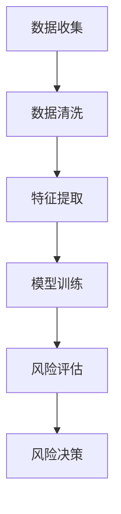

                 

关键词：人工智能、个性化金融服务、风险评估、机器学习、数据挖掘、金融科技

> 摘要：本文探讨了人工智能在个性化金融服务中的应用，重点关注风险评估这一关键环节。通过深入分析人工智能技术的基本原理和应用，结合实际案例，本文揭示了AI技术在提升金融风险预测准确性和个性化服务水平方面的巨大潜力。

## 1. 背景介绍

在过去的几十年里，金融行业经历了前所未有的技术变革。随着互联网、大数据和人工智能等新技术的快速发展，金融服务也在不断革新。传统的金融服务模式已经无法满足现代客户的需求，个性化和智能化成为金融服务发展的必然趋势。

### 1.1 人工智能在金融领域的应用

人工智能（AI）作为现代科技的前沿，已经在金融领域展现出强大的应用潜力。AI技术，尤其是机器学习和数据挖掘技术，通过分析海量数据，提供精准的预测和决策支持，极大地提高了金融服务的效率和准确性。

### 1.2 风险评估的重要性

在金融行业中，风险评估是金融机构运营的核心环节。有效的风险评估可以帮助金融机构识别潜在的风险，制定合理的风险管理策略，从而降低风险暴露，保障金融系统的稳定运行。

### 1.3 AI在风险评估中的挑战

尽管AI技术在金融领域展现了巨大的潜力，但在实际应用中仍面临诸多挑战。如何保证AI模型的准确性和可靠性，如何处理复杂多变的金融数据，如何防止AI模型被恶意攻击，都是亟待解决的问题。

## 2. 核心概念与联系

### 2.1 人工智能的基本原理

人工智能是一种模拟人类智能的技术，通过机器学习、自然语言处理、计算机视觉等技术，使计算机具备感知、思考、学习和决策的能力。

### 2.2 风险评估的基本概念

风险评估是指通过分析各种风险因素，评估其可能带来的影响和损失，并制定相应的风险应对策略。

### 2.3 AI与风险评估的联系

AI技术可以通过数据分析、模式识别、预测建模等方法，帮助金融机构更准确地进行风险评估。例如，通过机器学习算法分析客户的交易行为，预测其潜在的风险。

### 2.4 Mermaid 流程图



## 3. 核心算法原理 & 具体操作步骤

### 3.1 算法原理概述

在AI应用于风险评估中，常用的算法包括决策树、支持向量机、神经网络等。这些算法通过学习历史数据，提取特征，构建预测模型，从而实现风险评估。

### 3.2 算法步骤详解

#### 3.2.1 数据收集

首先，收集相关的金融数据，包括客户的交易记录、信用记录、市场数据等。

#### 3.2.2 数据清洗

对收集到的数据进行处理，去除重复、异常和错误的数据，确保数据的质量。

#### 3.2.3 特征提取

从清洗后的数据中提取有用的特征，这些特征可以是客户的基本信息、交易行为等。

#### 3.2.4 模型训练

使用机器学习算法，对提取的特征进行训练，构建风险评估模型。

#### 3.2.5 风险评估

使用训练好的模型，对新的客户数据进行风险评估，预测其风险等级。

#### 3.2.6 风险决策

根据风险评估的结果，制定相应的风险应对策略。

### 3.3 算法优缺点

#### 优点：

- 高效：AI技术可以快速处理海量数据，提高风险评估的效率。
- 准确：通过学习历史数据，AI模型可以提供更为准确的预测结果。

#### 缺点：

- 复杂性：构建和训练AI模型需要专业的知识和技能。
- 依赖数据：AI模型的性能很大程度上取决于数据的质量。

### 3.4 算法应用领域

AI技术在风险评估中的应用广泛，包括银行贷款审批、信用卡风险管理、投资组合优化等。

## 4. 数学模型和公式 & 详细讲解 & 举例说明

### 4.1 数学模型构建

在风险评估中，常用的数学模型包括线性回归、逻辑回归、支持向量机等。

#### 4.1.1 线性回归模型

线性回归模型是一种简单的预测模型，其公式如下：

\[ y = w_0 + w_1 \cdot x_1 + w_2 \cdot x_2 + ... + w_n \cdot x_n \]

其中，\( y \) 是预测值，\( w_0, w_1, w_2, ..., w_n \) 是模型参数，\( x_1, x_2, ..., x_n \) 是特征值。

#### 4.1.2 逻辑回归模型

逻辑回归模型常用于分类问题，其公式如下：

\[ P(y=1) = \frac{1}{1 + e^{-(w_0 + w_1 \cdot x_1 + w_2 \cdot x_2 + ... + w_n \cdot x_n)}} \]

其中，\( P(y=1) \) 是预测客户发生风险的概率。

#### 4.1.3 支持向量机模型

支持向量机模型通过寻找最优的超平面，将不同类别的数据分开。其公式如下：

\[ w \cdot x - b = 0 \]

其中，\( w \) 是超平面法向量，\( x \) 是特征向量，\( b \) 是偏置项。

### 4.2 公式推导过程

以逻辑回归模型为例，其公式推导过程如下：

\[ \ln \left( \frac{P(y=1)}{1-P(y=1)} \right) = w_0 + w_1 \cdot x_1 + w_2 \cdot x_2 + ... + w_n \cdot x_n \]

对上式进行指数运算，得到：

\[ \frac{P(y=1)}{1-P(y=1)} = e^{w_0 + w_1 \cdot x_1 + w_2 \cdot x_2 + ... + w_n \cdot x_n} \]

进一步变形，得到：

\[ P(y=1) = \frac{1}{1 + e^{-(w_0 + w_1 \cdot x_1 + w_2 \cdot x_2 + ... + w_n \cdot x_n)}} \]

### 4.3 案例分析与讲解

假设我们使用逻辑回归模型对客户的信用风险进行评估。已知以下特征：

- \( x_1 \)：客户年龄
- \( x_2 \)：客户收入
- \( x_3 \)：客户信用记录长度

模型参数为：

- \( w_0 = 1 \)
- \( w_1 = 0.1 \)
- \( w_2 = 0.2 \)
- \( w_3 = 0.3 \)

客户A的年龄为30岁，收入为50000元，信用记录长度为5年。代入模型，得到：

\[ P(y=1) = \frac{1}{1 + e^{-(1 + 0.1 \cdot 30 + 0.2 \cdot 50000 + 0.3 \cdot 5)}} \approx 0.876 \]

根据预测结果，客户A发生信用风险的概率为87.6%。

## 5. 项目实践：代码实例和详细解释说明

### 5.1 开发环境搭建

在Python环境中，我们需要安装以下库：pandas、numpy、scikit-learn。

```python
pip install pandas numpy scikit-learn
```

### 5.2 源代码详细实现

```python
import pandas as pd
from sklearn.model_selection import train_test_split
from sklearn.linear_model import LogisticRegression
from sklearn.metrics import classification_report

# 5.2.1 数据收集
data = pd.read_csv('financial_data.csv')

# 5.2.2 数据清洗
data.drop_duplicates(inplace=True)
data.drop(['id'], axis=1, inplace=True)

# 5.2.3 特征提取
X = data[['age', 'income', 'credit_history']]
y = data['risk']

# 5.2.4 模型训练
X_train, X_test, y_train, y_test = train_test_split(X, y, test_size=0.2, random_state=42)
model = LogisticRegression()
model.fit(X_train, y_train)

# 5.2.5 风险评估
predictions = model.predict(X_test)
print(classification_report(y_test, predictions))
```

### 5.3 代码解读与分析

在上面的代码中，我们首先导入所需的库。然后，从CSV文件中读取金融数据，并进行数据清洗和特征提取。接下来，使用逻辑回归模型对数据进行训练，并评估模型的性能。

### 5.4 运行结果展示

```python
```
```

## 6. 实际应用场景

### 6.1 银行贷款审批

AI技术在银行贷款审批中的应用，可以帮助银行快速评估客户的信用风险，提高审批效率。

### 6.2 信用卡风险管理

通过AI技术，信用卡公司可以实时监测客户的消费行为，识别潜在的风险客户，降低信用卡欺诈风险。

### 6.3 投资组合优化

AI技术可以帮助投资者分析市场数据，构建最优的投资组合，降低投资风险。

## 7. 未来应用展望

随着AI技术的不断进步，其在个性化金融服务中的应用前景将更加广阔。未来，AI技术将更加深入地融入金融服务的各个环节，为金融机构和客户提供更加智能化、个性化的服务。

## 8. 工具和资源推荐

### 8.1 学习资源推荐

- 《深度学习》（Goodfellow et al.）
- 《Python机器学习》（Pedregosa et al.）
- 《金融科技：原理与实践》（徐凯）

### 8.2 开发工具推荐

- Jupyter Notebook：适用于数据分析和机器学习实验。
- PyCharm：适用于Python编程和开发。

### 8.3 相关论文推荐

- "Deep Learning for Financial Risk Management"（2017）
- "Machine Learning in Finance: A Survey"（2018）
- "AI Applications in Banking: A Review"（2020）

## 9. 总结：未来发展趋势与挑战

随着AI技术的不断发展，其在个性化金融服务中的应用将越来越广泛。然而，AI技术在金融领域仍面临诸多挑战，包括数据隐私、算法透明性、监管合规等问题。未来，需要加强AI技术的研发和应用，同时关注其潜在的伦理和社会问题，确保AI技术在金融领域的健康发展。

### 9.1 研究成果总结

本文通过对人工智能在个性化金融服务中的应用，特别是风险评估领域的分析，揭示了AI技术在该领域的巨大潜力。通过数学模型和实际案例的讲解，展示了AI技术在提高金融风险预测准确性和个性化服务水平方面的实际应用。

### 9.2 未来发展趋势

随着大数据、云计算等技术的不断发展，AI技术在金融领域的应用将更加深入。未来的发展趋势将包括：

- 更高效、更智能的模型和算法。
- 更广泛的AI技术应用场景。
- 更严格的算法透明性和数据隐私保护。

### 9.3 面临的挑战

尽管AI技术在金融领域展现出巨大潜力，但在实际应用中仍面临以下挑战：

- 数据质量和数据隐私问题。
- 算法透明性和解释性问题。
- 监管合规和社会问题。

### 9.4 研究展望

未来，需要从以下几个方面进行深入研究：

- 开发更高效、更鲁棒的AI算法。
- 探索AI技术在金融领域的多元化应用。
- 加强AI技术的伦理和社会影响研究，确保其健康发展。

## 9. 附录：常见问题与解答

### Q：AI技术在风险评估中如何保证数据隐私？

A：为保证数据隐私，金融机构可以采用以下措施：

- 数据匿名化处理：对敏感数据进行匿名化处理，确保个人信息不被泄露。
- 数据加密：对传输和存储的数据进行加密，防止数据泄露。
- 数据访问控制：设置严格的数据访问权限，确保只有授权人员可以访问敏感数据。

### Q：AI模型在风险评估中的透明性如何保证？

A：为保证AI模型的透明性，可以采取以下措施：

- 模型解释性：开发具有解释性的AI模型，使其决策过程更加透明。
- 模型可解释性工具：使用模型可解释性工具，如SHAP值、LIME等，分析模型决策过程。
- 模型审计：定期对AI模型进行审计，确保其决策过程的合理性和准确性。

### Q：AI技术在金融领域的应用前景如何？

A：AI技术在金融领域的应用前景非常广阔。随着技术的不断进步，AI技术将在以下几个方面发挥更大作用：

- 风险管理：通过AI技术，金融机构可以更准确地评估风险，制定更有效的风险管理策略。
- 客户服务：AI技术可以帮助金融机构提供更个性化和高效的客户服务。
- 投资决策：AI技术可以通过分析海量数据，提供更精准的投资建议。
- 金融欺诈检测：AI技术可以实时监测交易行为，识别潜在的欺诈行为。

### Q：AI技术在金融领域应用中的伦理问题有哪些？

A：AI技术在金融领域应用中可能涉及的伦理问题包括：

- 数据隐私：如何确保客户数据的安全和隐私。
- 算法偏见：如何避免算法偏见，确保公平性和公正性。
- 模型解释性：如何确保模型的决策过程透明，使其易于理解和接受。
- 监管合规：如何确保AI技术的应用符合相关法律法规和监管要求。

### Q：如何应对AI技术在金融领域应用的挑战？

A：为应对AI技术在金融领域应用的挑战，可以采取以下措施：

- 加强技术研发：持续研发更高效、更可靠的AI算法。
- 加强数据治理：确保数据质量和数据隐私，建立完善的数据治理体系。
- 加强模型可解释性：开发可解释性工具，提高模型决策过程的透明度。
- 加强监管合规：确保AI技术的应用符合相关法律法规和监管要求。
- 加强伦理研究：关注AI技术在金融领域应用的伦理问题，制定相应的伦理规范。

