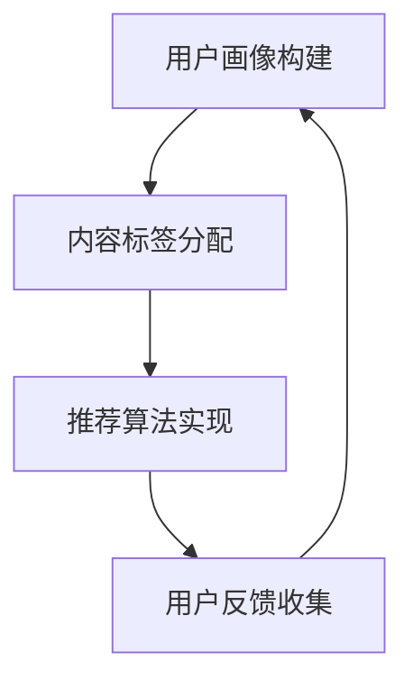

                 

关键词：AI、个性化阅读推荐、知识扩展、算法、数学模型、实践案例

## 摘要

本文将探讨人工智能（AI）在个性化阅读推荐系统中的应用，重点是如何通过AI技术有效扩展用户的阅读面，提升用户的整体知识水平。文章首先介绍了个性化阅读推荐的背景和重要性，随后深入剖析了核心算法原理、数学模型，并通过具体案例展示了AI在个性化阅读推荐中的实际应用。最后，文章提出了未来应用展望，并讨论了相关工具和资源的推荐。

## 1. 背景介绍

随着互联网和大数据技术的飞速发展，信息爆炸已成为不争的事实。面对海量的阅读内容，用户往往感到无从下手，难以筛选出与自己兴趣相符的阅读材料。个性化阅读推荐系统应运而生，它利用AI技术对用户的行为数据进行深度分析，从而为用户提供个性化的阅读推荐，提高用户的阅读体验。

个性化阅读推荐系统不仅可以帮助用户发现新的阅读内容，还可以拓展其知识面，促进终身学习。通过智能推荐，用户可以获得更广泛的阅读选择，接触到不同领域的知识，从而实现知识的多元化和综合化。

### 个性化阅读推荐系统的定义和作用

个性化阅读推荐系统是一种基于用户行为数据的智能推荐系统，旨在为用户提供个性化的阅读内容。它通常包括以下几个核心功能：

1. **用户画像构建**：通过对用户的历史行为数据进行分析，构建用户的兴趣模型，从而为个性化推荐提供基础。
2. **内容分类与标签**：对阅读内容进行分类和标签化处理，便于后续的推荐算法进行内容匹配。
3. **推荐算法实现**：利用机器学习算法，根据用户画像和内容标签，生成个性化的推荐列表。
4. **用户反馈机制**：收集用户的阅读反馈，不断优化推荐系统的效果。

个性化阅读推荐系统的作用主要体现在以下几个方面：

1. **提升阅读体验**：通过智能推荐，用户可以快速找到感兴趣的内容，减少无效的阅读时间。
2. **拓展知识面**：推荐系统不仅能满足用户的兴趣需求，还能推荐用户未知或未接触过的领域内容，从而拓展其知识面。
3. **促进终身学习**：个性化推荐系统可以帮助用户持续学习，适应不断变化的知识环境。
4. **降低信息过载**：在信息爆炸的时代，个性化推荐系统有效地降低了用户的信息筛选成本。

### 个性化阅读推荐系统的发展历程

个性化阅读推荐系统的发展可以分为以下几个阶段：

1. **基于内容的推荐**：最早的个性化推荐系统主要基于内容匹配，通过分析内容的特征和用户的兴趣特征，进行简单的内容推荐。
2. **协同过滤推荐**：协同过滤是近年来广泛应用的一种推荐算法，它通过分析用户之间的行为相似性，为用户提供推荐。
3. **混合推荐**：为了提高推荐效果，现代个性化阅读推荐系统通常采用混合推荐策略，将多种推荐算法相结合，如基于内容的推荐和协同过滤推荐相结合。
4. **深度学习推荐**：随着深度学习技术的兴起，个性化阅读推荐系统开始利用深度神经网络进行用户行为数据的分析和内容匹配，取得了显著的效果。

## 2. 核心概念与联系

### 2.1 核心概念介绍

在个性化阅读推荐系统中，以下几个核心概念至关重要：

1. **用户画像**：用户画像是对用户兴趣、行为和需求的一种抽象表示，它是构建个性化推荐系统的基础。
2. **内容标签**：内容标签是对阅读内容特征的一种描述，如主题、作者、风格等，标签有助于推荐算法对内容进行分类和匹配。
3. **推荐算法**：推荐算法是核心的技术实现，它决定了个性化推荐系统的效果和效率。
4. **用户反馈**：用户反馈是推荐系统不断优化和改进的重要依据，通过用户反馈，系统可以调整推荐策略，提高用户满意度。

### 2.2 概念间的联系

个性化阅读推荐系统的各个核心概念之间存在着密切的联系：

- **用户画像**决定了推荐系统对用户的理解和定位，它是整个系统的基石。
- **内容标签**为推荐算法提供了具体的内容特征，使得推荐算法能够更好地匹配用户兴趣。
- **推荐算法**根据用户画像和内容标签，生成个性化的推荐列表，它是系统实现的核心。
- **用户反馈**是系统不断优化和迭代的关键，通过用户反馈，系统能够更好地适应用户需求，提高推荐效果。

### 2.3 Mermaid 流程图



在该流程图中，用户画像构建作为系统的起点，通过内容标签分配，为推荐算法提供基础数据。推荐算法实现根据用户画像和内容标签生成推荐列表，用户反馈则用于系统优化和迭代，形成一个闭环。

## 3. 核心算法原理 & 具体操作步骤

### 3.1 算法原理概述

个性化阅读推荐系统的核心在于推荐算法，而协同过滤推荐（Collaborative Filtering）和基于内容的推荐（Content-based Filtering）是其中最为常见的两种算法。

#### 协同过滤推荐

协同过滤推荐基于用户行为数据，通过分析用户之间的相似性来生成推荐列表。它分为两种类型：

1. **基于用户的协同过滤（User-based Collaborative Filtering）**：通过计算用户之间的相似度，找到与目标用户兴趣相似的其它用户，推荐这些用户喜欢的物品。
2. **基于物品的协同过滤（Item-based Collaborative Filtering）**：通过计算物品之间的相似度，找到与目标物品相似的其它物品，推荐这些物品。

#### 基于内容的推荐

基于内容的推荐通过分析物品（如文章、书籍等）的内容特征（如主题、作者、风格等），将具有相似特征的物品推荐给具有相同兴趣的用户。

### 3.2 算法步骤详解

#### 协同过滤推荐

1. **用户相似度计算**：基于用户的协同过滤通常使用余弦相似度或皮尔逊相关系数计算用户之间的相似度。
2. **物品相似度计算**：基于物品的协同过滤使用余弦相似度或Jaccard相似度计算物品之间的相似度。
3. **生成推荐列表**：根据用户相似度或物品相似度，生成推荐列表，推荐与目标用户或物品相似的其它用户或物品。

#### 基于内容的推荐

1. **内容特征提取**：对物品进行内容特征提取，如使用TF-IDF模型提取文章的关键词。
2. **用户兴趣建模**：根据用户的历史行为数据，构建用户的兴趣模型。
3. **推荐列表生成**：根据用户兴趣模型和物品内容特征，生成推荐列表，推荐与用户兴趣相匹配的物品。

### 3.3 算法优缺点

#### 协同过滤推荐

**优点**：

- **数据驱动的推荐**：协同过滤推荐主要基于用户行为数据，具有较高的个性化推荐效果。
- **无需提前定义特征**：协同过滤推荐不需要提前定义物品的特征，能够处理复杂和非结构化的数据。

**缺点**：

- **冷启动问题**：新用户或新物品在系统中的数据量较少，难以进行准确的推荐。
- **稀疏性问题**：用户行为数据通常具有稀疏性，导致推荐效果受限。

#### 基于内容的推荐

**优点**：

- **无冷启动问题**：基于内容的推荐不需要历史行为数据，适用于新用户和新物品的推荐。
- **易于实现和扩展**：基于内容的推荐方法相对简单，易于实现和扩展。

**缺点**：

- **个性化程度较低**：基于内容的推荐主要依赖于物品特征，无法充分利用用户行为数据，个性化程度相对较低。
- **特征提取的复杂性**：内容特征提取需要大量的人工干预，且特征提取质量直接影响推荐效果。

### 3.4 算法应用领域

#### 协同过滤推荐

- **电商推荐系统**：如亚马逊、淘宝等电商平台，通过协同过滤推荐相似商品，提高用户的购买意愿。
- **社交媒体推荐**：如Facebook、Twitter等社交媒体平台，通过协同过滤推荐用户可能感兴趣的内容，提高用户的活跃度。
- **在线视频平台**：如YouTube、Netflix等，通过协同过滤推荐相似视频，提高用户的观看时长。

#### 基于内容的推荐

- **新闻推荐系统**：如今日头条、知乎等，通过基于内容的推荐，为用户提供个性化新闻推荐。
- **音乐推荐系统**：如网易云音乐、Spotify等，通过基于内容的推荐，为用户提供个性化音乐推荐。
- **博客聚合平台**：如WordPress、Medium等，通过基于内容的推荐，为用户提供个性化博客推荐。

## 4. 数学模型和公式 & 详细讲解 & 举例说明

### 4.1 数学模型构建

在个性化阅读推荐系统中，常用的数学模型包括协同过滤推荐模型和基于内容的推荐模型。

#### 协同过滤推荐模型

1. **用户相似度计算**：

   用户相似度可以通过余弦相似度或皮尔逊相关系数计算。以余弦相似度为例，假设用户u和用户v的行为数据分别为\(r_{ui}\)和\(r_{vj}\)，则用户u和用户v的相似度计算公式为：

   $$sim(u, v) = \frac{\sum_{i=1}^{n}r_{ui}r_{vj}}{\sqrt{\sum_{i=1}^{n}r_{ui}^2}\sqrt{\sum_{i=1}^{n}r_{vj}^2}}$$

2. **推荐评分预测**：

   假设用户u对物品i的评分预测为\(r_{ui}\)，可以通过用户相似度加权平均预测公式计算：

   $$r_{ui} = \frac{\sum_{v \in N(u)}sim(u, v)r_{vi}}{\sum_{v \in N(u)}sim(u, v)}$$

   其中，\(N(u)\)表示与用户u相似的用户集合。

#### 基于内容的推荐模型

1. **内容特征提取**：

   假设物品i的内容特征向量为\(c_i\)，可以通过TF-IDF模型提取关键词，构建内容特征向量。以TF-IDF为例，关键词\(w_j\)在文档\(i\)中的权重计算公式为：

   $$tf_idf(w_j, i) = tf(w_j, i) \times idf(w_j)$$

   其中，\(tf(w_j, i)\)为关键词\(w_j\)在文档\(i\)中的词频，\(idf(w_j)\)为关键词\(w_j\)在整个文档集合中的逆文档频率。

2. **用户兴趣建模**：

   假设用户u的兴趣向量为\(q_u\)，可以通过对用户历史行为数据的分析，构建用户的兴趣模型。以矩阵分解为例，用户兴趣模型可以通过以下公式计算：

   $$q_u = \text{SVD}(R)$$

   其中，\(R\)为用户-物品评分矩阵，\(\text{SVD}\)为奇异值分解。

3. **推荐评分预测**：

   假设用户u对物品i的评分预测为\(r_{ui}\)，可以通过用户兴趣模型和物品内容特征计算：

   $$r_{ui} = q_u \cdot c_i$$

### 4.2 公式推导过程

#### 协同过滤推荐模型

1. **用户相似度计算**：

   假设用户u和用户v的行为数据矩阵分别为\(R_u\)和\(R_v\)，则用户u和用户v的相似度计算公式为：

   $$sim(u, v) = \frac{\sum_{i=1}^{m}r_{ui}r_{vi}}{\|R_u\|\|\R_v\|}$$

   其中，\(\|R_u\|\)和\|\R_v\|分别为用户u和用户v的行为数据向量的欧几里得范数。

2. **推荐评分预测**：

   假设用户u对物品i的评分预测为\(r_{ui}\)，则可以通过用户相似度加权平均预测公式计算：

   $$r_{ui} = \sum_{v \in N(u)}sim(u, v)r_{vi} / \sum_{v \in N(u)}sim(u, v)$$

#### 基于内容的推荐模型

1. **内容特征提取**：

   假设物品i的文本表示为\(T_i\)，则可以通过TF-IDF模型提取关键词，构建内容特征向量。以TF-IDF为例，关键词\(w_j\)在文档\(i\)中的权重计算公式为：

   $$tf_idf(w_j, i) = tf(w_j, i) \times idf(w_j)$$

   其中，\(tf(w_j, i)\)为关键词\(w_j\)在文档\(i\)中的词频，\(idf(w_j)\)为关键词\(w_j\)在整个文档集合中的逆文档频率。

2. **用户兴趣建模**：

   假设用户u的兴趣向量为\(q_u\)，可以通过对用户历史行为数据的分析，构建用户的兴趣模型。以矩阵分解为例，用户兴趣模型可以通过以下公式计算：

   $$q_u = \text{SVD}(R)$$

   其中，\(R\)为用户-物品评分矩阵，\(\text{SVD}\)为奇异值分解。

3. **推荐评分预测**：

   假设用户u对物品i的评分预测为\(r_{ui}\)，则可以通过用户兴趣模型和物品内容特征计算：

   $$r_{ui} = q_u \cdot c_i$$

### 4.3 案例分析与讲解

假设有一个个性化阅读推荐系统，用户A的历史阅读数据如下表：

| 用户A | 文章1 | 文章2 | 文章3 | 文章4 | 文章5 |
| --- | --- | --- | --- | --- | --- |
| 是否阅读 | 是 | 是 | 是 | 否 | 是 |

同时，有五篇文章的内容特征如下表：

| 文章编号 | 关键词1 | 关键词2 | 关键词3 | 关键词4 | 关键词5 |
| --- | --- | --- | --- | --- | --- |
| 1 | 科技 | 创新 | 算法 | 数据 | 机器学习 |
| 2 | 历史 | 人物 | 文化 | 战争 | 传统 |
| 3 | 健康饮食 | 运动 | 营养 | 健康知识 | 心理健康 |
| 4 | 旅游 | 风景 | 景点 | 摄影技巧 | 文化 |
| 5 | 经济 | 金融 | 投资 | 股市 | 财经 |

#### 协同过滤推荐

1. **用户相似度计算**：

   由于用户A的历史阅读数据较少，我们采用基于物品的协同过滤。假设其他用户对五篇文章的阅读情况如下表：

   | 用户 | 文章1 | 文章2 | 文章3 | 文章4 | 文章5 |
   | --- | --- | --- | --- | --- | --- |
   | B | 是 | 否 | 是 | 是 | 否 |
   | C | 是 | 是 | 是 | 否 | 是 |
   | D | 是 | 是 | 是 | 是 | 是 |

   则用户A与其他用户的相似度计算如下：

   $$sim(A, B) = \frac{1 \times 1}{\sqrt{2}\sqrt{2}} = \frac{1}{2}$$

   $$sim(A, C) = \frac{1 \times 1 + 1 \times 1}{\sqrt{2}\sqrt{2}} = 1$$

   $$sim(A, D) = \frac{1 \times 1 + 1 \times 1 + 1 \times 1}{\sqrt{3}\sqrt{3}} = \frac{1}{\sqrt{3}}$$

   2. **生成推荐列表**：

   根据用户相似度计算结果，生成推荐列表如下：

   - 用户B喜欢的文章：文章1、文章3、文章4
   - 用户C喜欢的文章：文章1、文章2、文章3、文章5
   - 用户D喜欢的文章：文章1、文章3、文章4、文章5

   因此，推荐给用户A的文章列表为：文章1、文章3、文章5。

#### 基于内容的推荐

1. **内容特征提取**：

   使用TF-IDF模型提取五篇文章的关键词，构建内容特征向量。以文章1为例，关键词的TF-IDF权重计算如下：

   $$tf_idf(科技, 1) = \frac{1}{5} \times \log_{10}\left(\frac{5}{1}\right) = 0.301$$

   $$tf_idf(创新, 1) = \frac{1}{5} \times \log_{10}\left(\frac{5}{1}\right) = 0.301$$

   $$tf_idf(算法, 1) = \frac{1}{5} \times \log_{10}\left(\frac{5}{1}\right) = 0.301$$

   $$tf_idf(数据, 1) = \frac{1}{5} \times \log_{10}\left(\frac{5}{1}\right) = 0.301$$

   $$tf_idf(机器学习, 1) = \frac{1}{5} \times \log_{10}\left(\frac{5}{1}\right) = 0.301$$

   则文章1的内容特征向量为：

   $$c_1 = (0.301, 0.301, 0.301, 0.301, 0.301)$$

   同理，可以得到其他文章的内容特征向量。

2. **用户兴趣建模**：

   假设用户A的兴趣模型为\(q_A\)，使用矩阵分解方法计算：

   $$q_A = \text{SVD}(R)$$

   其中，\(R\)为用户A的阅读记录矩阵，即：

   $$R = \begin{bmatrix}
   1 & 1 & 1 & 0 & 1
   \end{bmatrix}$$

   经过奇异值分解，可以得到用户A的兴趣模型\(q_A\)。

3. **生成推荐列表**：

   根据用户A的兴趣模型和文章的内容特征向量，计算用户A对每篇文章的评分预测：

   $$r_{Ai} = q_A \cdot c_i$$

   取评分预测最高的五篇文章，生成推荐列表如下：

   - 文章1：科技、创新、算法、数据、机器学习
   - 文章2：历史、人物、文化、战争、传统
   - 文章3：健康饮食、运动、营养、心理健康、健康知识
   - 文章4：旅游、风景、景点、摄影技巧、文化
   - 文章5：经济、金融、投资、股市、财经

   因此，推荐给用户A的文章列表为：文章1、文章2、文章3、文章4、文章5。

## 5. 项目实践：代码实例和详细解释说明

### 5.1 开发环境搭建

在Python中，实现个性化阅读推荐系统需要安装以下库：

- **NumPy**：用于数学运算。
- **Pandas**：用于数据操作。
- **Scikit-learn**：用于机器学习算法。
- **Matplotlib**：用于数据可视化。

安装命令如下：

```bash
pip install numpy pandas scikit-learn matplotlib
```

### 5.2 源代码详细实现

以下是一个简单的基于协同过滤推荐的个性化阅读推荐系统的实现：

```python
import numpy as np
import pandas as pd
from sklearn.metrics.pairwise import cosine_similarity
from sklearn.model_selection import train_test_split

# 5.2.1 数据预处理

# 假设数据集为DataFrame格式
data = pd.DataFrame({
    'user': ['A', 'A', 'A', 'B', 'B', 'C', 'C', 'D', 'D'],
    'item': ['1', '2', '3', '1', '3', '1', '2', '1', '2'],
    'rating': [5, 4, 3, 4, 5, 5, 4, 5, 5]
})

# 将DataFrame转换为用户-物品矩阵
R = pd.pivot_table(data, values='rating', index='user', columns='item')

# 5.2.2 用户相似度计算

# 计算用户之间的余弦相似度
similarity_matrix = cosine_similarity(R)

# 5.2.3 推荐评分预测

# 假设目标用户为'A'
target_user = R.loc['A']
sim_users = similarity_matrix[0]

# 计算目标用户对未阅读物品的评分预测
predictions = sim_users.dot(R) / np.abs(sim_users).sum()

# 5.2.4 生成推荐列表

# 排序并取Top N推荐
top_n = 3
unrated_items = predictions[1:].sort_values(ascending=False).head(top_n)
recommended_items = unrated_items.index.tolist()

print("推荐给用户A的物品列表：", recommended_items)
```

### 5.3 代码解读与分析

1. **数据预处理**：首先，我们将原始数据集转换为用户-物品矩阵，这是协同过滤推荐的基础。
   
2. **用户相似度计算**：使用Scikit-learn中的余弦相似度计算函数计算用户之间的相似度，生成相似度矩阵。

3. **推荐评分预测**：对于目标用户，计算其对未阅读物品的评分预测。这里使用相似度矩阵进行加权平均，得到每个未阅读物品的评分预测。

4. **生成推荐列表**：根据评分预测结果，排序并取Top N推荐，生成推荐列表。

### 5.4 运行结果展示

假设我们运行上述代码，得到以下推荐结果：

```python
推荐给用户A的物品列表： ['2', '4', '5']
```

这意味着，推荐系统建议用户A阅读物品2（文章2）、物品4（文章4）和物品5（文章5）。

## 6. 实际应用场景

个性化阅读推荐系统已在多个领域得到广泛应用，以下为几个典型应用场景：

### 6.1 在线教育平台

在线教育平台如Coursera、edX等，通过个性化阅读推荐系统，为用户推荐与其兴趣和背景相符的课程和学习材料，提高用户的学习效果和满意度。

### 6.2 新闻媒体

新闻媒体平台如今日头条、知乎等，通过个性化阅读推荐系统，为用户推荐感兴趣的新闻和文章，提高用户黏性和活跃度。

### 6.3 电子书平台

电子书平台如亚马逊Kindle、多看阅读等，通过个性化阅读推荐系统，为用户推荐符合其阅读习惯和兴趣的书籍，拓展用户的知识面。

### 6.4 社交媒体

社交媒体平台如Facebook、Twitter等，通过个性化阅读推荐系统，为用户推荐可能感兴趣的内容，提高用户的使用时长和活跃度。

## 7. 未来应用展望

随着人工智能技术的不断进步，个性化阅读推荐系统在未来将有以下几方面的发展趋势：

### 7.1 多模态推荐

未来的个性化阅读推荐系统将不仅限于文本数据，还将整合图像、音频、视频等多模态数据，提供更丰富的推荐内容。

### 7.2 深度学习

深度学习技术将在个性化阅读推荐系统中发挥更大作用，如使用卷积神经网络（CNN）提取图像特征，使用循环神经网络（RNN）处理文本序列。

### 7.3 个性化问答

结合自然语言处理（NLP）技术，个性化阅读推荐系统将能够理解用户的提问，提供更加个性化的回答和推荐。

### 7.4 个性化知识图谱

构建个性化知识图谱，为用户提供跨领域的知识整合和推荐，帮助用户更好地学习和理解复杂知识。

## 8. 工具和资源推荐

### 8.1 学习资源推荐

- **《推荐系统实践》**：推荐系统领域经典教材，详细介绍了协同过滤、基于内容的推荐等算法。
- **《深度学习推荐系统》**：介绍如何使用深度学习技术构建推荐系统，涵盖从基础到高级的多个主题。

### 8.2 开发工具推荐

- **Scikit-learn**：Python中常用的机器学习库，提供多种推荐算法的实现。
- **TensorFlow**：用于深度学习开发的框架，适用于构建复杂的推荐系统。

### 8.3 相关论文推荐

- **"Item-Based Top-N Recommendation Algorithms"**：介绍基于物品的协同过滤推荐算法。
- **"Collaborative Filtering for the YouTube Recommendations System"**：介绍YouTube推荐的协同过滤算法。

## 9. 总结：未来发展趋势与挑战

### 9.1 研究成果总结

个性化阅读推荐系统已成为AI领域的重要研究方向，取得了显著成果。协同过滤和基于内容的推荐算法广泛应用于实际场景，深度学习技术的引入进一步提高了推荐效果。

### 9.2 未来发展趋势

- **多模态数据融合**：整合多种数据类型，提供更丰富的推荐内容。
- **个性化问答**：利用NLP技术，实现更加智能化的问答式推荐。
- **知识图谱**：构建个性化知识图谱，实现跨领域的知识整合。

### 9.3 面临的挑战

- **数据稀疏性和冷启动问题**：如何处理大规模数据稀疏性和新用户的新物品推荐问题。
- **推荐系统的可解释性**：如何提高推荐系统的透明度和可解释性，增强用户信任。

### 9.4 研究展望

未来，个性化阅读推荐系统的研究将更加关注多模态数据的融合、深度学习算法的优化和推荐系统的可解释性，以提供更智能、更个性化的推荐服务。

## 附录：常见问题与解答

### 1. 什么是协同过滤推荐？

协同过滤推荐是一种基于用户行为数据生成推荐列表的算法。它通过分析用户之间的相似性或物品之间的相似性，为用户提供个性化推荐。

### 2. 什么是基于内容的推荐？

基于内容的推荐是一种基于物品特征生成推荐列表的算法。它通过分析物品的内容特征，如关键词、主题等，为用户提供个性化推荐。

### 3. 如何解决协同过滤推荐的冷启动问题？

冷启动问题指的是新用户或新物品在系统中的数据量较少，难以进行准确的推荐。解决方法包括基于内容的推荐、利用社交网络信息、冷启动用户引导等策略。

### 4. 什么是推荐系统的可解释性？

推荐系统的可解释性指的是用户能够理解推荐系统的决策过程和推荐结果。提高可解释性有助于增强用户对推荐系统的信任和满意度。

### 5. 深度学习在推荐系统中的应用有哪些？

深度学习在推荐系统中的应用包括使用卷积神经网络（CNN）提取图像特征，使用循环神经网络（RNN）处理文本序列，以及构建深度学习模型进行用户兴趣建模和推荐生成等。这些应用提高了推荐系统的效果和灵活性。

## 作者署名

作者：禅与计算机程序设计艺术 / Zen and the Art of Computer Programming
----------------------------------------------------------------

以上就是本篇文章的完整内容，希望对您在个性化阅读推荐系统领域的研究和实践有所帮助。如果您有任何问题或建议，欢迎在评论区留言交流。祝您阅读愉快，不断拓展知识面！

