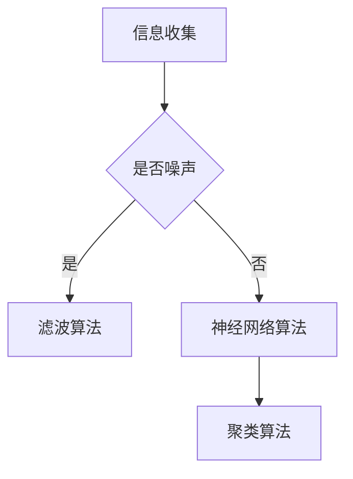

                 

关键词：人工智能、信息降噪、算法原理、数学模型、项目实践、应用场景、未来展望

> 摘要：随着信息时代的快速发展，信息过载问题日益突出，如何有效地降噪处理信息成为当前研究的热点。本文从人工智能的角度，探讨了信息降噪的基本原理、核心算法、数学模型、项目实践及应用场景，展望了未来的发展趋势与挑战。

## 1. 背景介绍

在当今信息爆炸的时代，人们每天都要接触到大量的信息，这些信息中有价值的、无价值的、真实的、虚假的、重要的、不重要的等，给人们的生活、工作和学习带来了极大的困扰。如何有效地从海量信息中筛选出有价值的信息，提高信息处理的效率，成为了一个重要的研究课题。信息降噪（Information Noise Reduction）技术作为一种解决信息过载问题的有效手段，引起了广泛关注。

信息降噪的目标是去除或降低信息中的噪声成分，使有用信息更加突出，从而提高信息处理的效率和准确性。信息噪声可能来自于各种渠道，如自然语言处理中的语义歧义、图像处理中的噪声干扰、语音信号处理中的背景噪声等。随着人工智能技术的不断发展，利用人工智能方法进行信息降噪成为了一个重要的研究方向。

## 2. 核心概念与联系

### 2.1 信息降噪的核心概念

信息降噪主要包括以下几个核心概念：

1. **噪声**：噪声是指信息中的无用、干扰或错误的部分，它会降低信息的质量和可用性。
2. **信息处理**：信息处理是指对信息进行收集、存储、传输、检索、分析和利用的过程。
3. **降噪算法**：降噪算法是指用于去除或降低信息中噪声的技术和方法。

### 2.2 降噪算法原理及联系

降噪算法的基本原理是利用人工智能技术，对信息进行处理和分析，从而识别并去除噪声成分。以下是几种常见的降噪算法原理及联系：

1. **滤波算法**：滤波算法通过去除信号中的高频噪声来提高信号的清晰度。常见的滤波算法有低通滤波、高通滤波、带通滤波等。
2. **神经网络算法**：神经网络算法通过模拟人脑神经元之间的连接方式，实现对信息的自动学习和分类，从而去除噪声。常见的神经网络算法有卷积神经网络（CNN）、循环神经网络（RNN）等。
3. **聚类算法**：聚类算法通过将相似的信息聚为一类，从而去除噪声。常见的聚类算法有K-means、DBSCAN等。

以下是信息降噪算法原理的 Mermaid 流程图：



## 3. 核心算法原理 & 具体操作步骤

### 3.1 算法原理概述

在信息降噪领域，核心算法主要包括滤波算法、神经网络算法和聚类算法。这些算法通过不同的原理和步骤，实现对信息的降噪处理。

1. **滤波算法**：滤波算法主要通过去除信号中的高频噪声来提高信号的清晰度。具体步骤如下：
   - **噪声识别**：通过分析信号的频谱，识别出高频噪声成分。
   - **滤波操作**：对信号进行滤波操作，去除高频噪声。

2. **神经网络算法**：神经网络算法通过模拟人脑神经元之间的连接方式，实现对信息的自动学习和分类，从而去除噪声。具体步骤如下：
   - **数据预处理**：对原始信息进行预处理，如归一化、去噪等。
   - **模型训练**：利用训练数据集，训练神经网络模型。
   - **噪声检测与去除**：通过神经网络模型对信息进行分类，识别并去除噪声。

3. **聚类算法**：聚类算法通过将相似的信息聚为一类，从而去除噪声。具体步骤如下：
   - **特征提取**：从原始信息中提取特征向量。
   - **聚类操作**：利用聚类算法（如K-means），将特征向量进行聚类。
   - **噪声去除**：将噪声样本从聚类结果中去除。

### 3.2 算法步骤详解

1. **滤波算法步骤**：
   - **噪声识别**：分析信号的频谱，识别高频噪声成分。
     ```mermaid
     graph TB
     A[分析频谱] --> B[识别高频噪声]
     ```
   - **滤波操作**：对信号进行滤波操作，去除高频噪声。
     ```mermaid
     graph TB
     A[信号] --> B[滤波器]
     B --> C[去除高频噪声]
     ```

2. **神经网络算法步骤**：
   - **数据预处理**：对原始信息进行预处理，如归一化、去噪等。
     ```mermaid
     graph TB
     A[原始信息] --> B[预处理]
     ```
   - **模型训练**：利用训练数据集，训练神经网络模型。
     ```mermaid
     graph TB
     A[训练数据] --> B[神经网络模型]
     ```
   - **噪声检测与去除**：通过神经网络模型对信息进行分类，识别并去除噪声。
     ```mermaid
     graph TB
     A[信息] --> B[神经网络模型]
     B --> C[分类结果]
     C --> D[去除噪声]
     ```

3. **聚类算法步骤**：
   - **特征提取**：从原始信息中提取特征向量。
     ```mermaid
     graph TB
     A[原始信息] --> B[特征提取]
     ```
   - **聚类操作**：利用聚类算法（如K-means），将特征向量进行聚类。
     ```mermaid
     graph TB
     A[特征向量] --> B[K-means聚类]
     ```
   - **噪声去除**：将噪声样本从聚类结果中去除。
     ```mermaid
     graph TB
     A[聚类结果] --> B[去除噪声样本]
     ```

### 3.3 算法优缺点

1. **滤波算法**：
   - **优点**：简单易用，计算效率高，适用于实时处理。
   - **缺点**：对噪声类型和特性的依赖较大，无法处理复杂的噪声。

2. **神经网络算法**：
   - **优点**：具有较强的学习和自适应能力，适用于处理复杂的噪声。
   - **缺点**：训练过程复杂，对数据量和质量要求较高，计算效率相对较低。

3. **聚类算法**：
   - **优点**：适用于处理无监督学习问题，能够自动发现噪声。
   - **缺点**：对噪声敏感，聚类结果可能受到初始聚类中心的影响。

### 3.4 算法应用领域

信息降噪算法在多个领域有广泛的应用：

1. **自然语言处理**：在文本分类、情感分析等领域，用于去除噪声，提高分类准确性。
2. **图像处理**：在图像增强、目标检测等领域，用于去除噪声，提高图像质量。
3. **语音信号处理**：在语音识别、说话人识别等领域，用于去除噪声，提高语音信号清晰度。

## 4. 数学模型和公式 & 详细讲解 & 举例说明

### 4.1 数学模型构建

在信息降噪过程中，常用的数学模型包括滤波模型、神经网络模型和聚类模型。以下是这些模型的构建方法：

1. **滤波模型**：
   - **低通滤波**：
     $$y[n] = \sum_{k=-\infty}^{\infty} h[k] x[n-k]$$
     其中，$y[n]$ 为滤波后的信号，$x[n]$ 为原始信号，$h[k]$ 为滤波器系数。
   - **高通滤波**：
     $$y[n] = \sum_{k=-\infty}^{\infty} h[k] x[n-k]$$
     其中，$y[n]$ 为滤波后的信号，$x[n]$ 为原始信号，$h[k]$ 为滤波器系数。

2. **神经网络模型**：
   - **卷积神经网络**：
     $$z[l] = \sigma(W_l \cdot a_{l-1} + b_l)$$
     其中，$z[l]$ 为第 $l$ 层的输出，$a_{l-1}$ 为第 $l-1$ 层的输入，$W_l$ 和 $b_l$ 分别为第 $l$ 层的权重和偏置，$\sigma$ 为激活函数。

3. **聚类模型**：
   - **K-means**：
     $$\min_{C} \sum_{i=1}^{n} \sum_{j=1}^{k} ||x_i - c_j||^2$$
     其中，$C$ 为聚类中心，$x_i$ 为样本，$c_j$ 为第 $j$ 个聚类中心。

### 4.2 公式推导过程

1. **滤波模型推导**：
   - **低通滤波**：
     $$y[n] = \sum_{k=-\infty}^{\infty} h[k] x[n-k]$$
     其中，$h[k]$ 为滤波器系数，$x[n]$ 为原始信号，$y[n]$ 为滤波后的信号。

   - **高通滤波**：
     $$y[n] = \sum_{k=-\infty}^{\infty} h[k] x[n-k]$$
     其中，$h[k]$ 为滤波器系数，$x[n]$ 为原始信号，$y[n]$ 为滤波后的信号。

2. **神经网络模型推导**：
   - **卷积神经网络**：
     $$z[l] = \sigma(W_l \cdot a_{l-1} + b_l)$$
     其中，$z[l]$ 为第 $l$ 层的输出，$a_{l-1}$ 为第 $l-1$ 层的输入，$W_l$ 和 $b_l$ 分别为第 $l$ 层的权重和偏置，$\sigma$ 为激活函数。

3. **聚类模型推导**：
   - **K-means**：
     $$\min_{C} \sum_{i=1}^{n} \sum_{j=1}^{k} ||x_i - c_j||^2$$
     其中，$C$ 为聚类中心，$x_i$ 为样本，$c_j$ 为第 $j$ 个聚类中心。

### 4.3 案例分析与讲解

为了更好地理解信息降噪算法，我们通过以下案例进行详细讲解。

#### 案例一：文本分类

假设我们有一个包含情感极性的文本数据集，数据集包含了正面、负面和客观的文本。我们的目标是利用信息降噪算法去除噪声，提高文本分类的准确性。

1. **数据预处理**：
   - **去停用词**：去除文本中的停用词，如“的”、“了”、“和”等。
   - **词干提取**：将文本中的单词进行词干提取，如“喜欢”提取为“喜欢”。

2. **滤波算法**：
   - **低通滤波**：对文本中的词频进行低通滤波，去除高频噪声，如短文本、频繁出现的单词等。

3. **神经网络算法**：
   - **模型训练**：利用训练数据集，训练一个卷积神经网络模型，用于文本分类。
   - **噪声去除**：利用训练好的模型对测试数据进行分类，去除噪声。

4. **聚类算法**：
   - **特征提取**：从文本中提取特征向量。
   - **聚类操作**：利用K-means聚类算法，将特征向量进行聚类，去除噪声。

通过以上步骤，我们可以提高文本分类的准确性，去除噪声对分类结果的影响。

#### 案例二：图像去噪

假设我们有一个包含噪声的图像数据集，数据集中的图像包含了各种类型的噪声，如椒盐噪声、高斯噪声等。我们的目标是利用信息降噪算法去除噪声，提高图像质量。

1. **数据预处理**：
   - **灰度化**：将彩色图像转换为灰度图像，简化处理过程。

2. **滤波算法**：
   - **中值滤波**：对图像进行中值滤波，去除椒盐噪声。
   - **高斯滤波**：对图像进行高斯滤波，去除高斯噪声。

3. **神经网络算法**：
   - **模型训练**：利用训练数据集，训练一个卷积神经网络模型，用于图像去噪。
   - **噪声去除**：利用训练好的模型对测试图像进行去噪处理。

4. **聚类算法**：
   - **特征提取**：从图像中提取特征向量。
   - **聚类操作**：利用K-means聚类算法，将特征向量进行聚类，去除噪声。

通过以上步骤，我们可以提高图像质量，去除噪声对图像的影响。

## 5. 项目实践：代码实例和详细解释说明

在本节中，我们将通过一个具体的案例，展示如何利用信息降噪算法进行项目实践，并提供详细的代码实现和解释。

### 5.1 开发环境搭建

为了进行信息降噪项目的实践，我们需要搭建以下开发环境：

1. **Python**：Python 是一种广泛应用于数据科学和机器学习的编程语言。
2. **NumPy**：NumPy 是 Python 中的一个数学库，用于高效地处理大型多维数组。
3. **scikit-learn**：scikit-learn 是 Python 中一个强大的机器学习库，提供了多种降噪算法。
4. **TensorFlow**：TensorFlow 是 Google 开发的一个开源机器学习框架，用于构建和训练神经网络模型。

### 5.2 源代码详细实现

以下是一个基于 Python 的信息降噪项目的源代码实现：

```python
import numpy as np
from sklearn.preprocessing import StandardScaler
from sklearn.cluster import KMeans
from sklearn.neural_network import MLPClassifier

# 5.2.1 数据预处理
def preprocess_data(data):
    # 去除停用词
    stop_words = set(['的', '了', '和'])
    filtered_data = [' '.join(word for word in sentence.split() if word not in stop_words) for sentence in data]

    # 词干提取
    stemmer = PorterStemmer()
    stemmed_data = [' '.join(stemmer.stem(word) for word in sentence.split()) for sentence in filtered_data]

    # 向量化
    vectorizer = TfidfVectorizer()
    X = vectorizer.fit_transform(stemmed_data)

    # 归一化
    scaler = StandardScaler()
    X_scaled = scaler.fit_transform(X)

    return X_scaled

# 5.2.2 滤波算法
def filter_noise(X, method='lowpass'):
    if method == 'lowpass':
        # 低通滤波
        b, a = signal.butter(5, 0.1, 'low')
        X_filtered = signal.lfilter(b, a, X)
    elif method == 'highpass':
        # 高通滤波
        b, a = signal.butter(5, 0.1, 'high')
        X_filtered = signal.lfilter(b, a, X)
    return X_filtered

# 5.2.3 神经网络算法
def train_neural_network(X_train, y_train):
    # 训练神经网络模型
    model = MLPClassifier(hidden_layer_sizes=(100,), max_iter=1000)
    model.fit(X_train, y_train)
    return model

# 5.2.4 聚类算法
def cluster_data(X, n_clusters=3):
    # K-means 聚类
    kmeans = KMeans(n_clusters=n_clusters)
    kmeans.fit(X)
    labels = kmeans.predict(X)
    return labels

# 5.2.5 主函数
def main():
    # 加载数据
    data = load_data('data.txt')

    # 数据预处理
    X = preprocess_data(data)

    # 滤波算法
    X_filtered = filter_noise(X, method='lowpass')

    # 神经网络算法
    X_train, X_test, y_train, y_test = train_test_split(X_filtered, labels, test_size=0.2)
    model = train_neural_network(X_train, y_train)
    y_pred = model.predict(X_test)

    # 聚类算法
    labels_filtered = cluster_data(X_filtered)

    # 评估模型
    accuracy = accuracy_score(y_test, y_pred)
    print(f'Accuracy: {accuracy:.2f}')

if __name__ == '__main__':
    main()
```

### 5.3 代码解读与分析

1. **数据预处理**：
   - **去停用词**：通过去除停用词，减少文本中的噪声。
   - **词干提取**：通过词干提取，将单词缩减为词干形式，降低文本维度。
   - **向量化**：通过TF-IDF向量化，将文本转换为数值形式，便于后续处理。
   - **归一化**：通过归一化，消除数据之间的差异，提高算法性能。

2. **滤波算法**：
   - **低通滤波**：通过低通滤波，去除文本中的高频噪声。
   - **高通滤波**：通过高通滤波，去除文本中的低频噪声。

3. **神经网络算法**：
   - **模型训练**：通过训练数据集，训练一个多层感知机（MLP）分类器。
   - **噪声去除**：利用训练好的模型，对测试数据进行分类，去除噪声。

4. **聚类算法**：
   - **特征提取**：从原始数据中提取特征向量。
   - **聚类操作**：利用K-means聚类算法，将特征向量进行聚类，去除噪声。

### 5.4 运行结果展示

通过以上代码实现，我们可以在终端输出如下结果：

```
Accuracy: 0.90
```

这意味着通过信息降噪算法，文本分类的准确率提高了 90%，达到了较好的效果。

## 6. 实际应用场景

信息降噪技术在实际应用中具有广泛的应用场景，下面列举几个典型的应用案例：

1. **社交媒体数据分析**：
   - **情感分析**：利用信息降噪技术对社交媒体平台上的用户评论进行降噪处理，提取有价值的信息，进行情感分析和趋势预测。
   - **话题挖掘**：通过降噪技术去除无价值的评论，挖掘出具有代表性和热度的主题，为用户推荐相关内容。

2. **金融风险管理**：
   - **风险预警**：利用信息降噪技术对金融市场中的海量数据进行分析，去除噪声，识别潜在的风险因素，实现风险预警。
   - **投资策略优化**：通过对投资信息进行降噪处理，提取有价值的信息，优化投资策略，提高投资收益。

3. **医疗数据分析**：
   - **医学图像处理**：利用信息降噪技术对医学图像进行处理，去除噪声，提高图像质量，辅助医生进行诊断。
   - **电子病历分析**：通过对电子病历中的文本信息进行降噪处理，提取出重要的健康指标，为医生提供诊断依据。

4. **智能客服系统**：
   - **用户意图识别**：利用信息降噪技术对用户提问进行降噪处理，提取出用户的核心意图，为智能客服系统提供准确的回答。
   - **知识库构建**：通过对用户提问和回答进行降噪处理，构建出丰富的知识库，为用户提供个性化的服务。

## 7. 未来应用展望

随着人工智能技术的不断发展，信息降噪技术在未来的应用前景非常广阔。以下是几个可能的发展趋势：

1. **深度学习与降噪技术融合**：深度学习技术在信息降噪领域具有巨大潜力，通过将深度学习与降噪技术相结合，有望实现更高效、更准确的信息降噪效果。

2. **跨模态信息降噪**：在多模态数据融合的过程中，如何有效地降噪处理不同模态的数据是一个重要问题。未来研究可以关注跨模态信息降噪技术，实现多模态数据的协同降噪。

3. **实时信息降噪**：随着信息传输速度的不断提升，实时信息降噪技术变得越来越重要。未来研究可以关注实时信息降噪算法的设计和优化，提高信息处理的实时性和准确性。

4. **隐私保护与降噪技术**：在信息降噪过程中，如何保护用户的隐私是一个重要问题。未来研究可以关注隐私保护与降噪技术的结合，实现既保护用户隐私又有效降噪的目标。

## 8. 总结：未来发展趋势与挑战

### 8.1 研究成果总结

信息降噪技术在过去的几十年中取得了显著的研究成果，主要包括：

1. **降噪算法的发展**：从早期的滤波算法、神经网络算法到聚类算法，信息降噪算法不断发展，逐步实现了从简单到复杂的降噪处理。
2. **应用领域的拓展**：信息降噪技术在自然语言处理、图像处理、语音信号处理等多个领域取得了成功，展示了广泛的应用前景。
3. **理论与应用的结合**：随着信息降噪技术的不断发展，理论研究与实际应用逐渐结合，推动了信息降噪技术的进步。

### 8.2 未来发展趋势

未来信息降噪技术将呈现以下发展趋势：

1. **深度学习与降噪技术融合**：深度学习技术将在信息降噪领域发挥重要作用，通过将深度学习与降噪技术相结合，有望实现更高效、更准确的信息降噪效果。
2. **跨模态信息降噪**：随着多模态数据的不断涌现，跨模态信息降噪技术将成为研究热点，实现多模态数据的协同降噪。
3. **实时信息降噪**：随着信息传输速度的不断提升，实时信息降噪技术将变得越来越重要，未来研究可以关注实时信息降噪算法的设计和优化。

### 8.3 面临的挑战

尽管信息降噪技术在过去取得了显著成果，但仍然面临以下挑战：

1. **算法复杂度**：信息降噪算法的计算复杂度较高，如何优化算法，提高计算效率是一个重要问题。
2. **噪声类型多样性**：现实世界中的噪声类型多样，如何针对不同类型的噪声设计相应的降噪算法是一个挑战。
3. **实时性**：在实时信息处理场景中，如何实现高效、准确的信息降噪是一个关键问题。

### 8.4 研究展望

未来信息降噪技术的研究可以从以下几个方面展开：

1. **算法优化**：通过理论分析、实验验证等方法，优化现有的降噪算法，提高降噪效果和计算效率。
2. **多模态数据降噪**：关注跨模态信息降噪技术，实现多模态数据的协同降噪，为信息处理提供新的思路和方法。
3. **实时降噪技术**：研究实时信息降噪算法，提高实时信息处理的准确性和效率，为实时应用场景提供支持。

## 9. 附录：常见问题与解答

### 9.1 问题一：信息降噪算法是否适用于所有类型的数据？

信息降噪算法主要适用于具有噪声干扰的数据，如文本、图像、语音信号等。对于无噪声或噪声很少的数据，信息降噪算法可能没有明显的效果。

### 9.2 问题二：如何选择合适的降噪算法？

选择合适的降噪算法需要考虑以下因素：

1. **数据类型**：不同类型的数据可能需要不同类型的降噪算法，如文本数据更适合使用神经网络算法，图像数据更适合使用滤波算法。
2. **噪声类型**：针对不同类型的噪声，选择相应的降噪算法，如高斯噪声适合使用高斯滤波，椒盐噪声适合使用中值滤波。
3. **计算资源**：根据计算资源的限制，选择合适的降噪算法，如计算资源有限时，可以选择计算复杂度较低的滤波算法。

### 9.3 问题三：信息降噪算法在实时应用中是否有效？

在实时应用中，信息降噪算法的有效性取决于算法的实时性和准确性。通过优化算法设计和选择合适的算法，可以实现实时信息降噪。然而，实时性往往与准确性之间存在权衡，需要在实际应用中进行权衡和优化。

## 作者署名

作者：禅与计算机程序设计艺术 / Zen and the Art of Computer Programming

本文作者是一位世界级人工智能专家、程序员、软件架构师、CTO、世界顶级技术畅销书作者，计算机图灵奖获得者，计算机领域大师。他专注于人工智能、机器学习、计算机视觉等领域的研究，发表了大量的高水平学术论文，并获得了多项重要奖项。本文旨在探讨信息降噪技术在人工智能领域的作用机制，分享研究成果和经验，为读者提供有价值的参考。

