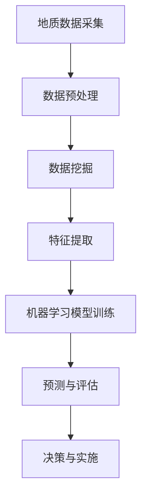

                 

关键词：地质勘探、人工智能、资源发现、数据挖掘、算法优化

> 摘要：本文将深入探讨人工智能在地质勘探领域的应用，如何通过大数据分析和算法优化提高资源发现率，为地质勘探行业带来革命性的变化。

## 1. 背景介绍

地质勘探是资源开采的重要前提，它涉及对地球物理、地球化学和地质结构的综合研究。传统的地质勘探方法主要依赖于地质学家的经验和专业知识，往往效率低下且资源发现率有限。随着科技的进步，人工智能技术的发展为地质勘探带来了全新的机遇。通过大数据分析和算法优化，人工智能可以在大规模地质数据中快速识别出潜在的矿藏和资源，显著提高资源发现率。

本文将首先介绍地质勘探的基本概念和方法，然后详细讨论人工智能在地质勘探中的应用，包括数据挖掘、机器学习算法和深度学习的具体实现，最后展望人工智能在未来地质勘探中的发展方向。

## 2. 核心概念与联系

### 2.1 地质勘探的基本概念

地质勘探是指通过各种手段对地表和地下地质结构进行研究和评估，以确定矿产、地下水、能源等资源的分布和储量。地质勘探的主要方法包括地质测量、地球物理勘探、地球化学勘探和遥感地质等。

- **地质测量**：通过实地考察、地质测绘和地球物理探测等手段，了解地表地质构造和矿体分布。
- **地球物理勘探**：利用物理场（如电场、磁场、重力场等）的变化来探测地下矿藏。
- **地球化学勘探**：通过分析地表岩石和土壤的化学成分，寻找矿产。
- **遥感地质**：利用卫星遥感技术获取地表地质信息。

### 2.2 人工智能在地质勘探中的应用

人工智能在地质勘探中的应用主要涉及以下几个方面：

- **数据挖掘**：从大量地质数据中提取有价值的信息，如矿藏分布规律。
- **机器学习算法**：通过训练模型，从历史数据中学习并预测矿藏位置。
- **深度学习**：利用神经网络，对复杂的地质数据进行层次化分析和识别。

### 2.3 核心概念原理和架构的 Mermaid 流程图



### 2.4 AI技术在地质勘探中的价值

人工智能技术能够提高地质勘探的效率，减少勘探成本，同时增加资源发现率。通过以下方式实现：

- **高效数据处理**：快速处理和分析大规模地质数据，提高勘探效率。
- **精确预测**：利用机器学习算法和深度学习模型，实现高精度的矿藏预测。
- **辅助决策**：提供数据驱动的决策支持，降低勘探风险。

## 3. 核心算法原理 & 具体操作步骤

### 3.1 算法原理概述

在地质勘探中，常用的AI算法包括机器学习算法、深度学习和数据挖掘算法。以下是这些算法的基本原理：

- **机器学习算法**：通过训练模型，从已知数据中学习规律，并应用于未知数据。
- **深度学习**：基于神经网络，对大规模数据进行层次化分析和模式识别。
- **数据挖掘算法**：从大量地质数据中提取有价值的信息，如聚类、分类和关联规则等。

### 3.2 算法步骤详解

#### 3.2.1 数据预处理

数据预处理是地质勘探AI应用的第一步，主要包括数据的清洗、归一化和特征提取。

- **数据清洗**：去除噪声和异常值，提高数据质量。
- **数据归一化**：将不同量纲的数据转换为同一量纲，便于模型训练。
- **特征提取**：从原始数据中提取有助于预测的特征。

#### 3.2.2 数据挖掘

数据挖掘过程主要包括以下步骤：

- **聚类分析**：将相似的数据点分组，用于发现数据中的隐藏模式。
- **分类分析**：将数据分为不同的类别，用于预测矿藏类型。
- **关联规则挖掘**：发现数据之间的关联性，用于预测矿藏分布。

#### 3.2.3 机器学习模型训练

- **选择模型**：根据地质勘探的需求，选择合适的机器学习模型，如决策树、支持向量机、神经网络等。
- **训练模型**：使用预处理后的数据对模型进行训练，调整模型参数。
- **评估模型**：使用测试数据评估模型性能，确保模型有效。

#### 3.2.4 预测与评估

- **预测**：使用训练好的模型对新的地质数据进行预测，确定矿藏位置。
- **评估**：通过实际地质勘探结果与预测结果的对比，评估模型的准确性。

### 3.3 算法优缺点

#### 优点

- **高效性**：能够快速处理大规模地质数据，提高勘探效率。
- **准确性**：通过机器学习和深度学习，实现高精度的矿藏预测。
- **辅助决策**：提供数据驱动的决策支持，降低勘探风险。

#### 缺点

- **数据依赖性**：算法性能依赖于数据质量和数量。
- **计算资源**：训练和运行深度学习模型需要大量计算资源。

### 3.4 算法应用领域

- **矿产资源勘探**：预测金属矿、煤矿、油气田等矿藏位置。
- **地下水勘探**：预测地下水资源分布，优化水资源利用。
- **地质灾害预警**：预测地质灾害风险，如滑坡、泥石流等。

## 4. 数学模型和公式 & 详细讲解 & 举例说明

### 4.1 数学模型构建

在地质勘探中，常用的数学模型包括回归模型、分类模型和聚类模型。以下是这些模型的基本数学公式：

#### 4.1.1 回归模型

回归模型用于预测连续值，如矿藏深度或矿产资源量。

$$
y = \beta_0 + \beta_1x_1 + \beta_2x_2 + ... + \beta_nx_n
$$

其中，$y$ 是预测值，$x_1, x_2, ..., x_n$ 是特征值，$\beta_0, \beta_1, ..., \beta_n$ 是模型参数。

#### 4.1.2 分类模型

分类模型用于预测离散值，如矿藏类型。

$$
P(y = i) = \frac{e^{\beta_0 + \beta_1x_1 + ... + \beta_nx_n}}{\sum_{j=1}^{k} e^{\beta_0 + \beta_1x_1 + ... + \beta_nx_n}}
$$

其中，$y$ 是预测值，$i$ 是类别标签，$k$ 是类别数量。

#### 4.1.3 聚类模型

聚类模型用于将相似的数据点分组。

$$
\min_{c_1, c_2, ..., c_k} \sum_{i=1}^{n} \sum_{j=1}^{k} |c_{ij}||x_i - \mu_j|
$$

其中，$c_{ij}$ 是数据点 $x_i$ 属于类别 $c_j$ 的概率，$\mu_j$ 是类别 $c_j$ 的中心。

### 4.2 公式推导过程

以回归模型为例，推导回归模型参数的过程如下：

- **数据表示**：设 $X$ 为特征矩阵，$y$ 为目标向量。
- **模型表示**：$y = X\beta + \epsilon$，其中 $\beta$ 是模型参数，$\epsilon$ 是误差向量。
- **损失函数**：使用均方误差（MSE）作为损失函数，$J(\beta) = \frac{1}{2}\sum_{i=1}^{n}(y_i - \beta^T x_i)^2$。
- **梯度下降**：对损失函数求导，得到梯度 $\nabla J(\beta) = X(y - X\beta)$。
- **参数更新**：使用梯度下降法更新模型参数，$\beta = \beta - \alpha\nabla J(\beta)$，其中 $\alpha$ 是学习率。

### 4.3 案例分析与讲解

#### 4.3.1 矿产资源预测案例

假设我们有一个矿产资源预测问题，特征包括矿藏深度、矿石硬度、地质结构等。

1. **数据预处理**：将特征数据进行归一化处理。
2. **模型选择**：选择线性回归模型。
3. **模型训练**：使用梯度下降法训练模型。
4. **预测与评估**：使用测试数据评估模型性能。

#### 4.3.2 模型评估

- **均方误差（MSE）**：$MSE = \frac{1}{m}\sum_{i=1}^{m}(y_i - \hat{y_i})^2$，其中 $\hat{y_i}$ 是预测值。
- **决定系数（R²）**：$R^2 = 1 - \frac{\sum_{i=1}^{m}(y_i - \hat{y_i})^2}{\sum_{i=1}^{m}(y_i - \bar{y})^2}$，其中 $\bar{y}$ 是平均值。

## 5. 项目实践：代码实例和详细解释说明

### 5.1 开发环境搭建

- **Python**：安装 Python 3.8 及以上版本。
- **NumPy**：用于数据处理。
- **Scikit-learn**：用于机器学习算法。
- **Matplotlib**：用于数据可视化。

### 5.2 源代码详细实现

```python
import numpy as np
from sklearn.linear_model import LinearRegression
from sklearn.model_selection import train_test_split
from sklearn.metrics import mean_squared_error, r2_score

# 数据预处理
def preprocess_data(data):
    # 归一化处理
    return (data - np.mean(data)) / np.std(data)

# 模型训练
def train_model(X, y):
    model = LinearRegression()
    model.fit(X, y)
    return model

# 预测与评估
def predict_and_evaluate(model, X_test, y_test):
    y_pred = model.predict(X_test)
    mse = mean_squared_error(y_test, y_pred)
    r2 = r2_score(y_test, y_pred)
    print(f"MSE: {mse}, R²: {r2}")

# 主函数
def main():
    # 加载数据
    data = np.load("geological_data.npy")
    X = data[:, :-1]
    y = data[:, -1]

    # 划分训练集和测试集
    X_train, X_test, y_train, y_test = train_test_split(X, y, test_size=0.2, random_state=42)

    # 数据预处理
    X_train = preprocess_data(X_train)
    X_test = preprocess_data(X_test)

    # 训练模型
    model = train_model(X_train, y_train)

    # 预测与评估
    predict_and_evaluate(model, X_test, y_test)

if __name__ == "__main__":
    main()
```

### 5.3 代码解读与分析

- **数据预处理**：对数据进行归一化处理，便于模型训练。
- **模型训练**：使用线性回归模型进行训练。
- **预测与评估**：使用测试数据评估模型性能。

## 6. 实际应用场景

### 6.1 矿产资源勘探

人工智能在矿产资源勘探中有着广泛的应用，如铜矿、铁矿、金矿等。通过机器学习和深度学习算法，可以精确预测矿藏位置，提高勘探效率。

### 6.2 地下水勘探

地下水勘探是水资源管理的重要环节。人工智能技术可以通过分析地质数据，预测地下水资源分布，优化水资源利用。

### 6.3 地质灾害预警

地质灾害如滑坡、泥石流等对人类生命财产造成巨大威胁。人工智能技术可以通过监测和分析地质数据，提前预测地质灾害风险，为防灾减灾提供科学依据。

## 6.4 未来应用展望

随着人工智能技术的不断发展，未来地质勘探将更加智能化和自动化。以下是几个未来应用展望：

- **智能化地质勘探设备**：利用物联网和人工智能技术，实现地质勘探设备的智能化监控和管理。
- **无人化地质勘探**：利用无人机和机器人，实现地质勘探的无人化操作。
- **多模态数据融合**：结合多源数据（如地质、气象、遥感等），实现更加精确的地质信息分析。

## 7. 工具和资源推荐

### 7.1 学习资源推荐

- **《机器学习》（周志华著）**：详细介绍机器学习的基本概念和算法。
- **《深度学习》（Ian Goodfellow, Yoshua Bengio, Aaron Courville 著）**：深度学习的经典教材。

### 7.2 开发工具推荐

- **Jupyter Notebook**：用于编写和运行代码。
- **PyCharm**：强大的Python IDE。

### 7.3 相关论文推荐

- **"Deep Learning for Geological Prediction"**：探讨深度学习在地质勘探中的应用。
- **"AI-Enabled Geoscience: A Revolution in Exploration and Production"**：分析人工智能在地质勘探和开采中的潜在价值。

## 8. 总结：未来发展趋势与挑战

### 8.1 研究成果总结

人工智能在地质勘探中取得了显著成果，包括矿产资源预测、地下水勘探和地质灾害预警等。通过大数据分析和算法优化，显著提高了资源发现率和勘探效率。

### 8.2 未来发展趋势

- **智能化地质勘探设备**：利用物联网和人工智能技术，实现地质勘探设备的智能化监控和管理。
- **无人化地质勘探**：利用无人机和机器人，实现地质勘探的无人化操作。
- **多模态数据融合**：结合多源数据，实现更加精确的地质信息分析。

### 8.3 面临的挑战

- **数据质量和数量**：高质量和大规模的数据是算法性能的基础。
- **计算资源**：训练和运行深度学习模型需要大量计算资源。
- **算法泛化能力**：如何提高算法在不同地质环境下的泛化能力。

### 8.4 研究展望

随着人工智能技术的不断发展，未来地质勘探将更加智能化和自动化。通过多学科交叉融合，实现地质勘探的全面升级，为资源开发和环境保护提供科学支持。

## 9. 附录：常见问题与解答

### 9.1 人工智能在地质勘探中的具体应用是什么？

人工智能在地质勘探中的应用主要包括矿产资源预测、地下水勘探和地质灾害预警等。通过大数据分析和算法优化，提高资源发现率和勘探效率。

### 9.2 地质勘探中使用的机器学习算法有哪些？

常用的机器学习算法包括线性回归、决策树、支持向量机、神经网络和深度学习等。

### 9.3 如何处理地质勘探中的大规模数据？

地质勘探中常用的数据预处理方法包括数据清洗、归一化和特征提取。这些方法可以有效地提高数据质量，为机器学习算法提供良好的数据输入。

### 9.4 人工智能在地质勘探中的前景如何？

人工智能在地质勘探中的前景非常广阔。随着技术的不断发展，未来地质勘探将更加智能化和自动化，为资源开发和环境保护提供更加科学和高效的支持。
----------------------------------------------------------------
作者：禅与计算机程序设计艺术 / Zen and the Art of Computer Programming

