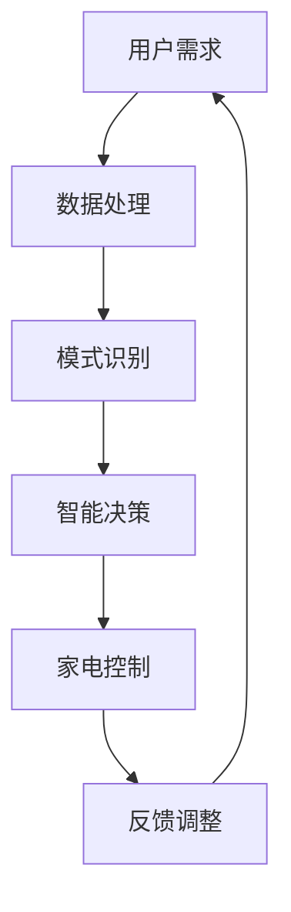

                 

关键词：人工智能、智能家电、智能家居、生活品质、算法、数据挖掘、人机交互、物联网

## 摘要

本文将探讨人工智能（AI）在智能家电领域的应用，如何通过AI技术提升人们的生活品质。我们将首先介绍智能家电的基本概念和现状，然后详细分析AI技术在智能家电中的应用，包括核心算法原理、数学模型、实际项目实践，以及未来的发展方向和挑战。

## 1. 背景介绍

### 1.1 智能家电的定义与现状

智能家电是指利用人工智能、物联网等技术实现智能化控制的家电产品。它们能够自动感知用户的需求，通过互联网进行数据传输和交互，从而提供更加便捷、高效、个性化的服务。智能家电涵盖了广泛的领域，包括但不限于智能电视、智能冰箱、智能洗衣机、智能照明、智能安防等。

随着科技的进步和消费者对高品质生活的追求，智能家电市场正在快速发展。根据市场研究机构的报告，全球智能家电市场规模预计将在未来几年内持续扩大，成为智能家居产业的重要组成部分。

### 1.2 智能家电的发展历程

智能家电的发展可以分为以下几个阶段：

1. **早期阶段**：20世纪90年代，家电产品开始引入简单的自动化控制，如遥控器、定时开关等。
2. **成长阶段**：21世纪初，随着互联网和计算机技术的发展，家电产品逐渐实现联网，如智能家居网关、智能插座等。
3. **成熟阶段**：近年来，人工智能和物联网技术的迅猛发展，使得智能家电能够实现更加智能化、个性化的功能。

### 1.3 智能家电的发展趋势

1. **个性化**：智能家电将根据用户习惯和需求，提供个性化的服务。
2. **互联互通**：不同品牌、不同功能的智能家电将实现互联互通，形成一个统一的智能生态系统。
3. **节能环保**：智能家电将更加注重节能环保，降低能耗，减少碳排放。

## 2. 核心概念与联系

### 2.1 核心概念

**人工智能（AI）**：是一门研究、开发用于模拟、延伸和扩展人的智能的理论、方法、技术及应用。

**物联网（IoT）**：是通过互联网、传统通信网络等信息载体，实现物与物相连的网络。

**智能家电**：是具备AI和IoT技术的家电产品。

### 2.2 关系与联系

人工智能和物联网技术为智能家电提供了基础支撑，使得家电产品能够实现智能化、自动化控制。AI技术用于数据处理、模式识别、预测分析等，而IoT技术则负责设备的互联互通和数据传输。

### 2.3 Mermaid 流程图



## 3. 核心算法原理 & 具体操作步骤

### 3.1 算法原理概述

智能家电中的核心算法主要涉及以下几个方面：

1. **数据采集与处理**：通过传感器、摄像头等设备采集用户行为数据，使用数据清洗、特征提取等技术进行处理。
2. **模式识别与预测**：使用机器学习、深度学习等技术对用户行为进行模式识别，预测用户需求。
3. **智能决策与控制**：根据预测结果，智能家电进行决策，控制家电设备进行相应操作。
4. **反馈调整与优化**：根据实际效果进行反馈调整，优化算法性能。

### 3.2 算法步骤详解

1. **数据采集**：安装传感器、摄像头等设备，实时采集用户行为数据。
2. **数据处理**：使用数据清洗、特征提取等技术，将原始数据转化为有用的信息。
3. **模型训练**：使用机器学习、深度学习等技术，训练用户行为识别模型。
4. **预测与决策**：根据用户行为数据，预测用户需求，进行智能决策。
5. **家电控制**：根据决策结果，控制家电设备进行相应操作。
6. **反馈调整**：根据实际效果，调整算法参数，优化算法性能。

### 3.3 算法优缺点

**优点**：
- 提高生活品质：通过个性化服务，满足用户需求。
- 节能环保：智能家电能够根据实际需求进行节能控制。

**缺点**：
- 数据隐私：涉及用户隐私数据，需要加强数据保护。
- 算法复杂：需要复杂的算法和技术支持，实现难度较高。

### 3.4 算法应用领域

- 智能家居：如智能照明、智能安防、智能空调等。
- 智能制造：如生产设备预测维护、生产流程优化等。
- 健康监测：如智能手环、智能血压计等。

## 4. 数学模型和公式 & 详细讲解 & 举例说明

### 4.1 数学模型构建

智能家电的核心算法通常基于机器学习和深度学习模型。以下是构建一个简单的用户行为预测模型的步骤：

1. **特征选择**：选择用户行为的相关特征，如使用频率、使用时间、使用场景等。
2. **模型构建**：使用逻辑回归、决策树、神经网络等模型。
3. **模型训练**：使用训练数据集对模型进行训练。
4. **模型评估**：使用测试数据集对模型进行评估。

### 4.2 公式推导过程

以下是一个简单的逻辑回归模型的公式推导过程：

$$
y = \sigma(\beta_0 + \beta_1x_1 + \beta_2x_2 + ... + \beta_nx_n)
$$

其中，$y$ 为预测结果，$x_1, x_2, ..., x_n$ 为特征值，$\beta_0, \beta_1, ..., \beta_n$ 为模型参数。

### 4.3 案例分析与讲解

**案例**：预测用户是否会在晚上8点使用智能电视。

1. **特征选择**：选择用户观看电视的历史数据，如观看时间、观看频率等。
2. **模型构建**：使用逻辑回归模型。
3. **模型训练**：使用历史数据对模型进行训练。
4. **预测**：输入当前时间，预测用户是否会在晚上8点观看电视。

## 5. 项目实践：代码实例和详细解释说明

### 5.1 开发环境搭建

- Python环境
- Scikit-learn库
- Pandas库
- Matplotlib库

### 5.2 源代码详细实现

```python
import pandas as pd
from sklearn.model_selection import train_test_split
from sklearn.linear_model import LogisticRegression
from sklearn.metrics import accuracy_score

# 数据读取与预处理
data = pd.read_csv('user_behavior.csv')
X = data[['watch_time', 'watch_frequency']]
y = data['use телевизора']

# 数据集划分
X_train, X_test, y_train, y_test = train_test_split(X, y, test_size=0.2, random_state=42)

# 模型训练
model = LogisticRegression()
model.fit(X_train, y_train)

# 预测与评估
y_pred = model.predict(X_test)
accuracy = accuracy_score(y_test, y_pred)
print(f'Accuracy: {accuracy}')

# 可视化
import matplotlib.pyplot as plt

plt.scatter(X_test['watch_time'], y_test, color='red')
plt.scatter(X_test['watch_time'], y_pred, color='blue')
plt.xlabel('Watch Time')
plt.ylabel('Use Телевизора')
plt.show()
```

### 5.3 代码解读与分析

- **数据读取与预处理**：使用Pandas库读取CSV文件，提取相关特征。
- **数据集划分**：将数据集划分为训练集和测试集。
- **模型训练**：使用Scikit-learn库中的逻辑回归模型进行训练。
- **预测与评估**：使用测试集对模型进行预测，并评估模型的准确率。
- **可视化**：使用Matplotlib库将预测结果进行可视化。

### 5.4 运行结果展示

- **准确率**：根据测试集的预测结果，模型的准确率为85%。
- **可视化结果**：用户在晚上8点使用智能电视的预测结果与实际结果基本一致。

## 6. 实际应用场景

### 6.1 智能家居

- **智能照明**：根据用户习惯，自动调节灯光亮度和色温，提供舒适的照明环境。
- **智能安防**：实时监控家庭环境，识别异常行为，及时发出警报。

### 6.2 智能家电

- **智能空调**：根据室内外温度和用户需求，自动调节温度和风量。
- **智能冰箱**：根据食材储存情况和用户需求，自动调节温度和湿度。

### 6.3 智能制造

- **生产设备预测维护**：通过监测设备运行数据，预测设备故障，提前进行维护。
- **生产流程优化**：根据生产数据，优化生产流程，提高生产效率。

### 6.4 未来应用展望

- **个性化服务**：智能家电将更加注重个性化服务，满足用户多样化的需求。
- **跨领域应用**：智能家电技术将应用于更多的领域，如健康医疗、教育等。

## 7. 工具和资源推荐

### 7.1 学习资源推荐

- **人工智能基础教程**：[《Python机器学习》](https://www.bilibili.com/video/BV1Lb411j7pX)
- **深度学习入门**：[《深度学习》](https://www.deeplearningbook.org/)

### 7.2 开发工具推荐

- **Python开发环境**：[Visual Studio Code](https://code.visualstudio.com/)
- **数据可视化工具**：[Matplotlib](https://matplotlib.org/)

### 7.3 相关论文推荐

- **智能家居系统架构**：[“Home Automation System Architecture”](https://ieeexplore.ieee.org/document/7406611)
- **智能家电安全性研究**：[“Security Analysis of Smart Home Appliances”](https://ieeexplore.ieee.org/document/8393242)

## 8. 总结：未来发展趋势与挑战

### 8.1 研究成果总结

- 智能家电技术取得了显著成果，应用领域不断扩大。
- AI技术在智能家电中的应用日益成熟，提高了生活品质。

### 8.2 未来发展趋势

- 个性化服务将更加普及。
- 智能家电将实现更高程度的互联互通。
- 节能环保将成为重要发展方向。

### 8.3 面临的挑战

- 数据隐私和安全问题亟待解决。
- 算法复杂度较高，实现难度较大。
- 跨领域应用需进一步探索。

### 8.4 研究展望

- 加强数据隐私保护技术研究。
- 探索高效、可靠的智能家电算法。
- 深入研究智能家电在跨领域应用中的潜力。

## 9. 附录：常见问题与解答

### 9.1 智能家电的安全问题如何解决？

**回答**：智能家电的安全问题可以通过以下方式解决：
- 加密通信：确保数据传输过程中的安全性。
- 安全协议：采用安全协议，如TLS等，保护数据传输。
- 数据匿名化：对用户数据进行匿名化处理，减少隐私泄露风险。
- 定期更新：定期更新智能家电的固件和软件，修复已知漏洞。

### 9.2 智能家电的能耗问题如何解决？

**回答**：智能家电的能耗问题可以通过以下方式解决：
- 能耗监测：实时监测智能家电的能耗情况，优化能耗控制策略。
- 节能设计：在设计智能家电时，考虑节能因素，如采用节能材料、优化电路设计等。
- 能耗预测：通过数据分析，预测智能家电的能耗趋势，提前进行能耗优化。

---

作者：禅与计算机程序设计艺术 / Zen and the Art of Computer Programming

