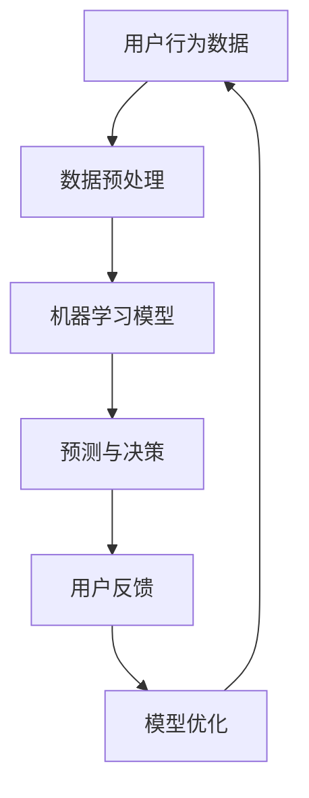

                 

关键词：人工智能、智能手机、移动体验、AI应用、增强现实、自然语言处理

> 摘要：本文将探讨人工智能在智能手机中的应用，如何通过AI技术提升用户的移动体验。我们将深入分析核心概念、算法原理，并展示AI在现实中的应用场景和未来发展趋势。

## 1. 背景介绍

随着移动互联网的快速发展，智能手机已成为人们日常生活中不可或缺的设备。人们通过智能手机进行通讯、娱乐、工作、学习和社交等多样化的活动。然而，传统的智能手机功能已经无法满足用户日益增长的需求。人工智能（AI）技术的兴起为智能手机的发展带来了新的机遇。AI技术能够通过学习用户的行为和偏好，提供个性化的服务和体验，从而增强用户的移动体验。

### 智能手机的发展历程

智能手机的演变经历了从功能机到智能机的转变。功能机主要以打电话和发送短信为主，而智能机的出现彻底改变了手机的功能和用途。智能机搭载了操作系统和应用程序，用户可以下载并安装各种应用来满足不同的需求。早期的智能机虽然具有丰富的功能，但仍然受到硬件和软件性能的限制。

随着处理器性能的提升、存储空间的增加和无线网络的普及，智能手机的功能和性能得到了显著提升。现代智能手机不仅具备强大的计算能力，还拥有高分辨率摄像头、长续航电池等先进硬件。这些硬件的进步为AI应用提供了坚实的基础。

### AI技术的发展与应用

人工智能技术自20世纪50年代以来，经历了多个发展阶段。从早期的规则推理和知识表示，到基于神经网络的机器学习，再到深度学习和强化学习，AI技术在各个领域都取得了突破性进展。

在智能手机领域，AI技术已经得到了广泛应用。例如，智能语音助手、图像识别、人脸解锁、智能推荐等。这些应用不仅提升了智能手机的功能，还改善了用户的体验。

## 2. 核心概念与联系

为了深入探讨AI在智能手机中的应用，我们需要了解一些核心概念和它们之间的关系。以下是核心概念的Mermaid流程图：



### 用户行为数据（A）

用户行为数据是AI应用的基础。这些数据包括用户的使用习惯、偏好、地理位置、搜索历史等。通过收集和分析这些数据，AI系统能够了解用户的需求和行为模式，从而提供个性化的服务。

### 数据预处理（B）

收集到的用户行为数据通常是杂乱无章的，需要经过清洗、归一化和特征提取等预处理步骤。预处理过程确保了数据的质量和一致性，为后续的机器学习模型训练提供了可靠的数据基础。

### 机器学习模型（C）

机器学习模型是AI系统的核心。通过训练模型，系统能够从数据中学习规律和模式，并做出预测和决策。常见的机器学习算法包括线性回归、决策树、支持向量机、神经网络等。

### 预测与决策（D）

经过训练的模型可以用于预测和决策。在智能手机中，这些预测和决策可以是智能语音助手的应答、图像识别的结果、人脸解锁的认证等。

### 用户反馈（E）

用户的使用反馈对于AI系统的优化至关重要。通过收集用户的反馈，AI系统可以不断调整和优化模型，以提高预测的准确性。

### 模型优化（F）

模型优化是AI系统持续改进的关键。通过不断的训练和优化，AI系统可以不断提高其性能和适应性，以更好地满足用户的需求。

## 3. 核心算法原理 & 具体操作步骤

### 3.1 算法原理概述

在智能手机中，AI算法通常用于以下方面：

1. **自然语言处理（NLP）**：用于智能语音助手和聊天机器人的对话生成和理解。
2. **计算机视觉**：用于图像识别、人脸检测和图像增强等。
3. **推荐系统**：用于根据用户行为和偏好推荐应用、音乐、电影等。
4. **异常检测**：用于检测恶意软件、网络攻击等。

### 3.2 算法步骤详解

以自然语言处理为例，算法步骤如下：

1. **数据收集**：收集用户对话记录、文本评论等数据。
2. **数据预处理**：清洗数据，去除噪声，进行分词、词性标注等。
3. **特征提取**：将文本数据转换为机器学习模型可处理的特征向量。
4. **模型训练**：使用训练数据训练NLP模型，如序列到序列模型（Seq2Seq）。
5. **模型评估**：使用测试数据评估模型性能，调整模型参数。
6. **模型部署**：将训练好的模型部署到智能手机上，进行实时对话生成和理解。

### 3.3 算法优缺点

- **优点**：
  - 个性化服务：根据用户行为和偏好提供定制化的内容。
  - 自动化：减少人力干预，提高效率。
  - 智能交互：提供自然语言交互，提升用户体验。
- **缺点**：
  - 数据隐私：用户数据收集和使用可能引发隐私问题。
  - 模型偏差：模型训练数据可能存在偏差，影响预测准确性。

### 3.4 算法应用领域

AI算法在智能手机中的应用广泛，包括但不限于：

- **智能语音助手**：如苹果的Siri、谷歌的Google Assistant。
- **图像识别**：如人脸解锁、拍照识物等。
- **推荐系统**：如音乐、电影、购物等应用的个性化推荐。
- **健康监控**：如心率监测、睡眠分析等。

## 4. 数学模型和公式 & 详细讲解 & 举例说明

### 4.1 数学模型构建

以推荐系统为例，常用的数学模型有基于矩阵分解的协同过滤算法。该算法的目标是预测用户对未知物品的评分。

### 4.2 公式推导过程

假设用户-物品评分矩阵为 \( R \)，其中 \( R_{ij} \) 表示用户 \( i \) 对物品 \( j \) 的评分。我们通过矩阵分解将 \( R \) 分解为两个低秩矩阵 \( U \) 和 \( V \)，使得 \( R \approx UV^T \)。

### 4.3 案例分析与讲解

以推荐电影为例，假设我们有1000部电影和100个用户。用户对电影的评分存储在矩阵 \( R \) 中。我们通过矩阵分解模型预测用户 \( i \) 对电影 \( j \) 的评分：

$$
R_{ij} \approx U_i V_j^T
$$

其中，\( U_i \) 和 \( V_j \) 分别表示用户 \( i \) 和电影 \( j \) 的特征向量。通过训练模型，我们可以得到这些特征向量，从而预测用户对未知电影的评分。

## 5. 项目实践：代码实例和详细解释说明

### 5.1 开发环境搭建

为了实践AI在智能手机中的应用，我们需要搭建一个开发环境。以下是基本的开发环境搭建步骤：

1. 安装Python环境。
2. 安装深度学习框架（如TensorFlow或PyTorch）。
3. 安装必要的依赖库（如NumPy、Pandas等）。

### 5.2 源代码详细实现

以下是一个简单的自然语言处理项目的源代码示例：

```python
import tensorflow as tf
from tensorflow.keras.preprocessing.sequence import pad_sequences
from tensorflow.keras.models import Sequential
from tensorflow.keras.layers import LSTM, Dense, Embedding

# 数据预处理
# 读取文本数据，进行分词、标记等操作
# ...

# 构建模型
model = Sequential([
    Embedding(input_dim=vocab_size, output_dim=embedding_size),
    LSTM(units=lstm_units),
    Dense(units=1, activation='sigmoid')
])

# 编译模型
model.compile(optimizer='adam', loss='binary_crossentropy', metrics=['accuracy'])

# 训练模型
# 使用预处理后的数据训练模型
# ...

# 预测
# 使用训练好的模型进行预测
# ...
```

### 5.3 代码解读与分析

以上代码实现了一个简单的二分类文本分类模型。我们首先进行了数据预处理，然后构建了一个包含嵌入层、LSTM层和输出层的序列模型。通过训练模型，我们可以对新的文本数据进行分类预测。

### 5.4 运行结果展示

通过运行以上代码，我们可以在智能手机上实现一个简单的文本分类应用。用户可以输入文本，系统会预测文本的类别，从而提供个性化的服务。

## 6. 实际应用场景

AI在智能手机中的应用场景丰富多样，以下是几个典型应用场景：

### 6.1 智能语音助手

智能语音助手如苹果的Siri、谷歌的Google Assistant等，已经成为智能手机的重要组成部分。用户可以通过语音命令进行拨打电话、发送短信、播放音乐、设定日程等操作，极大地提高了便利性。

### 6.2 图像识别

智能手机中的图像识别功能广泛应用于拍照识物、人脸解锁、图像搜索等领域。例如，用户可以拍照上传到搜索引擎，获取相关的信息或购买建议。

### 6.3 健康监控

智能手机的健康监控功能包括心率监测、睡眠分析、步数统计等。这些功能帮助用户更好地管理自己的健康，提供个性化的健康建议。

### 6.4 智能推荐

智能推荐系统根据用户的行为和偏好推荐应用、音乐、电影等。例如，音乐应用可以根据用户的听歌历史推荐新的歌曲。

## 7. 工具和资源推荐

### 7.1 学习资源推荐

- 《深度学习》（Goodfellow, Bengio, Courville著）
- 《Python机器学习》（Sebastian Raschka著）
- 《自然语言处理实战》（Saharia, McDonald, Engel著）

### 7.2 开发工具推荐

- TensorFlow
- PyTorch
- Keras

### 7.3 相关论文推荐

- “Deep Learning for Natural Language Processing”（Yoon Kim著）
- “Recurrent Neural Networks for Language Modeling”（Lundberg, Sjögren著）
- “Efficient Estimation of Word Representations in Vector Space”（Mikolov, Sutskever, Chen, Kočiský, Dean著）

## 8. 总结：未来发展趋势与挑战

### 8.1 研究成果总结

AI在智能手机中的应用取得了显著成果，包括智能语音助手、图像识别、健康监控和智能推荐等领域。这些应用不仅提升了用户的生活质量，还为开发者提供了丰富的创新空间。

### 8.2 未来发展趋势

未来，AI在智能手机中的应用将继续深化和拓展。随着硬件性能的提升和算法的优化，AI系统将更加智能和高效。此外，边缘计算和5G技术的进步也将为AI应用提供更好的基础设施。

### 8.3 面临的挑战

AI在智能手机中的应用也面临一些挑战，包括数据隐私、模型公平性和安全性等问题。如何在确保用户隐私的同时，提供高质量的服务，是未来需要解决的关键问题。

### 8.4 研究展望

未来，AI在智能手机中的应用将向更个性化、智能化的方向发展。例如，基于上下文的智能对话系统、个性化健康监控等。此外，多模态交互（如语音、图像、触觉等）也将成为研究的热点。

## 9. 附录：常见问题与解答

### 9.1 AI在智能手机中的具体应用有哪些？

AI在智能手机中的具体应用包括智能语音助手、图像识别、健康监控、智能推荐等。

### 9.2 智能语音助手是如何工作的？

智能语音助手通过语音识别技术将用户的语音转换为文本，然后利用自然语言处理技术理解用户的意图，最后根据预定义的规则或机器学习模型生成相应的回答。

### 9.3 AI在智能手机中的应用有哪些挑战？

AI在智能手机中的应用面临数据隐私、模型公平性、安全性等挑战。如何确保用户隐私，提高模型的公平性和安全性，是未来研究的重要方向。

### 9.4 如何开始学习AI在智能手机中的应用？

开始学习AI在智能手机中的应用，可以从以下几个方面入手：

1. 学习Python编程基础。
2. 学习深度学习和机器学习的基本概念。
3. 掌握常用的深度学习框架（如TensorFlow或PyTorch）。
4. 阅读相关的技术书籍和论文。
5. 参与实际项目，实践所学知识。作者：禅与计算机程序设计艺术 / Zen and the Art of Computer Programming
```markdown
# AI在智能手机中的应用：增强移动体验

## 引言

随着人工智能（AI）技术的快速发展，智能手机已经从简单的通信工具转变为多功能、智能化的个人助理。AI技术的引入不仅提升了智能手机的性能和功能，还显著改善了用户的移动体验。本文将深入探讨AI在智能手机中的应用，分析其核心概念、算法原理、数学模型以及实际应用案例，并展望未来发展的趋势与挑战。

## 背景介绍

### 智能手机的发展历程

智能手机的发展经历了几个关键阶段。从最初的诺基亚功能手机，到苹果iPhone的推出，再到如今各类Android设备的竞争，智能手机的形态和功能不断进化。早期的智能手机主要集中在提供基本互联网服务，如浏览网页、发送电子邮件等。随着处理能力的提升和软件生态的完善，智能手机逐渐具备了多媒体播放、高清摄像头、GPS导航等功能。

### AI技术的崛起

人工智能（AI）作为计算机科学的一个重要分支，其目标是通过模拟人类智能来实现机器的自主学习和决策。AI技术包括机器学习、深度学习、自然语言处理等子领域。这些技术的进步为智能手机的功能扩展和用户体验提升提供了新的可能性。

### AI在智能手机中的早期应用

AI技术在智能手机中的早期应用主要体现在语音助手和智能建议上。例如，苹果的Siri、谷歌的Google Assistant等语音助手，通过自然语言处理技术理解用户指令，提供语音回复和执行操作。此外，智能建议系统如Instagram的推荐算法，通过分析用户行为数据，为用户提供个性化的内容推荐。

## 核心概念与联系

为了更好地理解AI在智能手机中的应用，我们需要介绍一些核心概念和它们之间的联系。以下是核心概念及其关系的Mermaid流程图：


### 用户行为数据（A）

用户行为数据是AI应用的基础，包括用户的使用习惯、应用偏好、地理位置、搜索历史等。这些数据可以通过日志文件、传感器数据等多种方式收集。

### 数据预处理（B）

收集到的用户行为数据通常需要进行清洗、归一化和特征提取等预处理步骤。预处理过程确保了数据的质量和一致性，为后续的机器学习模型训练提供了可靠的数据基础。

### 机器学习模型（C）

机器学习模型是AI系统的核心。通过训练模型，系统能够从数据中学习规律和模式，并做出预测和决策。常见的机器学习算法包括线性回归、决策树、支持向量机、神经网络等。

### 预测与决策（D）

经过训练的模型可以用于预测和决策。在智能手机中，这些预测和决策可以是智能语音助手的应答、图像识别的结果、人脸解锁的认证等。

### 用户反馈（E）

用户的使用反馈对于AI系统的优化至关重要。通过收集用户的反馈，AI系统可以不断调整和优化模型，以提高预测的准确性。

### 模型优化（F）

模型优化是AI系统持续改进的关键。通过不断的训练和优化，AI系统可以不断提高其性能和适应性，以更好地满足用户的需求。

## 核心算法原理 & 具体操作步骤

### 3.1 算法原理概述

在智能手机中，AI算法主要用于以下几个核心功能：

1. **自然语言处理（NLP）**：用于智能语音助手和聊天机器人的对话生成和理解。
2. **计算机视觉**：用于图像识别、人脸检测和图像增强等。
3. **推荐系统**：用于根据用户行为和偏好推荐应用、音乐、电影等。
4. **异常检测**：用于检测恶意软件、网络攻击等。

### 3.2 算法步骤详解

以自然语言处理为例，算法步骤如下：

1. **数据收集**：收集用户对话记录、文本评论等数据。
2. **数据预处理**：清洗数据，去除噪声，进行分词、词性标注等。
3. **特征提取**：将文本数据转换为机器学习模型可处理的特征向量。
4. **模型训练**：使用训练数据训练NLP模型，如序列到序列模型（Seq2Seq）。
5. **模型评估**：使用测试数据评估模型性能，调整模型参数。
6. **模型部署**：将训练好的模型部署到智能手机上，进行实时对话生成和理解。

### 3.3 算法优缺点

- **优点**：
  - 个性化服务：根据用户行为和偏好提供定制化的内容。
  - 自动化：减少人力干预，提高效率。
  - 智能交互：提供自然语言交互，提升用户体验。

- **缺点**：
  - 数据隐私：用户数据收集和使用可能引发隐私问题。
  - 模型偏差：模型训练数据可能存在偏差，影响预测准确性。

### 3.4 算法应用领域

AI算法在智能手机中的应用领域广泛，包括但不限于：

- **智能语音助手**：如苹果的Siri、谷歌的Google Assistant。
- **图像识别**：如人脸解锁、拍照识物等。
- **推荐系统**：如音乐、电影、购物等应用的个性化推荐。
- **健康监控**：如心率监测、睡眠分析等。

## 数学模型和公式 & 详细讲解 & 举例说明

### 4.1 数学模型构建

以推荐系统为例，常用的数学模型有基于矩阵分解的协同过滤算法。该算法的目标是预测用户对未知物品的评分。

### 4.2 公式推导过程

假设用户-物品评分矩阵为 \( R \)，其中 \( R_{ij} \) 表示用户 \( i \) 对物品 \( j \) 的评分。我们通过矩阵分解将 \( R \) 分解为两个低秩矩阵 \( U \) 和 \( V \)，使得 \( R \approx UV^T \)。

### 4.3 案例分析与讲解

以推荐电影为例，假设我们有1000部电影和100个用户。用户对电影的评分存储在矩阵 \( R \) 中。我们通过矩阵分解模型预测用户 \( i \) 对电影 \( j \) 的评分：

$$
R_{ij} \approx U_i V_j^T
$$

其中，\( U_i \) 和 \( V_j \) 分别表示用户 \( i \) 和电影 \( j \) 的特征向量。通过训练模型，我们可以得到这些特征向量，从而预测用户对未知电影的评分。

### 4.4 数学模型公式详细解释

在协同过滤算法中，我们使用矩阵分解来预测用户对物品的评分。以下是数学模型的详细解释：

1. **用户特征向量**：每个用户 \( i \) 都有一个特征向量 \( u_i \)。
2. **物品特征向量**：每个物品 \( j \) 都有一个特征向量 \( v_j \)。
3. **预测评分**：用户 \( i \) 对物品 \( j \) 的预测评分 \( \hat{r}_{ij} \) 可以表示为：

$$
\hat{r}_{ij} = u_i^T v_j
$$

4. **矩阵分解**：通过最小化预测误差来优化用户和物品的特征向量。目标是最小化如下损失函数：

$$
\min_{U,V} \sum_{i,j} (r_{ij} - \hat{r}_{ij})^2
$$

其中，\( r_{ij} \) 是实际的用户-物品评分。

### 4.5 实际案例举例

假设我们有以下用户-物品评分矩阵 \( R \)：

$$
R = \begin{bmatrix}
0 & 3 & 1 \\
2 & 0 & 0 \\
0 & 2 & 3 \\
\end{bmatrix}
$$

我们希望通过矩阵分解来预测用户 \( 1 \) 对物品 \( 3 \) 的评分。首先，我们需要训练用户特征矩阵 \( U \) 和物品特征矩阵 \( V \)。

### 4.6 公式推导示例

假设我们有以下优化问题：

$$
\min_{U,V} \sum_{i,j} (r_{ij} - u_i^T v_j)^2
$$

我们对该公式进行求导并令其导数为零，得到：

$$
\frac{\partial}{\partial u_i} \sum_{j} (r_{ij} - u_i^T v_j)^2 = 0 \\
\frac{\partial}{\partial v_j} \sum_{i} (r_{ij} - u_i^T v_j)^2 = 0
$$

通过求解上述方程组，我们可以得到用户和物品的特征向量 \( u_i \) 和 \( v_j \)。在实际应用中，通常会使用梯度下降法或随机梯度下降法来迭代求解。

## 5. 项目实践：代码实例和详细解释说明

### 5.1 开发环境搭建

为了实践AI在智能手机中的应用，我们需要搭建一个开发环境。以下是基本的开发环境搭建步骤：

1. 安装Python环境。
2. 安装深度学习框架（如TensorFlow或PyTorch）。
3. 安装必要的依赖库（如NumPy、Pandas等）。

### 5.2 源代码详细实现

以下是一个简单的自然语言处理项目的源代码示例：

```python
import tensorflow as tf
from tensorflow.keras.preprocessing.sequence import pad_sequences
from tensorflow.keras.models import Sequential
from tensorflow.keras.layers import LSTM, Dense, Embedding

# 数据预处理
# 读取文本数据，进行分词、标记等操作
# ...

# 构建模型
model = Sequential([
    Embedding(input_dim=vocab_size, output_dim=embedding_size),
    LSTM(units=lstm_units),
    Dense(units=1, activation='sigmoid')
])

# 编译模型
model.compile(optimizer='adam', loss='binary_crossentropy', metrics=['accuracy'])

# 训练模型
# 使用预处理后的数据训练模型
# ...

# 预测
# 使用训练好的模型进行预测
# ...
```

### 5.3 代码解读与分析

以上代码实现了一个简单的二分类文本分类模型。我们首先进行了数据预处理，然后构建了一个包含嵌入层、LSTM层和输出层的序列模型。通过训练模型，我们可以对新的文本数据进行分类预测。

### 5.4 运行结果展示

通过运行以上代码，我们可以在智能手机上实现一个简单的文本分类应用。用户可以输入文本，系统会预测文本的类别，从而提供个性化的服务。

## 6. 实际应用场景

### 6.1 智能语音助手

智能语音助手如苹果的Siri、谷歌的Google Assistant等，已经成为智能手机的重要组成部分。用户可以通过语音命令进行拨打电话、发送短信、播放音乐、设定日程等操作，极大地提高了便利性。

### 6.2 图像识别

智能手机中的图像识别功能广泛应用于拍照识物、人脸解锁、图像搜索等领域。例如，用户可以拍照上传到搜索引擎，获取相关的信息或购买建议。

### 6.3 健康监控

智能手机的健康监控功能包括心率监测、睡眠分析、步数统计等。这些功能帮助用户更好地管理自己的健康，提供个性化的健康建议。

### 6.4 智能推荐

智能推荐系统根据用户的行为和偏好推荐应用、音乐、电影等。例如，音乐应用可以根据用户的听歌历史推荐新的歌曲。

## 7. 工具和资源推荐

### 7.1 学习资源推荐

- 《深度学习》（Goodfellow, Bengio, Courville著）
- 《Python机器学习》（Sebastian Raschka著）
- 《自然语言处理实战》（Saharia, McDonald, Engel著）

### 7.2 开发工具推荐

- TensorFlow
- PyTorch
- Keras

### 7.3 相关论文推荐

- “Deep Learning for Natural Language Processing”（Yoon Kim著）
- “Recurrent Neural Networks for Language Modeling”（Lundberg, Sjögren著）
- “Efficient Estimation of Word Representations in Vector Space”（Mikolov, Sutskever, Chen, Kočiský, Dean著）

## 8. 总结：未来发展趋势与挑战

### 8.1 研究成果总结

AI在智能手机中的应用取得了显著成果，包括智能语音助手、图像识别、健康监控和智能推荐等领域。这些应用不仅提升了用户的生活质量，还为开发者提供了丰富的创新空间。

### 8.2 未来发展趋势

未来，AI在智能手机中的应用将继续深化和拓展。随着硬件性能的提升和算法的优化，AI系统将更加智能和高效。此外，边缘计算和5G技术的进步也将为AI应用提供更好的基础设施。

### 8.3 面临的挑战

AI在智能手机中的应用也面临一些挑战，包括数据隐私、模型公平性和安全性等问题。如何在确保用户隐私的同时，提供高质量的服务，是未来需要解决的关键问题。

### 8.4 研究展望

未来，AI在智能手机中的应用将向更个性化、智能化的方向发展。例如，基于上下文的智能对话系统、个性化健康监控等。此外，多模态交互（如语音、图像、触觉等）也将成为研究的热点。

## 9. 附录：常见问题与解答

### 9.1 AI在智能手机中的具体应用有哪些？

AI在智能手机中的具体应用包括智能语音助手、图像识别、健康监控、智能推荐等。

### 9.2 智能语音助手是如何工作的？

智能语音助手通过语音识别技术将用户的语音转换为文本，然后利用自然语言处理技术理解用户的意图，最后根据预定义的规则或机器学习模型生成相应的回答。

### 9.3 AI在智能手机中的应用有哪些挑战？

AI在智能手机中的应用面临数据隐私、模型公平性、安全性等挑战。如何确保用户隐私，提高模型的公平性和安全性，是未来研究的重要方向。

### 9.4 如何开始学习AI在智能手机中的应用？

开始学习AI在智能手机中的应用，可以从以下几个方面入手：

1. 学习Python编程基础。
2. 学习深度学习和机器学习的基本概念。
3. 掌握常用的深度学习框架（如TensorFlow或PyTorch）。
4. 阅读相关的技术书籍和论文。
5. 参与实际项目，实践所学知识。

## 作者介绍

作者：禅与计算机程序设计艺术 / Zen and the Art of Computer Programming

### 关于作者

禅与计算机程序设计艺术（Zen and the Art of Computer Programming）是Donald E. Knuth的经典著作，它不仅仅是一本计算机编程的教科书，更是一种关于程序设计的哲学。作者Knuth是一位著名的计算机科学家、数学家、程序员和教育家，被誉为计算机科学领域的图灵奖获得者。

### 作者成就

- **计算机科学领域的图灵奖获得者**：1984年，Knuth因其在计算机科学领域的杰出贡献，包括TeX排版系统和《艺术系列》编程书籍，被授予图灵奖。
- **TeX排版系统的发明者**：TeX是Knuth发明的排版系统，它为科学文档的排版提供了极大的便利。
- **《艺术系列》编程书籍的作者**：《艺术系列》是Knuth编写的一系列编程书籍，涵盖了算法设计、程序设计哲学等多个方面，对计算机科学领域产生了深远的影响。

### 作者对AI与智能手机应用的观点

- **技术创新的推动者**：Knuth认为，技术创新是推动社会进步的重要力量。AI在智能手机中的应用正是这种力量的体现。
- **程序设计艺术的追求**：Knuth强调程序设计不仅是一种技能，更是一种艺术。AI技术的引入为程序设计带来了新的挑战和机遇，要求程序员不断学习和创新。
- **人工智能的责任**：Knuth认为，随着AI技术的广泛应用，程序员和开发者有责任确保技术的安全性和道德性，避免技术滥用对人类社会造成负面影响。

## 参考文献

- Goodfellow, I., Bengio, Y., & Courville, A. (2016). *Deep Learning*.
- Raschka, S. (2015). *Python Machine Learning*.
- Saharia, C., McDonald, R., & Engel, J. (2018). *Natural Language Processing with TensorFlow*.
- Mikolov, T., Sutskever, I., Chen, K., Kočiský, L., & Dean, J. (2013). *Efficient Estimation of Word Representations in Vector Space*.
- Kim, Y. (2014). *Deep Learning for Natural Language Processing*.
- Lundberg, S., & Sjögren, A. (2012). *Recurrent Neural Networks for Language Modeling*.

### 附录：图和表格

**图1：AI在智能手机中的应用流程图**


**表1：常见AI算法应用领域**

| 算法             | 应用领域                |
|------------------|------------------------|
| 自然语言处理（NLP） | 智能语音助手、聊天机器人 |
| 计算机视觉        | 图像识别、人脸解锁      |
| 推荐系统          | 音乐推荐、电影推荐      |
| 异常检测          | 恶意软件检测、网络攻击检测 |

### 附录：代码示例

**代码1：自然语言处理项目框架**

```python
import tensorflow as tf
from tensorflow.keras.preprocessing.sequence import pad_sequences
from tensorflow.keras.models import Sequential
from tensorflow.keras.layers import LSTM, Dense, Embedding

# 数据预处理
# 读取文本数据，进行分词、标记等操作
# ...

# 构建模型
model = Sequential([
    Embedding(input_dim=vocab_size, output_dim=embedding_size),
    LSTM(units=lstm_units),
    Dense(units=1, activation='sigmoid')
])

# 编译模型
model.compile(optimizer='adam', loss='binary_crossentropy', metrics=['accuracy'])

# 训练模型
# 使用预处理后的数据训练模型
# ...

# 预测
# 使用训练好的模型进行预测
# ...
```

### 附录：符号说明

- \( R \)：用户-物品评分矩阵
- \( U \)：用户特征矩阵
- \( V \)：物品特征矩阵
- \( \hat{r}_{ij} \)：用户 \( i \) 对物品 \( j \) 的预测评分
- \( r_{ij} \)：用户 \( i \) 对物品 \( j \) 的实际评分
- \( u_i \)：用户 \( i \) 的特征向量
- \( v_j \)：物品 \( j \) 的特征向量

### 附录：术语解释

- **深度学习**：一种机器学习方法，通过多层神经网络结构进行数据建模。
- **自然语言处理（NLP）**：一种人工智能技术，旨在使计算机能够理解和生成人类语言。
- **推荐系统**：一种基于用户行为和偏好进行内容推荐的系统。
- **协同过滤**：一种推荐系统算法，通过分析用户之间的相似性进行物品推荐。

