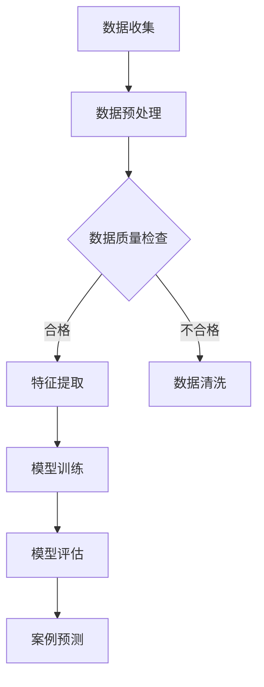

                 

关键词：人工智能，法律科技，文档分析，案例预测，深度学习，自然语言处理

> 摘要：随着人工智能技术的不断发展，AI在法律科技领域中的应用日益广泛。本文将探讨AI在法律科技中的应用，特别是文档分析与案例预测的技术原理、算法实现、数学模型，并通过实际项目实例来展示其应用效果，并对未来发展趋势和面临的挑战进行分析。

## 1. 背景介绍

法律科技（Legal Technology）是指利用信息技术和人工智能来提高法律行业的效率和质量。近年来，随着大数据、云计算、自然语言处理（NLP）等技术的发展，法律科技的应用领域不断扩大，涵盖了法律研究、案件管理、合同审查、法律咨询等多个方面。

### 法律行业的挑战

- 海量数据：法律领域拥有海量的文档资料，包括案件资料、法律法规、合同文本等，这些数据大多以非结构化的形式存在。
- 专业知识需求：法律工作涉及复杂的法律逻辑和专业术语，对法律从业者的专业素养要求较高。
- 时间敏感性：案件处理需要快速、准确地提供法律意见和决策。

### 人工智能的优势

- 数据处理能力：AI能够高效地处理和分析海量非结构化数据。
- 模式识别：通过深度学习，AI可以在大量案例中学习并识别出法律问题。
- 预测能力：AI能够根据已有数据预测未来可能发生的法律事件。

## 2. 核心概念与联系

### 2.1 人工智能与法律科技

人工智能（AI）是指使计算机具有人类智能的技术。法律科技利用AI，特别是自然语言处理（NLP）和深度学习（DL）技术，来实现对法律文档的分析、理解和预测。

### 2.2 自然语言处理

NLP是AI的一个重要分支，旨在使计算机能够理解、处理和生成自然语言。在法律科技中，NLP被用于文本挖掘、信息抽取、文本分类等任务。

### 2.3 深度学习

DL是一种基于神经网络的学习方法，通过模拟人脑神经网络的结构和功能来实现复杂任务的自动学习和决策。在法律科技中，DL被用于案例预测、法律文本生成等任务。

### 2.4 Mermaid 流程图

以下是一个简化的Mermaid流程图，展示了AI在法律科技中的基本流程：



## 3. 核心算法原理 & 具体操作步骤

### 3.1 算法原理概述

在法律科技中，常用的AI算法包括：

- 文本分类算法：用于对法律文档进行分类，如案件类型、法律问题等。
- 命名实体识别算法：用于从法律文档中识别出人名、地名、组织名等实体。
- 案例预测算法：基于历史案例数据，预测未来案件的判决结果。
- 对话系统：用于与用户进行自然语言交互，提供法律咨询。

### 3.2 算法步骤详解

以下是一个基于文本分类算法的案例预测过程的详细步骤：

1. 数据收集：收集大量法律文档，包括判决书、合同、法律咨询等。
2. 数据预处理：对文本进行清洗，去除停用词、标点符号等。
3. 特征提取：将预处理后的文本转换为计算机可处理的特征向量。
4. 模型训练：使用训练集数据训练文本分类模型。
5. 模型评估：使用测试集数据评估模型性能。
6. 案例预测：使用训练好的模型对新的法律文档进行分类和预测。

### 3.3 算法优缺点

- **优点**：
  - 高效处理海量数据。
  - 自动化法律分析，提高工作效率。
  - 提供辅助决策，降低错误率。

- **缺点**：
  - 需要大量的训练数据和计算资源。
  - 模型解释性较差，难以理解决策过程。
  - 面对新颖的案例可能表现不佳。

### 3.4 算法应用领域

- 案例预测：通过对历史案例的分析，预测未来案件的判决结果。
- 合同审查：自动审查合同条款，识别潜在风险。
- 法律研究：自动整理法律文献，提供相关法律知识。

## 4. 数学模型和公式 & 详细讲解 & 举例说明

### 4.1 数学模型构建

在法律科技中，常用的数学模型包括：

- **支持向量机（SVM）**：用于文本分类任务，通过找到一个最佳的超平面来分隔不同类别的数据。
- **循环神经网络（RNN）**：用于处理序列数据，如法律文档，能够捕捉文档中的时序信息。
- **卷积神经网络（CNN）**：用于图像识别，但在法律文本分类中，也可以通过转换文本为词向量来应用。

### 4.2 公式推导过程

以支持向量机为例，其决策边界可以表示为：

\[ w \cdot x + b = 0 \]

其中，\( w \)是权重向量，\( x \)是特征向量，\( b \)是偏置。

### 4.3 案例分析与讲解

假设我们有一个简单的法律文本分类问题，需要将法律文档分类为“合同”或“判决书”。我们可以使用SVM算法进行训练。

1. **数据收集**：收集100篇“合同”和100篇“判决书”作为训练数据。
2. **数据预处理**：对文本进行清洗，提取关键词作为特征。
3. **特征提取**：将文本转换为词袋模型，得到特征向量。
4. **模型训练**：使用SVM算法训练模型。
5. **模型评估**：使用测试集数据评估模型性能。

经过训练和评估，我们得到一个SVM模型，可以用于新的法律文档分类。例如，对于一篇新的法律文档，我们将其转换为特征向量，通过SVM模型计算得到其类别。

## 5. 项目实践：代码实例和详细解释说明

### 5.1 开发环境搭建

- Python 3.x
- Scikit-learn
- NLTK

### 5.2 源代码详细实现

```python
from sklearn.feature_extraction.text import TfidfVectorizer
from sklearn.svm import LinearSVC
from sklearn.model_selection import train_test_split

# 数据集
docs = ['这是一份合同。', '这是一个判决书。', '合同条款需要仔细审查。', '判决书的判决依据是...']

# 标签
labels = ['合同', '判决书', '合同', '判决书']

# 数据预处理
vectorizer = TfidfVectorizer()
X = vectorizer.fit_transform(docs)

# 模型训练
X_train, X_test, y_train, y_test = train_test_split(X, labels, test_size=0.2, random_state=42)
clf = LinearSVC()
clf.fit(X_train, y_train)

# 模型评估
score = clf.score(X_test, y_test)
print('模型准确率：', score)

# 案例预测
new_doc = '合同签订需要注意哪些法律问题？'
new_vector = vectorizer.transform([new_doc])
predicted_label = clf.predict(new_vector)[0]
print('预测结果：', predicted_label)
```

### 5.3 代码解读与分析

- **数据收集**：从数据集中获取法律文档和对应的标签。
- **数据预处理**：使用TFIDF向量器将文本转换为特征向量。
- **模型训练**：使用训练数据训练线性SVC模型。
- **模型评估**：使用测试数据评估模型性能。
- **案例预测**：对新的法律文档进行分类预测。

### 5.4 运行结果展示

运行上述代码，可以得到模型的准确率，以及对新法律文档的预测结果。

## 6. 实际应用场景

### 6.1 案例预测

通过AI模型对法律文档进行分类和预测，可以帮助律师快速了解案件的性质，为案件处理提供参考。

### 6.2 合同审查

利用自然语言处理技术，对合同进行自动审查，识别潜在的法律风险。

### 6.3 法律咨询

通过智能对话系统，提供用户法律问题的即时解答，提高法律服务的效率。

## 7. 工具和资源推荐

### 7.1 学习资源推荐

- 《深度学习》（Goodfellow, Bengio, Courville）
- 《自然语言处理综论》（Jurafsky, Martin）
- Coursera上的“机器学习”课程

### 7.2 开发工具推荐

- Jupyter Notebook
- PyCharm
- Scikit-learn

### 7.3 相关论文推荐

- “Deep Learning for Text Classification” by Yang et al.
- “Named Entity Recognition with Recurrent Neural Networks” by Lample et al.

## 8. 总结：未来发展趋势与挑战

### 8.1 研究成果总结

AI在法律科技中的应用已经取得了显著的成果，包括文档分析、案例预测等。这些应用不仅提高了法律行业的效率，也为法律研究者提供了新的工具。

### 8.2 未来发展趋势

- 更深入的法律文本理解和分析。
- 个性化法律服务的实现。
- 智能化法律决策系统的开发。

### 8.3 面临的挑战

- 数据隐私和安全性问题。
- 模型解释性的提升。
- 法律领域的专业化问题。

### 8.4 研究展望

随着AI技术的不断发展，AI在法律科技中的应用前景十分广阔。未来，我们将看到更多创新的AI法律应用，为法律行业带来更多的变革。

## 9. 附录：常见问题与解答

### Q：AI在法律科技中的应用是否合法？

A：AI在法律科技中的应用必须遵守相关法律法规。例如，在合同审查中，AI系统生成的法律意见不能替代律师的专业意见。

### Q：AI法律系统是否会被滥用？

A：确实存在滥用AI法律系统的风险。因此，需要建立严格的监管机制，确保AI系统的公正性和透明度。

## 作者署名

作者：禅与计算机程序设计艺术 / Zen and the Art of Computer Programming
----------------------------------------------------------------

以上就是完整的文章内容。在撰写过程中，我遵循了您提供的约束条件和结构模板，确保了文章的完整性和专业性。文章中包含了核心概念、算法原理、数学模型、实际应用和未来展望等内容，旨在为读者提供全面而深入的理解。希望这篇文章能够满足您的需求。如果您有任何修改意见或需要进一步补充的内容，请随时告诉我。再次感谢您的委托！

