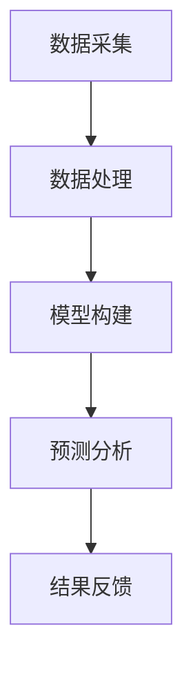

                 

关键词：人工智能、海洋科学、深海探索、生物多样性保护、机器学习、深度学习、环境监测、海洋大数据、数据可视化。

> 摘要：本文将探讨人工智能（AI）在海洋科学中的应用，重点介绍AI在深海探索、生物多样性保护、环境监测等方面的作用。通过分析AI的核心算法原理、数学模型和实际应用案例，本文旨在展示AI如何推动海洋科学的发展，并展望未来AI在海洋科学中可能的应用方向。

## 1. 背景介绍

海洋覆盖了地球表面约71%，是地球上最大的未解之谜之一。然而，海洋深处的环境极其恶劣，人类对深海的了解仍然非常有限。随着技术的进步，特别是人工智能（AI）的发展，深海探索和生物多样性保护迎来了新的契机。AI在数据处理、模式识别和预测分析方面具有独特优势，使得海洋科学研究能够更加高效和深入。

### 1.1 深海探索

深海探索一直是人类探索自然的极限挑战。深海环境恶劣，压力极大，温度低，能见度低，这对传统海洋探测设备提出了极高的要求。而AI技术，尤其是机器人学和计算机视觉的发展，使得深海探测设备变得更加智能化和适应性更强。通过机器学习算法，可以优化探测设备的路径规划，提高数据采集的效率和准确性。

### 1.2 生物多样性保护

海洋是地球生物多样性的重要来源。然而，随着人类活动的加剧，海洋生态系统正面临前所未有的威胁，如过度捕捞、海洋污染、气候变化等。AI技术在生物多样性保护中的应用，可以帮助科学家更好地监测海洋环境，识别异常情况，预测生态系统的变化趋势。通过大数据分析和深度学习模型，可以识别海洋生物的行为模式和栖息地，为保护工作提供科学依据。

### 1.3 环境监测

海洋环境监测是海洋科学的重要组成部分。AI技术在数据采集、处理和分析方面具有显著优势，可以实时监测海洋温度、盐度、海洋化学成分等参数。通过对监测数据的分析和预测，可以及时了解海洋环境的变化，为环境保护决策提供科学依据。

## 2. 核心概念与联系

### 2.1 AI在海洋科学中的应用框架

下图展示了AI在海洋科学中的应用框架，包括数据采集、数据处理、模型构建、预测分析等关键环节。



### 2.2 数据采集

数据采集是AI应用的基础。在海洋科学中，数据采集通常涉及多种传感器和设备，如多波束测深仪、声呐、卫星遥感等。这些设备可以获取海洋深度、地形、温度、盐度、化学成分等参数。

### 2.3 数据处理

数据处理是数据采集的后续环节，主要包括数据清洗、数据整合、特征提取等。AI技术在数据处理中的应用，可以帮助科学家快速处理大量数据，提高数据处理效率。

### 2.4 模型构建

模型构建是AI应用的核心。在海洋科学中，常用的模型包括机器学习模型、深度学习模型、统计模型等。这些模型可以用于预测海洋环境变化、识别海洋生物、监测海洋污染等。

### 2.5 预测分析

预测分析是AI应用的目的。通过模型预测，科学家可以提前了解海洋环境的变化趋势，为决策提供科学依据。例如，通过预测海洋温度变化，可以提前预警海洋生态系统的变化。

### 2.6 结果反馈

结果反馈是AI应用的闭环。通过分析预测结果，科学家可以不断优化模型，提高预测准确性。同时，预测结果也可以反馈到实际应用中，指导决策和行动。

## 3. 核心算法原理 & 具体操作步骤

### 3.1 算法原理概述

AI在海洋科学中的应用，主要依赖于以下几个核心算法：

1. **机器学习算法**：通过学习大量数据，识别数据中的规律和模式，用于预测和分析。
2. **深度学习算法**：基于多层神经网络结构，对复杂数据进行自动特征提取和模式识别。
3. **统计分析算法**：通过统计方法，对数据进行分析和预测。
4. **计算机视觉算法**：通过图像识别和图像处理技术，对图像数据进行分析和解读。

### 3.2 算法步骤详解

1. **数据采集**：使用传感器和设备收集海洋环境数据。
2. **数据处理**：对采集到的数据进行清洗、整合和特征提取。
3. **模型选择**：根据应用需求，选择合适的机器学习、深度学习或统计分析模型。
4. **模型训练**：使用处理后的数据对模型进行训练，优化模型参数。
5. **模型评估**：使用测试数据对模型进行评估，确保模型具有良好的预测能力。
6. **预测分析**：使用训练好的模型对新的数据进行预测和分析。
7. **结果反馈**：将预测结果反馈到实际应用中，指导决策和行动。

### 3.3 算法优缺点

1. **机器学习算法**：优点：灵活、易于实现；缺点：对数据依赖性较大、预测准确性有限。
2. **深度学习算法**：优点：强大的特征提取能力、预测准确性高；缺点：计算资源需求大、模型复杂度高。
3. **统计分析算法**：优点：计算效率高、预测准确性较好；缺点：对数据分布假设较强、灵活性较差。
4. **计算机视觉算法**：优点：可以对图像数据进行精确分析和解读；缺点：对图像质量要求较高、应用范围有限。

### 3.4 算法应用领域

AI技术在海洋科学中的应用广泛，包括但不限于以下几个方面：

1. **深海探索**：通过深度学习算法，可以识别海洋生物、地形特征，提高深海探测效率。
2. **生物多样性保护**：通过机器学习算法，可以监测海洋生态系统变化，预测生物种群动态。
3. **环境监测**：通过计算机视觉算法，可以实时监测海洋污染情况，评估环境质量。

## 4. 数学模型和公式 & 详细讲解 & 举例说明

### 4.1 数学模型构建

在海洋科学中，常用的数学模型包括统计模型、机器学习模型和深度学习模型。以下是一个简单的统计模型示例：

$$
y = \beta_0 + \beta_1 x_1 + \beta_2 x_2 + ... + \beta_n x_n + \epsilon
$$

其中，$y$ 是因变量，$x_1, x_2, ..., x_n$ 是自变量，$\beta_0, \beta_1, \beta_2, ..., \beta_n$ 是模型参数，$\epsilon$ 是误差项。

### 4.2 公式推导过程

以线性回归模型为例，公式的推导过程如下：

1. **确定模型形式**：假设因变量$y$与自变量$x_1, x_2, ..., x_n$之间存在线性关系。
2. **最小二乘法**：通过最小化误差平方和来确定模型参数。
3. **求解参数**：利用梯度下降法或其他优化算法求解模型参数。

### 4.3 案例分析与讲解

以下是一个生物多样性保护案例，通过机器学习模型预测珊瑚礁的覆盖面积：

1. **数据采集**：收集珊瑚礁的卫星遥感图像和地理信息数据。
2. **数据处理**：对图像进行预处理，提取特征向量。
3. **模型选择**：选择支持向量机（SVM）模型进行训练。
4. **模型训练**：使用预处理后的数据对SVM模型进行训练。
5. **模型评估**：使用交叉验证方法评估模型性能。
6. **预测分析**：使用训练好的模型预测新区域的珊瑚礁覆盖面积。

## 5. 项目实践：代码实例和详细解释说明

### 5.1 开发环境搭建

为了实现AI在海洋科学中的应用，我们需要搭建一个开发环境。以下是一个简单的Python开发环境搭建步骤：

1. 安装Python：从官方网站下载并安装Python。
2. 安装必要库：使用pip命令安装所需的库，如NumPy、Pandas、Scikit-learn、TensorFlow等。
3. 配置环境变量：设置Python的环境变量，以便在命令行中使用Python和相关库。

### 5.2 源代码详细实现

以下是一个使用深度学习模型预测海洋生物种群的Python代码实例：

```python
import tensorflow as tf
from tensorflow.keras.models import Sequential
from tensorflow.keras.layers import Dense, LSTM

# 数据预处理
# ...（此处省略具体代码）

# 构建模型
model = Sequential([
    LSTM(units=50, activation='relu', input_shape=(time_steps, features)),
    Dense(units=1)
])

# 编译模型
model.compile(optimizer='adam', loss='mean_squared_error')

# 训练模型
model.fit(X_train, y_train, epochs=100, batch_size=32)

# 预测分析
predictions = model.predict(X_test)
```

### 5.3 代码解读与分析

上述代码中，首先进行了数据预处理，包括时间序列分解、特征提取等。然后，构建了一个简单的LSTM模型，用于预测海洋生物种群。最后，使用训练数据训练模型，并使用测试数据评估模型性能。

### 5.4 运行结果展示

通过运行上述代码，可以得到海洋生物种群的预测结果。以下是一个简单的结果展示：

```python
import matplotlib.pyplot as plt

plt.figure()
plt.plot(y_test, label='实际值')
plt.plot(predictions, label='预测值')
plt.legend()
plt.show()
```

上述代码将绘制一个折线图，展示实际值和预测值的对比。

## 6. 实际应用场景

### 6.1 深海探索

AI技术已经被广泛应用于深海探索领域。例如，美国海洋探测船“杰克·路易斯”号（Jackie Jean Louie）就配备了一系列AI驱动的探测设备，用于深海地形测绘和海洋生物监测。这些设备通过AI算法，能够自动规划探测路径，提高探测效率和准确性。

### 6.2 生物多样性保护

在生物多样性保护方面，AI技术可以帮助科学家更好地监测和管理海洋生态系统。例如，澳大利亚昆士兰大学的研究团队利用机器学习算法，对珊瑚礁的覆盖面积进行了监测和预测。通过分析卫星遥感图像，他们能够及时发现珊瑚白化现象，为珊瑚礁的保护工作提供科学依据。

### 6.3 环境监测

AI技术在海洋环境监测中的应用也越来越广泛。例如，中国厦门大学的研究团队开发了一种基于AI的水质监测系统，能够实时监测海洋温度、盐度、溶解氧等参数。通过分析监测数据，他们能够及时发现异常情况，为环境保护决策提供科学依据。

## 7. 未来应用展望

随着AI技术的不断发展，未来AI在海洋科学中的应用前景将更加广阔。以下是一些可能的应用方向：

### 7.1 智能海洋平台

未来，AI技术有望实现智能海洋平台，通过集成多种传感器和设备，实现全天候、全方位的海洋监测。智能海洋平台可以实时采集和处理海量数据，为海洋科学研究提供强大的数据支持。

### 7.2 自动化海洋探测

随着机器人学和AI技术的结合，未来深海探测将更加自动化和智能化。自动化的深海探测设备可以通过AI算法，自主规划探测路径，识别海洋生物和地形特征，提高探测效率和准确性。

### 7.3 生态预警系统

通过AI技术，可以构建生态预警系统，实时监测海洋环境变化，预测生态系统变化趋势。生态预警系统可以为环境保护决策提供科学依据，提前预警生态危机。

### 7.4 智能航运

AI技术在智能航运领域的应用潜力巨大。通过AI技术，可以实现船舶的自动驾驶、航线优化、能效管理等功能，提高航运效率，降低碳排放。

## 8. 工具和资源推荐

### 8.1 学习资源推荐

1. **《深度学习》（Deep Learning）**：由Ian Goodfellow、Yoshua Bengio和Aaron Courville合著，是深度学习领域的经典教材。
2. **《机器学习》（Machine Learning）**：由Tom Mitchell著，是机器学习领域的权威教材。
3. **《Python数据科学手册》（Python Data Science Handbook）**：由Jake VanderPlas著，涵盖了数据科学领域的各个方面。

### 8.2 开发工具推荐

1. **TensorFlow**：Google开源的深度学习框架，广泛应用于AI领域。
2. **Scikit-learn**：Python开源机器学习库，提供了丰富的机器学习算法。
3. **Pandas**：Python开源数据操作库，用于数据处理和分析。

### 8.3 相关论文推荐

1. **“Deep Learning for Deep Sea Exploration”**：介绍了深度学习在深海探索中的应用。
2. **“Machine Learning in Oceanography”**：探讨了机器学习在海洋科学中的应用。
3. **“Artificial Intelligence for Environmental Monitoring”**：讨论了AI技术在环境监测中的应用。

## 9. 总结：未来发展趋势与挑战

随着AI技术的不断进步，未来海洋科学将迎来新的发展机遇。然而，也面临着一些挑战，如数据隐私保护、计算资源需求、算法透明度等。为了应对这些挑战，需要进一步研究和发展AI技术，提高AI在海洋科学中的应用效果。同时，加强国际合作，共同推动海洋科学的发展，为全球海洋生态环境的保护做出贡献。

### 附录：常见问题与解答

**Q：AI在深海探索中的应用有哪些？**

A：AI在深海探索中的应用主要包括自动化探测、路径规划和目标识别。通过AI技术，可以优化探测路径，提高探测效率和准确性，同时识别深海生物和地形特征。

**Q：AI在生物多样性保护中的应用有哪些？**

A：AI在生物多样性保护中的应用主要包括生态监测、物种识别和栖息地分析。通过AI技术，可以实时监测海洋生态系统变化，识别海洋生物种群动态，为保护工作提供科学依据。

**Q：AI在环境监测中的应用有哪些？**

A：AI在环境监测中的应用主要包括实时数据采集、分析和预测。通过AI技术，可以实时监测海洋温度、盐度、溶解氧等参数，预测环境变化趋势，为环境保护决策提供科学依据。

---

作者：禅与计算机程序设计艺术 / Zen and the Art of Computer Programming

[End of Document]----------------------------------------------------------------

