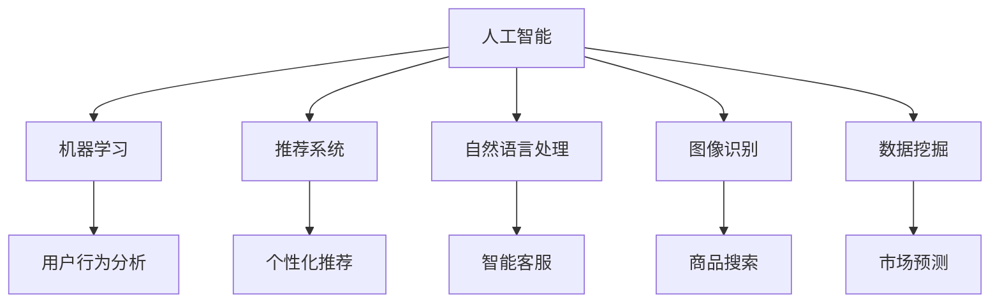

                 

关键词：人工智能、电商、机器学习、推荐系统、自然语言处理、图像识别、数据挖掘

> 摘要：本文将探讨人工智能（AI）在电商领域的广泛应用，包括推荐系统、自然语言处理、图像识别和数据挖掘等技术。我们将深入分析这些技术的原理和案例，展示AI如何提升电商用户体验和业务效率。

## 1. 背景介绍

随着互联网和移动设备的普及，电子商务已经成为全球商业的重要组成部分。电商平台的成功不仅仅依赖于商品的质量和价格，用户体验和个性化服务同样至关重要。人工智能技术为电商平台提供了强大的工具，通过数据分析和智能决策，可以大幅提升用户体验和业务效率。

### 1.1 人工智能在电商中的重要性

人工智能技术能够处理大量数据，从中提取有价值的信息，并基于这些信息做出智能决策。在电商领域，AI技术可以帮助实现个性化推荐、智能客服、库存管理、营销策略优化等功能，从而提高用户满意度和转化率。

### 1.2 人工智能的发展历程

自20世纪50年代人工智能概念提出以来，人工智能技术已经经历了多个发展阶段。特别是近年来，深度学习、大数据和云计算等技术的发展，使得人工智能在各个领域的应用变得更加广泛和深入。

## 2. 核心概念与联系

为了更好地理解AI在电商中的应用，我们首先需要介绍一些核心概念，并展示它们之间的联系。

### 2.1 人工智能（AI）

人工智能是指使计算机具备类似人类智能的技术，包括学习、推理、感知和自然语言处理等能力。

### 2.2 机器学习（ML）

机器学习是人工智能的一个分支，通过从数据中自动学习规律和模式，用于预测和决策。

### 2.3 推荐系统

推荐系统是一种基于用户行为和偏好的智能算法，用于向用户推荐相关商品或内容。

### 2.4 自然语言处理（NLP）

自然语言处理是使计算机能够理解、解释和生成人类语言的技术，广泛应用于智能客服和文本分析。

### 2.5 图像识别

图像识别是使计算机能够识别和分类图像内容的技术，广泛应用于商品搜索和图像广告。

### 2.6 数据挖掘

数据挖掘是从大量数据中发现有价值信息的过程，广泛应用于用户行为分析和市场预测。

### 2.7 Mermaid 流程图

以下是一个Mermaid流程图，展示了AI在电商中的核心概念和联系：

## 3. 核心算法原理 & 具体操作步骤

### 3.1 算法原理概述

在电商应用中，常用的AI算法包括机器学习算法、推荐系统算法、自然语言处理算法和图像识别算法。以下将分别介绍这些算法的原理。

### 3.2 算法步骤详解

#### 3.2.1 机器学习算法

1. 数据收集：收集用户行为数据，如浏览记录、购买记录等。
2. 数据预处理：对数据进行清洗、去重和转换。
3. 特征提取：从数据中提取有用的特征。
4. 模型训练：使用训练数据集训练机器学习模型。
5. 模型评估：使用测试数据集评估模型性能。
6. 模型部署：将训练好的模型部署到线上环境。

#### 3.2.2 推荐系统算法

1. 用户行为分析：分析用户的历史行为数据，如浏览、购买、收藏等。
2. 项

