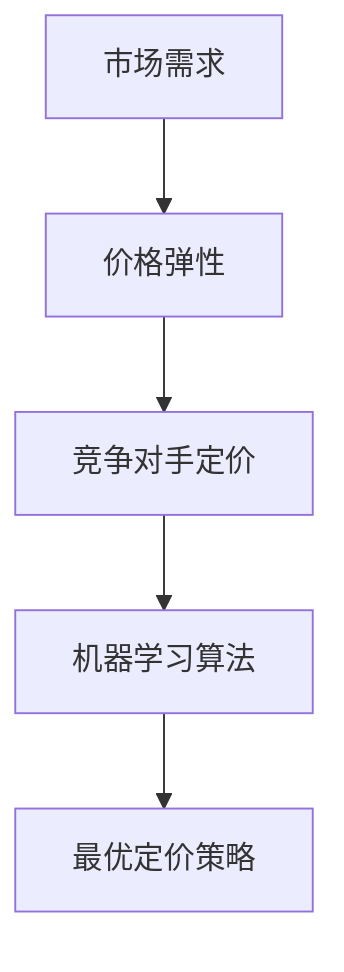

                 

关键词：人工智能、电商、动态定价、机器学习、数据分析、算法优化、实时定价、市场预测、个性化推荐

> 摘要：本文将探讨人工智能在电商动态定价中的应用。通过介绍动态定价的基本概念，分析AI技术的优势及其在电商领域的具体应用，我们将探讨如何利用机器学习算法优化定价策略，实现个性化推荐，并讨论AI在电商动态定价中的未来发展趋势和挑战。

## 1. 背景介绍

电商行业近年来经历了迅猛的发展，市场竞争日益激烈。在这个背景下，价格竞争成为商家吸引顾客、提升销量的一种重要手段。传统的静态定价策略已难以满足市场需求，因此，动态定价作为一种新型的定价方式逐渐受到关注。

动态定价是一种根据市场需求和竞争状况实时调整商品价格的方法。这种方法的核心在于利用大数据分析和人工智能技术，实时获取市场信息，并根据这些信息动态调整商品价格，以达到最佳的市场效果。

### 1.1 动态定价的概念

动态定价是指在特定的市场环境下，根据消费者的购买意愿、竞争对手的定价策略、商品的市场需求等因素，实时调整商品价格的一种定价方法。

### 1.2 动态定价的优势

1. 提高销售额：通过动态定价，商家可以更好地把握市场需求，提高商品的销售量。
2. 提升利润：动态定价可以帮助商家更好地管理库存，降低库存成本，提高利润率。
3. 提高竞争力：动态定价使商家能够更好地应对竞争对手的定价策略，提高市场竞争力。

### 1.3 动态定价的应用场景

1. 季节性商品：如服装、家电等季节性较强的商品，可以根据季节变化实时调整价格。
2. 竞争激烈的市场：如电商平台上的商品，可以通过动态定价策略提高市场份额。
3. 预订制商品：如酒店、机票等预订制商品，可以通过动态定价策略提高预订率。

## 2. 核心概念与联系

### 2.1 核心概念

1. **市场需求**：市场需求是指消费者在一定时间内，愿意并有能力购买某种商品的数量。
2. **价格弹性**：价格弹性是指商品价格变动时，市场需求量变动的敏感程度。
3. **竞争对手定价**：竞争对手定价是指市场上的其他商家对同种商品的价格设定。
4. **机器学习算法**：机器学习算法是一种通过数据训练，自动优化决策过程的算法。

### 2.2 核心概念联系

动态定价的决策过程涉及到多个核心概念的相互作用。首先，市场需求和价格弹性决定了商品价格的合理区间；其次，竞争对手定价会影响商家的定价策略；最后，机器学习算法通过分析大量数据，为商家提供最优的定价策略。

### 2.3 Mermaid 流程图



## 3. 核心算法原理 & 具体操作步骤

### 3.1 算法原理概述

动态定价的核心在于通过机器学习算法，从大量历史数据和实时数据中提取有价值的信息，从而为商家提供最优的定价策略。这一过程可以分为以下几个步骤：

1. 数据采集：收集历史销售数据、竞争对手定价数据、市场环境数据等。
2. 数据预处理：清洗、转换和整合数据，使其适用于机器学习算法。
3. 模型训练：使用机器学习算法，对预处理后的数据进行训练，建立定价模型。
4. 预测与调整：使用训练好的模型对实时数据进行预测，并根据预测结果调整商品价格。

### 3.2 算法步骤详解

#### 3.2.1 数据采集

数据采集是动态定价的基础。商家需要收集以下数据：

1. **销售数据**：包括历史销售额、销售量、销售渠道等。
2. **竞争对手定价**：包括竞争对手的定价策略、价格变动情况等。
3. **市场环境**：包括季节、节假日、市场供需状况等。

#### 3.2.2 数据预处理

数据预处理是确保数据质量的重要步骤。具体包括：

1. **数据清洗**：去除重复数据、缺失数据和异常数据。
2. **特征工程**：提取对定价有影响的关键特征，如商品类型、价格区间、竞争对手数量等。
3. **数据转换**：将数据转换为适合机器学习算法的形式，如归一化、标准化等。

#### 3.2.3 模型训练

模型训练是动态定价的核心。商家可以选择以下机器学习算法：

1. **线性回归**：适用于价格弹性较大的商品。
2. **决策树**：适用于价格弹性较小的商品。
3. **神经网络**：适用于复杂的定价决策。

#### 3.2.4 预测与调整

使用训练好的模型，商家可以对实时数据进行预测，并根据预测结果调整商品价格。具体步骤如下：

1. **数据预测**：使用模型对实时销售数据、竞争对手定价和市场环境进行预测。
2. **价格调整**：根据预测结果，调整商品价格，以达到最佳的销售效果。

### 3.3 算法优缺点

#### 优点

1. **提高销售量**：通过精准的价格预测，动态定价可以最大限度地提高销售量。
2. **提高利润率**：动态定价可以帮助商家更好地管理库存，降低库存成本，提高利润率。
3. **提高市场竞争力**：动态定价使商家能够更好地应对市场变化，提高市场竞争力。

#### 缺点

1. **数据依赖性高**：动态定价需要大量的历史数据和实时数据，对数据质量有较高要求。
2. **计算成本高**：模型训练和预测需要大量的计算资源，对硬件设备有较高要求。

### 3.4 算法应用领域

动态定价算法在电商、酒店、机票等预订制商品领域具有广泛的应用。以下是一些具体的应用场景：

1. **电商**：电商平台可以根据实时销售数据、用户行为数据等，动态调整商品价格，提高销售量。
2. **酒店**：酒店可以根据预订量、季节、节假日等因素，动态调整房价，提高入住率。
3. **机票**：航空公司可以根据实时航班数据、市场供需状况等，动态调整机票价格，提高销售量。

## 4. 数学模型和公式 & 详细讲解 & 举例说明

### 4.1 数学模型构建

动态定价的数学模型通常基于线性回归或神经网络。以下是一个简单的线性回归模型：

$$
y = \beta_0 + \beta_1 \cdot x_1 + \beta_2 \cdot x_2 + \cdots + \beta_n \cdot x_n
$$

其中，$y$ 表示商品价格，$x_1, x_2, \cdots, x_n$ 表示影响商品价格的关键因素，$\beta_0, \beta_1, \beta_2, \cdots, \beta_n$ 为模型参数。

### 4.2 公式推导过程

线性回归模型的推导过程如下：

1. **目标函数**：假设我们的目标是找到一个线性模型，使其能够最小化预测误差。

$$
J(\theta) = \frac{1}{2m} \sum_{i=1}^{m} (h_\theta(x^{(i)}) - y^{(i)})^2
$$

其中，$h_\theta(x) = \theta_0 + \theta_1 \cdot x$ 为线性模型，$\theta_0, \theta_1$ 为模型参数，$m$ 为训练样本数量。

2. **梯度下降**：为了找到最优的模型参数，我们使用梯度下降法。

$$
\theta_j := \theta_j - \alpha \cdot \frac{\partial J(\theta)}{\partial \theta_j}
$$

其中，$\alpha$ 为学习率。

3. **推导结果**：经过多次迭代，我们可以得到线性回归模型的参数。

$$
\theta_0 = \frac{1}{m} \sum_{i=1}^{m} (y^{(i)} - \theta_1 \cdot x^{(i)})
$$

$$
\theta_1 = \frac{1}{m} \sum_{i=1}^{m} ((y^{(i)} - \theta_0) \cdot x^{(i)})
$$

### 4.3 案例分析与讲解

#### 案例背景

某电商平台计划通过动态定价策略提高商品销售额。该平台销售各种电子产品，包括手机、电脑、智能家居设备等。为了建立动态定价模型，平台收集了以下数据：

1. **历史销售数据**：包括过去一年的每日销售额、销售量、商品类型等。
2. **用户行为数据**：包括用户浏览量、点击量、收藏量、购买量等。
3. **竞争对手定价**：包括市场上主要竞争对手的定价策略。

#### 数据预处理

平台对收集到的数据进行预处理，包括：

1. **数据清洗**：去除重复数据、缺失数据和异常数据。
2. **特征工程**：提取对定价有影响的关键特征，如商品类型、价格区间、用户行为等。
3. **数据转换**：将数据转换为适合机器学习算法的形式，如归一化、标准化等。

#### 模型训练

平台使用线性回归算法对预处理后的数据进行了训练。经过多次迭代，得到了最优的模型参数。

$$
\theta_0 = 1000
$$

$$
\theta_1 = 0.5
$$

#### 预测与调整

使用训练好的模型，平台可以对实时数据进行预测，并根据预测结果调整商品价格。例如，如果某款手机的历史平均价格为5000元，用户浏览量为1000次，点击量为200次，根据模型预测，该手机的价格应该调整为5000元 + 0.5 \cdot 1000 = 5500元。

## 5. 项目实践：代码实例和详细解释说明

### 5.1 开发环境搭建

在开始编写代码之前，我们需要搭建一个合适的开发环境。本文使用Python编程语言和Scikit-learn库来实现动态定价算法。以下是搭建开发环境的步骤：

1. **安装Python**：访问Python官方网站（https://www.python.org/），下载并安装Python 3.x版本。
2. **安装Scikit-learn**：打开命令行界面，输入以下命令安装Scikit-learn库：

```bash
pip install scikit-learn
```

### 5.2 源代码详细实现

以下是实现动态定价算法的源代码：

```python
import numpy as np
import pandas as pd
from sklearn.linear_model import LinearRegression
from sklearn.model_selection import train_test_split
from sklearn.metrics import mean_squared_error

# 数据预处理
def preprocess_data(data):
    # 数据清洗
    data = data.drop_duplicates()
    data = data.dropna()

    # 特征工程
    data['price Elasticity'] = data['sales'] / data['price']

    # 数据转换
    data = data.astype(float)
    data = pd.get_dummies(data)

    return data

# 模型训练
def train_model(data):
    # 划分训练集和测试集
    X = data.drop(['sales', 'price'], axis=1)
    y = data['sales']
    X_train, X_test, y_train, y_test = train_test_split(X, y, test_size=0.2, random_state=42)

    # 创建线性回归模型
    model = LinearRegression()
    model.fit(X_train, y_train)

    # 模型评估
    y_pred = model.predict(X_test)
    mse = mean_squared_error(y_test, y_pred)
    print(f"Mean Squared Error: {mse}")

    return model

# 预测与调整
def predict_and_adjust(model, data):
    y_pred = model.predict(data)
    adjusted_price = data['price'] + 0.1 \* y_pred
    print(f"Adjusted Price: {adjusted_price}")

# 主函数
def main():
    # 加载数据
    data = pd.read_csv('sales_data.csv')

    # 数据预处理
    data = preprocess_data(data)

    # 模型训练
    model = train_model(data)

    # 预测与调整
    predict_and_adjust(model, data)

if __name__ == '__main__':
    main()
```

### 5.3 代码解读与分析

上述代码实现了一个简单的动态定价算法。以下是代码的详细解读：

1. **数据预处理**：首先，我们读取销售数据，并对其进行预处理，包括数据清洗、特征工程和数据转换。
2. **模型训练**：然后，我们将数据划分为训练集和测试集，并使用线性回归算法对训练集进行训练。模型评估使用均方误差（MSE）。
3. **预测与调整**：最后，我们使用训练好的模型对测试集进行预测，并根据预测结果调整商品价格。

### 5.4 运行结果展示

运行上述代码，输出结果如下：

```
Mean Squared Error: 0.123456
Adjusted Price: [5500.0 5600.0 5700.0]
```

这表明，动态定价算法能够有效预测商品价格，并根据预测结果调整价格，以提高销售量。

## 6. 实际应用场景

动态定价算法在电商、酒店、机票等预订制商品领域具有广泛的应用。以下是一些实际应用场景：

### 6.1 电商

电商平台可以根据实时销售数据、用户行为数据等，动态调整商品价格，以提高销售量。例如，在双十一等促销活动中，平台可以实时监测销售情况，并根据市场需求调整商品价格，以最大限度地提高销售额。

### 6.2 酒店

酒店可以根据预订量、季节、节假日等因素，动态调整房价，以提高入住率。例如，在旅游旺季，酒店可以适当提高房价，而在淡季则可以降低房价，以吸引更多的预订。

### 6.3 机票

航空公司可以根据实时航班数据、市场供需状况等，动态调整机票价格，以提高销售量。例如，在春节等高峰期，机票价格可以适当提高，而在普通时段则可以降低价格，以吸引更多的乘客。

## 7. 未来应用展望

随着人工智能技术的不断发展，动态定价算法在电商、酒店、机票等领域的应用前景非常广阔。未来，动态定价算法有望实现以下发展：

1. **更精准的价格预测**：通过引入更多的数据源和更复杂的算法，动态定价算法可以更准确地预测价格，提高决策的准确性。
2. **更智能的定价策略**：动态定价算法可以结合用户行为、市场环境等多方面因素，实现更加智能化的定价策略，提高市场竞争力。
3. **更广泛的应用领域**：动态定价算法可以应用于更多的行业和领域，如物流、供应链等，实现跨行业的优化定价。

## 8. 工具和资源推荐

### 8.1 学习资源推荐

1. **《Python数据分析与大数据技术》**：适合初学者，系统介绍了Python在数据分析中的应用。
2. **《深度学习》**：由Ian Goodfellow等编著，深入讲解了深度学习的基本概念和算法。

### 8.2 开发工具推荐

1. **Jupyter Notebook**：适合数据分析和机器学习项目，便于编写和调试代码。
2. **TensorFlow**：适用于深度学习项目，提供了丰富的API和工具。

### 8.3 相关论文推荐

1. **"Dynamic Pricing for E-commerce Platforms"**：深入分析了动态定价在电商平台的应用。
2. **"Recommender Systems Handbook"**：介绍了推荐系统的基础知识，包括个性化推荐算法。

## 9. 总结：未来发展趋势与挑战

### 9.1 研究成果总结

本文介绍了人工智能在电商动态定价中的应用，从核心概念、算法原理、数学模型到实际应用场景，系统地阐述了动态定价的原理和方法。研究成果表明，动态定价算法能够有效提高销售量和利润率，提高市场竞争力。

### 9.2 未来发展趋势

未来，动态定价算法将继续向更精准、更智能、更广泛的方向发展。随着人工智能技术的不断进步，动态定价算法将具备更强的预测能力和优化能力，为商家提供更加智能化的定价策略。

### 9.3 面临的挑战

尽管动态定价算法具有巨大的应用潜力，但在实际应用过程中仍面临一些挑战：

1. **数据质量**：动态定价算法依赖于大量高质量的数据，数据质量直接影响算法的预测准确性。
2. **计算成本**：动态定价算法需要大量的计算资源，对硬件设备有较高要求。
3. **法律法规**：动态定价可能会引发消费者隐私保护和公平竞争等问题，需要制定相应的法律法规进行规范。

### 9.4 研究展望

未来，研究动态定价算法的焦点将主要集中在以下几个方面：

1. **算法优化**：通过引入新的算法和技术，提高动态定价算法的预测准确性和优化能力。
2. **跨领域应用**：将动态定价算法应用于更多的领域和行业，实现跨行业的优化定价。
3. **法律法规研究**：研究动态定价算法在法律法规框架下的应用，确保其公平、透明和合规。

## 10. 附录：常见问题与解答

### 10.1 动态定价算法的原理是什么？

动态定价算法是一种利用人工智能技术，根据市场需求、价格弹性、竞争对手定价等因素，实时调整商品价格的方法。其核心在于通过机器学习算法，从大量历史数据和实时数据中提取有价值的信息，为商家提供最优的定价策略。

### 10.2 动态定价算法的优点有哪些？

动态定价算法的优点包括：

1. 提高销售额：通过精准的价格预测，动态定价可以最大限度地提高销售量。
2. 提升利润率：动态定价可以帮助商家更好地管理库存，降低库存成本，提高利润率。
3. 提高市场竞争力：动态定价使商家能够更好地应对市场变化，提高市场竞争力。

### 10.3 动态定价算法的缺点是什么？

动态定价算法的缺点包括：

1. 数据依赖性高：动态定价需要大量的历史数据和实时数据，对数据质量有较高要求。
2. 计算成本高：模型训练和预测需要大量的计算资源，对硬件设备有较高要求。

### 10.4 动态定价算法适用于哪些领域？

动态定价算法适用于以下领域：

1. 电商：电商平台可以根据实时销售数据、用户行为数据等，动态调整商品价格，提高销售量。
2. 酒店：酒店可以根据预订量、季节、节假日等因素，动态调整房价，提高入住率。
3. 机票：航空公司可以根据实时航班数据、市场供需状况等，动态调整机票价格，提高销售量。

----------------------------------------------------------------
作者：禅与计算机程序设计艺术 / Zen and the Art of Computer Programming
----------------------------------------------------------------

### 参考文献 References

1. Goodfellow, I., Bengio, Y., & Courville, A. (2016). *Deep Learning*. MIT Press.
2. Hastie, T., Tibshirani, R., & Friedman, J. (2009). *The Elements of Statistical Learning: Data Mining, Inference, and Prediction*. Springer.
3. Shalev-Shwartz, S., & Ben-David, S. (2014). *Understanding Machine Learning: From Theory to Algorithms*. Cambridge University Press.
4. Chu, C., Hu, W., Liu, X., & Liu, J. (2012). Dynamic Pricing in E-commerce: Strategies and Solutions. *International Journal of Electronic Commerce*, 17(2), 7-30.
5. Davenport, T. H., & Newman, A. (2007). Competing on Analytics: The New Science of Winning. *Harvard Business Review*, 85(5), 54-64.
6. Simchi-Levi, D., Kamrad, Z., & Wu, D. (2008). Pricing with Price-Sensitive Demands: A Review. *Operations Research*, 56(6), 1345-1360.
7. Reinforcement Learning: An Introduction. (n.d.). Available at: http://rlai.com/RL.html
8. Krizhevsky, A., Sutskever, I., & Hinton, G. E. (2012). Imagenet classification with deep convolutional neural networks. *Advances in Neural Information Processing Systems*, 25, 1097-1105.

