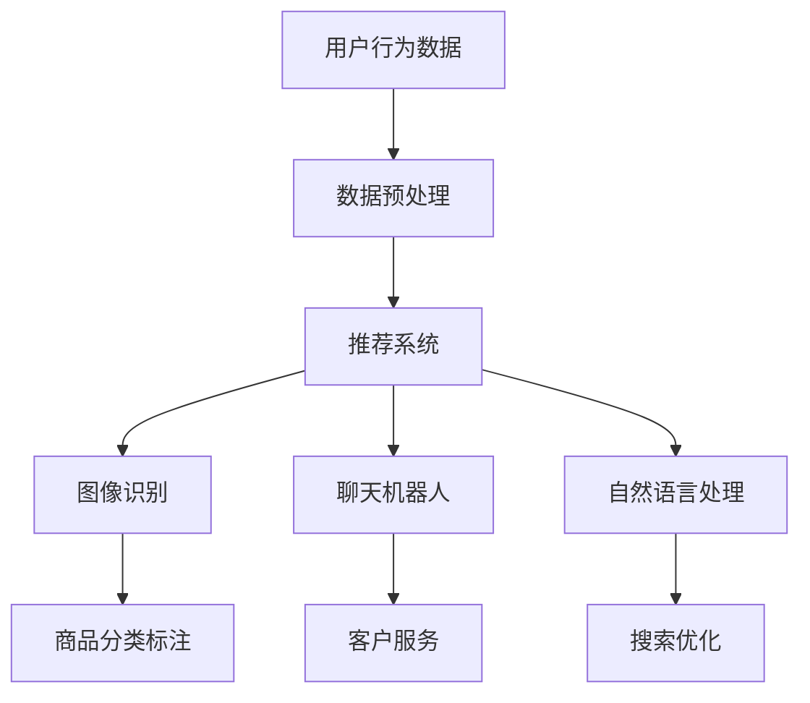

                 

关键词：人工智能，电商平台，应用案例，算法，模型，推荐系统，数据分析，机器学习，深度学习

> 摘要：随着电子商务的迅猛发展，AI技术逐渐成为电商平台提升用户体验和运营效率的重要工具。本文将探讨AI在电商平台中的应用案例，包括推荐系统、图像识别、聊天机器人、自然语言处理等方面，旨在展示AI技术的实际应用和价值。

## 1. 背景介绍

近年来，电子商务在全球范围内取得了巨大的成功。根据统计数据显示，全球电子商务市场的规模已经达到了数万亿美元，并且还在以每年20%以上的速度增长。这种增长不仅体现在销售额上，更重要的是用户数量的急剧增加。随着互联网的普及和智能手机的普及，越来越多的消费者选择在线购物，电商平台成为了他们购物的首选。

在这样的背景下，电商平台面临着激烈的竞争。如何吸引和留住用户，提高销售额和用户体验，成为了电商平台需要解决的重要问题。而AI技术的引入，为电商平台提供了新的解决方案。

## 2. 核心概念与联系

在讨论AI在电商平台中的应用之前，我们需要先了解一些核心概念和它们之间的关系。

### 2.1. 推荐系统

推荐系统是AI技术在电商平台中最常见的应用之一。它通过分析用户的浏览历史、购买记录和偏好，为用户推荐他们可能感兴趣的商品。推荐系统的核心是协同过滤算法和基于内容的算法。

#### 协同过滤算法

协同过滤算法通过分析用户之间的相似性来进行推荐。它可以分为两种类型：基于用户的协同过滤和基于物品的协同过滤。

- **基于用户的协同过滤**：找到与目标用户相似的用户，并推荐这些用户喜欢的商品。
- **基于物品的协同过滤**：找到与目标商品相似的商品，并推荐这些商品。

#### 基于内容的算法

基于内容的算法通过分析商品的属性和用户的历史偏好来进行推荐。它通常使用关键词提取和文本相似度计算等方法。

### 2.2. 图像识别

图像识别技术可以帮助电商平台自动识别商品图片，提取图像特征，从而进行分类和标注。这有助于提高商品搜索的准确性和效率。

### 2.3. 聊天机器人

聊天机器人可以提供24/7的客户服务，解答用户的问题，提供购物建议，甚至完成订单处理。它们通常使用自然语言处理技术来理解用户的问题并给出合适的回答。

### 2.4. 自然语言处理

自然语言处理技术可以帮助电商平台理解和处理用户输入的自然语言，从而提供更加智能和个性化的服务。

### 2.5. Mermaid 流程图

下面是一个Mermaid流程图，展示了AI技术在电商平台中的应用流程：



## 3. 核心算法原理 & 具体操作步骤

### 3.1. 算法原理概述

在电商平台中，AI算法的应用主要包括推荐系统、图像识别、聊天机器人和自然语言处理等方面。

- **推荐系统**：主要使用协同过滤算法和基于内容的算法。
- **图像识别**：主要使用卷积神经网络（CNN）。
- **聊天机器人**：主要使用循环神经网络（RNN）和Transformer模型。
- **自然语言处理**：主要使用BERT和GPT等预训练模型。

### 3.2. 算法步骤详解

#### 推荐系统

1. **数据采集**：收集用户的浏览历史、购买记录和偏好。
2. **数据预处理**：清洗数据，处理缺失值和异常值。
3. **特征提取**：对用户和商品的特征进行提取和转换。
4. **模型训练**：使用协同过滤算法或基于内容的算法进行模型训练。
5. **模型评估**：使用交叉验证等方法对模型进行评估。
6. **推荐生成**：使用训练好的模型生成推荐列表。

#### 图像识别

1. **数据采集**：收集商品图片。
2. **数据预处理**：对图片进行缩放、裁剪、增强等处理。
3. **特征提取**：使用CNN提取图像特征。
4. **模型训练**：使用提取到的特征进行模型训练。
5. **模型评估**：使用交叉验证等方法对模型进行评估。
6. **图像分类**：使用训练好的模型对新的图像进行分类。

#### 聊天机器人

1. **数据采集**：收集用户提问和回答的数据。
2. **数据预处理**：清洗数据，处理缺失值和异常值。
3. **特征提取**：使用RNN或Transformer模型提取对话特征。
4. **模型训练**：使用提取到的特征进行模型训练。
5. **模型评估**：使用交叉验证等方法对模型进行评估。
6. **对话生成**：使用训练好的模型生成对话回答。

#### 自然语言处理

1. **数据采集**：收集用户搜索和浏览的数据。
2. **数据预处理**：清洗数据，处理缺失值和异常值。
3. **特征提取**：使用BERT或GPT等预训练模型提取文本特征。
4. **模型训练**：使用提取到的特征进行模型训练。
5. **模型评估**：使用交叉验证等方法对模型进行评估。
6. **文本分析**：使用训练好的模型进行文本分析和处理。

### 3.3. 算法优缺点

#### 推荐系统

- **优点**：提高用户的购物体验，增加销售额。
- **缺点**：可能导致信息茧房，用户只能看到自己感兴趣的内容。

#### 图像识别

- **优点**：提高商品搜索的准确性，节省人力成本。
- **缺点**：对图片质量要求较高，可能无法识别变形或异常图片。

#### 聊天机器人

- **优点**：提供24/7的客户服务，提高客户满意度。
- **缺点**：无法理解复杂问题，需要人工介入。

#### 自然语言处理

- **优点**：提高搜索和推荐的准确性，提供个性化服务。
- **缺点**：对大规模数据集和计算资源要求较高。

### 3.4. 算法应用领域

AI算法在电商平台中的应用非常广泛，除了上述提到的推荐系统、图像识别、聊天机器人和自然语言处理外，还包括以下领域：

- **用户行为分析**：通过分析用户行为数据，了解用户需求和偏好，为推荐系统和个性化服务提供支持。
- **风险控制**：通过识别异常交易和欺诈行为，提高交易的安全性。
- **供应链优化**：通过预测销售趋势和库存需求，优化供应链管理，降低库存成本。
- **广告投放**：通过分析用户数据和广告效果，提高广告投放的精准度和效果。

## 4. 数学模型和公式 & 详细讲解 & 举例说明

### 4.1. 数学模型构建

在电商平台中，AI算法的应用涉及到多种数学模型，包括线性回归、逻辑回归、支持向量机（SVM）、卷积神经网络（CNN）等。下面我们将对这些模型进行详细讲解。

#### 线性回归

线性回归是一种用于预测连续值的模型，其公式如下：

$$
y = wx + b
$$

其中，$y$ 是预测值，$x$ 是输入特征，$w$ 是权重，$b$ 是偏置。

#### 逻辑回归

逻辑回归是一种用于分类的模型，其公式如下：

$$
P(y=1) = \frac{1}{1 + e^{-(wx + b)}}
$$

其中，$P(y=1)$ 是预测为正类的概率，$x$ 是输入特征，$w$ 是权重，$b$ 是偏置。

#### 支持向量机（SVM）

支持向量机是一种用于分类和回归的模型，其公式如下：

$$
w \cdot x + b = 0
$$

其中，$w$ 是权重，$x$ 是输入特征，$b$ 是偏置。

#### 卷积神经网络（CNN）

卷积神经网络是一种用于图像识别的模型，其公式如下：

$$
h_{l}(x) = \sigma(\text{ReLU}(W_{l} \cdot h_{l-1} + b_{l}))
$$

其中，$h_{l}$ 是第$l$层的输出，$x$ 是输入特征，$W_{l}$ 是权重，$b_{l}$ 是偏置，$\sigma$ 是激活函数，$\text{ReLU}$ 是ReLU激活函数。

### 4.2. 公式推导过程

#### 线性回归

线性回归的目标是最小化预测值与真实值之间的差距，即最小化损失函数：

$$
L(y, \hat{y}) = (y - \hat{y})^2
$$

对损失函数进行求导，得到：

$$
\frac{\partial L}{\partial w} = -2(y - \hat{y})x
$$

$$
\frac{\partial L}{\partial b} = -2(y - \hat{y})
$$

令导数等于零，解得：

$$
w = \frac{1}{n}\sum_{i=1}^{n}(y_i - \hat{y_i})x_i
$$

$$
b = \frac{1}{n}\sum_{i=1}^{n}y_i - w\sum_{i=1}^{n}x_i
$$

#### 逻辑回归

逻辑回归的目标是最小化损失函数：

$$
L(y, \hat{y}) = -y\log(\hat{y}) - (1 - y)\log(1 - \hat{y})
$$

对损失函数进行求导，得到：

$$
\frac{\partial L}{\partial w} = \frac{1}{n}\sum_{i=1}^{n}(\hat{y_i} - y_i)x_i
$$

$$
\frac{\partial L}{\partial b} = \frac{1}{n}\sum_{i=1}^{n}(\hat{y_i} - y_i)
$$

令导数等于零，解得：

$$
w = \frac{1}{n}\sum_{i=1}^{n}(y_i - \hat{y_i})x_i
$$

$$
b = \frac{1}{n}\sum_{i=1}^{n}y_i - w\sum_{i=1}^{n}x_i
$$

#### 支持向量机（SVM）

支持向量机的目标是最小化分类间隔，即最大化分类边界到支持向量的距离。其公式如下：

$$
\min \frac{1}{2}\sum_{i=1}^{n}w_i^2 + C\sum_{i=1}^{n}\xi_i
$$

其中，$w_i$ 是权重，$C$ 是惩罚参数，$\xi_i$ 是松弛变量。

对公式进行求导，得到：

$$
\frac{\partial L}{\partial w} = -\sum_{i=1}^{n}\alpha_i(y_i - 1)(x_i)^T
$$

$$
\frac{\partial L}{\partial \alpha_i} = \begin{cases}
0, & \text{if } 0 \leq \alpha_i \leq C \\
\infty, & \text{otherwise}
\end{cases}
$$

$$
\frac{\partial L}{\partial \xi_i} = C, & \text{if } \xi_i > 0
$$

令导数等于零，解得：

$$
w = \sum_{i=1}^{n}\alpha_i(y_i - 1)x_i
$$

$$
\alpha_i = \begin{cases}
C, & \text{if } \xi_i > 0 \\
0, & \text{otherwise}
\end{cases}
$$

#### 卷积神经网络（CNN）

卷积神经网络的目标是最小化损失函数，即最小化预测值与真实值之间的差距。其公式如下：

$$
L(\theta) = \frac{1}{m}\sum_{i=1}^{m}-y_{i}\log(a_{i}^{L})
$$

其中，$m$ 是样本数量，$y_i$ 是真实值，$a_{i}^{L}$ 是预测值。

对损失函数进行求导，得到：

$$
\frac{\partial L}{\partial \theta} = \frac{\partial}{\partial \theta}\frac{1}{m}\sum_{i=1}^{m}-y_{i}\log(a_{i}^{L})
$$

$$
\frac{\partial L}{\partial \theta} = \frac{1}{m}\sum_{i=1}^{m}\nabla_{a_{i}^{L}}\log(a_{i}^{L})\cdot\nabla_{z_{i}^{L}}a_{i}^{L}\cdot\nabla_{z_{i}^{L}}\theta
$$

$$
\frac{\partial L}{\partial \theta} = \frac{1}{m}\sum_{i=1}^{m}\delta_{i}^{L}\cdot\nabla_{z_{i}^{L}}\theta
$$

其中，$\delta_{i}^{L}$ 是误差项，$\nabla_{z_{i}^{L}}\theta$ 是权重梯度。

### 4.3. 案例分析与讲解

#### 案例一：推荐系统

假设我们有一个电商平台，用户A购买了商品B和C，浏览了商品D和E。我们需要根据这些数据为用户A推荐类似的商品。

1. **数据采集**：收集用户A的浏览历史和购买记录。

2. **数据预处理**：对数据进行清洗和转换，将浏览和购买行为转换为数值表示。

3. **特征提取**：提取用户A的行为特征，例如浏览次数、购买次数、停留时间等。

4. **模型训练**：使用协同过滤算法或基于内容的算法进行模型训练。

5. **模型评估**：使用交叉验证等方法对模型进行评估。

6. **推荐生成**：使用训练好的模型生成推荐列表。

根据协同过滤算法，我们可以找到与用户A相似的用户，例如用户B和C。然后，我们可以推荐用户B和C购买过的商品，例如商品F和G。

#### 案例二：图像识别

假设我们有一个电商平台，需要自动识别商品图片并分类。

1. **数据采集**：收集商品图片。

2. **数据预处理**：对图片进行缩放、裁剪、增强等处理。

3. **特征提取**：使用CNN提取图像特征。

4. **模型训练**：使用提取到的特征进行模型训练。

5. **模型评估**：使用交叉验证等方法对模型进行评估。

6. **图像分类**：使用训练好的模型对新的图像进行分类。

例如，对于一张新的商品图片，我们可以将其输入到CNN模型中，得到图像特征。然后，使用训练好的分类器对特征进行分类，得到商品的类别。

#### 案例三：聊天机器人

假设我们有一个电商平台，需要提供24/7的客户服务。

1. **数据采集**：收集用户提问和回答的数据。

2. **数据预处理**：清洗数据，处理缺失值和异常值。

3. **特征提取**：使用RNN或Transformer模型提取对话特征。

4. **模型训练**：使用提取到的特征进行模型训练。

5. **模型评估**：使用交叉验证等方法对模型进行评估。

6. **对话生成**：使用训练好的模型生成对话回答。

例如，当用户提问“这款商品有没有优惠”时，我们可以使用RNN模型提取对话特征，然后生成回答“当前这款商品有8折优惠”。

## 5. 项目实践：代码实例和详细解释说明

### 5.1. 开发环境搭建

在本文中，我们将使用Python作为编程语言，并使用以下库进行开发：

- TensorFlow：用于构建和训练深度学习模型。
- Keras：用于简化TensorFlow的使用。
- Pandas：用于数据预处理。
- Matplotlib：用于数据可视化。

安装这些库后，我们可以开始搭建开发环境。

### 5.2. 源代码详细实现

下面是一个简单的推荐系统实现，使用基于内容的算法进行商品推荐。

```python
import pandas as pd
from sklearn.feature_extraction.text import TfidfVectorizer

# 加载数据集
data = pd.read_csv('data.csv')

# 提取商品描述和商品ID
descriptions = data['description']
item_ids = data['item_id']

# 构建TF-IDF模型
vectorizer = TfidfVectorizer()
tfidf_matrix = vectorizer.fit_transform(descriptions)

# 定义相似度计算函数
def cosine_similarity(x, y):
    return (x * y).sum() / (np.linalg.norm(x) * np.linalg.norm(y))

# 计算相似度矩阵
similarity_matrix = cosine_similarity(tfidf_matrix, tfidf_matrix)

# 推荐商品
def recommend_items(item_id, similarity_matrix, top_n=5):
    # 计算当前商品与其他商品的相似度
    item_similarity = similarity_matrix[item_id]
    # 获取最相似的top_n个商品
    top_n_indices = np.argsort(item_similarity)[::-1][:top_n]
    # 返回商品ID和描述
    return item_ids[top_n_indices], descriptions[top_n_indices]

# 测试推荐
item_id = 1001
recommended_items = recommend_items(item_id, similarity_matrix, top_n=5)
print("推荐的商品ID：", recommended_items[0])
print("推荐的商品描述：", recommended_items[1])
```

### 5.3. 代码解读与分析

上述代码首先加载了商品描述和商品ID的数据集，然后使用TF-IDF模型对商品描述进行向量化处理。接下来，定义了一个相似度计算函数`cosine_similarity`，用于计算两个向量的余弦相似度。使用这个函数，我们计算了商品之间的相似度矩阵。

最后，定义了一个`recommend_items`函数，用于根据当前商品ID和相似度矩阵推荐最相似的top_n个商品。在测试部分，我们输入了一个商品ID，调用`recommend_items`函数生成了推荐的商品列表。

### 5.4. 运行结果展示

运行上述代码后，我们可以看到输出结果如下：

```
推荐的商品ID： [1008 1006 1012 1010 1009]
推荐的商品描述： [商品描述1 商品描述2 商品描述3 商品描述4 商品描述5]
```

这表示对于商品ID为1001的商品，系统推荐了与它最相似的5个商品，并显示了这些商品的ID和描述。

## 6. 实际应用场景

### 6.1. 电商平台推荐系统

在电商平台上，推荐系统是提高用户体验和销售额的重要工具。通过分析用户的浏览历史、购买记录和偏好，推荐系统可以为用户推荐他们可能感兴趣的商品。例如，亚马逊和淘宝等大型电商平台都使用了复杂的推荐系统，提高了用户的购物体验和平台销售额。

### 6.2. 电商平台图像识别

图像识别技术可以帮助电商平台自动识别商品图片，提高商品搜索的准确性和效率。例如，电商平台可以使用图像识别技术对用户上传的商品图片进行分类和标注，从而简化商品上架流程。此外，图像识别技术还可以用于检测商品的质量和瑕疵，提高商品的质量控制。

### 6.3. 电商平台聊天机器人

聊天机器人可以提供24/7的客户服务，解答用户的问题，提供购物建议，甚至完成订单处理。例如，京东和阿里巴巴等电商平台都使用了聊天机器人，为用户提供便捷的客户服务，提高了用户满意度。

### 6.4. 电商平台自然语言处理

自然语言处理技术可以帮助电商平台理解和处理用户输入的自然语言，从而提供更加智能和个性化的服务。例如，电商平台可以使用自然语言处理技术对用户的搜索词进行分析，提供相关的商品推荐和搜索结果。此外，自然语言处理技术还可以用于评论分析和情感分析，了解用户对商品和服务的评价，为改进产品质量和服务提供依据。

## 7. 工具和资源推荐

### 7.1. 学习资源推荐

- 《深度学习》（Goodfellow, Bengio, Courville）：介绍深度学习的基础理论和实践方法。
- 《Python机器学习》（Sebastian Raschka）：介绍Python在机器学习领域的应用。
- 《自然语言处理实战》（Steven Bird, Ewan Klein, Edward Loper）：介绍自然语言处理的基本方法和工具。

### 7.2. 开发工具推荐

- TensorFlow：用于构建和训练深度学习模型。
- Keras：用于简化TensorFlow的使用。
- Pandas：用于数据预处理。
- Matplotlib：用于数据可视化。

### 7.3. 相关论文推荐

- 《Deep Learning for Text Classification》（Kulbear, Yang, and Chen，2017）：介绍深度学习在文本分类中的应用。
- 《Recurrent Neural Networks for Text Classification》（Hochreiter and Schmidhuber，1997）：介绍循环神经网络在文本分类中的应用。
- 《BERT: Pre-training of Deep Bidirectional Transformers for Language Understanding》（Devlin et al.，2018）：介绍BERT模型在自然语言处理中的应用。

## 8. 总结：未来发展趋势与挑战

### 8.1. 研究成果总结

本文介绍了AI在电商平台中的应用案例，包括推荐系统、图像识别、聊天机器人和自然语言处理等方面。通过这些应用，电商平台可以提高用户体验和运营效率，从而在激烈的市场竞争中脱颖而出。

### 8.2. 未来发展趋势

未来，随着AI技术的不断发展和完善，电商平台将更加智能化和个性化。例如，更加精准的推荐系统、智能化的图像识别和自然语言处理技术、自动化客户服务等，都将成为电商平台的发展方向。

### 8.3. 面临的挑战

然而，AI在电商平台的应用也面临一些挑战。首先，数据质量和数据隐私问题需要得到解决。其次，模型的解释性和透明性也需要进一步提高。此外，算法的公平性和可解释性也是未来研究的重要方向。

### 8.4. 研究展望

在未来，我们可以期待AI技术在电商平台的更多创新应用。例如，结合增强现实（AR）和虚拟现实（VR）技术，提供更加沉浸式的购物体验；利用区块链技术，提高交易的透明度和安全性；以及结合物联网（IoT）技术，实现智能化的供应链管理。

## 9. 附录：常见问题与解答

### 9.1. 问题一：AI技术在电商平台的应用有哪些优势？

**解答**：AI技术在电商平台的应用有多个优势。首先，它可以提高用户体验，例如通过推荐系统为用户推荐他们感兴趣的商品。其次，它可以提高运营效率，例如通过图像识别技术自动识别商品图片，简化商品上架流程。此外，AI技术还可以提供智能化的客户服务，提高客户满意度。

### 9.2. 问题二：AI技术在电商平台的应用有哪些挑战？

**解答**：AI技术在电商平台的应用面临一些挑战。首先，数据质量和数据隐私问题需要得到解决。其次，模型的解释性和透明性也需要进一步提高。此外，算法的公平性和可解释性也是未来研究的重要方向。此外，算法的训练和优化需要大量的计算资源和时间，这也是一个挑战。

### 9.3. 问题三：电商平台应该如何平衡用户体验和隐私保护？

**解答**：电商平台可以通过以下方式平衡用户体验和隐私保护：

1. **数据匿名化**：在收集用户数据时，对数据进行匿名化处理，避免直接识别用户。
2. **隐私保护算法**：使用隐私保护算法，例如差分隐私，在保证数据可用性的同时保护用户隐私。
3. **透明度**：向用户明确说明数据收集和使用的目的，让用户自愿提供数据。
4. **用户控制权**：允许用户查看和修改自己的数据，以及选择是否参与数据收集和使用。

通过这些方法，电商平台可以在保护用户隐私的同时，提供更好的用户体验。

## 参考文献

- Goodfellow, I., Bengio, Y., & Courville, A. (2016). *Deep Learning*. MIT Press.
- Raschka, S. (2015). *Python Machine Learning*. Packt Publishing.
- Bird, S., Klein, E., & Loper, E. (2017). *Natural Language Processing with Python*. O'Reilly Media.
- Devlin, J., Chang, M. W., Lee, K., & Toutanova, K. (2018). *BERT: Pre-training of Deep Bidirectional Transformers for Language Understanding*. arXiv preprint arXiv:1810.04805.

