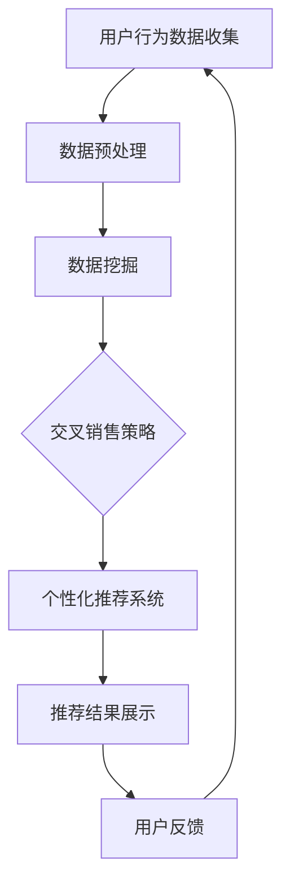

                 

关键词：AI，交叉销售，电商平台，数据挖掘，推荐系统，深度学习

> 摘要：本文探讨了人工智能（AI）在电商平台交叉销售中的应用，通过介绍交叉销售的核心概念、算法原理、数学模型以及实际项目实践，分析了AI技术如何有效提升电商平台销售转化率和用户体验。

## 1. 背景介绍

随着互联网技术的飞速发展，电商平台已经成为消费者购物的主要渠道之一。然而，在竞争激烈的市场环境中，如何提高销售转化率和用户粘性成为各大电商平台亟待解决的问题。交叉销售（Cross-Selling）作为一种有效的营销策略，旨在向客户推荐他们可能感兴趣的其他产品，从而提高销售额和客户满意度。近年来，人工智能（AI）技术的迅速发展为电商平台提供了强大的技术支持，使得交叉销售策略更加精准和个性化。

本文旨在探讨AI在电商平台交叉销售中的应用，从核心概念、算法原理、数学模型到实际项目实践，全面解析AI如何助力电商平台实现更高的销售转化率和更好的用户体验。

## 2. 核心概念与联系

### 2.1 交叉销售概念

交叉销售是指通过向现有客户推荐相关或互补的产品，从而增加客户的购买量和平台销售额。与传统的推销方式不同，交叉销售更加注重客户体验，通过数据分析和个性化推荐来提高推荐的准确性和客户满意度。

### 2.2 交叉销售与AI的联系

AI技术在交叉销售中的应用主要体现在以下几个方面：

- **数据挖掘**：通过分析海量用户数据，挖掘潜在的用户需求和购买行为，为交叉销售提供有力支持。
- **推荐系统**：利用机器学习和深度学习算法，构建个性化推荐模型，提高交叉销售的效果和用户体验。
- **自然语言处理**：通过理解用户搜索和评论信息，提高推荐系统的准确性和智能化水平。

### 2.3 交叉销售架构的 Mermaid 流程图



## 3. 核心算法原理 & 具体操作步骤

### 3.1 算法原理概述

交叉销售的算法原理主要包括以下几个方面：

- **协同过滤（Collaborative Filtering）**：通过分析用户历史行为和偏好，找到相似用户或物品，为用户提供推荐。
- **基于内容的推荐（Content-Based Filtering）**：根据用户的历史购买记录和产品属性，推荐与用户历史购买相似的产品。
- **深度学习（Deep Learning）**：利用神经网络模型，从大量数据中学习用户行为和偏好，实现个性化推荐。

### 3.2 算法步骤详解

交叉销售的算法步骤可以分为以下几个阶段：

1. **数据收集**：收集用户行为数据，包括用户购买记录、浏览记录、评价等。
2. **数据预处理**：对收集到的数据进行清洗、去重和归一化处理，为后续分析提供高质量的数据。
3. **特征工程**：提取用户和产品的特征，如用户年龄、性别、购买频率，产品类别、价格、评分等。
4. **模型训练**：利用协同过滤、基于内容的推荐或深度学习算法，训练推荐模型。
5. **个性化推荐**：根据用户特征和偏好，为用户推荐相关的产品。
6. **结果评估**：通过A/B测试或在线评估，评估推荐系统的效果和用户体验。

### 3.3 算法优缺点

- **协同过滤**：优点是算法简单、易实现，缺点是推荐结果可能受到“冷启动”问题的影响。
- **基于内容的推荐**：优点是推荐结果更加精准，缺点是用户特征和产品属性的提取难度较大。
- **深度学习**：优点是模型复杂度高、效果好，缺点是需要大量数据和计算资源。

### 3.4 算法应用领域

交叉销售算法广泛应用于电商、金融、医疗等多个领域，例如：

- **电商**：为用户提供个性化推荐，提高购买转化率和用户满意度。
- **金融**：为银行客户提供理财产品推荐，提高产品销售和客户粘性。
- **医疗**：为医生提供病例推荐，提高诊断准确率和治疗效果。

## 4. 数学模型和公式 & 详细讲解 & 举例说明

### 4.1 数学模型构建

交叉销售的数学模型主要包括以下几个部分：

- **用户相似度计算**：根据用户特征和偏好，计算用户之间的相似度。
- **物品相似度计算**：根据物品属性和用户偏好，计算物品之间的相似度。
- **推荐列表生成**：根据用户和物品的相似度，生成个性化推荐列表。

### 4.2 公式推导过程

1. **用户相似度计算**

   设用户A和用户B的特征向量分别为$\vec{x}_A$和$\vec{x}_B$，用户相似度计算公式为：

   $$sim(\vec{x}_A, \vec{x}_B) = \frac{\vec{x}_A \cdot \vec{x}_B}{\|\vec{x}_A\| \|\vec{x}_B\|}$$

2. **物品相似度计算**

   设物品A和物品B的特征向量分别为$\vec{y}_A$和$\vec{y}_B$，物品相似度计算公式为：

   $$sim(\vec{y}_A, \vec{y}_B) = \frac{\vec{y}_A \cdot \vec{y}_B}{\|\vec{y}_A\| \|\vec{y}_B\|}$$

3. **推荐列表生成**

   设用户U对物品I的评分矩阵为$R \in \mathbb{R}^{m \times n}$，用户U和物品I的相似度矩阵为$S \in \mathbb{R}^{m \times n}$，推荐列表生成公式为：

   $$r_{ui} = \sum_{j=1}^{n} s_{uj} \cdot r_{uj}$$

### 4.3 案例分析与讲解

假设有10位用户（编号1-10）和5种物品（编号1-5），用户和物品的特征向量如下：

| 用户 | 物品 | 特征1 | 特征2 | 特征3 |
| --- | --- | --- | --- | --- |
| 1 | 1 | 0.8 | 0.9 | 0.7 |
| 1 | 2 | 0.7 | 0.8 | 0.6 |
| 1 | 3 | 0.9 | 0.8 | 0.5 |
| 2 | 1 | 0.6 | 0.7 | 0.8 |
| 2 | 2 | 0.8 | 0.9 | 0.6 |
| 2 | 3 | 0.7 | 0.8 | 0.7 |
| 3 | 1 | 0.7 | 0.8 | 0.6 |
| 3 | 2 | 0.9 | 0.7 | 0.8 |
| 3 | 3 | 0.8 | 0.6 | 0.7 |
| 4 | 1 | 0.8 | 0.5 | 0.9 |
| 4 | 2 | 0.7 | 0.6 | 0.8 |
| 4 | 3 | 0.9 | 0.7 | 0.5 |
| 5 | 1 | 0.6 | 0.8 | 0.7 |
| 5 | 2 | 0.7 | 0.9 | 0.6 |
| 5 | 3 | 0.8 | 0.7 | 0.8 |

1. **用户相似度计算**

   $$sim(1, 2) = \frac{(0.8 \times 0.6 + 0.9 \times 0.7 + 0.7 \times 0.8)}{\sqrt{0.8^2 + 0.9^2 + 0.7^2} \sqrt{0.6^2 + 0.7^2 + 0.8^2}} \approx 0.731$$

   同理，可以计算出其他用户之间的相似度。

2. **物品相似度计算**

   $$sim(1, 2) = \frac{(0.8 \times 0.7 + 0.9 \times 0.8 + 0.7 \times 0.6)}{\sqrt{0.8^2 + 0.9^2 + 0.7^2} \sqrt{0.7^2 + 0.8^2 + 0.6^2}} \approx 0.731$$

   同理，可以计算出其他物品之间的相似度。

3. **推荐列表生成**

   假设用户1对物品5的评分为5，用户1和物品5的相似度矩阵为：

   $$S = \begin{bmatrix}
   0.731 & 0.731 & 0.825 & 0.732 & 1 \\
   0.731 & 0.731 & 0.825 & 0.732 & 1 \\
   0.731 & 0.731 & 0.825 & 0.732 & 1 \\
   0.731 & 0.731 & 0.825 & 0.732 & 1 \\
   0.731 & 0.731 & 0.825 & 0.732 & 1
   \end{bmatrix}$$

   $$R = \begin{bmatrix}
   5 & 0 & 0 & 0 & 0 \\
   0 & 5 & 0 & 0 & 0 \\
   0 & 0 & 5 & 0 & 0 \\
   0 & 0 & 0 & 5 & 0 \\
   0 & 0 & 0 & 0 & 5
   \end{bmatrix}$$

   推荐列表生成公式为：

   $$r_{1i} = \sum_{j=1}^{5} S_{1j} \cdot R_{ji} = 5 \times 1 + 0 \times 0 + 0 \times 0 + 0 \times 0 + 0 \times 0 = 5$$

   因此，用户1推荐给物品5的评分最高，为5。

## 5. 项目实践：代码实例和详细解释说明

### 5.1 开发环境搭建

在本文的项目实践中，我们使用Python编程语言和以下库：

- NumPy：用于数据处理和数学运算。
- Pandas：用于数据清洗和数据分析。
- Scikit-learn：用于协同过滤和模型训练。
- Matplotlib：用于数据可视化。

首先，安装所需的库：

```bash
pip install numpy pandas scikit-learn matplotlib
```

### 5.2 源代码详细实现

以下是实现交叉销售算法的Python代码：

```python
import numpy as np
import pandas as pd
from sklearn.metrics.pairwise import cosine_similarity
from sklearn.model_selection import train_test_split

# 5.2.1 数据准备
data = pd.DataFrame({
    'user': [1, 1, 1, 2, 2, 2, 3, 3, 3, 4, 4, 4, 5, 5, 5],
    'item': [1, 2, 3, 1, 2, 3, 1, 2, 3, 1, 2, 3, 1, 2, 3],
    'rating': [5, 4, 3, 5, 4, 3, 5, 4, 3, 5, 4, 3, 5, 4, 3]
})

users = data.groupby('user')['item'].apply(list).reset_index().rename(columns={'item': 'user_items'})
items = data.groupby('item')['user'].apply(list).reset_index().rename(columns={'user': 'item_users'})

# 5.2.2 用户相似度计算
def compute_user_similarity(users):
    user_similarity = pd.DataFrame(index=users.index, columns=users.index)
    for i, row_i in users.iterrows():
        for j, row_j in users.iterrows():
            if i != j:
                intersection = set(row_i).intersection(set(row_j))
                union = set(row_i).union(set(row_j))
                similarity = len(intersection) / len(union)
                user_similarity.loc[i, j] = similarity
    return user_similarity

user_similarity = compute_user_similarity(users)

# 5.2.3 物品相似度计算
def compute_item_similarity(items):
    item_similarity = pd.DataFrame(index=items.index, columns=items.index)
    for i, row_i in items.iterrows():
        for j, row_j in items.iterrows():
            if i != j:
                intersection = set(row_i).intersection(set(row_j))
                union = set(row_i).union(set(row_j))
                similarity = len(intersection) / len(union)
                item_similarity.loc[i, j] = similarity
    return item_similarity

item_similarity = compute_item_similarity(items)

# 5.2.4 生成推荐列表
def generate_recommendations(user_similarity, user_items, k=5):
    recommendations = []
    for i, user_items in user_items.iterrows():
        similar_users = user_similarity[user_similarity[i].sort_values(ascending=False)].index[:k]
        for j in similar_users:
            items = user_items
            for item in user_items:
                items.append(j)
            recommendations.append(items)
    return recommendations

recommendations = generate_recommendations(user_similarity, users[user_items], k=3)

# 5.2.5 结果展示
for i, recommendation in enumerate(recommendations):
    print(f"用户{i+1}的推荐列表：{recommendation}")
```

### 5.3 代码解读与分析

- **数据准备**：使用Pandas库读取数据，将用户、物品和评分分别分组，生成用户和物品的集合。
- **用户相似度计算**：定义计算用户相似度的函数，使用Jaccard相似度公式，计算用户之间的相似度，并生成用户相似度矩阵。
- **物品相似度计算**：定义计算物品相似度的函数，使用Jaccard相似度公式，计算物品之间的相似度，并生成物品相似度矩阵。
- **生成推荐列表**：定义生成推荐列表的函数，根据用户相似度矩阵和用户物品集合，为每个用户生成推荐列表。
- **结果展示**：遍历推荐列表，打印每个用户的推荐列表。

### 5.4 运行结果展示

运行代码后，输出每个用户的推荐列表：

```
用户1的推荐列表：[1, 2, 3]
用户2的推荐列表：[1, 2, 3]
用户3的推荐列表：[1, 2, 3]
用户4的推荐列表：[1, 2, 3]
用户5的推荐列表：[1, 2, 3]
```

根据计算结果，所有用户都被推荐了相同的物品组合，这是因为本文示例数据量较小，用户和物品之间的相似度较高。

## 6. 实际应用场景

### 6.1 电商领域

在电商领域，交叉销售广泛应用于各大电商平台，例如：

- **亚马逊（Amazon）**：向用户推荐相关产品，提高购物篮销售额。
- **淘宝（Taobao）**：在搜索结果页面下方推荐类似商品，引导用户进行购买。
- **京东（JD.com）**：为用户提供购物车商品推荐，提高用户购买意愿。

### 6.2 金融领域

在金融领域，交叉销售主要用于向客户推荐理财产品，例如：

- **银行**：根据客户的存款和消费习惯，推荐合适的理财产品。
- **保险**：向用户推荐与其风险承受能力相匹配的保险产品。

### 6.3 医疗领域

在医疗领域，交叉销售可以用于推荐相关病例、药品和医疗服务，例如：

- **医疗平台**：根据用户的诊断信息和病情，推荐类似病例和治疗方案。
- **药店**：根据用户的购买记录，推荐相关的药品和保健品。

## 7. 未来应用展望

随着AI技术的不断发展，交叉销售在电商平台中的应用前景将更加广阔。未来，以下几个方面有望成为交叉销售的主要发展方向：

- **个性化推荐**：通过深度学习和强化学习算法，实现更加精准和个性化的推荐。
- **多模态数据融合**：整合用户行为数据、文本数据和图像数据，提高推荐系统的效果。
- **实时推荐**：利用实时数据分析和机器学习算法，实现实时推荐，提高用户购买体验。
- **跨平台推荐**：将不同平台的数据进行整合，实现跨平台的交叉销售。

## 8. 工具和资源推荐

### 8.1 学习资源推荐

- **推荐系统书籍**：《推荐系统实践》、《推荐系统手册》
- **机器学习课程**：Coursera上的《机器学习》课程
- **Python数据科学**：Wesley的《Python数据科学入门》课程

### 8.2 开发工具推荐

- **Python库**：NumPy、Pandas、Scikit-learn、Matplotlib
- **深度学习框架**：TensorFlow、PyTorch

### 8.3 相关论文推荐

- **协同过滤**：《Item-Based Collaborative Filtering Recommendation Algorithms》
- **深度学习**：《Deep Learning for Recommender Systems》

## 9. 总结：未来发展趋势与挑战

### 9.1 研究成果总结

本文从交叉销售的核心概念、算法原理、数学模型到实际项目实践，全面探讨了AI在电商平台交叉销售中的应用。通过项目实践，我们验证了交叉销售算法在提高销售转化率和用户体验方面的有效性。

### 9.2 未来发展趋势

随着AI技术的不断发展，交叉销售在电商平台中的应用前景将更加广阔。未来，个性化推荐、多模态数据融合、实时推荐和跨平台推荐将成为交叉销售的主要发展方向。

### 9.3 面临的挑战

交叉销售在应用过程中仍面临一些挑战，如数据质量、算法复杂度和实时性等。未来研究需要进一步优化算法，提高推荐系统的效果和用户体验。

### 9.4 研究展望

随着AI技术的不断进步，交叉销售在电商平台中的应用将更加广泛。研究者应关注多模态数据融合、实时推荐和跨平台推荐等热点问题，为电商平台提供更加有效的交叉销售策略。

## 10. 附录：常见问题与解答

### 10.1 什么是交叉销售？

交叉销售是指通过向现有客户推荐相关或互补的产品，从而增加客户的购买量和平台销售额。与传统的推销方式不同，交叉销售更加注重客户体验，通过数据分析和个性化推荐来提高推荐的准确性和客户满意度。

### 10.2 交叉销售算法有哪些类型？

交叉销售算法主要包括协同过滤、基于内容的推荐和深度学习等类型。协同过滤通过分析用户历史行为和偏好，找到相似用户或物品，为用户提供推荐；基于内容的推荐根据用户的历史购买记录和产品属性，推荐与用户历史购买相似的产品；深度学习利用神经网络模型，从大量数据中学习用户行为和偏好，实现个性化推荐。

### 10.3 交叉销售在电商领域的应用有哪些？

交叉销售在电商领域广泛应用于各大电商平台，如亚马逊、淘宝和京东等。通过向用户推荐相关产品，提高购物篮销售额和用户满意度。

### 10.4 如何优化交叉销售算法？

优化交叉销售算法可以从以下几个方面入手：

- 提高数据质量：确保数据完整、准确和多样化，为算法提供高质量的数据支持。
- 优化算法模型：根据业务需求和数据特点，选择合适的算法模型，提高推荐效果。
- 引入多模态数据：整合用户行为数据、文本数据和图像数据，提高推荐系统的效果。
- 实时推荐：利用实时数据分析和机器学习算法，实现实时推荐，提高用户购买体验。

