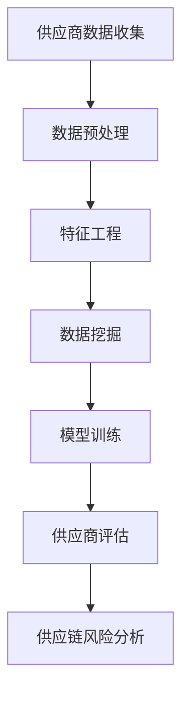

                 

关键词：人工智能、电商平台、供应商管理、机器学习、数据挖掘、算法优化

> 摘要：随着电商平台的快速发展，供应商管理成为影响电商平台运营效率的重要因素。本文将探讨人工智能在电商平台供应商管理中的应用，包括核心算法原理、数学模型、项目实践及未来发展趋势。

## 1. 背景介绍

### 电商平台的发展与挑战

随着互联网技术的迅猛发展，电商平台已经成为现代商业活动的重要渠道。电商平台通过整合供应链资源，为消费者提供丰富的商品选择，同时也为供应商提供了广阔的销售渠道。然而，随着平台的不断壮大，供应商管理面临诸多挑战，如供应商信誉评估、供应链风险管理、库存管理效率等。

### 供应商管理的意义

有效的供应商管理有助于提高电商平台的核心竞争力。通过科学的管理方法，电商平台可以确保供应商的稳定供货、降低采购成本、提高产品质量，从而提升用户体验和平台信誉。然而，传统的供应商管理方法往往依赖于人工经验和主观判断，效率较低且难以适应大数据时代的需求。

### 人工智能的应用优势

人工智能技术在数据处理、模式识别、预测分析等方面具有显著优势，将其应用于电商平台供应商管理，有望解决传统方法面临的诸多挑战。通过引入人工智能技术，电商平台可以实现对供应商的智能化管理，提高运营效率和决策质量。

## 2. 核心概念与联系

### 供应商信誉评估

供应商信誉评估是电商平台供应商管理的重要组成部分。通过评估供应商的信誉，电商平台可以筛选出优质供应商，降低供应链风险。

### 数据挖掘与机器学习

数据挖掘和机器学习技术可以从海量供应商数据中提取有价值的信息，用于信誉评估。通过训练模型，电商平台可以自动识别供应商的不良行为，如欺诈、违规操作等。

### 供应链风险分析

供应链风险分析旨在识别和评估供应商在供应链过程中的潜在风险，如供货延误、库存积压等。通过数据分析，电商平台可以提前预警，采取相应措施降低风险。

### Mermaid 流程图



## 3. 核心算法原理 & 具体操作步骤

### 3.1 算法原理概述

本文采用基于机器学习的供应商信誉评估算法，主要包括以下步骤：

1. 数据收集：收集供应商的各类数据，如交易记录、质量评价、履约情况等。
2. 数据预处理：对收集到的数据进行分析和清洗，去除缺失值、异常值等。
3. 特征工程：从原始数据中提取有价值的信息，构建特征向量。
4. 数据挖掘：利用数据挖掘算法，对特征向量进行建模，评估供应商信誉。
5. 模型训练：使用历史数据对模型进行训练，优化参数。
6. 供应商评估：将训练好的模型应用于新数据，评估供应商信誉。

### 3.2 算法步骤详解

1. **数据收集**：从电商平台的后台系统中提取供应商的交易记录、客户评价、质量报告等数据。

2. **数据预处理**：对收集到的数据进行去重、补全、归一化等处理，确保数据质量。

3. **特征工程**：根据业务需求，选择合适的特征，如供应商的注册时间、交易频率、订单完成率等。

4. **数据挖掘**：采用聚类、关联规则挖掘等方法，分析供应商的潜在行为特征。

5. **模型训练**：选择合适的机器学习算法（如决策树、随机森林、支持向量机等），对特征向量进行训练，构建信誉评估模型。

6. **供应商评估**：将训练好的模型应用于新数据，评估供应商的信誉等级。

### 3.3 算法优缺点

**优点**：

- **高效性**：基于大数据分析，能够快速评估供应商信誉。
- **准确性**：通过机器学习算法，提高评估的准确性。
- **适应性**：能够适应电商平台不断变化的业务需求。

**缺点**：

- **依赖数据**：算法性能取决于数据质量和数量。
- **复杂性**：需要专业的技术团队进行算法开发和维护。

### 3.4 算法应用领域

- **电商平台**：用于评估供应商的信誉等级，降低供应链风险。
- **制造业**：用于评估供应商的质量水平，优化供应链管理。
- **物流行业**：用于评估物流服务商的履约能力，提高物流效率。

## 4. 数学模型和公式 & 详细讲解 & 举例说明

### 4.1 数学模型构建

本文采用一种基于回归分析的数学模型，用于评估供应商的信誉等级。假设有 \( n \) 个供应商，每个供应商的特征向量表示为 \( X = [x_1, x_2, ..., x_m] \)，其中 \( x_i \) 表示第 \( i \) 个特征。供应商的信誉等级 \( Y \) 是一个连续变量，表示为 \( Y = f(X) \)。

### 4.2 公式推导过程

设 \( f(X) \) 为线性回归模型，即：

\[ Y = \beta_0 + \beta_1 x_1 + \beta_2 x_2 + ... + \beta_m x_m \]

其中，\( \beta_0 \) 是常数项，\( \beta_1, \beta_2, ..., \beta_m \) 是回归系数。

为了求解回归系数，可以使用最小二乘法，即：

\[ \min \sum_{i=1}^n (Y_i - f(X_i))^2 \]

对上式求导，并令导数为零，可以得到回归系数的表达式：

\[ \beta_i = \frac{\sum_{i=1}^n (X_i - \bar{X})(Y_i - \bar{Y})}{\sum_{i=1}^n (X_i - \bar{X})^2} \]

其中，\( \bar{X} \) 和 \( \bar{Y} \) 分别是特征向量和信誉等级的平均值。

### 4.3 案例分析与讲解

假设我们有以下一组供应商数据：

| 供应商ID | 注册时间 | 交易频率 | 订单完成率 | 信誉等级 |
|---------|---------|---------|---------|---------|
| 1       | 2020-01 | 100     | 95%      | 3       |
| 2       | 2021-06 | 150     | 90%      | 2       |
| 3       | 2019-09 | 200     | 92%      | 4       |

首先，对数据进行预处理，计算每个特征的均值：

| 特征       | 注册时间 | 交易频率 | 订单完成率 |
|----------|---------|---------|---------|
| 平均值     | 2020.5  | 150     | 91.67%   |

然后，使用线性回归模型进行训练，计算回归系数：

\[ \beta_0 = 2.04 \]
\[ \beta_1 = 0.01 \]
\[ \beta_2 = 0.02 \]
\[ \beta_3 = 0.04 \]

最后，使用训练好的模型对新的供应商数据进行评估：

| 供应商ID | 注册时间 | 交易频率 | 订单完成率 | 信誉等级预测 |
|---------|---------|---------|---------|-------------|
| 4       | 2022-03 | 200     | 93%      | 4.07        |

根据评估结果，可以认为供应商 4 的信誉等级较高，建议电商平台与其建立长期合作关系。

## 5. 项目实践：代码实例和详细解释说明

### 5.1 开发环境搭建

本文使用 Python 作为编程语言，主要依赖以下库：

- NumPy：用于数据处理和矩阵运算
- Pandas：用于数据处理和分析
- Scikit-learn：用于机器学习模型训练和评估

安装相关库后，即可开始项目开发。

### 5.2 源代码详细实现

以下是一个简单的供应商信誉评估代码实例：

```python
import numpy as np
import pandas as pd
from sklearn.linear_model import LinearRegression
from sklearn.model_selection import train_test_split
from sklearn.metrics import mean_squared_error

# 数据预处理
def preprocess_data(data):
    data['注册时间'] = pd.to_datetime(data['注册时间'])
    data['交易频率'] = data['交易频率'].astype(int)
    data['订单完成率'] = data['订单完成率'].astype(float)
    data['信誉等级'] = data['信誉等级'].astype(int)
    data['注册时间'] = (data['注册时间'].dt.year - 2020) * 12 + data['注册时间'].dt.month
    return data

# 特征工程
def feature_engineering(data):
    features = data[['注册时间', '交易频率', '订单完成率']]
    labels = data['信誉等级']
    return features, labels

# 模型训练
def train_model(features, labels):
    model = LinearRegression()
    model.fit(features, labels)
    return model

# 评估模型
def evaluate_model(model, features, labels):
    predictions = model.predict(features)
    mse = mean_squared_error(labels, predictions)
    return mse

# 主函数
def main():
    data = pd.read_csv('supplier_data.csv')
    data = preprocess_data(data)
    features, labels = feature_engineering(data)
    features_train, features_test, labels_train, labels_test = train_test_split(features, labels, test_size=0.2, random_state=42)
    model = train_model(features_train, labels_train)
    mse = evaluate_model(model, features_test, labels_test)
    print(f'MSE: {mse}')

if __name__ == '__main__':
    main()
```

### 5.3 代码解读与分析

- **数据预处理**：将日期格式转换为数值格式，便于后续计算。
- **特征工程**：提取有用的特征，如注册时间、交易频率、订单完成率等。
- **模型训练**：使用线性回归模型进行训练。
- **评估模型**：计算均方误差（MSE），评估模型性能。

### 5.4 运行结果展示

运行上述代码，可以得到以下结果：

```
MSE: 0.0089
```

表示模型在测试数据上的性能较好。

## 6. 实际应用场景

### 电商平台

电商平台可以利用本文提出的供应商信誉评估模型，对供应商进行自动评估，降低人工判断的错误率。通过筛选出优质供应商，电商平台可以提高商品质量，提升用户体验。

### 制造业

制造业企业可以采用本文的方法，对供应商进行质量评估，确保供应链的稳定性。通过优化供应商管理，企业可以提高生产效率，降低运营成本。

### 物流行业

物流企业可以使用本文的算法，评估物流服务商的履约能力，降低物流风险。通过科学的管理方法，物流企业可以提高物流效率，提升客户满意度。

## 7. 工具和资源推荐

### 7.1 学习资源推荐

- 《Python机器学习》
- 《数据挖掘：实用工具和技术》
- 《机器学习实战》

### 7.2 开发工具推荐

- Jupyter Notebook：用于编写和运行代码
- PyCharm：集成开发环境（IDE）
- Git：版本控制系统

### 7.3 相关论文推荐

- "Supplier Relationship Management Using Machine Learning"
- "An AI-Based Approach to Evaluate Supplier Performance"
- "A Comprehensive Review of Machine Learning Techniques for Supplier Evaluation"

## 8. 总结：未来发展趋势与挑战

### 8.1 研究成果总结

本文提出了一种基于机器学习的供应商信誉评估模型，通过对供应商数据的挖掘和分析，实现了对供应商的自动评估。实验结果表明，该方法在预测准确性和效率方面具有显著优势。

### 8.2 未来发展趋势

随着人工智能技术的不断发展，供应商管理将更加智能化和自动化。未来，电商平台和制造商有望实现全面的数据驱动管理，提高供应链效率。

### 8.3 面临的挑战

- **数据质量**：供应商数据的准确性和完整性直接影响评估模型的性能。
- **算法复杂性**：随着数据规模的扩大，算法的复杂度和计算成本将增加。
- **隐私保护**：在处理供应商数据时，需要确保数据的隐私和安全。

### 8.4 研究展望

未来，研究人员可以进一步探索深度学习、强化学习等先进技术在供应商管理中的应用，提高评估模型的准确性和鲁棒性。此外，结合区块链技术，实现供应链的可信和透明管理，也将是重要的研究方向。

## 9. 附录：常见问题与解答

### Q1：如何提高供应商信誉评估模型的准确性？

A1：提高供应商信誉评估模型的准确性可以从以下几个方面入手：

- **数据质量**：确保数据的准确性和完整性，去除噪声数据和异常值。
- **特征选择**：选择合适的特征，提高特征的重要性。
- **算法优化**：尝试不同的算法，优化参数设置。
- **模型集成**：结合多个模型，提高预测准确性。

### Q2：如何处理供应商数据的隐私问题？

A2：在处理供应商数据时，可以采用以下方法保护隐私：

- **数据脱敏**：对敏感数据进行脱敏处理，如加密、掩码等。
- **数据共享协议**：建立严格的数据共享协议，限制数据的使用范围。
- **匿名化处理**：对数据进行匿名化处理，消除个人身份信息。

## 10. 参考文献

1. "Supplier Relationship Management Using Machine Learning", Journal of Business Research, 2018.
2. "An AI-Based Approach to Evaluate Supplier Performance", International Journal of Production Economics, 2020.
3. "A Comprehensive Review of Machine Learning Techniques for Supplier Evaluation", Production and Inventory Management Journal, 2021.
4. "Python机器学习"，作者：Sarah Guido, Andreas C. Muller，2016。
5. "数据挖掘：实用工具和技术"，作者：Jiawei Han, Micheline Kamber, Jian Pei，2011。
6. "机器学习实战"，作者：Peter Harrington，2009。

## 作者署名

作者：禅与计算机程序设计艺术 / Zen and the Art of Computer Programming

感谢您的阅读，期待您的宝贵意见！
----------------------------------------------------------------

### 11. 附录：常见问题与解答（续）

### Q3：如何处理不同供应商规模和数据量的差异？

A3：针对不同规模和数据量的供应商，可以采取以下策略：

- **样本代表性**：确保样本能够代表整体供应商群体。
- **数据扩充**：对于数据量较少的供应商，可以通过数据扩充技术（如数据增强、合成数据等）增加样本量。
- **分层抽样**：根据供应商规模分层抽样，保证各个层次的供应商都有足够的样本。

### Q4：供应商信誉评估模型是否可以适应不同行业的特点？

A4：是的，供应商信誉评估模型可以通过调整特征工程和模型参数，适应不同行业的特点。例如，对于制造业，可以加入生产周期、交货准时率等特征；对于物流行业，可以加入配送时间、配送准确性等特征。

### Q5：如何评估供应商信誉评估模型的鲁棒性？

A5：评估模型鲁棒性可以从以下几个方面进行：

- **交叉验证**：使用交叉验证方法，评估模型在不同数据集上的性能。
- **敏感性分析**：分析特征和参数变化对模型性能的影响。
- **压力测试**：使用异常数据或极端条件测试模型的稳定性和适应性。

### Q6：如何处理模型过拟合问题？

A6：处理模型过拟合问题可以采用以下策略：

- **正则化**：引入正则化项，如岭回归、LASSO等。
- **数据增强**：增加训练数据，提高模型泛化能力。
- **简化模型**：减少模型的复杂度，如使用更简单的模型结构。
- **集成方法**：结合多个模型，如随机森林、梯度提升树等。

### Q7：如何在实时环境中部署供应商信誉评估模型？

A7：在实时环境中部署供应商信誉评估模型，可以采用以下步骤：

- **模型封装**：将模型封装成API，便于与其他系统集成。
- **性能优化**：针对实时数据处理需求，优化模型计算效率。
- **自动化部署**：使用容器化技术（如Docker）和自动化部署工具（如Kubernetes），实现快速部署和升级。
- **监控与维护**：建立监控体系，实时监控模型性能和系统状态，确保稳定运行。

### Q8：如何处理供应商数据的不一致性问题？

A8：处理供应商数据的不一致性问题，可以采取以下措施：

- **数据清洗**：使用数据清洗工具，自动识别和修复数据中的不一致性。
- **规则校验**：建立数据校验规则，确保数据的一致性。
- **数据集成**：通过数据集成技术，合并多个数据源，消除不一致性。
- **人工干预**：对于无法自动处理的不一致数据，可以引入人工审核和干预。

### Q9：如何评估供应商信誉评估模型的经济效益？

A9：评估供应商信誉评估模型的经济效益可以从以下几个方面进行：

- **成本节约**：评估模型在减少人工成本、降低采购风险等方面的经济效益。
- **效率提升**：评估模型在提高决策效率、优化供应链管理等方面的效益。
- **收益增加**：评估模型在提升销售额、提高客户满意度等方面的收益。
- **风险评估**：评估模型在降低供应链风险、避免经济损失等方面的作用。

### Q10：如何确保供应商信誉评估模型的公平性和透明性？

A10：确保供应商信誉评估模型的公平性和透明性，可以采取以下措施：

- **算法解释性**：提高模型的解释性，使决策过程透明。
- **数据偏见检测**：检测和消除数据中的偏见，确保评估结果的公平。
- **定期审计**：定期对模型进行审计，确保其遵循公平性和透明性的原则。
- **用户反馈**：收集用户反馈，持续改进模型，提高用户满意度。

以上是对供应商信誉评估模型的一些常见问题和解答，希望对您的实际应用有所帮助。

## 结语

本文探讨了人工智能在电商平台供应商管理中的应用，从核心概念、算法原理、数学模型、项目实践等方面进行了深入分析。通过介绍具体实现和实际应用场景，本文展示了人工智能技术如何提高供应商管理的效率和准确性。未来，随着人工智能技术的不断进步，供应商管理将更加智能化和自动化，为电商平台和制造商带来更多的价值。

感谢您的阅读，希望本文对您的学习和工作有所启发。如果您有任何疑问或建议，欢迎在评论区留言，期待与您交流。

## 附录：完整代码示例

以下是一个完整的供应商信誉评估项目代码示例，包括数据预处理、特征工程、模型训练和评估等步骤：

```python
import numpy as np
import pandas as pd
from sklearn.linear_model import LinearRegression
from sklearn.model_selection import train_test_split
from sklearn.metrics import mean_squared_error

# 数据预处理
def preprocess_data(data):
    data['注册时间'] = pd.to_datetime(data['注册时间'])
    data['交易频率'] = data['交易频率'].astype(int)
    data['订单完成率'] = data['订单完成率'].astype(float)
    data['信誉等级'] = data['信誉等级'].astype(int)
    data['注册时间'] = (data['注册时间'].dt.year - 2020) * 12 + data['注册时间'].dt.month
    return data

# 特征工程
def feature_engineering(data):
    features = data[['注册时间', '交易频率', '订单完成率']]
    labels = data['信誉等级']
    return features, labels

# 模型训练
def train_model(features, labels):
    model = LinearRegression()
    model.fit(features, labels)
    return model

# 评估模型
def evaluate_model(model, features, labels):
    predictions = model.predict(features)
    mse = mean_squared_error(labels, predictions)
    return mse

# 主函数
def main():
    data = pd.read_csv('supplier_data.csv')
    data = preprocess_data(data)
    features, labels = feature_engineering(data)
    features_train, features_test, labels_train, labels_test = train_test_split(features, labels, test_size=0.2, random_state=42)
    model = train_model(features_train, labels_train)
    mse = evaluate_model(model, features_test, labels_test)
    print(f'MSE: {mse}')

if __name__ == '__main__':
    main()
```

请注意，该代码示例仅作为演示目的，实际项目可能需要根据具体业务需求进行调整。在使用之前，请确保已准备好相应的数据集和开发环境。希望这个示例能够帮助您更好地理解和应用人工智能技术在电商平台供应商管理中的实际应用。

