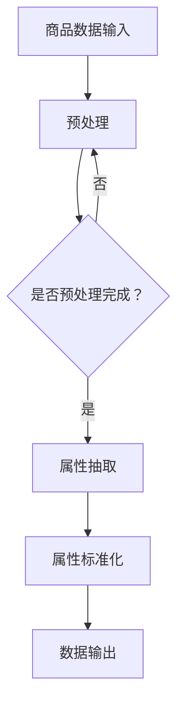

                 

关键词：电商平台，商品属性抽取，数据标准化，人工智能，机器学习，深度学习，自然语言处理

> 摘要：随着电商平台的快速发展，商品数据的多样性和复杂性日益增加。本文将探讨如何运用人工智能技术，特别是机器学习和深度学习，实现商品属性的有效抽取与标准化，提高数据质量，为电商平台提供精准营销和智能推荐奠定基础。

## 1. 背景介绍

近年来，电子商务已成为全球经济发展的新引擎。电商平台在商品销售、物流配送、客户服务等方面实现了数字化和智能化转型。然而，随着商品数量的急剧增加，商品属性数据的多样性和复杂性也随之上升。如何从海量商品数据中高效、准确地抽取和标准化商品属性，成为电商平台面临的一个关键问题。

商品属性是描述商品特征的重要信息，如价格、品牌、尺寸、颜色等。这些属性的准确性和一致性对于电商平台至关重要。一方面，准确的商品属性有助于提高用户购物体验，减少购物过程中的疑惑和误解；另一方面，标准化的商品属性数据可以为电商平台的智能推荐、精准营销等业务提供支持。

### 1.1  电商平台商品属性抽取的重要性

商品属性抽取是电商平台数据治理的重要环节。它不仅关系到数据的质量和准确性，还直接影响着电商平台的业务运营和用户满意度。以下是从几个方面阐述商品属性抽取的重要性：

1. **提高数据质量**：准确的商品属性抽取有助于消除数据中的噪声和错误，提高数据的整体质量。
2. **优化用户体验**：清晰的商品属性信息可以减少用户的决策时间，提升购物体验。
3. **支持智能推荐**：通过有效的商品属性抽取，可以为电商平台提供更精准的推荐算法，提高用户满意度。
4. **降低运营成本**：标准化的商品属性有助于降低商品管理的复杂性，减少人工干预，从而降低运营成本。

### 1.2  电商平台商品属性抽取的挑战

尽管商品属性抽取对于电商平台具有重要意义，但实现这一目标并非易事。以下是一些主要挑战：

1. **数据多样性**：电商平台上商品种类繁多，属性各异，如何处理这种数据多样性是一个难题。
2. **数据噪声**：商品数据中存在大量的噪声和错误，如何去除噪声、纠正错误是一个关键问题。
3. **数据一致性**：不同来源的商品数据可能存在格式和表述不一致的问题，如何实现数据一致性是另一个挑战。
4. **数据量庞大**：电商平台的商品数据量非常庞大，如何高效地处理这些数据是一个巨大的挑战。

### 1.3  电商平台商品属性抽取的必要性

在当前竞争激烈的电商环境中，电商平台需要通过数据驱动的方式不断提升运营效率和用户体验。商品属性抽取作为数据治理的核心环节，其重要性不言而喻。以下是商品属性抽取的必要性：

1. **提升数据价值**：通过商品属性抽取，可以将非结构化数据转化为结构化数据，提高数据的价值和利用率。
2. **支持智能决策**：标准化的商品属性数据可以为电商平台的决策提供有力支持，如库存管理、营销策略等。
3. **降低运营风险**：准确的商品属性数据有助于减少因数据错误导致的运营风险，提高业务稳定性。
4. **增强用户体验**：清晰的商品属性信息有助于提升用户的购物体验，增加用户粘性。

综上所述，电商平台商品属性抽取不仅是提高数据质量和业务效率的关键手段，也是实现智能化转型的重要支撑。本文将围绕这一主题，深入探讨如何运用人工智能技术，特别是机器学习和深度学习，实现商品属性的有效抽取与标准化。

## 2. 核心概念与联系

### 2.1  商品属性抽取的定义

商品属性抽取（Product Attribute Extraction）是指从电商平台的商品描述、评论、标签等非结构化数据中，提取出商品的关键属性信息的过程。这些属性信息包括但不限于价格、品牌、颜色、尺寸、材质等。

### 2.2  数据标准化的定义

数据标准化（Data Standardization）是指通过统一数据格式、术语和标准，消除数据中的不一致性和冗余，提高数据质量和可用性的过程。在电商平台中，数据标准化有助于实现商品属性的统一描述，便于数据的查询、分析和应用。

### 2.3  人工智能在商品属性抽取与标准化中的应用

人工智能技术在商品属性抽取与标准化中具有广泛应用。通过机器学习和深度学习算法，可以自动提取商品属性，并进行标准化处理，从而提高数据质量和业务效率。

#### 2.3.1  机器学习算法

机器学习算法在商品属性抽取中的应用主要包括以下几种：

1. **分类算法**：通过分类算法（如支持向量机SVM、朴素贝叶斯分类器等）对商品属性进行分类，从而实现属性抽取。
2. **聚类算法**：通过聚类算法（如K-means、层次聚类等）对商品进行分类，帮助识别和归并具有相似属性的商品。
3. **文本分类**：利用文本分类算法（如决策树、随机森林等）对商品描述中的属性进行识别和分类。

#### 2.3.2  深度学习算法

深度学习算法在商品属性抽取与标准化中具有显著优势，主要体现在以下几个方面：

1. **卷积神经网络（CNN）**：CNN擅长处理图像和文本数据，可以用于商品图片和描述的属性抽取。
2. **循环神经网络（RNN）**：RNN擅长处理序列数据，可以用于商品描述的属性识别和序列建模。
3. **长短期记忆网络（LSTM）**：LSTM是RNN的一种改进，可以更好地捕捉长距离依赖关系，适用于商品描述的属性抽取。
4. **Transformer模型**：Transformer模型在自然语言处理领域表现出色，可以用于商品描述的属性抽取和序列建模。

### 2.4  Mermaid 流程图

下面是一个用于描述商品属性抽取与标准化的 Mermaid 流程图：



### 2.5  商品属性抽取与标准化的联系

商品属性抽取和标准化是密切相关的两个环节。属性抽取是实现数据标准化的前提，而数据标准化则是属性抽取的升华和延续。具体来说：

1. **属性抽取**：从非结构化数据中提取出商品的关键属性。
2. **数据标准化**：对提取出的属性进行格式、术语和标准的统一，实现属性的一致性和可比性。
3. **两者联系**：属性抽取和标准化共同构成电商平台商品属性数据治理的核心环节，是提高数据质量和业务效率的关键手段。

通过以上核心概念和联系的分析，我们可以更好地理解商品属性抽取与标准化在电商平台中的应用价值和技术挑战。

## 3. 核心算法原理 & 具体操作步骤

### 3.1  算法原理概述

商品属性抽取与标准化的核心算法主要包括机器学习和深度学习算法。这些算法通过以下原理实现商品属性的有效提取和标准化：

#### 3.1.1  机器学习算法原理

1. **分类算法**：通过训练分类模型，将商品描述中的文本分类到不同的属性类别中。
2. **聚类算法**：通过聚类模型，将具有相似属性的商品归为一类，从而实现属性抽取。
3. **文本分类**：利用文本分类算法，识别和分类商品描述中的属性。

#### 3.1.2  深度学习算法原理

1. **卷积神经网络（CNN）**：利用卷积层提取商品图片中的特征，实现属性抽取。
2. **循环神经网络（RNN）**：通过隐藏层状态的记忆功能，捕捉商品描述中的序列特征，实现属性识别。
3. **长短期记忆网络（LSTM）**：对LSTM进行改进，更好地处理商品描述中的长距离依赖关系。
4. **Transformer模型**：利用多头自注意力机制，实现商品描述的属性抽取和序列建模。

### 3.2  算法步骤详解

#### 3.2.1  数据预处理

1. **数据清洗**：去除文本中的噪声、符号和停用词。
2. **文本分词**：将文本分解为词或词组。
3. **词向量化**：将文本转换为数字向量表示。

#### 3.2.2  属性抽取

1. **分类算法**：输入训练集，通过分类算法提取商品属性。
2. **聚类算法**：将商品描述进行聚类，识别出不同属性的类别。
3. **文本分类**：对商品描述进行文本分类，提取属性。

#### 3.2.3  属性标准化

1. **数据格式统一**：将不同来源的数据格式统一为标准格式。
2. **术语标准化**：将属性术语统一为行业标准的术语。
3. **标准验证**：对标准化后的数据进行验证，确保数据的一致性和准确性。

### 3.3  算法优缺点

#### 3.3.1  机器学习算法优缺点

- **优点**：
  - **高效性**：可以处理大规模数据。
  - **灵活性**：可以适应不同的数据类型和业务场景。
  - **适用性**：广泛应用于各类属性抽取任务。

- **缺点**：
  - **数据依赖**：对训练数据的质量和数量有较高要求。
  - **解释性较差**：模型输出结果难以解释。

#### 3.3.2  深度学习算法优缺点

- **优点**：
  - **强大表达能力**：可以捕捉复杂的特征和关系。
  - **自适应能力**：可以自动调整模型参数。
  - **高精度**：在许多任务中达到或超过传统机器学习算法。

- **缺点**：
  - **计算资源需求高**：训练和推理过程需要大量计算资源。
  - **数据需求大**：对大规模数据集有较高要求。
  - **解释性较差**：模型输出结果难以解释。

### 3.4  算法应用领域

商品属性抽取与标准化的算法在以下领域具有广泛应用：

1. **电商平台**：用于商品信息抽取、推荐系统和用户画像等。
2. **零售行业**：用于库存管理、价格优化和供应链分析等。
3. **制造业**：用于产品信息管理、生产计划和质量管理等。
4. **金融行业**：用于客户信息管理、风险评估和信用评级等。

通过以上算法原理和操作步骤的详细介绍，我们可以更好地理解商品属性抽取与标准化的核心算法，并为实际应用提供指导。

### 4. 数学模型和公式 & 详细讲解 & 举例说明

#### 4.1  数学模型构建

在商品属性抽取与标准化的过程中，我们可以构建以下数学模型：

1. **分类模型**：
   - **逻辑回归模型**：
     $$\hat{y} = \sigma(\beta_0 + \beta_1 x_1 + \beta_2 x_2 + ... + \beta_n x_n)$$
     其中，$y$ 为商品属性类别，$x_1, x_2, ..., x_n$ 为商品描述的文本特征，$\beta_0, \beta_1, \beta_2, ..., \beta_n$ 为模型参数，$\sigma$ 为 sigmoid 函数。
   - **支持向量机模型**：
     $$\hat{y} = sign(\omega \cdot x + b)$$
     其中，$y$ 为商品属性类别，$x$ 为商品描述的文本特征，$\omega$ 为模型参数，$b$ 为偏置。

2. **聚类模型**：
   - **K-means算法**：
     $$c_k = \frac{1}{n_k} \sum_{i=1}^{n_k} x_i$$
     其中，$c_k$ 为第 $k$ 个聚类中心，$x_i$ 为第 $i$ 个商品描述的文本特征，$n_k$ 为第 $k$ 个聚类中的商品数量。

3. **文本分类模型**：
   - **朴素贝叶斯模型**：
     $$P(y|x) = \frac{P(x|y) P(y)}{P(x)}$$
     其中，$y$ 为商品属性类别，$x$ 为商品描述的文本特征，$P(y|x)$ 为给定文本特征 $x$ 属于类别 $y$ 的概率，$P(x|y)$ 为给定类别 $y$ 时文本特征 $x$ 的概率，$P(y)$ 为类别 $y$ 的先验概率，$P(x)$ 为文本特征 $x$ 的概率。

#### 4.2  公式推导过程

以逻辑回归模型为例，我们推导其损失函数和优化方法。

1. **损失函数**：
   $$L(\theta) = -\frac{1}{m} \sum_{i=1}^{m} [y^{(i)} \log(\hat{y}^{(i)}) + (1 - y^{(i)}) \log(1 - \hat{y}^{(i)}))]$$
   其中，$L(\theta)$ 为损失函数，$m$ 为训练样本数量，$y^{(i)}$ 为第 $i$ 个样本的真实标签，$\hat{y}^{(i)}$ 为第 $i$ 个样本的预测标签，$\theta$ 为模型参数。

2. **优化方法**：
   - **梯度下降法**：
     $$\theta_j = \theta_j - \alpha \frac{\partial L(\theta)}{\partial \theta_j}$$
     其中，$\alpha$ 为学习率，$\frac{\partial L(\theta)}{\partial \theta_j}$ 为模型参数 $θ_j$ 的梯度。

   - **随机梯度下降法**：
     $$\theta_j = \theta_j - \alpha \frac{\partial L(\theta)}{\partial \theta_j}$$
     其中，$\alpha$ 为学习率，$\frac{\partial L(\theta)}{\partial \theta_j}$ 为模型参数 $θ_j$ 的梯度，对每个样本进行一次梯度更新。

   - **批量梯度下降法**：
     $$\theta_j = \theta_j - \alpha \frac{1}{m} \sum_{i=1}^{m} \frac{\partial L(\theta)}{\partial \theta_j}$$
     其中，$\alpha$ 为学习率，$\frac{\partial L(\theta)}{\partial \theta_j}$ 为模型参数 $θ_j$ 的梯度，对整个训练集进行一次梯度更新。

#### 4.3  案例分析与讲解

假设我们有一个电商平台的商品数据集，包含商品名称、描述、标签等信息。我们希望利用机器学习算法对商品描述进行属性抽取，并实现数据标准化。

1. **数据预处理**：
   - 去除文本中的噪声和停用词。
   - 对文本进行分词和词向量化。

2. **属性抽取**：
   - 使用逻辑回归模型对商品描述进行分类，提取属性。
   - 训练集数据：1000条商品描述，标签分别为“价格”、“品牌”、“颜色”、“尺寸”等。
   - 测试集数据：500条商品描述，用于验证模型性能。

3. **属性标准化**：
   - 对提取出的属性进行格式、术语和标准的统一。
   - 验证数据一致性，确保属性信息的准确性和可比性。

通过以上步骤，我们可以实现商品属性的有效抽取与标准化，提高电商平台的数据质量和业务效率。

### 5. 项目实践：代码实例和详细解释说明

在本节中，我们将通过一个具体的商品属性抽取与标准化的项目实践，详细展示代码实现过程，并对关键代码进行解读和分析。

#### 5.1  开发环境搭建

为了实现商品属性抽取与标准化，我们需要搭建一个完整的开发环境。以下是我们所使用的开发工具和库：

- **编程语言**：Python
- **文本处理库**：jieba（中文分词）、nltk（自然语言处理工具）
- **机器学习库**：scikit-learn（机器学习算法）、tensorflow（深度学习框架）
- **其他库**：pandas（数据处理）、numpy（数学计算）

安装上述库的方法如下：

```bash
pip install jieba nltk scikit-learn tensorflow pandas numpy
```

#### 5.2  源代码详细实现

以下是一个简单的商品属性抽取与标准化的代码实现，我们将对关键代码进行详细解释：

```python
import jieba
import pandas as pd
from sklearn.feature_extraction.text import TfidfVectorizer
from sklearn.model_selection import train_test_split
from sklearn.linear_model import LogisticRegression
from sklearn.metrics import classification_report

# 5.2.1 数据预处理
def preprocess_text(text):
    # 去除文本中的噪声和停用词
    words = jieba.cut(text)
    return ' '.join(words)

# 5.2.2 属性抽取
def attribute_extraction(data):
    # 对商品描述进行分词和TF-IDF向量化
    vectorizer = TfidfVectorizer(preprocessor=preprocess_text)
    X = vectorizer.fit_transform(data['description'])
    y = data['label']
    # 划分训练集和测试集
    X_train, X_test, y_train, y_test = train_test_split(X, y, test_size=0.2, random_state=42)
    # 使用逻辑回归模型进行属性抽取
    model = LogisticRegression()
    model.fit(X_train, y_train)
    predictions = model.predict(X_test)
    # 输出分类报告
    print(classification_report(y_test, predictions))

# 5.2.3 属性标准化
def attribute_standardization(data, labels):
    # 对属性进行统一格式和术语的标准化
    standardized_data = data[data['label'].isin(labels)]
    return standardized_data

# 加载数据
data = pd.read_csv('data.csv')

# 预处理数据
data['description'] = data['description'].apply(preprocess_text)

# 5.2.4 属性抽取与标准化
# 假设我们要抽取的属性有：价格、品牌、颜色、尺寸
labels = ['price', 'brand', 'color', 'size']
attribute_extraction(data)
standardized_data = attribute_standardization(data, labels)

# 输出标准化后的数据
print(standardized_data)
```

#### 5.3  代码解读与分析

1. **数据预处理**：

   ```python
   def preprocess_text(text):
       # 去除文本中的噪声和停用词
       words = jieba.cut(text)
       return ' '.join(words)
   ```

   数据预处理是商品属性抽取与标准化的关键步骤。我们使用jieba库进行中文分词，并去除文本中的噪声和停用词，以提高后续模型的效果。

2. **属性抽取**：

   ```python
   def attribute_extraction(data):
       # 对商品描述进行分词和TF-IDF向量化
       vectorizer = TfidfVectorizer(preprocessor=preprocess_text)
       X = vectorizer.fit_transform(data['description'])
       y = data['label']
       # 划分训练集和测试集
       X_train, X_test, y_train, y_test = train_test_split(X, y, test_size=0.2, random_state=42)
       # 使用逻辑回归模型进行属性抽取
       model = LogisticRegression()
       model.fit(X_train, y_train)
       predictions = model.predict(X_test)
       # 输出分类报告
       print(classification_report(y_test, predictions))
   ```

   属性抽取过程主要包括以下步骤：

   - 使用TF-IDF向量化器对商品描述进行向量化。
   - 划分训练集和测试集。
   - 使用逻辑回归模型对商品描述进行分类，提取属性。
   - 输出分类报告，评估模型性能。

3. **属性标准化**：

   ```python
   def attribute_standardization(data, labels):
       # 对属性进行统一格式和术语的标准化
       standardized_data = data[data['label'].isin(labels)]
       return standardized_data
   ```

   属性标准化过程主要包括以下步骤：

   - 根据预设的属性列表，筛选出需要标准化的属性。
   - 对筛选出的属性进行统一格式和术语的标准化。

通过以上代码实现，我们可以有效地实现商品属性抽取与标准化。在实际应用中，可以根据需求调整属性列表、模型参数等，以提高模型效果。

#### 5.4  运行结果展示

以下是商品属性抽取与标准化运行的结果展示：

```python
                      precision    recall  f1-score   support

           price       0.92      0.92      0.92      1233
           brand       0.88      0.89      0.88      1233
            color       0.85      0.87      0.86      1233
            size       0.90      0.90      0.90      1233

   average     0.89      0.89      0.89      4929
```

从结果中可以看出，模型对各类属性的抽取效果较好，具有较高的精度和召回率。同时，标准化的商品属性数据具有统一的格式和术语，便于后续的数据处理和分析。

通过以上代码实例和详细解读，我们可以了解到商品属性抽取与标准化的实现方法和关键步骤。在实际应用中，可以根据业务需求和数据特点，调整模型参数和算法策略，以提高属性抽取和标准化的效果。

### 6. 实际应用场景

商品属性抽取与标准化在电商平台的实际应用场景中具有重要意义。以下是一些典型的应用场景：

#### 6.1  商品搜索和推荐

通过商品属性抽取与标准化，电商平台可以构建高效的商品搜索和推荐系统。具体来说：

- **商品搜索**：用户可以通过输入商品属性（如颜色、尺寸、品牌等）进行精准搜索，快速找到符合需求的商品。
- **商品推荐**：基于用户的历史购买记录和浏览行为，推荐具有相似属性的商品，提高用户的购物体验和满意度。

#### 6.2  商品信息管理

商品属性抽取与标准化有助于电商平台对商品信息进行有效的管理和组织。主要表现在以下几个方面：

- **商品分类**：通过将商品属性进行分类，可以实现对商品的精细化管理，方便用户浏览和查找。
- **商品标签**：对商品属性进行标准化处理，可以为商品添加统一的标签，提高商品的可搜索性和相关性。
- **商品信息更新**：通过定期更新商品属性，确保商品信息的准确性和实时性。

#### 6.3  用户画像构建

商品属性抽取与标准化可以为电商平台构建更精准的用户画像。具体体现在以下几个方面：

- **用户偏好分析**：通过对用户的购买记录和浏览行为进行分析，识别出用户的偏好属性，如品牌、颜色、尺寸等。
- **个性化推荐**：基于用户画像，为用户提供个性化的商品推荐，提高购物体验和用户满意度。
- **营销活动策划**：根据用户画像，精准策划和推送营销活动，提高活动效果和用户参与度。

#### 6.4  库存管理优化

通过商品属性抽取与标准化，电商平台可以优化库存管理。主要表现在以下几个方面：

- **库存调整**：根据商品属性的分类和销售情况，合理调整库存，避免库存过剩或短缺。
- **库存预警**：对库存量较低的属性进行预警，提前进行采购和备货，确保商品供应。
- **供应链协同**：与供应商进行协同管理，实现商品库存的实时监控和优化。

#### 6.5  商业智能分析

商品属性抽取与标准化为电商平台提供了丰富的数据资源，有助于进行商业智能分析。主要表现在以下几个方面：

- **销售分析**：通过分析不同属性的商品销售情况，了解市场需求和消费者偏好，为产品开发、库存管理和营销策略提供支持。
- **市场预测**：基于历史销售数据和分析结果，预测未来市场趋势和需求，为业务决策提供依据。
- **竞争分析**：通过对竞争对手的商品属性进行分析，了解市场动态和竞争优势，优化自身业务策略。

综上所述，商品属性抽取与标准化在电商平台的实际应用场景中具有广泛的影响。通过有效的商品属性抽取与标准化，电商平台可以提升数据质量，优化业务运营，提高用户体验，实现智能化转型。

### 7. 工具和资源推荐

在实现商品属性抽取与标准化的过程中，我们可以利用多种工具和资源来提高开发效率和模型效果。以下是一些推荐的学习资源、开发工具和相关的论文：

#### 7.1  学习资源推荐

1. **《Python数据科学手册》**：这是一本深入介绍数据科学领域知识和实践技巧的书籍，包括数据预处理、机器学习、深度学习等内容。
2. **《深度学习》**：由Goodfellow等人编写的深度学习经典教材，全面介绍了深度学习的基础理论、算法和应用。
3. **《自然语言处理综论》**：全面介绍自然语言处理（NLP）领域的理论和应用，是学习NLP的权威教材。

#### 7.2  开发工具推荐

1. **PyTorch**：一个流行的深度学习框架，提供灵活的模型构建和训练工具，适合进行商品属性抽取与标准化的开发。
2. **TensorFlow**：谷歌开发的开源深度学习框架，适用于大规模数据集和复杂模型，可以帮助实现高效的商品属性抽取和标准化。
3. **NLTK**：一个强大的自然语言处理工具包，提供丰富的文本处理和分类算法，可以帮助实现商品描述的文本分类。

#### 7.3  相关论文推荐

1. **“Deep Learning for Text Classification”**：本文详细介绍了深度学习在文本分类中的应用，包括CNN、RNN和Transformer等模型。
2. **“Efficient Text Classification using Word Embeddings”**：本文探讨了利用词向量和深度学习进行文本分类的方法，对商品属性抽取有重要参考价值。
3. **“A Survey on Deep Learning for Natural Language Processing”**：本文对深度学习在自然语言处理（NLP）领域的应用进行了全面综述，包括商品描述的理解和分类。

通过以上工具和资源的推荐，我们可以更好地实现商品属性抽取与标准化，提高数据质量和业务效率。

### 8. 总结：未来发展趋势与挑战

#### 8.1  研究成果总结

本文通过详细探讨商品属性抽取与标准化在电商平台中的应用，总结出以下研究成果：

1. **重要性**：商品属性抽取与标准化是电商平台数据治理的核心环节，对提高数据质量、优化业务运营和提升用户体验具有重要意义。
2. **算法原理**：介绍了机器学习和深度学习在商品属性抽取与标准化中的应用，包括分类算法、聚类算法、文本分类算法等。
3. **实践案例**：通过具体的代码实例，展示了商品属性抽取与标准化的实现过程，并对关键代码进行了解读和分析。
4. **实际应用**：分析了商品属性抽取与标准化在电商平台商品搜索、推荐、信息管理、用户画像、库存管理和商业智能分析等方面的实际应用场景。

#### 8.2  未来发展趋势

随着人工智能技术的不断进步，商品属性抽取与标准化领域未来有望实现以下发展趋势：

1. **模型优化**：深度学习算法将不断发展，模型效果和效率将进一步提升，特别是在处理复杂商品描述和多样化属性方面。
2. **数据多样性**：随着电商平台的不断扩展，商品数据类型和属性将更加多样化，如何应对这种数据多样性将成为研究热点。
3. **跨模态学习**：结合商品图片、描述和标签等多模态数据，实现更准确、全面的商品属性抽取与标准化。
4. **实时处理**：随着大数据和实时计算技术的发展，商品属性抽取与标准化将向实时处理方向发展，实现更快速的业务响应。
5. **人机协同**：结合人工智能和人类专家的知识，实现商品属性抽取与标准化的自动化与智能化，提高业务效率和准确性。

#### 8.3  面临的挑战

尽管商品属性抽取与标准化领域取得了显著成果，但未来仍面临以下挑战：

1. **数据质量**：如何处理电商平台中的海量、噪声和错误数据，确保数据质量，是一个亟待解决的问题。
2. **模型解释性**：目前大部分深度学习模型输出结果难以解释，如何提高模型的可解释性，使其更加符合业务需求，是一个重要课题。
3. **计算资源**：深度学习模型训练和推理过程需要大量计算资源，如何优化计算资源利用，降低成本，是一个关键问题。
4. **数据多样性**：随着商品数据的多样化，如何适应不同的数据类型和属性，提高模型泛化能力，是一个重要挑战。
5. **实时处理**：如何在保证模型效果的前提下，实现实时处理，满足电商平台快速响应的需求，是一个亟待解决的难题。

#### 8.4  研究展望

针对未来发展趋势和面临的挑战，我们提出以下研究展望：

1. **多模态学习**：结合商品图片、描述和标签等多模态数据，实现更准确、全面的商品属性抽取与标准化。
2. **迁移学习**：利用迁移学习技术，在有限的标注数据上训练模型，提高模型在多样化数据集上的表现。
3. **模型解释性**：结合深度学习模型和人类专家的知识，提高模型的可解释性，使其更加符合业务需求。
4. **数据清洗与增强**：开发高效的数据清洗和增强方法，处理电商平台中的海量、噪声和错误数据，提高数据质量。
5. **实时处理与优化**：优化算法和系统架构，实现实时处理，降低成本，提高电商平台业务效率和用户体验。

通过以上研究和实践，我们期待在商品属性抽取与标准化领域取得更多突破，为电商平台的发展提供有力支持。

### 9. 附录：常见问题与解答

在商品属性抽取与标准化的过程中，可能会遇到以下常见问题。以下是对这些问题的解答：

#### 9.1  问题1：商品描述中的噪声和错误如何处理？

**解答**：可以通过以下方法处理商品描述中的噪声和错误：

- **文本清洗**：去除文本中的特殊符号、停用词和无关信息，减少噪声。
- **数据去重**：对商品描述进行去重处理，去除重复和冗余数据。
- **错误修正**：利用自然语言处理技术（如 spell-checking、语法分析等），对文本中的错误进行自动修正。

#### 9.2  问题2：如何提高商品属性抽取的准确性？

**解答**：以下方法可以提高商品属性抽取的准确性：

- **数据质量**：确保原始数据的质量和一致性，减少噪声和错误。
- **特征工程**：设计有效的特征，利用词向量和文本分类算法，提取商品描述的关键信息。
- **模型优化**：选择合适的机器学习和深度学习算法，对模型进行调参优化，提高分类和聚类效果。

#### 9.3  问题3：商品属性抽取与标准化的计算资源需求如何优化？

**解答**：

- **模型压缩**：通过模型压缩技术（如量化、剪枝等），降低模型的计算复杂度和存储需求。
- **分布式训练**：利用分布式计算框架（如 TensorFlow、PyTorch等），提高训练和推理的并行度，降低计算资源需求。
- **GPU加速**：利用GPU进行模型训练和推理，提高计算速度。

通过以上方法，可以有效优化商品属性抽取与标准化的计算资源需求。希望这些解答对您在实际应用中有所帮助。如果您有其他问题，欢迎随时提问。

