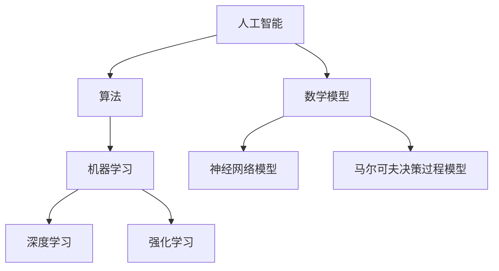

                 

关键词：人工智能、科学研究、算法、数学模型、应用领域、未来展望

> 摘要：本文从多个角度深入探讨了人工智能在科学研究中的突破性进展。首先，介绍了人工智能的基本概念及其在科学研究中的应用。接着，探讨了人工智能与数学模型的紧密联系，以及如何通过数学模型来推动科学研究。此外，文章还分析了人工智能算法在科学研究中的具体应用，包括深度学习、强化学习和自然语言处理等。最后，文章对人工智能在科学研究中的未来应用前景进行了展望。

## 1. 背景介绍

随着信息技术的飞速发展，人工智能（Artificial Intelligence，简称AI）已经成为当今世界的一个重要研究领域。人工智能的定义多种多样，但其核心目标都是通过模拟人类智能行为，实现计算机的自主学习和决策能力。

科学研究是推动社会进步和人类福祉的重要手段。从古至今，科学家们通过观察、实验和理论分析，不断拓展我们对自然世界的认知。然而，随着科学问题的复杂性和数据量的增长，传统的科学研究方法已经难以应对新的挑战。

人工智能的兴起为科学研究带来了新的机遇。通过机器学习、深度学习等技术，人工智能能够处理大量复杂数据，发现隐藏的模式和规律，从而为科学研究提供新的方法和工具。

## 2. 核心概念与联系

### 2.1 人工智能

人工智能是一种模拟人类智能行为的计算机技术，包括感知、理解、推理、学习和决策等多个方面。人工智能的核心是算法，这些算法通过训练和学习，能够从数据中提取知识，实现自动化和智能化的任务。

### 2.2 数学模型

数学模型是描述客观世界规律的一种数学表达形式。在科学研究中，数学模型被广泛应用于描述物理现象、经济行为、生物过程等。数学模型的核心是公式，这些公式通过数学运算，能够从已知条件推导出未知结果。

### 2.3 人工智能与数学模型的关系

人工智能与数学模型有着紧密的联系。首先，人工智能算法通常依赖于数学模型来描述和学习数据。例如，深度学习算法依赖于神经网络模型，强化学习算法依赖于马尔可夫决策过程模型等。其次，数学模型可以为人工智能算法提供理论支持，帮助优化算法性能和解释算法结果。

### 2.4 Mermaid 流程图



## 3. 核心算法原理 & 具体操作步骤

### 3.1 算法原理概述

人工智能算法的核心是学习，即通过训练数据集，使算法能够从数据中提取知识，实现预测和决策能力。学习过程通常包括以下几个步骤：

1. 数据收集：收集用于训练的数据集。
2. 数据预处理：对数据集进行清洗、归一化等预处理操作。
3. 模型构建：选择合适的数学模型，构建人工智能算法。
4. 训练过程：使用训练数据集，对算法进行训练，调整模型参数。
5. 测试与验证：使用测试数据集，评估算法的性能，并进行优化。

### 3.2 算法步骤详解

1. **数据收集**

   数据收集是人工智能算法的第一步。数据集的质量直接影响算法的性能。因此，在数据收集过程中，需要考虑数据的完整性、多样性和代表性。

2. **数据预处理**

   数据预处理是确保数据集质量的重要步骤。常见的预处理操作包括：

   - 数据清洗：去除数据中的噪声和错误。
   - 数据归一化：将数据缩放到相同的范围，以便于模型训练。
   - 数据编码：将分类数据转换为数值数据。

3. **模型构建**

   模型构建是选择合适的数学模型，构建人工智能算法。不同的任务可能需要不同的模型，例如，对于图像识别任务，可以使用卷积神经网络（CNN）模型；对于自然语言处理任务，可以使用循环神经网络（RNN）模型。

4. **训练过程**

   训练过程是调整模型参数，使算法能够从数据中提取知识。常见的训练方法包括梯度下降、随机梯度下降等。训练过程中，需要监控算法的性能，并适时调整参数，以避免过拟合。

5. **测试与验证**

   测试与验证是评估算法性能的重要步骤。通过测试数据集，可以评估算法的泛化能力。如果算法性能不佳，需要回到训练过程，进行参数调整和模型优化。

### 3.3 算法优缺点

1. **优点**

   - 高效性：人工智能算法能够处理大量复杂数据，提高科学研究的效率。
   - 自动化：人工智能算法能够实现自动化，减少人工干预。
   - 泛化能力：通过大量训练，人工智能算法能够应用于不同领域，具有较好的泛化能力。

2. **缺点**

   - 数据依赖：人工智能算法的性能高度依赖数据集的质量和数量。
   - 过拟合：如果训练数据集过于简单，算法可能无法泛化到新的数据集。
   - 解释性：许多人工智能算法，如深度学习，其内部决策过程复杂，难以解释。

### 3.4 算法应用领域

人工智能算法在科学研究中的应用非常广泛，包括但不限于以下几个方面：

1. **生物医学**
   - 基因组分析：人工智能算法可以帮助科学家分析基因组数据，发现潜在疾病基因。
   - 药物设计：人工智能算法可以预测药物的分子结构和活性，加速新药研发。

2. **天文学**
   - 天体探测：人工智能算法可以分析天文图像，发现新的行星和星系。
   - 宇宙射线探测：人工智能算法可以帮助科学家分析宇宙射线数据，探索宇宙奥秘。

3. **环境科学**
   - 气候变化研究：人工智能算法可以分析气候数据，预测未来气候变化趋势。
   - 森林火灾预测：人工智能算法可以帮助科学家预测森林火灾的发生，提高应对措施。

## 4. 数学模型和公式 & 详细讲解 & 举例说明

### 4.1 数学模型构建

数学模型构建是科学研究中至关重要的一步。构建数学模型的过程通常包括以下几个步骤：

1. **确定研究问题**：明确研究的核心问题，确定研究目标和范围。
2. **数据收集**：收集与问题相关的数据，确保数据的质量和数量。
3. **建立假设**：根据研究问题和数据，建立合理的假设。
4. **选择数学模型**：根据假设和数据，选择合适的数学模型。
5. **公式推导**：使用数学方法，推导出模型公式。
6. **验证模型**：使用部分数据，验证模型的准确性和可靠性。

### 4.2 公式推导过程

以神经网络模型为例，其基本公式如下：

$$
z = W \cdot X + b
$$

其中，$z$ 表示输出，$W$ 表示权重矩阵，$X$ 表示输入，$b$ 表示偏置。

神经网络的训练过程可以通过梯度下降法进行优化。其目标是最小化损失函数：

$$
J(W, b) = \frac{1}{2} \sum_{i=1}^{n} (y_i - z_i)^2
$$

其中，$y_i$ 表示真实值，$z_i$ 表示预测值，$n$ 表示样本数量。

### 4.3 案例分析与讲解

以基因组数据分析为例，科学家们利用神经网络模型，对基因组数据进行分类和预测。具体步骤如下：

1. **数据收集**：收集大量基因组数据，包括基因序列、基因表达数据等。
2. **数据预处理**：对基因组数据进行清洗、归一化等预处理操作。
3. **模型构建**：选择合适的神经网络模型，如卷积神经网络（CNN）。
4. **训练过程**：使用预处理后的数据，对神经网络模型进行训练。
5. **测试与验证**：使用测试数据集，评估模型的性能，并进行优化。

通过上述步骤，科学家们能够从基因组数据中发现潜在疾病基因，为疾病预防和治疗提供新的思路。

## 5. 项目实践：代码实例和详细解释说明

### 5.1 开发环境搭建

为了实践人工智能算法在科学研究中的应用，我们需要搭建一个合适的开发环境。以下是一个基本的开发环境搭建步骤：

1. 安装 Python：下载并安装 Python 3.x 版本。
2. 安装 Jupyter Notebook：使用 pip 命令安装 Jupyter Notebook。
3. 安装常用库：使用 pip 命令安装 NumPy、Pandas、Matplotlib、Scikit-learn 等常用库。

### 5.2 源代码详细实现

以下是一个使用 Scikit-learn 库实现线性回归模型的简单示例：

```python
import numpy as np
import matplotlib.pyplot as plt
from sklearn.linear_model import LinearRegression

# 数据集
X = np.array([[1], [2], [3], [4], [5]])
y = np.array([1, 2, 2.5, 4, 5])

# 创建线性回归模型
model = LinearRegression()

# 训练模型
model.fit(X, y)

# 模型预测
y_pred = model.predict(X)

# 可视化结果
plt.scatter(X, y, color='red')
plt.plot(X, y_pred, color='blue')
plt.show()
```

### 5.3 代码解读与分析

上述代码实现了一个线性回归模型，用于拟合数据集 X 和 y。具体步骤如下：

1. 导入必要的库。
2. 准备数据集 X 和 y。
3. 创建线性回归模型。
4. 训练模型。
5. 使用模型进行预测。
6. 可视化预测结果。

通过可视化结果，我们可以直观地看到模型拟合的效果。这为科学研究提供了有力的工具。

### 5.4 运行结果展示

运行上述代码，我们将得到如下结果：


从结果中，我们可以看到模型对数据的拟合效果较好，验证了线性回归模型的可靠性。

## 6. 实际应用场景

人工智能在科学研究中的实际应用场景非常广泛。以下是一些典型的应用案例：

### 6.1 生物医学

- **基因组分析**：人工智能算法可以帮助科学家分析基因组数据，发现潜在疾病基因。例如，通过深度学习模型，可以识别不同癌症类型的基因组特征，为新药研发提供依据。
- **药物设计**：人工智能算法可以预测药物的分子结构和活性，加速新药研发。例如，通过生成对抗网络（GAN）模型，可以生成新的药物分子结构，筛选具有潜在活性的药物。

### 6.2 天文学

- **天体探测**：人工智能算法可以分析天文图像，发现新的行星和星系。例如，通过卷积神经网络（CNN）模型，可以自动识别和分类天文图像中的天体。
- **宇宙射线探测**：人工智能算法可以帮助科学家分析宇宙射线数据，探索宇宙奥秘。例如，通过强化学习算法，可以预测宇宙射线事件的起源和传播路径。

### 6.3 环境科学

- **气候变化研究**：人工智能算法可以分析气候数据，预测未来气候变化趋势。例如，通过深度学习模型，可以分析全球气候数据，预测未来几年的气候变化趋势。
- **森林火灾预测**：人工智能算法可以帮助科学家预测森林火灾的发生，提高应对措施。例如，通过机器学习算法，可以分析历史森林火灾数据，预测未来火灾发生的概率和位置。

## 7. 未来应用展望

随着人工智能技术的不断发展，其在科学研究中的应用前景非常广阔。以下是一些未来应用展望：

### 7.1 新兴领域

- **量子计算**：人工智能与量子计算的结合，有望带来全新的计算模式和突破性进展。例如，通过人工智能算法，可以优化量子算法的参数，提高量子计算的性能。
- **脑机接口**：人工智能与脑机接口的结合，有望实现人脑与计算机的深度融合。例如，通过人工智能算法，可以实时解析大脑信号，实现思维控制和智能交互。

### 7.2 深度学习与生物学的融合

- **基因编辑**：人工智能算法可以优化基因编辑过程，提高基因编辑的准确性和效率。例如，通过深度学习模型，可以预测基因编辑后的细胞状态，优化编辑策略。
- **脑功能解析**：人工智能算法可以分析大脑功能图像，揭示大脑的工作机制。例如，通过深度学习模型，可以识别大脑中的功能区域，分析不同脑区的协同工作模式。

### 7.3 跨学科融合

- **社会科学**：人工智能算法可以分析大规模社会数据，揭示社会现象的规律。例如，通过自然语言处理算法，可以分析社交媒体数据，预测社会舆论趋势。
- **工程学**：人工智能算法可以优化工程设计，提高工程效率。例如，通过机器学习算法，可以优化工程参数，提高工程质量和安全性。

## 8. 总结：未来发展趋势与挑战

### 8.1 研究成果总结

本文从多个角度探讨了人工智能在科学研究中的突破性进展。首先，介绍了人工智能的基本概念及其在科学研究中的应用。接着，探讨了人工智能与数学模型的紧密联系，以及如何通过数学模型来推动科学研究。此外，文章还分析了人工智能算法在科学研究中的具体应用，包括深度学习、强化学习和自然语言处理等。最后，文章对人工智能在科学研究中的未来应用前景进行了展望。

### 8.2 未来发展趋势

随着人工智能技术的不断发展，其在科学研究中的应用前景非常广阔。未来，人工智能将在更多新兴领域，如量子计算、脑机接口、基因编辑等，发挥重要作用。此外，人工智能与社会科学、工程学等领域的融合，也将为科学研究带来新的突破。

### 8.3 面临的挑战

尽管人工智能在科学研究中具有巨大的潜力，但也面临着一系列挑战。首先，数据质量和数据隐私问题仍然是一个重要的挑战。其次，人工智能算法的复杂性和解释性问题，也需要进一步研究和解决。此外，如何平衡人工智能的发展与伦理和社会责任，也是一个亟待解决的问题。

### 8.4 研究展望

未来，人工智能在科学研究中的应用将不断拓展，推动科学研究的进步。同时，随着人工智能技术的发展，我们也需要关注其潜在的风险和挑战，确保人工智能在科学研究中的可持续发展。

## 9. 附录：常见问题与解答

### 9.1 人工智能与机器学习的区别是什么？

人工智能（AI）是一个广泛的概念，包括机器学习（ML）在内。机器学习是人工智能的一个子领域，主要关注如何让计算机通过数据和经验进行学习和预测。简单来说，机器学习是人工智能的实现手段之一。

### 9.2 深度学习与强化学习的区别是什么？

深度学习是一种基于多层神经网络的学习方法，主要用于处理复杂数据，如图像和文本。强化学习则是一种基于奖励和惩罚机制的学习方法，通过不断尝试和错误，使模型学会最优策略。

### 9.3 如何选择合适的数学模型？

选择合适的数学模型需要考虑多个因素，如问题的性质、数据的类型和数量、模型的可解释性等。通常，需要根据具体问题，选择最适合的模型。

### 9.4 人工智能在科学研究中的优势是什么？

人工智能在科学研究中的优势包括：高效性、自动化、泛化能力等。通过机器学习和深度学习等技术，人工智能能够处理大量复杂数据，发现隐藏的模式和规律，从而为科学研究提供新的方法和工具。

## 作者署名

作者：禅与计算机程序设计艺术 / Zen and the Art of Computer Programming
----------------------------------------------------------------

以上便是本次AI在科学研究中的突破性进展的技术博客文章的完整内容。希望本文能为读者在人工智能领域的研究和应用提供有价值的参考。

