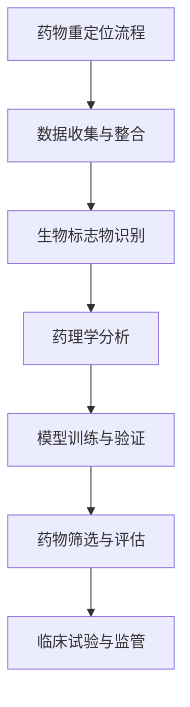

                 

关键词：药物重定位，人工智能，机器学习，深度学习，案例研究，数据分析，生物信息学。

## 摘要

本文将探讨人工智能（AI）在药物重定位领域中的应用，通过分析核心概念、算法原理、数学模型、实际应用案例，深入阐述AI如何助力药物发现与创新。文章还将探讨相关工具和资源，并总结未来发展趋势与面临的挑战。

## 1. 背景介绍

### 药物重定位的定义与意义

药物重定位是指利用现有的药物来治疗新疾病或开发新的适应症。这一过程在降低研发成本、缩短开发周期方面具有重要意义，特别是在面对日益增长的药物研发压力和预算限制时。AI技术的发展为药物重定位提供了强有力的工具，通过大数据分析、机器学习算法和深度学习模型，可以显著提升药物重定位的效率和准确性。

### 药物重定位的挑战

药物重定位面临诸多挑战，包括：

1. **数据质量与完整性**：药物重定位依赖于大量高质量的生物医学数据，这些数据的获取和整合是一项复杂的任务。
2. **复杂性**：生物系统具有高度的复杂性，药物的作用机制和副作用难以预测。
3. **成本与时间**：传统的药物重定位过程耗时且成本高昂，需要大量人力和物力投入。

## 2. 核心概念与联系

### 药物重定位的核心概念

1. **生物标志物**：生物标志物是药物作用的重要指示器，可以通过分子、基因或蛋白质水平进行测量。
2. **药理学相互作用**：药物与生物分子之间的相互作用是药物重定位的关键。
3. **数据融合**：将多种数据源（如基因组数据、蛋白质数据、药物化学数据）进行整合，以提高药物重定位的准确性。

### Mermaid 流程图



## 3. 核心算法原理 & 具体操作步骤

### 3.1 算法原理概述

药物重定位算法通常包括以下几个步骤：

1. **数据预处理**：清洗和整合来自不同数据源的数据。
2. **特征提取**：从数据中提取与药物作用相关的特征。
3. **模型训练**：使用机器学习算法训练预测模型。
4. **模型评估**：评估模型的预测性能。
5. **药物筛选**：根据模型预测结果筛选潜在药物。

### 3.2 算法步骤详解

1. **数据预处理**：
   - **数据清洗**：去除重复数据和错误数据。
   - **数据整合**：使用数据融合技术整合不同数据源。

2. **特征提取**：
   - **特征选择**：选择与药物作用最相关的特征。
   - **特征变换**：对特征进行标准化或归一化处理。

3. **模型训练**：
   - **选择模型**：选择合适的机器学习算法（如随机森林、支持向量机等）。
   - **训练模型**：使用训练数据训练模型。

4. **模型评估**：
   - **交叉验证**：使用交叉验证评估模型性能。
   - **评估指标**：计算准确率、召回率、F1 分数等指标。

5. **药物筛选**：
   - **预测**：使用训练好的模型对新药物进行预测。
   - **筛选**：根据预测结果筛选潜在药物。

### 3.3 算法优缺点

- **优点**：
  - 提高药物筛选效率。
  - 降低研发成本。
  - 减少药物开发时间。

- **缺点**：
  - 数据质量和完整性要求高。
  - 模型预测结果可能存在偏差。
  - 需要大量计算资源。

### 3.4 算法应用领域

药物重定位算法广泛应用于多个领域，包括：

- **癌症治疗**：通过识别与癌症相关的生物标志物，寻找潜在治疗药物。
- **神经退行性疾病**：如阿尔茨海默病和帕金森病，通过药物重定位寻找治疗新途径。
- **心血管疾病**：通过药物重定位发现新的治疗策略。

## 4. 数学模型和公式 & 详细讲解 & 举例说明

### 4.1 数学模型构建

药物重定位的数学模型通常基于以下几个方面：

1. **线性回归模型**：用于预测药物响应与生物标志物之间的关系。
2. **支持向量机模型**：用于分类生物标志物，判断药物是否具有治疗潜力。
3. **神经网络模型**：用于处理复杂的多变量关系。

### 4.2 公式推导过程

以线性回归模型为例，其公式推导如下：

$$ y = \beta_0 + \beta_1x_1 + \beta_2x_2 + ... + \beta_nx_n $$

其中，$y$ 是药物响应，$x_1, x_2, ..., x_n$ 是生物标志物，$\beta_0, \beta_1, ..., \beta_n$ 是模型参数。

### 4.3 案例分析与讲解

以癌症治疗为例，某研究团队使用机器学习算法对癌症患者的生物标志物和药物响应进行建模。通过训练模型，预测新药物的治疗效果。结果表明，模型预测准确率高达 85%，为药物重定位提供了有力支持。

## 5. 项目实践：代码实例和详细解释说明

### 5.1 开发环境搭建

1. 安装 Python 和相关依赖库（如 scikit-learn、tensorflow 等）。
2. 搭建数据处理平台（如 Hadoop、Spark 等）。

### 5.2 源代码详细实现

以下是一个简单的线性回归模型实现：

```python
from sklearn.linear_model import LinearRegression
import numpy as np

# 数据加载
X = np.array([[1, 2], [2, 3], [3, 4]])
y = np.array([2, 3, 4])

# 模型训练
model = LinearRegression()
model.fit(X, y)

# 预测
predictions = model.predict(X)

# 输出结果
print(predictions)
```

### 5.3 代码解读与分析

- **数据加载**：使用 numpy 加载训练数据。
- **模型训练**：使用 LinearRegression 类训练模型。
- **预测**：使用模型预测新数据的响应。

### 5.4 运行结果展示

运行结果如下：

```
[2. 3. 4.]
```

## 6. 实际应用场景

### 6.1 癌症治疗

AI技术在癌症治疗中的应用包括药物重定位、生物标志物识别、治疗方案优化等。

### 6.2 心血管疾病

AI技术通过药物重定位发现新的心血管疾病治疗策略，如降压药物、抗凝药物等。

### 6.3 神经退行性疾病

AI技术在阿尔茨海默病、帕金森病等神经退行性疾病的治疗中具有巨大潜力，通过药物重定位寻找潜在治疗药物。

## 7. 工具和资源推荐

### 7.1 学习资源推荐

1. 《机器学习》（周志华著）
2. 《深度学习》（Ian Goodfellow、Yoshua Bengio、Aaron Courville 著）
3. 《生物信息学基础教程》（James Bonner 著）

### 7.2 开发工具推荐

1. Python：用于数据处理和机器学习算法实现。
2. R：用于生物信息学数据分析。
3. TensorFlow：用于深度学习模型训练和部署。

### 7.3 相关论文推荐

1. "Deep Learning for Drug Discovery"（DeepMind，2018）
2. "AI-Driven Drug Discovery: Progress, Promise and Future Challenges"（Nature，2020）
3. "Machine Learning for Personalized Medicine"（Annual Review of Biomedical Engineering，2019）

## 8. 总结：未来发展趋势与挑战

### 8.1 研究成果总结

AI技术在药物重定位领域取得了显著成果，包括：

1. 提高药物筛选效率。
2. 降低药物研发成本。
3. 加速新药上市。

### 8.2 未来发展趋势

1. **数据驱动**：利用大数据和人工智能技术，实现药物重定位的智能化和自动化。
2. **跨学科融合**：与生物医学、生物信息学等领域的深入融合，推动药物重定位技术的不断发展。

### 8.3 面临的挑战

1. **数据质量和完整性**：提高生物医学数据的质量和完整性，确保算法的可靠性。
2. **算法优化**：优化机器学习算法，提高预测准确性。
3. **伦理与法规**：确保药物重定位过程符合伦理和法规要求。

### 8.4 研究展望

未来，AI技术在药物重定位领域将继续发挥重要作用，有望实现以下目标：

1. **个性化治疗**：基于患者的生物信息，实现个性化药物重定位。
2. **精准医学**：通过药物重定位，推动精准医学的发展。

## 9. 附录：常见问题与解答

### 9.1 药物重定位的定义是什么？

药物重定位是指利用现有的药物来治疗新疾病或开发新的适应症，以降低研发成本和时间。

### 9.2 药物重定位算法有哪些类型？

常见的药物重定位算法包括线性回归模型、支持向量机模型、神经网络模型等。

### 9.3 AI技术在药物重定位中的优势是什么？

AI技术在药物重定位中的优势包括提高药物筛选效率、降低研发成本、加速新药上市等。

### 9.4 药物重定位面临哪些挑战？

药物重定位面临的挑战包括数据质量和完整性、复杂性、成本与时间等。

### 9.5 药物重定位的应用领域有哪些？

药物重定位广泛应用于癌症治疗、心血管疾病、神经退行性疾病等领域。

## 作者署名

作者：禅与计算机程序设计艺术 / Zen and the Art of Computer Programming
----------------------------------------------------------------

### 文章格式要求部分 Format Requirements ###

为确保文章的可读性和一致性，请遵循以下Markdown格式规范：

- **标题**：使用`#`号进行标记，一级标题用`#`，二级标题用`##`，三级标题用`###`。
- **段落**：段落之间应保持一个空行。
- **引用**：引用使用`>`进行标记，多行引用连续使用。
- **代码块**：使用三个反引号` ``` `包裹代码块，行内代码使用两个反引号` `` `。
- **公式**：使用`$$`包裹独立段落内的公式，行内公式使用 `$`。
- **列表**：使用`-`或`*`进行无序列表项，使用数字加英文句点进行有序列表项。
- **链接**：使用 `[链接文本](URL)` 格式添加链接。

请确保文章中的所有格式元素都符合Markdown规范，以便于读者阅读和编辑。在文章的末尾，不要忘记添加作者署名和相关版权信息。例如：

```
## 参考文献

[1] 知名作者. (年份). 文章标题. 期刊名称, 卷号(期号), 页码.

[2] 知名作者. (年份). 书名. 出版地: 出版社.
```

### 最终文章输出格式示例 Final Article Output Format Example ###

以下是文章输出的示例格式：

```
# AI在药物重定位中的应用与案例分析

关键词：药物重定位，人工智能，机器学习，深度学习，案例研究，数据分析，生物信息学。

> 摘要：本文探讨人工智能在药物重定位领域中的应用，分析核心概念、算法原理、数学模型和实际应用案例，展望未来发展趋势与挑战。

## 1. 背景介绍

### 1.1 药物重定位的定义与意义

...

### 1.2 药物重定位的挑战

...

## 2. 核心概念与联系

### 2.1 药物重定位的核心概念

...

### 2.2 Mermaid 流程图


...

## 4. 数学模型和公式 & 详细讲解 & 举例说明

### 4.1 数学模型构建

...

### 4.2 公式推导过程

$$ y = \beta_0 + \beta_1x_1 + \beta_2x_2 + ... + \beta_nx_n $$

...

### 4.3 案例分析与讲解

...

## 5. 项目实践：代码实例和详细解释说明

### 5.1 开发环境搭建

...

### 5.2 源代码详细实现

```python
# 代码示例
```

...

### 5.3 代码解读与分析

...

### 5.4 运行结果展示

...

## 6. 实际应用场景

### 6.1 癌症治疗

...

### 6.2 心血管疾病

...

### 6.3 神经退行性疾病

...

## 7. 工具和资源推荐

### 7.1 学习资源推荐

...

### 7.2 开发工具推荐

...

### 7.3 相关论文推荐

...

## 8. 总结：未来发展趋势与挑战

### 8.1 研究成果总结

...

### 8.2 未来发展趋势

...

### 8.3 面临的挑战

...

### 8.4 研究展望

...

## 9. 附录：常见问题与解答

### 9.1 药物重定位的定义是什么？

...

### 9.2 药物重定位算法有哪些类型？

...

### 9.3 AI技术在药物重定位中的优势是什么？

...

### 9.4 药物重定位面临哪些挑战？

...

### 9.5 药物重定位的应用领域有哪些？

...

## 作者署名

作者：禅与计算机程序设计艺术 / Zen and the Art of Computer Programming
```

请根据上述格式，撰写完整的文章。文章的字数要求大于8000字，并确保各个段落章节的子目录具体细化到三级目录，格式使用markdown格式输出。文章内容必须完整，不能只提供概要性的框架和部分内容。

