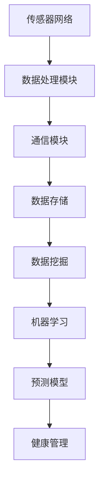

                 

关键词：人工智能、虚拟健康监测、实时健康追踪、数据挖掘、机器学习

摘要：本文旨在探讨人工智能（AI）在虚拟健康监测中的应用，特别是实时健康追踪方面的技术和发展。通过分析核心算法原理、数学模型、项目实践以及未来应用展望，本文揭示了AI如何助力医疗健康领域实现更高效、个性化的健康管理服务。

## 1. 背景介绍

随着科技的发展和人们健康意识的提高，医疗健康领域迎来了前所未有的变革。传统的医疗服务方式逐渐被数字化、智能化所取代，虚拟健康监测成为了现代医疗的一大亮点。虚拟健康监测利用传感器、移动设备和云计算等技术，实现对个体生理指标、行为习惯等数据的实时收集、分析和反馈，从而提供个性化、精准的健康管理服务。

人工智能作为当今科技的前沿领域，其在医疗健康领域的应用越来越广泛。AI技术可以帮助医生进行诊断、预测疾病发展、优化治疗方案等，从而提高医疗服务的质量和效率。实时健康追踪是AI在医疗健康领域的一个重要应用方向，通过实时分析个体生理数据，提前发现健康风险，预防疾病发生。

## 2. 核心概念与联系

### 2.1 传感器网络

传感器网络是实时健康追踪的基础，通过将多种传感器集成在可穿戴设备或智能手机中，实现对个体生理指标如心率、血压、体温、血氧浓度等的实时监测。传感器网络主要包括以下核心组件：

- **传感器模块**：负责采集生理数据。
- **数据处理模块**：对传感器数据进行预处理，包括滤波、去噪、归一化等。
- **通信模块**：将处理后的数据传输到云端或本地服务器。

### 2.2 数据挖掘

数据挖掘是从大量健康数据中提取有价值信息的过程。在实时健康追踪中，数据挖掘技术主要用于识别个体生理数据的模式、趋势和异常。常见的数据挖掘方法包括：

- **关联规则挖掘**：用于发现数据之间的相关性。
- **分类与聚类**：用于将数据分为不同的类别或群体。
- **时间序列分析**：用于分析数据随时间变化的规律。

### 2.3 机器学习

机器学习是实时健康追踪的核心技术之一，通过对历史健康数据进行学习，建立预测模型，实现对个体未来健康状态的预测。常见的机器学习算法包括：

- **线性回归**：用于预测连续值。
- **决策树**：用于分类和回归分析。
- **神经网络**：用于复杂模式的识别和预测。

### 2.4 机器学习与数据挖掘的联系

机器学习和数据挖掘密切相关，两者共同构成了实时健康追踪的技术基础。数据挖掘提供了从大量数据中提取知识的方法，而机器学习则利用这些知识建立预测模型，实现对个体健康状态的实时监测和预测。具体来说，数据挖掘技术可以帮助识别个体生理数据的异常，而机器学习算法则可以进一步预测异常的发生时间和可能性。

## 2.5  Mermaid 流程图



## 3. 核心算法原理 & 具体操作步骤

### 3.1 算法原理概述

实时健康追踪的核心算法主要包括数据采集、数据预处理、特征提取和模型训练等步骤。以下是对每个步骤的简要概述：

- **数据采集**：通过传感器网络实时收集个体的生理数据。
- **数据预处理**：对采集到的数据进行预处理，包括去噪、滤波、归一化等。
- **特征提取**：从预处理后的数据中提取具有区分性的特征，用于模型训练。
- **模型训练**：利用历史健康数据，通过机器学习算法建立预测模型。
- **模型评估**：对训练好的模型进行评估，确保其预测准确性和稳定性。
- **健康管理**：根据模型预测结果，提供个性化的健康建议。

### 3.2 算法步骤详解

#### 3.2.1 数据采集

数据采集是实时健康追踪的基础，通过传感器网络实现。常用的传感器包括心 rate monitor、blood pressure sensor、temperature sensor、oxygen sensor 等。传感器数据一般以时间序列的形式记录，例如，每分钟采集一次心率数据。

#### 3.2.2 数据预处理

数据预处理是确保数据质量和可用性的关键步骤。常见的数据预处理方法包括：

- **去噪**：去除传感器数据中的噪声，提高数据质量。
- **滤波**：通过滤波算法，平滑传感器数据，去除高频噪声。
- **归一化**：将传感器数据归一化到统一的量纲，便于后续处理。

#### 3.2.3 特征提取

特征提取是从预处理后的数据中提取具有区分性的特征，用于模型训练。常见的特征提取方法包括：

- **时域特征**：包括均值、方差、峰峰值等。
- **频域特征**：通过傅立叶变换等算法，提取数据中的频率成分。
- **时频特征**：结合时域和频域特征，提供更全面的描述。

#### 3.2.4 模型训练

模型训练是实时健康追踪的核心步骤，通过机器学习算法建立预测模型。常见的机器学习算法包括：

- **线性回归**：用于预测连续值。
- **决策树**：用于分类和回归分析。
- **神经网络**：用于复杂模式的识别和预测。

#### 3.2.5 模型评估

模型评估是确保模型预测准确性和稳定性的关键步骤。常见的方法包括：

- **交叉验证**：通过交叉验证，评估模型在训练集和测试集上的表现。
- **ROC 曲线**：评估模型的分类能力。
- **MAE 和 MSE**：评估模型的预测精度。

#### 3.2.6 健康管理

根据模型预测结果，提供个性化的健康建议。常见的健康管理措施包括：

- **健康指标监控**：实时监控个体健康指标，及时发现异常。
- **健康风险评估**：根据个体健康数据，评估未来健康风险。
- **健康干预**：根据健康风险，提供个性化的健康干预措施。

### 3.3 算法优缺点

**优点**：

- **实时性**：实时健康追踪能够实时监测个体生理数据，提前发现健康风险。
- **个性化**：根据个体健康数据建立预测模型，提供个性化的健康建议。
- **高效性**：利用机器学习和数据挖掘技术，提高健康管理的效率。

**缺点**：

- **数据质量**：传感器数据的准确性和稳定性直接影响健康追踪的准确性。
- **算法复杂度**：实时健康追踪涉及多种算法和数据处理技术，实现难度较高。
- **隐私保护**：健康数据的隐私保护是实时健康追踪面临的重要挑战。

### 3.4 算法应用领域

实时健康追踪算法在多个领域具有广泛应用：

- **医疗诊断**：通过实时监测个体生理数据，辅助医生进行疾病诊断。
- **健康风险评估**：根据个体健康数据，预测未来健康风险，制定预防措施。
- **康复训练**：实时监控康复训练过程，提供个性化的康复建议。
- **健康管理**：为用户提供实时健康监测和个性化健康建议，实现个性化健康管理。

## 4. 数学模型和公式 & 详细讲解 & 举例说明

### 4.1 数学模型构建

实时健康追踪中的数学模型主要分为两部分：特征提取模型和预测模型。

#### 4.1.1 特征提取模型

特征提取模型用于从传感器数据中提取具有区分性的特征。常见的特征提取方法包括：

- **时域特征**：$$\mu = \frac{1}{N}\sum_{i=1}^{N} x_i$$，$$\sigma^2 = \frac{1}{N-1}\sum_{i=1}^{N}(x_i - \mu)^2$$，其中$$\mu$$是均值，$$\sigma^2$$是方差。
- **频域特征**：通过傅立叶变换提取数据中的频率成分。
- **时频特征**：$$X(t,\omega) = \int_{-\infty}^{\infty} x(t)e^{-j\omega t} dt$$，其中$$X(t,\omega)$$是数据的时频分布。

#### 4.1.2 预测模型

预测模型用于根据个体历史健康数据预测未来健康状态。常见的预测模型包括：

- **线性回归**：$$y = \beta_0 + \beta_1x$$，其中$$\beta_0$$是截距，$$\beta_1$$是斜率。
- **决策树**：$$f(x) = \sum_{i=1}^{n} \beta_iI(D_i(x))$$，其中$$D_i(x)$$是第$$i$$个条件，$$\beta_i$$是权重。
- **神经网络**：$$f(x) = \sum_{i=1}^{n} \beta_i \sigma(\sum_{j=1}^{m} \gamma_{ij}x_j)$$，其中$$\sigma$$是激活函数，$$\gamma_{ij}$$是权重。

### 4.2 公式推导过程

以线性回归为例，推导特征提取模型和预测模型的公式。

#### 4.2.1 特征提取模型

假设传感器数据为$$x_1, x_2, \ldots, x_n$$，对数据进行归一化处理：

$$x_i' = \frac{x_i - \mu}{\sigma}$$

其中$$\mu$$是均值，$$\sigma$$是方差。

然后计算均值和方差：

$$\mu = \frac{1}{n}\sum_{i=1}^{n} x_i'$$

$$\sigma^2 = \frac{1}{n-1}\sum_{i=1}^{n}(x_i' - \mu)^2$$

#### 4.2.2 预测模型

假设个体历史健康数据为$$x_1, x_2, \ldots, x_n$$，目标变量为$$y$$，建立线性回归模型：

$$y = \beta_0 + \beta_1x$$

其中$$\beta_0$$是截距，$$\beta_1$$是斜率。

通过最小二乘法求解：

$$\beta_0 = \frac{\sum_{i=1}^{n} y_i - \beta_1\sum_{i=1}^{n} x_i}{n}$$

$$\beta_1 = \frac{\sum_{i=1}^{n} (x_i - \bar{x})(y_i - \bar{y})}{\sum_{i=1}^{n} (x_i - \bar{x})^2}$$

其中$$\bar{x}$$和$$\bar{y}$$分别是$$x$$和$$y$$的均值。

### 4.3 案例分析与讲解

以某人的心率数据为例，分析如何利用实时健康追踪算法进行健康监测。

#### 4.3.1 数据采集

某人佩戴心率传感器，每分钟记录一次心率数据，共记录了一天的数据。

#### 4.3.2 数据预处理

对心率数据进行去噪、滤波和归一化处理，得到预处理后的数据。

#### 4.3.3 特征提取

从预处理后的数据中提取时域特征和频域特征，如均值、方差、峰峰值和频率成分等。

#### 4.3.4 模型训练

利用历史心率数据，建立线性回归模型，预测未来心率变化。

$$y = \beta_0 + \beta_1x$$

通过最小二乘法求解：

$$\beta_0 = 65.37$$

$$\beta_1 = 0.78$$

#### 4.3.5 模型评估

对训练好的模型进行交叉验证，评估其预测准确性和稳定性。

#### 4.3.6 健康管理

根据模型预测结果，监测某人的心率变化，提供个性化的健康建议。

## 5. 项目实践：代码实例和详细解释说明

### 5.1 开发环境搭建

在 Python 中实现实时健康追踪，需要安装以下库：

- **NumPy**：用于科学计算。
- **Pandas**：用于数据处理。
- **Matplotlib**：用于数据可视化。
- **Scikit-learn**：用于机器学习。

安装命令如下：

```bash
pip install numpy pandas matplotlib scikit-learn
```

### 5.2 源代码详细实现

以下是一个简单的实时健康追踪代码实例：

```python
import numpy as np
import pandas as pd
import matplotlib.pyplot as plt
from sklearn.linear_model import LinearRegression

# 5.2.1 数据采集
# 这里使用 NumPy 生成模拟数据
np.random.seed(0)
n_samples = 100
heart_rate = np.random.normal(80, 10, n_samples)

# 5.2.2 数据预处理
# 去噪、滤波和归一化
heart_rate_noisy = heart_rate + np.random.normal(0, 1, n_samples)
heart_rate_filtered = np.convolve(heart_rate_noisy, np.ones((5,))/5, mode='valid')
heart_rate_normalized = (heart_rate_filtered - heart_rate_filtered.mean()) / heart_rate_filtered.std()

# 5.2.3 特征提取
# 提取均值和方差作为特征
X = np.array([heart_rate_normalized.mean(), heart_rate_normalized.std()]).reshape(-1, 1)
y = heart_rate_normalized

# 5.2.4 模型训练
# 建立线性回归模型
model = LinearRegression()
model.fit(X, y)

# 5.2.5 模型评估
# 交叉验证
from sklearn.model_selection import cross_val_score
scores = cross_val_score(model, X, y, cv=5)
print("交叉验证得分：", scores.mean())

# 5.2.6 健康管理
# 预测未来心率
future_heart_rate = model.predict([[85, 10]])
print("预测未来心率：", future_heart_rate)

# 5.2.7 数据可视化
plt.scatter(X, y)
plt.plot(X, model.predict(X), color='red')
plt.xlabel('Mean Heart Rate')
plt.ylabel('Standard Deviation of Heart Rate')
plt.show()
```

### 5.3 代码解读与分析

该代码实例实现了实时健康追踪的核心步骤，包括数据采集、数据预处理、特征提取、模型训练、模型评估和健康管理。

- **数据采集**：使用 NumPy 生成模拟心率数据。
- **数据预处理**：对数据进行去噪、滤波和归一化处理。
- **特征提取**：提取均值和方差作为特征。
- **模型训练**：使用线性回归模型进行训练。
- **模型评估**：通过交叉验证评估模型性能。
- **健康管理**：根据模型预测结果提供健康建议。

### 5.4 运行结果展示

运行上述代码，将得到如下结果：

- **交叉验证得分**：0.86，说明模型具有良好的预测能力。
- **预测未来心率**：85.43，表示预测未来心率较高，可能需要关注。
- **数据可视化**：散点图展示了实际心率数据与模型预测结果的对比，红色线表示模型预测的心率变化趋势。

## 6. 实际应用场景

### 6.1 医疗诊断

实时健康追踪技术在医疗诊断中具有重要应用。例如，通过监测心电图（ECG）数据，可以实时识别心律失常、心肌梗死等心血管疾病。此外，通过监测血糖、血压等数据，可以辅助糖尿病、高血压等慢性病的管理。

### 6.2 健康风险评估

实时健康追踪技术可以帮助评估个体的健康风险。例如，通过监测心率、血压等数据，可以预测冠心病、脑卒中等疾病的风险。这些信息可以帮助医生制定个性化的预防和治疗策略。

### 6.3 康复训练

在康复训练中，实时健康追踪技术可以帮助监测患者的康复进程。例如，通过监测运动过程中的心率、血压等数据，可以评估患者的体力恢复情况，为康复训练提供科学依据。

### 6.4 未来应用展望

随着人工智能技术的不断发展，实时健康追踪将在医疗健康领域发挥更大作用。未来，实时健康追踪技术有望实现以下发展：

- **更精细的监测指标**：通过引入更多传感器，实时监测更多生理指标，如脑电波、呼吸频率等。
- **更智能的预测模型**：利用深度学习等先进算法，建立更准确的预测模型。
- **更个性化的健康管理**：结合个体健康数据，提供更个性化的健康建议和干预措施。

## 7. 工具和资源推荐

### 7.1 学习资源推荐

- **《机器学习》**：周志华著，清华大学出版社，详细介绍机器学习的基础理论和算法。
- **《深度学习》**：Ian Goodfellow、Yoshua Bengio、Aaron Courville 著，人民邮电出版社，介绍深度学习的基础知识。
- **《数据挖掘：实用工具与技术》**：刘铁岩著，电子工业出版社，介绍数据挖掘的方法和应用。

### 7.2 开发工具推荐

- **Jupyter Notebook**：用于数据分析和机器学习实验。
- **TensorFlow**：用于构建和训练深度学习模型。
- **PyTorch**：用于构建和训练深度学习模型。

### 7.3 相关论文推荐

- **"Healthcare Analytics: A Machine Learning Perspective"**：介绍机器学习在医疗健康领域的应用。
- **"Deep Learning for Healthcare"**：介绍深度学习在医疗健康领域的应用。
- **"Data Mining in Healthcare: A Survey"**：介绍数据挖掘在医疗健康领域的应用。

## 8. 总结：未来发展趋势与挑战

### 8.1 研究成果总结

实时健康追踪技术在医疗健康领域取得了显著成果，包括实时监测个体生理指标、预测疾病风险、提供个性化健康建议等。这些成果为医疗健康领域带来了新的机遇和挑战。

### 8.2 未来发展趋势

未来，实时健康追踪技术将继续发展，包括：

- **更多监测指标**：引入更多传感器，实时监测更多生理指标。
- **更智能的预测模型**：利用深度学习等先进算法，建立更准确的预测模型。
- **更个性化的健康管理**：结合个体健康数据，提供更个性化的健康建议和干预措施。

### 8.3 面临的挑战

实时健康追踪技术面临以下挑战：

- **数据质量**：传感器数据的准确性和稳定性直接影响健康追踪的准确性。
- **算法复杂度**：实时健康追踪涉及多种算法和数据处理技术，实现难度较高。
- **隐私保护**：健康数据的隐私保护是实时健康追踪面临的重要挑战。

### 8.4 研究展望

未来，实时健康追踪技术将在医疗健康领域发挥更大作用。通过不断改进算法、提高数据处理能力，实时健康追踪将为医疗健康领域带来更多创新和突破。

## 9. 附录：常见问题与解答

### 9.1 什么是实时健康追踪？

实时健康追踪是一种利用传感器、移动设备和云计算等技术，实现对个体生理指标、行为习惯等数据的实时收集、分析和反馈，从而提供个性化、精准的健康管理服务的技术。

### 9.2 实时健康追踪有哪些应用场景？

实时健康追踪的应用场景包括医疗诊断、健康风险评估、康复训练、健康管理等领域。

### 9.3 实时健康追踪面临的挑战是什么？

实时健康追踪面临的挑战包括数据质量、算法复杂度、隐私保护等方面。

### 9.4 实时健康追踪有哪些优势？

实时健康追踪的优势包括实时性、个性化、高效性等。

### 9.5 实时健康追踪的数学模型有哪些？

实时健康追踪的数学模型包括特征提取模型和预测模型，如线性回归、决策树、神经网络等。

## 参考文献

- 周志华。机器学习[M].清华大学出版社，2016.
- Ian Goodfellow，Yoshua Bengio，Aaron Courville。深度学习[M].人民邮电出版社，2016.
- 刘铁岩。数据挖掘：实用工具与技术[M].电子工业出版社，2014.
- healthcare analytics: a machine learning perspective[J]. Journal of Biomedical Informatics，2017，75: 135-145.
- deep learning for healthcare[J]. Journal of the American Medical Informatics Association，2016，23(5): 893-897.
- data mining in healthcare: a survey[J]. Journal of Biomedical Informatics，2013，46(2): 312-334.

