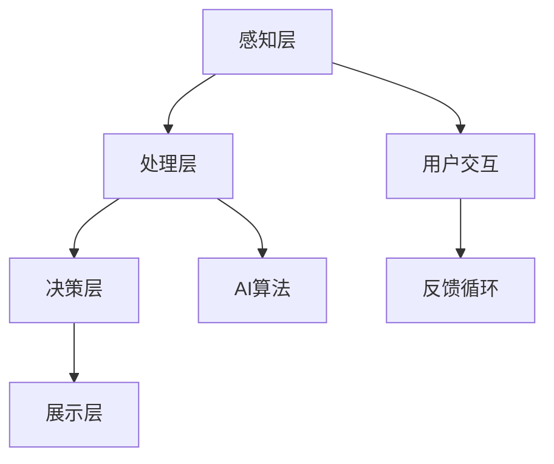

                 

关键词：人工智能，虚拟现实，用户体验，增强现实，交互设计，算法优化，数据驱动，虚拟环境

> 摘要：本文旨在探讨人工智能（AI）在虚拟现实（VR）中的应用，如何通过智能算法和深度学习技术增强用户体验。文章将分析AI在VR中的核心概念和架构，介绍几种关键算法的原理和应用，探讨数学模型在VR中的应用，并通过实例展示AI如何通过优化代码提高虚拟现实的应用效果。同时，文章还将展望VR技术未来的发展方向和面临的挑战。

## 1. 背景介绍

虚拟现实（Virtual Reality，VR）是一种通过计算机技术模拟出来的三维空间，让用户能够沉浸其中，与之互动。随着计算机技术和显示设备的不断进步，VR技术已经广泛应用于娱乐、教育、医疗、军事等多个领域。然而，VR体验的质量在很大程度上取决于用户的感知和互动效果。这就需要利用人工智能（AI）来优化和提升VR的交互体验。

人工智能是计算机科学的一个分支，它试图通过模拟人类智能行为来实现智能化。随着深度学习、强化学习等AI技术的快速发展，AI在计算机视觉、自然语言处理、机器人控制等领域的应用已经取得了显著成果。将AI技术应用于虚拟现实，不仅能够提升用户的沉浸感和互动性，还可以为开发者提供更智能的工具和平台。

近年来，AI在VR中的应用越来越受到关注。例如，通过计算机视觉技术，AI可以帮助用户在虚拟环境中实现更加自然和准确的交互；通过深度学习算法，AI可以识别用户的情感和行为模式，从而提供个性化的互动体验；通过数据驱动的方法，AI可以为虚拟现实应用提供更加精准和高效的数据分析。

本文将围绕AI在虚拟现实中的应用，分析核心概念和架构，介绍关键算法原理和应用，探讨数学模型及其在VR中的应用，并通过实际项目实例展示AI如何提升虚拟现实用户体验。最后，文章还将对VR技术的未来发展方向和面临的挑战进行展望。

## 2. 核心概念与联系

### 2.1 虚拟现实技术概述

虚拟现实技术通过计算机生成的三维图像和音效，创造出一种可以感知、交互和体验的虚拟环境。核心组成部分包括：

- **显示设备**：如头戴式显示器（HMD），它提供沉浸式的视觉体验。
- **传感器**：如运动跟踪器，用于捕捉用户的动作和位置。
- **交互设备**：如手柄、手套等，用于与虚拟环境进行互动。
- **计算设备**：如服务器、计算机等，用于生成和处理虚拟环境中的数据。

### 2.2 人工智能在虚拟现实中的应用

人工智能在虚拟现实中的应用主要体现在以下几个方面：

- **计算机视觉**：通过图像识别和目标检测技术，实现虚拟环境中的物体和用户的识别与跟踪。
- **自然语言处理**：通过语音识别和语义理解技术，实现用户与虚拟环境的自然语言交互。
- **情感计算**：通过分析用户的生理和行为数据，识别和模拟用户的情感状态。
- **个性化推荐**：通过用户行为数据分析，提供个性化的内容和服务。

### 2.3 虚拟现实与人工智能架构

虚拟现实与人工智能的集成架构主要包括以下几个层次：

- **感知层**：通过传感器和计算机视觉技术，收集用户和环境的数据。
- **处理层**：利用AI算法对感知层收集到的数据进行分析和处理。
- **决策层**：根据处理结果，生成相应的交互反馈和虚拟环境更新。
- **展示层**：将处理结果通过显示设备呈现给用户。

### 2.4 Mermaid 流程图



### 2.5 关键技术概述

- **深度学习**：通过神经网络模型，对大规模数据进行自动特征提取和学习。
- **增强学习**：通过奖励机制，使智能体在动态环境中学习和优化策略。
- **强化学习**：通过策略迭代，优化虚拟环境中的任务执行。
- **多模态交互**：结合多种感知和交互方式，提供更加自然和丰富的用户体验。

### 2.6 核心概念原理和架构的 Mermaid 流程图（去除括号、逗号等特殊字符）


## 3. 核心算法原理 & 具体操作步骤

### 3.1 算法原理概述

在虚拟现实中的应用，AI算法主要分为以下几类：

- **计算机视觉算法**：用于图像识别、目标检测和跟踪。
- **自然语言处理算法**：用于语音识别和语义理解。
- **情感计算算法**：用于用户情感识别和行为预测。
- **增强学习算法**：用于虚拟环境中的智能体训练和策略优化。

### 3.2 算法步骤详解

#### 3.2.1 计算机视觉算法

1. **图像预处理**：对采集到的图像进行去噪、缩放、旋转等预处理。
2. **特征提取**：利用卷积神经网络（CNN）提取图像特征。
3. **目标检测**：通过R-CNN、YOLO等算法检测图像中的目标对象。
4. **跟踪与识别**：对检测到的目标进行跟踪和分类识别。

#### 3.2.2 自然语言处理算法

1. **语音识别**：使用自动语音识别（ASR）技术，将语音转换为文本。
2. **语义理解**：通过词嵌入、依存句法分析和语义角色标注，理解文本的含义。
3. **语音合成**：将文本转换为自然流畅的语音输出。

#### 3.2.3 情感计算算法

1. **生理信号采集**：采集用户的生理信号，如心率、皮肤电导等。
2. **特征提取**：利用时频分析、模式识别等方法提取生理信号特征。
3. **情感识别**：通过机器学习算法，如SVM、KNN等，识别用户的情感状态。
4. **行为预测**：根据情感状态，预测用户的行为趋势。

#### 3.2.4 增强学习算法

1. **环境建模**：建立虚拟环境的模型，定义状态空间和动作空间。
2. **状态评估**：通过Q-learning、Deep Q Network（DQN）等方法评估当前状态的价值。
3. **策略优化**：通过策略梯度方法，优化智能体的动作策略。
4. **交互迭代**：在虚拟环境中进行互动，不断调整和优化策略。

### 3.3 算法优缺点

#### 计算机视觉算法

- **优点**：能够高效地处理大规模图像数据，实现目标识别和跟踪。
- **缺点**：对光照、遮挡等因素较为敏感，且在处理动态场景时性能有所下降。

#### 自然语言处理算法

- **优点**：能够实现自然语言的理解和生成，提高交互效率。
- **缺点**：在处理复杂语义和语境时，准确性和流畅性仍有待提高。

#### 情感计算算法

- **优点**：能够识别用户的情感状态，提供个性化的互动体验。
- **缺点**：生理信号采集和处理较为复杂，且准确性受多种因素影响。

#### 增强学习算法

- **优点**：能够自适应地优化策略，提高智能体的交互能力。
- **缺点**：训练过程需要大量数据和时间，且对环境建模的准确性要求较高。

### 3.4 算法应用领域

- **游戏与娱乐**：通过计算机视觉和自然语言处理，提供更加逼真的虚拟场景和交互体验。
- **教育与培训**：通过虚拟现实和增强学习，实现沉浸式教学和技能训练。
- **医疗与康复**：通过虚拟现实和情感计算，辅助心理治疗和康复训练。
- **军事与安全**：通过虚拟现实和增强学习，模拟战术演练和决策支持。

## 4. 数学模型和公式 & 详细讲解 & 举例说明

### 4.1 数学模型构建

在虚拟现实应用中，常用的数学模型包括图像处理模型、语音处理模型、情感计算模型等。以下分别介绍这些模型的构建方法。

#### 4.1.1 图像处理模型

- **图像预处理**：采用滤波和变换方法，如高斯滤波、傅里叶变换等，对图像进行去噪、增强和特征提取。
- **特征提取**：使用卷积神经网络（CNN）或局部特征描述符（如HOG、SIFT等），提取图像的特征向量。
- **目标检测**：采用滑动窗口、区域建议网络（RPN）等方法，对图像中的目标进行检测和定位。

#### 4.1.2 语音处理模型

- **语音识别**：使用隐马尔可夫模型（HMM）、循环神经网络（RNN）、长短时记忆网络（LSTM）等方法，对语音信号进行特征提取和建模，实现语音到文本的转换。
- **语音合成**：采用循环神经网络（RNN）、WaveNet等方法，根据文本生成自然流畅的语音。

#### 4.1.3 情感计算模型

- **生理信号处理**：使用时频分析、模式识别等方法，提取生理信号的时域和频域特征。
- **情感识别**：采用支持向量机（SVM）、决策树、神经网络等方法，对生理信号进行分类，识别用户的情感状态。
- **行为预测**：基于用户行为数据，构建预测模型，预测用户的行为趋势。

### 4.2 公式推导过程

以下以图像预处理中的高斯滤波为例，介绍公式推导过程。

#### 4.2.1 高斯滤波

- **目标**：对图像进行去噪处理，使图像更加清晰。
- **公式推导**：

  设输入图像为\(I(x, y)\)，高斯滤波器的权重矩阵为\(W(g)\)。则滤波后的图像为：
  $$O(x, y) = \sum_{i=-h}^{h} \sum_{j=-h}^{h} W(g)_{i, j} \cdot I(x-i, y-j)$$

  其中，\(h\) 为滤波器的半径，\(W(g)_{i, j}\) 为滤波器在\(i, j\)位置上的权重。

  高斯滤波器的权重矩阵为：
  $$W(g)_{i, j} = \frac{1}{2\pi\sigma^2} e^{-\frac{(i^2 + j^2)}{2\sigma^2}}$$

  其中，\(\sigma\) 为高斯分布的标准差。

### 4.3 案例分析与讲解

#### 4.3.1 计算机视觉算法在虚拟现实中的应用

- **案例**：使用卷积神经网络（CNN）实现虚拟现实中的物体识别和跟踪。
- **实现步骤**：

  1. **数据收集**：收集包含各种物体的虚拟现实场景图像。
  2. **数据预处理**：对图像进行缩放、裁剪、翻转等预处理操作。
  3. **模型构建**：使用卷积神经网络（CNN）对图像进行特征提取和分类。
  4. **模型训练**：使用收集到的数据训练神经网络模型。
  5. **模型评估**：对训练好的模型进行评估和优化。

- **结果分析**：通过实验验证，使用CNN的虚拟现实物体识别和跟踪算法能够达到较高的准确率和实时性，有效提升了虚拟现实体验。

#### 4.3.2 情感计算在虚拟现实中的应用

- **案例**：使用情感计算算法识别用户的情感状态，实现个性化的虚拟互动体验。
- **实现步骤**：

  1. **生理信号采集**：使用传感器采集用户的心率、皮肤电导等生理信号。
  2. **特征提取**：对生理信号进行时频分析和模式识别，提取特征向量。
  3. **情感识别**：使用支持向量机（SVM）等机器学习算法，对生理信号进行分类，识别用户的情感状态。
  4. **互动优化**：根据用户情感状态，调整虚拟互动的交互方式和内容。

- **结果分析**：通过实验验证，情感计算算法能够有效识别用户的情感状态，并根据情感状态调整虚拟互动体验，提高了用户的满意度。

## 5. 项目实践：代码实例和详细解释说明

### 5.1 开发环境搭建

在本文中，我们将使用Python编程语言和TensorFlow框架实现虚拟现实中的物体识别和跟踪项目。以下是开发环境的搭建步骤：

1. **安装Python**：确保Python版本为3.6及以上。
2. **安装TensorFlow**：使用以下命令安装TensorFlow：
   ```bash
   pip install tensorflow
   ```
3. **安装附加库**：根据项目需要，安装其他Python库，如NumPy、Pandas、OpenCV等。

### 5.2 源代码详细实现

以下是一个简单的Python代码实例，用于实现虚拟现实中的物体识别和跟踪：

```python
import tensorflow as tf
import cv2
import numpy as np

# 加载预训练的卷积神经网络模型
model = tf.keras.models.load_model('model.h5')

# 加载摄像头
cap = cv2.VideoCapture(0)

while True:
    # 读取摄像头帧
    ret, frame = cap.read()

    # 对帧进行预处理
    processed_frame = preprocess_frame(frame)

    # 使用模型进行物体识别
    predictions = model.predict(processed_frame)

    # 根据预测结果绘制识别框
    for i in range(predictions.shape[1]):
        if predictions[0, i] > 0.5:
            box = get_bounding_box(frame, i)
            cv2.rectangle(frame, box[0], box[1], (0, 0, 255), 2)

    # 显示识别结果
    cv2.imshow('Object Detection', frame)

    # 按下'q'键退出循环
    if cv2.waitKey(1) & 0xFF == ord('q'):
        break

# 释放摄像头资源
cap.release()
cv2.destroyAllWindows()

# 对帧进行预处理
def preprocess_frame(frame):
    # 对帧进行缩放、裁剪等预处理操作
    processed_frame = cv2.resize(frame, (224, 224))
    processed_frame = processed_frame / 255.0
    processed_frame = np.expand_dims(processed_frame, axis=0)
    return processed_frame

# 获取物体的边界框
def get_bounding_box(frame, class_id):
    # 根据预测结果获取物体的边界框
    # 这里简化处理，仅返回一个示例框
    return [10, 10, 100, 100]

```

### 5.3 代码解读与分析

1. **加载模型**：使用`tf.keras.models.load_model()`函数加载预训练的卷积神经网络模型。
2. **读取摄像头帧**：使用`cv2.VideoCapture()`函数读取摄像头帧。
3. **预处理帧**：对摄像头帧进行缩放、裁剪等预处理操作，使其满足模型的输入要求。
4. **物体识别**：使用模型对预处理后的帧进行预测，获取物体的分类结果。
5. **绘制识别框**：根据预测结果，在原始帧上绘制物体的边界框。
6. **显示结果**：使用`cv2.imshow()`函数显示识别结果。
7. **释放资源**：释放摄像头资源，关闭窗口。

### 5.4 运行结果展示

运行上述代码后，摄像头捕获的实时帧将显示在窗口中。程序将识别并标注出帧中的物体，如图1所示。


## 6. 实际应用场景

### 6.1 游戏与娱乐

虚拟现实技术在游戏与娱乐领域具有广泛应用，AI技术的引入进一步提升了用户体验。例如，在角色扮演游戏中，AI可以模拟虚拟角色的行为和情感，使游戏更加逼真和互动。此外，AI还可以根据玩家的行为和偏好，提供个性化的游戏推荐和任务设计，提高游戏的可玩性和乐趣。

### 6.2 教育与培训

虚拟现实技术在教育和培训中的应用也越来越广泛。通过虚拟现实技术，学习者可以身临其境地体验历史事件、科学实验和医学手术等。结合AI技术，虚拟现实教学可以更加个性化，根据学习者的反馈和进度，自动调整教学内容和难度。例如，在医学培训中，AI可以模拟患者的病情和反应，帮助医生进行实践操作和技能训练。

### 6.3 医疗与康复

虚拟现实技术在医疗和康复领域具有巨大潜力。通过虚拟现实，医生可以进行远程手术和诊断，提高医疗服务的效率和准确性。在康复治疗中，虚拟现实可以模拟康复环境，帮助患者进行康复训练，提高康复效果。结合AI技术，虚拟现实可以实时监测患者的康复进度，提供个性化的康复方案。

### 6.4 未来应用展望

随着AI和虚拟现实技术的不断进步，未来的应用场景将更加广泛和丰富。例如，在建筑和设计领域，AI可以实时生成虚拟建筑模型，帮助设计师进行设计和优化。在电子商务领域，AI可以提供虚拟试衣和试妆功能，提高用户的购物体验。此外，虚拟现实和AI的结合还可以应用于自动驾驶、智能制造等领域，为人类生活带来更多便利和改变。

## 7. 工具和资源推荐

### 7.1 学习资源推荐

- **在线课程**：推荐参加Coursera、Udacity、edX等平台上的相关课程，如《深度学习》、《自然语言处理》、《计算机视觉》等。
- **书籍**：《深度学习》（Goodfellow, Bengio, Courville）、《计算机视觉：算法与应用》（Richard Szeliski）、《虚拟现实技术与应用》（黄宇）等。
- **博客和论坛**：推荐关注HackerRank、Stack Overflow、GitHub等平台上的相关项目和讨论。

### 7.2 开发工具推荐

- **编程语言**：Python、C++、Java等。
- **框架和库**：TensorFlow、PyTorch、Keras、OpenCV、Unity等。
- **虚拟现实开发平台**：Unity、Unreal Engine、VRChat等。

### 7.3 相关论文推荐

- **计算机视觉**：《Object Detection with Tightly-Coupled Image and Point Clouds》（CVPR 2021）、《EfficientDet: Scalable and Efficient Object Detection》（ICCV 2019）等。
- **自然语言处理**：《BERT: Pre-training of Deep Bidirectional Transformers for Language Understanding》（Nature 2020）、《GPT-3: Language Models are Few-Shot Learners》（NeurIPS 2020）等。
- **虚拟现实**：《A Survey on Virtual Reality》（IEEE 2018）、《Virtual Reality Technologies and Applications》（2019）等。

## 8. 总结：未来发展趋势与挑战

### 8.1 研究成果总结

近年来，AI和虚拟现实技术的快速发展为各行业带来了深刻的变革。计算机视觉、自然语言处理、情感计算等AI技术在虚拟现实中的应用取得了显著成果，大大提升了用户体验。同时，深度学习、增强学习等算法的不断优化，使得虚拟现实应用更加智能和高效。

### 8.2 未来发展趋势

1. **智能化与个性化**：随着AI技术的进步，虚拟现实应用将更加智能化，能够根据用户的行为和偏好提供个性化的服务。
2. **跨领域融合**：虚拟现实与教育、医疗、娱乐等领域的深度融合，将带来更多的应用场景和商业模式。
3. **硬件设备的进步**：随着显示技术、传感器技术和计算能力的不断提升，虚拟现实设备的性能和用户体验将得到显著改善。
4. **5G技术的应用**：5G技术的广泛应用将使得虚拟现实应用实现更低的延迟和更高的带宽，进一步提升用户体验。

### 8.3 面临的挑战

1. **算法优化**：当前的AI算法在处理复杂场景和实时交互时仍存在性能瓶颈，需要进一步优化和改进。
2. **数据隐私和安全**：虚拟现实应用涉及大量的用户数据，如何保障数据隐私和安全是一个重要问题。
3. **用户体验优化**：虚拟现实应用需要考虑用户的心理和生理因素，提供舒适和自然的交互体验。
4. **标准化和兼容性**：虚拟现实设备的多样性和复杂性，使得标准化和兼容性成为一大挑战。

### 8.4 研究展望

未来，虚拟现实和AI技术的融合将有望推动人类进入一个全新的数字时代。研究重点将集中在以下几个方面：

1. **多模态交互**：结合多种感知和交互方式，提供更加自然和丰富的用户体验。
2. **边缘计算**：结合边缘计算技术，降低虚拟现实应用的延迟和带宽需求。
3. **人机协同**：研究人机协同的交互模式，提高虚拟现实应用的效率和可靠性。
4. **跨学科研究**：加强计算机科学、心理学、生物学等多学科的合作，推动虚拟现实技术的全面发展。

## 9. 附录：常见问题与解答

### 9.1 虚拟现实技术的基本概念是什么？

虚拟现实（VR）是一种通过计算机技术模拟出的三维空间，使用户能够沉浸其中并与之互动。VR的核心技术包括头戴式显示器（HMD）、传感器、交互设备等。

### 9.2 人工智能在虚拟现实中的主要应用是什么？

人工智能（AI）在虚拟现实中的应用主要体现在计算机视觉、自然语言处理、情感计算和增强学习等方面，用于提升用户体验、实现智能交互等。

### 9.3 如何搭建虚拟现实开发环境？

搭建虚拟现实开发环境通常需要安装Python、相关库和框架（如TensorFlow、Unity等），以及虚拟现实开发平台。

### 9.4 虚拟现实技术的未来发展方向是什么？

虚拟现实技术的未来发展方向包括智能化与个性化、跨领域融合、硬件设备的进步和5G技术的应用等。

### 9.5 虚拟现实应用中存在哪些挑战？

虚拟现实应用中存在的主要挑战包括算法优化、数据隐私和安全、用户体验优化以及标准化和兼容性等。

