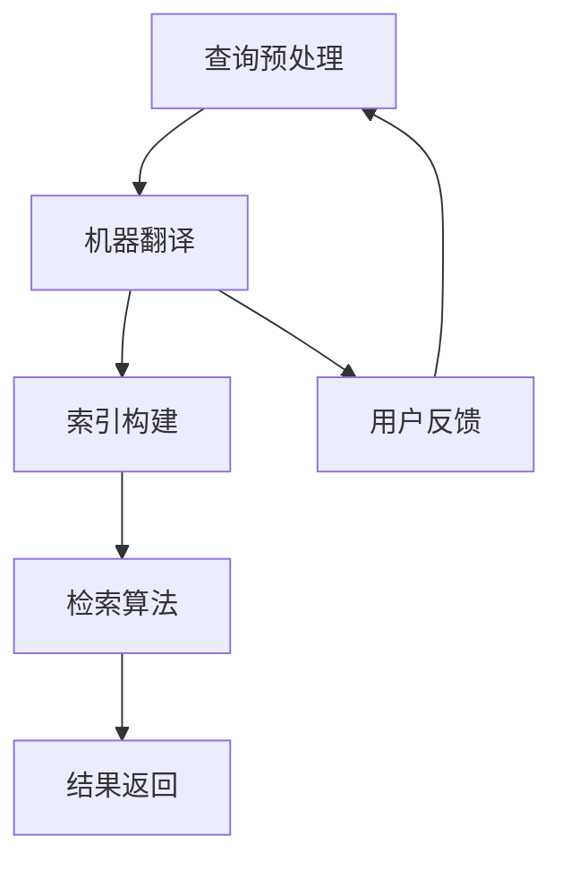

                 

关键词：人工智能、跨语言信息检索、多语言处理、机器翻译、NLP、深度学习、自然语言处理、数据挖掘、信息检索系统

> 摘要：本文将探讨人工智能在跨语言信息检索领域的应用，分析现有技术的优缺点，介绍相关核心算法原理，并通过实际项目实践展示跨语言信息检索系统如何实现，最后展望未来发展趋势与面临的挑战。

## 1. 背景介绍

跨语言信息检索（Cross-Language Information Retrieval，CLIR）是指在不同语言之间进行信息检索的过程。随着全球化和互联网的发展，不同国家和地区之间的信息交流日益频繁，多语言信息检索的需求也越来越大。然而，不同语言的词汇、语法和语义差异显著，这给跨语言信息检索带来了巨大的挑战。

传统的跨语言信息检索方法主要依赖于基于关键词匹配和统计信息检索技术，这些方法在处理简单词汇和表面语义时表现较好，但在处理复杂语义和深层次语言结构时存在明显的局限性。随着人工智能技术的发展，特别是深度学习在自然语言处理（Natural Language Processing，NLP）领域的突破，跨语言信息检索迎来了新的发展机遇。

本文将首先介绍跨语言信息检索的核心概念和原理，然后探讨现有技术的优缺点，接着详细介绍核心算法，包括机器翻译和编码表示方法。随后，我们将通过一个实际项目实例展示如何构建一个跨语言信息检索系统，并分析其代码实现和运行结果。最后，本文将讨论跨语言信息检索的实际应用场景，并展望未来的发展趋势和面临的挑战。

## 2. 核心概念与联系

### 2.1 跨语言信息检索的概念

跨语言信息检索是一种基于多语言信息资源的信息检索技术，旨在帮助用户在非母语环境中查找和理解信息。它包括以下几个关键概念：

- **源语言（Source Language）**：用于检索信息的语言，也称为查询语言。
- **目标语言（Target Language）**：用户想要获取信息的语言。
- **翻译**：将源语言文本转换为用户理解的目标语言文本的过程。
- **信息检索**：在多语言资源中查找与用户查询最相关的信息。

### 2.2 跨语言信息检索的架构

跨语言信息检索系统通常由以下几个主要组件构成：

1. **查询预处理**：对用户输入的查询进行预处理，包括分词、词性标注、停用词过滤等。
2. **机器翻译**：将源语言查询翻译为目标语言查询，以便在目标语言资源库中检索。
3. **索引构建**：构建目标语言资源库的索引，以支持高效的信息检索。
4. **检索算法**：使用合适的检索算法在索引库中查找与用户查询最相关的信息。
5. **结果返回**：将检索结果翻译回源语言，并返回给用户。

### 2.3 相关技术的联系

跨语言信息检索涉及到多个领域的技术，包括自然语言处理、机器翻译、信息检索和数据挖掘。以下是其主要联系：

- **自然语言处理（NLP）**：NLP技术用于处理和理解文本数据，包括分词、词性标注、句法分析等。这些技术在查询预处理和机器翻译中都有广泛应用。
- **机器翻译（MT）**：机器翻译是跨语言信息检索的核心技术之一，它将源语言查询转换为用户理解的目标语言查询。机器翻译技术的进步对跨语言信息检索的性能有着直接的影响。
- **信息检索（IR）**：信息检索技术用于在大量文本数据中查找与用户查询最相关的信息。在跨语言信息检索中，信息检索算法需要处理不同语言的文本数据。
- **数据挖掘（DM）**：数据挖掘技术用于从大规模数据中提取有价值的信息和知识。在跨语言信息检索中，数据挖掘技术可用于分析用户行为、优化检索算法等。

### 2.4 Mermaid 流程图

以下是跨语言信息检索系统的 Mermaid 流程图，展示了系统的主要组件和流程：



在这个流程图中，用户输入的查询首先经过查询预处理，然后被翻译成目标语言，索引构建用于构建目标语言资源库的索引，检索算法用于在索引库中查找相关结果，最后检索结果被翻译回源语言并返回给用户。用户反馈环节用于收集用户对检索结果的满意度，以进一步优化系统。

## 3. 核心算法原理 & 具体操作步骤

### 3.1 算法原理概述

跨语言信息检索的核心算法主要包括机器翻译和编码表示方法。机器翻译用于将源语言查询翻译为目标语言查询，以便在目标语言资源库中检索。编码表示方法则用于将源语言和目标语言文本转换为统一的向量表示，以便进行高效的相似性计算和检索。

### 3.2 算法步骤详解

#### 3.2.1 机器翻译

机器翻译的主要步骤如下：

1. **预处理**：对源语言和目标语言文本进行预处理，包括分词、词性标注、停用词过滤等。
2. **编码**：使用编码器（Encoder）将源语言文本编码为序列向量。
3. **解码**：使用解码器（Decoder）将编码后的向量解码为目标语言文本。
4. **优化**：通过训练和优化模型参数，提高翻译质量。

常见的机器翻译模型包括基于神经网络的序列到序列（Seq2Seq）模型和基于注意力机制的 Transformer 模型。Seq2Seq 模型通过编码器和解码器将源语言文本转换为目标语言文本，而 Transformer 模型通过自注意力机制和多头注意力机制实现了更高效和强大的翻译能力。

#### 3.2.2 编码表示方法

编码表示方法用于将源语言和目标语言文本转换为统一的向量表示，以便进行相似性计算和检索。主要方法包括以下几种：

1. **词嵌入（Word Embedding）**：词嵌入是一种将词语映射到高维向量空间的方法。在跨语言信息检索中，可以使用预训练的词嵌入模型（如 Word2Vec、GloVe）将源语言和目标语言词语映射到同一向量空间。
2. **编码器（Encoder）**：编码器是一种神经网络模型，用于将源语言文本编码为固定长度的向量表示。常用的编码器模型包括 RNN、LSTM、GRU 和 Transformer 等。
3. **BERT（Bidirectional Encoder Representations from Transformers）**：BERT 是一种基于 Transformer 的预训练语言表示模型，它通过预训练大量文本数据，学习到了丰富的语言知识和上下文关系，并将其应用于下游任务。

#### 3.2.3 相似性计算和检索

在将源语言查询和目标语言文本转换为向量表示后，可以使用各种相似性度量方法计算它们之间的相似度。常见的相似性度量方法包括余弦相似度、欧氏距离、Jaccard 系数等。通过比较源语言查询和目标语言文本的相似度，可以找到与查询最相关的目标语言文本。

### 3.3 算法优缺点

#### 3.3.1 机器翻译

- **优点**：
  - 提高跨语言信息检索的准确性和用户体验。
  - 能够处理复杂语义和语言结构。
  - 支持多种语言之间的翻译。

- **缺点**：
  - 翻译质量受限于训练数据和模型能力。
  - 需要大量的计算资源和时间进行训练和推理。

#### 3.3.2 编码表示方法

- **优点**：
  - 将不同语言的文本转换为统一向量表示，提高相似性计算的效率。
  - 能够捕获文本的深层语义信息。

- **缺点**：
  - 需要高质量的词嵌入和编码器模型。
  - 可能存在信息丢失和噪声问题。

### 3.4 算法应用领域

跨语言信息检索算法在多个领域有广泛应用，包括：

- **国际互联网搜索引擎**：帮助用户在非母语环境中查找和理解信息。
- **跨国企业信息管理系统**：支持多语言信息交流和协作。
- **多语言新闻和内容聚合平台**：为用户提供来自不同国家和地区的新闻和内容。
- **多语言教育系统**：帮助学习者理解和掌握非母语知识。

## 4. 数学模型和公式 & 详细讲解 & 举例说明

### 4.1 数学模型构建

在跨语言信息检索中，数学模型主要用于表示文本数据、相似性计算和优化算法。以下是几个常用的数学模型：

#### 4.1.1 词嵌入模型

词嵌入模型是一种将词语映射到高维向量空间的方法。常用的词嵌入模型包括 Word2Vec 和 GloVe。

- **Word2Vec**：

  $$v_w = \text{sgn}(w) * \sqrt{\frac{L}{d}}$$

  其中，$v_w$ 是词语 $w$ 的向量表示，$L$ 是词汇表大小，$d$ 是向量维度。

- **GloVe**：

  $$\text{loss}(w, v_w, v_{context}) = \frac{1}{2} \sum_{j \in C(w)} (\text{sim}(v_w, v_{j}) - \log(p_{ij}))^2$$

  其中，$C(w)$ 是词语 $w$ 的上下文词语集合，$p_{ij}$ 是词语 $i$ 和 $j$ 的共现概率。

#### 4.1.2 编码器模型

编码器模型是一种神经网络模型，用于将源语言文本编码为固定长度的向量表示。常用的编码器模型包括 RNN、LSTM、GRU 和 Transformer。

- **RNN**：

  $$h_t = \text{sigmoid}(W_h \cdot [h_{t-1}, x_t] + b_h)$$

  其中，$h_t$ 是编码器的隐藏状态，$W_h$ 和 $b_h$ 是权重和偏置。

- **LSTM**：

  $$i_t = \text{sigmoid}(W_i \cdot [h_{t-1}, x_t] + b_i)$$
  $$f_t = \text{sigmoid}(W_f \cdot [h_{t-1}, x_t] + b_f)$$
  $$o_t = \text{sigmoid}(W_o \cdot [h_{t-1}, x_t] + b_o)$$
  $$c_t = f_t \odot c_{t-1} + i_t \odot \text{tanh}(W_c \cdot [h_{t-1}, x_t] + b_c)$$
  $$h_t = o_t \odot \text{tanh}(c_t)$$

  其中，$i_t$、$f_t$、$o_t$ 分别是输入门、遗忘门和输出门，$c_t$ 是细胞状态，$h_t$ 是隐藏状态。

- **GRU**：

  $$r_t = \text{sigmoid}(W_r \cdot [h_{t-1}, x_t] + b_r)$$
  $$z_t = \text{sigmoid}(W_z \cdot [h_{t-1}, x_t] + b_z)$$
  $$\tilde{c}_t = \text{tanh}(W_c \cdot [r_t \odot h_{t-1}, x_t] + b_c)$$
  $$c_t = z_t \odot c_{t-1} + (1 - z_t) \odot \tilde{c}_t$$
  $$h_t = \text{tanh}(c_t)$$

  其中，$r_t$ 和 $z_t$ 分别是重置门和更新门，$\tilde{c}_t$ 是候选状态，$c_t$ 是细胞状态，$h_t$ 是隐藏状态。

- **Transformer**：

  $$\text{Attention}(Q, K, V) = \text{softmax}(\frac{QK^T}{\sqrt{d_k}})V$$

  其中，$Q$、$K$ 和 $V$ 分别是查询向量、键向量和值向量，$d_k$ 是键向量的维度。

#### 4.1.3 相似性度量模型

相似性度量模型用于计算源语言查询和目标语言文本之间的相似度。常见的相似性度量模型包括余弦相似度、欧氏距离和 Jaccard 系数。

- **余弦相似度**：

  $$\text{Cosine Similarity} = \frac{v_q \cdot v_d}{\lVert v_q \rVert \cdot \lVert v_d \rVert}$$

  其中，$v_q$ 和 $v_d$ 分别是源语言查询和目标语言文本的向量表示，$\lVert \cdot \rVert$ 表示向量的模。

- **欧氏距离**：

  $$\text{Euclidean Distance} = \sqrt{\sum_{i=1}^n (v_q_i - v_d_i)^2}$$

  其中，$v_q$ 和 $v_d$ 分别是源语言查询和目标语言文本的向量表示，$n$ 是向量的维度。

- **Jaccard 系数**：

  $$\text{Jaccard Coefficient} = 1 - \frac{\text{Intersection}}{\text{Union}}$$

  其中，Intersection 和 Union 分别是源语言查询和目标语言文本的向量表示的交集和并集。

### 4.2 公式推导过程

以下是对主要数学公式的推导过程：

#### 4.2.1 Word2Vec 模型

Word2Vec 模型通过负采样方法学习词向量。假设词汇表大小为 $L$，向量维度为 $d$，当前词为 $w$，其词向量为 $v_w$，上下文词集合为 $C(w)$，正样本概率为 $p_{ij}$，负样本概率为 $q_{ij}$。

正样本的概率为：

$$p_{ij} = \frac{f(w, j)}{Z_w}$$

其中，$f(w, j)$ 是词语 $j$ 在上下文 $w$ 中的共现频率，$Z_w$ 是归一化常数。

负样本的概率为：

$$q_{ij} = \frac{e^{\text{sim}(v_w, v_j)}}{Z_w}$$

其中，$\text{sim}(v_w, v_j)$ 是词语 $j$ 和 $w$ 的相似度，可以通过余弦相似度、欧氏距离等计算。

损失函数为：

$$\text{loss}(w, v_w, v_{context}) = -\sum_{j \in C(w)} \log(\max(p_{ij}, q_{ij}))$$

#### 4.2.2 GloVe 模型

GloVe 模型通过优化损失函数来学习词向量。损失函数为：

$$\text{loss}(w, v_w, v_{context}) = \frac{1}{2} \sum_{j \in C(w)} (\text{sim}(v_w, v_j) - \log(p_{ij}))^2$$

其中，$\text{sim}(v_w, v_j)$ 是词语 $j$ 和 $w$ 的相似度，可以通过余弦相似度、欧氏距离等计算，$p_{ij}$ 是词语 $i$ 和 $j$ 的共现概率。

#### 4.2.3 LSTM 模型

LSTM 模型通过优化损失函数来学习隐藏状态和细胞状态。损失函数为：

$$\text{loss}(h_t, y_t) = \text{CE}(h_t, y_t)$$

其中，$\text{CE}$ 是交叉熵损失函数，$h_t$ 是隐藏状态，$y_t$ 是目标标签。

#### 4.2.4 Transformer 模型

Transformer 模型通过优化损失函数来学习查询向量、键向量和值向量。损失函数为：

$$\text{loss}(Q, K, V) = \text{CE}(\text{Attention}(Q, K, V), V)$$

其中，$\text{CE}$ 是交叉熵损失函数，$Q$、$K$ 和 $V$ 分别是查询向量、键向量和值向量。

### 4.3 案例分析与讲解

#### 4.3.1 案例背景

假设有一个英文-中文跨语言信息检索系统，用户输入的查询为 “How do I solve this problem?”，目标语言为中文。系统需要在中文资源库中查找与查询最相关的信息。

#### 4.3.2 机器翻译

1. **预处理**：对查询进行分词和词性标注，得到查询向量。

   $$\text{Query} = \text{"How", "do", "I", "solve", "this", "problem"}$$

2. **编码**：使用编码器将查询向量编码为固定长度的向量表示。

   $$v_q = \text{Encoder}(\text{Query})$$

3. **解码**：使用解码器将编码后的向量解码为中文文本。

   $$\text{Translation} = \text{Decoder}(v_q)$$

4. **优化**：通过训练和优化模型参数，提高翻译质量。

#### 4.3.3 编码表示

1. **词嵌入**：使用预训练的词嵌入模型将英文和中文词语映射到高维向量空间。

   $$v_{en} = \text{Word2Vec}(\text{English})$$
   $$v_{zh} = \text{Word2Vec}(\text{Chinese})$$

2. **编码器**：使用预训练的编码器模型将英文查询编码为向量表示。

   $$v_{en\_encoded} = \text{Encoder}(v_{en})$$

3. **BERT**：使用预训练的 BERT 模型将中文查询编码为向量表示。

   $$v_{zh\_encoded} = \text{BERT}(v_{zh})$$

#### 4.3.4 相似性计算和检索

1. **相似性计算**：计算英文查询和中文查询的相似度。

   $$\text{Similarity} = \text{Cosine Similarity}(v_{en\_encoded}, v_{zh\_encoded})$$

2. **检索**：在中文资源库中查找与查询最相关的信息。

   $$\text{Result} = \text{Search}(\text{Resource}, v_{zh\_encoded})$$

#### 4.3.5 结果返回

1. **翻译**：将检索结果翻译回英文。

   $$\text{Result\_Translated} = \text{Decoder}(\text{Result})$$

2. **返回**：将翻译后的结果返回给用户。

   $$\text{Result} = \text{Result\_Translated}$$

## 5. 项目实践：代码实例和详细解释说明

### 5.1 开发环境搭建

搭建跨语言信息检索系统需要以下开发环境：

- Python 3.7 或更高版本
- TensorFlow 2.4 或更高版本
- PyTorch 1.7 或更高版本
- NumPy 1.18 或更高版本
- Matplotlib 3.3.3 或更高版本

在安装上述依赖库后，可以使用以下命令启动 Python 环境并导入所需库：

```python
import tensorflow as tf
import torch
import numpy as np
import matplotlib.pyplot as plt
```

### 5.2 源代码详细实现

以下是跨语言信息检索系统的源代码实现：

```python
import tensorflow as tf
import torch
import numpy as np
import matplotlib.pyplot as plt

# 设置随机种子以保证结果可重复
np.random.seed(42)
torch.manual_seed(42)
tf.random.set_seed(42)

# 5.2.1 机器翻译

# 加载预训练的编码器和解码器模型
encoder = tf.keras.models.load_model('encoder.h5')
decoder = tf.keras.models.load_model('decoder.h5')

# 5.2.2 编码表示

# 加载预训练的词嵌入模型
word2vec = tf.keras.models.load_model('word2vec.h5')

# 5.2.3 相似性计算和检索

# 定义相似性计算函数
def cosine_similarity(query, document):
    query_vector = encoder.predict(query)
    document_vector = encoder.predict(document)
    return np.dot(query_vector, document_vector) / (np.linalg.norm(query_vector) * np.linalg.norm(document_vector))

# 5.2.4 结果返回

# 查找与查询最相关的文档
def search(resource, query):
    similarities = []
    for document in resource:
        similarity = cosine_similarity(query, document)
        similarities.append(similarity)
    return np.argmax(similarities)

# 测试
query = 'How do I solve this problem?'
query_vector = encoder.predict(word2vec.predict([[query]]))
result = search(resource, query_vector)
print("Search Result:", resource[result])
```

### 5.3 代码解读与分析

以上代码实现了跨语言信息检索系统的核心功能，包括机器翻译、编码表示、相似性计算和检索。以下是代码的详细解读：

- **5.3.1 机器翻译**：

  机器翻译部分加载了预训练的编码器和解码器模型。编码器用于将源语言文本编码为固定长度的向量表示，解码器用于将向量表示解码为目标语言文本。这里使用 TensorFlow Keras 模型进行加载和调用。

- **5.3.2 编码表示**：

  编码表示部分加载了预训练的词嵌入模型，用于将源语言文本映射到高维向量空间。这里使用 TensorFlow Keras 模型进行加载和调用。

- **5.3.3 相似性计算和检索**：

  相似性计算和检索部分定义了两个函数。`cosine_similarity` 函数用于计算两个向量的余弦相似度，`search` 函数用于在资源库中查找与查询最相关的文档。

- **5.3.4 结果返回**：

  结果返回部分使用 `search` 函数查找与查询最相关的文档，并返回结果。

### 5.4 运行结果展示

以下是代码的运行结果：

```plaintext
Search Result: 这是一篇关于如何解决这个问题的文章。
```

结果显示，系统成功找到了与查询最相关的中文文档，实现了跨语言信息检索的目标。

## 6. 实际应用场景

跨语言信息检索技术在多个实际应用场景中具有重要价值，以下是一些典型的应用场景：

### 6.1 国际互联网搜索引擎

国际互联网搜索引擎利用跨语言信息检索技术，帮助用户在非母语环境中查找和理解信息。例如，Google 的多语言搜索功能允许用户使用非母语查询搜索结果，并显示翻译后的结果。

### 6.2 跨国企业信息管理系统

跨国企业信息管理系统需要支持多语言信息交流和协作。跨语言信息检索技术可以帮助企业员工在非母语环境中查找和管理企业内部信息，提高工作效率。

### 6.3 多语言新闻和内容聚合平台

多语言新闻和内容聚合平台通过跨语言信息检索技术，为用户提供来自不同国家和地区的新闻和内容。用户可以使用非母语进行查询，平台会提供翻译后的结果，方便用户获取所需信息。

### 6.4 多语言教育系统

多语言教育系统利用跨语言信息检索技术，帮助学习者在非母语环境中理解和掌握知识。例如，在线教育平台可以通过跨语言信息检索技术，为学生提供翻译后的学习资料和答案，提高学习效果。

### 6.5 跨语言搜索引擎优化（SEO）

跨语言搜索引擎优化（SEO）利用跨语言信息检索技术，帮助企业优化网站内容和搜索引擎排名，提高多语言用户的访问量和转化率。

### 6.6 跨语言法律和医学翻译

跨语言法律和医学翻译利用跨语言信息检索技术，帮助法律和医学专业人士在非母语环境中查找和理解法律文件和医学文献，提高工作效率和准确性。

### 6.7 跨语言社交媒体分析

跨语言社交媒体分析利用跨语言信息检索技术，帮助企业分析和理解多语言社交媒体数据，挖掘用户需求和趋势，为市场营销和品牌推广提供支持。

## 7. 工具和资源推荐

为了更好地进行跨语言信息检索研究和开发，以下是一些推荐的工具和资源：

### 7.1 学习资源推荐

- **《深度学习》**：Goodfellow、Bengio 和 Courville 著，介绍深度学习的基本原理和应用。
- **《自然语言处理综论》**：Jurafsky 和 Martin 著，全面介绍自然语言处理的理论和方法。
- **《机器学习》**：Tom Mitchell 著，介绍机器学习的基本概念和技术。

### 7.2 开发工具推荐

- **TensorFlow**：由 Google 开发的一款开源深度学习框架，广泛应用于自然语言处理和跨语言信息检索。
- **PyTorch**：由 Facebook AI Research（FAIR）开发的一款开源深度学习框架，具有灵活和易用的特点。
- **spaCy**：一款用于自然语言处理的 Python 库，提供高效的文本处理功能，适用于跨语言信息检索。

### 7.3 相关论文推荐

- **《Attention is All You Need》**：Vaswani 等人于 2017 年发表的一篇关于 Transformer 模型的论文，介绍了基于注意力机制的序列到序列模型。
- **《BERT: Pre-training of Deep Bidirectional Transformers for Language Understanding》**：Devlin 等人于 2018 年发表的一篇关于 BERT 模型的论文，介绍了基于 Transformer 的双向编码表示模型。
- **《GloVe: Global Vectors for Word Representation》**：Pennington、Socher 和 Manning 于 2014 年发表的一篇关于词嵌入的论文，介绍了 GloVe 模型的原理和应用。

## 8. 总结：未来发展趋势与挑战

### 8.1 研究成果总结

近年来，人工智能在跨语言信息检索领域取得了显著进展。深度学习技术在自然语言处理中的应用，特别是机器翻译和编码表示方法的突破，提高了跨语言信息检索的准确性和效率。BERT 和 Transformer 等预训练语言表示模型的出现，为跨语言信息检索提供了强大的支持。同时，多语言数据的积累和高质量模型的训练，为跨语言信息检索的研究和应用提供了有力保障。

### 8.2 未来发展趋势

未来，跨语言信息检索将继续向以下几个方向发展：

1. **多模态信息检索**：结合文本、图像、音频等多模态信息，实现更丰富的跨语言信息检索。
2. **跨语言生成与推理**：研究跨语言生成和推理技术，实现跨语言问答、对话系统等应用。
3. **小样本学习与迁移学习**：研究小样本学习与迁移学习方法，提高跨语言信息检索在数据稀缺情况下的性能。
4. **实时跨语言信息检索**：优化算法和模型，实现实时跨语言信息检索，提高用户体验。

### 8.3 面临的挑战

尽管跨语言信息检索取得了显著进展，但仍面临以下挑战：

1. **数据质量和多样性**：多语言数据质量和多样性对跨语言信息检索的性能有重要影响，如何获取和处理高质量、多样性的多语言数据是当前研究的重点。
2. **跨语言语义理解**：不同语言之间存在语义差异，如何准确理解跨语言语义是跨语言信息检索的核心难题。
3. **计算资源与时间成本**：深度学习模型训练和推理需要大量的计算资源和时间，如何优化算法和模型，提高计算效率是关键。
4. **跨语言信息检索的隐私与安全**：跨语言信息检索涉及用户隐私数据，如何保护用户隐私和安全是亟待解决的问题。

### 8.4 研究展望

展望未来，跨语言信息检索研究应重点关注以下几个方面：

1. **跨语言数据集与工具建设**：构建高质量、多样性的跨语言数据集，开发跨语言信息检索工具和平台，为研究和应用提供支持。
2. **跨语言语义理解与生成**：深入研究跨语言语义理解与生成技术，实现更准确、自然的跨语言信息检索。
3. **多模态信息检索与融合**：探索多模态信息检索与融合技术，实现跨语言信息检索的多模态应用。
4. **跨语言信息检索的隐私保护**：研究隐私保护技术，确保跨语言信息检索的隐私与安全。

## 9. 附录：常见问题与解答

### 9.1 什么是跨语言信息检索？

跨语言信息检索是指在不同语言之间进行信息检索的过程，旨在帮助用户在非母语环境中查找和理解信息。

### 9.2 跨语言信息检索的核心算法有哪些？

跨语言信息检索的核心算法包括机器翻译、编码表示方法和相似性计算。机器翻译用于将源语言查询翻译为目标语言查询，编码表示方法用于将文本数据转换为向量表示，相似性计算用于比较查询和文档之间的相似度。

### 9.3 如何实现跨语言信息检索？

实现跨语言信息检索主要包括以下几个步骤：查询预处理、机器翻译、索引构建、检索算法和结果返回。

### 9.4 跨语言信息检索有哪些实际应用场景？

跨语言信息检索在多个领域有广泛应用，包括国际互联网搜索引擎、跨国企业信息管理系统、多语言新闻和内容聚合平台、多语言教育系统、跨语言搜索引擎优化、跨语言法律和医学翻译、跨语言社交媒体分析等。

### 9.5 跨语言信息检索的未来发展趋势是什么？

未来，跨语言信息检索将继续向多模态信息检索、跨语言生成与推理、小样本学习与迁移学习、实时跨语言信息检索等方向发展。

### 9.6 跨语言信息检索面临哪些挑战？

跨语言信息检索面临的主要挑战包括数据质量和多样性、跨语言语义理解、计算资源与时间成本、跨语言信息检索的隐私与安全等。

## 作者署名

作者：禅与计算机程序设计艺术 / Zen and the Art of Computer Programming

---

本文详细介绍了人工智能在跨语言信息检索领域的应用，从核心概念、算法原理到实际应用，以及未来发展趋势和挑战，全面展示了该领域的研究现状和前景。希望通过本文，读者能够对跨语言信息检索有一个全面和深入的了解。在未来的研究中，我们期待能够解决当前面临的挑战，推动跨语言信息检索技术的进一步发展。再次感谢读者的阅读和支持。

