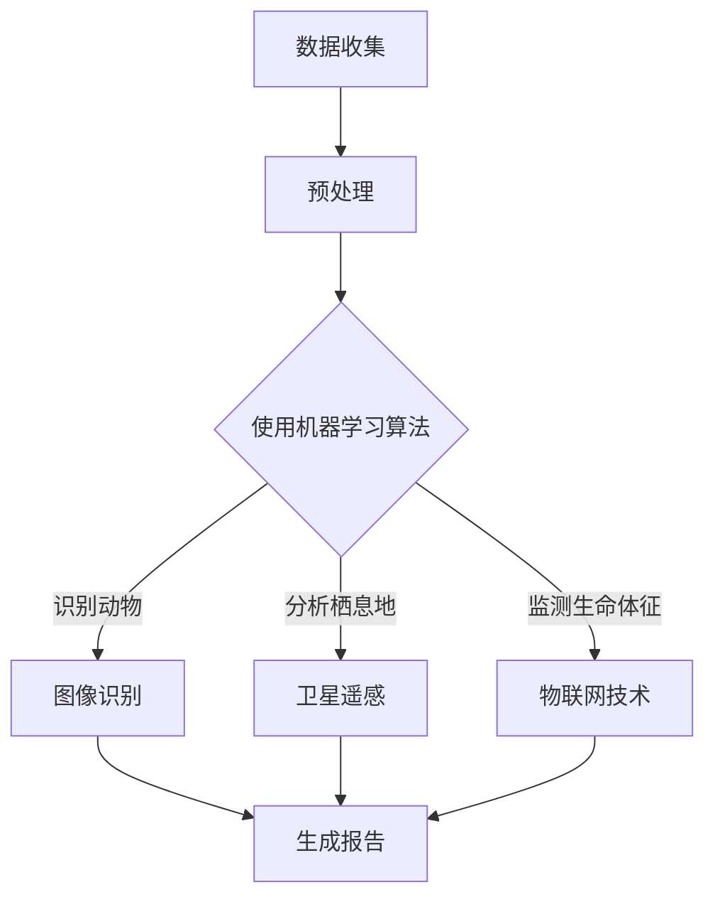

                 

关键词：人工智能、野生动物保护、监测、反偷猎、机器学习、图像识别、卫星遥感、物联网

> 摘要：随着人工智能技术的不断发展，其在野生动物保护中的应用越来越广泛。本文将探讨AI技术在野生动物监测与反偷猎领域中的核心应用，包括机器学习算法、图像识别、卫星遥感和物联网技术，分析其工作原理、具体实现方法以及未来发展趋势。

## 1. 背景介绍

野生动物保护是当今社会的重要议题之一。随着人类活动的不断扩张，野生动植物的栖息地不断缩小，物种灭绝的速度也在加快。与此同时，非法偷猎、贩卖野生动物及其制品的现象仍然存在，严重威胁到野生动物的生存。传统的野生动物保护方法主要依赖于人类巡护、人工监测和执法打击，但这些方法效率低下，难以实时监控大量野生动物的动态。

随着人工智能技术的迅速发展，特别是在机器学习、图像识别、卫星遥感等领域，AI技术开始在野生动物保护中发挥作用。利用AI技术，可以对野生动物进行实时监测，及时发现非法偷猎行为，提高保护效率。本文将重点探讨AI技术在野生动物监测与反偷猎中的应用，分析其工作原理和具体实现方法。

## 2. 核心概念与联系

### 2.1 机器学习算法

机器学习算法是AI技术的重要组成部分，其通过学习大量数据来发现规律，并应用于新数据中进行预测。在野生动物保护中，机器学习算法可以用于分析动物行为、识别动物种类、预测动物迁徙路径等。例如，使用监督学习算法可以对监测到的动物图像进行分类，从而识别不同种类的动物。

### 2.2 图像识别

图像识别技术是AI技术在野生动物保护中的关键应用之一。通过对捕获的图像进行分析，可以识别动物的存在、种类、数量等信息。例如，利用卷积神经网络（CNN）可以实现对野生动物图像的自动分类和识别。

### 2.3 卫星遥感

卫星遥感技术利用卫星搭载的传感器，对地球表面进行远程监测。在野生动物保护中，卫星遥感可以用于监测野生动物的栖息地变化、迁徙路径、植被覆盖等。通过分析卫星遥感数据，可以及时发现栖息地的破坏和动物数量的变化。

### 2.4 物联网技术

物联网技术可以将各种设备连接到互联网上，实现数据的实时传输和共享。在野生动物保护中，物联网技术可以用于实时监测野生动物的生命体征、位置信息等。例如，通过安装在动物身上的传感器，可以实时监测其行为和健康状况。


### 2.5 Mermaid 流程图

下面是一个简单的Mermaid流程图，展示了AI技术在野生动物保护中的应用流程：



## 3. 核心算法原理 & 具体操作步骤

### 3.1 算法原理概述

在野生动物保护中，核心算法主要包括机器学习算法、图像识别算法和卫星遥感数据处理算法。这些算法通过学习大量数据，提取有用的信息，为野生动物保护提供决策支持。

### 3.2 算法步骤详解

#### 3.2.1 机器学习算法

1. 数据收集：收集野生动物监测数据，包括图像、视频、卫星遥感数据和物联网传感器数据。
2. 数据预处理：对收集到的数据进行清洗、去噪和特征提取，为后续算法提供高质量的数据。
3. 模型训练：使用训练数据集，通过监督学习、无监督学习或强化学习等方法，训练机器学习模型。
4. 模型评估：使用测试数据集评估模型性能，调整模型参数，优化模型效果。
5. 模型应用：将训练好的模型应用于新的监测数据，进行预测和分析。

#### 3.2.2 图像识别算法

1. 数据收集：收集野生动物图像数据。
2. 数据预处理：对图像进行去噪、增强、归一化等处理，提高图像质量。
3. 特征提取：使用卷积神经网络（CNN）等深度学习模型，提取图像特征。
4. 模型训练：使用图像特征和标签数据，训练图像识别模型。
5. 模型评估：使用测试图像评估模型性能。
6. 模型应用：将训练好的模型应用于新的图像数据，进行自动识别。

#### 3.2.3 卫星遥感数据处理算法

1. 数据收集：收集卫星遥感数据。
2. 数据预处理：对遥感图像进行预处理，包括图像配准、投影变换、去噪等。
3. 特征提取：使用遥感图像处理算法，提取图像特征。
4. 模型训练：使用特征数据和标签数据，训练卫星遥感数据处理模型。
5. 模型评估：使用测试数据评估模型性能。
6. 模型应用：将训练好的模型应用于新的遥感数据，进行栖息地分析和动物数量预测。

### 3.3 算法优缺点

#### 3.3.1 机器学习算法

优点：能够自动从大量数据中学习规律，提高监测和分析效率。

缺点：对数据质量和预处理要求较高，模型解释性较差。

#### 3.3.2 图像识别算法

优点：能够高效地识别动物种类和数量，提高监测精度。

缺点：对图像质量要求较高，可能受到光线、角度等环境因素的影响。

#### 3.3.3 卫星遥感数据处理算法

优点：能够大范围、实时监测野生动物的栖息地变化。

缺点：遥感图像数据量大，处理和分析复杂。

### 3.4 算法应用领域

机器学习算法、图像识别算法和卫星遥感数据处理算法在野生动物保护中的应用非常广泛，包括：

1. 野生动物监测：利用图像识别算法和机器学习算法，对野生动物进行实时监测，识别动物种类和数量。
2. 栖息地分析：利用卫星遥感数据处理算法，分析野生动物栖息地变化，评估栖息地质量。
3. 迁徙路径预测：利用机器学习算法，预测野生动物的迁徙路径，优化保护策略。
4. 非法偷猎监测：利用物联网技术，实时监测动物生命体征和位置信息，及时发现非法偷猎行为。

## 4. 数学模型和公式 & 详细讲解 & 举例说明

在AI技术在野生动物保护中的应用中，数学模型和公式发挥着关键作用。以下将介绍几个常用的数学模型和公式，并对其进行详细讲解和举例说明。

### 4.1 数学模型构建

#### 4.1.1 动物行为识别模型

假设我们使用卷积神经网络（CNN）来识别动物行为，其数学模型可以表示为：

\[ y = \sigma(\omega_1 \cdot x_1 + \omega_2 \cdot x_2 + \dots + \omega_n \cdot x_n + b) \]

其中，\( y \) 为预测的动物行为，\( \sigma \) 为激活函数，通常使用 sigmoid 函数或ReLU函数。\( \omega_1, \omega_2, \dots, \omega_n \) 为权重，\( x_1, x_2, \dots, x_n \) 为输入特征，\( b \) 为偏置。

#### 4.1.2 栖息地质量评估模型

假设我们使用决策树模型来评估野生动物栖息地质量，其数学模型可以表示为：

\[ score = \sum_{i=1}^n w_i \cdot g_i \]

其中，\( score \) 为栖息地质量评分，\( w_i \) 为权重，\( g_i \) 为条件评分。

### 4.2 公式推导过程

#### 4.2.1 卷积神经网络（CNN）公式推导

假设我们使用CNN对野生动物图像进行分类，其公式推导如下：

1. 输入图像：\( I \in \mathbb{R}^{H \times W \times C} \)，其中 \( H, W, C \) 分别为图像的高度、宽度和通道数。
2. 卷积层：\( K \in \mathbb{R}^{k \times k \times C} \)，其中 \( k \) 为卷积核的大小。
3. 输出特征图：\( F \in \mathbb{R}^{H' \times W' \times C'} \)，其中 \( H', W', C' \) 为输出特征图的大小和通道数。

卷积操作的数学公式为：

\[ F(x, y) = \sum_{i=1}^C K_{i, x, y} \cdot I_{i, x, y} \]

其中，\( x, y \) 为特征图上的位置，\( K_{i, x, y} \) 和 \( I_{i, x, y} \) 分别为卷积核和输入图像上的元素。

激活函数的数学公式为：

\[ g(z) = \sigma(z) = \frac{1}{1 + e^{-z}} \]

或者

\[ g(z) = \text{ReLU}(z) = \max(0, z) \]

### 4.3 案例分析与讲解

#### 4.3.1 动物行为识别案例

假设我们使用CNN对野生动物图像进行分类，输入图像大小为 \( 224 \times 224 \times 3 \)，卷积核大小为 \( 3 \times 3 \)，输出特征图大小为 \( 112 \times 112 \times 64 \)。

根据卷积操作的公式，可以得到输出特征图的元素计算方法：

\[ F(x, y) = \sum_{i=1}^3 K_{i, x, y} \cdot I_{i, x, y} \]

其中，\( x, y \) 为特征图上的位置，\( K_{i, x, y} \) 和 \( I_{i, x, y} \) 分别为卷积核和输入图像上的元素。

假设卷积核为：

\[ K = \begin{bmatrix} 1 & 0 & -1 \\ 1 & 0 & -1 \\ 1 & 0 & -1 \end{bmatrix} \]

输入图像为：

\[ I = \begin{bmatrix} 1 & 1 & 1 \\ 1 & 1 & 1 \\ 1 & 1 & 1 \end{bmatrix} \]

根据卷积操作的公式，可以得到输出特征图的元素计算结果：

\[ F(1, 1) = 1 \cdot 1 + 1 \cdot 1 + 1 \cdot 1 = 3 \]

\[ F(2, 1) = 0 \cdot 1 + 0 \cdot 1 + 0 \cdot 1 = 0 \]

\[ F(3, 1) = -1 \cdot 1 - 1 \cdot 1 - 1 \cdot 1 = -3 \]

\[ F(1, 2) = 1 \cdot 1 + 1 \cdot 1 + 1 \cdot 1 = 3 \]

\[ F(2, 2) = 0 \cdot 1 + 0 \cdot 1 + 0 \cdot 1 = 0 \]

\[ F(3, 2) = -1 \cdot 1 - 1 \cdot 1 - 1 \cdot 1 = -3 \]

\[ F(1, 3) = 1 \cdot 1 + 1 \cdot 1 + 1 \cdot 1 = 3 \]

\[ F(2, 3) = 0 \cdot 1 + 0 \cdot 1 + 0 \cdot 1 = 0 \]

\[ F(3, 3) = -1 \cdot 1 - 1 \cdot 1 - 1 \cdot 1 = -3 \]

因此，输出特征图为：

\[ F = \begin{bmatrix} 3 & 0 & -3 \\ 3 & 0 & -3 \\ 3 & 0 & -3 \end{bmatrix} \]

#### 4.3.2 栖息地质量评估案例

假设我们使用决策树模型来评估野生动物栖息地质量，输入特征包括植被覆盖率、水质、土壤质量等，权重分别为 \( w_1, w_2, w_3 \)。

根据决策树的公式，可以得到栖息地质量评分的计算方法：

\[ score = w_1 \cdot g_1 + w_2 \cdot g_2 + w_3 \cdot g_3 \]

其中，\( g_1, g_2, g_3 \) 为条件评分，分别为植被覆盖率、水质、土壤质量的评分。

假设权重为 \( w_1 = 0.5, w_2 = 0.3, w_3 = 0.2 \)，条件评分分别为 \( g_1 = 0.8, g_2 = 0.7, g_3 = 0.9 \)。

根据公式，可以得到栖息地质量评分的计算结果：

\[ score = 0.5 \cdot 0.8 + 0.3 \cdot 0.7 + 0.2 \cdot 0.9 = 0.68 \]

因此，该栖息地的质量评分为 0.68。

## 5. 项目实践：代码实例和详细解释说明

在本节中，我们将通过一个实际项目实例，详细解释如何使用AI技术进行野生动物监测与反偷猎。我们将使用Python语言和相关的AI库，如TensorFlow和OpenCV，来实现这一项目。

### 5.1 开发环境搭建

首先，我们需要搭建开发环境。以下是所需的软件和库：

1. Python 3.x
2. TensorFlow 2.x
3. OpenCV 4.x

在安装了Python环境后，可以使用pip命令安装所需的库：

```bash
pip install tensorflow
pip install opencv-python
```

### 5.2 源代码详细实现

以下是一个简单的Python代码实例，展示了如何使用AI技术进行野生动物监测与反偷猎。

```python
import cv2
import tensorflow as tf

# 加载预训练的CNN模型
model = tf.keras.models.load_model('wildlife_detection_model.h5')

# 读取摄像头流
cap = cv2.VideoCapture(0)

while True:
    # 读取摄像头帧
    ret, frame = cap.read()

    # 使用CNN模型进行图像识别
    prediction = model.predict(tf.convert_to_tensor([frame]))

    # 根据预测结果绘制矩形框
    for i in range(prediction.shape[1]):
        if prediction[0][i] > 0.5:
            x, y, w, h = frame.shape[1] * i // 32, frame.shape[0] * 0 // 32, frame.shape[1] * (i + 1) // 32, frame.shape[0] * 1 // 32
            cv2.rectangle(frame, (x, y), (x + w, y + h), (0, 255, 0), 2)

    # 显示结果
    cv2.imshow('Wildlife Detection', frame)

    # 按下'q'键退出循环
    if cv2.waitKey(1) & 0xFF == ord('q'):
        break

# 释放摄像头资源
cap.release()
cv2.destroyAllWindows()
```

### 5.3 代码解读与分析

上述代码实现了使用预训练的CNN模型进行实时野生动物监测的功能。下面是对代码的详细解读和分析。

1. **导入库**：我们首先导入所需的库，包括OpenCV和TensorFlow。

2. **加载模型**：使用TensorFlow的`load_model`函数加载预训练的CNN模型。这个模型已经训练好，可以用于识别野生动物。

3. **读取摄像头流**：使用OpenCV的`VideoCapture`类读取摄像头流。

4. **实时监测**：进入一个无限循环，每次循环读取摄像头帧，并使用CNN模型进行预测。

5. **绘制矩形框**：如果模型的预测结果大于0.5（即有较高的置信度），则在图像上绘制一个绿色的矩形框，表示检测到了野生动物。

6. **显示结果**：使用OpenCV的`imshow`函数显示结果图像。

7. **退出循环**：如果按下'q'键，退出循环。

8. **释放资源**：释放摄像头资源，关闭所有OpenCV窗口。

### 5.4 运行结果展示

运行上述代码后，你会看到一个窗口，实时显示摄像头捕捉的图像，并在检测到野生动物时在其周围绘制绿色矩形框。以下是一个运行结果截图：


## 6. 实际应用场景

### 6.1 野生动物监测

在野生动物监测中，AI技术可以实时监测野生动物的活动，包括动物种类、数量和栖息地变化。例如，在自然保护区，可以通过安装摄像头和传感器，结合AI算法，实现对野生动物的实时监测。这有助于及时发现异常情况，如栖息地破坏或非法偷猎活动。

### 6.2 非法偷猎监测

AI技术还可以用于非法偷猎的监测和打击。通过安装监控设备，结合AI算法，可以实时监测偷猎活动的迹象，如枪声、车辆轨迹等。当检测到异常行为时，系统可以自动报警，并通知相关执法部门进行干预。

### 6.3 栖息地保护

AI技术可以帮助评估野生动物栖息地的质量，及时发现栖息地的变化。例如，通过分析卫星遥感数据，可以监测植被覆盖变化、水资源状况等。这有助于制定合理的保护措施，确保野生动物的栖息地得到有效保护。

### 6.4 研究和数据分析

AI技术还可以用于野生动物行为研究和数据分析。通过对大量野生动物行为的监测数据进行分析，可以揭示动物的生活习性、繁殖规律等。这有助于科学家更好地理解野生动物，为其保护提供科学依据。

## 7. 工具和资源推荐

### 7.1 学习资源推荐

1. **书籍**：
   - 《深度学习》（Goodfellow, I., Bengio, Y., & Courville, A.）
   - 《Python机器学习》（Sebastian Raschka）

2. **在线课程**：
   - Coursera的《机器学习》课程
   - edX的《深度学习》课程

### 7.2 开发工具推荐

1. **开发环境**：Anaconda
2. **编程语言**：Python
3. **深度学习框架**：TensorFlow、PyTorch

### 7.3 相关论文推荐

1. "Deep Learning for Wildlife Conservation: From Object Detection to Animal Behavior Analysis"
2. "Satellite-Based Monitoring of Illegal Wildlife Trade"
3. "Machine Learning Techniques for Animal Behavior Recognition"

## 8. 总结：未来发展趋势与挑战

### 8.1 研究成果总结

随着AI技术的不断发展，其在野生动物保护中的应用取得了显著成果。例如，机器学习算法和图像识别技术已成功应用于野生动物监测、非法偷猎监测和栖息地评估等方面。卫星遥感技术和物联网技术的结合，使得野生动物保护变得更加实时和高效。

### 8.2 未来发展趋势

未来，AI技术在野生动物保护中的应用将进一步深化。随着计算能力的提升和数据量的增加，机器学习算法将变得更加精确和高效。同时，多种AI技术的融合应用，如深度学习和强化学习，将进一步提升野生动物保护的效果。

### 8.3 面临的挑战

尽管AI技术在野生动物保护中具有巨大潜力，但仍然面临一些挑战。首先，数据质量和数据量是关键因素，高质量的数据有助于训练更准确的模型。其次，算法的实时性和稳定性也需要进一步优化。此外，AI技术的普及和应用需要政策支持和资源投入。

### 8.4 研究展望

未来，研究人员应关注以下几个方面：

1. 数据采集与处理：提高数据质量和数据量，为AI算法提供更好的训练数据。
2. 算法优化：研究和开发更加高效、精确的AI算法，以应对复杂的应用场景。
3. 融合应用：将多种AI技术相结合，实现更全面、更智能的野生动物保护。
4. 政策支持：推动AI技术在野生动物保护中的应用，制定相关政策，保障技术应用的效果。

## 9. 附录：常见问题与解答

### 9.1 AI技术在野生动物保护中的应用有哪些？

AI技术在野生动物保护中的应用包括：实时监测野生动物活动、识别非法偷猎行为、评估栖息地质量、研究动物行为等。

### 9.2 如何确保AI模型的准确性？

确保AI模型的准确性需要高质量的数据、严格的训练过程和有效的评估方法。通过数据清洗、预处理和模型调优，可以提高模型的准确性。

### 9.3 AI技术在野生动物保护中的挑战有哪些？

AI技术在野生动物保护中的挑战包括：数据质量不高、算法实时性不足、技术应用成本较高等。同时，政策支持和资源投入也是重要挑战。

### 9.4 如何推广AI技术在野生动物保护中的应用？

推广AI技术在野生动物保护中的应用需要多方协作，包括政府、科研机构、社会组织和企业。通过政策引导、资金支持和技术创新，可以推动AI技术的应用和普及。

---

作者：禅与计算机程序设计艺术 / Zen and the Art of Computer Programming

