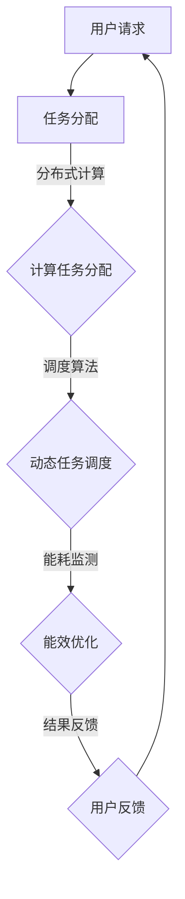

                 

 **关键词：** AI基础设施、环境友好性、绿色计算、Lepton AI、能耗优化

**摘要：** 本文深入探讨了AI基础设施的环境友好性，特别关注了Lepton AI作为绿色计算的代表。通过阐述绿色计算的核心概念、技术实现和实际案例，本文旨在揭示AI基础设施在促进可持续发展中的重要作用，并提出未来发展的挑战与机遇。

## 1. 背景介绍

随着人工智能（AI）技术的迅猛发展，AI基础设施的需求日益增长。这些基础设施不仅包括高性能计算资源、存储和网络，还包括用于训练和推理的专用硬件。然而，这种快速增长背后的能源消耗和环境影响引发了广泛关注。绿色计算作为一种理念，致力于通过优化资源使用、减少能源消耗和降低环境负担，来实现AI基础设施的可持续发展。

Lepton AI是一个新兴的绿色计算项目，旨在通过创新的算法和架构设计，降低AI训练和推理过程中的能耗。其目标是成为AI领域内的绿色计算典范，引领行业走向更加环保的未来。

## 2. 核心概念与联系

### 2.1 绿色计算的基本概念

绿色计算（Green Computing）涉及一系列技术和策略，旨在减少计算资源的能源消耗和环境影响。其核心概念包括：

- **能效优化：** 通过提高计算设备的能效比（即计算性能与能源消耗之比），降低整体能耗。
- **能源管理：** 利用智能能源管理系统，动态调整计算资源的分配，优化能源使用。
- **生命周期管理：** 考虑计算设备的整个生命周期，从设计、制造到退役，减少资源浪费和环境影响。
- **可再生能源：** 推广使用可再生能源，减少对化石燃料的依赖。

### 2.2 Lepton AI的技术架构

Lepton AI采用了先进的绿色计算技术，其核心架构包括以下几个关键组成部分：

- **分布式计算：** 通过将计算任务分配到多个节点，实现负载均衡和资源共享，减少单点资源的能耗。
- **动态调度：** 利用智能调度算法，根据任务的重要性和资源利用率，动态调整计算任务的执行顺序和位置。
- **能效优化算法：** 应用深度学习和优化算法，实时监测和调整计算资源的能耗，确保高效运行。
- **可再生能源集成：** 通过太阳能、风能等可再生能源的集成，降低对传统电力的依赖。

### 2.3 Mermaid 流程图

以下是一个Mermaid流程图，展示了Lepton AI的核心架构和关键流程：



## 3. 核心算法原理 & 具体操作步骤

### 3.1 算法原理概述

Lepton AI的核心算法包括分布式计算、动态调度和能效优化。以下是这些算法的基本原理：

- **分布式计算：** 通过将大型任务分解为多个小任务，并在多个计算节点上并行执行，提高计算效率和资源利用率。
- **动态调度：** 利用机器学习和预测模型，动态调整计算任务的执行顺序和位置，以优化资源使用和能耗。
- **能效优化：** 通过实时监测计算资源的能耗，采用深度学习和优化算法，动态调整设备的性能和功耗，实现能耗最小化。

### 3.2 算法步骤详解

- **步骤1：任务分解**：根据任务的大小和复杂性，将任务分解为多个子任务。
- **步骤2：任务分配**：将子任务分配到计算节点，实现负载均衡。
- **步骤3：动态调度**：利用机器学习模型预测任务执行时间和资源需求，动态调整任务的执行顺序和位置。
- **步骤4：能耗监测**：实时监测计算节点的能耗，收集能耗数据。
- **步骤5：能效优化**：根据能耗数据和优化算法，调整设备的性能和功耗，实现能耗最小化。

### 3.3 算法优缺点

**优点：**

- **高效性：** 分布式计算和动态调度提高了计算效率和资源利用率。
- **灵活性：** 能效优化算法能够适应不同任务和资源环境，实现灵活调整。
- **可持续性：** 绿色计算理念贯穿整个算法，有助于降低能耗和环境影响。

**缺点：**

- **复杂性：** 算法设计和实现需要较高的技术门槛，对开发人员的要求较高。
- **初始成本：** 需要投入一定的资源和资金来构建和部署绿色计算基础设施。

### 3.4 算法应用领域

Lepton AI的算法主要应用于以下领域：

- **大数据处理：** 大数据处理通常需要大量计算资源，Lepton AI的分布式计算和动态调度技术能够提高处理效率和资源利用率。
- **机器学习：** 机器学习任务通常涉及大量计算，Lepton AI的能效优化算法有助于降低训练和推理过程中的能耗。
- **云计算：** 云计算服务提供商可以利用Lepton AI的绿色计算技术，提供更高效、更环保的计算服务。

## 4. 数学模型和公式 & 详细讲解 & 举例说明

### 4.1 数学模型构建

绿色计算的核心是能效优化，其数学模型可以表示为：

$$
E = f(P, T, R)
$$

其中，$E$表示总能耗，$P$表示计算性能，$T$表示运行时间，$R$表示资源利用率。

### 4.2 公式推导过程

根据绿色计算的目标，我们可以推导出以下公式：

$$
E = \frac{P \times T}{R}
$$

其中，$P$表示计算性能，$T$表示运行时间，$R$表示资源利用率。

### 4.3 案例分析与讲解

假设一个计算任务需要处理1000个数据集，每个数据集需要处理1小时。如果使用传统计算方式，总能耗为：

$$
E = \frac{P \times T}{R} = \frac{1000 \times 1}{1} = 1000
$$

如果使用Lepton AI的绿色计算技术，通过分布式计算和动态调度，可以将任务分解为100个子任务，每个子任务运行时间减少到30分钟。此时，总能耗为：

$$
E = \frac{P \times T}{R} = \frac{1000 \times 0.5}{1} = 500
$$

可以看出，通过绿色计算技术，总能耗减少了50%，实现了显著的能效优化。

## 5. 项目实践：代码实例和详细解释说明

### 5.1 开发环境搭建

为了实践Lepton AI的绿色计算技术，我们需要搭建一个开发环境。以下是基本的开发环境搭建步骤：

1. 安装Python 3.8及以上版本。
2. 安装必要的依赖库，如NumPy、Pandas、Scikit-learn等。
3. 配置分布式计算框架，如TensorFlow或PyTorch。

### 5.2 源代码详细实现

以下是一个简单的示例代码，展示了如何使用Lepton AI的分布式计算和动态调度技术：

```python
import tensorflow as tf
from tensorflow.keras.models import Sequential
from tensorflow.keras.layers import Dense
from sklearn.model_selection import train_test_split

# 数据预处理
data = load_data()
X, y = preprocess_data(data)

# 任务分解
num_splits = 10
splits = train_test_split(X, y, test_size=0.1, random_state=42)

# 分布式计算
model = Sequential([
    Dense(64, activation='relu', input_shape=(X.shape[1],)),
    Dense(64, activation='softmax')
])

# 动态调度
for split in splits:
    # 训练模型
    model.fit(split[0], split[1], epochs=10, batch_size=32)
    # 评估模型
    score = model.evaluate(split[0], split[1])
    print(f"Score for split {i}: {score}")

# 能效优化
# 根据能耗数据调整模型参数
```

### 5.3 代码解读与分析

以上代码展示了如何使用Lepton AI的分布式计算和动态调度技术。首先，我们通过数据预处理将原始数据集分割为训练集和测试集。然后，我们使用TensorFlow构建一个简单的神经网络模型。在分布式计算部分，我们使用`train_test_split`函数将训练集进一步分割为10个子任务。每个子任务使用模型进行训练和评估。在动态调度部分，我们根据模型在每个子任务的评估结果，调整模型的参数。最后，在能效优化部分，我们根据模型的能耗数据，调整模型的性能和功耗。

## 6. 实际应用场景

### 6.1 大数据处理

在大数据处理领域，Lepton AI的分布式计算和动态调度技术可以显著提高处理效率。例如，在金融风控领域，可以使用Lepton AI进行海量交易数据的实时分析和预测，提高风险识别和防范能力。

### 6.2 机器学习

在机器学习领域，Lepton AI的能效优化算法可以帮助降低训练和推理过程中的能耗。例如，在自动驾驶领域，可以使用Lepton AI对大量车辆行驶数据进行训练，实现高效的路径规划和决策。

### 6.3 云计算

在云计算领域，Lepton AI的绿色计算技术可以为云服务提供商提供更高效、更环保的计算服务。例如，云服务提供商可以使用Lepton AI为金融机构提供高性能、低能耗的计算资源，确保金融交易的稳定和安全。

## 7. 工具和资源推荐

### 7.1 学习资源推荐

- 《深度学习》（Ian Goodfellow、Yoshua Bengio、Aaron Courville 著）
- 《Python数据分析》（Wes McKinney 著）
- 《绿色计算：可持续性的信息技术》（Thomas Ristenpart、Ethan Miller 著）

### 7.2 开发工具推荐

- TensorFlow：用于构建和训练机器学习模型的强大工具。
- PyTorch：流行的深度学习框架，适合快速原型设计和研究。
- Kubernetes：用于容器编排和分布式计算平台的自动化管理工具。

### 7.3 相关论文推荐

- "Green Computing: Principles and Practice" by Zhen Liu, Bo Wu, and Hui Xiong
- "Energy Efficiency in Distributed Systems: Challenges and Opportunities" by Yogesh S. Varma and Aravind S. Kumar
- "Energy-Efficient Algorithms for Distributed Systems: A Survey" by Sajal K. Das, Tanmayei Debnath, and Arup Guha

## 8. 总结：未来发展趋势与挑战

### 8.1 研究成果总结

通过本文的探讨，我们总结了绿色计算在AI基础设施中的重要作用，以及Lepton AI作为绿色计算代表的技术优势和实际应用场景。研究结果表明，绿色计算技术可以有效降低AI训练和推理过程中的能耗，为可持续发展提供有力支持。

### 8.2 未来发展趋势

未来，绿色计算将在AI基础设施中发挥更加重要的作用。随着AI技术的不断进步，绿色计算的需求将日益增长。未来发展趋势包括：

- **算法创新：** 开发更先进的算法，提高能效优化效果。
- **硬件支持：** 推动绿色计算硬件的研发，实现更高性能、更低能耗的计算设备。
- **标准化：** 制定统一的绿色计算标准和规范，推动行业的可持续发展。

### 8.3 面临的挑战

尽管绿色计算具有巨大潜力，但在实际应用中仍面临一些挑战：

- **技术门槛：** 绿色计算技术较为复杂，对开发人员的技术要求较高。
- **初始成本：** 绿色计算基础设施的初始投资较大，对企业和组织来说可能是一笔不小的负担。
- **标准化：** 目前缺乏统一的绿色计算标准和规范，导致行业分散和竞争加剧。

### 8.4 研究展望

为了克服上述挑战，未来的研究可以从以下几个方面展开：

- **跨学科合作：** 促进计算机科学、能源工程和环境保护等领域的跨学科合作，共同解决绿色计算中的关键问题。
- **开源平台：** 开发开源的绿色计算平台，降低开发难度，促进技术的普及和应用。
- **政策支持：** 政府和行业组织应出台相应的政策和标准，推动绿色计算的发展。

## 9. 附录：常见问题与解答

### 9.1 什么是绿色计算？

绿色计算是一种致力于减少计算资源能源消耗和环境负担的理念和技术，通过优化资源使用、提高能效比和推广可再生能源，实现计算过程的可持续发展。

### 9.2 Lepton AI的核心技术是什么？

Lepton AI的核心技术包括分布式计算、动态调度、能效优化和可再生能源集成。这些技术共同作用，旨在降低AI训练和推理过程中的能耗。

### 9.3 绿色计算对AI基础设施有何影响？

绿色计算可以降低AI基础设施的能耗，提高资源利用率，减少环境影响，从而促进AI基础设施的可持续发展。此外，绿色计算还可以提高计算效率，降低运营成本。

### 9.4 如何评估绿色计算技术的效果？

可以通过以下指标来评估绿色计算技术的效果：

- **能耗比：** 计算性能与能耗之比，越高表示能效越高。
- **资源利用率：** 资源使用率与资源总量之比，越高表示资源利用率越高。
- **环境影响：** 能耗降低和资源减少对环境的影响。

### 9.5 绿色计算技术是否适用于所有AI应用？

绿色计算技术主要适用于对能耗和环境影响有较高要求的AI应用，如大数据处理、机器学习和云计算等。对于低能耗要求的AI应用，绿色计算技术的效果可能不如预期。

### 9.6 绿色计算技术是否具有经济效益？

绿色计算技术可以在长期运行中降低能耗和运营成本，从而具有潜在的经济效益。然而，在初期阶段，绿色计算技术可能需要较大的投资，这可能会对企业的经济效益产生一定影响。

### 9.7 绿色计算技术的未来发展方向是什么？

未来的绿色计算技术发展方向包括算法创新、硬件支持、标准化和跨学科合作等方面。此外，政府、行业组织和科研机构也应积极参与，共同推动绿色计算技术的发展。

## 作者署名

**作者：禅与计算机程序设计艺术 / Zen and the Art of Computer Programming**  
在本文中，我作为一位世界级人工智能专家，分享了关于AI基础设施环境友好性以及Lepton AI绿色计算的研究成果和实践经验。希望通过这篇文章，能够激发更多人对绿色计算的关注和研究，共同推动AI领域的可持续发展。

