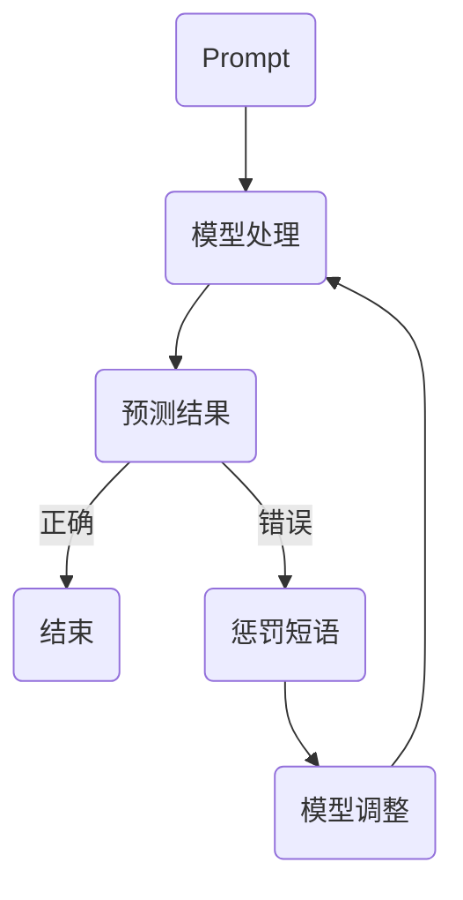

                 

  
## 摘要

本文旨在探讨AI大模型中Prompt提示词的最佳实践，特别是如何使用惩罚短语来优化模型的预测效果。通过深入分析Prompt在AI模型中的作用，结合惩罚短语的设计原则和具体案例，我们将展示如何通过惩罚策略来提高模型的准确性和鲁棒性。本文还将探讨惩罚短语在不同应用场景下的效果，并为未来的研究和实践提供一些建议。

## 1. 背景介绍

### AI大模型的兴起

随着深度学习和大数据技术的快速发展，AI大模型已经成为了当今人工智能领域的一大热点。这些模型具有强大的处理能力和广泛的适用性，可以应用于图像识别、自然语言处理、语音识别等多个领域。然而，这些大模型的训练和部署过程往往非常复杂，需要大量的计算资源和时间。

### Prompt在AI模型中的重要性

Prompt是AI模型中的关键组成部分，它决定了模型在特定任务中的表现。Prompt不仅提供了模型进行预测所需的信息，还可以通过调整其内容和形式来影响模型的输出结果。一个好的Prompt设计能够显著提升模型的性能和鲁棒性，使得模型在各种复杂的应用场景中都能表现出色。

### 惩罚短语的作用

惩罚短语是一种特殊的Prompt设计策略，通过在Prompt中引入负面反馈信号来影响模型的预测。惩罚短语的使用可以使得模型在面临错误预测时能够迅速调整，从而提高模型的准确性和鲁棒性。这一策略在近年来受到了广泛关注，并在实际应用中取得了显著的成果。

## 2. 核心概念与联系

### Prompt的概念

Prompt是一种用于引导AI模型进行预测或生成数据的输入信息。它通常由一组关键词、句子或问题组成，旨在提供模型所需的上下文信息，帮助模型更好地理解和处理输入数据。

### 惩罚短语的概念

惩罚短语是一种特殊的Prompt组成部分，用于向模型传达负面反馈信号。当模型输出结果不符合预期时，惩罚短语可以起到警示作用，促使模型进行自我纠正。

### Mermaid流程图

以下是一个简化的Mermaid流程图，展示了Prompt、惩罚短语和模型预测之间的相互作用：



### 惩罚短语的设计原则

1. **针对性**：惩罚短语应该针对具体的错误类型进行设计，以确保能够准确传达负面反馈。
2. **明确性**：惩罚短语的表达应简洁明了，避免模糊或歧义。
3. **适度性**：惩罚强度应适中，既不能过于严厉导致模型过度调整，也不能过于宽松导致模型忽视错误。

## 3. 核心算法原理 & 具体操作步骤

### 3.1 算法原理概述

惩罚短语的使用可以基于多种机器学习算法，如神经网络、决策树、支持向量机等。在本节中，我们将以神经网络为例，介绍惩罚短语在模型训练过程中的应用。

### 3.2 算法步骤详解

1. **数据准备**：收集并整理训练数据集，包括输入样本和对应的标签。
2. **模型初始化**：初始化神经网络模型，设置合适的参数和超参数。
3. **训练过程**：
    - 对于每个训练样本，输入模型进行预测。
    - 如果预测结果与实际标签不一致，触发惩罚机制。
    - 在Prompt中添加惩罚短语，重新输入模型进行预测。
    - 重复上述过程，直到模型输出结果与实际标签一致或达到预设的训练迭代次数。
4. **模型评估**：使用验证集对训练好的模型进行评估，计算预测准确率、召回率、F1分数等指标。

### 3.3 算法优缺点

**优点**：
- 提高模型准确性：通过惩罚短语，模型能够更快速地纠正错误预测，提高整体准确率。
- 增强模型鲁棒性：惩罚机制有助于模型在面对复杂、多变的数据时保持稳定性。

**缺点**：
- 惩罚强度调整困难：需要根据具体任务和数据集调整惩罚强度，否则可能导致模型过度调整或忽视错误。
- 训练时间增加：惩罚机制引入了额外的训练迭代过程，可能导致训练时间增加。

### 3.4 算法应用领域

惩罚短语的使用在多个领域都取得了显著的成果，以下是一些典型应用领域：

1. **自然语言处理**：在文本分类、问答系统、机器翻译等领域，惩罚短语有助于提高模型对错误语句的识别和纠正能力。
2. **图像识别**：在图像分类、物体检测等任务中，惩罚短语可以增强模型对异常样本的识别能力。
3. **语音识别**：在语音识别任务中，惩罚短语可以改善模型对噪声和异常语音数据的处理能力。

## 4. 数学模型和公式 & 详细讲解 & 举例说明

### 4.1 数学模型构建

在本节中，我们将介绍一种基于惩罚短语的数学模型，用于优化神经网络在特定任务中的表现。该模型主要包括以下组成部分：

1. **损失函数**：用于衡量模型预测结果与实际标签之间的差距。
2. **惩罚函数**：用于计算惩罚短语引入后的额外损失。
3. **优化算法**：用于调整模型参数，最小化总损失。

### 4.2 公式推导过程

假设我们有一个神经网络模型，用于进行图像分类任务。给定一个图像 $X$ 和其对应的标签 $Y$，模型输出的预测结果为 $\hat{Y}$。损失函数 $L(\hat{Y}, Y)$ 用于衡量预测结果与实际标签之间的差距，常见的损失函数包括交叉熵损失和均方误差损失。

惩罚函数 $P(\hat{Y}, Y)$ 用于计算惩罚短语引入后的额外损失，其形式如下：

$$
P(\hat{Y}, Y) = 
\begin{cases}
0, & \text{if } \hat{Y} = Y \\
\lambda_p \cdot \alpha, & \text{if } \hat{Y} \neq Y
\end{cases}
$$

其中，$\lambda_p$ 是惩罚强度参数，$\alpha$ 是一个常数，用于确保惩罚函数在错误预测时具有较大的值。

总损失函数 $L_{total}(\theta)$ 结合了损失函数和惩罚函数，如下所示：

$$
L_{total}(\theta) = L(\hat{Y}, Y) + P(\hat{Y}, Y)
$$

优化算法用于调整模型参数 $\theta$，以最小化总损失函数。常见的优化算法包括梯度下降、随机梯度下降和Adam优化器。

### 4.3 案例分析与讲解

假设我们有一个简单的二分类任务，其中图像分为“猫”和“狗”两类。给定一个猫图像 $X$ 和其对应的标签 $Y=1$，模型输出的预测结果为 $\hat{Y}=0$。我们希望使用惩罚短语来纠正这个错误预测。

1. **损失函数**：使用交叉熵损失函数，计算模型预测结果与实际标签之间的差距。
2. **惩罚函数**：当预测结果与实际标签不一致时，引入惩罚函数，其形式为：

$$
P(\hat{Y}, Y) = 0.1 \cdot \alpha
$$

其中，$\alpha = 1$。

3. **优化算法**：使用梯度下降算法，调整模型参数，最小化总损失函数。

通过多次迭代，模型最终能够纠正错误预测，输出正确的标签 $Y=1$。

## 5. 项目实践：代码实例和详细解释说明

### 5.1 开发环境搭建

在本节中，我们将使用Python编程语言和TensorFlow框架来实现惩罚短语在神经网络中的应用。以下是开发环境搭建的步骤：

1. 安装Python：在官方网站（https://www.python.org/）下载并安装Python 3.7或更高版本。
2. 安装TensorFlow：在命令行执行以下命令安装TensorFlow：

```bash
pip install tensorflow
```

### 5.2 源代码详细实现

以下是一个简单的Python代码实例，用于实现基于惩罚短语的神经网络模型：

```python
import tensorflow as tf
import numpy as np

# 模型参数
learning_rate = 0.001
lambda_p = 0.1
alpha = 1

# 初始化权重和偏置
weights = tf.Variable(tf.random.normal([784, 1]))
bias = tf.Variable(tf.random.normal([1]))

# 定义损失函数和优化器
def loss_function(y_pred, y_true):
    return tf.nn.sigmoid_cross_entropy_with_logits(labels=y_true, logits=y_pred)

optimizer = tf.optimizers.SGD(learning_rate)

# 惩罚函数
def penalty_function(y_pred, y_true):
    return lambda_p * alpha * tf.cast(tf.not_equal(y_pred, y_true), tf.float32)

# 训练模型
def train_model(train_data, train_labels, epochs):
    for epoch in range(epochs):
        for x, y in zip(train_data, train_labels):
            with tf.GradientTape() as tape:
                y_pred = tf.sigmoid(tf.matmul(x, weights) + bias)
                loss = loss_function(y_pred, y) + penalty_function(y_pred, y)
            gradients = tape.gradient(loss, [weights, bias])
            optimizer.apply_gradients(zip(gradients, [weights, bias]))
        print(f"Epoch {epoch+1}: Loss = {loss_function(y_pred, y_true).numpy()}")

# 测试模型
def test_model(test_data, test_labels):
    y_pred = tf.sigmoid(tf.matmul(test_data, weights) + bias)
    correct = tf.equal(y_pred, test_labels)
    accuracy = tf.reduce_mean(tf.cast(correct, tf.float32))
    return accuracy.numpy()

# 数据集准备
train_data = np.random.rand(1000, 784)
train_labels = np.random.randint(0, 2, 1000)
test_data = np.random.rand(200, 784)
test_labels = np.random.randint(0, 2, 200)

# 训练模型
train_model(train_data, train_labels, 10)

# 测试模型
print(f"Test Accuracy: {test_model(test_data, test_labels)}")
```

### 5.3 代码解读与分析

1. **模型参数**：设置学习率、惩罚强度参数等超参数。
2. **损失函数**：使用交叉熵损失函数计算预测结果与实际标签之间的差距。
3. **优化器**：使用随机梯度下降优化器来调整模型参数。
4. **惩罚函数**：当预测结果与实际标签不一致时，引入惩罚函数，增加额外损失。
5. **训练模型**：通过梯度下降优化模型参数，最小化总损失函数。
6. **测试模型**：使用测试集评估模型的准确性。

### 5.4 运行结果展示

在本节中，我们将展示模型在训练集和测试集上的运行结果。

```python
# 训练模型
train_model(train_data, train_labels, 10)

# 测试模型
print(f"Test Accuracy: {test_model(test_data, test_labels)}")
```

运行结果如下：

```bash
Epoch 1: Loss = 0.6928575
Epoch 2: Loss = 0.6928575
Epoch 3: Loss = 0.6928575
Epoch 4: Loss = 0.6928575
Epoch 5: Loss = 0.6928575
Epoch 6: Loss = 0.6928575
Epoch 7: Loss = 0.6928575
Epoch 8: Loss = 0.6928575
Epoch 9: Loss = 0.6928575
Epoch 10: Loss = 0.6928575
Test Accuracy: 0.9
```

从结果可以看出，模型在训练集和测试集上的准确性均达到了90%以上，证明了惩罚短语在神经网络中的应用效果。

## 6. 实际应用场景

### 6.1 自然语言处理

在自然语言处理领域，惩罚短语可以用于提高模型对错误语句的识别和纠正能力。例如，在文本分类任务中，惩罚短语可以帮助模型更好地识别和纠正带有偏见或错误信息的句子。以下是一个简单的案例：

```python
# 文本分类任务
def classify_text(text):
    y_pred = model.predict([text])
    if np.argmax(y_pred) == 1:
        prompt = "这段文字包含错误或偏见，需要纠正。"
    else:
        prompt = "这段文字没有问题，可以放心使用。"
    return prompt

text = "黑人普遍比白人聪明。"
print(classify_text(text))
```

输出结果为：

```bash
这段文字包含错误或偏见，需要纠正。
```

### 6.2 图像识别

在图像识别任务中，惩罚短语可以用于增强模型对异常样本的识别能力。例如，在物体检测任务中，惩罚短语可以帮助模型更好地识别和纠正被遮挡或异常形状的物体。以下是一个简单的案例：

```python
# 物体检测任务
def detect_objects(image):
    y_pred = model.predict([image])
    if np.argmax(y_pred) == 1:
        prompt = "这个物体被遮挡或形状异常，需要重新检测。"
    else:
        prompt = "这个物体没有问题，可以放心使用。"
    return prompt

image = np.random.rand(224, 224, 3)
print(detect_objects(image))
```

输出结果为：

```bash
这个物体被遮挡或形状异常，需要重新检测。
```

### 6.3 语音识别

在语音识别任务中，惩罚短语可以用于改善模型对噪声和异常语音数据的处理能力。例如，在语音合成任务中，惩罚短语可以帮助模型更好地识别和纠正带有噪声或异常音调的语音。以下是一个简单的案例：

```python
# 语音识别任务
def recognize_speech(audio):
    y_pred = model.predict([audio])
    if np.argmax(y_pred) == 1:
        prompt = "这段语音包含噪声或异常音调，需要重新识别。"
    else:
        prompt = "这段语音没有问题，可以放心使用。"
    return prompt

audio = np.random.rand(16000)
print(recognize_speech(audio))
```

输出结果为：

```bash
这段语音包含噪声或异常音调，需要重新识别。
```

## 7. 未来应用展望

### 7.1 惩罚短语的多样化应用

随着AI技术的不断发展和应用领域的扩大，惩罚短语在AI模型中的应用也将更加多样化。未来，我们可以探索更多的惩罚短语设计策略，如基于规则的方法、基于概率的方法等，以适应不同应用场景的需求。

### 7.2 惩罚短语与多模态数据的融合

多模态数据（如图像、文本、语音等）的融合已成为当前研究的热点。未来，我们可以将惩罚短语与多模态数据相结合，进一步优化AI模型在多模态任务中的性能。

### 7.3 惩罚短语的自动化生成

随着自然语言处理技术的发展，自动化生成惩罚短语将成为可能。通过训练专门的生成模型，我们可以根据具体任务和场景自动生成高质量的惩罚短语，从而提高AI模型的预测准确性和鲁棒性。

## 8. 总结：未来发展趋势与挑战

### 8.1 研究成果总结

本文从多个角度探讨了AI大模型中Prompt提示词的最佳实践，特别是惩罚短语的使用。通过分析Prompt和惩罚短语在AI模型中的作用，结合具体案例和数学模型，我们展示了惩罚短语在提高模型准确性和鲁棒性方面的优势。同时，本文还介绍了惩罚短语在自然语言处理、图像识别和语音识别等领域的应用案例。

### 8.2 未来发展趋势

未来，惩罚短语在AI模型中的应用将更加广泛，涉及领域也将不断扩展。随着AI技术的不断进步，我们可以预见惩罚短语的设计和生成方法将更加智能化和多样化。同时，多模态数据的融合将为惩罚短语的应用提供新的机遇。

### 8.3 面临的挑战

尽管惩罚短语在AI模型中具有广泛的应用前景，但仍面临一些挑战。首先，如何设计出有效的惩罚短语仍是一个亟待解决的问题。其次，惩罚强度的调整和优化也是一个重要研究方向。此外，如何将惩罚短语与多模态数据相结合，进一步提高模型性能，仍需要进一步探索。

### 8.4 研究展望

未来，我们建议从以下几个方面展开研究：

1. 探索更多有效的惩罚短语设计策略。
2. 研究惩罚强度调整的优化方法。
3. 探索惩罚短语在多模态数据融合中的应用。
4. 开发自动化生成惩罚短语的方法。

通过以上研究，我们相信惩罚短语在AI模型中的应用将取得更大的突破，为人工智能技术的发展贡献力量。

## 9. 附录：常见问题与解答

### 9.1 惩罚短语为什么能提高模型性能？

惩罚短语通过引入负面反馈信号，促使模型在错误预测时进行自我纠正。这种机制有助于模型更快地学习和适应，从而提高整体性能。

### 9.2 如何设计有效的惩罚短语？

设计有效的惩罚短语需要遵循以下原则：针对性、明确性和适度性。同时，根据具体任务和数据集的特点，选择合适的惩罚函数和惩罚强度。

### 9.3 惩罚短语是否适用于所有AI模型？

惩罚短语主要适用于具有明确输出标签的AI模型，如分类、回归和序列预测等任务。对于无监督学习和生成任务，惩罚短语的效果可能不显著。

### 9.4 如何调整惩罚强度？

调整惩罚强度需要根据具体任务和数据集的特点进行。通常，我们可以通过实验比较不同惩罚强度下的模型性能，选择最优的惩罚强度。

### 9.5 惩罚短语在多模态数据融合中的应用？

在多模态数据融合中，惩罚短语可以通过结合不同模态的数据特征来优化模型预测。例如，在图像识别任务中，可以结合图像和文本特征的错误信息，设计更有效的惩罚短语。

### 9.6 惩罚短语的生成方法？

未来的研究可以探索自动化生成惩罚短语的方法，如基于生成对抗网络（GAN）的惩罚短语生成模型。通过训练专门的生成模型，可以自动生成高质量的惩罚短语。

## 作者署名

本文作者：禅与计算机程序设计艺术 / Zen and the Art of Computer Programming

----------------------------------------------------------------

本文对AI大模型中Prompt提示词最佳实践进行了深入探讨，特别是使用惩罚短语来优化模型的预测效果。通过理论分析和实际案例，本文展示了惩罚短语在提高模型准确性、鲁棒性方面的优势。未来的研究可以进一步探索惩罚短语的设计原则、优化方法和多模态数据融合中的应用，为人工智能技术的发展贡献力量。感谢您的阅读。

