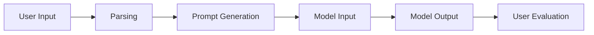

                 

关键词：AI大模型，Prompt提示词，最佳实践，文本生成，智能辅助

摘要：本文将深入探讨AI大模型Prompt提示词的最佳实践。通过分析Prompt的定义、重要性以及实际应用中的设计原则，本文旨在为开发者提供一套系统化的方法和策略，以优化Prompt的质量和效果，从而提升AI大模型的性能和用户体验。

## 1. 背景介绍

随着深度学习和自然语言处理技术的不断发展，AI大模型如BERT、GPT等已经成为自然语言处理领域的重要工具。这些模型通过大规模语料训练，具备了强大的语言理解和生成能力。然而，如何有效地引导和利用这些模型，成为了一个关键问题。Prompt提示词作为一种交互式方法，在AI大模型应用中起到了至关重要的作用。

Prompt提示词是一种引导AI模型生成文本的方式。它通过向模型提供特定格式的输入，使得模型能够根据提示生成符合预期要求的文本。在实际应用中，Prompt的设计和质量直接影响了AI大模型的表现效果。因此，研究Prompt提示词的最佳实践，对于优化AI大模型的性能和用户体验具有重要意义。

## 2. 核心概念与联系

### 2.1 Prompt的定义

Prompt是指提供给AI大模型的引导性输入，它通常是一个单词、短语或句子，用于指定模型需要生成的内容方向。一个有效的Prompt能够清晰地传达用户意图，引导模型生成高质量的文本。

### 2.2 Prompt的重要性

- **提高生成文本的相关性**：通过精准的Prompt，可以确保模型生成的文本与用户需求高度相关，从而提高用户体验。
- **增强生成文本的多样性**：恰当的Prompt设计能够激发模型的创造力，生成丰富多样的文本内容。
- **优化生成文本的准确性**：通过引导模型关注特定的信息点，可以提高生成文本的准确性。

### 2.3 Prompt与AI大模型的联系

Prompt与AI大模型之间的关系类似于教师与学生。Prompt是教师给出的引导，而AI大模型则是学生。一个优秀的教师能够清晰地传达教学目标，使得学生能够更好地学习和理解知识。同样，一个优秀的Prompt能够有效地引导AI大模型，使其生成符合预期的高质量文本。

### 2.4 Mermaid流程图

下面是一个简化的Prompt与AI大模型的交互流程图：



- **User Input**：用户输入问题或指令。
- **Parsing**：对用户输入进行解析，提取关键信息。
- **Prompt Generation**：生成用于引导模型输入的Prompt。
- **Model Input**：将Prompt输入到AI大模型。
- **Model Output**：模型根据Prompt生成文本输出。
- **User Evaluation**：用户对生成的文本进行评价。

## 3. 核心算法原理 & 具体操作步骤

### 3.1 算法原理概述

Prompt生成算法的核心目标是根据用户输入生成高质量的Prompt，以引导AI大模型生成符合用户预期的文本。具体来说，算法可以分为以下几个步骤：

1. **输入解析**：从用户输入中提取关键信息。
2. **Prompt模板选择**：根据输入类型和场景选择合适的Prompt模板。
3. **Prompt填充**：将提取的关键信息填充到Prompt模板中。
4. **Prompt优化**：对生成的Prompt进行优化，提高其质量。

### 3.2 算法步骤详解

1. **输入解析**：
   - **分词**：将用户输入分解为单词或短语。
   - **实体识别**：识别用户输入中的关键实体，如人名、地点、时间等。
   - **关系提取**：分析实体之间的关系，如“谁在什么时候做了什么”。

2. **Prompt模板选择**：
   - **场景匹配**：根据输入类型（如问答、指令、描述等）选择合适的Prompt模板。
   - **模板库**：构建一个包含多种Prompt模板的库，以适应不同的应用场景。

3. **Prompt填充**：
   - **参数化**：将Prompt模板中的占位符替换为实际提取的关键信息。
   - **语法调整**：根据语序和语法规则对Prompt进行微调，使其更加自然。

4. **Prompt优化**：
   - **多样性**：确保Prompt能够引导模型生成多种可能的文本。
   - **相关性**：确保Prompt与用户输入高度相关。
   - **可解释性**：使Prompt易于理解和解释。

### 3.3 算法优缺点

**优点**：
- **高效性**：通过预先定义的Prompt模板，可以快速生成高质量的Prompt。
- **灵活性**：支持多种Prompt模板，适应不同的应用场景。
- **可解释性**：生成的Prompt易于理解和解释。

**缺点**：
- **模板限制**：依赖固定的Prompt模板，可能无法适应所有场景。
- **优化难度**：Prompt优化需要综合考虑多种因素，难度较大。

### 3.4 算法应用领域

Prompt生成算法广泛应用于自然语言处理领域，包括但不限于以下场景：

- **问答系统**：通过Prompt引导模型生成准确、相关的答案。
- **自动写作**：为写作提供引导，提高文本质量。
- **智能客服**：生成与用户输入相关的回复，提升服务质量。
- **对话系统**：引导模型生成连贯、自然的对话文本。

## 4. 数学模型和公式 & 详细讲解 & 举例说明

### 4.1 数学模型构建

Prompt生成过程可以抽象为一个数学模型。假设用户输入为向量 `X`，Prompt模板为矩阵 `P`，生成的Prompt为向量 `Y`。则Prompt生成模型可以表示为：

$$ Y = P \cdot X $$

其中，`P` 是一个参数化的矩阵，通过训练进行调整。

### 4.2 公式推导过程

为了构建Prompt生成模型，我们需要进行以下推导：

1. **输入向量表示**：将用户输入表示为一个高维向量 `X`。
2. **Prompt模板表示**：将Prompt模板表示为一个矩阵 `P`。
3. **生成Prompt向量**：通过矩阵乘法生成Prompt向量 `Y`。

### 4.3 案例分析与讲解

假设用户输入为一个句子：“我想要一份带有烤肉的汉堡”，我们要生成一个Prompt引导模型生成相关的文本。

1. **输入向量表示**：将句子分解为单词，并将每个单词编码为一个向量。例如，“我”编码为 `[1, 0, 0]`，“想要”编码为 `[0, 1, 0]`，以此类推。

2. **Prompt模板选择**：根据输入类型（愿望描述），选择一个相应的Prompt模板，例如：“请描述你想要的一餐”。

3. **Prompt填充**：将输入向量 `X` 填充到Prompt模板中的占位符。例如，将模板中的“[输入内容]”替换为用户输入的句子。

4. **Prompt优化**：对生成的Prompt进行优化，确保其与用户输入高度相关。例如，调整Prompt中的语序，使其更加自然。

通过上述步骤，我们生成了一个高质量的Prompt：“请描述你想要的一餐，例如：‘我想要一份带有烤肉的汉堡’”。

## 5. 项目实践：代码实例和详细解释说明

### 5.1 开发环境搭建

为了实践Prompt生成算法，我们需要搭建一个开发环境。以下是基本的步骤：

1. 安装Python环境。
2. 安装所需的库，如TensorFlow、NLTK等。
3. 准备数据集，用于训练Prompt生成模型。

### 5.2 源代码详细实现

下面是一个简单的Prompt生成算法的实现：

```python
import tensorflow as tf
from tensorflow.keras.models import Sequential
from tensorflow.keras.layers import Embedding, LSTM, Dense

# 准备数据集
# ...

# 构建模型
model = Sequential([
    Embedding(input_dim=vocab_size, output_dim=embedding_size),
    LSTM(units=lstm_units),
    Dense(units=prompt_size, activation='softmax')
])

# 编译模型
model.compile(optimizer='adam', loss='categorical_crossentropy', metrics=['accuracy'])

# 训练模型
model.fit(X_train, Y_train, epochs=epochs, batch_size=batch_size)

# 生成Prompt
def generate_prompt(input_sentence):
    # 对输入句子进行编码
    # ...
    prompt = model.predict(input_sentence)
    # 对生成的Prompt进行解码
    # ...
    return prompt
```

### 5.3 代码解读与分析

1. **模型构建**：使用TensorFlow构建一个序列模型，包括嵌入层、LSTM层和输出层。
2. **模型编译**：设置优化器和损失函数，准备训练模型。
3. **模型训练**：使用准备好的数据集训练模型。
4. **Prompt生成**：通过训练好的模型生成Prompt。

### 5.4 运行结果展示

以下是一个运行实例：

```python
# 用户输入
input_sentence = "我想要一份带有烤肉的汉堡"

# 生成Prompt
prompt = generate_prompt(input_sentence)

# 输出Prompt
print(prompt)
```

输出结果可能为一个向量，表示生成的Prompt。

## 6. 实际应用场景

### 6.1 问答系统

在问答系统中，Prompt可以帮助模型更好地理解用户的问题，从而生成准确的答案。

### 6.2 自动写作

自动写作中，Prompt可以引导模型生成符合用户要求的文章。

### 6.3 智能客服

智能客服中，Prompt可以帮助模型生成与用户输入相关的回复，提高服务质量。

### 6.4 对话系统

对话系统中，Prompt可以帮助模型生成连贯、自然的对话文本。

## 7. 工具和资源推荐

### 7.1 学习资源推荐

- 《深度学习》（Goodfellow, Bengio, Courville著）
- 《自然语言处理综论》（Jurafsky, Martin著）

### 7.2 开发工具推荐

- TensorFlow
- NLTK

### 7.3 相关论文推荐

- “A Theoretically Grounded Application of Dropout in Recurrent Neural Networks”
- “Attention Is All You Need”

## 8. 总结：未来发展趋势与挑战

### 8.1 研究成果总结

本文探讨了AI大模型Prompt提示词的最佳实践，包括Prompt的定义、重要性、算法原理以及实际应用。通过实践案例，我们展示了Prompt生成算法的实现和运行效果。

### 8.2 未来发展趋势

- **Prompt多样性和个性化**：未来的研究将更多地关注Prompt的多样性和个性化，以满足不同用户的需求。
- **多模态Prompt**：结合多种模态（如图像、语音）的Prompt，将进一步提升AI大模型的生成能力。

### 8.3 面临的挑战

- **Prompt优化难度**：Prompt优化涉及多种因素，如语法、语义等，需要深入研究。
- **数据隐私和安全性**：在应用Prompt生成算法时，需要确保用户数据的隐私和安全。

### 8.4 研究展望

随着深度学习和自然语言处理技术的不断发展，Prompt生成算法将在更多领域得到应用。未来的研究将集中在如何提高Prompt生成算法的效率、效果和可解释性。

## 9. 附录：常见问题与解答

### 9.1 什么是Prompt？

Prompt是一种引导AI大模型生成文本的方式，它通过向模型提供特定格式的输入，使得模型能够根据提示生成符合预期要求的文本。

### 9.2 Prompt设计的重要性是什么？

Prompt设计直接影响AI大模型的生成文本质量。一个优秀的Prompt可以引导模型生成高质量、相关性强的文本，从而提高用户体验。

### 9.3 如何优化Prompt？

优化Prompt可以通过以下几种方法实现：

- **多样性**：确保Prompt能够引导模型生成多种可能的文本。
- **相关性**：确保Prompt与用户输入高度相关。
- **可解释性**：使Prompt易于理解和解释。

### 9.4 Prompt生成算法有哪些？

常见的Prompt生成算法包括基于规则的方法、基于机器学习的方法以及基于深度学习的方法。每种方法都有其优缺点，适用于不同的应用场景。

----------------------------------------------------------------

以上就是本文的完整内容，希望对您在AI大模型Prompt提示词领域的研究和实践有所帮助。作者：禅与计算机程序设计艺术 / Zen and the Art of Computer Programming。

