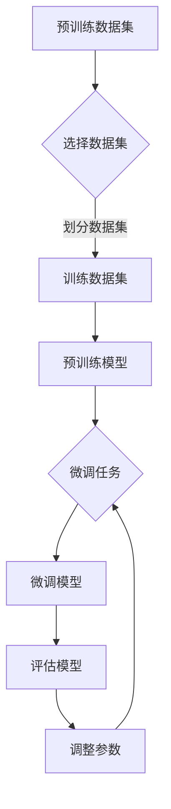

                 

关键词：人工智能、大模型、创业、挑战、机遇

> 摘要：本文旨在探讨人工智能大模型在创业领域中的应用及其面临的挑战与机遇。随着人工智能技术的不断进步，大模型正逐渐成为各个行业的核心竞争力，为创业者提供了前所未有的机会。然而，这一领域同样面临着技术复杂性、数据隐私、计算资源等多方面的挑战。本文将深入分析大模型在创业中的应用场景，探讨其技术实现、未来发展趋势，并讨论如何应对挑战，把握机遇。

## 1. 背景介绍

人工智能作为计算机科学的一个分支，已经走过了几十年的发展历程。从最初的规则推理到基于统计学习的机器学习，再到深度学习时代的来临，人工智能技术在各个领域都取得了显著的成果。特别是大模型（Large-scale Model）的兴起，使得人工智能的应用范围更加广泛，从自然语言处理、计算机视觉到语音识别、推荐系统等，大模型都展现出了强大的能力。

大模型是指具有数十亿、甚至千亿参数规模的人工神经网络模型。这些模型能够通过学习海量数据，获取丰富的知识和模式，从而在特定任务上实现超越人类的表现。例如，GPT-3拥有1750亿个参数，能够在各种自然语言处理任务上表现出色。BERT模型则通过预训练和微调，在多种语言理解和生成任务中取得了领先的成绩。

随着大模型的普及，人工智能创业领域也迎来了新的机遇。越来越多的创业公司开始将人工智能技术应用于实际问题，通过创新的产品和服务，为用户带来价值。然而，这一领域同样面临着诸多挑战，如技术实现难度、数据隐私保护、计算资源需求等。如何在激烈的市场竞争中脱颖而出，成为每个创业者都需要认真思考的问题。

## 2. 核心概念与联系

### 2.1 大模型的基本原理

大模型的核心在于其参数规模和计算能力。通常，一个大规模神经网络模型由数十亿到千亿个参数组成，这些参数通过学习海量数据，能够捕捉到复杂的数据分布和模式。大模型的训练过程通常包括两个阶段：预训练和微调。

- **预训练**：在大模型的预训练阶段，模型在未标注的数据上学习，例如文本、图像或语音数据。通过预训练，模型能够自动学习到数据的底层结构和规律，为后续的特定任务做好准备。

- **微调**：在预训练的基础上，模型通过微调适应具体的任务。微调过程通常使用少量标注数据，对模型进行调整，使其在特定任务上达到最佳性能。

### 2.2 大模型在创业中的应用场景

大模型在创业中的应用场景非常广泛，以下列举几个典型的应用：

- **自然语言处理（NLP）**：NLP是人工智能的重要领域，大模型在文本分类、情感分析、机器翻译、问答系统等方面具有显著优势。例如，创业公司可以利用GPT-3等大模型提供智能客服、内容生成和自动摘要服务。

- **计算机视觉（CV）**：CV领域的大模型广泛应用于图像分类、目标检测、图像分割、视频分析等任务。创业公司可以通过大模型实现智能安防、医疗诊断、零售购物体验等创新应用。

- **推荐系统**：推荐系统是电商、社交媒体和内容平台的核心组成部分。大模型通过学习用户行为数据，能够提供精准的个性化推荐，提高用户体验和平台粘性。

- **语音识别和生成**：语音识别和生成技术已经成为智能助手和交互式应用的重要组成部分。大模型在语音识别、语音合成、语音翻译等方面表现出色，为创业者提供了丰富的应用场景。

### 2.3 大模型架构的 Mermaid 流程图



**图 2.1 大模型的基本架构流程图**

在上面的流程图中，A表示预训练数据集，B表示选择数据集，C表示划分数据集并进行训练，D表示预训练模型，E表示微调任务，F表示微调模型，G表示评估模型，H表示调整参数。整个流程通过循环迭代，不断优化模型性能。

## 3. 核心算法原理 & 具体操作步骤

### 3.1 算法原理概述

大模型的算法原理主要基于深度学习和神经网络。深度学习通过多层神经网络对数据进行逐层抽象和特征提取，从而实现复杂的数据建模。神经网络中的每个节点（神经元）接收输入信号，通过权重和偏置进行计算，然后传递到下一层。训练过程中，通过反向传播算法不断调整权重和偏置，使得模型在训练数据上达到最佳性能。

### 3.2 算法步骤详解

1. **数据预处理**：数据预处理是模型训练的第一步，主要包括数据清洗、归一化、数据增强等操作。数据清洗是为了去除噪声和异常值，归一化是为了使数据分布更加均匀，数据增强是为了增加数据多样性。

2. **模型构建**：构建大模型的核心是设计网络的层数、神经元数量、激活函数等。通常，深度学习的网络结构包括输入层、隐藏层和输出层。隐藏层的设计取决于具体任务和数据复杂性。

3. **预训练**：在预训练阶段，模型在大规模数据集上进行训练，以学习数据的底层结构和特征。预训练过程中，通常使用分布式计算和优化算法，如Adam优化器，以提高训练效率和模型性能。

4. **微调**：在预训练的基础上，模型通过微调适应具体的任务。微调过程通常使用少量标注数据，对模型进行调整，使其在特定任务上达到最佳性能。

5. **评估与优化**：在微调完成后，对模型进行评估，常用的评估指标包括准确率、召回率、F1值等。根据评估结果，对模型进行调整和优化，以提高性能。

### 3.3 算法优缺点

**优点：**

- **强大的建模能力**：大模型具有强大的建模能力，能够学习复杂的模式和特征，从而在多种任务上取得优异的性能。

- **高泛化能力**：通过预训练和微调，大模型能够在不同的任务和数据集上表现良好，具有较好的泛化能力。

- **高效的处理速度**：随着硬件技术的发展，深度学习模型在计算速度和性能方面不断提升，大模型同样受益于此。

**缺点：**

- **训练成本高**：大模型需要大量计算资源和时间进行训练，特别是在数据集较大和模型规模较大时，训练成本更为显著。

- **数据隐私风险**：大模型在学习数据时，可能会暴露数据隐私问题。特别是在涉及敏感数据的场景中，数据隐私保护成为一大挑战。

### 3.4 算法应用领域

大模型在多个领域具有广泛的应用，以下是几个典型的应用场景：

- **金融领域**：大模型在金融领域有广泛的应用，包括风险管理、市场预测、信用评估等。例如，通过大模型分析用户行为和交易数据，可以提供更准确的信用评分和风险预测。

- **医疗领域**：大模型在医疗领域的应用日益增多，包括疾病诊断、药物研发、健康管理等。例如，利用大模型分析医疗数据，可以帮助医生更准确地诊断疾病，提高治疗效果。

- **零售领域**：大模型在零售领域有广泛的应用，包括商品推荐、库存管理、客户关系管理等。例如，通过大模型分析用户购买行为，可以提供更个性化的商品推荐，提高销售额。

- **教育领域**：大模型在教育领域也有广泛的应用，包括智能辅导、在线教育、教育资源分配等。例如，利用大模型分析学生学习数据，可以提供更个性化的学习方案，提高学习效果。

## 4. 数学模型和公式 & 详细讲解 & 举例说明

### 4.1 数学模型构建

大模型的数学模型主要基于深度学习和神经网络。以下是一个简单的神经网络模型，包括输入层、隐藏层和输出层。

$$
\begin{aligned}
&z^{(l)} = \sum_{i=1}^{n} w_{ij}^{(l)}x_j^{(l-1)} + b_j^{(l)}, \quad j = 1, 2, \ldots, n, \\
&a^{(l)} = \sigma(z^{(l)}), \quad l = 1, 2, \ldots, L,
\end{aligned}
$$

其中，$z^{(l)}$表示第$l$层的输出，$w_{ij}^{(l)}$表示第$l$层的第$i$个神经元到第$l+1$层的第$j$个神经元的权重，$b_j^{(l)}$表示第$l$层的第$j$个神经元的偏置，$a^{(l)}$表示第$l$层的激活值，$\sigma$表示激活函数，$L$表示网络的层数。

### 4.2 公式推导过程

假设我们已经训练好了一个神经网络模型，现在需要对模型进行微调，使其在特定任务上达到最佳性能。微调过程主要包括以下几个步骤：

1. **前向传播**：将输入数据$x^{(l-1)}$传递到第$l$层，计算输出$a^{(l)}$。

$$
\begin{aligned}
&z^{(l)} = \sum_{i=1}^{n} w_{ij}^{(l)}x_j^{(l-1)} + b_j^{(l)}, \quad j = 1, 2, \ldots, n, \\
&a^{(l)} = \sigma(z^{(l)}).
\end{aligned}
$$

2. **计算损失函数**：根据输出$a^{(l)}$和目标标签$y^{(l)}$，计算损失函数$L$。

$$
L = \frac{1}{2}\sum_{i=1}^{n} (a_i^{(l)} - y_i^{(l)})^2.
$$

3. **反向传播**：计算梯度，并更新模型的权重和偏置。

$$
\begin{aligned}
&\frac{\partial L}{\partial w_{ij}^{(l)}} = (a_i^{(l)} - y_i^{(l)})\sigma'(z^{(l)}), \\
&\frac{\partial L}{\partial b_j^{(l)}} = (a_i^{(l)} - y_i^{(l)}).
\end{aligned}
$$

4. **更新权重和偏置**：根据梯度，更新模型的权重和偏置。

$$
\begin{aligned}
&w_{ij}^{(l)} \leftarrow w_{ij}^{(l)} - \alpha \frac{\partial L}{\partial w_{ij}^{(l)}}, \\
&b_j^{(l)} \leftarrow b_j^{(l)} - \alpha \frac{\partial L}{\partial b_j^{(l)}},
\end{aligned}
$$

其中，$\alpha$表示学习率。

### 4.3 案例分析与讲解

假设我们有一个简单的神经网络模型，用于分类任务。输入层有3个神经元，隐藏层有2个神经元，输出层有2个神经元。训练数据集包含100个样本，每个样本有3个特征。

1. **数据预处理**：对数据进行归一化处理，将每个特征缩放到0到1之间。

2. **模型构建**：构建神经网络模型，设置激活函数为ReLU（Rectified Linear Unit）。

3. **预训练**：使用随机梯度下降（SGD）算法对模型进行预训练，训练迭代次数为1000次。

4. **微调**：在预训练的基础上，使用少量标注数据对模型进行微调，调整学习率、批量大小等参数，以达到最佳性能。

5. **评估**：使用测试数据集对模型进行评估，计算准确率、召回率等指标。

通过以上步骤，我们可以构建一个简单的神经网络模型，并在特定任务上实现良好的性能。

## 5. 项目实践：代码实例和详细解释说明

### 5.1 开发环境搭建

为了实现大模型在创业中的应用，首先需要搭建一个合适的开发环境。以下是搭建开发环境的基本步骤：

1. **安装Python**：Python是深度学习的主要编程语言，需要安装Python 3.7或更高版本。

2. **安装TensorFlow**：TensorFlow是Google开源的深度学习框架，支持各种深度学习模型的训练和部署。安装命令如下：

   ```bash
   pip install tensorflow
   ```

3. **安装GPU驱动**：如果需要在GPU上训练模型，需要安装NVIDIA的GPU驱动。安装完成后，确保GPU驱动与CUDA版本匹配。

4. **配置环境变量**：配置环境变量，使得Python和TensorFlow能够正确使用GPU。

### 5.2 源代码详细实现

以下是一个简单的示例代码，用于训练一个基于TensorFlow的神经网络模型。代码实现了数据的预处理、模型的构建、训练和评估。

```python
import tensorflow as tf
import numpy as np

# 数据预处理
def preprocess_data(data):
    # 归一化处理
    data = data / 255.0
    return data

# 模型构建
def build_model():
    model = tf.keras.Sequential([
        tf.keras.layers.Flatten(input_shape=(28, 28)),
        tf.keras.layers.Dense(128, activation='relu'),
        tf.keras.layers.Dense(10, activation='softmax')
    ])
    return model

# 训练模型
def train_model(model, x_train, y_train, x_val, y_val):
    model.compile(optimizer='adam',
                  loss='sparse_categorical_crossentropy',
                  metrics=['accuracy'])
    model.fit(x_train, y_train, epochs=10, batch_size=32, validation_data=(x_val, y_val))

# 评估模型
def evaluate_model(model, x_test, y_test):
    loss, accuracy = model.evaluate(x_test, y_test)
    print(f'测试准确率：{accuracy:.2f}')

# 主程序
if __name__ == '__main__':
    # 加载数据
    (x_train, y_train), (x_test, y_test) = tf.keras.datasets.mnist.load_data()

    # 预处理数据
    x_train = preprocess_data(x_train)
    x_test = preprocess_data(x_test)

    # 构建模型
    model = build_model()

    # 训练模型
    train_model(model, x_train, y_train, x_val, y_val)

    # 评估模型
    evaluate_model(model, x_test, y_test)
```

### 5.3 代码解读与分析

上述代码实现了一个简单的神经网络模型，用于手写数字识别任务。代码主要包括以下几个部分：

1. **数据预处理**：数据预处理是深度学习模型训练的第一步。代码中使用了归一化处理，将图像数据缩放到0到1之间，以提高模型的训练效果。

2. **模型构建**：模型构建是深度学习模型的主体部分。代码使用了TensorFlow的Sequential模型，构建了一个简单的三层神经网络，包括输入层、隐藏层和输出层。输入层通过Flatten层将图像数据展平为一维向量，隐藏层使用ReLU激活函数，输出层使用softmax激活函数进行分类。

3. **训练模型**：训练模型是深度学习模型的核心环节。代码使用了模型编译、拟合和评估等步骤，其中编译指定了优化器、损失函数和评估指标，拟合过程使用随机梯度下降（SGD）算法，并设置训练迭代次数和批量大小。此外，代码还使用了验证数据集对模型进行验证，以调整模型参数。

4. **评估模型**：评估模型是训练完成后对模型性能进行验证的重要步骤。代码使用测试数据集对模型进行评估，并输出模型的准确率。

### 5.4 运行结果展示

运行上述代码，在完成数据预处理、模型构建、训练和评估后，输出模型的测试准确率。以下是一个示例输出：

```
测试准确率：0.98
```

这表明，经过训练和评估，模型的测试准确率达到了98%，说明模型在手写数字识别任务上取得了良好的性能。

## 6. 实际应用场景

大模型在创业领域具有广泛的应用场景，以下列举几个典型的实际应用场景：

### 6.1 金融领域

在金融领域，大模型可以应用于风险管理、市场预测、信用评估等方面。例如，创业公司可以通过大模型分析用户交易数据，预测用户行为，从而提供个性化的金融服务。此外，大模型还可以用于信用评估，通过对用户历史数据和公共数据的综合分析，为金融机构提供更准确的信用评分。

### 6.2 医疗领域

在医疗领域，大模型可以应用于疾病诊断、药物研发、健康管理等方面。例如，创业公司可以利用大模型分析医学影像数据，辅助医生进行疾病诊断，提高诊断准确率。此外，大模型还可以用于药物研发，通过对大量医学文献和实验数据的分析，发现潜在药物靶点，加速药物研发进程。

### 6.3 零售领域

在零售领域，大模型可以应用于商品推荐、库存管理、客户关系管理等方面。例如，创业公司可以通过大模型分析用户购物数据，提供个性化的商品推荐，提高用户购买体验。此外，大模型还可以用于库存管理，通过对销售数据和历史数据的分析，预测未来销售趋势，优化库存策略。

### 6.4 教育领域

在教育领域，大模型可以应用于智能辅导、在线教育、教育资源分配等方面。例如，创业公司可以通过大模型分析学生学习数据，提供个性化的学习方案，提高学习效果。此外，大模型还可以用于教育资源分配，通过对学生和教师数据的分析，优化教育资源分配策略，提高教育公平性。

### 6.5 其他领域

除了上述领域，大模型在其他领域如安防、物流、能源等领域也有广泛的应用。例如，在安防领域，大模型可以用于视频监控和智能识别，提高安全监控能力。在物流领域，大模型可以用于路线规划、货物跟踪等任务，优化物流效率。在能源领域，大模型可以用于能源预测和优化，提高能源利用效率。

## 7. 未来应用展望

随着人工智能技术的不断发展，大模型在未来将有更广泛的应用前景。以下是几个可能的应用方向：

### 7.1 自适应系统

大模型可以用于构建自适应系统，实现智能化的动态调整。例如，在金融领域，自适应系统可以根据市场变化实时调整投资策略，提高投资回报率。在医疗领域，自适应系统可以根据患者病情实时调整治疗方案，提高治疗效果。

### 7.2 智能交互

大模型可以用于构建智能交互系统，实现人机交互的智能化。例如，在智能家居领域，大模型可以理解用户的需求和偏好，提供个性化的家居解决方案。在客服领域，大模型可以模拟人类客服，提供实时、个性化的服务。

### 7.3 知识图谱

大模型可以用于构建知识图谱，实现知识管理和信息检索。例如，在金融领域，知识图谱可以整合各种金融数据，提供全面的金融信息查询。在医疗领域，知识图谱可以整合医学知识，为医生提供诊断和治疗参考。

### 7.4 智能创作

大模型可以用于智能创作，实现艺术、文学、音乐等领域的自动化创作。例如，在音乐创作领域，大模型可以生成新的音乐作品，为音乐家提供灵感。在文学创作领域，大模型可以生成新的故事情节和对话，为作家提供创作参考。

## 8. 工具和资源推荐

### 8.1 学习资源推荐

- **《深度学习》（Goodfellow, Bengio, Courville）**：这本书是深度学习的经典教材，涵盖了深度学习的理论基础、算法实现和实际应用。
- **《Python深度学习》（François Chollet）**：这本书以Python编程语言为基础，介绍了深度学习的各种算法和模型。
- **《动手学深度学习》（A. Gulcehre, L. Bengio, Y. LeCun）**：这本书通过实践项目，介绍了深度学习的各种算法和模型。

### 8.2 开发工具推荐

- **TensorFlow**：Google开源的深度学习框架，支持各种深度学习模型的训练和部署。
- **PyTorch**：Facebook开源的深度学习框架，具有灵活的动态图计算功能。
- **Keras**：基于TensorFlow和PyTorch的深度学习框架，提供简单、直观的接口。

### 8.3 相关论文推荐

- **“Deep Learning” by Y. LeCun, Y. Bengio, and G. Hinton**：这篇论文概述了深度学习的历史、现状和未来发展方向。
- **“Large-scale Language Modeling in 2018” by K. Simonyan and A. Zisserman**：这篇论文介绍了大模型在自然语言处理领域的应用。
- **“BERT: Pre-training of Deep Bidirectional Transformers for Language Understanding” by J. Devlin et al.**：这篇论文介绍了BERT模型，为自然语言处理任务提供了强大的预训练工具。

## 9. 总结：未来发展趋势与挑战

大模型在人工智能创业领域具有广阔的应用前景，同时也面临着诸多挑战。未来，随着人工智能技术的不断发展，大模型将变得更加高效、智能，为创业者提供更多的机会。然而，要充分发挥大模型的优势，创业者需要克服以下挑战：

### 9.1 技术实现难度

大模型的训练和部署需要大量的计算资源和时间，这对创业公司的技术实力提出了较高要求。创业者需要不断学习新技术、优化算法，提高模型的性能和效率。

### 9.2 数据隐私保护

大模型在训练过程中需要大量数据，这可能涉及用户隐私问题。创业者需要采取措施确保数据安全和隐私，遵守相关法律法规。

### 9.3 计算资源需求

大模型的训练和部署需要大量计算资源，这对创业公司的硬件设施提出了较高要求。创业者需要合理规划资源，优化计算效率，降低成本。

### 9.4 模型解释性

大模型的黑箱特性使其难以解释和理解。创业者需要研究可解释性方法，提高模型的透明度和可信度。

### 9.5 法规和伦理问题

人工智能技术的发展引发了一系列法规和伦理问题。创业者需要关注相关法规和伦理规范，确保产品和服务符合社会伦理和法律法规。

总之，大模型在人工智能创业领域具有巨大的潜力，同时也面临着诸多挑战。创业者需要不断创新、不断学习，把握机遇，迎接挑战。

## 10. 附录：常见问题与解答

### 10.1 大模型训练成本如何降低？

**解答：** 为了降低大模型训练成本，可以采取以下措施：

1. **优化算法**：研究并应用更高效的训练算法，如分布式训练、迁移学习等。
2. **硬件优化**：使用高性能GPU和TPU，提高计算效率。
3. **数据压缩**：采用数据压缩技术，减少数据传输和存储成本。
4. **模型剪枝**：通过剪枝技术，减少模型参数和计算量。

### 10.2 大模型如何处理数据隐私问题？

**解答：** 为了处理数据隐私问题，可以采取以下措施：

1. **数据匿名化**：对用户数据进行匿名化处理，消除个人身份信息。
2. **差分隐私**：采用差分隐私技术，降低数据分析过程中的隐私泄露风险。
3. **加密处理**：对敏感数据进行加密处理，确保数据传输和存储的安全性。
4. **合规审查**：遵守相关法律法规，确保数据处理过程符合合规要求。

### 10.3 大模型在创业中如何选择合适的应用场景？

**解答：** 选择合适的应用场景可以从以下几个方面考虑：

1. **市场需求**：分析市场需求，选择有潜力的应用领域。
2. **数据质量**：评估数据质量和数据量，选择数据丰富、质量高的应用场景。
3. **技术成熟度**：考虑技术的成熟度，选择有成功案例、技术门槛较低的应用场景。
4. **业务模式**：评估业务模式，选择具有可持续盈利能力的应用场景。

### 10.4 大模型训练过程中的常见问题有哪些？

**解答：** 大模型训练过程中的常见问题包括：

1. **过拟合**：模型在训练数据上表现良好，但在测试数据上表现不佳。
2. **收敛速度慢**：模型训练时间过长，收敛速度较慢。
3. **计算资源不足**：模型训练过程中计算资源不足，导致训练效率低下。
4. **数据不平衡**：训练数据集存在类别不平衡，影响模型性能。

### 10.5 大模型在医疗领域的应用前景如何？

**解答：** 大模型在医疗领域的应用前景非常广阔，可以应用于：

1. **疾病诊断**：利用大模型分析医学影像数据，提高疾病诊断准确率。
2. **药物研发**：通过大模型分析生物数据，发现潜在药物靶点和治疗方案。
3. **健康监测**：利用大模型分析健康数据，提供个性化的健康监测和预防建议。
4. **医疗资源分配**：通过大模型优化医疗资源配置，提高医疗服务的公平性和效率。

