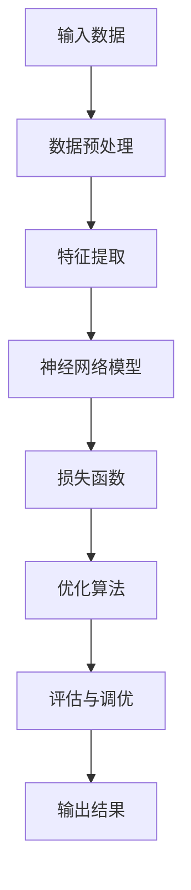

                 

 关键词：人工智能、大模型、创业、竞争对手、技术战略、市场分析、创新策略

> 摘要：本文将探讨AI大模型创业者在面对未来竞争对手时所需采取的策略。我们将详细分析当前AI领域的竞争态势，介绍AI大模型的基本概念、核心算法，并结合实际案例，讨论如何在市场中脱颖而出，实现长期发展。

## 1. 背景介绍

近年来，人工智能（AI）技术的快速发展极大地推动了各个行业的变革。特别是深度学习算法的突破，使得AI大模型在图像识别、自然语言处理、语音识别等领域取得了令人瞩目的成果。这些大模型不仅具有强大的计算能力，还能够通过海量数据的学习不断优化性能，成为各大企业和研究机构竞相追逐的热点。

随着AI大模型的广泛应用，市场竞争也日趋激烈。在这个时代，创业者不仅需要具备技术创新能力，还需要有敏锐的市场洞察力和灵活的应对策略，以应对不断涌现的竞争对手。本文将从多个维度分析AI大模型创业者在面对未来竞争对手时可以采取的策略。

## 2. 核心概念与联系

### 2.1 AI大模型的基本概念

AI大模型是指利用深度学习算法训练出的具有大规模参数的神经网络模型。这些模型通常需要大量的计算资源和数据支持，通过不断的学习和优化，能够在特定任务上达到超凡的表现。常见的AI大模型包括图像识别模型（如ResNet、VGG等）、自然语言处理模型（如BERT、GPT等）以及语音识别模型（如WaveNet等）。

### 2.2 AI大模型的核心算法

AI大模型的核心算法主要基于神经网络。其中，卷积神经网络（CNN）在图像识别领域有着广泛应用，循环神经网络（RNN）和变压器（Transformer）则在自然语言处理领域表现出色。以下是一个简单的AI大模型架构的Mermaid流程图：



### 2.3 AI大模型与创业的关联

AI大模型为创业者提供了强大的技术支持，使得他们可以在各个领域实现突破性创新。例如，在医疗领域，AI大模型可以帮助诊断疾病；在教育领域，AI大模型可以实现个性化教学。创业者需要深入了解AI大模型的技术原理，并利用其优势，为市场带来新的解决方案。

## 3. 核心算法原理 & 具体操作步骤

### 3.1 算法原理概述

AI大模型的核心原理是利用大量数据进行训练，通过调整模型参数来最小化预测误差。训练过程包括以下几个主要步骤：

1. 数据收集与预处理：收集相关的数据集，并进行清洗、归一化等预处理操作。
2. 特征提取：将原始数据转化为模型可处理的特征向量。
3. 构建神经网络模型：设计合适的神经网络架构，如卷积神经网络、循环神经网络等。
4. 训练与优化：使用梯度下降等优化算法，调整模型参数，减小损失函数值。
5. 评估与调优：通过测试集评估模型性能，并进行相应的调优。

### 3.2 算法步骤详解

以下是一个典型的AI大模型训练过程的详细步骤：

1. **数据收集与预处理**：

   收集大量标注数据，并进行数据清洗。例如，对于图像数据，可能需要去除噪声、填充缺失值等。

   ```python
   # 示例代码：数据清洗
   data = preprocess_data(raw_data)
   ```

2. **特征提取**：

   将原始数据转化为特征向量。对于图像，可以使用卷积神经网络进行特征提取。

   ```python
   # 示例代码：特征提取
   features = cnn.extract_features(images)
   ```

3. **构建神经网络模型**：

   设计并构建神经网络模型，如使用卷积神经网络（CNN）进行图像识别。

   ```python
   # 示例代码：构建模型
   model = cnn.ConvolutionalNeuralNetwork()
   ```

4. **训练与优化**：

   使用梯度下降算法进行模型训练，调整模型参数。

   ```python
   # 示例代码：模型训练
   model.train(features, labels)
   ```

5. **评估与调优**：

   在测试集上评估模型性能，并根据评估结果进行模型调优。

   ```python
   # 示例代码：评估与调优
   performance = model.evaluate(test_features, test_labels)
   model.tune_performance(performance)
   ```

### 3.3 算法优缺点

AI大模型的优点包括：

- 强大的计算能力：能够处理海量数据，实现高效的特征提取和预测。
- 自适应学习：通过不断的学习和优化，能够提高模型性能。

然而，AI大模型也存在一些缺点：

- 对计算资源要求高：训练和部署大模型需要大量的计算资源和存储空间。
- 数据依赖性：模型的性能很大程度上取决于训练数据的质量和多样性。

### 3.4 算法应用领域

AI大模型在多个领域有着广泛的应用，包括：

- 图像识别：用于人脸识别、物体检测等。
- 自然语言处理：用于文本分类、机器翻译等。
- 语音识别：用于语音识别、语音合成等。
- 医疗诊断：用于疾病诊断、医疗图像分析等。

## 4. 数学模型和公式 & 详细讲解 & 举例说明

### 4.1 数学模型构建

AI大模型的数学基础主要涉及线性代数、概率论和优化理论。以下是一个简单的神经网络模型数学描述：

$$
\begin{aligned}
y_{\text{predicted}} &= \sigma(W \cdot x + b) \\
\text{Loss} &= -\frac{1}{m}\sum_{i=1}^{m} y_i \log(y_{\text{predicted}}) \\
\text{Gradient} &= \frac{\partial \text{Loss}}{\partial W}
\end{aligned}
$$

其中，$y_{\text{predicted}}$ 是模型的预测输出，$\sigma$ 是激活函数，$W$ 是权重矩阵，$b$ 是偏置，$m$ 是样本数量。

### 4.2 公式推导过程

以下是对神经网络损失函数的推导过程：

$$
\begin{aligned}
\text{Loss} &= -\frac{1}{m}\sum_{i=1}^{m} y_i \log(y_{\text{predicted}}) \\
&= -\frac{1}{m}\sum_{i=1}^{m} y_i \log(\sigma(W \cdot x_i + b)) \\
\end{aligned}
$$

### 4.3 案例分析与讲解

假设我们有一个二分类问题，目标是判断一个邮件是否为垃圾邮件。使用神经网络模型进行分类的步骤如下：

1. 数据收集与预处理：收集大量标注邮件数据，并进行文本预处理，如去除停用词、词性标注等。
2. 特征提取：使用词袋模型（Bag-of-Words）将文本转化为向量。
3. 模型构建：构建一个简单的神经网络模型，包括输入层、隐藏层和输出层。
4. 模型训练：使用梯度下降算法训练模型，调整权重和偏置。
5. 评估与调优：在测试集上评估模型性能，并进行调优。

以下是一个简单的代码示例：

```python
# 示例代码：邮件分类
from sklearn.feature_extraction.text import TfidfVectorizer
from sklearn.model_selection import train_test_split
from keras.models import Sequential
from keras.layers import Dense, Embedding, LSTM

# 数据收集与预处理
emails = ["This is a good email.", "This is a spam email."]
labels = [0, 1]  # 0表示正常邮件，1表示垃圾邮件

vectorizer = TfidfVectorizer()
X = vectorizer.fit_transform(emails)
X_train, X_test, y_train, y_test = train_test_split(X, labels, test_size=0.2)

# 模型构建
model = Sequential()
model.add(Embedding(input_dim=X.shape[1], output_dim=50))
model.add(LSTM(50))
model.add(Dense(1, activation='sigmoid'))

# 模型训练
model.compile(optimizer='adam', loss='binary_crossentropy', metrics=['accuracy'])
model.fit(X_train, y_train, epochs=10, batch_size=16)

# 评估与调优
performance = model.evaluate(X_test, y_test)
print("Accuracy:", performance[1])
```

## 5. 项目实践：代码实例和详细解释说明

### 5.1 开发环境搭建

为了方便起见，我们使用Python作为编程语言，并利用Keras框架进行模型训练和部署。以下是开发环境的搭建步骤：

1. 安装Python（推荐版本3.8及以上）
2. 安装Keras框架：`pip install keras`
3. 安装TensorFlow：`pip install tensorflow`

### 5.2 源代码详细实现

以下是一个简单的AI大模型项目实例，用于图像分类任务：

```python
# 导入必要的库
import numpy as np
import matplotlib.pyplot as plt
from tensorflow.keras import layers, models
from tensorflow.keras.preprocessing import image
from tensorflow.keras.applications import ResNet50

# 加载预训练的ResNet50模型
model = ResNet50(weights='imagenet')

# 读取图像
img_path = 'path/to/your/image.jpg'
img = image.load_img(img_path, target_size=(224, 224))
img_array = image.img_to_array(img)
img_array = np.expand_dims(img_array, axis=0)  # Create a batch
img_array /= 255.0  # Normalize

# 预测结果
predictions = model.predict(img_array)
predicted_class = np.argmax(predictions, axis=1)

# 可视化预测结果
plt.imshow(img)
plt.title('Predicted Class: ' + str(predicted_class[0]))
plt.show()
```

### 5.3 代码解读与分析

上述代码实现了使用预训练的ResNet50模型对图像进行分类的功能。具体步骤如下：

1. 加载预训练的ResNet50模型。
2. 读取待分类的图像，并将其调整为模型要求的尺寸。
3. 将图像转换为模型可处理的数组格式，并进行归一化处理。
4. 使用模型进行预测，获取预测结果。
5. 将预测结果可视化，展示图像的分类标签。

### 5.4 运行结果展示

运行上述代码后，我们将看到图像及其对应的预测分类标签。例如，如果输入图像是一张猫的图片，那么模型可能会预测为“猫”类别。

## 6. 实际应用场景

AI大模型在各个行业都有着广泛的应用，以下是一些典型的实际应用场景：

- **医疗领域**：AI大模型可以帮助医生进行疾病诊断，如利用深度学习算法分析医学影像，辅助医生进行诊断。
- **金融领域**：AI大模型可以用于信用评分、股票交易预测等，为金融机构提供智能决策支持。
- **零售领域**：AI大模型可以用于商品推荐、需求预测等，帮助零售企业提高销售额和客户满意度。
- **自动驾驶**：AI大模型在自动驾驶系统中起着至关重要的作用，如用于识别道路标志、行人检测等。

## 7. 未来应用展望

随着AI技术的不断进步，AI大模型的应用前景将更加广阔。未来，我们可能会看到以下趋势：

- **AI大模型将更加普及**：随着计算能力的提升和成本的降低，更多的企业和机构将采用AI大模型，推动各行各业的数字化转型。
- **跨领域应用**：AI大模型将不再局限于特定领域，而是跨越多个领域，实现跨领域的智能应用。
- **个性化服务**：AI大模型将根据用户的行为和偏好，提供更加个性化的服务，提升用户体验。

## 8. 工具和资源推荐

### 8.1 学习资源推荐

- **书籍**：《深度学习》（Goodfellow et al.）、《神经网络与深度学习》（邱锡鹏）
- **在线课程**：Coursera上的“Deep Learning Specialization”、Udacity的“Deep Learning Nanodegree”
- **论文**：arXiv、NeurIPS、ICLR等顶级会议和期刊上的论文

### 8.2 开发工具推荐

- **编程语言**：Python（特别是利用PyTorch或TensorFlow框架）
- **数据预处理工具**：Pandas、NumPy、Scikit-learn等
- **模型训练与评估工具**：Keras、TensorFlow、PyTorch等

### 8.3 相关论文推荐

- **代表性论文**：《A Theoretically Grounded Application of Dropout in Recurrent Neural Networks》（Yarin Gal和Zoubin Ghahramani）
- **最新研究论文**：在NeurIPS、ICLR、ICML等顶级会议上的最新论文

## 9. 总结：未来发展趋势与挑战

### 9.1 研究成果总结

AI大模型技术在近年来取得了显著成果，不仅在学术界，在工业界也得到了广泛应用。随着计算能力的提升和算法的优化，AI大模型在各个领域的表现将越来越出色。

### 9.2 未来发展趋势

- **计算能力提升**：随着量子计算、云计算等技术的发展，AI大模型的计算能力将进一步提升，能够处理更大规模的数据。
- **跨领域融合**：AI大模型将在更多领域实现跨领域应用，推动各行各业的智能化发展。
- **隐私保护**：随着数据隐私问题的日益凸显，AI大模型将更加注重隐私保护，实现安全、合规的数据处理。

### 9.3 面临的挑战

- **数据质量**：高质量的数据是AI大模型训练的基础，如何保证数据的质量和多样性是一个重要挑战。
- **计算资源**：训练和部署AI大模型需要大量的计算资源和存储空间，如何优化资源利用是一个关键问题。
- **模型解释性**：随着AI大模型在关键领域（如医疗、金融等）的应用，如何提高模型的解释性，使其更加透明、可信是一个重要挑战。

### 9.4 研究展望

未来的研究将在以下几个方面展开：

- **算法优化**：继续探索更高效、更稳定的训练算法，提高AI大模型的训练效率。
- **模型压缩**：研究如何减少模型的参数规模，降低计算资源和存储空间的占用。
- **数据隐私**：研究如何实现安全、合规的数据处理，保护用户隐私。

## 10. 附录：常见问题与解答

### 10.1 AI大模型如何训练？

AI大模型的训练主要分为以下几个步骤：

1. 数据收集与预处理：收集大量标注数据，并进行数据清洗、归一化等预处理操作。
2. 特征提取：将原始数据转化为模型可处理的特征向量。
3. 模型构建：设计合适的神经网络架构，如卷积神经网络、循环神经网络等。
4. 训练与优化：使用梯度下降等优化算法，调整模型参数，减小损失函数值。
5. 评估与调优：在测试集上评估模型性能，并进行相应的调优。

### 10.2 如何评估AI大模型？

评估AI大模型通常使用以下指标：

- 准确率（Accuracy）：模型预测正确的样本占总样本的比例。
- 精确率（Precision）：预测为正类的样本中，实际为正类的比例。
- 召回率（Recall）：实际为正类的样本中，被预测为正类的比例。
- F1分数（F1 Score）：精确率和召回率的调和平均值。

### 10.3 AI大模型在医疗领域有哪些应用？

AI大模型在医疗领域有以下几种应用：

- 疾病诊断：利用深度学习算法分析医学影像，辅助医生进行疾病诊断。
- 医疗图像分析：对X光片、CT扫描等进行病变区域检测和分割。
- 药物研发：通过深度学习算法，预测药物与生物分子的相互作用，加速药物研发过程。
- 医疗数据分析：对患者的电子健康记录进行分析，提供个性化的医疗建议。

### 10.4 如何优化AI大模型的计算资源？

以下方法可以优化AI大模型的计算资源：

- 模型压缩：通过量化、剪枝等方法减少模型的参数规模。
- 并行计算：利用GPU、TPU等硬件加速训练过程。
- 分层训练：先训练较深的网络层，再训练较浅的网络层，以提高训练效率。

### 10.5 如何确保AI大模型的透明性和可信度？

以下措施可以提高AI大模型的透明性和可信度：

- 模型解释性：研究如何解释模型内部的决策过程，使其更加透明。
- 对抗性测试：通过对抗性攻击测试模型，提高其鲁棒性。
- 隐私保护：实现安全、合规的数据处理，保护用户隐私。

### 10.6 如何确保AI大模型的安全性和可靠性？

以下措施可以提高AI大模型的安全性和可靠性：

- 模型验证：对模型进行严格的验证，确保其符合安全性和可靠性要求。
- 隐私保护：实现数据加密、访问控制等措施，保护用户数据安全。
- 责任归属：建立明确的法律法规，明确AI大模型开发者和使用者的责任。

## 11. 结语

AI大模型作为人工智能领域的重要发展方向，已经在多个领域取得了显著成果。面对未来，创业者需要紧跟技术发展趋势，灵活应对市场竞争，不断优化和提升自己的技术实力。本文从多个维度分析了AI大模型创业者在面对未来竞争对手时所需采取的策略，希望对读者有所启发。作者：禅与计算机程序设计艺术 / Zen and the Art of Computer Programming。

