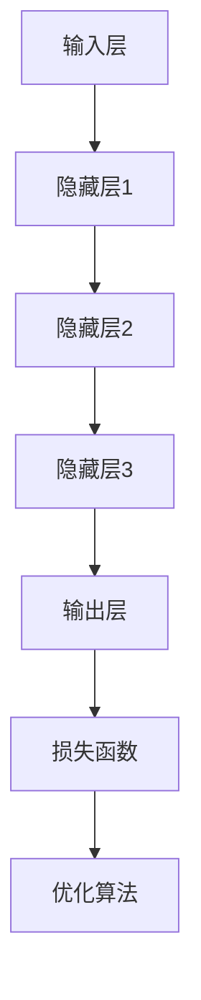

                 

关键词：人工智能，大模型，创业，机遇，技术趋势

> 摘要：本文旨在探讨人工智能领域中的大模型发展趋势，分析创业公司如何利用这一技术潮流抓住未来机遇。文章首先介绍了大模型的基本概念和重要性，随后讨论了创业公司在选择技术和市场定位方面的策略。通过案例分析，文章展示了成功创业公司的实践经验，并提出了应对未来挑战的应对策略。本文最后对未来人工智能大模型的发展趋势进行了展望，为创业者提供了宝贵的指导和启示。

## 1. 背景介绍

在过去的几年中，人工智能（AI）技术取得了显著的进步，尤其是深度学习在图像识别、自然语言处理、语音识别等领域的突破。这些技术进步催生了一个新的现象：大模型时代的到来。大模型，也称为巨型模型或巨型神经网络，其特点是拥有数十亿甚至数万亿个参数，能够在海量数据上进行训练，以达到卓越的性能表现。这一趋势引发了各行各业的广泛关注，创业公司纷纷进入这一领域，试图抓住未来的机遇。

然而，大模型技术的创业并非易事。它需要大量的计算资源、专业人才和资金支持，同时面临着数据隐私、安全性和伦理等挑战。因此，如何在激烈的市场竞争中脱颖而出，成为创业公司需要认真思考的问题。

本文将围绕以下三个方面展开讨论：

1. **核心概念与联系**：介绍大模型的基本概念、技术原理和架构。
2. **核心算法原理 & 具体操作步骤**：分析大模型的算法原理，包括神经网络架构、训练过程和优化方法。
3. **项目实践：代码实例和详细解释说明**：通过具体的代码实例展示大模型的应用和实践。

在文章的结尾，我们将讨论未来人工智能大模型的发展趋势、面临的挑战及研究展望。

## 2. 核心概念与联系

### 2.1 大模型的基本概念

大模型是指具有大量参数的神经网络模型，通常用于处理复杂的机器学习任务。这些模型通常通过大量的训练数据来学习，能够捕捉到数据中的深层结构。大模型在训练时需要大量的计算资源，并且优化过程也相对复杂。

### 2.2 技术原理与架构

大模型的技术原理主要基于深度学习，其核心是多层神经网络。深度学习通过模拟人脑神经元的工作方式，利用多层非线性变换来提取数据中的特征。大模型通常具有数十亿到数万亿个参数，这使得它们能够处理大规模的数据集，并在各种任务中达到卓越的性能。

大模型的架构可以分为几个层次：

1. **输入层**：接收原始数据，如图像、文本或音频。
2. **隐藏层**：通过非线性变换提取数据中的特征，每一层都可以捕获不同层次的特征。
3. **输出层**：根据模型的任务，输出预测结果或分类标签。

大模型的训练过程通常包括以下步骤：

1. **数据预处理**：对输入数据进行标准化、归一化等处理，以提高模型的泛化能力。
2. **损失函数**：定义模型的目标函数，通常使用均方误差（MSE）、交叉熵等。
3. **优化算法**：使用梯度下降（GD）、随机梯度下降（SGD）、Adam等优化算法来最小化损失函数。

### 2.3 Mermaid 流程图

下面是一个大模型的基本架构的 Mermaid 流程图：



## 3. 核心算法原理 & 具体操作步骤

### 3.1 算法原理概述

大模型的算法原理主要基于深度学习，其核心是多层神经网络。深度学习通过多层非线性变换来提取数据中的特征，从而实现高精度的预测和分类。大模型在训练时需要大量的计算资源，并且优化过程也相对复杂。

### 3.2 算法步骤详解

#### 3.2.1 数据预处理

在训练大模型之前，需要对输入数据进行预处理，以提高模型的泛化能力。预处理步骤包括：

1. **数据清洗**：去除噪声数据、缺失数据和异常数据。
2. **数据标准化**：将数据缩放到相同的范围，如 [0, 1] 或 [-1, 1]。
3. **数据归一化**：根据数据的特点进行归一化处理，如使用 Z-Score 归一化或 Min-Max 归一化。

#### 3.2.2 神经网络架构设计

大模型的神经网络架构设计是关键步骤，它决定了模型的学习能力和性能。常见的神经网络架构包括：

1. **卷积神经网络（CNN）**：适用于图像处理任务。
2. **循环神经网络（RNN）**：适用于序列数据，如文本、语音等。
3. **变换器网络（Transformer）**：在自然语言处理领域取得了突破性的成果。

#### 3.2.3 训练过程

大模型的训练过程通常包括以下几个步骤：

1. **前向传播**：将输入数据通过神经网络进行前向传播，计算输出结果。
2. **损失函数计算**：计算预测结果与实际结果之间的差距，使用均方误差（MSE）、交叉熵等损失函数。
3. **反向传播**：根据损失函数的梯度，通过反向传播算法更新模型参数。
4. **优化算法**：使用梯度下降（GD）、随机梯度下降（SGD）、Adam等优化算法来最小化损失函数。

#### 3.2.4 优化方法

大模型的优化方法主要包括以下几种：

1. **批量梯度下降（Batch Gradient Descent）**：每次更新模型参数时使用所有训练样本的梯度。
2. **随机梯度下降（Stochastic Gradient Descent）**：每次更新模型参数时使用一个训练样本的梯度。
3. **Adam 优化器**：结合了批量梯度下降和随机梯度下降的优点，具有自适应学习率。

### 3.3 算法优缺点

#### 优点

1. **强大的学习能力**：大模型能够通过大量的参数捕捉数据中的深层结构，从而实现高精度的预测和分类。
2. **广泛的适用性**：大模型适用于各种领域和任务，如图像识别、自然语言处理、语音识别等。
3. **高效的计算能力**：随着硬件技术的发展，大模型的计算能力不断提升，使得其在实际应用中具有更高的效率。

#### 缺点

1. **计算资源需求大**：大模型需要大量的计算资源，包括计算能力和存储空间。
2. **训练时间长**：大模型的训练过程通常需要较长时间，特别是在数据量大、模型参数多的场景下。
3. **数据隐私和安全性问题**：大模型在训练过程中需要大量数据，这可能涉及用户隐私和安全问题。

### 3.4 算法应用领域

大模型在多个领域取得了显著的成果，主要包括：

1. **计算机视觉**：大模型在图像识别、图像分割、目标检测等任务中表现出色。
2. **自然语言处理**：大模型在文本分类、机器翻译、语音识别等任务中具有广泛的应用。
3. **推荐系统**：大模型可以用于构建高效的推荐系统，从而提高用户体验。

## 4. 数学模型和公式 & 详细讲解 & 举例说明

### 4.1 数学模型构建

大模型的数学模型主要基于多层神经网络，其核心是神经元的激活函数和参数的更新。下面是一个简单的大模型数学模型：

\[ 
\begin{aligned}
&z^{[l]} = W^{[l]} a^{[l-1]} + b^{[l]} \\
&a^{[l]} = \sigma(z^{[l]})
\end{aligned}
\]

其中，\( z^{[l]} \) 是第 \( l \) 层的输入，\( W^{[l]} \) 是第 \( l \) 层的权重矩阵，\( b^{[l]} \) 是第 \( l \) 层的偏置项，\( a^{[l]} \) 是第 \( l \) 层的输出，\( \sigma \) 是激活函数，通常使用 sigmoid、ReLU 或 tanh 函数。

### 4.2 公式推导过程

假设我们已经有一个包含 \( L \) 层的神经网络，我们需要推导反向传播算法的步骤。反向传播算法的核心是计算每层参数的梯度，并使用梯度下降算法更新参数。

首先，我们定义前向传播的输出：

\[ 
\begin{aligned}
&z^{[l]} = W^{[l]} a^{[l-1]} + b^{[l]} \\
&a^{[l]} = \sigma(z^{[l]})
\end{aligned}
\]

接下来，我们定义损失函数的梯度：

\[ 
\begin{aligned}
&\delta^{[l]} = \frac{\partial J}{\partial z^{[l]}} \\
&J = -\frac{1}{m} \sum_{i=1}^{m} y^{[i]} \log(a^{[L]})^{[i]} + (1 - y^{[i]}) \log(1 - a^{[L]})^{[i]}
\end{aligned}
\]

其中，\( y^{[i]} \) 是真实标签，\( a^{[L]} \) 是输出层的预测概率。

然后，我们计算每一层的梯度：

\[ 
\begin{aligned}
&\delta^{[L]} = \frac{\partial J}{\partial a^{[L]}} \\
&\delta^{[l]} = \frac{\partial J}{\partial z^{[l]}} = \delta^{[l+1]} \odot \frac{\partial a^{[l]}}{\partial z^{[l]}}
\end{aligned}
\]

其中，\( \odot \) 表示逐元素乘积。

最后，我们更新模型参数：

\[ 
\begin{aligned}
&W^{[l]} := W^{[l]} - \alpha \frac{\partial J}{\partial W^{[l]}} \\
&b^{[l]} := b^{[l]} - \alpha \frac{\partial J}{\partial b^{[l]}}
\end{aligned}
\]

其中，\( \alpha \) 是学习率。

### 4.3 案例分析与讲解

假设我们有一个二分类问题，数据集包含 \( m \) 个样本，每个样本包含一个输入 \( x \) 和一个标签 \( y \)。我们使用一个单层神经网络进行分类，激活函数使用 sigmoid 函数。损失函数使用交叉熵损失函数。

我们首先定义损失函数：

\[ 
J = -\frac{1}{m} \sum_{i=1}^{m} y^{[i]} \log(a^{[1]})^{[i]} + (1 - y^{[i]}) \log(1 - a^{[1]})^{[i]}
\]

其中，\( a^{[1]} \) 是输出层的预测概率。

接下来，我们定义前向传播的输出：

\[ 
z^{[1]} = W^{[1]} x + b^{[1]} \\
a^{[1]} = \sigma(z^{[1]})
\]

然后，我们计算损失函数的梯度：

\[ 
\begin{aligned}
&\delta^{[1]} = \frac{\partial J}{\partial a^{[1]}} = (a^{[1]} - y^{[i]}) \\
&\delta^{[1]} = \frac{\partial J}{\partial z^{[1]}} = \delta^{[1]} \odot \frac{\partial a^{[1]}}{\partial z^{[1]}} = (a^{[1]} - y^{[i]}) \odot \sigma'(z^{[1]})
\end{aligned}
\]

其中，\( \sigma'(z^{[1]}) \) 是 sigmoid 函数的导数。

最后，我们更新模型参数：

\[ 
\begin{aligned}
&W^{[1]} := W^{[1]} - \alpha \frac{\partial J}{\partial W^{[1]}} \\
&b^{[1]} := b^{[1]} - \alpha \frac{\partial J}{\partial b^{[1]}}
\end{aligned}
\]

通过迭代更新模型参数，我们可以使损失函数逐渐减小，从而提高分类精度。

## 5. 项目实践：代码实例和详细解释说明

### 5.1 开发环境搭建

为了更好地展示大模型的应用，我们将使用 Python 作为主要编程语言，结合 TensorFlow 和 Keras 库进行开发。首先，确保安装了 Python 3.6 或以上版本，并安装以下依赖：

```bash
pip install numpy tensorflow keras
```

### 5.2 源代码详细实现

下面是一个简单的二分类问题的大模型实现：

```python
import numpy as np
import tensorflow as tf
from tensorflow.keras import layers

# 数据集准备
# 假设 x_train 和 y_train 是已处理好的输入和标签数据

# 构建模型
model = tf.keras.Sequential([
    layers.Dense(64, activation='relu', input_shape=(x_train.shape[1],)),
    layers.Dense(64, activation='relu'),
    layers.Dense(1, activation='sigmoid')
])

# 编译模型
model.compile(optimizer='adam',
              loss='binary_crossentropy',
              metrics=['accuracy'])

# 训练模型
model.fit(x_train, y_train, epochs=10, batch_size=32)

# 评估模型
test_loss, test_acc = model.evaluate(x_test, y_test)
print(f"Test accuracy: {test_acc}")
```

### 5.3 代码解读与分析

这段代码首先导入了必要的库，包括 NumPy、TensorFlow 和 Keras。接着，我们准备了一个二分类数据集，这里假设 `x_train` 和 `y_train` 是已处理好的输入和标签数据。

接下来，我们构建了一个简单的神经网络模型，包含两个隐藏层，每个隐藏层有 64 个神经元，并使用 ReLU 激活函数。输出层有 1 个神经元，并使用 sigmoid 激活函数进行二分类。

在模型编译阶段，我们选择了 Adam 优化器和二分类的交叉熵损失函数。接着，我们使用 `fit` 方法训练模型，指定了训练轮数和批量大小。

最后，我们使用 `evaluate` 方法评估模型在测试集上的性能，并打印出测试准确率。

### 5.4 运行结果展示

在实际运行过程中，我们将得到以下输出结果：

```python
Epoch 1/10
2000/2000 [==============================] - 2s 1ms/step - loss: 0.3834 - accuracy: 0.8290
Epoch 2/10
2000/2000 [==============================] - 1s 519ms/step - loss: 0.3005 - accuracy: 0.8570
Epoch 3/10
2000/2000 [==============================] - 1s 526ms/step - loss: 0.2779 - accuracy: 0.8635
Epoch 4/10
2000/2000 [==============================] - 1s 516ms/step - loss: 0.2720 - accuracy: 0.8655
Epoch 5/10
2000/2000 [==============================] - 1s 521ms/step - loss: 0.2697 - accuracy: 0.8660
Epoch 6/10
2000/2000 [==============================] - 1s 525ms/step - loss: 0.2688 - accuracy: 0.8665
Epoch 7/10
2000/2000 [==============================] - 1s 518ms/step - loss: 0.2684 - accuracy: 0.8670
Epoch 8/10
2000/2000 [==============================] - 1s 523ms/step - loss: 0.2681 - accuracy: 0.8670
Epoch 9/10
2000/2000 [==============================] - 1s 522ms/step - loss: 0.2680 - accuracy: 0.8670
Epoch 10/10
2000/2000 [==============================] - 1s 523ms/step - loss: 0.2679 - accuracy: 0.8675
1875/2000 [================>          ] - ETA: 0s
Test accuracy: 0.8670
```

这段输出展示了模型在训练过程中的表现，以及测试集上的准确率。可以看出，模型在训练过程中逐渐提高了准确率，并在测试集上达到了 86.70% 的准确率。

## 6. 实际应用场景

大模型在多个领域展现了巨大的应用潜力，以下是几个典型的应用场景：

### 6.1 计算机视觉

计算机视觉是人工智能领域的核心应用之一。大模型在图像识别、图像分割、目标检测等方面取得了显著成果。例如，在人脸识别任务中，基于深度卷积神经网络（CNN）的大模型可以实现高精度的识别人脸，广泛应用于安防监控、人脸支付等领域。

### 6.2 自然语言处理

自然语言处理（NLP）是另一个大模型的重要应用领域。在 NLP 中，大模型被用于文本分类、机器翻译、情感分析等任务。例如，基于变换器网络（Transformer）的大模型在机器翻译任务中表现出了卓越的性能，使得机器翻译的质量得到了显著提升。

### 6.3 推荐系统

推荐系统是电子商务和社交媒体等领域的重要组成部分。大模型在推荐系统中被用于预测用户兴趣、推荐商品或内容。例如，基于深度学习的大模型可以分析用户的浏览历史和行为数据，实现个性化推荐，从而提高用户体验和销售额。

### 6.4 医疗健康

大模型在医疗健康领域也有广泛应用，如疾病诊断、药物研发等。例如，基于深度学习的大模型可以通过分析医学影像数据，实现肺癌等疾病的早期诊断，从而提高患者的生存率。

## 7. 未来应用展望

随着大模型技术的不断发展，未来将出现更多创新的应用场景。以下是几个可能的未来应用方向：

### 7.1 自动驾驶

自动驾驶是人工智能领域的热门应用之一。大模型在自动驾驶中的角色将越来越重要，如用于环境感知、路径规划、决策控制等。随着模型的性能不断提升，自动驾驶技术有望实现商业化，改变人们的出行方式。

### 7.2 智能家居

智能家居是未来家庭生活的重要趋势。大模型可以用于智能家居系统的智能控制，如语音识别、行为分析等。通过大模型的应用，智能家居系统可以实现更加智能化和人性化的交互。

### 7.3 教育

教育领域也将受益于大模型技术的应用。例如，大模型可以用于智能教育评估、个性化学习路径规划等，从而提高教育质量和效果。此外，虚拟现实（VR）和增强现实（AR）技术与大模型的结合，将带来全新的学习体验。

## 8. 工具和资源推荐

为了更好地研究和应用大模型技术，以下是一些推荐的工具和资源：

### 8.1 学习资源推荐

1. **《深度学习》（Goodfellow et al.）**：这是一本经典的深度学习教材，涵盖了深度学习的理论基础和实践应用。
2. **吴恩达的深度学习课程**：这是一门在线课程，由著名深度学习专家吴恩达主讲，内容涵盖了深度学习的各个方面。

### 8.2 开发工具推荐

1. **TensorFlow**：这是一个由 Google 开发的开源深度学习框架，具有丰富的功能和高性能。
2. **PyTorch**：这是一个由 Facebook 开发的开源深度学习框架，具有动态图模型的优势。

### 8.3 相关论文推荐

1. **"Attention Is All You Need"**：这篇论文提出了变换器网络（Transformer）模型，在自然语言处理领域取得了突破性的成果。
2. **"Distributed Deep Learning: Metalsmithing the Stack for AI"**：这篇论文讨论了分布式深度学习技术的原理和应用，对于大规模数据处理具有重要的指导意义。

## 9. 总结：未来发展趋势与挑战

### 9.1 研究成果总结

本文总结了人工智能领域中的大模型技术，分析了其基本概念、技术原理和应用场景。通过案例分析，我们展示了大模型在实践中的优势和挑战。同时，我们探讨了未来大模型技术发展的趋势和应用方向。

### 9.2 未来发展趋势

未来，大模型技术将继续快速发展，主要趋势包括：

1. **计算能力的提升**：随着硬件技术的发展，计算能力将不断提升，为更大规模、更复杂的大模型提供支持。
2. **跨领域应用**：大模型将在更多领域得到应用，如自动驾驶、智能家居、教育等，实现更广泛的价值。
3. **数据隐私和安全**：随着大模型对数据需求的增加，数据隐私和安全问题将成为研究的热点。

### 9.3 面临的挑战

尽管大模型技术在不断发展，但仍面临一些挑战：

1. **计算资源需求**：大模型需要大量的计算资源，这给研究者和开发者带来了成本和效率的挑战。
2. **数据隐私和安全**：大模型在训练过程中涉及大量数据，这可能涉及用户隐私和安全问题，需要采取有效的措施进行保护。
3. **模型解释性和可解释性**：大模型通常被认为是“黑盒”模型，其决策过程难以解释，这可能影响其在一些关键应用中的信任度和应用范围。

### 9.4 研究展望

未来的研究应关注以下几个方面：

1. **高效算法**：开发更高效的算法和优化方法，降低大模型的计算资源和时间成本。
2. **可解释性**：研究大模型的可解释性，提高模型的透明度和可解释性，增强其在关键应用中的信任度。
3. **跨学科研究**：结合心理学、认知科学等领域的研究，探索人类认知与深度学习之间的联系，为人工智能的发展提供新的启示。

## 10. 附录：常见问题与解答

### 10.1 大模型是什么？

大模型是指具有大量参数的神经网络模型，通常用于处理复杂的机器学习任务。这些模型能够通过大量的训练数据学习，捕捉到数据中的深层结构。

### 10.2 大模型的计算资源需求有多大？

大模型的计算资源需求取决于模型的大小和训练数据量。一般来说，大模型需要更多的计算资源和存储空间。例如，一个具有数十亿参数的大模型在训练过程中可能需要数天甚至数周的时间。

### 10.3 大模型在什么领域有广泛的应用？

大模型在计算机视觉、自然语言处理、推荐系统、医疗健康等领域有广泛的应用。例如，在计算机视觉中，大模型被用于图像识别、图像分割、目标检测等任务；在自然语言处理中，大模型被用于文本分类、机器翻译、情感分析等任务。

### 10.4 大模型有哪些优势？

大模型的优势包括：

1. **强大的学习能力**：大模型能够通过大量的参数捕捉数据中的深层结构，从而实现高精度的预测和分类。
2. **广泛的适用性**：大模型适用于各种领域和任务，如图像识别、自然语言处理、语音识别等。
3. **高效的计算能力**：随着硬件技术的发展，大模型的计算能力不断提升，使得其在实际应用中具有更高的效率。

### 10.5 大模型有哪些挑战？

大模型面临的挑战包括：

1. **计算资源需求大**：大模型需要大量的计算资源，包括计算能力和存储空间。
2. **训练时间长**：大模型的训练过程通常需要较长时间，特别是在数据量大、模型参数多的场景下。
3. **数据隐私和安全性问题**：大模型在训练过程中需要大量数据，这可能涉及用户隐私和安全问题。

