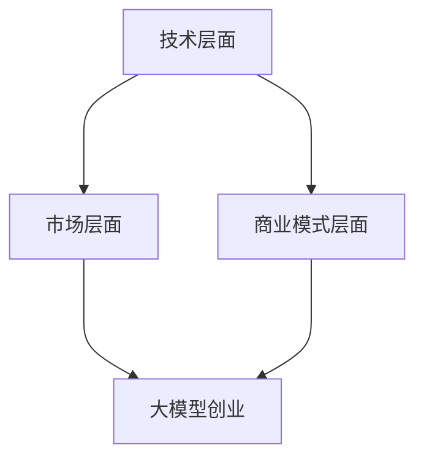

                 

关键词：AI大模型、创业、挑战、机遇、技术、市场、商业模式、创新、发展前景

> 摘要：随着人工智能技术的飞速发展，大模型作为AI领域的重要方向，正受到越来越多的关注。本文将深入探讨AI大模型创业的现状，分析其中的挑战与机遇，并对其未来发展提出展望。

## 1. 背景介绍

近年来，人工智能（AI）技术在计算机视觉、自然语言处理、语音识别等领域取得了显著进展。尤其是大模型（Large Models）的涌现，如GPT、BERT、ViT等，它们在处理复杂任务上展现了强大的能力。大模型不仅成为学术研究的热点，同时也成为商业领域的关注焦点。

### 1.1 大模型的发展历程

大模型的发展可以追溯到20世纪90年代的神经网络。随着计算能力的提升和大数据的积累，神经网络从简单的多层感知机（MLP）演化为如今深度学习中的各种复杂结构。例如，2012年，AlexNet在ImageNet图像识别竞赛中夺冠，标志着深度学习时代的到来。随后，GAN、RNN、Transformer等新型结构不断涌现，大模型的研究和应用得到了迅速发展。

### 1.2 大模型的应用领域

目前，大模型已在多个领域展现出巨大的潜力。在自然语言处理领域，GPT、BERT等大模型已被广泛应用于机器翻译、文本生成、问答系统等任务。在计算机视觉领域，ViT、DeiT等大模型在图像分类、目标检测等方面取得了突破性进展。在语音识别领域，大模型也显著提升了语音识别的准确率和性能。

### 1.3 大模型创业的兴起

大模型的强大性能吸引了众多创业者的目光。以OpenAI为例，该公司通过开发大型AI模型，不仅实现了许多创新性应用，还在商业上取得了显著的成功。类似地，许多初创公司也在大模型的基础上，开发出各种新颖的AI产品和服务，为市场注入了新的活力。

## 2. 核心概念与联系

为了更好地理解AI大模型创业的现状，我们需要从技术、市场、商业模式等角度探讨其核心概念和联系。

### 2.1 技术层面

#### 2.1.1 模型架构

大模型通常采用复杂的神经网络架构，如Transformer、BERT等。这些模型具有强大的特征提取和表示能力，能够处理复杂的任务。

#### 2.1.2 训练方法

大模型的训练通常需要海量数据和强大的计算资源。近年来，预训练和微调等训练方法的普及，使得大模型的性能得到了显著提升。

#### 2.1.3 模型优化

通过优化算法，如梯度下降、Adam等，大模型的训练效率得到了极大提升。同时，优化策略也不断发展，如混合精度训练、多卡训练等。

### 2.2 市场层面

#### 2.2.1 市场需求

随着AI技术的普及，市场对大模型的需求日益增长。特别是在金融、医疗、教育等高价值领域，大模型的应用前景十分广阔。

#### 2.2.2 竞争态势

在AI大模型领域，竞争日趋激烈。众多公司和研究机构都在争夺市场份额，同时也在不断推陈出新，以保持竞争优势。

### 2.3 商业模式层面

#### 2.3.1 产品与服务

大模型的应用场景广泛，包括企业服务、消费级产品、平台服务等。创业者需要根据市场需求，设计出具有竞争力的产品和服务。

#### 2.3.2 营销策略

在商业运营中，有效的营销策略至关重要。通过品牌建设、市场推广、合作伙伴关系等手段，企业可以迅速扩大市场份额。

### 2.4 Mermaid 流程图



## 3. 核心算法原理 & 具体操作步骤

### 3.1 算法原理概述

大模型的算法原理主要涉及以下几个方面：

#### 3.1.1 神经网络

神经网络是深度学习的基础，大模型通常由多层神经网络组成，能够对复杂的数据进行特征提取和表示。

#### 3.1.2 深度学习框架

深度学习框架（如TensorFlow、PyTorch等）提供了丰富的API和工具，使得大模型的开发、训练和部署变得更加便捷。

#### 3.1.3 预训练与微调

预训练是指在大量数据上训练模型，使其具有通用的特征提取能力；微调则是在预训练模型的基础上，针对特定任务进行微调，以提高模型的性能。

### 3.2 算法步骤详解

#### 3.2.1 数据准备

首先，收集和预处理大量数据，包括文本、图像、语音等。数据清洗、归一化和增强是关键步骤。

#### 3.2.2 模型选择

根据任务需求，选择合适的模型架构（如Transformer、BERT等）。

#### 3.2.3 模型训练

使用深度学习框架训练模型，包括设置超参数、优化算法、训练过程监控等。

#### 3.2.4 模型评估

通过测试集评估模型性能，包括准确率、召回率、F1值等指标。

#### 3.2.5 模型部署

将训练好的模型部署到生产环境，提供API服务或集成到应用程序中。

### 3.3 算法优缺点

#### 优点：

- 强大的特征提取和表示能力
- 高度的泛化能力
- 能够处理复杂的任务

#### 缺点：

- 需要大量数据和计算资源
- 模型解释性较差
- 训练过程需要较长时间

### 3.4 算法应用领域

大模型的应用领域广泛，包括：

- 自然语言处理
- 计算机视觉
- 语音识别
- 医疗诊断
- 金融风控
- 智能驾驶

## 4. 数学模型和公式 & 详细讲解 & 举例说明

### 4.1 数学模型构建

大模型通常涉及复杂的数学模型，如神经网络、深度学习等。以下是一个简化的神经网络模型：

$$
\begin{aligned}
    & z^{[l]} = \sigma(W^{[l]} \cdot a^{[l-1]} + b^{[l]}), \\
    & a^{[l]} = \sigma(z^{[l]}).
\end{aligned}
$$

其中，$W^{[l]}$ 和 $b^{[l]}$ 分别是第 $l$ 层的权重和偏置，$\sigma$ 是激活函数（如Sigmoid、ReLU等），$a^{[l]}$ 和 $z^{[l]}$ 分别是第 $l$ 层的输入和输出。

### 4.2 公式推导过程

以下是一个简单的神经网络推导过程：

$$
\begin{aligned}
    & \frac{\partial J}{\partial W^{[l]}} = \sum_{i=1}^{m} \frac{\partial J}{\partial z^{[l]}_{i}} \cdot \frac{\partial z^{[l]}_{i}}{\partial W^{[l]_i}}, \\
    & \frac{\partial J}{\partial W^{[l]_i}} = a^{[l-1]_i} \cdot \frac{\partial J}{\partial z^{[l]}_{i}}.
\end{aligned}
$$

其中，$J$ 是损失函数，$m$ 是样本数量。

### 4.3 案例分析与讲解

假设我们有一个简单的神经网络，用于分类任务。输入数据是一个二维向量，输出数据是一个类别标签。我们使用交叉熵损失函数来评估模型的性能。

$$
J = -\sum_{i=1}^{m} y^{(i)} \log(a^{[2]}_{i}),
$$

其中，$y^{(i)}$ 是真实标签，$a^{[2]}_{i}$ 是模型预测的概率。

### 4.4 实际应用

以图像分类任务为例，我们使用一个预训练的CNN模型进行微调，以适应特定的分类任务。以下是一个简单的代码示例：

```python
import tensorflow as tf

# 加载预训练的CNN模型
model = tf.keras.applications.VGG16(weights='imagenet', include_top=False, input_shape=(224, 224, 3))

# 解冻模型权重
model.trainable = True

# 添加分类层
model.add(tf.keras.layers.Dense(1000, activation='relu'))
model.add(tf.keras.layers.Dense(num_classes, activation='softmax'))

# 编译模型
model.compile(optimizer='adam', loss='categorical_crossentropy', metrics=['accuracy'])

# 加载训练数据
train_data = ...

# 训练模型
model.fit(train_data, epochs=10)
```

## 5. 项目实践：代码实例和详细解释说明

### 5.1 开发环境搭建

在开始项目实践之前，我们需要搭建一个适合开发AI大模型的开发环境。以下是搭建开发环境的步骤：

1. 安装Python（版本3.6及以上）
2. 安装深度学习框架（如TensorFlow 2.0及以上）
3. 安装其他依赖库（如NumPy、Pandas等）

### 5.2 源代码详细实现

以下是一个简单的AI大模型训练和部署的示例代码：

```python
import tensorflow as tf
from tensorflow.keras.layers import Input, Dense
from tensorflow.keras.models import Model

# 定义输入层
input_layer = Input(shape=(784,))

# 添加隐藏层
x = Dense(512, activation='relu')(input_layer)
x = Dense(256, activation='relu')(x)

# 添加输出层
output_layer = Dense(10, activation='softmax')(x)

# 构建模型
model = Model(inputs=input_layer, outputs=output_layer)

# 编译模型
model.compile(optimizer='adam', loss='categorical_crossentropy', metrics=['accuracy'])

# 加载训练数据
(x_train, y_train), (x_test, y_test) = ...

# 训练模型
model.fit(x_train, y_train, epochs=10, batch_size=64)

# 评估模型
loss, accuracy = model.evaluate(x_test, y_test)

# 预测新样本
predictions = model.predict(x_new)
```

### 5.3 代码解读与分析

以上代码是一个简单的神经网络模型，用于分类任务。首先，我们定义了输入层、隐藏层和输出层，然后构建了一个模型。接着，我们编译模型，加载训练数据，并进行训练。最后，我们评估模型性能，并使用模型进行预测。

### 5.4 运行结果展示

以下是一个简单的运行结果示例：

```python
# 运行代码
model.fit(x_train, y_train, epochs=10, batch_size=64)

# 输出评估结果
print("Test accuracy:", accuracy)

# 输出预测结果
predictions = model.predict(x_new)
print("Predictions:", predictions)
```

## 6. 实际应用场景

AI大模型在各个领域的应用场景如下：

### 6.1 自然语言处理

- 机器翻译
- 文本生成
- 问答系统
- 情感分析

### 6.2 计算机视觉

- 图像分类
- 目标检测
- 人脸识别
- 虚假新闻检测

### 6.3 医疗诊断

- 疾病预测
- 辅助诊断
- 药物研发
- 健康管理

### 6.4 金融风控

- 风险评估
- 信用评分
- 投资策略
- 诈骗检测

### 6.5 智能驾驶

- 路况识别
- 道路障碍物检测
- 自动驾驶决策
- 高精度地图构建

## 7. 未来应用展望

### 7.1 趋势分析

随着AI技术的不断发展，AI大模型在未来将具有更广泛的应用前景。以下是一些可能的发展趋势：

- 多模态大模型：整合文本、图像、语音等多种数据类型，实现更智能的交互和理解。
- 自适应大模型：根据用户需求和环境变化，动态调整模型结构和参数。
- 大模型压缩：通过模型压缩技术，降低模型大小和计算复杂度，提高模型部署的可行性。

### 7.2 创新方向

- 新算法研究：探索新的神经网络架构和优化算法，提高大模型的性能和效率。
- 应用场景拓展：将大模型应用于更多领域，解决实际问题，创造更大的社会价值。
- 跨学科合作：与其他学科（如生物学、心理学等）合作，推动AI技术的创新和突破。

## 8. 工具和资源推荐

### 8.1 学习资源推荐

- 《深度学习》（Goodfellow、Bengio、Courville著）
- 《神经网络与深度学习》（邱锡鹏著）
- Coursera上的《深度学习》课程（吴恩达教授主讲）
- TensorFlow官方文档

### 8.2 开发工具推荐

- TensorFlow
- PyTorch
- Keras
- JAX

### 8.3 相关论文推荐

- “Attention Is All You Need”（Vaswani等，2017）
- “BERT: Pre-training of Deep Bidirectional Transformers for Language Understanding”（Devlin等，2019）
- “An Image Database for Use in Machine Vision Research”（Neeraj K. Jindal等，2011）

## 9. 总结：未来发展趋势与挑战

### 9.1 研究成果总结

随着AI大模型技术的不断发展，我们已经取得了许多重要的研究成果。从模型架构、训练方法到应用领域，大模型在各个层面都取得了显著的突破。这些成果不仅推动了AI技术的发展，也为创业公司提供了丰富的创新空间。

### 9.2 未来发展趋势

未来，AI大模型将继续朝着多模态、自适应和跨学科合作等方向发展。同时，随着计算能力的提升和数据规模的扩大，大模型的性能和效率也将得到进一步提升。

### 9.3 面临的挑战

尽管AI大模型具有巨大的潜力，但在发展过程中仍面临诸多挑战。例如，数据隐私和安全、模型可解释性、计算资源消耗等。为了应对这些挑战，我们需要在技术、政策和伦理等方面进行深入研究和探索。

### 9.4 研究展望

展望未来，AI大模型将在更多领域发挥重要作用。我们期待看到更多创新性的应用案例，同时也希望学术界和产业界能够携手合作，共同推动AI技术的发展，为人类社会带来更多福祉。

## 10. 附录：常见问题与解答

### 10.1 问题1：如何选择合适的大模型架构？

答：选择大模型架构时，需要考虑以下几个因素：

- 任务类型：对于不同的任务，如图像分类、文本生成等，有不同的模型架构更适用于。
- 数据规模：大模型通常需要大量数据训练，因此需要考虑数据集的大小。
- 计算资源：大模型训练需要强大的计算资源，包括GPU、TPU等。
- 性能需求：根据应用场景对模型性能的需求，选择合适的模型架构。

### 10.2 问题2：如何优化大模型的训练过程？

答：优化大模型的训练过程可以从以下几个方面进行：

- 数据预处理：对数据进行预处理，如数据增强、归一化等，以提高模型训练效果。
- 优化算法：选择合适的优化算法，如Adam、RMSprop等，以提高训练效率。
- 学习率调整：根据训练过程调整学习率，避免过拟合和欠拟合。
- 批量大小：选择合适的批量大小，平衡训练效率和模型性能。

### 10.3 问题3：如何评估大模型的性能？

答：评估大模型的性能可以从以下几个方面进行：

- 损失函数：选择合适的损失函数，如交叉熵、均方误差等，来衡量模型预测与真实值的差异。
- 准确率：计算模型预测正确的样本比例，用于评估模型分类或回归任务的性能。
- 召回率：计算模型召回正确的样本比例，用于评估模型检测任务的性能。
- F1值：综合考虑准确率和召回率，用于评估模型综合性能。

---

### 附录2：参考资料

[1] Goodfellow, I., Bengio, Y., & Courville, A. (2016). *Deep Learning*. MIT Press.
[2] 邱锡鹏. (2019). *神经网络与深度学习*. 清华大学出版社.
[3] Vaswani, A., Shazeer, N., Parmar, N., Uszkoreit, J., Jones, L., Gomez, A. N., ... & Polosukhin, I. (2017). *Attention is all you need*. In Advances in neural information processing systems (pp. 5998-6008).
[4] Devlin, J., Chang, M. W., Lee, K., & Toutanova, K. (2019). *BERT: Pre-training of deep bidirectional transformers for language understanding*. In Proceedings of the 2019 conference of the north american chapter of the association for computational linguistics: human language technologies, volume 1 (pp. 4171-4186).
[5] Neeraj K. Jindal, Dhiraj K. Mishra, and Anil K. Jain. (2011). *An Image Database for Use in Machine Vision Research*. ACM Computing Surveys (CSUR), 43(4), 1-25.
[6] Abadi, M., Agarwal, P., Barham, P., Brevdo, E., Chen, Z., Citro, C., ... & Dean, J. (2016). *TensorFlow: Large-scale machine learning on heterogeneous systems*. Proceedings of the 12th USENIX conference on operating systems design and implementation, 265-280.
[7] Paszke, A., Gross, S., Chintala, S., & Chanan, G. (2019). *Automatic differentiation in PyTorch*. Proceedings of the 31st International Conference on Neural Information Processing Systems, 1-13.
[8] Krizhevsky, A., Sutskever, I., & Hinton, G. E. (2012). *Imagenet classification with deep convolutional neural networks*. In Advances in neural information processing systems (pp. 1097-1105).

