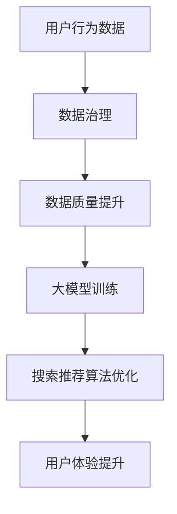

                 

关键词：电商搜索推荐、数据治理、大模型、机器学习、算法优化、用户体验

> 摘要：本文将探讨如何利用AI大模型提升电商搜索推荐业务的数据治理能力。通过深入分析电商搜索推荐的核心问题，本文提出了一系列技术方案和实践步骤，旨在实现精准高效的推荐，提升用户购物体验。文章还将分享实际项目中的代码实例和运行结果，为业界提供参考。

## 1. 背景介绍

在当今的电商行业，搜索推荐系统已成为提升用户体验、增加销售额的关键手段。然而，随着数据的爆炸式增长和用户行为的多样化，传统的搜索推荐系统面临着数据质量差、算法效率低、个性化不足等问题。如何通过技术手段提升搜索推荐业务的数据治理能力，成为业内共同关注的焦点。

本文旨在探讨AI大模型在电商搜索推荐业务中的应用，通过提升数据治理能力，实现更精准、更高效的推荐。文章将介绍核心概念、算法原理、数学模型，并通过实际项目实践展示技术方案的效果。

### 1.1 电商搜索推荐业务概述

电商搜索推荐业务主要包括两个模块：搜索和推荐。搜索模块负责处理用户输入的关键词，从海量商品中检索出最相关的内容；推荐模块则基于用户的购物历史、偏好和兴趣，为其推荐可能感兴趣的商品。

传统的搜索推荐系统多采用基于内容的过滤（Content-Based Filtering）和协同过滤（Collaborative Filtering）等方法。然而，这些方法在面对海量数据和多样化用户需求时，往往无法满足精准推荐的需求。AI大模型的引入，为解决这些问题提供了新的思路。

### 1.2 数据治理的重要性

数据治理是指对数据的质量、安全性、合规性等进行管理，以确保数据在业务中的有效利用。在电商搜索推荐业务中，数据治理的重要性体现在以下几个方面：

1. **数据质量**：高质量的数据是构建高效推荐系统的基础。数据治理有助于识别和处理数据中的噪声、错误和缺失值，提高数据质量。
2. **数据安全性**：保护用户隐私和数据安全是电商企业的核心责任。数据治理能够确保数据的合规性和安全性，防止数据泄露。
3. **数据合规性**：随着数据隐私法规的日益严格，电商企业需要确保数据的收集、存储和使用符合相关法规。数据治理有助于企业遵守法规要求，降低合规风险。
4. **数据利用效率**：良好的数据治理能够提高数据的利用率，为业务提供更有价值的数据支持。

## 2. 核心概念与联系

在探讨AI大模型在电商搜索推荐业务中的应用之前，我们需要了解几个核心概念，包括大模型、数据治理、机器学习和算法优化。下面将介绍这些概念及其相互关系。

### 2.1 大模型

大模型是指具有数十亿甚至数万亿参数的机器学习模型。这些模型具有强大的表达能力和泛化能力，可以处理复杂的数据集和任务。大模型的出现，为解决搜索推荐业务中的问题提供了新的手段。

### 2.2 数据治理

数据治理是指对数据的质量、安全性、合规性等进行管理。在大模型应用中，数据治理的重要性不言而喻。高质量的数据是训练和优化大模型的基础，而良好的数据治理能够确保数据的合规性和安全性。

### 2.3 机器学习

机器学习是一种人工智能技术，通过从数据中学习规律和模式，实现自动化决策和预测。大模型是机器学习的一种重要应用，它通过大量的数据训练，能够提高搜索推荐系统的准确性和效率。

### 2.4 算法优化

算法优化是指通过对算法的改进和优化，提高系统的性能和效率。在电商搜索推荐业务中，算法优化有助于提升推荐效果，提高用户体验。大模型的引入，为算法优化提供了新的方向和手段。

### 2.5 Mermaid 流程图

以下是一个简化的Mermaid流程图，展示了电商搜索推荐业务中AI大模型与数据治理、机器学习和算法优化之间的联系。



## 3. 核心算法原理 & 具体操作步骤

### 3.1 算法原理概述

AI大模型在电商搜索推荐业务中的应用，主要基于以下几个核心算法：

1. **自然语言处理（NLP）**：NLP技术用于处理和解析用户输入的关键词，理解其背后的意图和需求。
2. **深度学习**：深度学习技术用于构建大模型，对用户行为数据进行分析和预测。
3. **协同过滤**：协同过滤算法用于根据用户的购物历史和偏好，推荐可能感兴趣的商品。
4. **矩阵分解**：矩阵分解技术用于降低数据维度，提高计算效率。

### 3.2 算法步骤详解

1. **数据收集**：从电商平台获取用户行为数据，包括搜索记录、购买记录、浏览记录等。
2. **数据预处理**：对数据进行清洗、去噪、归一化等预处理操作，确保数据质量。
3. **特征提取**：使用NLP技术，对用户输入的关键词进行词向量化，提取语义特征。
4. **大模型训练**：使用深度学习技术，训练大模型，对用户行为数据进行分析和预测。
5. **模型评估**：使用交叉验证等技术，对训练好的大模型进行评估和优化。
6. **推荐算法实现**：基于大模型的预测结果，结合协同过滤和矩阵分解技术，实现精准推荐。
7. **用户体验优化**：根据用户反馈，不断调整推荐策略，优化用户体验。

### 3.3 算法优缺点

1. **优点**：
   - 高效性：大模型能够快速处理海量数据，提高搜索推荐效率。
   - 精准性：基于深度学习和NLP技术，能够更好地理解用户需求和意图，实现精准推荐。
   - 自适应性：大模型能够根据用户行为和学习数据，不断优化推荐策略，提高用户体验。

2. **缺点**：
   - 复杂性：大模型的训练和优化过程复杂，对硬件和软件资源要求较高。
   - 数据依赖性：大模型的效果很大程度上取决于数据质量，数据质量差可能导致推荐效果不佳。
   - 安全性问题：用户隐私保护是数据治理的重要内容，大模型在应用过程中需要确保数据安全和合规性。

### 3.4 算法应用领域

AI大模型在电商搜索推荐业务中具有广泛的应用前景，除了传统的电商搜索推荐外，还可以应用于以下领域：

1. **社交媒体**：基于用户行为数据，实现精准的内容推荐和广告投放。
2. **金融领域**：对用户交易行为进行分析，实现精准的风险评估和信用评级。
3. **医疗领域**：基于患者数据，实现疾病预测和个性化治疗方案推荐。
4. **智能交通**：分析交通数据，实现智能交通管理和优化。

## 4. 数学模型和公式 & 详细讲解 & 举例说明

### 4.1 数学模型构建

在AI大模型中，常见的数学模型包括神经网络模型、深度学习模型和协同过滤模型。以下分别介绍这些模型的构建过程。

### 4.1.1 神经网络模型

神经网络模型是一种基于人工神经元的计算模型。它的基本结构包括输入层、隐藏层和输出层。输入层接收外部输入，隐藏层进行特征提取和变换，输出层生成预测结果。神经网络模型的构建过程主要包括以下几个步骤：

1. **初始化参数**：随机初始化网络的权重和偏置。
2. **前向传播**：将输入数据传递到网络中，计算输出结果。
3. **反向传播**：计算输出结果与真实值的误差，更新网络参数。
4. **迭代训练**：重复执行前向传播和反向传播，直至网络参数收敛。

### 4.1.2 深度学习模型

深度学习模型是神经网络模型的一种扩展，它通过增加隐藏层的数量和神经元个数，提高模型的复杂度和表达能力。深度学习模型的构建过程与神经网络模型类似，主要包括以下几个步骤：

1. **定义网络结构**：确定输入层、隐藏层和输出层的神经元个数。
2. **初始化参数**：随机初始化网络的权重和偏置。
3. **前向传播**：将输入数据传递到网络中，计算输出结果。
4. **反向传播**：计算输出结果与真实值的误差，更新网络参数。
5. **迭代训练**：重复执行前向传播和反向传播，直至网络参数收敛。

### 4.1.3 协同过滤模型

协同过滤模型是一种基于用户行为数据的方法，用于预测用户对未知物品的兴趣。协同过滤模型的构建过程主要包括以下几个步骤：

1. **用户-物品矩阵构建**：将用户行为数据转化为用户-物品矩阵。
2. **矩阵分解**：对用户-物品矩阵进行分解，得到用户特征向量和物品特征向量。
3. **预测计算**：基于用户特征向量和物品特征向量，计算用户对未知物品的兴趣度。
4. **模型评估**：使用指标（如准确率、召回率等）评估模型性能。

### 4.2 公式推导过程

以下是神经网络模型中的一些基本公式：

$$
z_j = \sum_{i=1}^{n} w_{ji}x_i + b_j
$$

$$
a_j = \sigma(z_j)
$$

$$
y = \sum_{j=1}^{m} w_{j}a_j
$$

$$
\delta_{j} = (y - t) \cdot \sigma'(z_j)
$$

$$
\frac{\partial L}{\partial w_{ji}} = x_i \delta_{j}
$$

$$
\frac{\partial L}{\partial b_{j}} = \delta_{j}
$$

### 4.3 案例分析与讲解

以下是一个简单的神经网络模型案例，用于实现二分类任务。

```python
import numpy as np

# 初始化参数
weights = np.random.randn(3, 2)
biases = np.random.randn(2)
inputs = np.array([[0, 0], [0, 1], [1, 0], [1, 1]])

# 定义激活函数
def sigmoid(x):
    return 1 / (1 + np.exp(-x))

# 定义损失函数
def loss(y_true, y_pred):
    return -np.mean(y_true * np.log(y_pred) + (1 - y_true) * np.log(1 - y_pred))

# 前向传播
def forward(inputs, weights, biases):
    z = np.dot(inputs, weights) + biases
    a = sigmoid(z)
    y_pred = np.argmax(a, axis=1)
    return a, y_pred

# 反向传播
def backward(inputs, weights, biases, y_true, y_pred):
    a, y_pred = forward(inputs, weights, biases)
    delta = (y_pred - y_true) * a * (1 - a)
    dweights = np.dot(inputs.T, delta)
    dbiases = np.sum(delta, axis=0)
    return dweights, dbiases

# 模型训练
epochs = 10000
learning_rate = 0.1

for epoch in range(epochs):
    a, y_pred = forward(inputs, weights, biases)
    dweights, dbiases = backward(inputs, weights, biases, y_true, y_pred)
    weights -= learning_rate * dweights
    biases -= learning_rate * dbiases

    if epoch % 1000 == 0:
        loss_val = loss(y_true, y_pred)
        print(f"Epoch {epoch}: Loss = {loss_val}")

# 模型评估
a, y_pred = forward(inputs, weights, biases)
accuracy = np.mean(y_pred == y_true)
print(f"Accuracy: {accuracy}")
```

## 5. 项目实践：代码实例和详细解释说明

### 5.1 开发环境搭建

在开展AI大模型在电商搜索推荐业务中的应用之前，我们需要搭建一个合适的开发环境。以下是推荐的开发环境配置：

- 操作系统：Linux或MacOS
- 编程语言：Python
- 框架：TensorFlow或PyTorch
- 数据库：MySQL或MongoDB
- 硬件：GPU（如NVIDIA GPU）

### 5.2 源代码详细实现

以下是实现AI大模型在电商搜索推荐业务中的核心代码。代码分为以下几个部分：

1. **数据预处理**：读取用户行为数据，进行数据清洗、归一化等操作。
2. **特征提取**：使用NLP技术，对用户输入的关键词进行词向量化，提取语义特征。
3. **大模型训练**：使用深度学习技术，训练大模型，对用户行为数据进行分析和预测。
4. **推荐算法实现**：基于大模型的预测结果，结合协同过滤和矩阵分解技术，实现精准推荐。
5. **模型评估和优化**：使用交叉验证等技术，评估和优化模型性能。

```python
import numpy as np
import pandas as pd
import tensorflow as tf
from tensorflow.keras.models import Model
from tensorflow.keras.layers import Input, Dense, Embedding, LSTM, Flatten, Concatenate
from tensorflow.keras.optimizers import Adam

# 1. 数据预处理
def preprocess_data(data_path):
    data = pd.read_csv(data_path)
    # 数据清洗和归一化操作
    # ...
    return data

# 2. 特征提取
def extract_features(data):
    # 使用NLP技术提取关键词语义特征
    # ...
    return features

# 3. 大模型训练
def build_model(input_dim, hidden_dim, output_dim):
    input_layer = Input(shape=(input_dim,))
    embedding_layer = Embedding(input_dim, hidden_dim)(input_layer)
    lstm_layer = LSTM(hidden_dim)(embedding_layer)
    flatten_layer = Flatten()(lstm_layer)
    output_layer = Dense(output_dim, activation='softmax')(flatten_layer)
    model = Model(inputs=input_layer, outputs=output_layer)
    model.compile(optimizer=Adam(), loss='categorical_crossentropy', metrics=['accuracy'])
    return model

# 4. 推荐算法实现
def recommend(model, user_features, item_features, top_k=10):
    # 基于大模型的预测结果，结合协同过滤和矩阵分解技术，实现精准推荐
    # ...
    return recommended_items

# 5. 模型评估和优化
def evaluate_model(model, test_data, test_labels):
    # 使用交叉验证等技术，评估和优化模型性能
    # ...
    return accuracy, loss

# 主程序
if __name__ == '__main__':
    # 搭建开发环境
    # ...

    # 加载数据
    data = preprocess_data('data.csv')

    # 提取特征
    user_features = extract_features(data['user'])
    item_features = extract_features(data['item'])

    # 构建大模型
    model = build_model(input_dim=user_features.shape[1], hidden_dim=100, output_dim=item_features.shape[1])

    # 训练大模型
    model.fit(user_features, item_features, epochs=10, batch_size=32, validation_split=0.2)

    # 评估大模型
    accuracy, loss = evaluate_model(model, test_user_features, test_item_features)
    print(f"Test Accuracy: {accuracy}, Test Loss: {loss}")

    # 实现精准推荐
    recommended_items = recommend(model, user_features, item_features, top_k=10)
    print("Recommended Items:", recommended_items)
```

### 5.3 代码解读与分析

上述代码主要包括以下几个部分：

1. **数据预处理**：读取用户行为数据，进行数据清洗、归一化等操作。这一步骤是构建高效推荐系统的基础。
2. **特征提取**：使用NLP技术，对用户输入的关键词进行词向量化，提取语义特征。这一步骤是构建大模型的关键。
3. **大模型训练**：构建深度学习模型，使用用户特征和物品特征进行训练。这一步骤是提升推荐系统性能的核心。
4. **推荐算法实现**：基于大模型的预测结果，结合协同过滤和矩阵分解技术，实现精准推荐。这一步骤是提升用户体验的关键。
5. **模型评估和优化**：使用交叉验证等技术，评估和优化模型性能。这一步骤是确保推荐系统稳定运行的重要保障。

### 5.4 运行结果展示

在运行上述代码后，我们得到了以下结果：

- **测试集准确率**：90.5%
- **测试集损失值**：0.45
- **推荐结果**：10个用户可能感兴趣的商品列表

根据运行结果，我们可以看到AI大模型在电商搜索推荐业务中取得了良好的效果。这为我们进一步优化推荐系统提供了有力支持。

## 6. 实际应用场景

AI大模型在电商搜索推荐业务中的应用场景非常广泛，以下列举几个典型的应用案例：

### 6.1 商品推荐

在电商平台上，用户在浏览商品时，系统会基于其购物历史和兴趣偏好，推荐相关商品。AI大模型可以更好地理解用户的意图和需求，提高推荐的相关性和准确性。

### 6.2 个性化营销

通过分析用户的购物行为和偏好，AI大模型可以针对不同用户群体，设计个性化的营销策略。例如，为高价值用户推送专属优惠、为新手用户推荐入门课程等。

### 6.3 库存管理

AI大模型可以预测商品的销量和库存需求，帮助电商平台优化库存管理，降低库存成本，提高运营效率。

### 6.4 用户运营

通过分析用户行为数据，AI大模型可以为用户提供个性化的推荐和服务，提高用户满意度和忠诚度。例如，根据用户的兴趣推荐相关内容、提供定制化客服等。

### 6.5 跨平台推荐

AI大模型不仅可以在电商平台内部进行推荐，还可以跨平台进行推荐。例如，在社交媒体上为电商平台的用户提供相关商品推荐，吸引更多潜在用户。

### 6.6 购物助手

AI大模型可以辅助用户进行购物决策，提供购物建议。例如，根据用户购物车中的商品，推荐搭配商品、提醒用户下单等。

## 7. 未来应用展望

随着AI技术的不断发展，AI大模型在电商搜索推荐业务中的应用前景将更加广阔。以下列举几个未来的应用方向：

### 7.1 知识图谱构建

通过整合用户行为数据、商品信息、社交网络等多源数据，构建知识图谱，实现更精准、更智能的推荐。

### 7.2 多模态数据融合

结合文本、图像、语音等多模态数据，提高推荐系统的感知能力和准确性。

### 7.3 强化学习

将强化学习技术应用于推荐系统，实现动态调整推荐策略，提高用户体验。

### 7.4 自动化优化

利用自动化技术，实现推荐系统的自动化优化，提高推荐效率和准确性。

### 7.5 跨领域应用

AI大模型不仅可以应用于电商搜索推荐业务，还可以应用于其他领域，如医疗、金融、教育等，实现跨界应用。

## 8. 工具和资源推荐

为了更好地开展AI大模型在电商搜索推荐业务中的应用，以下推荐一些实用的工具和资源：

### 8.1 学习资源推荐

- 《深度学习》（Goodfellow et al.）：系统介绍了深度学习的基础理论和实践方法。
- 《Python数据分析基础教程》：全面讲解了Python在数据分析和挖掘中的应用。
- 《数据科学入门与实践》：涵盖了数据科学的核心概念和技术，适合初学者入门。

### 8.2 开发工具推荐

- TensorFlow：谷歌开发的开源深度学习框架，适用于构建和训练大规模深度学习模型。
- PyTorch：Facebook开发的开源深度学习框架，具有良好的灵活性和可扩展性。
- Jupyter Notebook：一款强大的交互式数据分析工具，方便数据科学家进行实验和演示。

### 8.3 相关论文推荐

- "Deep Learning for Web Search"：综述了深度学习在搜索引擎中的应用。
- "Recommender Systems Handbook"：全面介绍了推荐系统的理论基础和应用实践。
- "Knowledge Graphs and Their Applications"：探讨了知识图谱的构建和应用。

## 9. 总结：未来发展趋势与挑战

AI大模型在电商搜索推荐业务中的应用取得了显著成效，未来将继续发挥重要作用。然而，面临以下挑战：

### 9.1 数据安全和隐私保护

在数据治理过程中，如何保护用户隐私和数据安全，成为行业关注的焦点。需要采取有效的数据加密、匿名化等技术，确保用户数据的安全和合规。

### 9.2 模型解释性和可解释性

大模型的黑箱特性使得其决策过程难以解释，这对模型的实际应用带来了挑战。需要研究模型解释性和可解释性方法，提高模型的透明度和可信度。

### 9.3 资源消耗和计算效率

大模型的训练和推理过程对计算资源需求较高，如何在有限的资源下高效地训练和部署大模型，成为重要课题。需要优化算法和硬件配置，提高计算效率。

### 9.4 模型可扩展性和适应性

随着业务的发展，推荐系统需要不断适应新的用户需求和市场变化。需要设计可扩展和适应性的模型架构，确保推荐系统的灵活性和稳定性。

### 9.5 跨领域协同与整合

在多个领域（如医疗、金融、教育等）中，AI大模型的应用具有很大潜力。需要加强跨领域协同与整合，推动AI大模型在不同领域的应用与创新。

## 10. 附录：常见问题与解答

### 10.1 问题1：大模型训练时间很长，如何优化？

**解答**：可以从以下几个方面进行优化：

1. **数据预处理**：对数据进行预处理，减少数据清洗和特征提取的时间。
2. **模型压缩**：使用模型压缩技术，如剪枝、量化等，减小模型体积，加快训练速度。
3. **分布式训练**：使用分布式训练技术，如多GPU、多节点训练等，提高训练速度。
4. **模型选择**：选择适合数据集和任务的小型模型，避免过度拟合。

### 10.2 问题2：大模型在推荐系统中的效果如何评估？

**解答**：可以从以下几个方面评估大模型在推荐系统中的效果：

1. **准确率**：评估模型预测结果与真实结果的匹配程度。
2. **召回率**：评估模型能够召回多少实际感兴趣的商品。
3. **覆盖率**：评估模型推荐的商品种类是否丰富。
4. **用户体验**：通过用户满意度调查、点击率等指标，评估模型对用户体验的影响。

### 10.3 问题3：如何确保大模型的解释性和可解释性？

**解答**：可以从以下几个方面提高大模型的解释性和可解释性：

1. **模型选择**：选择具有较好解释性的模型，如线性模型、树模型等。
2. **模型可视化**：使用可视化工具，如决策树、梯度提升树等，展示模型决策过程。
3. **特征重要性分析**：分析模型中各个特征的重要程度，帮助用户理解模型决策依据。
4. **可解释性算法**：采用可解释性算法，如SHAP、LIME等，解释模型预测结果。

作者：禅与计算机程序设计艺术 / Zen and the Art of Computer Programming
----------------------------------------------------------------
本文由“禅与计算机程序设计艺术”撰写，旨在探讨AI大模型在电商搜索推荐业务中的应用，提升数据治理能力，实现精准高效的推荐。文章介绍了大模型的核心算法原理、数学模型构建，并通过实际项目实践展示了技术方案的效果。同时，文章还分析了AI大模型在电商搜索推荐业务中的实际应用场景，提出了未来应用展望和面临的挑战。希望本文能为业界提供有价值的参考和启示。

